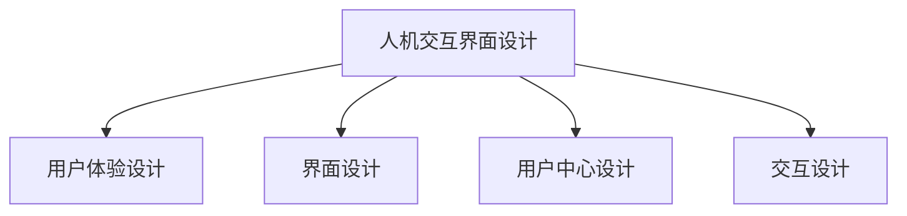

                 

# 第十章：人机交互界面设计

## 1. 背景介绍

### 1.1 问题由来
随着人工智能技术的迅猛发展，人机交互界面设计（Human-Computer Interaction, HCI）已经成为信息技术和用户体验设计的核心领域。如何设计出直观、高效、愉悦的用户界面，成为了人工智能产品开发的关键挑战。

### 1.2 问题核心关键点
界面设计的目标在于最大化信息传递的效率和用户体验的满意度。界面设计不仅包括视觉和布局的优化，还涵盖了交互流程、用户行为和心理模型的理解。界面设计的效果直接影响用户是否愿意持续使用产品，进而影响业务效果。

### 1.3 问题研究意义
优秀的界面设计能够显著提升用户满意度和产品竞争力，带来商业价值和品牌效应。通过对界面设计的深入研究，可以更好地把握用户需求，促进产品创新和迭代。

## 2. 核心概念与联系

### 2.1 核心概念概述

为更好地理解人机交互界面设计的原理和实现，本节将介绍几个关键的概念：

- 人机交互界面设计(Human-Computer Interaction Design, HCI Design)：涉及用户界面、交互流程、用户心理模型等方面的设计和优化，以提升用户体验和信息传递效率。
- 用户体验设计(User Experience Design, UX Design)：关注用户在使用产品时的情感体验和满意度，通过设计直观、易用的界面和交互方式，提升用户粘性和产品口碑。
- 界面设计(UI Design)：专注于界面布局、视觉风格、元素选择等方面的设计，确保界面美观、易用、一致。
- 用户中心设计(User-Centered Design, UCD)：以用户需求为核心，通过用户研究、原型测试、用户反馈等环节，不断迭代优化产品设计。
- 交互设计(Interaction Design)：关注用户与系统的交互过程，优化界面响应、操作方式、反馈机制，提升交互流畅性。

这些核心概念之间的逻辑关系可以通过以下Mermaid流程图来展示：

这个流程图展示了人机交互界面设计的主要组成部分和相互关系：

1. 界面设计负责用户界面的视觉和布局，确保美观和易用。
2. 用户体验设计关注用户在使用产品时的情感和满意度。
3. 用户中心设计以用户需求为核心，通过反复迭代优化设计。
4. 交互设计专注于用户与系统的交互过程，优化响应和操作方式。

这些概念共同构成了人机交互界面设计的框架，使其能够更好地满足用户需求，提升用户体验和产品竞争力。

## 3. 核心算法原理 & 具体操作步骤

### 3.1 算法原理概述

人机交互界面设计的核心原理在于通过优化用户界面、交互流程和心理模型，提升信息传递的效率和用户体验的满意度。界面设计的过程通常包括以下几个步骤：

1. 用户研究：通过调查问卷、用户访谈、可用性测试等方式，了解用户需求和行为习惯。
2. 原型设计：根据用户研究结果，设计出初步的界面原型。
3. 迭代优化：在用户反馈的基础上，反复迭代和优化界面设计。
4. 测试评估：通过用户测试，评估界面设计的实际效果，发现并解决设计问题。
5. 部署上线：将优化后的界面设计部署到实际产品中，提升用户体验和产品效果。

### 3.2 算法步骤详解

以下是人机交互界面设计的详细步骤：

**Step 1: 用户研究**
- 使用调查问卷、用户访谈等方式，了解目标用户的基本信息、使用习惯和痛点问题。
- 通过可用性测试，观察用户在使用产品时的行为和表现，发现界面设计和交互流程中的问题。
- 收集用户反馈，分析用户在使用过程中遇到的问题和需求。

**Step 2: 原型设计**
- 根据用户研究结果，设计初步的界面原型，可以使用Sketch、Adobe XD等设计工具。
- 将原型分多个模块进行详细设计，包括页面布局、视觉风格、元素选择等。
- 引入交互设计原则，优化界面响应、操作方式、反馈机制，确保用户操作顺畅。

**Step 3: 迭代优化**
- 在用户测试的基础上，收集用户反馈，进行界面设计的迭代优化。
- 调整页面布局、视觉风格、元素选择等设计元素，提升用户体验和满意度。
- 不断优化交互流程，确保用户能够快速、准确地完成目标任务。

**Step 4: 测试评估**
- 进行用户测试，通过观察用户的操作和反馈，评估界面设计的实际效果。
- 使用可用性指标（如任务完成时间、错误率、用户满意度等）进行量化评估。
- 分析测试结果，发现并解决界面设计和交互流程中的问题。

**Step 5: 部署上线**
- 将优化后的界面设计部署到实际产品中，进行A/B测试，验证效果。
- 收集用户反馈，持续优化界面设计和交互流程，提升用户体验。
- 结合产品数据和用户行为，不断迭代和优化产品界面。

### 3.3 算法优缺点

人机交互界面设计具有以下优点：

- 提升用户体验：通过优化界面设计和交互流程，提升用户满意度和粘性。
- 提升信息传递效率：通过直观易用的界面，提升用户的操作效率和信息获取速度。
- 促进产品创新：以用户需求为核心，不断迭代优化产品设计，带来更多创新点。

同时，该方法也存在一定的局限性：

- 依赖用户数据：界面设计的效果很大程度上取决于用户研究的质量，获取高质量用户数据的成本较高。
- 迭代周期长：界面设计需要反复迭代和测试，时间成本较高，特别是对于复杂产品。
- 设计复杂度大：界面设计涉及视觉、布局、交互等多个方面，设计难度较大。

尽管存在这些局限性，但界面设计仍然是人机交互领域中最核心的设计范式。未来相关研究的方向在于如何进一步降低设计复杂度，提高设计效率，同时兼顾用户需求和产品效果。

### 3.4 算法应用领域

人机交互界面设计的应用领域非常广泛，覆盖了几乎所有信息产品和系统界面。例如：

- 移动应用：设计移动应用的用户界面，优化交互流程，提升用户体验。
- 网站和Web应用：设计网站的页面布局和交互方式，提升用户转化率。
- 智能设备：设计智能设备的界面和交互方式，提升用户操作便捷性。
- 游戏和虚拟现实：设计游戏和虚拟现实的界面和交互流程，提升游戏体验和沉浸感。
- 企业应用：设计企业应用的交互界面，提升员工使用效率和工作满意度。

除了上述这些经典应用外，人机交互界面设计还被创新性地应用到更多场景中，如可穿戴设备、车联网、智能家居等，为人机交互带来了新的体验和可能性。

## 4. 数学模型和公式 & 详细讲解 & 举例说明

### 4.1 数学模型构建

人机交互界面设计通常不需要使用复杂的数学模型，更多依赖于用户研究和设计原则。但在某些特定场景下，可以通过一些数学模型来辅助界面设计。

例如，可以使用信息架构模型（Information Architecture Model）来优化界面布局和信息组织。信息架构模型涉及信息组织、分类和结构化，以提升用户的信息获取效率。

假设用户界面包含 $N$ 个信息块，每个信息块的权重为 $w_i$，用户获取信息的平均时间 $t_i$，总时间 $T$，则信息架构模型的目标函数为：

$$
\min T = \sum_{i=1}^{N} w_i t_i
$$

其中 $w_i$ 表示信息块的重要性，可以通过用户调研和行为数据获取。

### 4.2 公式推导过程

在上述目标函数中，$w_i$ 和 $t_i$ 的值可以通过用户调研和数据分析获得。例如，可以通过问卷调查获取用户对不同信息块的关注度和重要性，通过用户行为数据计算获取每个信息块的平均阅读时间。

例如，假设用户调研结果显示，信息块 $i$ 的重要性 $w_i$ 和平均阅读时间 $t_i$ 如下：

| 信息块编号 | 重要性 $w_i$ | 平均阅读时间 $t_i$ |
|------------|------------|-------------------|
| 1          | 0.3        | 10                |
| 2          | 0.5        | 20                |
| 3          | 0.2        | 5                 |

则总时间 $T$ 的计算公式为：

$$
T = 0.3 \times 10 + 0.5 \times 20 + 0.2 \times 5 = 16
$$

### 4.3 案例分析与讲解

以智能手表的界面设计为例，其界面包含多个功能模块（如信息流、运动数据、消息等），每个模块对用户的价值不同。通过信息架构模型，可以优化界面布局，确保用户可以快速获取到最关心的信息。

假设智能手表界面包含以下功能模块：

- 信息流：展示最近动态和新闻，重要性 $w_1=0.3$，平均阅读时间 $t_1=5$。
- 运动数据：展示运动数据和健康指标，重要性 $w_2=0.5$，平均阅读时间 $t_2=10$。
- 消息：展示好友和社交应用消息，重要性 $w_3=0.2$，平均阅读时间 $t_3=2$。

根据信息架构模型，可以计算出用户获取信息的总时间 $T$ 为：

$$
T = 0.3 \times 5 + 0.5 \times 10 + 0.2 \times 2 = 13.5
$$

为了进一步优化界面布局，可以将信息流和运动数据放在用户最常查看的位置，消息模块放在一侧，以提升用户的操作效率和满意度。

## 5. 项目实践：代码实例和详细解释说明

### 5.1 开发环境搭建

在进行界面设计实践前，我们需要准备好开发环境。以下是使用Adobe XD进行界面设计的环境配置流程：

1. 下载Adobe XD：从官网下载安装包，并安装Adobe XD。
2. 创建新项目：打开Adobe XD，创建新项目，填写项目名称和描述。
3. 添加设计元素：在项目面板中，拖拽设计元素到画布中，如按钮、文本框、列表等。
4. 设计界面布局：通过组合、对齐、间距等方式，设计界面布局，确保元素摆放合理。
5. 添加交互效果：使用交互面板，为设计元素添加交互效果，如点击、悬停、拖动等。
6. 预览和导出：使用预览面板查看设计效果，导出设计图或设计代码。

### 5.2 源代码详细实现

这里我们以一个简单的登录界面设计为例，给出使用Adobe XD进行界面设计的详细实现步骤。

**Step 1: 设计登录界面布局**

- 拖拽按钮、文本框、标签等设计元素到画布中。
- 使用组合、对齐、间距等设计工具，设计登录界面的布局。
- 调整元素大小、位置，确保页面美观一致。

**Step 2: 添加交互效果**

- 为按钮添加点击事件，当用户点击登录按钮时，跳转到登陆页面。
- 为文本框添加文本输入事件，当用户输入用户名和密码时，实时验证其正确性。
- 为标签添加显示错误信息的效果，当用户输入错误时，动态更新错误信息。

**Step 3: 导出设计代码**

- 使用Adobe XD的导出功能，将设计代码导出为Figma、Sketch等设计工具支持的格式。
- 将导出代码复制到前端开发中，进行界面设计和交互效果实现。

### 5.3 代码解读与分析

让我们再详细解读一下关键代码的实现细节：

**Step 1: 设计登录界面布局**

- 通过拖拽设计元素，创建登录界面的各个部分，如用户名输入框、密码输入框、登录按钮等。
- 使用组合工具，将相关元素组合成一个整体，确保布局一致性。
- 使用对齐工具，将元素按照一定的间距和位置进行对齐，提升页面美观度。

**Step 2: 添加交互效果**

- 在按钮上添加点击事件监听器，当用户点击登录按钮时，触发跳转事件，跳转到登陆页面。
- 在文本框上添加文本输入事件监听器，当用户输入用户名和密码时，实时验证其正确性，并显示验证结果。
- 在错误标签上添加动态更新效果，当用户输入错误时，更新错误信息，提示用户重新输入。

**Step 3: 导出设计代码**

- 使用Adobe XD的导出功能，将设计代码导出为JSON或Figma等格式。
- 将导出代码复制到前端开发中，进行界面设计和交互效果实现。

### 5.4 运行结果展示

完成以上步骤后，即可在Adobe XD中预览设计效果，并进行界面布局和交互效果的调整。

## 6. 实际应用场景

### 6.1 智能手表设计

智能手表的界面设计需要兼顾功能展示和用户操作便捷性。通过信息架构模型，可以优化界面布局，确保用户能够快速获取到最关心的信息。

在智能手表的设计中，可以将信息流、运动数据、消息等模块按照用户行为和重要性进行排序，优化界面布局，提升用户操作效率。例如，将信息流和运动数据放在用户最常查看的位置，消息模块放在一侧，以提升用户的操作便捷性。

### 6.2 移动应用设计

移动应用的界面设计需要关注用户体验和操作便捷性。通过用户研究和可用性测试，可以发现用户在使用产品时遇到的问题和痛点，优化界面设计和交互流程。

在移动应用的设计中，可以通过原型设计工具（如Sketch、Adobe XD等）创建初步的界面原型，进行反复迭代和优化。在用户测试的基础上，收集用户反馈，进行界面设计的迭代优化。例如，可以优化页面布局、视觉风格、元素选择等设计元素，提升用户体验和满意度。

### 6.3 网站设计

网站的界面设计需要关注信息组织和用户导航。通过信息架构模型，可以优化页面布局和信息组织，提升用户的信息获取效率。

在网站设计中，可以使用信息架构模型来设计网站的导航结构和信息组织，确保用户能够快速获取到所需信息。例如，可以将网站页面划分为导航菜单、主要内容、相关链接等部分，优化页面布局和信息组织，提升用户的信息获取效率。

### 6.4 企业应用设计

企业应用的界面设计需要关注员工使用效率和工作满意度。通过用户研究和可用性测试，可以发现员工在使用产品时遇到的问题和需求，优化界面设计和交互流程。

在企业应用的设计中，可以通过原型设计工具（如Sketch、Adobe XD等）创建初步的界面原型，进行反复迭代和优化。在员工测试的基础上，收集员工反馈，进行界面设计的迭代优化。例如，可以优化页面布局、视觉风格、元素选择等设计元素，提升员工使用效率和工作满意度。

### 6.5 游戏和虚拟现实设计

游戏和虚拟现实的界面设计需要关注用户体验和沉浸感。通过用户研究和可用性测试，可以发现用户在使用产品时遇到的问题和需求，优化界面设计和交互流程。

在游戏和虚拟现实的设计中，可以通过原型设计工具（如Sketch、Adobe XD等）创建初步的界面原型，进行反复迭代和优化。在用户测试的基础上，收集用户反馈，进行界面设计的迭代优化。例如，可以优化页面布局、视觉风格、元素选择等设计元素，提升用户的游戏体验和沉浸感。

## 7. 工具和资源推荐

### 7.1 学习资源推荐

为了帮助开发者系统掌握人机交互界面设计的理论基础和实践技巧，这里推荐一些优质的学习资源：

1. 《设计心理学》：介绍人机交互界面设计的心理学原理和设计原则，帮助设计师更好地理解用户需求和行为。
2. 《可用性测试指南》：介绍可用性测试的理论和方法，帮助设计师发现界面设计和交互流程中的问题。
3. 《交互设计原理》：介绍交互设计的基本原则和实践方法，帮助设计师优化界面响应、操作方式、反馈机制，提升交互流畅性。
4. Adobe XD官方文档：Adobe XD的官方文档，提供详细的教程和设计工具的使用指南，是界面设计入门的必备资源。
5. Sketch官方文档：Sketch的官方文档，提供详细的教程和设计工具的使用指南，是界面设计入门的必备资源。

通过对这些资源的学习实践，相信你一定能够快速掌握人机交互界面设计的精髓，并用于解决实际的NLP问题。

### 7.2 开发工具推荐

高效的开发离不开优秀的工具支持。以下是几款用于人机交互界面设计的常用工具：

1. Adobe XD：Adobe推出的界面设计工具，提供丰富的设计模板和设计资源，适合进行复杂的界面设计。
2. Sketch：Sketch App设计的流行界面设计工具，提供丰富的设计模板和插件，适合进行界面设计和交互设计。
3. Figma：Figma在线设计工具，支持多人协作，适合进行团队设计和远程协作。
4. InVision：InVision设计协作平台，支持设计原型和用户测试，适合进行设计验证和反馈优化。

合理利用这些工具，可以显著提升人机交互界面设计的开发效率，加快创新迭代的步伐。

### 7.3 相关论文推荐

人机交互界面设计的研究涉及心理学、人类工程学、设计学等多个学科。以下是几篇奠基性的相关论文，推荐阅读：

1. 《信息架构理论》：介绍信息架构模型的理论基础和设计原则，是信息架构设计的经典读物。
2. 《用户体验设计原理》：介绍用户体验设计的理论和方法，帮助设计师提升用户满意度和粘性。
3. 《人机交互设计指南》：介绍人机交互设计的理论和方法，帮助设计师优化界面响应、操作方式、反馈机制，提升交互流畅性。
4. 《交互设计模式》：介绍交互设计的基本模式和实践方法，帮助设计师优化界面设计。
5. 《可用性测试实践指南》：介绍可用性测试的理论和方法，帮助设计师发现界面设计和交互流程中的问题。

这些论文代表了大语言模型微调技术的发展脉络。通过学习这些前沿成果，可以帮助研究者把握学科前进方向，激发更多的创新灵感。

## 8. 总结：未来发展趋势与挑战

### 8.1 总结

本文对人机交互界面设计的方法进行了全面系统的介绍。首先阐述了界面设计的背景和意义，明确了界面设计在提升用户体验和信息传递效率方面的独特价值。其次，从原理到实践，详细讲解了界面设计的数学模型和具体步骤，给出了界面设计任务开发的完整代码实例。同时，本文还广泛探讨了界面设计在智能手表、移动应用、网站、企业应用、游戏和虚拟现实等多个领域的应用前景，展示了界面设计范式的巨大潜力。此外，本文精选了界面设计的各类学习资源，力求为读者提供全方位的技术指引。

通过本文的系统梳理，可以看到，人机交互界面设计在提升用户体验和信息传递效率方面发挥了重要的作用，极大地拓展了产品设计和用户体验的边界。未来，伴随界面设计方法的持续演进，必将带来更多的创新点和发展空间。

### 8.2 未来发展趋势

展望未来，人机交互界面设计将呈现以下几个发展趋势：

1. 设计工具的智能化。随着AI技术的发展，未来设计工具将更加智能化，能够自动生成设计方案，减少设计师的工作量。例如，使用AI工具生成初步的设计原型，再由设计师进行优化。
2. 设计过程的自动化。通过自动化工具，可以加速设计迭代过程，缩短设计周期。例如，使用自动化工具进行设计效果评估和用户测试，快速发现并解决问题。
3. 设计方法的融合。界面设计将更多地融合心理学、人类工程学等学科知识，提升设计质量和用户满意度。例如，将心理学原理和人类工程学方法引入设计过程，优化用户行为和认知。
4. 设计形式的创新。界面设计将更多地结合新技术和创新方法，提升用户体验和操作便捷性。例如，引入虚拟现实、增强现实等新技术，提升用户沉浸感和互动性。
5. 设计应用的广泛化。界面设计将更多地应用于不同领域，提升各类产品的用户体验和信息传递效率。例如，将界面设计应用于医疗、金融、教育等领域，提升产品和服务的价值。

以上趋势凸显了人机交互界面设计的广阔前景。这些方向的探索发展，必将进一步提升用户体验和产品效果，为人机交互带来更多创新点和发展空间。

### 8.3 面临的挑战

尽管人机交互界面设计已经取得了瞩目成就，但在迈向更加智能化、普适化应用的过程中，它仍面临着诸多挑战：

1. 设计复杂度高。界面设计涉及视觉、布局、交互等多个方面，设计难度较大。如何在保证设计质量的同时，缩短设计周期，仍是一大难题。
2. 设计工具的智能化不足。目前设计工具的智能化程度仍有待提高，需要更多先进技术支持。如何提升设计工具的智能化水平，将是一大挑战。
3. 设计方法的局限性。界面设计方法仍存在一定的局限性，需要更多创新方法和技术支持。如何突破传统设计方法的局限，提升设计质量和用户满意度，将是未来的重要研究方向。
4. 设计应用的广度不足。虽然界面设计在许多领域得到应用，但仍有许多领域尚未深入探索。如何扩展界面设计的应用范围，提升各领域的用户体验，仍需要更多的创新和实践。

尽管存在这些挑战，但界面设计仍然是人机交互领域中最核心的设计范式。未来相关研究的方向在于如何进一步降低设计复杂度，提高设计效率，同时兼顾用户需求和产品效果。

### 8.4 研究展望

面向未来，人机交互界面设计的研究需要在以下几个方面寻求新的突破：

1. 探索智能化设计工具。利用AI技术和机器学习算法，开发更加智能化的设计工具，自动生成设计方案，提升设计效率。
2. 研究设计方法的创新。结合心理学、人类工程学等学科知识，探索新的设计方法和技术，提升设计质量和用户满意度。
3. 引入新技术和新方法。引入虚拟现实、增强现实等新技术，提升用户的沉浸感和互动性，带来更多创新点和发展空间。
4. 扩展设计应用范围。将界面设计更多地应用于不同领域，提升各类产品的用户体验和信息传递效率，带来更多商业价值和用户价值。

这些研究方向的探索，必将引领人机交互界面设计技术迈向更高的台阶，为构建安全、可靠、可解释、可控的智能系统铺平道路。面向未来，人机交互界面设计需要更多创新和实践，才能更好地适应数字化时代的需求，提升用户体验和产品效果。

## 9. 附录：常见问题与解答

**Q1：界面设计中如何进行用户研究？**

A: 界面设计中，用户研究是了解用户需求和行为的关键步骤。以下是常用的用户研究方法：

1. 问卷调查：通过问卷调查获取用户的基本信息、使用习惯和痛点问题。
2. 用户访谈：与用户进行深入访谈，了解他们的真实需求和期望。
3. 可用性测试：观察用户在使用产品时的行为和表现，发现界面设计和交互流程中的问题。
4. 用户测试：通过实际使用产品，收集用户反馈，发现并解决设计问题。

**Q2：界面设计中如何进行原型设计？**

A: 界面设计中，原型设计是将设计想法具体化的重要步骤。以下是常用的原型设计工具和方法：

1. 草图绘制：使用手绘或数字工具绘制初步的界面设计草图。
2. 线框图绘制：使用线框图工具绘制详细的界面设计线框图。
3. 交互原型设计：使用原型设计工具（如Sketch、Adobe XD等）创建初步的界面原型。
4. 用户测试：通过实际使用原型，收集用户反馈，进行反复迭代和优化。

**Q3：界面设计中如何进行设计迭代？**

A: 界面设计中，设计迭代是不断优化设计方案的过程。以下是常用的设计迭代方法：

1. 收集用户反馈：通过用户测试和可用性测试，收集用户反馈，发现设计问题。
2. 优化设计方案：根据用户反馈，优化界面设计，提升用户体验和满意度。
3. 反复迭代测试：进行多轮设计迭代和测试，不断优化设计方案。
4. 版本控制：使用版本控制工具（如Git等）记录设计迭代历史，便于跟踪和回溯。

**Q4：界面设计中如何进行设计评估？**

A: 界面设计中，设计评估是确保设计效果的重要步骤。以下是常用的设计评估方法：

1. 可用性测试：观察用户在使用产品时的行为和表现，评估界面设计的可用性。
2. 用户测试：通过实际使用产品，收集用户反馈，评估界面设计的实际效果。
3. 可用性指标：使用可用性指标（如任务完成时间、错误率、用户满意度等）进行量化评估。
4. 设计审查：通过专家评审和设计审查，评估设计方案的合理性和有效性。

这些问题的解答将帮助设计师更好地掌握人机交互界面设计的各个环节，提升设计质量和用户体验。

---

作者：禅与计算机程序设计艺术 / Zen and the Art of Computer Programming

