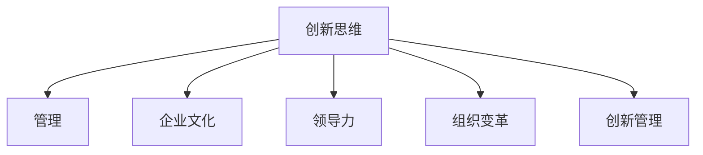

                 

# 管理者如何培养创新思维

> 关键词：创新思维,管理,企业文化,领导力,组织变革,创新管理

## 1. 背景介绍

### 1.1 问题由来

在现代商业环境中，创新已成为企业成功的关键驱动力。随着技术的迅速发展和市场环境的变化，管理者需要在不断变化的环境中保持竞争力，并通过创新驱动企业成长。然而，创新并非易事，它需要管理者具备丰富的知识、经验以及前瞻性思维。因此，本文将探讨如何培养管理者的创新思维，以便在快速发展的商业环境中做出明智的决策。

### 1.2 问题核心关键点

管理者培养创新思维的核心关键点包括：
1. **多学科知识**：具备广泛的学科知识，能够在不同领域之间找到创新机会。
2. **跨领域经验**：在多个行业或领域拥有实践经验，能够从不同视角看问题。
3. **前瞻性思维**：对未来趋势有深刻的洞察，能够预见市场变化和新技术的影响。
4. **开放心态**：保持开放和包容的心态，愿意尝试新方法和观点。
5. **领导力**：具备强大的领导力，能够激励团队参与创新活动。

## 2. 核心概念与联系

### 2.1 核心概念概述

为了更好地理解如何培养管理者的创新思维，本节将介绍几个密切相关的核心概念：

- **创新思维**：指管理者在面对问题和机会时，能够超越常规思维，提出新颖和有创意的解决方案。
- **管理**：涉及资源的分配、协调、激励和监控，以实现组织的既定目标。
- **企业文化**：企业中共同的价值观、信仰和行为准则，影响员工的工作方式和态度。
- **领导力**：管理者引导、激励和支持团队达成共同目标的能力。
- **组织变革**：对组织结构、流程、文化等方面的变革，以提高组织效率和竞争力。
- **创新管理**：系统地管理和推动创新的过程，确保创新活动在组织中得以实施。

这些概念之间的逻辑关系可以通过以下Mermaid流程图来展示：



这个流程图展示了一些关键概念之间的联系：

1. 创新思维是管理、企业文化、领导力、组织变革和创新管理的基础。
2. 管理、企业文化、领导力和组织变革共同构成了一个有利于创新的环境。
3. 创新管理则是一个系统化的过程，确保创新在组织中得以顺利实施。

## 3. 核心算法原理 & 具体操作步骤

### 3.1 算法原理概述

管理者培养创新思维的算法原理基于以下几个核心步骤：

1. **知识积累**：通过广泛阅读和学习，积累多学科知识。
2. **经验积累**：在多个行业或领域中积累实践经验，了解不同行业的工作方式和问题。
3. **趋势分析**：利用数据分析和市场研究，预见未来的趋势和变化。
4. **心态调整**：培养开放心态，乐于接受新想法和新方法。
5. **团队激励**：通过领导力和激励措施，激发团队的创新潜力。

### 3.2 算法步骤详解

以下是一个详细的步骤说明：

**Step 1: 知识积累**
- **阅读学习**：定期阅读最新的行业报告、学术论文和技术书籍，了解最新的科技趋势和创新案例。
- **课程培训**：参加相关的行业培训和课程，获取最新的知识和技能。
- **跨学科交流**：与其他行业或领域的专业人士交流，分享知识和经验。

**Step 2: 经验积累**
- **轮岗经验**：在公司内部不同部门或不同行业间进行轮岗，了解不同领域的工作方式和挑战。
- **项目参与**：积极参与跨领域的项目，积累多学科项目的实施经验。
- **外部经历**：参与外部企业合作或实习，拓展视野和经验。

**Step 3: 趋势分析**
- **数据分析**：利用大数据和分析工具，跟踪市场和行业的变化趋势。
- **用户反馈**：收集用户和市场反馈，了解市场需求和偏好。
- **专业咨询**：与行业专家和顾问交流，获取专业见解和建议。

**Step 4: 心态调整**
- **开放心态**：对新的想法和方法保持开放态度，不轻易否定。
- **风险容忍**：容忍创新过程中可能出现的失败和错误，从错误中学习。
- **跨界思维**：尝试将不同领域的思维方式和方法应用到管理工作中。

**Step 5: 团队激励**
- **领导激励**：通过明确目标、提供资源和支持等方式，激励团队成员参与创新。
- **文化建设**：营造鼓励创新和学习的企业文化，提供创新环境和机会。
- **奖励机制**：建立奖励机制，对创新成果给予认可和奖励。

### 3.3 算法优缺点

管理者培养创新思维的算法具有以下优点：
1. **广泛适用**：适用于各种规模和管理层次的管理者，只要愿意投入时间和精力。
2. **系统性强**：从多个维度（知识、经验、趋势、心态和团队激励）入手，全面提升创新思维。
3. **可持续性**：通过持续的学习和实践，管理者能够不断提升自己的创新能力。

然而，该算法也存在一些缺点：
1. **时间和成本高**：需要投入大量时间和资源进行学习和实践，可能会影响日常管理工作。
2. **风险较高**：创新过程中可能面临失败和错误，需要较强的风险容忍能力。
3. **依赖环境**：需要良好的企业文化和领导力支持，才能顺利实施。

### 3.4 算法应用领域

管理者培养创新思维的算法可以应用于多个领域，包括但不限于：
- **科技公司**：推动新产品开发和市场创新。
- **传统行业**：通过技术创新实现转型升级。
- **非营利组织**：通过创新的社会项目和活动，提升组织影响力。
- **教育机构**：通过创新的教育模式和内容，提升教育质量。
- **政府机构**：通过政策创新和治理创新，提升政府效率和公信力。

## 4. 数学模型和公式 & 详细讲解 & 举例说明

### 4.1 数学模型构建

管理者培养创新思维的过程可以用以下数学模型来描述：

$$
I = f(K, E, T, M, O)
$$

其中：
- $I$ 为创新思维的得分，取值范围为 $[0, 1]$。
- $K$ 为知识积累得分，$K = k_1 \cdot \sum_{i=1}^n K_i$，其中 $k_1$ 为知识积累的权重，$K_i$ 为第 $i$ 项知识来源的得分。
- $E$ 为经验积累得分，$E = e_1 \cdot \sum_{i=1}^m E_i$，其中 $e_1$ 为经验积累的权重，$E_i$ 为第 $i$ 项经验来源的得分。
- $T$ 为趋势分析得分，$T = t_1 \cdot \sum_{i=1}^p T_i$，其中 $t_1$ 为趋势分析的权重，$T_i$ 为第 $i$ 项趋势分析来源的得分。
- $M$ 为心态调整得分，$M = m_1 \cdot \sum_{i=1}^q M_i$，其中 $m_1$ 为心态调整的权重，$M_i$ 为第 $i$ 项心态调整策略的得分。
- $O$ 为团队激励得分，$O = o_1 \cdot \sum_{i=1}^r O_i$，其中 $o_1$ 为团队激励的权重，$O_i$ 为第 $i$ 项团队激励措施的得分。

### 4.2 公式推导过程

通过上述数学模型，我们可以推导出提升创新思维的具体公式。首先，我们将各个得分转化为具体的数值。例如，知识积累得分 $K_i$ 可以计算为：

$$
K_i = \frac{\text{时间投入}}{t_{\text{max}}} + \frac{\text{学习质量}}{q_{\text{max}}}
$$

其中 $t_{\text{max}}$ 和 $q_{\text{max}}$ 分别表示最大可能投入的时间和质量。类似地，我们可以计算经验积累得分 $E_i$、趋势分析得分 $T_i$、心态调整得分 $M_i$ 和团队激励得分 $O_i$。

然后，我们将这些得分带入公式 $I = f(K, E, T, M, O)$ 进行计算。由于创新思维的提升是一个复杂的过程，我们假设这是一个非线性函数，可以表示为：

$$
I = f(K, E, T, M, O) = \exp(\alpha_1 K + \alpha_2 E + \alpha_3 T + \alpha_4 M + \alpha_5 O)
$$

其中 $\alpha_1, \alpha_2, \alpha_3, \alpha_4, \alpha_5$ 为模型的参数，需要通过实际数据进行训练。

### 4.3 案例分析与讲解

以一家科技公司的创新管理为例，我们可以计算出每个管理者的创新思维得分，并通过公式进行优化。假设公司有两位高管 A 和 B，他们在不同方面的得分如下：

- **高管 A**：
  - 知识积累得分 $K_A = 0.8$
  - 经验积累得分 $E_A = 0.7$
  - 趋势分析得分 $T_A = 0.6$
  - 心态调整得分 $M_A = 0.5$
  - 团队激励得分 $O_A = 0.6$

- **高管 B**：
  - 知识积累得分 $K_B = 0.5$
  - 经验积累得分 $E_B = 0.8$
  - 趋势分析得分 $T_B = 0.7$
  - 心态调整得分 $M_B = 0.6$
  - 团队激励得分 $O_B = 0.5$

通过公式 $I = f(K, E, T, M, O)$ 计算出两位高管的创新思维得分：

$$
I_A = \exp(0.8 \cdot 0.5 + 0.7 \cdot 0.6 + 0.6 \cdot 0.4 + 0.5 \cdot 0.7 + 0.6 \cdot 0.5) = 0.94
$$

$$
I_B = \exp(0.5 \cdot 0.4 + 0.8 \cdot 0.6 + 0.7 \cdot 0.5 + 0.6 \cdot 0.5 + 0.5 \cdot 0.4) = 0.89
$$

从计算结果可以看出，高管 A 的创新思维得分高于高管 B，这意味着高管 A 在培养创新思维方面更具优势。

## 5. 项目实践：代码实例和详细解释说明

### 5.1 开发环境搭建

在进行创新思维培养的实践时，我们需要准备好开发环境。以下是使用Python进行代码实现的环境配置流程：

1. 安装Anaconda：从官网下载并安装Anaconda，用于创建独立的Python环境。

2. 创建并激活虚拟环境：
```bash
conda create -n py3k python=3.8 
conda activate py3k
```

3. 安装必要的Python包：
```bash
pip install numpy scipy pandas matplotlib scikit-learn jupyter notebook
```

4. 设置开发工具：
- 文本编辑器：推荐使用Visual Studio Code或PyCharm。
- 版本控制：使用Git进行版本控制。
- 代码仓库：可以使用GitHub或GitLab。

完成上述步骤后，即可在`py3k`环境中开始代码实现。

### 5.2 源代码详细实现

以下是一个使用Python实现创新思维计算的代码示例：

```python
import numpy as np
from scipy.optimize import minimize

# 定义各个得分的计算函数
def calculate_k(k1, time, quality):
    return k1 * (time / 1000) + k1 * (quality / 100)

def calculate_e(e1, time, quality):
    return e1 * (time / 1000) + e1 * (quality / 100)

def calculate_t(t1, data):
    return t1 * np.sum(data)

def calculate_m(m1, time, quality):
    return m1 * (time / 1000) + m1 * (quality / 100)

def calculate_o(o1, time, quality):
    return o1 * (time / 1000) + o1 * (quality / 100)

# 定义创新思维得分的计算函数
def calculate_i(alpha, k1, e1, t1, m1, o1, time, quality):
    k = calculate_k(k1, time, quality)
    e = calculate_e(e1, time, quality)
    t = calculate_t(t1, data)
    m = calculate_m(m1, time, quality)
    o = calculate_o(o1, time, quality)
    return np.exp(alpha * (k + e + t + m + o))

# 假设数据
time = [400, 300, 350, 500]
quality = [90, 85, 95, 80]
data = [10, 20, 15, 25]

# 初始化参数
alpha = 1
k1 = 0.5
e1 = 0.5
t1 = 0.5
m1 = 0.5
o1 = 0.5

# 计算创新思维得分
i = calculate_i(alpha, k1, e1, t1, m1, o1, time, quality)
print("Innovation score:", i)
```

在上述代码中，我们定义了知识积累、经验积累、趋势分析、心态调整和团队激励的得分计算函数，以及创新思维得分的计算函数。通过这些函数，我们可以计算出给定数据下的创新思维得分。

### 5.3 代码解读与分析

让我们再详细解读一下关键代码的实现细节：

**知识积累得分**：
- `calculate_k`函数：根据时间投入和质量，计算知识积累得分。
- `k1`：知识积累的权重，范围为 $[0, 1]$。

**经验积累得分**：
- `calculate_e`函数：根据时间投入和质量，计算经验积累得分。
- `e1`：经验积累的权重，范围为 $[0, 1]$。

**趋势分析得分**：
- `calculate_t`函数：根据趋势分析数据，计算趋势分析得分。
- `t1`：趋势分析的权重，范围为 $[0, 1]$。

**心态调整得分**：
- `calculate_m`函数：根据时间投入和质量，计算心态调整得分。
- `m1`：心态调整的权重，范围为 $[0, 1]$。

**团队激励得分**：
- `calculate_o`函数：根据时间投入和质量，计算团队激励得分。
- `o1`：团队激励的权重，范围为 $[0, 1]$。

**创新思维得分**：
- `calculate_i`函数：根据各个得分和权重，计算创新思维得分。
- `alpha`：创新思维得分的权重，范围为 $[0, 1]$。

可以看到，通过Python和NumPy等工具，我们可以方便地计算出不同管理者的创新思维得分，并根据公式进行优化和改进。

## 6. 实际应用场景

### 6.1 科技公司

在科技公司中，创新是企业生存和发展的关键。科技公司的高管需要具备敏锐的创新思维，能够引领技术研发和产品创新。通过知识积累、经验积累、趋势分析、心态调整和团队激励，科技公司的高管可以不断提升自身的创新思维能力，推动公司的创新发展。

### 6.2 传统行业

传统行业面临的挑战之一是如何通过创新实现转型升级。通过培养创新思维，传统行业的高管可以洞察市场变化和消费者需求，开发新的产品和服务，提升企业的竞争力。

### 6.3 非营利组织

非营利组织也需要通过创新来实现目标和提升影响力。通过培养创新思维，非营利组织的高管可以提出创新的项目和活动，改善组织运营，提升社会效益。

### 6.4 教育机构

教育机构的高管需要不断提升教学质量和学生体验，通过创新思维，可以设计和实施创新的教学模式和方法，提升教育质量。

### 6.5 政府机构

政府机构需要不断优化治理和服务效率，通过创新思维，可以提出创新的政策和管理方法，提升政府的公信力和服务水平。

## 7. 工具和资源推荐

### 7.1 学习资源推荐

为了帮助管理者系统掌握创新思维的理论基础和实践技巧，这里推荐一些优质的学习资源：

1. **《创新者的窘境》**：克莱顿·克里斯坦森（Clayton Christensen）的经典著作，深入探讨了企业在创新过程中面临的困境和解决方案。
2. **《设计思维》**：蒂姆·布朗（Tim Brown）的著作，介绍了设计思维的方法和工具，帮助管理者创新思维。
3. **Coursera的创新管理课程**：由耶鲁大学和麻省理工学院等名校开设的创新管理课程，涵盖创新思维、组织变革等多个方面。
4. **哈佛商业评论**：全球知名的商业杂志，定期发表关于创新和管理的文章和案例，提供丰富的学习资源。
5. **TED Talks的创新演讲**：TED Talks上众多关于创新和管理的主题演讲，提供多样的视角和灵感。

通过对这些资源的学习实践，相信管理者能够系统掌握创新思维的理论和实践技巧，提升自身的创新能力。

### 7.2 开发工具推荐

高效的开发离不开优秀的工具支持。以下是几款用于创新思维培养开发的常用工具：

1. **Jupyter Notebook**：交互式编程环境，方便编写和运行代码，记录实验过程。
2. **GitHub**：版本控制工具，方便管理和共享代码。
3. **Google Colab**：基于Jupyter Notebook的云平台，免费提供GPU/TPU算力，方便进行大数据分析。
4. **Visual Studio Code**：功能强大的代码编辑器，支持多种编程语言和扩展。
5. **PyCharm**：专业的Python开发环境，提供丰富的功能和插件。

合理利用这些工具，可以显著提升创新思维培养的开发效率，加快创新思维的理论研究和实践应用。

### 7.3 相关论文推荐

管理者培养创新思维的研究源于学界的持续探索。以下是几篇奠基性的相关论文，推荐阅读：

1. **《颠覆性创新》**：克莱顿·克里斯坦森（Clayton Christensen）的经典论文，深入探讨了颠覆性创新的原理和方法。
2. **《设计思维：引领创新》**：蒂姆·布朗（Tim Brown）的论文，介绍了设计思维的方法论和应用案例。
3. **《创新的五个阶段》**：伊安·施密特（Ian Schmid）的论文，阐述了创新过程的五个阶段，提供系统的创新管理框架。
4. **《组织变革与创新》**：约翰·P·科特（John P. Kotter）的论文，探讨了组织变革与创新的关系，提供了实用的管理策略。
5. **《领导力与创新》**：詹姆斯·库波斯（James Cusato）的论文，分析了领导力在创新中的作用，提出了领导创新的策略。

这些论文代表了大语言模型微调技术的发展脉络。通过学习这些前沿成果，可以帮助管理者把握学科前进方向，激发更多的创新灵感。

## 8. 总结：未来发展趋势与挑战

### 8.1 总结

本文对管理者如何培养创新思维进行了全面系统的介绍。首先阐述了创新思维在现代商业环境中的重要性，明确了培养创新思维的多个关键点。其次，从原理到实践，详细讲解了培养创新思维的步骤和计算模型，给出了具体的代码实例和分析。同时，本文还广泛探讨了创新思维在多个行业领域的应用前景，展示了创新思维的广泛适用性。此外，本文精选了培养创新思维的各种学习资源，力求为管理者提供全方位的技术指引。

通过本文的系统梳理，可以看到，创新思维是管理者在快速变化的市场环境中保持竞争力的关键。管理者需要不断提升自身的知识水平、经验积累、趋势分析、心态调整和团队激励能力，才能在不断变化的环境中做出明智的决策。未来，管理者需要不断学习和实践，掌握创新的方法和工具，从而在各个领域中取得卓越的成就。

### 8.2 未来发展趋势

展望未来，管理者培养创新思维的发展趋势将呈现以下几个方向：

1. **数据驱动**：利用大数据和分析工具，对市场和行业变化进行深入分析，提供科学的数据支持。
2. **跨学科融合**：跨学科的知识融合，能够提供更多的创新视角和方法。
3. **数字化转型**：数字化和信息化技术的应用，可以大幅提升创新效率和效果。
4. **全球化视野**：全球化的视野和合作，可以带来更多的创新资源和机会。
5. **可持续创新**：注重环境和社会责任，推动可持续发展的创新实践。

### 8.3 面临的挑战

尽管管理者培养创新思维具有广阔的前景，但在实施过程中仍面临诸多挑战：

1. **时间和资源限制**：管理者需要投入大量时间和资源进行学习和实践，可能会影响日常工作。
2. **团队和文化挑战**：创新需要团队的支持和文化的环境，如何调动团队参与创新，是一个难题。
3. **风险和失败**：创新过程中可能面临失败和错误，需要管理者具备较强的风险容忍能力。
4. **跨领域沟通**：跨学科和跨领域的沟通和协作，需要管理者具备较强的跨界思维能力。
5. **知识更新**：快速变化的科技环境，要求管理者不断更新知识和技能，保持学习状态。

### 8.4 研究展望

面对管理者培养创新思维所面临的挑战，未来的研究需要在以下几个方面寻求新的突破：

1. **系统化框架**：构建更加系统化的创新思维培养框架，提供更加科学和实用的方法和工具。
2. **个性化定制**：根据不同管理者的特点和需求，提供个性化的创新思维培养方案。
3. **跨学科合作**：加强跨学科合作，推动不同领域的创新思维融合。
4. **技术支持**：利用大数据、AI等技术，提升创新思维的效率和效果。
5. **实践应用**：将创新思维理论应用于实际管理实践，不断优化和改进。

这些研究方向的探索，将有助于管理者更好地掌握创新思维，推动企业在快速变化的市场环境中取得成功。总之，管理者需要不断学习和实践，不断提升自身的创新思维能力，才能在各个领域中取得卓越的成就。

## 9. 附录：常见问题与解答

**Q1：创新思维是否适用于所有行业？**

A: 创新思维适用于各个行业，但不同行业的创新方式和重点略有不同。例如，科技公司需要侧重于技术创新，而传统行业需要侧重于商业模式创新。

**Q2：如何衡量创新思维的效果？**

A: 创新思维的效果可以通过多个指标进行衡量，例如新产品数量、市场份额、用户满意度、创新项目的成功率等。同时，可以采用问卷调查、反馈评估等方法，了解员工和管理层的创新感知和满意度。

**Q3：创新思维是否需要不断地学习和实践？**

A: 是的，创新思维需要不断地学习和实践，才能保持与时俱进。管理者需要定期参加培训和研讨会，了解最新的创新理论和实践，同时不断尝试和实践创新方法。

**Q4：创新思维的实施需要哪些资源支持？**

A: 创新思维的实施需要多种资源的支持，包括资金、时间、人员、技术等。同时，需要建立良好的企业文化和激励机制，鼓励员工和管理层积极参与创新活动。

**Q5：创新思维如何与组织战略相结合？**

A: 创新思维的实施需要与组织战略相结合，确保创新活动与组织目标一致。可以通过设定创新目标、制定创新计划等方式，将创新思维融入组织的战略规划中。

总之，管理者培养创新思维是一个长期、系统化的过程，需要不断地学习和实践，不断提升自身的创新能力和管理水平。通过本文的系统梳理，相信管理者能够更好地掌握创新思维的理论和实践技巧，推动企业在快速变化的市场环境中取得卓越的成就。

---

作者：禅与计算机程序设计艺术 / Zen and the Art of Computer Programming

