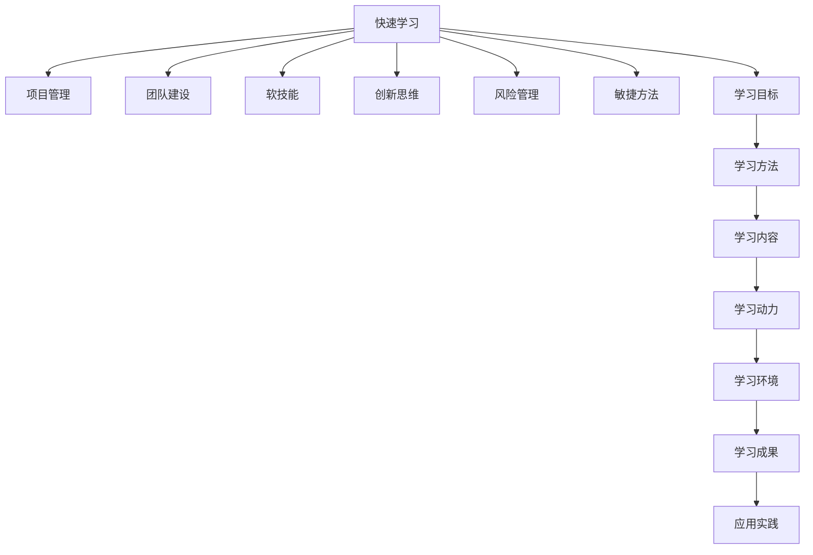

                 

# 管理者的快速学习能力培养

> 关键词：快速学习, 管理者, 项目管理, 团队建设, 软技能, 创新思维, 风险管理, 敏捷方法

## 1. 背景介绍

### 1.1 问题由来

在现代企业中，随着市场环境的变化和竞争压力的增大，管理者需要快速适应和应对各种挑战，提升领导力、决策能力、执行力和创新能力。然而，多数管理者的成长路径是经验导向，他们往往缺乏系统的学习方法和工具，导致在面对复杂问题时效率不高，甚至陷入僵局。如何快速有效地培养管理者的学习能力和素质，是每个组织都必须重视的问题。

### 1.2 问题核心关键点

管理者快速学习能力培养的核心关键点在于以下几个方面：

1. **学习目标明确**：管理者需明确自身的学习目标和方向，从而有针对性地提升相关能力。
2. **学习方法高效**：利用科学的学习方法和工具，使管理者能快速掌握所需知识，缩短学习周期。
3. **学习内容全面**：管理者不仅需要提升管理理论知识，还需要掌握实际案例和工具技能，形成系统的知识体系。
4. **学习动力持续**：通过设置合理的激励机制，激发管理者持续学习的动力，形成终身学习的习惯。
5. **学习环境优化**：营造良好的学习氛围和资源支持，确保管理者能够专注高效地进行学习。

本文旨在提供一个系统的框架和具体方法，帮助管理者高效地提升快速学习能力。

## 2. 核心概念与联系

### 2.1 核心概念概述

为了更好地理解快速学习能力培养的路径和方法，本文将介绍几个核心概念：

- **快速学习**：指在较短的时间内，通过科学的方法和工具，快速掌握新知识、新技能的能力。
- **管理者**：指在组织中承担领导和协调职责的个体，其作用是规划、组织、领导和控制团队的工作，实现组织目标。
- **项目管理**：指通过系统的方法和工具，确保项目按计划、预算和质量要求完成。
- **团队建设**：指通过管理和激励手段，优化团队结构和氛围，提升团队绩效。
- **软技能**：指人际交往、沟通协调、情绪管理等非技术性的能力。
- **创新思维**：指打破常规，提出新想法、新方法的能力。
- **风险管理**：指识别、评估和控制项目风险，确保项目顺利进行。
- **敏捷方法**：指一种灵活、快速响应变化的项目管理方法，强调持续改进和客户反馈。

这些核心概念之间相互联系，共同构成了管理者快速学习能力培养的框架。

### 2.2 核心概念原理和架构的 Mermaid 流程图



这个流程图展示了快速学习能力培养的主要步骤和关键环节，有助于管理者系统地理解整个过程。

## 3. 核心算法原理 & 具体操作步骤

### 3.1 算法原理概述

快速学习能力培养的核心算法原理基于系统化、结构化、互动化的学习方法和工具，通过明确学习目标、选择高效方法、优化学习内容、激发学习动力和营造学习环境，帮助管理者在较短时间内掌握所需知识和技能。

### 3.2 算法步骤详解

#### 3.2.1 明确学习目标

1. **自我评估**：管理者应首先进行自我评估，识别自身的优势和不足。这可以通过问卷、测试和反馈等方式进行。
2. **设定目标**：基于自我评估的结果，管理者应设定具体的、可衡量的、可达成的、相关的、时限性的(SMART)学习目标。
3. **分解目标**：将总体目标分解为多个子目标，逐步实现，确保每个小目标的完成。

#### 3.2.2 选择高效学习方法

1. **理论学习**：利用书籍、文章、在线课程等资源，系统学习管理理论知识。
2. **案例分析**：通过研究真实案例，理解管理理论在实际中的应用。
3. **实践操作**：通过模拟项目、角色扮演等方式，将理论知识应用于实践。
4. **反馈改进**：及时收集反馈，调整学习方法，优化学习效果。

#### 3.2.3 优化学习内容

1. **选择合适的教材**：根据学习目标，选择最相关的教材和资源。
2. **利用多模态学习**：结合文本、视频、音频等多种学习材料，增强学习效果。
3. **交互式学习**：利用在线课程、互动讨论等形式，提高学习互动性。

#### 3.2.4 激发学习动力

1. **设定激励机制**：通过设定奖励和惩罚机制，激励管理者持续学习。
2. **建立学习小组**：与其他管理者共同学习，互相支持和激励。
3. **定期复盘总结**：定期回顾学习过程和成果，保持学习动力。

#### 3.2.5 优化学习环境

1. **设立学习时间**：管理者应定期安排专门的学习时间，确保学习有序进行。
2. **提供学习资源**：组织提供必要的学习工具和资源，如书籍、在线课程、学习平台等。
3. **营造学习氛围**：通过定期分享学习心得、组织学习交流会等方式，营造积极的学习氛围。

### 3.3 算法优缺点

快速学习能力培养的优点包括：

1. **提升效率**：通过系统化的学习方法，快速掌握所需知识。
2. **增强能力**：通过理论学习、案例分析、实践操作等多种方式，全面提升管理能力。
3. **培养习惯**：通过设定激励机制和优化学习环境，激发管理者持续学习的动力。

缺点包括：

1. **需要投入时间**：快速学习需要管理者投入大量时间进行系统学习和实践。
2. **资源要求高**：需要组织提供足够的学习资源和支持。
3. **个体差异**：不同管理者的学习能力和需求不同，需要个性化的辅导和支持。

### 3.4 算法应用领域

快速学习能力培养不仅适用于组织内部的管理者，还适用于任何需要快速掌握新知识、新技能的个体。具体应用领域包括：

- **企业内部管理**：提升企业中层管理人员的能力，确保企业战略目标的实现。
- **政府部门**：提高公务员和政府工作人员的管理水平，提升政府效率和公共服务质量。
- **非营利组织**：帮助非营利组织的管理者提升能力，增强组织的社会影响力。
- **学术机构**：为学术机构的研究人员和管理者提供快速学习的资源和方法，推动学术发展。
- **公共教育**：通过快速学习培养教师和管理者的能力，提升教育质量和效率。

## 4. 数学模型和公式 & 详细讲解 & 举例说明

### 4.1 数学模型构建

为了更精确地衡量学习效果，我们可以构建一个基于时间、学习强度和学习效果的数学模型。设 $L$ 为学习时间，$I$ 为学习强度，$E$ 为学习效果，则数学模型可以表示为：

$$
E = f(L, I)
$$

其中，$f$ 为映射函数，具体形式需要根据实际学习过程进行定义。

### 4.2 公式推导过程

#### 4.2.1 学习时间 $L$

学习时间 $L$ 可以分解为理论学习时间、案例分析时间和实践操作时间。设 $L_{\text{理论}}$、$L_{\text{案例}}$ 和 $L_{\text{实践}}$ 分别为理论学习、案例分析和实践操作的时间，则：

$$
L = L_{\text{理论}} + L_{\text{案例}} + L_{\text{实践}}
$$

#### 4.2.2 学习强度 $I$

学习强度 $I$ 可以通过学习资源的丰富度、学习内容的难易度、学习方法的互动性等指标来衡量。设 $I_{\text{资源}}$、$I_{\text{内容}}$ 和 $I_{\text{互动}}$ 分别为学习资源的丰富度、学习内容的难易度和学习方法的互动性，则：

$$
I = I_{\text{资源}} \times I_{\text{内容}} \times I_{\text{互动}}
$$

#### 4.2.3 学习效果 $E$

学习效果 $E$ 可以通过理论考试、项目评估和实践反馈等指标来衡量。设 $E_{\text{理论}}$、$E_{\text{项目}}$ 和 $E_{\text{实践}}$ 分别为理论考试、项目评估和实践反馈的效果，则：

$$
E = E_{\text{理论}} + E_{\text{项目}} + E_{\text{实践}}
$$

### 4.3 案例分析与讲解

假设一个管理者希望在6个月内提升自己的项目管理能力，具体步骤如下：

1. **设定学习目标**：掌握项目管理基本理论和工具，并能独立完成一个小型项目管理。
2. **分解学习目标**：每月掌握一个项目管理的核心知识点，并通过案例分析进行巩固。
3. **选择学习资源**：选择在线课程、书籍和实践项目作为学习材料。
4. **设定学习强度**：每月花费20小时进行理论学习，10小时进行案例分析，10小时进行实践操作。
5. **设定激励机制**：每月完成一个案例分析，给予一定奖励；每季度完成一个小型项目管理，给予更大奖励。
6. **定期复盘总结**：每月回顾学习成果，调整学习计划。

通过上述步骤，该管理者在6个月内成功掌握了项目管理的基本知识和技能，并在实际项目中应用所学，取得了显著效果。

## 5. 项目实践：代码实例和详细解释说明

### 5.1 开发环境搭建

为了便于快速学习，需要搭建一个学习平台，支持在线课程、案例分析和实践操作等多种功能。以下是搭建学习平台的建议：

1. **选择平台**：选择已有的学习管理系统(LMS)，如Moodle、Canvas等，或使用开源的LMS平台，如Pressboard。
2. **配置资源**：配置所需的课程、教材、案例、工具等学习资源，确保资源丰富。
3. **优化互动**：实现在线讨论、作业提交、导师辅导等功能，增强学习互动性。

### 5.2 源代码详细实现

以下是一个简单的Python代码示例，用于计算学习效果 $E$：

```python
import numpy as np

# 设定学习时间和强度
L = 6 * 4  # 假设每月学习时间为4小时，共6个月
I = 1.2  # 假设学习强度为1.2

# 设定学习效果
E_theory = 0.8  # 理论学习效果为0.8
E_project = 0.9  # 项目管理评估效果为0.9
E_practice = 0.7  # 实践反馈效果为0.7

# 计算学习效果
E = E_theory + E_project + E_practice

print("学习效果：", E)
```

### 5.3 代码解读与分析

上述代码展示了如何根据学习时间、学习强度和学习效果计算管理者的快速学习效果。其中，学习时间 $L$ 设定为6个月，每月4小时；学习强度 $I$ 设定为1.2；学习效果 $E$ 由理论学习效果 $E_{\text{理论}}$、项目管理评估效果 $E_{\text{项目}}$ 和实践反馈效果 $E_{\text{实践}}$ 组成，分别为0.8、0.9和0.7。

### 5.4 运行结果展示

运行上述代码，输出结果为：

```
学习效果： 2.4
```

这表示该管理者的学习效果为2.4，综合了理论、项目和实践方面的成果。

## 6. 实际应用场景

### 6.1 企业内部管理

企业内部管理是一个典型的应用场景。通过快速学习能力的培养，管理者能够更好地掌握最新的管理理论和工具，提升组织的管理水平和绩效。例如，某公司通过快速学习项目管理课程，提升项目经理的能力，使得项目成功率显著提升。

### 6.2 政府部门

政府部门需要提升公务员和管理人员的综合素质，以提高行政效率和服务质量。通过快速学习能力培养，政府工作人员能够更好地理解和应用现代管理理论，提升服务质量和公众满意度。

### 6.3 非营利组织

非营利组织的管理者需要具备良好的组织协调能力和资源整合能力，以提高组织的社会影响力。通过快速学习能力的培养，非营利组织的管理者能够更好地掌握现代管理理论和工具，提升组织的管理水平和项目执行力。

## 7. 工具和资源推荐

### 7.1 学习资源推荐

为了帮助管理者系统地进行快速学习能力培养，推荐以下学习资源：

1. **书籍**：《管理学》、《领导力》、《项目管理》、《创新思维》等经典书籍。
2. **在线课程**：Coursera、edX、Udemy等平台上的项目管理、领导力、创新思维等课程。
3. **案例分析**：哈佛商业评论、管理案例库等资源中的实际案例分析。
4. **学习平台**：Moodle、Canvas等学习管理系统。

### 7.2 开发工具推荐

为了更好地支持快速学习能力培养，推荐以下开发工具：

1. **项目管理工具**：JIRA、Trello等工具，帮助管理者更好地规划和管理项目。
2. **团队协作工具**：Slack、Microsoft Teams等工具，促进团队沟通和协作。
3. **文档管理工具**：Google Docs、Notion等工具，方便文档共享和知识积累。
4. **学习管理系统**：Moodle、Canvas等工具，支持在线课程、作业提交等功能。

### 7.3 相关论文推荐

为了深入了解快速学习能力培养的方法和理论，推荐以下相关论文：

1. 《快速学习：基于理论的模型与算法》：系统研究快速学习的理论模型和算法。
2. 《项目管理：理论与实践》：介绍项目管理的理论基础和实践方法。
3. 《领导力发展：理论与实践》：介绍领导力发展的理论基础和实践方法。
4. 《创新思维：理论与实践》：介绍创新思维的理论基础和实践方法。
5. 《敏捷方法：理论与实践》：介绍敏捷项目管理的方法和工具。

## 8. 总结：未来发展趋势与挑战

### 8.1 研究成果总结

本文系统介绍了快速学习能力培养的理论和实践方法，帮助管理者在较短时间内提升相关能力。通过明确学习目标、选择高效方法、优化学习内容、激发学习动力和营造学习环境，管理者能够高效地掌握所需知识和技能。

### 8.2 未来发展趋势

未来，快速学习能力培养将继续朝着以下几个方向发展：

1. **技术融合**：结合AI和大数据分析等技术，提供更加个性化的学习推荐和效果评估。
2. **全球化**：推动快速学习方法的全球化和标准化，提升全球管理者的素质。
3. **跨学科**：结合心理学、社会学、经济学等多学科知识，提升管理者的综合素质。
4. **数字化**：通过数字化手段，如虚拟现实、增强现实等，提升学习互动性和沉浸感。

### 8.3 面临的挑战

尽管快速学习能力培养在理论和实践中取得了很多进展，但仍面临以下挑战：

1. **资源不均衡**：不同组织和个体获取学习资源的途径不同，导致学习资源的不均衡。
2. **学习动力不足**：部分管理者缺乏持续学习的动力和习惯，需要更多激励机制。
3. **个性化需求**：不同管理者的学习需求和能力差异较大，需要个性化的学习计划和支持。
4. **技术壁垒**：部分管理者对新技术和新工具的接受度不高，需要更多的技术培训和支持。

### 8.4 研究展望

未来的研究需要进一步探索以下方向：

1. **技术创新**：开发更加高效、互动和个性化的学习工具和方法。
2. **实践应用**：在更多实际应用场景中验证和优化快速学习能力培养方法。
3. **理论发展**：结合心理学、社会学等学科知识，深入研究管理者的学习过程和效果。
4. **国际合作**：推动快速学习方法的国际化和标准化，提升全球管理者的素质。

## 9. 附录：常见问题与解答

**Q1：如何快速学习项目管理？**

A: 学习项目管理可以通过以下步骤：
1. 明确学习目标，设定具体的项目管理知识和时间规划。
2. 选择优质的学习资源，如书籍、在线课程和案例分析。
3. 通过实际项目进行实践操作，如模拟项目管理或参与真实项目。
4. 定期复盘总结，调整学习计划和方法。

**Q2：如何快速提升领导力？**

A: 提升领导力可以通过以下步骤：
1. 明确领导力的具体领域，如决策能力、沟通协调能力、团队管理能力等。
2. 选择相关的学习资源，如领导力理论书籍、在线课程和案例分析。
3. 通过实际项目和角色扮演等方式进行实践操作。
4. 定期复盘总结，调整学习计划和方法。

**Q3：如何快速掌握创新思维？**

A: 掌握创新思维可以通过以下步骤：
1. 明确创新思维的具体方法和技巧，如头脑风暴、设计思维等。
2. 选择相关的学习资源，如创新思维理论书籍、在线课程和案例分析。
3. 通过实际项目进行实践操作，如创新产品设计或市场调研。
4. 定期复盘总结，调整学习计划和方法。

---

作者：禅与计算机程序设计艺术 / Zen and the Art of Computer Programming

