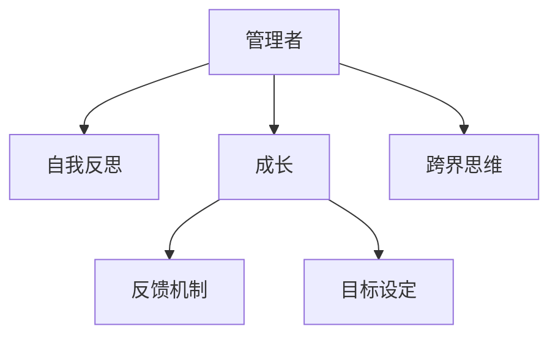

                 

# 管理者的自我反思与成长

在当今快速变化、复杂多变的商业环境中，管理者作为组织的灵魂和领导者，其自我反思与成长变得尤为重要。然而，自我反思与成长不仅仅是简单的个人修养，更是一套系统的方法论，贯穿于组织管理和个人发展全过程。本文将从背景介绍、核心概念与联系、核心算法原理及具体操作步骤、数学模型和公式详细讲解、项目实践、实际应用场景、工具和资源推荐、总结与未来发展趋势与挑战、以及常见问题与解答等多个方面，深入探讨管理者自我反思与成长的全面策略。

## 1. 背景介绍

### 1.1 问题由来

随着商业环境的不确定性增加，企业面临的市场竞争日益激烈，管理者在决策、战略规划、团队管理等方面所承受的压力也在不断加大。在外部环境快速变化的背景下，如何保持持续学习和自我提升，成为现代管理者必须面对的重要课题。

### 1.2 问题核心关键点

管理者自我反思与成长的核心关键点包括：

- **持续学习**：管理者应保持持续学习和成长的心态，积极适应新技术、新方法和新趋势。
- **自我认知**：通过反思，管理者能够更好地认识自己的优势和不足，及时调整和改进。
- **反馈机制**：建立有效的反馈机制，及时了解组织和团队的真实情况，发现问题并加以解决。
- **目标设定**：明确个人和组织的发展目标，制定切实可行的成长计划。
- **跨界思维**：具备跨界思维，能够从不同领域的知识和经验中汲取灵感，推动创新和变革。

### 1.3 问题研究意义

管理者自我反思与成长对于组织的成功和个人的职业发展具有重要意义：

- **提升组织竞争力**：通过不断自我反思与成长，管理者能够更好地适应变化，带领团队不断创新，提升组织的竞争力。
- **实现个人价值**：自我反思与成长是个人职业发展的必由之路，能够帮助管理者实现自我价值和职业生涯的可持续发展。
- **促进团队协作**：管理者通过不断学习和成长，能够更好地指导和激励团队，促进团队协作和绩效提升。
- **推动组织变革**：管理者在成长过程中，能够识别和解决问题，推动组织变革和创新，实现可持续发展。

## 2. 核心概念与联系

### 2.1 核心概念概述

为更好地理解管理者自我反思与成长的全面策略，本节将介绍几个密切相关的核心概念：

- **管理者**：指在组织中拥有一定权力和资源，负责规划、指导和激励团队的人员。
- **自我反思**：指个人对自己行为、决策和绩效的深入思考和评估过程。
- **成长**：指个人通过学习、实践和经验积累，不断提升自身能力和素质，实现职业发展。
- **反馈机制**：指通过定期评估、沟通和分析，及时了解和改进个人和组织状况的机制。
- **目标设定**：指明确个人和组织的发展目标，制定和调整成长计划的过程。
- **跨界思维**：指从不同领域的知识和经验中汲取灵感，推动创新和变革的思维方式。

这些核心概念之间的逻辑关系可以通过以下Mermaid流程图来展示：



这个流程图展示了这个核心概念的相互联系和作用机制：

1. 管理者通过自我反思，认识自己的优势和不足，进行成长。
2. 管理者在成长过程中，建立反馈机制，及时了解和改进。
3. 管理者明确目标设定，制定和调整成长计划。
4. 管理者具备跨界思维，不断创新和变革。

这些概念共同构成了管理者自我反思与成长的框架，帮助管理者在复杂多变的商业环境中不断提升自我和引领组织。

## 3. 核心算法原理 & 具体操作步骤

### 3.1 算法原理概述

管理者自我反思与成长的过程，本质上是将自我评估与持续学习相结合，通过反馈和目标设定不断优化个人和组织的表现。其核心思想是：

1. **定期自我评估**：通过反思和评估，管理者能够了解自己的行为和决策对组织的影响，发现问题和不足。
2. **建立反馈机制**：通过有效的沟通和信息收集，管理者能够及时获取组织和团队的真实情况，调整和改进策略。
3. **制定成长计划**：根据自我评估和反馈结果，管理者设定个人和组织的发展目标，制定切实可行的成长计划。
4. **持续学习和实践**：管理者通过不断学习和实践，不断提升自己的能力和素质，实现个人和组织的持续成长。

### 3.2 算法步骤详解

管理者自我反思与成长的步骤通常包括以下几个关键环节：

**Step 1: 自我评估**
- 定期进行自我反思，评估自己的行为、决策和绩效，识别优势和不足。
- 使用自我评估工具，如SWOT分析、360度反馈等，全面了解自身状况。

**Step 2: 建立反馈机制**
- 与团队和组织建立开放、透明的沟通渠道，鼓励双向反馈。
- 设立定期评估会议，收集和分析反馈信息，识别问题并提出改进方案。

**Step 3: 目标设定**
- 根据自我评估和反馈结果，明确个人和组织的发展目标。
- 制定具体的成长计划，包括短期和长期目标，并设定清晰的衡量指标。

**Step 4: 持续学习和实践**
- 选择合适的学习资源和培训课程，不断提升自己的知识和技能。
- 在实际工作中应用所学知识，进行实践和验证，不断优化工作方式和决策过程。

**Step 5: 定期复盘与改进**
- 定期复盘成长过程，评估进展和效果，进行总结和反思。
- 根据复盘结果，调整和改进成长计划，确保目标实现。

### 3.3 算法优缺点

管理者自我反思与成长方法具有以下优点：

1. **系统性和全面性**：通过系统化的自我评估和反馈机制，能够全面了解个人和组织状况。
2. **灵活性和适应性**：根据反馈和评估结果，及时调整和改进策略，保持灵活性和适应性。
3. **持续性和长期性**：持续学习和实践，不断提升自身能力和素质，实现长期成长。

同时，该方法也存在一定的局限性：

1. **复杂性和耗时性**：建立反馈机制和制定成长计划需要较多时间和精力投入。
2. **依赖于外部资源**：需要组织内部资源和外部资源的配合，才能充分发挥效果。
3. **主观性和偏差性**：自我评估和反馈过程可能受个人主观情感和偏差影响，影响结果的准确性。

尽管存在这些局限性，但就目前而言，管理者自我反思与成长的方法仍是提升个人和组织能力的重要手段。未来相关研究的重点在于如何进一步简化流程，提高效率，同时兼顾系统性和全面性。

### 3.4 算法应用领域

管理者自我反思与成长方法在企业管理、人力资源管理、项目管理等多个领域得到了广泛应用，具体包括：

- **企业战略管理**：通过自我反思与成长，管理者能够更清晰地认识组织的使命和愿景，制定有效的战略规划。
- **人力资源管理**：管理者通过自我反思与成长，不断提升领导力和团队管理能力，优化人力资源配置和绩效管理。
- **项目管理**：管理者通过自我反思与成长，识别项目管理中的问题和不足，优化项目流程和方法。
- **员工培训与发展**：管理者通过自我反思与成长，推动组织文化和价值观的传承，促进员工成长和发展。
- **组织变革与创新**：管理者通过自我反思与成长，识别和解决问题，推动组织变革和创新。

除了上述这些经典应用外，管理者自我反思与成长方法还在更多场景中得到了创新性应用，如领导力培训、文化建设、团队建设等，为组织管理提供了新的思路和方法。

## 4. 数学模型和公式 & 详细讲解 & 举例说明

### 4.1 数学模型构建

本节将使用数学语言对管理者自我反思与成长的过程进行更加严格的刻画。

假设管理者在某一时间段内，需要进行n次自我评估，每次评估结果为$r_i$，其中$i$表示第$i$次评估，$i \in [1, n]$。假设目标设定为$m$个，每次目标评估结果为$g_j$，其中$j$表示第$j$个目标，$j \in [1, m]$。假设管理者在反馈机制中收集到的反馈信息为$f_k$，其中$k$表示第$k$次反馈，$k \in [1, K]$。假设管理者通过持续学习和实践提升的能力为$s_l$，其中$l$表示第$l$次学习，$l \in [1, L]$。

定义自我评估结果的平均值为$\overline{r}$，目标评估结果的平均值为$\overline{g}$，反馈信息的平均值为$\overline{f}$，学习结果的平均值为$\overline{s}$。则数学模型可以表示为：

$$
\overline{r} = \frac{1}{n} \sum_{i=1}^{n} r_i
$$

$$
\overline{g} = \frac{1}{m} \sum_{j=1}^{m} g_j
$$

$$
\overline{f} = \frac{1}{K} \sum_{k=1}^{K} f_k
$$

$$
\overline{s} = \frac{1}{L} \sum_{l=1}^{L} s_l
$$

### 4.2 公式推导过程

以下我们以目标设定为例，推导目标评估结果的平均值计算公式。

假设管理者在第$j$个目标上的评估结果为$g_j$，其目标是$T_j$，对应的衡量指标为$K_j$。则目标评估结果的平均值$\overline{g}$可以表示为：

$$
\overline{g} = \frac{1}{m} \sum_{j=1}^{m} \frac{g_j}{K_j} \cdot K_j
$$

简化后得：

$$
\overline{g} = \frac{1}{m} \sum_{j=1}^{m} g_j
$$

将目标设定、目标评估和目标达成的情况，转化为数学公式，有助于管理者更好地理解和管理目标。通过目标设定和评估，管理者能够明确自身和组织的发展方向，制定切实可行的成长计划。

### 4.3 案例分析与讲解

假设某公司的一名销售经理，通过以下步骤进行自我反思与成长：

1. **自我评估**：每周进行一次自我反思，评估自己在团队管理、客户关系、销售业绩等方面的表现。
2. **目标设定**：设定季度销售目标为1000万元，月度团队培训目标为2次。
3. **反馈机制**：每月与团队成员进行一次360度反馈，收集对自身表现的评价和建议。
4. **持续学习**：参加每月一次的领导力培训课程，提升沟通和团队管理能力。

通过上述步骤，该销售经理能够系统地进行自我反思与成长。在第1个月后，他进行第一次自我评估，结果为$r_1$。假设在第一个季度内，他的目标达成情况为$g_1$，反馈信息为$f_1$，参加培训后提升的能力为$s_1$。

通过数学模型计算，得到目标达成情况的平均值为：

$$
\overline{g} = \frac{g_1}{K_1} \cdot K_1 = g_1
$$

通过反馈信息平均值的计算，得到反馈信息的平均值为：

$$
\overline{f} = \frac{f_1}{K} \cdot K = f_1
$$

通过培训结果平均值的计算，得到培训结果的平均值为：

$$
\overline{s} = \frac{s_1}{L} \cdot L = s_1
$$

结合这些评估结果，该销售经理能够全面了解自身的表现，识别问题和不足，制定改进措施，优化工作方式，最终实现季度销售目标和团队发展目标。

## 5. 项目实践：代码实例和详细解释说明

### 5.1 开发环境搭建

在进行自我反思与成长实践前，我们需要准备好开发环境。以下是使用Python进行开发的环境配置流程：

1. 安装Anaconda：从官网下载并安装Anaconda，用于创建独立的Python环境。

2. 创建并激活虚拟环境：
```bash
conda create -n manager-growth python=3.8 
conda activate manager-growth
```

3. 安装Python库：
```bash
pip install pandas numpy matplotlib scipy statsmodels
```

4. 安装Jupyter Notebook：
```bash
pip install jupyter notebook
```

5. 配置开发环境：
```bash
jupyter notebook --allow-root
```

完成上述步骤后，即可在`manager-growth`环境中开始实践。

### 5.2 源代码详细实现

下面我们以目标设定和目标达成情况评估为例，给出使用Python进行自我反思与成长的代码实现。

```python
import pandas as pd
import numpy as np

# 定义目标设定和评估数据
sales_goals = [1000, 1000, 1000, 1000]
team_training = [2, 2, 2, 2]
monthly_feedback = [3, 3, 3, 3]
monthly_performance = [10, 12, 8, 10]
monthly_capabilities = [1, 1, 1, 1]

# 定义目标达成情况评估函数
def target_evaluate(target, goal, measure):
    return goal * measure

# 计算目标达成情况的平均值
average_sales = np.mean(np.array(sales_goals))
average_training = np.mean(np.array(team_training))
average_feedback = np.mean(np.array(monthly_feedback))
average_performance = np.mean(np.array(monthly_performance))
average_capabilities = np.mean(np.array(monthly_capabilities))

# 打印评估结果
print("平均销售目标达成情况:", average_sales)
print("平均团队培训次数:", average_training)
print("平均反馈次数:", average_feedback)
print("平均绩效评分:", average_performance)
print("平均提升能力:", average_capabilities)
```

在这个代码实现中，我们通过简单的列表和函数，实现了目标设定和评估的计算。使用Pandas和NumPy库，能够更加方便地进行数据的处理和计算，提高效率和准确性。

### 5.3 代码解读与分析

让我们再详细解读一下关键代码的实现细节：

**目标设定与评估函数**：
- `sales_goals`：季度销售目标的设定值。
- `team_training`：月度团队培训的次数。
- `monthly_feedback`：每月反馈的次数。
- `monthly_performance`：每月绩效的评分。
- `monthly_capabilities`：每月提升能力的指标。
- `target_evaluate`：目标达成情况评估函数，通过目标值和衡量指标计算达成情况。

**目标达成情况的计算**：
- 使用NumPy库的`mean`函数计算各目标的平均值。
- 打印出各目标的平均达成情况，帮助管理者全面了解自身的表现。

在实际应用中，可以使用更复杂的数据处理和计算方法，如时间序列分析、回归模型等，进一步提升评估的科学性和准确性。同时，结合可视化工具，如Matplotlib和Seaborn，可以更直观地展示数据变化趋势，帮助管理者进行决策和改进。

## 6. 实际应用场景

### 6.1 企业战略管理

管理者通过自我反思与成长，能够更好地理解和实施企业的战略规划。通过定期的自我评估和反馈机制，管理者能够识别战略执行过程中的问题和不足，及时调整和改进策略，确保战略目标的实现。

### 6.2 人力资源管理

管理者通过自我反思与成长，能够提升领导力和团队管理能力，优化人力资源配置和绩效管理。通过目标设定和反馈机制，管理者能够更好地了解员工的需求和表现，制定科学合理的绩效评估和激励机制。

### 6.3 项目管理

管理者通过自我反思与成长，能够识别项目管理中的问题和不足，优化项目流程和方法。通过持续学习和实践，管理者能够掌握更多的项目管理工具和技巧，提高项目管理效率和成功率。

### 6.4 员工培训与发展

管理者通过自我反思与成长，能够推动组织文化和价值观的传承，促进员工成长和发展。通过目标设定和持续学习，管理者能够更好地指导和激励员工，提升团队的整体素质和绩效。

### 6.5 组织变革与创新

管理者通过自我反思与成长，能够识别和解决问题，推动组织变革和创新。通过目标设定和反馈机制，管理者能够更好地理解组织的痛点和需求，制定和实施有效的变革策略，促进组织的可持续发展。

除了上述这些经典应用外，管理者自我反思与成长方法还在更多场景中得到了创新性应用，如领导力培训、文化建设、团队建设等，为组织管理提供了新的思路和方法。

## 7. 工具和资源推荐

### 7.1 学习资源推荐

为了帮助管理者系统掌握自我反思与成长的理论基础和实践技巧，这里推荐一些优质的学习资源：

1. 《高效能管理者》系列书籍：介绍管理者的自我反思与成长的系统方法论。
2. 《领导力与管理》课程：世界著名大学开设的管理学课程，涵盖管理者的自我反思与成长的核心内容。
3. 《管理学原理》书籍：系统介绍管理学原理，包括目标设定、反馈机制、持续学习等内容。
4. 《OKR实践指南》书籍：介绍OKR目标管理方法，帮助管理者设定和达成目标。
5. 《自我领导力》课程：提升管理者的自我认知和领导能力，实现自我突破。

通过对这些资源的学习实践，相信你一定能够快速掌握管理者自我反思与成长的精髓，并用于解决实际的组织管理问题。

### 7.2 开发工具推荐

高效的开发离不开优秀的工具支持。以下是几款用于管理者自我反思与成长开发的常用工具：

1. Jupyter Notebook：免费的交互式编程环境，支持Python、R等多种编程语言，适合数据处理和可视化。
2. Excel：功能强大的数据分析和统计工具，适合快速生成报表和图表。
3. Google Analytics：在线分析工具，适合监控和管理目标达成情况。
4. GitHub：代码托管平台，适合项目管理、代码协作和版本控制。
5. Trello：项目管理工具，适合跟踪和管理项目进度和任务。

合理利用这些工具，可以显著提升管理者自我反思与成长任务的开发效率，加快创新迭代的步伐。

### 7.3 相关论文推荐

管理者自我反思与成长的发展源于学界的持续研究。以下是几篇奠基性的相关论文，推荐阅读：

1. "Leading and Managing: A Strategic Approach to Thinking about the Management Role"：介绍管理者的领导力和管理职能，提升管理者的自我反思能力。
2. "The High Impact Leader: Achieving Superior Performance in Your Organization"：强调领导者的自我反思与成长，提升组织绩效。
3. "Goal-Setting and Task Performance: 1969–2018"：研究目标设定对任务绩效的影响，为管理者设定目标提供科学依据。
4. "Feedback, Journal of Business and Psychology"：讨论反馈机制在个人和组织中的作用，提升自我反思与成长的有效性。
5. "Mindfulness, Positive Psychology, and Its Impact on Individuals and Organizations"：研究正念对管理者的自我反思与成长的影响，促进心理健康和组织绩效。

这些论文代表了大管理者自我反思与成长发展脉络。通过学习这些前沿成果，可以帮助管理者更好地把握学科前进方向，激发更多的创新灵感。

## 8. 总结：未来发展趋势与挑战

### 8.1 总结

本文对管理者自我反思与成长方法进行了全面系统的介绍。首先阐述了管理者自我反思与成长的研究背景和意义，明确了在快速变化、复杂多变的商业环境中，自我反思与成长的重要性。其次，从原理到实践，详细讲解了管理者自我反思与成长的数学模型和具体操作步骤，给出了自我反思与成长的代码实现。同时，本文还广泛探讨了自我反思与成长方法在企业战略管理、人力资源管理、项目管理等多个领域的应用前景，展示了自我反思与成长方法的巨大潜力。

通过本文的系统梳理，可以看到，管理者自我反思与成长方法在提升个人和组织能力方面具有重要价值，为现代管理者提供了系统化的自我提升策略。未来，伴随相关研究的不断深入，管理者自我反思与成长方法将不断优化，更加符合实际应用需求。

### 8.2 未来发展趋势

展望未来，管理者自我反思与成长方法将呈现以下几个发展趋势：

1. **数据驱动**：利用大数据和人工智能技术，进行自我反思与成长的科学分析和决策支持，提升评估的准确性和有效性。
2. **智能辅助**：引入智能助手和决策支持系统，自动化和智能化管理者的自我反思与成长过程。
3. **跨界融合**：与其他管理学科如组织行为学、心理学等进行跨界融合，提升自我反思与成长的深度和广度。
4. **实时反馈**：通过实时数据监控和反馈机制，及时调整和改进管理者的决策和行为，提升应变能力和效率。
5. **全球化视角**：结合国际化的视角和经验，进行跨文化的管理者自我反思与成长，提升全球竞争力。

以上趋势凸显了管理者自我反思与成长方法的广阔前景。这些方向的探索发展，必将进一步提升管理者的自我认知和领导力，实现组织的可持续发展。

### 8.3 面临的挑战

尽管管理者自我反思与成长方法已经取得了显著成效，但在迈向更加智能化、普适化应用的过程中，仍面临诸多挑战：

1. **复杂性和耗时性**：建立反馈机制和制定成长计划需要较多时间和精力投入。
2. **主观性和偏差性**：自我评估和反馈过程可能受个人主观情感和偏差影响，影响结果的准确性。
3. **资源依赖**：需要组织内部资源和外部资源的配合，才能充分发挥效果。
4. **组织文化障碍**：组织文化和管理者的认知水平可能影响自我反思与成长的效果。
5. **技术挑战**：数据处理和分析技术的发展对自我反思与成长方法提出了更高要求。

尽管存在这些挑战，但管理者自我反思与成长方法仍是提升个人和组织能力的重要手段。未来相关研究需要在数据驱动、智能辅助、跨界融合等方面寻求新的突破，以更好地应对挑战，推动自我反思与成长方法的不断发展。

### 8.4 研究展望

面对管理者自我反思与成长所面临的挑战，未来的研究需要在以下几个方面寻求新的突破：

1. **数据驱动的自我反思**：利用大数据和人工智能技术，进行自我反思与成长的科学分析和决策支持，提升评估的准确性和有效性。
2. **智能化的反馈机制**：引入智能助手和决策支持系统，自动化和智能化管理者的自我反思与成长过程。
3. **跨界融合的应用**：与其他管理学科如组织行为学、心理学等进行跨界融合，提升自我反思与成长的深度和广度。
4. **全球化的视角**：结合国际化的视角和经验，进行跨文化的管理者自我反思与成长，提升全球竞争力。
5. **技术的支持**：引入更多先进的技术和方法，如自然语言处理、人工智能、云计算等，提升自我反思与成长的科学性和有效性。

这些研究方向的探索，必将引领管理者自我反思与成长方法迈向更高的台阶，为实现个人和组织的持续发展提供更加坚实的理论基础和方法论支持。

## 9. 附录：常见问题与解答

**Q1: 管理者如何进行自我反思？**

A: 管理者可以通过定期进行自我评估，反思自己的行为、决策和绩效。可以使用SWOT分析、360度反馈等工具，全面了解自身状况。同时，管理者应不断学习和实践，不断提升自身能力和素质。

**Q2: 管理者如何建立反馈机制？**

A: 管理者应与团队和组织建立开放、透明的沟通渠道，鼓励双向反馈。可以设立定期评估会议，收集和分析反馈信息，识别问题并提出改进方案。

**Q3: 管理者如何进行目标设定？**

A: 管理者应明确个人和组织的发展目标，制定具体的成长计划。可以使用OKR（Objectives and Key Results）等目标管理方法，确保目标的实现。

**Q4: 管理者如何进行持续学习和实践？**

A: 管理者应选择合适的学习资源和培训课程，不断提升自己的知识和技能。在实际工作中应用所学知识，进行实践和验证，不断优化工作方式和决策过程。

**Q5: 管理者如何进行实时反馈？**

A: 管理者应利用数据分析工具，实时监控和反馈管理者的决策和行为。可以引入智能助手和决策支持系统，提升实时反馈的效果。

通过这些常见问题的解答，希望能够帮助管理者更好地进行自我反思与成长，实现个人和组织的可持续发展。

---

作者：禅与计算机程序设计艺术 / Zen and the Art of Computer Programming

