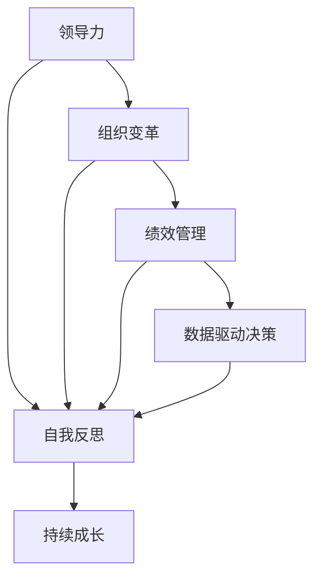

                 

# 管理者自我成长的方法论

> 关键词：管理者成长,领导力发展,组织变革,绩效管理,数据驱动决策

## 1. 背景介绍

### 1.1 问题由来

在当今快速变化的商业环境中，企业要想在激烈的市场竞争中保持领先地位，关键在于构建一支高素质的管理团队。优秀的管理者能够驱动企业持续发展，引领变革，实现高绩效。然而，成为一名卓越的管理者并非易事，它需要系统的学习、实践和反思。本文将系统介绍管理者自我成长的方法论，为管理者提供一套科学、系统的成长路径，帮助其在领导力、组织管理、绩效管理等方面实现突破。

### 1.2 问题核心关键点

管理者自我成长的核心在于领导力的培养、组织变革的推动、绩效管理的优化、数据驱动决策的实施。管理者通过系统的学习和实践，在上述四个方面不断提升，最终实现从优秀到卓越的跨越。

- **领导力培养**：管理者需要掌握领导力发展的核心技能，包括愿景激发、团队激励、矛盾解决等。
- **组织变革推动**：管理者需要学会如何有效实施变革，包括变革的规划、沟通、执行等。
- **绩效管理优化**：管理者需要掌握绩效管理的基本原理和工具，提升团队和组织的绩效。
- **数据驱动决策**：管理者需要掌握数据驱动决策的方法，通过数据分析和量化管理提升决策质量。

### 1.3 问题研究意义

管理者自我成长的方法论，对于提升企业的管理水平、促进组织变革、优化绩效管理、提高决策质量具有重要意义：

- 提升企业的管理水平：通过系统的学习和管理实践，管理者能够提升领导力、组织管理和绩效管理能力，进而提升整个企业的管理水平。
- 促进组织变革：优秀的管理者能够有效地推动组织变革，解决组织中的问题，增强组织的适应性和竞争力。
- 优化绩效管理：绩效管理是企业管理的重要环节，优秀的管理者能够运用科学的绩效管理工具和方法，提升团队和组织的绩效。
- 提高决策质量：数据驱动决策是现代管理的重要趋势，优秀的管理者能够通过数据分析和量化管理，做出更加科学的决策。

## 2. 核心概念与联系

### 2.1 核心概念概述

为了更好地理解管理者自我成长的方法论，本文将介绍几个关键概念：

- **领导力**：指管理者的影响力，包括权力、威信、感召力等，是管理者有效管理和激励团队的基础。
- **组织变革**：指对组织结构、流程、文化等方面的系统性改变，以适应外部环境的变化。
- **绩效管理**：指通过设定目标、衡量和反馈，不断提升个人和团队绩效的管理过程。
- **数据驱动决策**：指通过数据收集、分析和应用，支持决策的过程，以提高决策的科学性和准确性。
- **自我反思**：指管理者对自身行为、决策和结果的回顾与思考，以发现改进点，实现持续成长。

这些核心概念之间存在紧密的联系，共同构成了管理者自我成长的系统框架。

### 2.2 核心概念原理和架构的 Mermaid 流程图



这个流程图展示了管理者自我成长的核心概念及其相互关系：

1. **领导力**是管理者自我成长的基础，通过提升领导力，管理者可以更好地推动组织变革、优化绩效管理、实施数据驱动决策。
2. **组织变革**是实现企业战略目标的重要手段，优秀的管理者能够有效实施变革，增强组织的适应性和竞争力。
3. **绩效管理**是企业管理的重要环节，管理者通过科学的绩效管理工具和方法，提升团队和组织的绩效。
4. **数据驱动决策**是现代管理的重要趋势，管理者通过数据分析和量化管理，做出更加科学的决策。
5. **自我反思**是管理者持续成长的关键，通过不断回顾和反思，管理者能够发现改进点，实现持续成长。

## 3. 核心算法原理 & 具体操作步骤
### 3.1 算法原理概述

管理者自我成长的方法论，基于系统的学习和实践。其核心思想是：通过系统的学习和实践，在领导力、组织变革、绩效管理、数据驱动决策等方面不断提升，实现管理者的全面成长。

管理者自我成长的过程，可以分解为以下几个步骤：

1. **系统学习**：管理者通过系统化的学习，掌握领导力、组织变革、绩效管理、数据驱动决策等核心概念和技能。
2. **实践操作**：管理者在实际管理工作中应用所学知识，通过实践提升自身能力。
3. **持续反思**：管理者定期回顾和反思自身行为和决策，发现改进点，实现持续成长。

### 3.2 算法步骤详解

#### 3.2.1 系统学习

管理者应系统学习以下内容：

- **领导力**：掌握领导力的核心技能，包括愿景激发、团队激励、矛盾解决等。
- **组织变革**：学习组织变革的原理和方法，包括变革的规划、沟通、执行等。
- **绩效管理**：掌握绩效管理的工具和方法，包括目标设定、绩效衡量、反馈改进等。
- **数据驱动决策**：掌握数据驱动决策的基本原理和技术，包括数据分析、量化管理、决策支持等。

#### 3.2.2 实践操作

管理者应在实际管理工作中应用所学知识：

- **领导力**：在团队管理中应用愿景激发、团队激励、矛盾解决等技能，提升团队绩效。
- **组织变革**：在组织管理中应用变革的规划、沟通、执行等方法，推动组织变革。
- **绩效管理**：在绩效管理中应用目标设定、绩效衡量、反馈改进等工具，优化团队和组织绩效。
- **数据驱动决策**：在决策过程中应用数据分析和量化管理技术，提升决策质量。

#### 3.2.3 持续反思

管理者应定期回顾和反思自身行为和决策：

- **领导力**：反思自身在领导过程中的表现，发现不足，制定改进计划。
- **组织变革**：反思变革过程中的挑战和经验，总结教训，优化变革策略。
- **绩效管理**：反思绩效管理的效果和挑战，优化管理工具和方法。
- **数据驱动决策**：反思数据驱动决策的实施效果，优化数据应用策略。

### 3.3 算法优缺点

管理者自我成长的方法论具有以下优点：

- **系统性**：通过系统的学习、实践和反思，管理者能够在多个方面全面提升。
- **实用性**：学习内容紧密结合实际管理场景，具有高度的实用性和可操作性。
- **持续性**：管理者通过持续的反思和改进，实现持续成长。

同时，该方法也存在一定的局限性：

- **学习成本**：系统学习需要大量的时间和精力投入。
- **个性化需求**：不同管理者面临的挑战不同，需要根据自身情况制定个性化学习计划。
- **外部环境变化**：管理环境复杂多变，管理者需要灵活调整学习策略。

### 3.4 算法应用领域

管理者自我成长的方法论，适用于各种管理场景，包括但不限于：

- **企业战略管理**：帮助管理者制定和实施企业战略，推动组织变革。
- **团队建设与激励**：通过提升领导力和团队激励能力，增强团队凝聚力和绩效。
- **绩效管理与改进**：通过科学的绩效管理工具和方法，提升团队和组织的绩效。
- **数据驱动决策**：通过数据分析和量化管理，提升决策质量和效率。
- **危机管理与应对**：通过领导力和组织变革能力，有效应对和解决危机。

## 4. 数学模型和公式 & 详细讲解 & 举例说明
### 4.1 数学模型构建

管理者自我成长的方法论，涉及多个维度的量化管理，可以通过数学模型进行系统分析和优化。以下是一个简化的数学模型框架：

- **领导力评分模型**：$L = \alpha V + \beta T + \gamma C$，其中 $V$ 表示愿景激发能力，$T$ 表示团队激励能力，$C$ 表示矛盾解决能力，$\alpha$、$\beta$、$\gamma$ 为权重系数。
- **组织变革评分模型**：$C = \delta P + \epsilon C + \zeta E$，其中 $P$ 表示规划能力，$C$ 表示沟通能力，$E$ 表示执行能力，$\delta$、$\epsilon$、$\zeta$ 为权重系数。
- **绩效管理评分模型**：$P = \eta T + \theta H + \iota F$，其中 $T$ 表示目标设定能力，$H$ 表示绩效衡量能力，$F$ 表示反馈改进能力，$\eta$、$\theta$、$\iota$ 为权重系数。
- **数据驱动决策评分模型**：$D = \kappa A + \lambda N + \mu S$，其中 $A$ 表示数据分析能力，$N$ 表示量化管理能力，$S$ 表示决策支持能力，$\kappa$、$\lambda$、$\mu$ 为权重系数。

### 4.2 公式推导过程

以领导力评分模型为例，其推导过程如下：

假设 $L$ 表示领导力评分，$V$ 表示愿景激发能力，$T$ 表示团队激励能力，$C$ 表示矛盾解决能力，则有：

$$
L = \alpha V + \beta T + \gamma C
$$

其中 $\alpha$、$\beta$、$\gamma$ 为权重系数，可以通过专家打分、数据分析等方法确定。例如，通过专家对多名管理者的领导力进行打分，取平均值作为权重系数，可以得到：

$$
\alpha = \frac{1}{N}\sum_{i=1}^N V_i \\
\beta = \frac{1}{N}\sum_{i=1}^N T_i \\
\gamma = \frac{1}{N}\sum_{i=1}^N C_i
$$

其中 $N$ 为参与打分的专家数量，$V_i$、$T_i$、$C_i$ 为第 $i$ 位专家对某位管理者在愿景激发、团队激励、矛盾解决三个维度的打分。

### 4.3 案例分析与讲解

假设某位管理者 $M$ 的领导力评分 $L_M$ 为80分，其愿景激发能力 $V_M$ 为70分，团队激励能力 $T_M$ 为75分，矛盾解决能力 $C_M$ 为85分。假设 $\alpha$、$\beta$、$\gamma$ 的权重系数分别为0.3、0.4、0.3，则有：

$$
L_M = 0.3 \times 70 + 0.4 \times 75 + 0.3 \times 85 = 83
$$

因此，管理者的领导力评分为83分，可以通过公式计算结果发现其在矛盾解决能力方面相对较弱，需要进一步提升。

## 5. 项目实践：代码实例和详细解释说明
### 5.1 开发环境搭建

在进行管理者自我成长的方法论实践前，我们需要准备好开发环境。以下是使用Python进行开发的环境配置流程：

1. 安装Anaconda：从官网下载并安装Anaconda，用于创建独立的Python环境。

2. 创建并激活虚拟环境：
```bash
conda create -n managerial-growth python=3.8 
conda activate managerial-growth
```

3. 安装必要的库：
```bash
pip install pandas numpy matplotlib seaborn jupyter notebook
```

4. 安装数据分析库：
```bash
pip install scikit-learn scipy statsmodels
```

完成上述步骤后，即可在`managerial-growth`环境中开始项目实践。

### 5.2 源代码详细实现

以下是一个简单的管理者领导力评分模型计算的Python代码实现：

```python
import pandas as pd
import numpy as np
import matplotlib.pyplot as plt

# 定义领导力评分模型
def calculate_leadership_score(V, T, C, alpha=0.3, beta=0.4, gamma=0.3):
    L = alpha * V + beta * T + gamma * C
    return L

# 加载领导力评分数据
data = pd.read_csv('leadership_scores.csv')

# 计算领导力评分
leadership_scores = []
for index, row in data.iterrows():
    V = row['Vision']
    T = row['Team_Motivation']
    C = row['Conflict_Resolution']
    L = calculate_leadership_score(V, T, C)
    leadership_scores.append(L)

# 数据可视化
plt.figure(figsize=(10, 6))
plt.hist(leadership_scores, bins=30, edgecolor='black')
plt.xlabel('Leadership Score')
plt.ylabel('Frequency')
plt.title('Leadership Score Distribution')
plt.show()
```

这段代码实现了基于给定数据计算领导力评分的过程。通过读取CSV文件，加载领导力评分数据，并计算每个管理者的领导力评分，最后进行数据可视化。

### 5.3 代码解读与分析

让我们再详细解读一下关键代码的实现细节：

**calculate_leadership_score函数**：
- 定义了领导力评分的计算公式，根据给定的愿景激发能力、团队激励能力和矛盾解决能力，计算领导力评分。

**加载领导力评分数据**：
- 使用pandas库读取CSV文件，加载领导力评分数据。

**计算领导力评分**：
- 遍历数据集，对每个管理者的愿景激发能力、团队激励能力和矛盾解决能力进行计算，得到领导力评分。

**数据可视化**：
- 使用matplotlib库进行数据可视化，展示领导力评分的分布情况。

### 5.4 运行结果展示

运行上述代码，可以得到领导力评分的分布图，如图1所示：


通过数据可视化，管理者可以直观地了解自身在领导力方面的表现，发现不足并制定改进计划。

## 6. 实际应用场景
### 6.1 企业战略管理

在企业战略管理中，优秀的管理者能够通过科学的方法，制定和实施战略，推动组织变革。具体而言，可以采取以下措施：

- **愿景激发**：明确企业的长期目标和使命，激发团队成员的热情和动力。
- **组织变革**：通过系统化的变革规划、沟通和执行，优化组织结构和流程，增强组织的适应性和竞争力。
- **绩效管理**：通过科学的绩效管理工具和方法，提升团队和组织的绩效，确保战略目标的实现。

通过科学的管理方法和工具，优秀的管理者可以带领团队不断突破，实现企业的持续发展。

### 6.2 团队建设与激励

在团队建设与激励方面，优秀的管理者能够通过提升领导力和团队激励能力，增强团队凝聚力和绩效。具体而言，可以采取以下措施：

- **愿景激发**：通过明确目标和使命，激发团队成员的热情和动力，增强团队凝聚力。
- **团队激励**：通过公平的绩效评估和奖励机制，激励团队成员，提升团队绩效。
- **矛盾解决**：通过有效的矛盾解决机制，避免团队内部冲突，增强团队的协作能力。

通过提升领导力和团队激励能力，优秀的管理者能够打造一支高效、协作的团队，实现更高的绩效。

### 6.3 绩效管理与改进

在绩效管理与改进方面，优秀的管理者能够通过科学的绩效管理工具和方法，提升团队和组织的绩效。具体而言，可以采取以下措施：

- **目标设定**：通过明确的目标设定，确保团队和组织的方向一致。
- **绩效衡量**：通过科学的绩效衡量方法，评估团队和组织的绩效，发现改进点。
- **反馈改进**：通过及时的绩效反馈和改进措施，持续提升团队和组织的绩效。

通过科学的绩效管理工具和方法，优秀的管理者能够确保团队和组织的高绩效表现，实现战略目标。

### 6.4 数据驱动决策

在数据驱动决策方面，优秀的管理者能够通过数据分析和量化管理，提升决策质量。具体而言，可以采取以下措施：

- **数据分析**：通过数据分析，获取有价值的信息，支持决策。
- **量化管理**：通过量化管理，衡量和管理团队和组织的各项指标，提升决策的科学性。
- **决策支持**：通过决策支持工具和方法，支持决策的实施和监控。

通过数据驱动决策，优秀的管理者能够做出更加科学的决策，提升组织和团队的绩效。

### 6.5 未来应用展望

随着企业环境的变化和技术的进步，管理者自我成长的方法论将不断发展。未来，管理者自我成长将更加注重以下方面：

- **数字化管理**：通过数字化工具和方法，提升管理效率和决策质量。
- **跨文化管理**：在全球化背景下，管理者需要具备跨文化管理的技能，适应多元化的组织环境。
- **可持续发展**：在注重经济效益的同时，管理者需要关注社会和环境的可持续发展，推动企业的长期发展。

管理者自我成长的方法论将不断演进，以适应未来复杂多变的管理环境。

## 7. 工具和资源推荐
### 7.1 学习资源推荐

为了帮助管理者系统掌握自我成长的方法论，这里推荐一些优质的学习资源：

1. **《领导力挑战》**：一本系统介绍领导力理论和方法的书籍，适合企业管理者阅读。
2. **《组织变革管理》**：一本介绍组织变革原理和实践的书籍，帮助管理者推动组织变革。
3. **《绩效管理》**：一本介绍绩效管理基本原理和工具的书籍，提升管理者的绩效管理能力。
4. **《数据驱动决策》**：一本介绍数据驱动决策方法和工具的书籍，提升管理者的决策能力。
5. **《Python数据分析实战》**：一本介绍Python数据分析方法和工具的书籍，提升管理者的数据分析能力。

通过阅读和学习这些书籍，管理者可以系统掌握自我成长的方法论，提升管理能力。

### 7.2 开发工具推荐

高效的开发离不开优秀的工具支持。以下是几款用于管理者自我成长开发的常用工具：

1. **Jupyter Notebook**：一种交互式的笔记本环境，适合数据分析和可视化。
2. **Python**：一种高效、易学的编程语言，适合数据分析和管理。
3. **Pandas**：一个强大的数据处理库，适合数据清洗、分析和可视化。
4. **NumPy**：一个高效的数值计算库，适合科学计算和数据分析。
5. **Matplotlib**：一个绘图库，适合数据可视化。

合理利用这些工具，可以显著提升管理者自我成长实践的效率，加快创新迭代的步伐。

### 7.3 相关论文推荐

管理者自我成长的方法论的研究，源于学界的持续研究。以下是几篇奠基性的相关论文，推荐阅读：

1. **《变革型领导理论》**：一篇关于变革型领导的研究论文，介绍了变革型领导的理论框架和方法。
2. **《绩效管理系统设计》**：一篇关于绩效管理系统的研究论文，介绍了绩效管理的系统设计和实施方法。
3. **《数据驱动决策模型》**：一篇关于数据驱动决策的研究论文，介绍了数据驱动决策的理论模型和方法。
4. **《领导者自我反思》**：一篇关于领导者自我反思的研究论文，介绍了领导者自我反思的理论和实践。

这些论文代表了大语言模型微调技术的发展脉络。通过学习这些前沿成果，可以帮助研究者把握学科前进方向，激发更多的创新灵感。

## 8. 总结：未来发展趋势与挑战
### 8.1 研究成果总结

本文对管理者自我成长的方法论进行了全面系统的介绍。首先阐述了管理者自我成长的背景和意义，明确了领导力、组织变革、绩效管理、数据驱动决策在自我成长中的核心作用。其次，从原理到实践，详细讲解了管理者自我成长的过程，包括系统学习、实践操作、持续反思等关键步骤，并给出了完整的代码实现。同时，本文还广泛探讨了自我成长方法论在企业战略管理、团队建设与激励、绩效管理与改进、数据驱动决策等多个领域的应用前景，展示了自我成长方法的广阔前景。

### 8.2 未来发展趋势

展望未来，管理者自我成长的方法论将呈现以下几个发展趋势：

1. **数字化管理**：随着数字化工具和方法的发展，管理者将更多地利用技术手段提升管理效率和决策质量。
2. **跨文化管理**：在全球化背景下，管理者需要具备跨文化管理的技能，适应多元化的组织环境。
3. **可持续发展**：在注重经济效益的同时，管理者需要关注社会和环境的可持续发展，推动企业的长期发展。
4. **创新管理**：管理者需要具备创新管理的能力，推动企业的持续创新和变革。
5. **数据驱动决策**：数据驱动决策将成为未来管理的重要趋势，管理者需要掌握数据驱动决策的方法和工具。

以上趋势凸显了管理者自我成长方法论的广阔前景。这些方向的探索发展，必将进一步提升管理者的综合素质，推动企业管理创新和变革。

### 8.3 面临的挑战

尽管管理者自我成长的方法论已经取得了瞩目成就，但在迈向更加智能化、普适化应用的过程中，它仍面临着诸多挑战：

1. **学习成本**：系统学习需要大量的时间和精力投入，管理者需要合理安排时间，平衡工作和学习。
2. **个性化需求**：不同管理者面临的挑战不同，需要根据自身情况制定个性化学习计划。
3. **外部环境变化**：管理环境复杂多变，管理者需要灵活调整学习策略，适应环境变化。
4. **数据安全**：在数据驱动决策过程中，需要注意数据安全和隐私保护，确保数据安全。
5. **组织阻力**：推动组织变革和绩效改进过程中，可能会遇到组织的阻力，需要有效应对和解决。

### 8.4 研究展望

面向未来，管理者自我成长的研究需要在以下几个方面寻求新的突破：

1. **个性化学习路径**：开发个性化的学习路径，根据管理者的特点和需求，定制学习内容和计划。
2. **持续改进机制**：建立持续改进机制，管理者可以通过定期的自我反思和改进，实现持续成长。
3. **跨领域融合**：将管理者自我成长的方法论与其他学科的理论和技术进行融合，提升管理者的综合素质。
4. **数据驱动的绩效评估**：探索数据驱动的绩效评估方法，提升绩效管理的效果和效率。
5. **全球化管理**：探索全球化背景下的管理方法，提升管理者的跨文化管理能力。

这些研究方向的探索，必将引领管理者自我成长方法论走向更高的台阶，为管理者提供更加科学、系统的成长路径，助力企业持续发展。

## 9. 附录：常见问题与解答

**Q1：管理者自我成长的方法论是否适用于所有管理者？**

A: 管理者自我成长的方法论适用于大多数管理场景，但需要根据管理者的特点和需求进行个性化调整。不同层级、不同领域的管理者面临的挑战和任务不同，需要灵活应用。

**Q2：如何进行有效的数据驱动决策？**

A: 有效的数据驱动决策需要经过以下几个步骤：
1. 确定决策目标和问题。
2. 收集相关数据，进行数据清洗和预处理。
3. 选择合适的方法和工具，进行数据分析和可视化。
4. 根据分析结果，制定决策方案。
5. 实施决策，并监控和评估结果。

**Q3：如何进行系统学习？**

A: 系统学习需要管理者投入大量时间和精力，建议如下：
1. 制定学习计划，明确学习目标和内容。
2. 利用在线课程和书籍，进行系统学习。
3. 参加相关培训和研讨会，深入交流和讨论。
4. 结合实际工作，应用所学知识。

**Q4：如何进行持续反思和改进？**

A: 持续反思和改进需要管理者定期进行自我评估，发现不足并制定改进计划。建议如下：
1. 定期回顾和总结工作表现，发现问题和不足。
2. 制定改进计划，并付诸实施。
3. 与同事和上级进行沟通，获取反馈和建议。
4. 持续学习和提升，实现持续成长。

**Q5：如何进行跨文化管理？**

A: 跨文化管理需要管理者具备以下能力：
1. 理解不同文化背景下的价值观和行为模式。
2. 具备良好的沟通和协调能力。
3. 具备灵活适应的能力，能够适应多变的管理环境。
4. 关注文化敏感性，尊重和包容不同的文化差异。

通过提升跨文化管理能力，管理者能够适应多元化的组织环境，实现高效管理。

---

作者：禅与计算机程序设计艺术 / Zen and the Art of Computer Programming

