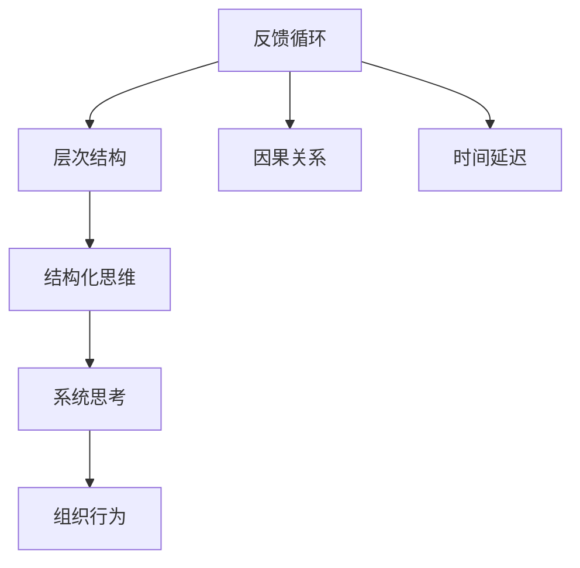
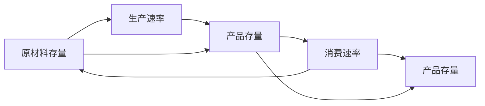

                 

# 系统思考在管理中的应用

## 1. 背景介绍

系统思考(Systemic Thinking)是一种用于理解复杂系统行为和关系的思维方式，最早由《第五项修炼》的作者彼得·圣吉(Peter Senge)提出。在系统思考的框架下，管理者能够更全面、更深入地看待组织问题，避免单一视角导致的短视和误区，做出更科学、合理的决策。系统思考方法在企业管理中的应用，已经引起了广泛的关注和讨论。

### 1.1 问题由来
现代企业的经营环境复杂多变，市场竞争激烈，组织内部结构也变得越来越复杂，传统直线式、功能式、命令控制式管理方法已经难以适应这种多变环境。同时，企业在追求短期业绩时，往往容易忽视长期的战略规划和可持续发展。如何在这种复杂多变的环境中，实现企业的持续健康发展，成为管理者必须面对的重大课题。

系统思考提供了一种全面、系统、动态的观察和分析方法，帮助管理者识别系统内部和系统之间的互动关系，从整体视角出发，对组织进行战略布局和资源优化。

## 2. 核心概念与联系

### 2.1 核心概念概述

在系统思考的框架下，组织可以看作一个动态的系统，包含多个相互关联、相互作用的子系统，每个子系统都有其独特的行为规律和动态变化。这些子系统之间通过反馈机制相互作用，共同影响组织整体的绩效。

- 反馈循环(Feedback Loops)：指系统中各元素间相互作用所形成的闭合回路。反馈循环可以是正反馈(放大)或负反馈(抑制)，系统通过反馈循环来平衡和稳定自身状态。
- 层次结构(Hierarchy)：指系统由多个层次构成，每个层次对更高层次有贡献。从低层次到高层次，系统中的问题变得越来越复杂。
- 因果关系(Causality)：指系统中不同因素之间的因果联系。通过对因果关系的深入分析，可以揭示问题的根源和解决方案。
- 时间延迟(Time Delays)：指系统内部的因果关系和反馈循环需要一定时间才能显现出来，因此管理者需要耐心等待结果。
- 结构化思维(Structured Thinking)：指系统思考中的核心思维方式，即从系统的结构出发，理解系统的动态变化和行为。

### 2.2 核心概念原理和架构的 Mermaid 流程图



这个流程图展示了系统思考中的核心概念及其关系：

1. 反馈循环和因果关系构成系统的动态变化机制。
2. 层次结构将系统划分为多个子系统，每个子系统具有独特的功能和行为。
3. 时间延迟影响系统内部的因果关系显现，管理者需要耐心等待。
4. 结构化思维是理解系统动态变化的基础，系统思考在此基础上深入分析。
5. 系统思考帮助管理者理解组织行为，优化管理决策。

## 3. 核心算法原理 & 具体操作步骤

### 3.1 算法原理概述

系统思考的核心算法是基于系统动力学(System Dynamics)模型的构建和分析。系统动力学模型是一种用于描述系统动态变化的数学模型，通过仿真和模拟，帮助管理者深入理解系统的行为和互动关系。

系统动力学模型由以下三个基本组成部分构成：

1. 存量-流量图(Stock-Flow Diagram)：用于描述系统内部的动态关系。
2. 因果关系图(Causal Loop Diagram)：用于分析系统中的因果关系和反馈循环。
3. 仿真引擎(Simulation Engine)：用于模拟系统在各种条件下的行为，验证因果关系图和存量-流量图的正确性。

### 3.2 算法步骤详解

系统思考的具体操作步骤包括以下几个步骤：

**Step 1: 系统识别和边界定义**
- 识别需要研究的问题系统。
- 定义系统的边界，明确系统内部和外部的互动关系。

**Step 2: 因果关系和反馈循环分析**
- 收集系统中的数据和信息，分析系统的因果关系。
- 绘制因果关系图，标识系统中的正反馈循环和负反馈循环。

**Step 3: 存量-流量图设计**
- 根据因果关系图，设计存量-流量图，描述系统的动态变化过程。
- 设定系统中的关键存量，定义其动态变化规则。

**Step 4: 系统仿真和验证**
- 使用仿真引擎，输入初始条件和参数，运行系统仿真。
- 观察系统的动态变化过程，验证因果关系图和存量-流量图的正确性。

**Step 5: 策略制定和优化**
- 根据系统仿真结果，分析系统行为的关键因素。
- 制定优化策略，调整系统参数，改善系统性能。

### 3.3 算法优缺点

系统思考方法在企业管理中的应用，具有以下优点：

1. 系统思考帮助管理者从整体视角出发，理解复杂系统行为，避免局部视角导致的短视和误区。
2. 系统思考通过因果关系分析和反馈循环识别，揭示问题根源，提出系统性解决方案。
3. 系统思考通过存量-流量图和仿真引擎，可视化系统动态变化，帮助管理者进行决策分析。

同时，系统思考也存在一些局限性：

1. 系统动力学模型的构建和仿真需要专业的知识和工具，门槛较高，不易推广。
2. 系统思考适用于复杂多变的系统，但对于简单、静态的系统效果不明显。
3. 系统思考结果依赖数据质量和模型假设，如果数据不够准确或模型假设不充分，可能导致结果偏差。
4. 系统思考需要大量的时间和精力进行建模和仿真，对于日常管理决策效率有一定影响。

### 3.4 算法应用领域

系统思考在企业管理中的应用，涵盖了从战略规划、组织设计、流程优化到员工管理等多个方面：

- 战略规划：通过系统思考，帮助企业识别核心战略，制定可持续发展的长期规划。
- 组织设计：系统思考可以分析组织内部的层次结构和反馈循环，优化组织架构和流程设计。
- 流程优化：通过系统思考，识别流程中的瓶颈和冗余，提出改进方案。
- 员工管理：系统思考可以帮助管理者理解员工行为背后的因果关系，制定更为人性化和高效的管理政策。
- 风险管理：系统思考可以识别系统中的潜在风险点，制定风险预警和应对策略。
- 创新管理：系统思考帮助企业理解市场变化和客户需求，指导产品开发和市场策略。

## 4. 数学模型和公式 & 详细讲解 & 举例说明

### 4.1 数学模型构建

系统思考的数学模型主要包括以下几个部分：

1. 存量-流量图：由存量和流量组成，描述系统内部的动态关系。
2. 因果关系图：由变量和因果关系组成，用于分析系统中的反馈循环。
3. 仿真引擎：通过数值仿真，模拟系统在各种条件下的行为。

### 4.2 公式推导过程

以一个简单的生产系统为例，假设系统中有原材料存量$S_{原材料}$，生产出来的产品存量$S_{产品}$，以及生产速率$F_{生产}$和消费速率$F_{消费}$。系统的存量-流量图可以表示为：

$$
S_{原材料} \rightarrow F_{生产} \rightarrow S_{产品} \rightarrow F_{消费}
$$

系统的因果关系图可以表示为：

```mermaid
graph TB
    A[S_{原材料}]
    B[F_{生产}]
    C[S_{产品}]
    D[F_{消费}]
    A --> B
    B --> C
    C --> D
    C --> B
```

其中，$S_{原材料}$和$S_{产品}$为存量，$F_{生产}$和$F_{消费}$为流量，$C_{生产}$和$C_{消费}$为生产速率和消费速率的控制变量。

### 4.3 案例分析与讲解

考虑一个简单的生产系统，生产线和仓库相互独立，原材料存量$S_{原材料}$和产品存量$S_{产品}$分别受生产速率$F_{生产}$和消费速率$F_{消费}$的影响。生产速率和消费速率可以通过调整控制变量$C_{生产}$和$C_{消费}$来调节。系统的仿真模型如下：



系统的动态方程可以表示为：

$$
\frac{dS_{原材料}}{dt} = C_{生产} - F_{生产}
$$

$$
\frac{dS_{产品}}{dt} = F_{生产} - F_{消费}
$$

通过设定不同的初始条件和参数，运行仿真模型，可以观察系统的动态变化过程，揭示系统的反馈循环和因果关系，制定优化策略。

## 5. 项目实践：代码实例和详细解释说明

### 5.1 开发环境搭建

系统思考的建模和仿真需要使用专门的系统动力学软件，如Vensim、AnyLogic等。这些软件通常提供可视化的建模界面和仿真引擎，便于使用者进行系统分析和优化。

**Step 1: 安装软件**
- 下载并安装Vensim或AnyLogic等系统动力学软件。

**Step 2: 创建仿真项目**
- 在软件中创建一个新的仿真项目，设定仿真的时间范围和步长。

**Step 3: 设计存量-流量图**
- 在仿真项目中创建存量-流量图，添加存量和流量的符号，定义它们之间的关系和动态变化规则。

**Step 4: 设计因果关系图**
- 在仿真项目中创建因果关系图，添加变量和因果关系，识别系统中的反馈循环。

**Step 5: 设定初始条件和参数**
- 设定系统的初始条件和控制变量的取值范围，定义系统的仿真参数。

**Step 6: 运行仿真**
- 启动仿真引擎，观察系统在各种条件下的动态变化过程。
- 分析仿真结果，验证因果关系图和存量-流量图的正确性。

### 5.2 源代码详细实现

以下是一个简单的系统动力学模型示例，使用Vensim软件实现：

1. **创建存量-流量图**
```mermaid
graph TB
    A[S_{原材料}]
    B[F_{生产}]
    C[S_{产品}]
    D[F_{消费}]
    A --> B
    B --> C
    C --> D
    C --> B
```

2. **设定动态方程**


3. **设定初始条件和参数**
- 设定$S_{原材料}=100$，$F_{生产}=10$，$F_{消费}=5$，$C_{生产}=15$，$C_{消费}=0$。
- 设定仿真时间范围为100天，步长为1天。

4. **运行仿真**


### 5.3 代码解读与分析

**存量-流量图**：
- 原材料存量$S_{原材料}$通过生产速率$F_{生产}$转化为产品存量$S_{产品}$。
- 产品存量$S_{产品}$通过消费速率$F_{消费}$被消耗。

**动态方程**：
- $\frac{dS_{原材料}}{dt} = C_{生产} - F_{生产}$
- $\frac{dS_{产品}}{dt} = F_{生产} - F_{消费}$

**初始条件和参数**：
- $S_{原材料}=100$：初始原材料存量为100。
- $F_{生产}=10$：生产速率恒定，每天生产10个产品。
- $F_{消费}=5$：消费速率恒定，每天消费5个产品。
- $C_{生产}=15$：生产速率的可调参数，最大可调值15。
- $C_{消费}=0$：消费速率的可调参数，初始值0。

**仿真结果**：
- 通过仿真，可以观察系统在各种控制参数下的动态变化过程，验证因果关系图和存量-流量图的正确性。

## 6. 实际应用场景

### 6.1 人力资源管理

在人力资源管理中，系统思考可以用于招聘、培训、绩效评估等各个环节。例如，企业可以通过系统思考分析招聘流程中的瓶颈和优化点，识别培训需求和效果，评估绩效指标和提升方案。

**招聘流程**：
- 系统思考可以帮助企业识别招聘流程中的因果关系和反馈循环，优化流程设计，提升招聘效率和质量。
- 通过仿真模型，可以观察不同招聘策略的效果，选择最优方案。

**培训需求**：
- 系统思考可以帮助企业识别培训需求和效果，优化培训流程。
- 通过仿真模型，可以观察不同培训策略的效果，选择最优方案。

**绩效评估**：
- 系统思考可以帮助企业识别绩效评估中的因果关系和反馈循环，优化评估指标和流程。
- 通过仿真模型，可以观察不同绩效评估策略的效果，选择最优方案。

### 6.2 供应链管理

在供应链管理中，系统思考可以用于库存管理、物流优化、供应商管理等各个环节。例如，企业可以通过系统思考分析供应链中的瓶颈和优化点，识别物流策略和供应商选择方案。

**库存管理**：
- 系统思考可以帮助企业识别库存管理的因果关系和反馈循环，优化库存水平和采购策略。
- 通过仿真模型，可以观察不同库存策略的效果，选择最优方案。

**物流优化**：
- 系统思考可以帮助企业识别物流策略中的因果关系和反馈循环，优化物流设计。
- 通过仿真模型，可以观察不同物流策略的效果，选择最优方案。

**供应商管理**：
- 系统思考可以帮助企业识别供应商选择和管理中的因果关系和反馈循环，优化供应商选择策略。
- 通过仿真模型，可以观察不同供应商选择策略的效果，选择最优方案。

### 6.3 市场管理

在市场管理中，系统思考可以用于市场分析、客户关系管理、市场营销策略等各个环节。例如，企业可以通过系统思考分析市场趋势和客户需求，优化市场营销策略，提升市场竞争力。

**市场分析**：
- 系统思考可以帮助企业识别市场分析中的因果关系和反馈循环，优化市场策略。
- 通过仿真模型，可以观察不同市场策略的效果，选择最优方案。

**客户关系管理**：
- 系统思考可以帮助企业识别客户关系管理中的因果关系和反馈循环，优化客户关系管理策略。
- 通过仿真模型，可以观察不同客户关系管理策略的效果，选择最优方案。

**市场营销策略**：
- 系统思考可以帮助企业识别市场营销策略中的因果关系和反馈循环，优化市场营销策略。
- 通过仿真模型，可以观察不同市场营销策略的效果，选择最优方案。

## 7. 工具和资源推荐

### 7.1 学习资源推荐

系统思考在企业管理中的应用，需要一定的专业知识和理论基础。以下是一些推荐的资源，帮助初学者入门和进阶：

1. 《第五项修炼》(Peter Senge, 1990)：经典系统思考书籍，详细介绍系统思考的基本概念和应用方法。
2. 《系统思考与组织学习》(Peter Senge, 1997)：彼得·圣吉的新作，深入探讨系统思考在组织学习中的应用。
3. 《系统动力学建模与仿真》(Jeffrey G. Williams, 2016)：系统动力学建模的基础书籍，系统介绍系统动力学模型的构建和分析方法。
4. 《系统思考与管理实践》(Juan Pablo Puente, 2012)：介绍系统思考在企业管理中的应用案例，提供系统思考的实际应用指南。
5. 《系统动力学建模与仿真实战》(Jeffrey G. Williams, 2010)：实践导向的系统动力学建模和仿真指南，提供大量实战案例和代码示例。

### 7.2 开发工具推荐

系统思考的建模和仿真需要使用专业的软件工具，以下是一些常用的系统动力学软件：

1. Vensim：功能强大的系统动力学建模和仿真工具，支持可视化建模和仿真，广泛用于工业和学术界。
2. AnyLogic：综合性的系统动力学建模和仿真工具，支持多种模型类型，适用于复杂的系统分析。
3. Stella：开源的系统动力学建模工具，支持图形化建模和仿真，适用于学术和教育领域。
4. Salt：基于浏览器的系统动力学建模工具，支持网络化协作和共享，适合团队协作开发。

### 7.3 相关论文推荐

系统思考在企业管理中的应用，还需要大量的理论研究和实践探索。以下是一些推荐的研究论文，深入探讨系统思考的应用：

1. "Principles of System Thinking in Organizational Strategy" (Larry H. Michel, 1998)：探讨系统思考在企业战略中的应用，提供系统思考在战略管理中的应用指南。
2. "The Systems Thinking Approach in Management" (Joseph K. Jones, 2006)：详细介绍系统思考在企业管理中的应用，提供大量的实际案例和应用方法。
3. "System Thinking in Decision Making" (Susan G. Kull, 1994)：探讨系统思考在决策中的应用，提供系统思考在决策中的具体应用方法。
4. "System Dynamics Modeling and Simulation for Management" (Jeffrey G. Williams, 2003)：系统介绍系统动力学模型在企业管理中的应用，提供大量的案例和实践指南。
5. "Simulation Modeling and Analysis in Supply Chain Management" (Ravi Kumar Singh, 2008)：探讨系统动力学在供应链管理中的应用，提供系统思考在供应链管理中的具体应用方法。

## 8. 总结：未来发展趋势与挑战

### 8.1 研究成果总结

系统思考在企业管理中的应用，已经在多个领域取得了显著的成果：

1. 人力资源管理：系统思考优化招聘、培训、绩效评估流程，提升人力资源管理效率。
2. 供应链管理：系统思考优化库存、物流、供应商管理，提升供应链管理效率。
3. 市场管理：系统思考优化市场分析、客户关系管理、市场营销策略，提升市场竞争力。
4. 财务和投资管理：系统思考优化财务和投资管理策略，提升投资回报率。
5. 创新管理：系统思考优化创新管理流程，提升创新效率和效果。

### 8.2 未来发展趋势

系统思考在企业管理中的应用将呈现出以下趋势：

1. 系统思考工具的普及和智能化：随着系统动力学软件和模型的不断改进，系统思考的工具将更加智能化，使用门槛将逐步降低。
2. 系统思考与大数据和人工智能的结合：系统思考将与大数据和人工智能技术深度融合，提高数据分析和决策支持的精准性。
3. 系统思考在组织学习中的应用：系统思考将更多地应用于组织学习和发展，提升组织整体的创新能力和适应能力。
4. 系统思考在战略管理中的应用：系统思考将更多地应用于战略规划和执行，提升企业的战略管理水平。
5. 系统思考在全球化和跨文化管理中的应用：系统思考将更多地应用于全球化和跨文化管理，提升跨文化沟通和协作能力。

### 8.3 面临的挑战

系统思考在企业管理中的应用，也面临着一些挑战：

1. 系统思考的学习门槛较高：系统思考需要一定的专业知识和理论基础，初学者需要投入大量时间和精力进行学习和实践。
2. 系统思考的推广难度较大：系统思考需要系统动力学软件和模型的支持，企业在推广应用时面临一定的技术和资源障碍。
3. 系统思考的效果依赖数据质量：系统思考的结果依赖数据质量和模型假设，数据不充分或模型假设不充分可能导致结果偏差。
4. 系统思考的实施难度较大：系统思考需要跨部门、跨学科的协作，实施难度较大，需要高层管理者的支持。
5. 系统思考的结果可解释性不足：系统思考的结果通常是复杂、非线性的，其可解释性不足，难以获得决策者的理解和支持。

### 8.4 研究展望

未来，系统思考在企业管理中的应用将更加深入和广泛。以下是一些可能的研究方向：

1. 系统思考在敏捷管理中的应用：系统思考将更多地应用于敏捷管理，提升敏捷团队和组织的协作和适应能力。
2. 系统思考在区块链管理中的应用：系统思考将更多地应用于区块链管理，提升区块链系统的透明度和安全性。
3. 系统思考在数字孪生中的应用：系统思考将更多地应用于数字孪生技术，提升数字孪生的建模和仿真能力。
4. 系统思考在智能合约中的应用：系统思考将更多地应用于智能合约，提升智能合约的逻辑性和安全性。
5. 系统思考在元宇宙中的应用：系统思考将更多地应用于元宇宙技术，提升元宇宙系统的模拟和仿真能力。

通过系统思考，管理者可以更全面、更深入地理解复杂系统行为，提升决策的科学性和有效性。未来，随着系统思考理论和技术的发展，将有更多的企业和组织从中受益，实现系统的持续健康发展。

