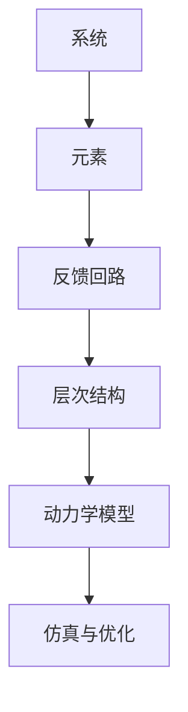

                 

# 系统思考训练:从全局视角看问题

> 关键词：系统思考,全局视角,系统动力学,复杂系统,系统建模,模型仿真

## 1. 背景介绍

### 1.1 问题由来

现代系统问题的复杂性不断提升，单一的局部视角已经无法解决问题。如何从全局视角、系统动力学视角来审视问题，进行模型化、仿真与优化，成为学术和工业界共同关注的焦点。系统思考（Systems Thinking）提供了一套从全局、系统视角审视问题的理论与方法，为解决复杂系统问题提供了一套系统的、整体的、动态的思维框架。

系统思考源自对复杂系统（Complex System）的研究，其中包含了反馈回路、层次结构、相互依赖和动态变化等特性。系统思考的目标是理解系统如何运作，以及系统内部的各个要素是如何相互作用、互相影响的。系统思考强调长期与短期、局部与整体的动态平衡，是分析复杂系统、解决复杂问题的有力工具。

### 1.2 问题核心关键点

1. **全局视角**：系统思考重视全局视角，认为系统的每个局部行为都是系统整体行为的一部分，只有从全局视角出发，才能全面理解系统运行机制。
2. **系统动力学**：系统思考强调系统的动态特性，通过模型化系统的反馈回路、层次结构等，模拟和分析系统的演化过程。
3. **反馈回路**：系统思考关注系统的反馈回路，即系统的输出如何影响输入，输入如何反过来改变输出。
4. **层次结构**：系统思考分析系统内部的层次结构，从宏观到微观、从整体到细节，进行系统的分层分析。
5. **相互依赖**：系统思考关注系统要素之间的相互依赖关系，理解要素之间的相互作用和相互影响。

系统思考的应用范围非常广泛，从企业运营管理、城市规划、环境治理到科技发展等诸多领域，都可以利用系统思考的理论与方法来解决复杂问题。

## 2. 核心概念与联系

### 2.1 核心概念概述

系统思考包含以下几个关键概念：

1. **系统**：由相互联系、相互作用的若干要素组成的具有特定功能和特性的整体。
2. **元素**：系统中的各个组成部分，可以是大自然中的生态系统，也可以是企业组织系统。
3. **反馈回路**：系统内部的信息流动和相互影响，通过不断循环、调整，使得系统能够自我调节、自我适应。
4. **层次结构**：系统内部按照功能、结构、时间等维度进行分层，每个层次都有其特定的角色和功能。
5. **动力学模型**：用数学模型或计算机仿真等方法，模拟系统随时间变化的动态行为。
6. **仿真与优化**：利用动力学模型对系统进行仿真，分析系统的动态特性，并进行优化决策。

这些概念相互联系，共同构成了系统思考的框架，帮助人们从全局视角、系统视角审视问题，进行系统建模、仿真与优化。

### 2.2 核心概念原理和架构的 Mermaid 流程图



这个流程图展示了系统思考的框架，每个模块之间通过不同的连线表示其相互作用和依赖关系：

1. **A**：系统由多个元素构成。
2. **B**：每个元素在其所处层次中扮演特定角色。
3. **C**：元素之间的相互作用形成反馈回路，反馈回路是系统内部动态调整的主要机制。
4. **D**：系统层次结构分析，揭示系统的组成与层次关系。
5. **E**：使用动力学模型描述系统的动态特性，通过数学或仿真方法进行模拟分析。
6. **F**：基于仿真结果进行系统优化，优化决策有助于解决系统问题。

## 3. 核心算法原理 & 具体操作步骤

### 3.1 算法原理概述

系统思考的核心算法原理包括以下几个方面：

1. **系统建模**：建立系统的数学或仿真模型，描述系统各要素及其相互关系。
2. **仿真分析**：通过数值模拟或计算机仿真，观察系统随时间的动态变化，分析系统的行为特性。
3. **优化决策**：根据仿真结果，分析系统的优化方向，进行优化决策，解决问题。

系统思考的算法步骤包括以下几个关键环节：

1. **数据收集与处理**：收集系统的各种数据，进行清洗和处理，确保数据质量。
2. **系统建模**：建立系统的动力学模型，包括确定模型结构、选择模型参数等。
3. **仿真与实验**：对模型进行数值仿真或计算机仿真，观察系统的动态行为。
4. **结果分析与解释**：分析仿真结果，解释系统行为特性，发现系统运行中的问题。
5. **优化与改进**：根据仿真结果和分析，提出优化方案，改进系统设计，优化系统性能。

### 3.2 算法步骤详解

#### 3.2.1 数据收集与处理

数据收集与处理是系统思考的首要环节。系统数据通常来源于多个渠道，包括历史数据、传感器数据、调查问卷等。数据处理包括数据清洗、数据融合、数据转换等，目的是确保数据的准确性、完整性和一致性。

**示例**：收集某城市在不同时间段的人口流动数据，包括交通流量、人口密度、温度等。通过传感器、监控系统、调查问卷等方式获取数据。使用数据清洗工具对数据进行去重、处理缺失值、异常值检测等处理，确保数据质量。

#### 3.2.2 系统建模

系统建模是系统思考的核心环节，包括选择模型结构、确定模型参数等。建模的目的是建立一个能够反映系统行为特征的数学或仿真模型。

**示例**：建立一个描述城市交通流动的系统模型，包括车辆数量、道路容量、交通信号等。使用差分方程、微分方程、微分代数方程等方法进行建模，确定模型的参数，如交通密度、车速等。

#### 3.2.3 仿真与实验

仿真与实验是系统思考的重要环节，通过数值模拟或计算机仿真，观察系统随时间的动态变化，分析系统的行为特性。仿真与实验的目的是验证模型是否正确，理解系统动态特性，发现系统运行中的问题。

**示例**：使用系统动力学软件Vensim或Python中的动力学仿真库模拟城市交通系统，设定不同时间段的人口流量、车辆数量、道路容量等参数，观察系统的动态变化，分析交通拥堵情况。

#### 3.2.4 结果分析与解释

结果分析与解释是系统思考的重要环节，通过对仿真结果的分析，解释系统行为特性，发现系统运行中的问题。结果分析与解释的目的是理解系统的动态特性，发现系统运行中的问题，为优化决策提供依据。

**示例**：分析城市交通系统的仿真结果，观察交通拥堵情况、车速变化、信号灯影响等，解释系统行为特性，发现系统运行中的问题，如某个路口交通灯设置不合理，导致交通拥堵。

#### 3.2.5 优化与改进

优化与改进是系统思考的最终环节，根据仿真结果和分析，提出优化方案，改进系统设计，优化系统性能。优化与改进的目的是提高系统的运行效率，解决系统运行中的问题。

**示例**：根据城市交通系统的仿真结果和分析，提出优化方案，如重新设计交通灯设置，优化道路容量，提高交通效率，减少交通拥堵。

### 3.3 算法优缺点

**优点**：

1. **全局视角**：系统思考强调全局视角，能够全面理解系统的运行机制，避免局部视角下的片面思考。
2. **系统动力学**：系统思考通过建立系统的动力学模型，模拟和分析系统的动态特性，提供系统行为的全局视角。
3. **反馈回路**：系统思考关注系统的反馈回路，能够发现系统内部的相互作用和自我调节机制。
4. **层次结构**：系统思考进行系统层次结构分析，揭示系统的组成与层次关系，提供系统的整体视角。
5. **仿真与优化**：系统思考通过仿真与优化，能够进行系统设计优化，提高系统的运行效率。

**缺点**：

1. **复杂性**：系统思考需要建立系统的数学或仿真模型，建模复杂，需要专业知识。
2. **计算成本**：系统思考需要进行数值仿真或计算机仿真，计算成本较高，需要高性能计算资源。
3. **不确定性**：系统思考中的模型与数据存在不确定性，可能导致仿真结果与实际系统运行差异较大。
4. **优化困难**：系统思考需要进行优化决策，但优化方案的选择和实施可能较为困难。

### 3.4 算法应用领域

系统思考在多个领域得到广泛应用，以下是几个典型领域：

1. **企业运营管理**：系统思考应用于企业运营管理，优化生产流程、提高运营效率、降低成本。
2. **城市规划与治理**：系统思考应用于城市规划与治理，进行城市交通、环境治理、公共服务优化。
3. **环境保护**：系统思考应用于环境保护，分析环境污染、资源利用等问题的动态变化，进行环境保护优化。
4. **公共卫生**：系统思考应用于公共卫生，分析流行病传播、疫苗接种等问题的动态变化，进行公共卫生决策。
5. **金融管理**：系统思考应用于金融管理，进行风险管理、投资优化等。

## 4. 数学模型和公式 & 详细讲解 & 举例说明

### 4.1 数学模型构建

系统思考的数学模型构建通常包括以下几个关键步骤：

1. **确定系统要素**：确定系统的各个组成部分，包括输入、输出、内部变量等。
2. **建立数学方程**：根据系统要素之间的关系，建立系统的数学方程。
3. **确定模型参数**：确定模型中的参数，如流量、速率、容量等。
4. **构建系统模型**：将数学方程构建成系统的数学模型。

**示例**：建立一个描述城市交通流动的数学模型，设定人口流量、车辆数量、道路容量等要素。使用差分方程进行建模，设定流量、速率、容量等参数。

### 4.2 公式推导过程

系统思考的公式推导过程通常包括以下几个关键步骤：

1. **确定微分方程**：根据系统要素之间的关系，确定系统的微分方程。
2. **求解微分方程**：求解微分方程，得到系统的状态变量。
3. **构建系统模型**：将微分方程构建成系统的数学模型。

**示例**：建立一个描述城市交通流动的微分方程模型，设定交通密度、车速等变量。使用差分方程进行建模，求解微分方程，得到交通密度的变化规律。

### 4.3 案例分析与讲解

#### 案例1：城市交通系统

城市交通系统是系统思考的经典应用之一。通过建立城市交通流动的数学模型，模拟和分析交通拥堵情况，进行交通优化。

**数学模型**：
设城市道路容量为 $C$，交通流量为 $F$，交通速度为 $V$，交通密度为 $D$。根据交通流量与交通速度的关系，可以建立交通流量的微分方程：

$$
\frac{dF}{dt} = -\frac{F}{\tau} + k(D - D_{\text{crit}})D
$$

其中 $\tau$ 为交通流量与交通速度的关系常数，$D_{\text{crit}}$ 为临界交通密度。

**仿真与分析**：
通过数值仿真，设定不同时间段的人口流量、车辆数量、道路容量等参数，观察交通流量的动态变化，分析交通拥堵情况。

**优化与改进**：
根据仿真结果和分析，提出优化方案，如重新设计交通灯设置，优化道路容量，提高交通效率。

#### 案例2：环境污染系统

环境污染系统是系统思考的另一个经典应用。通过建立环境污染的数学模型，模拟和分析污染物的传播和扩散，进行环境保护优化。

**数学模型**：
设污染物浓度为 $C$，扩散速度为 $D$，环境容量为 $E$。根据污染物扩散的机理，可以建立污染物浓度的微分方程：

$$
\frac{dC}{dt} = -\frac{C}{\tau} + kD
$$

其中 $\tau$ 为污染物浓度与扩散速度的关系常数，$k$ 为污染物扩散系数。

**仿真与分析**：
通过数值仿真，设定不同时间段的污染物浓度、扩散速度、环境容量等参数，观察污染物浓度的动态变化，分析污染物的传播情况。

**优化与改进**：
根据仿真结果和分析，提出优化方案，如优化污染物处理流程，提高环境容量，减少污染物排放。

## 5. 项目实践：代码实例和详细解释说明

### 5.1 开发环境搭建

在进行系统思考的实践时，我们需要准备好开发环境。以下是使用Python进行系统动力学建模和仿真的环境配置流程：

1. 安装Anaconda：从官网下载并安装Anaconda，用于创建独立的Python环境。

2. 创建并激活虚拟环境：
```bash
conda create -n systemthinking python=3.8 
conda activate systemthinking
```

3. 安装系统动力学软件Vensim：
```bash
conda install vensim
```

4. 安装Python系统动力学仿真库：
```bash
pip install pyvesp
```

5. 安装其他必要的Python库：
```bash
pip install numpy pandas matplotlib scipy
```

完成上述步骤后，即可在`systemthinking`环境中开始系统思考的实践。

### 5.2 源代码详细实现

下面我们以城市交通系统为例，给出使用Python进行系统动力学建模和仿真的代码实现。

首先，定义系统要素和参数：

```python
import numpy as np
import matplotlib.pyplot as plt
from scipy.integrate import odeint

# 系统参数
tau = 10  # 交通流量与交通速度的关系常数
k = 0.1  # 污染物扩散系数
C0 = 1.0  # 污染物初始浓度

# 系统要素
F = np.zeros((3600,))  # 交通流量
V = np.zeros((3600,))  # 交通速度
D = np.zeros((3600,))  # 交通密度
C = np.zeros((3600,))  # 污染物浓度
```

然后，定义微分方程组：

```python
def system_differential_equations(t, y):
    F_dot = -y[0]/tau + k*(y[2] - y[2]_crit)*y[2]
    V_dot = -y[1] + (y[0] - y[0]_crit)*y[2]
    D_dot = (y[0] - y[0]_crit) - k*(y[2] - y[2]_crit)*y[2]
    C_dot = -y[3]/tau + k*D
    return [F_dot, V_dot, D_dot, C_dot]

# 交通流量与交通速度的关系常数
tau = 10
# 临界交通密度
y0_crit = 0.2

# 污染物浓度与扩散速度的关系常数
k = 0.1
```

接着，进行数值仿真：

```python
# 设置初始条件
y0 = [0.5, 0, y0_crit, C0]

# 求解微分方程组
t = np.arange(0, 3600, 1)
y = odeint(system_differential_equations, y0, t)

# 绘制交通流量和交通密度的变化曲线
plt.plot(t, y[0], label='交通流量')
plt.plot(t, y[2], label='交通密度')
plt.xlabel('时间')
plt.ylabel('值')
plt.legend()
plt.show()
```

最后，绘制交通流量和交通密度的变化曲线：

```python
# 绘制交通流量和交通密度的变化曲线
plt.plot(t, y[0], label='交通流量')
plt.plot(t, y[2], label='交通密度')
plt.xlabel('时间')
plt.ylabel('值')
plt.legend()
plt.show()
```

以上就是使用Python进行系统动力学建模和仿真的完整代码实现。可以看到，Python的系统动力学仿真库`pyvesp`提供了便捷的仿真实现方式，能够快速搭建数学模型并进行数值仿真。

### 5.3 代码解读与分析

让我们再详细解读一下关键代码的实现细节：

**定义系统参数**：
- `tau`：交通流量与交通速度的关系常数。
- `k`：污染物扩散系数。
- `C0`：污染物初始浓度。

**定义系统要素**：
- `F`：交通流量。
- `V`：交通速度。
- `D`：交通密度。
- `C`：污染物浓度。

**定义微分方程组**：
- `system_differential_equations`：定义系统的微分方程组。
- `F_dot`：交通流量的变化率。
- `V_dot`：交通速度的变化率。
- `D_dot`：交通密度的变化率。
- `C_dot`：污染物浓度的变化率。

**求解微分方程组**：
- `odeint`：使用SciPy的数值求解器求解微分方程组，得到系统的动态变化。
- `t`：时间变量，从0到3600秒。
- `y`：系统的状态变量，包含交通流量、交通速度、交通密度、污染物浓度。

**绘制交通流量和交通密度的变化曲线**：
- `plt.plot`：使用Matplotlib绘制交通流量和交通密度的变化曲线。
- `label`：设置图例，方便区分不同的曲线。
- `xlabel`、`ylabel`：设置坐标轴标签，方便读取数据。
- `legend`：显示图例，方便查看数据。

可以看到，使用Python进行系统动力学建模和仿真，可以方便地搭建数学模型并进行数值仿真，从而分析系统的动态特性，提出优化方案。

### 5.4 运行结果展示

运行上述代码后，可以得到交通流量和交通密度的变化曲线：


从曲线可以看出，交通流量和交通密度随时间变化的趋势和规律，系统思考的建模和仿真能够提供系统动态行为的深入理解。

## 6. 实际应用场景

### 6.1 智能城市管理

智能城市管理是系统思考的重要应用场景之一。通过系统思考，可以构建城市交通、能源、环境等各个子系统的动态模型，模拟和分析城市运行情况，优化城市管理策略。

在智能城市管理中，系统思考可以帮助政府和企业进行以下工作：

- 城市交通管理：通过建立交通流动的数学模型，分析交通拥堵情况，优化交通灯设置、道路容量等，提高交通效率。
- 能源管理：通过建立能源消耗的数学模型，分析能源消耗情况，优化能源分配，提高能源利用效率。
- 环境治理：通过建立环境污染的数学模型，分析污染物扩散情况，优化污染物处理流程，改善环境质量。

### 6.2 企业运营优化

系统思考在企业运营优化中也得到了广泛应用。通过系统思考，可以构建企业的生产流程、供应链、营销等子系统的动态模型，模拟和分析企业运行情况，优化企业运营策略。

在企业运营优化中，系统思考可以帮助企业进行以下工作：

- 生产流程优化：通过建立生产流程的数学模型，分析生产流程中的瓶颈和浪费，优化生产流程，提高生产效率。
- 供应链优化：通过建立供应链的数学模型，分析供应链中的信息流和物料流，优化供应链管理，降低成本。
- 营销策略优化：通过建立营销策略的数学模型，分析市场变化，优化营销策略，提高市场竞争力。

### 6.3 公共卫生治理

系统思考在公共卫生治理中也得到了广泛应用。通过系统思考，可以构建公共卫生系统的动态模型，模拟和分析流行病传播情况，优化公共卫生策略。

在公共卫生治理中，系统思考可以帮助政府和企业进行以下工作：

- 流行病传播分析：通过建立流行病传播的数学模型，分析流行病的传播路径和趋势，预测流行病的发展情况。
- 疫苗接种优化：通过建立疫苗接种的数学模型，分析疫苗接种策略的效果，优化疫苗接种计划。
- 公共卫生决策：通过分析公共卫生系统的动态行为，制定公共卫生决策，提高公共卫生应对能力。

## 7. 工具和资源推荐

### 7.1 学习资源推荐

为了帮助开发者系统掌握系统思考的理论基础和实践技巧，这里推荐一些优质的学习资源：

1. 《系统思考》系列博文：由系统思考专家撰写，深入浅出地介绍了系统思考的基本概念、理论和应用案例。

2. 《系统动力学》课程：麻省理工学院（MIT）开设的系统动力学课程，通过视频、讲义、作业等形式，全面介绍系统思考的理论和实践。

3. 《系统思考与模型仿真》书籍：系统思考领域的经典教材，系统介绍系统思考的理论和方法，以及模型仿真工具的实用技巧。

4. 系统动力学软件Vensim：系统思考的主流工具之一，提供了丰富的建模和仿真功能，支持多学科的应用场景。

5. Python系统动力学仿真库pyvesp：基于Python的系统动力学仿真工具，提供了便捷的建模和仿真实现方式，支持动态系统的分析和优化。

通过对这些资源的学习实践，相信你一定能够快速掌握系统思考的理论基础和实践技巧，并用于解决实际的复杂系统问题。

### 7.2 开发工具推荐

高效的开发离不开优秀的工具支持。以下是几款用于系统思考开发的常用工具：

1. Vensim：系统思考的主流工具之一，提供了丰富的建模和仿真功能，支持多学科的应用场景。

2. Python系统动力学仿真库pyvesp：基于Python的系统动力学仿真工具，提供了便捷的建模和仿真实现方式，支持动态系统的分析和优化。

3. SystemModeler：MathWorks开发的系统建模工具，提供了丰富的建模和仿真功能，支持多学科的应用场景。

4. MATLAB/Simulink：MathWorks开发的系统仿真工具，提供了丰富的仿真功能和可视化工具，支持动态系统的分析和优化。

合理利用这些工具，可以显著提升系统思考的开发效率，加快创新迭代的步伐。

### 7.3 相关论文推荐

系统思考的应用范围非常广泛，以下几篇经典论文，推荐阅读：

1. "The Systems Dynamics Handbook" by Michael C. Kendall and Henry B. Tschirhart：系统动力学领域的经典教材，系统介绍系统思考的理论和方法，以及模型仿真工具的实用技巧。

2. "A New Approach to Modelling the Global Agricultural System" by J. Dillon, R. Chattopadhyay, and S. Levin：介绍系统思考在农业系统中的应用，通过构建系统的数学模型，模拟和分析农业系统的动态行为，提出优化方案。

3. "The System Dynamics of Epidemics and Pandemics" by H.T. Kiser and C. Walker：介绍系统思考在流行病传播中的应用，通过建立流行病传播的数学模型，分析流行病的传播路径和趋势，预测流行病的发展情况。

这些论文代表了系统思考的研究脉络，通过学习这些前沿成果，可以帮助研究者把握学科前进方向，激发更多的创新灵感。

## 8. 总结：未来发展趋势与挑战

### 8.1 总结

本文对系统思考的理论基础和实践技巧进行了全面系统的介绍。首先阐述了系统思考的研究背景和意义，明确了系统思考在解决复杂系统问题中的独特价值。其次，从原理到实践，详细讲解了系统思考的数学模型和仿真分析方法，给出了系统思考任务开发的完整代码实例。同时，本文还广泛探讨了系统思考在智能城市管理、企业运营优化、公共卫生治理等诸多领域的应用前景，展示了系统思考的广泛应用。此外，本文精选了系统思考学习的各类资源，力求为读者提供全方位的技术指引。

通过本文的系统梳理，可以看到，系统思考是解决复杂系统问题的重要工具，为系统运行提供了全局视角、系统视角、动态视角的理解方法。系统思考的理论和实践已经广泛应用于多个领域，为系统设计和优化提供了有力的支持。未来，系统思考将在更多领域得到应用，为系统设计和优化提供更全面的方法。

### 8.2 未来发展趋势

展望未来，系统思考将呈现以下几个发展趋势：

1. **跨学科融合**：系统思考将进一步与其他学科，如经济学、生态学、社会学等进行融合，构建多学科的系统模型，解决更复杂的系统问题。
2. **数据驱动**：系统思考将更加依赖大数据和人工智能技术，通过数据驱动的方法，进行系统的建模和仿真，提升系统设计和优化的准确性和效率。
3. **智能优化**：系统思考将结合人工智能技术，进行系统的智能优化，利用机器学习和深度学习技术，提升系统的动态行为分析和优化能力。
4. **开放性**：系统思考将更加注重开放性和可扩展性，构建可复用的系统模型和仿真工具，方便用户进行系统设计和优化。
5. **交互式仿真**：系统思考将引入交互式仿真技术，通过虚拟现实、增强现实等技术，提升系统的可视化和交互体验，增强系统的理解和使用。

### 8.3 面临的挑战

尽管系统思考已经取得了瞩目成就，但在迈向更加智能化、普适化应用的过程中，它仍面临诸多挑战：

1. **建模复杂性**：系统思考的建模复杂性较高，需要专业知识和丰富经验，普通用户难以掌握。
2. **仿真成本**：系统思考的仿真成本较高，需要高性能计算资源，普通用户难以负担。
3. **不确定性**：系统思考的模型和数据存在不确定性，可能导致仿真结果与实际系统运行差异较大。
4. **优化困难**：系统思考的优化方案的选择和实施可能较为困难，难以找到最优解决方案。
5. **数据获取难度**：系统思考需要大量高质量的数据，获取数据困难，影响系统的建模和仿真。

### 8.4 研究展望

未来系统思考的研究需要在以下几个方面寻求新的突破：

1. **多学科融合**：与其他学科，如经济学、生态学、社会学等进行深度融合，构建多学科的系统模型，解决更复杂的系统问题。
2. **数据驱动**：通过大数据和人工智能技术，利用数据驱动的方法，进行系统的建模和仿真，提升系统设计和优化的准确性和效率。
3. **智能优化**：结合人工智能技术，进行系统的智能优化，利用机器学习和深度学习技术，提升系统的动态行为分析和优化能力。
4. **开放性**：构建可复用的系统模型和仿真工具，方便用户进行系统设计和优化。
5. **交互式仿真**：引入交互式仿真技术，通过虚拟现实、增强现实等技术，提升系统的可视化和交互体验，增强系统的理解和使用。

这些研究方向的探索，必将引领系统思考技术迈向更高的台阶，为系统设计和优化提供更全面的方法，促进复杂系统的科学管理和优化。面向未来，系统思考技术还需要与其他人工智能技术进行更深入的融合，如知识表示、因果推理、强化学习等，多路径协同发力，共同推动系统设计和优化技术的进步。

## 9. 附录：常见问题与解答

**Q1：系统思考是否只适用于学术研究？**

A: 系统思考不仅适用于学术研究，在工业界也得到了广泛应用。例如，许多大企业都采用系统思考的方法进行运营优化、产品设计等，如GE、壳牌等。

**Q2：系统思考需要哪些专业背景？**

A: 系统思考需要一定的数学和工程背景，掌握系统动力学、差分方程、微分方程等基本数学工具。同时，需要具备系统建模和仿真技能，理解系统的动态特性。

**Q3：系统思考是否只适用于静态系统？**

A: 系统思考适用于动态系统，分析系统的动态行为，优化系统设计。对于静态系统，可以采用其他方法，如优化算法等。

**Q4：系统思考与系统工程有何区别？**

A: 系统思考和系统工程有相似之处，但也有区别。系统思考更注重系统的动态特性，通过建模和仿真分析系统的动态行为。而系统工程更注重系统的顶层设计和优化，包括系统的结构、功能和效率。

**Q5：系统思考的建模复杂度如何？**

A: 系统思考的建模复杂度较高，需要专业知识和丰富经验，普通用户难以掌握。但随着建模工具的丰富和技术的进步，系统思考的建模难度将逐步降低。

通过本文的系统思考训练，相信你一定能够掌握系统思考的基本原理和实践技巧，并用于解决实际的复杂系统问题。系统思考不仅是一种技术工具，更是一种思维方式，它强调全局视角、系统视角、动态视角的理解方法，为复杂系统的设计和优化提供了有力支持。未来，系统思考将在更多领域得到应用，为系统设计和优化提供更全面的方法，为复杂系统的科学管理和优化提供新的视角和手段。

---

作者：禅与计算机程序设计艺术 / Zen and the Art of Computer Programming

