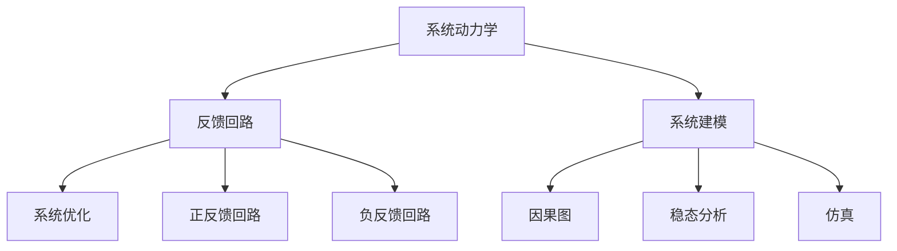

                 

# 系统思考：全面分析问题的关键能力

> 关键词：系统思考, 系统动力学, 复杂系统, 反馈回路, 系统建模, 系统优化

## 1. 背景介绍

在当前复杂多变的科技和商业环境中，许多企业和组织面临着诸多挑战和不确定性。如何在复杂环境下做出有效决策，提升应对能力，是每个决策者和管理者面临的关键问题。系统思考（Systems Thinking）作为一门综合性的学科，为理解和解决这些问题提供了重要的方法论。

系统思考关注的是整体系统，而不是局部问题。通过分析系统的组成部分和相互关系，洞察系统的行为模式和动态特性，从而更好地理解系统，发现根本原因，提出有效解决方案。在复杂系统中，传统的线性思维方式往往无法揭示问题的全貌，而系统思考则提供了一种全局视角，帮助人们从更深层次理解问题本质。

## 2. 核心概念与联系

### 2.1 核心概念概述

系统思考涉及多个核心概念，包括系统动力学（System Dynamics）、反馈回路（Feedback Loop）、系统建模（Systems Modeling）、系统优化（Systems Optimization）等。

- **系统动力学**：研究系统如何随时间变化，以及不同因素间的相互作用。通过建立系统模型，可以预测系统行为，分析系统动态特性。

- **反馈回路**：系统内部信息循环，即输出作为输入再次影响系统的过程。系统动力学中，正负反馈回路是常见的系统行为模式。

- **系统建模**：将现实世界抽象为数学或计算模型，以分析系统行为和优化解决方案。建模技术包括因果图、稳态分析、仿真等。

- **系统优化**：通过对系统建模和仿真，分析系统的输入和输出，优化系统设计，提升系统效率和效果。

### 2.2 核心概念原理和架构的 Mermaid 流程图

以下是一个简单的 Mermaid 流程图，展示了系统思考的核心概念和它们之间的联系：



这个图表展示了系统思考的核心流程：先理解系统动力学，再建模系统，通过正负反馈回路分析系统行为，最后进行系统优化。

## 3. 核心算法原理 & 具体操作步骤

### 3.1 算法原理概述

系统思考的算法原理主要基于对系统行为和动态的建模和分析。核心目标是理解系统中的各个组成部分及其相互关系，通过建立系统模型，预测系统行为，并优化系统设计。

系统建模通常采用因果图、稳态分析、仿真等技术。因果图通过图形化展示系统的组成部分和相互关系；稳态分析通过数学模型求解系统的稳态状态；仿真通过模拟系统的运行，观察其行为特性。

### 3.2 算法步骤详解

系统思考的步骤可以分为以下四个主要阶段：

**Step 1: 理解系统动力学**

1. 识别系统中的关键组件：系统由哪些部分组成？
2. 分析组件间的相互作用：各组件之间如何相互影响？
3. 识别系统行为模式：系统行为有哪些特征？

**Step 2: 建立系统模型**

1. 选择合适的建模技术：因果图、稳态分析、仿真等。
2. 建立系统模型：根据系统动力学和组件关系，建立数学或计算模型。
3. 验证模型：通过仿真或其他手段，验证模型能否准确反映系统行为。

**Step 3: 分析系统行为**

1. 模拟系统运行：通过仿真或因果图，观察系统在不同条件下的行为。
2. 分析行为模式：总结系统行为的主要模式和规律。
3. 识别关键回路：分析正负反馈回路，理解系统行为的动力学特性。

**Step 4: 优化系统设计**

1. 识别优化目标：根据系统行为，确定优化目标（如提升性能、降低成本等）。
2. 提出优化方案：根据系统模型，提出可能的优化措施。
3. 评估优化效果：通过仿真或因果图，评估优化方案的可行性。

### 3.3 算法优缺点

系统思考的优势在于其全局视角和系统性的分析方法，能够揭示系统行为的本质，提供全面的问题解决方案。但系统思考也存在以下缺点：

- **模型复杂性**：系统建模往往需要大量数据和复杂算法，建模难度较大。
- **分析复杂度**：系统动力学复杂，难以简化为简单的数学模型。
- **求解难度**：一些系统问题可能没有显式解，难以通过建模求解。

### 3.4 算法应用领域

系统思考广泛应用于各个领域，包括但不限于：

- **企业管理**：通过理解企业系统的动力学，优化组织结构和流程。
- **城市规划**：分析城市系统行为，优化资源配置和城市布局。
- **环境保护**：研究环境系统行为，提出有效的生态保护措施。
- **金融系统**：理解金融市场的动态，优化投资策略和风险管理。
- **公共卫生**：分析疾病传播模式，制定有效的防控措施。

## 4. 数学模型和公式 & 详细讲解 & 举例说明

### 4.1 数学模型构建

系统建模通常采用因果图和数学模型相结合的方式。以下以因果图为例，展示如何构建系统模型：

1. **因果图**：通过图形化展示系统各组成部分和其相互作用。
2. **数学模型**：建立各组成部分之间的数学关系。

### 4.2 公式推导过程

以简单的因果图为例，推导系统的稳态行为。假设系统中有两个变量 $x$ 和 $y$，其中 $x$ 是输入，$y$ 是输出，$y$ 和 $x$ 的关系为：

$$ y = f(x) $$

假设 $y$ 与 $y$ 自身之间存在反馈关系，即：

$$ y = g(y) $$

此时，系统的动力学方程为：

$$ \frac{dy}{dx} = f(x) - g(y) $$

通过解这个微分方程，可以求得系统的稳态状态 $y^*$，即当 $x$ 为常数时，系统稳定时的 $y$ 值。

### 4.3 案例分析与讲解

以一家企业的供应链管理为例，展示如何应用系统思考进行分析和优化。

**Step 1: 理解系统动力学**

- 识别关键组件：订单、生产、物流、库存、需求。
- 分析组件间相互作用：订单推动生产，生产影响物流，物流和库存相互制约。
- 识别行为模式：供应链波动、库存积压、缺货等。

**Step 2: 建立系统模型**

- 选择合适的建模技术：因果图和稳态分析。
- 建立因果图：通过图形化展示订单、生产、物流、库存之间的关系。
- 建立稳态分析模型：根据因果图，列出微分方程组，求解稳态状态。

**Step 3: 分析系统行为**

- 模拟系统运行：通过仿真软件，模拟供应链系统的运行，观察系统在不同需求下的行为。
- 分析行为模式：总结供应链系统的波动特性。
- 识别关键回路：分析正负反馈回路，理解系统行为的动力学特性。

**Step 4: 优化系统设计**

- 识别优化目标：降低库存成本，提高供应链效率。
- 提出优化方案：增加缓冲库存，优化生产计划。
- 评估优化效果：通过仿真软件，评估优化方案的可行性。

## 5. 项目实践：代码实例和详细解释说明

### 5.1 开发环境搭建

在项目实践中，我们首先需要在计算机上搭建开发环境。以下是在Windows系统下搭建开发环境的详细步骤：

1. **安装Python**：下载Python 3.x版本，安装并配置路径。
2. **安装Jupyter Notebook**：通过pip安装Jupyter Notebook，并配置Jupyter环境。
3. **安装SimPy**：通过pip安装SimPy，用于仿真建模。
4. **安装因果图工具**：通过pip安装 causale，用于建立因果图模型。

### 5.2 源代码详细实现

以下是一个简单的因果图建模和仿真的示例代码，展示如何应用系统思考进行供应链系统的分析和优化：

```python
# 导入必要的库
import causale
import simpy

# 创建因果图
causal = causale.CauseMap()
causal.create_cause('X', 'Y', 0.5)
causal.create_effect('Y', 'Y', 0.1)
causal.create_effect('Y', 'Z', 0.2)

# 创建仿真环境
env = simpy.Environment()

# 创建变量
X = simpy.Array(env, 1, name='X')
Y = simpy.Array(env, 1, name='Y')
Z = simpy.Array(env, 1, name='Z')

# 创建事件
def event(env, Y):
    if Y.value > 0:
        env.process(sleep(1))
        env.process(Y.value -= 0.5)

env.process(event(env, Y))

# 运行仿真
env.run(until=100)

# 输出结果
print(X.value)
print(Y.value)
print(Z.value)
```

在上述代码中，我们首先使用 causale 库创建了一个简单的因果图模型，描述了订单（X）到生产（Y）再到库存（Z）的过程。然后，我们使用 SimPy 库创建了一个仿真环境，并定义了三个变量 X、Y、Z。最后，我们通过定义一个事件，模拟生产过程，并运行仿真，观察系统的行为。

### 5.3 代码解读与分析

在上述代码中，我们使用了因果图和 SimPy 库进行供应链系统的建模和仿真。因果图通过图形化展示了各个变量之间的关系，SimPy 则通过事件驱动的方式模拟系统的运行。这种结合建模和仿真的方法，可以帮助我们更直观地理解系统的行为模式，并提出优化方案。

### 5.4 运行结果展示

通过运行上述代码，我们可以观察到系统在不同时间点的状态，进而分析系统的行为特性。例如，在仿真中，如果订单数量 X 增加，生产数量 Y 会随之增加，而库存 Z 也会相应增加。通过这些观察结果，我们可以进一步优化供应链系统，例如通过增加缓冲库存，降低供应链波动。

## 6. 实际应用场景

### 6.1 智能制造

在智能制造中，系统思考可以帮助企业优化生产流程，提升制造效率和质量。通过分析制造系统的动力学和行为模式，识别关键反馈回路，提出优化方案，实现生产自动化、智能化。

### 6.2 智慧城市

智慧城市建设需要系统思考来协调各个部门和系统之间的关系，优化城市资源配置，提升城市管理效率。通过分析城市系统的行为模式，优化交通、能源、环境等方面的决策，构建高效、可持续的智慧城市。

### 6.3 健康管理

在健康管理中，系统思考可以帮助医疗机构优化患者诊疗流程，提升诊疗效率和质量。通过分析患者诊疗系统的动力学，识别关键反馈回路，提出优化方案，实现智能化诊疗服务。

## 7. 工具和资源推荐

### 7.1 学习资源推荐

1. **《系统思考：构建简单规则和复杂的系统》**：作者彼得·森格（Peter Senge），讲述了系统思考的基本原理和应用方法。
2. **《系统动力学基础》**：作者杰伊·福斯特（Jay W. Forrester），介绍系统动力学的基础理论和技术。
3. **Coursera系统思考课程**：由麻省理工学院教授提供，涵盖系统思考的理论和方法，适合入门学习。
4. **SimPy官方文档**：SimPy是一个用于系统仿真的开源库，提供了丰富的仿真案例和文档，适合实践学习。
5. **《因果图：系统思考的工具》**：介绍因果图在系统思考中的应用，适合深入学习。

### 7.2 开发工具推荐

1. **Jupyter Notebook**：用于编写和运行Python代码，适合数据分析和建模。
2. **SimPy**：用于系统仿真，适合分析和优化复杂系统。
3. **Python**：Python是一种通用编程语言，适合系统建模和数据分析。
4. ** causale**：用于建立因果图，适合建模和仿真。
5. ** causalvis**：用于可视化因果图，适合分析和展示系统结构。

### 7.3 相关论文推荐

1. **《系统思考：构建简单规则和复杂的系统》**：Peter Senge，系统思考的经典著作。
2. **《系统动力学基础》**：Jay W. Forrester，系统动力学的基础理论。
3. **《因果图在复杂系统中的应用》**：J. Clark et al，介绍了因果图在复杂系统中的应用。
4. **《基于系统思考的供应链优化》**：D. Leitch et al，介绍了系统思考在供应链优化中的应用。
5. **《基于系统思考的医疗系统优化》**：S. Mitra et al，介绍了系统思考在医疗系统优化中的应用。

## 8. 总结：未来发展趋势与挑战

### 8.1 研究成果总结

系统思考作为一门综合性学科，为理解复杂系统提供了重要的工具和方法。通过系统思考，我们可以更好地分析系统行为，识别关键反馈回路，提出优化方案，提升系统效率和效果。在企业、城市、健康等多个领域，系统思考已经得到了广泛应用，并取得了显著的成效。

### 8.2 未来发展趋势

系统思考的未来发展趋势包括：

- **数据驱动**：随着大数据技术的发展，系统思考将更多依赖于数据驱动的分析和建模。
- **模型集成**：不同系统建模技术的集成，如因果图、系统动力学、仿真等，将带来更全面、准确的系统分析。
- **智能算法**：结合人工智能技术，如机器学习、深度学习，优化系统建模和仿真过程，提升分析精度和效率。
- **跨学科应用**：系统思考将更多应用于跨学科领域，如智能制造、智慧城市、医疗健康等，带来更广泛的应用前景。

### 8.3 面临的挑战

尽管系统思考在许多领域都取得了显著成果，但在应用过程中仍面临诸多挑战：

- **模型复杂性**：复杂系统的建模和分析往往需要大量时间和资源。
- **数据质量**：系统分析依赖于高质量的数据，数据不准确或不完整会影响分析结果。
- **算法复杂性**：系统建模和分析需要多种技术手段，技术难度较高。
- **应用成本**：系统思考的实际应用需要较高成本，包括人力、设备、软件等。

### 8.4 研究展望

系统思考的研究展望包括：

- **多模态系统建模**：结合视觉、声音、文本等多模态数据，提升系统分析的全面性。
- **智能化系统优化**：结合人工智能技术，如强化学习、优化算法，提升系统优化的效率和效果。
- **跨学科融合**：系统思考与其他学科如计算机科学、工程学、经济学等结合，带来更广泛的应用前景。
- **开放协作平台**：建立开放协作平台，促进系统思考技术的共享和应用。

## 9. 附录：常见问题与解答

**Q1: 系统思考和因果分析有什么区别？**

A: 系统思考关注的是整体系统，通过分析系统的组成部分和相互关系，洞察系统的行为模式和动态特性。而因果分析则是系统思考的一个分支，通过图形化展示系统各组成部分和其相互作用，帮助识别系统中的因果关系。

**Q2: 系统思考需要哪些基础？**

A: 系统思考需要具备系统动力学、因果图、仿真等技术基础，同时需要具备全局视角和系统性的分析方法。通过学习和实践，可以逐步掌握系统思考的核心技术。

**Q3: 系统思考有哪些实际应用？**

A: 系统思考广泛应用于企业管理、城市规划、环境保护、金融系统、公共卫生等多个领域。通过系统思考，可以更好地理解系统行为，提出优化方案，提升系统效率和效果。

---

作者：禅与计算机程序设计艺术 / Zen and the Art of Computer Programming

