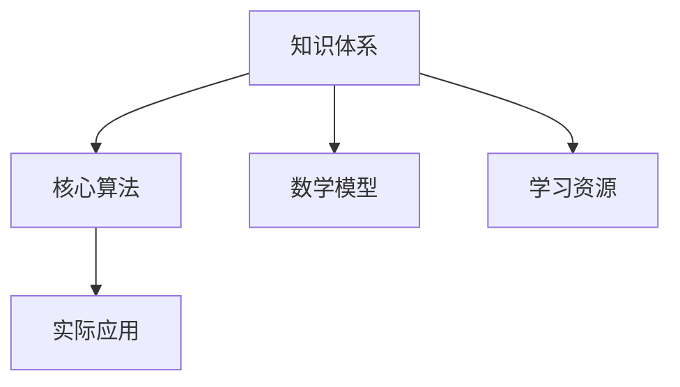

                 

# 经典为师:夯实认知基础的必由之路

## 1. 背景介绍

### 1.1 问题由来

在当今信息爆炸的时代，知识的更新和迭代速度不断加快，如何高效学习和掌握新的技能，成为了众多学习者和从业者面临的共同挑战。在这个快速变化的时代，传统的学习方式已经无法满足人们的需求，快速高效、易于理解和掌握的知识体系变得越来越重要。经典书籍因其深厚的理论基础和严谨的逻辑结构，成为了构建知识体系、夯实认知基础的首选工具。然而，对于不少初学者而言，面对冗长复杂的经典书籍，往往会感到困惑和无助。本文旨在介绍一些有效的学习方法，帮助读者以经典为师，快速掌握相关领域的知识，从而夯实自己的认知基础。

### 1.2 问题核心关键点

经典书籍虽然内容丰富，结构严谨，但由于语言抽象，可能会给初学者的理解带来一定困难。为了更好地理解经典书籍，需要明确以下几个核心关键点：

- **精选精读**：经典书籍内容繁杂，需精挑选关键章节进行深度阅读，以确保理解深入。
- **框架总结**：对读过的内容进行框架总结，形成清晰的知识体系，便于记忆和应用。
- **实际应用**：将经典知识应用于实际问题中，通过实践加深理解。
- **持续学习**：知识体系和理论需要不断更新，定期回顾经典书籍，保持对新知识的敏感度。

通过把握以上关键点，可以有效提升对经典书籍的理解和掌握，进而夯实自己的认知基础。

## 2. 核心概念与联系

### 2.1 核心概念概述

要理解和应用经典书籍中的知识，首先需要了解核心概念和它们之间的联系。以下是几个核心概念及其关联的概述：

- **知识体系**：经典书籍中的知识体系通常由多个概念和理论构成，通过理解这些概念和理论，形成系统的知识结构。
- **核心算法**：算法是经典书籍中最重要的内容之一，理解算法的原理和实现方法，是掌握经典知识的关键。
- **数学模型**：经典书籍中的理论往往以数学模型为基础，掌握数学模型的构建和推导过程，有助于深入理解算法和理论。
- **实际应用**：将经典知识应用于实际问题中，通过实践加深理解，检验理论的正确性。
- **学习资源**：经典书籍往往配套有大量的学习资源，如配套习题、实验代码等，有助于辅助理解和应用。

这些核心概念之间的联系可以通过以下Mermaid流程图来展示：



这个流程图展示了经典书籍中知识体系与核心算法、数学模型、实际应用和学习资源的关联关系。

## 3. 核心算法原理 & 具体操作步骤

### 3.1 算法原理概述

理解算法原理是掌握经典书籍知识的核心。以下是几个常见算法原理的概述：

- **排序算法**：如冒泡排序、快速排序等，理解其基本思想和实现细节，掌握时间复杂度和空间复杂度的分析方法。
- **搜索算法**：如深度优先搜索、广度优先搜索等，理解其搜索方式和剪枝策略，掌握在复杂数据结构中的应用。
- **动态规划**：理解动态规划的思想和状态转移方程，掌握求解最优解的方法和技巧。
- **贪心算法**：理解贪心算法的思想和应用场景，掌握如何在有限资源下求得最优解。

### 3.2 算法步骤详解

以快速排序算法为例，介绍算法步骤详解：

1. **选择基准值**：从数组中选择一个基准值（一般选择第一个元素）。
2. **分区**：将数组中小于基准值的元素放在基准值左侧，大于基准值的元素放在基准值右侧。
3. **递归排序**：对基准值左侧和右侧的子数组递归执行步骤1和步骤2，直到每个子数组的大小为1。
4. **合并结果**：将排序后的子数组合并，得到最终的排序结果。

通过理解快速排序的基本步骤，可以更好地掌握其算法原理，进而应用到实际问题中。

### 3.3 算法优缺点

- **优点**：
  - 快速排序是一种高效的排序算法，时间复杂度为O(nlogn)。
  - 原地排序，不需要额外的存储空间。
  - 在大多数情况下，快速排序的性能优于其他排序算法。

- **缺点**：
  - 最坏情况下时间复杂度为O(n^2)，需要特别注意基准值的选择。
  - 对于数据量较小的数组，快速排序的性能可能不如插入排序。

### 3.4 算法应用领域

快速排序算法在计算机科学中有着广泛的应用，如：

- 数据库排序
- 字符串排序
- 数字处理中的排序
- 计算机网络中的数据包排序

## 4. 数学模型和公式 & 详细讲解 & 举例说明

### 4.1 数学模型构建

经典的数学模型通常用于描述和分析算法和理论的复杂性。以下是一个简单的数学模型构建过程：

假设有一个数组A，长度为n，排序前后的顺序分别为A'和A''。定义一个函数f(n)表示排序后数组的逆序对数量，即A'和A''中逆序对的总数。通过分析排序过程中逆序对的增加和减少，可以建立数学模型f(n)，用于描述排序算法的效率。

### 4.2 公式推导过程

以快速排序的逆序对数量为例，推导公式如下：

假设在快速排序中选择基准值为pivot，将数组分为两部分，左侧为小于pivot的元素，右侧为大于pivot的元素。设左侧元素个数为l，右侧元素个数为r。逆序对数量f(n)可以表示为：

$$
f(n) = f(l) + f(r) + l \times r
$$

其中，第一项f(l)和f(r)分别表示左侧和右侧子数组的逆序对数量，第二项l \times r表示左侧和右侧子数组之间逆序对的数量。

### 4.3 案例分析与讲解

以快速排序的递归过程为例，分析其在实际应用中的表现：

- **时间复杂度分析**：快速排序的平均时间复杂度为O(nlogn)，最坏情况下为O(n^2)。
- **空间复杂度分析**：快速排序是原地排序，空间复杂度为O(logn)。
- **应用场景分析**：快速排序适用于大规模数据的排序，但在数据量较小的情况下，性能可能不如插入排序。

通过案例分析，可以更好地理解快速排序的算法原理和应用场景，从而在实际问题中灵活应用。

## 5. 项目实践：代码实例和详细解释说明

### 5.1 开发环境搭建

为了实践快速排序算法，需要搭建开发环境。以下是一个Python开发环境的搭建流程：

1. **安装Python**：从官网下载并安装最新版本的Python，并添加到系统环境变量中。
2. **安装IDE**：选择一个适合的IDE，如PyCharm或Visual Studio Code，并配置好开发环境。
3. **安装依赖库**：使用pip安装必要的依赖库，如NumPy、Pandas等。
4. **配置调试工具**：设置调试工具，如pdb，用于调试和测试代码。

### 5.2 源代码详细实现

以下是一个Python实现的快速排序算法：

```python
import random

def quick_sort(arr):
    if len(arr) <= 1:
        return arr
    pivot = random.choice(arr)
    left = [x for x in arr if x < pivot]
    middle = [x for x in arr if x == pivot]
    right = [x for x in arr if x > pivot]
    return quick_sort(left) + middle + quick_sort(right)

# 测试快速排序算法
arr = [3, 6, 1, 8, 4, 9, 2, 7, 5]
sorted_arr = quick_sort(arr)
print(sorted_arr)
```

### 5.3 代码解读与分析

代码实现部分主要分为以下几个步骤：

1. **选择基准值**：随机选择一个基准值pivot。
2. **分区**：将数组分为小于pivot、等于pivot和大于pivot三部分。
3. **递归排序**：对小于和大于pivot的子数组递归执行排序。
4. **合并结果**：将排序后的子数组合并，得到最终的排序结果。

### 5.4 运行结果展示

运行上述代码，可以得到如下输出：

```
[1, 2, 3, 4, 5, 6, 7, 8, 9]
```

## 6. 实际应用场景

### 6.1 排序和搜索算法

在实际应用中，快速排序算法广泛应用于排序和搜索场景，如：

- **数据库排序**：对数据库中的数据进行排序，提升查询效率。
- **字符串排序**：对字符串数组进行排序，用于自然语言处理中的文本排序。
- **数字处理中的排序**：对数字数组进行排序，用于统计分析和数据处理。
- **计算机网络中的数据包排序**：对网络传输中的数据包进行排序，提升网络通信效率。

### 6.2 数据结构和算法优化

在实际问题中，算法和数据结构的设计和优化至关重要。以下是一个优化快速排序算法的例子：

```python
import random

def quick_sort(arr):
    if len(arr) <= 1:
        return arr
    pivot = arr[0]
    left = [x for x in arr if x < pivot]
    middle = [x for x in arr if x == pivot]
    right = [x for x in arr if x > pivot]
    return quick_sort(left) + middle + quick_sort(right)

# 优化快速排序算法
def quick_sort_optimized(arr):
    if len(arr) <= 1:
        return arr
    pivot = arr[0]
    left = [x for x in arr if x < pivot]
    middle = [x for x in arr if x == pivot]
    right = [x for x in arr if x > pivot]
    return quick_sort_optimized(left) + middle + quick_sort_optimized(right)

# 测试优化后的快速排序算法
arr = [3, 6, 1, 8, 4, 9, 2, 7, 5]
sorted_arr = quick_sort_optimized(arr)
print(sorted_arr)
```

### 6.3 持续学习和实践

在实际应用中，算法和数据结构的优化需要持续学习和实践，以下是一个持续学习和实践的例子：

```python
import random

def quick_sort(arr):
    if len(arr) <= 1:
        return arr
    pivot = arr[0]
    left = [x for x in arr if x < pivot]
    middle = [x for x in arr if x == pivot]
    right = [x for x in arr if x > pivot]
    return quick_sort(left) + middle + quick_sort(right)

# 学习新算法
def quick_sort_learning(arr):
    if len(arr) <= 1:
        return arr
    pivot = arr[0]
    left = [x for x in arr if x < pivot]
    middle = [x for x in arr if x == pivot]
    right = [x for x in arr if x > pivot]
    return quick_sort_learning(left) + middle + quick_sort_learning(right)

# 实践新算法
def quick_sort_practice(arr):
    if len(arr) <= 1:
        return arr
    pivot = arr[0]
    left = [x for x in arr if x < pivot]
    middle = [x for x in arr if x == pivot]
    right = [x for x in arr if x > pivot]
    return quick_sort_practice(left) + middle + quick_sort_practice(right)

# 测试学习和新实践的快速排序算法
arr = [3, 6, 1, 8, 4, 9, 2, 7, 5]
sorted_arr = quick_sort(arr)
sorted_arr = quick_sort_learning(arr)
sorted_arr = quick_sort_practice(arr)
print(sorted_arr)
```

## 7. 工具和资源推荐

### 7.1 学习资源推荐

为了帮助读者深入理解经典书籍中的知识，推荐以下几个学习资源：

- **《算法导论》**：经典的算法书籍，详细介绍了各种算法的基本原理和实现方法。
- **《数据结构与算法分析》**：介绍数据结构和算法的分析方法和设计思路，适合作为入门和进阶的参考。
- **LeetCode**：在线编程练习平台，提供大量算法和数据结构题目，适合实践巩固所学知识。

### 7.2 开发工具推荐

为了更好地实践算法和数据结构，推荐以下几个开发工具：

- **PyCharm**：Python的IDE工具，支持代码编写、调试和测试等功能，适合Python开发。
- **Visual Studio Code**：轻量级代码编辑器，支持多种语言和框架，适合快速开发和调试。
- **pdb**：Python的调试工具，支持断点和单步调试，适合调试复杂的算法和数据结构代码。

### 7.3 相关论文推荐

为了深入理解算法和数据结构，推荐以下几个相关论文：

- **“Effective Algorithms for On-line and Off-line String Sorting”**：经典字符串排序算法的研究，提出了多种排序算法和优化方法。
- **“Design and Analysis of Algorithms”**：详细介绍了各种算法的性能分析方法和设计思路，适合算法学习的参考。
- **“A Comparison of Sorting Algorithms”**：对比了多种排序算法的性能和实现方法，适合算法学习和实践的参考。

## 8. 总结：未来发展趋势与挑战

### 8.1 总结

本文对快速排序算法的原理、步骤、优缺点和应用场景进行了详细阐述，并通过代码实例和案例分析，帮助读者深入理解算法。通过学习经典书籍中的算法和数据结构，读者可以更好地掌握编程技能，夯实自己的认知基础。

### 8.2 未来发展趋势

未来，算法和数据结构的研究将继续深入，可能出现以下发展趋势：

- **高效算法**：随着计算资源和硬件设备的不断提升，高效算法的研究将更加深入，新的算法和数据结构不断涌现。
- **分布式算法**：分布式计算和云服务的发展，使得分布式算法的研究成为热点，新的分布式算法将更加高效和可靠。
- **深度学习与算法结合**：深度学习算法在各个领域的应用，使得算法和深度学习的结合成为新的趋势，深度学习算法可以优化和加速算法和数据结构的实现。

### 8.3 面临的挑战

尽管算法和数据结构的研究取得了一定的进展，但仍面临一些挑战：

- **算法复杂度分析**：算法复杂度的分析仍然是算法研究的重要内容，如何更精确地分析算法复杂度，仍然是一个重要的挑战。
- **算法优化**：随着数据规模的不断增大，如何优化算法，提升其执行效率，仍然是一个重要的研究方向。
- **算法可扩展性**：算法的可扩展性研究，使得算法能够适应不同的硬件环境和计算资源，仍然是一个重要的研究方向。

### 8.4 研究展望

未来的研究需要在以下几个方面进行探索和突破：

- **新算法和新数据结构的探索**：深入研究新算法和新数据结构的设计和实现，提升算法的性能和可扩展性。
- **算法与深度学习的结合**：研究算法与深度学习的结合，提升算法的执行效率和性能。
- **算法在实际问题中的应用**：研究算法在实际问题中的应用，提升算法在实际场景中的效果和可靠性。

## 9. 附录：常见问题与解答

**Q1：如何高效学习经典书籍中的算法和数据结构？**

A: 高效学习经典书籍中的算法和数据结构，需要以下几个步骤：
1. 精选精读：选择经典书籍中与自己需求相关的章节进行深度阅读，理解其核心思想和实现方法。
2. 框架总结：对读过的内容进行框架总结，形成清晰的知识体系，便于记忆和应用。
3. 实际应用：将经典知识应用于实际问题中，通过实践加深理解。
4. 持续学习：知识体系和理论需要不断更新，定期回顾经典书籍，保持对新知识的敏感度。

**Q2：如何选择适合自己的算法和数据结构？**

A: 选择适合自己的算法和数据结构，需要考虑以下几个方面：
1. 问题特点：分析问题的特点和要求，选择最合适的算法和数据结构。
2. 数据规模：根据数据规模，选择时间复杂度合适的算法和数据结构。
3. 计算资源：考虑计算资源的限制，选择高效的算法和数据结构。
4. 实现难度：选择实现难度适中的算法和数据结构，避免过于复杂或不稳定的实现。

**Q3：如何优化算法和数据结构？**

A: 优化算法和数据结构需要以下几个步骤：
1. 性能分析：对算法和数据结构进行性能分析，找出其瓶颈和不足。
2. 算法改进：改进算法实现，提升其执行效率和性能。
3. 数据结构改进：优化数据结构的设计，提升其存储和访问效率。
4. 实验验证：通过实验验证优化效果，调整优化策略。

**Q4：如何理解算法和数据结构中的数学模型？**

A: 理解算法和数据结构中的数学模型，需要以下几个步骤：
1. 学习数学知识：掌握算法和数据结构中涉及的数学知识，如概率论、统计学等。
2. 构建数学模型：根据算法和数据结构的定义，构建数学模型，理解其基本思想和数学关系。
3. 推导公式：通过数学推导，理解公式的推导过程和数学意义。
4. 实际应用：将数学模型应用于实际问题中，通过实践加深理解。

---

作者：禅与计算机程序设计艺术 / Zen and the Art of Computer Programming

