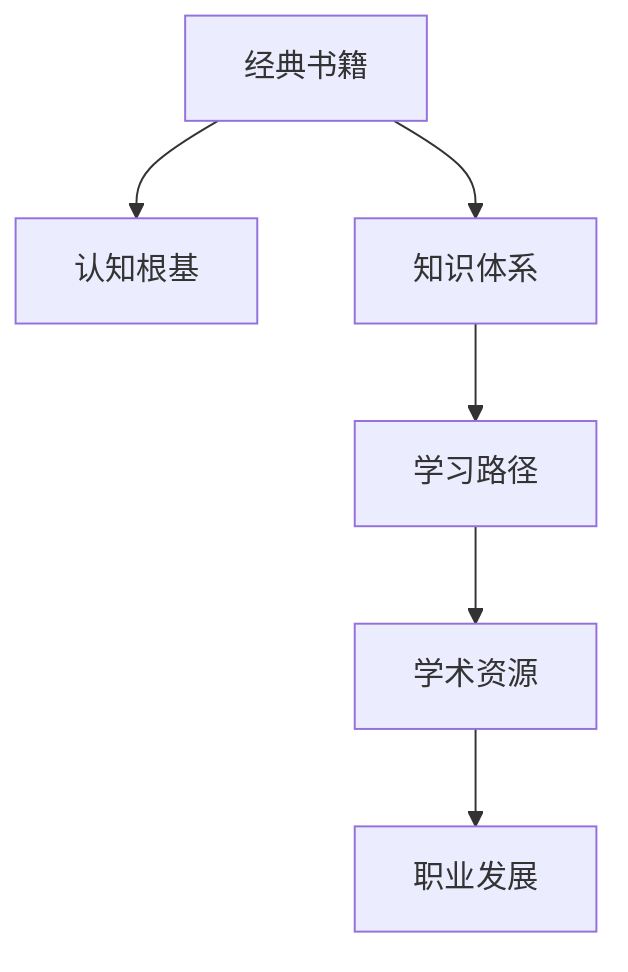

                 

# 经典书籍:夯实认知根基的宝藏

> 关键词：经典书籍、认知根基、知识体系、学习路径、学术资源、职业发展

## 1. 背景介绍

### 1.1 问题由来
在当今信息爆炸的时代，知识和技能的学习显得尤为重要。为了帮助读者系统掌握IT领域的基础知识，奠定坚实的认知根基，本文将介绍一系列经典书籍，并提供详细的阅读和学习路径。这些书籍涵盖从计算机科学基础到高级算法，从编程实践到软件开发，从理论研究到实际应用等多个层面，为读者提供了完整的知识体系。

### 1.2 问题核心关键点
本文的核心关键点在于：
1. **经典书籍的选择**：介绍几本在IT领域具有重要影响力的经典书籍。
2. **知识体系的构建**：分析这些书籍所覆盖的知识内容和层次，形成系统的学习路径。
3. **学术资源的推荐**：提供相关的学术论文、在线课程、技术博客等学术资源，帮助读者深入理解并掌握所学知识。
4. **职业发展的指导**：通过经典书籍的学习，为读者提供职业发展路径和建议。

## 2. 核心概念与联系

### 2.1 核心概念概述

- **经典书籍**：指那些经过时间和实践验证，在特定领域内具有广泛影响力和权威性的书籍。这些书籍往往凝聚了作者的深厚学识和丰富经验，是学习基础知识的重要参考。
- **认知根基**：指扎实的知识储备和系统的理论基础，是进一步学习、研究和应用的前提。
- **知识体系**：指由一系列相关且层次分明的主题构成的一个系统化的知识框架，有助于形成完整且连贯的知识结构。
- **学习路径**：指从基础到高级、从理论到实践的学习步骤和方向，为读者提供明确的阅读和学习顺序。
- **学术资源**：指包括学术论文、在线课程、技术博客、开源项目等，是深入学习某领域知识的有效辅助手段。
- **职业发展**：指通过学习和掌握相关知识，实现个人职业目标和成长的过程。

### 2.2 核心概念原理和架构的 Mermaid 流程图



这个流程图展示了经典书籍在构建认知根基、知识体系、学习路径、学术资源和职业发展之间的联系和路径。

## 3. 核心算法原理 & 具体操作步骤

### 3.1 算法原理概述

基于经典书籍的学习过程，本质上是系统化地构建知识体系和认知根基的过程。这一过程可以分为以下几个步骤：

1. **基础入门**：通过阅读经典书籍的基础部分，了解核心概念和基本原理。
2. **进阶提升**：通过深入阅读书籍的高级内容，掌握进阶技巧和实际应用。
3. **实践操作**：通过完成配套的练习和项目，巩固理论知识，提升实际应用能力。
4. **扩展应用**：通过阅读相关论文和学术资源，拓展知识面，深入理解理论和应用。

### 3.2 算法步骤详解

**Step 1: 选择经典书籍**
根据个人兴趣和职业规划，选择几本经典书籍。一般建议从基础书籍入手，逐步深入。

**Step 2: 制定学习计划**
根据所选书籍的章节结构，制定详细的学习计划，划分阶段目标和时间节点。

**Step 3: 实施学习路径**
按照学习计划，逐步深入阅读书籍内容，并完成配套练习和项目。

**Step 4: 拓展学术资源**
通过搜索和阅读相关论文、在线课程、技术博客等学术资源，进一步加深理解和实践。

**Step 5: 实践项目和应用**
选择实际问题，完成相关项目，并在项目中应用所学知识。

**Step 6: 持续学习和改进**
不断跟踪最新研究和应用进展，及时更新知识体系，进行自我改进。

### 3.3 算法优缺点

基于经典书籍的学习方法具有以下优点：
1. **系统性**：经典书籍通常覆盖全面，形成系统的知识体系，便于系统学习和理解。
2. **权威性**：由领域专家编写的书籍，内容经过严格验证，具有较高的权威性和可信度。
3. **实践性**：许多经典书籍包含丰富的案例和项目，帮助读者通过实践掌握实际技能。

同时，也存在以下缺点：
1. **更新慢**：经典书籍往往更新较慢，无法及时反映最新的研究进展和技术动态。
2. **量大**：经典书籍数量繁多，选择困难，且阅读量大，耗时较长。
3. **理解难度**：部分经典书籍内容较为深奥，需要较高的背景知识和阅读理解能力。

### 3.4 算法应用领域

经典书籍的学习方法广泛应用于计算机科学和IT领域的多个方向，包括但不限于：
- 软件开发与架构设计
- 数据库管理与优化
- 网络安全与攻防技术
- 人工智能与机器学习
- 系统设计与运维管理
- 软件工程与项目管理

## 4. 数学模型和公式 & 详细讲解 & 举例说明

### 4.1 数学模型构建

经典书籍中，数学模型和公式往往是理论基础的重要组成部分。以《算法导论》为例，其数学模型和公式构成了算法的核心，帮助读者理解算法的正确性和效率。

### 4.2 公式推导过程

以线性回归模型为例，公式推导过程如下：

设 $y$ 为输出，$x_1, x_2, ..., x_n$ 为输入特征，$w_0, w_1, ..., w_n$ 为模型参数，则线性回归模型可以表示为：

$$y = w_0 + w_1x_1 + w_2x_2 + ... + w_nx_n$$

通过最小二乘法，求解最优参数 $w$：

$$w = \arg\min_{w} \frac{1}{2m} \sum_{i=1}^{m}(y_i - (w_0 + w_1x_{i1} + ... + w_nx_{in}))^2$$

其中 $m$ 为样本数量。

### 4.3 案例分析与讲解

以K-Means算法为例，分析其在聚类问题中的应用。K-Means算法通过将数据划分为多个簇，使得簇内的点相似度尽可能高，而簇间的点相似度尽可能低。其核心公式和步骤如下：

- **步骤1: 初始化**。随机选择 $k$ 个点作为初始质心。
- **步骤2: 分配**。计算每个点到每个质心的距离，将点分配到最近的簇中。
- **步骤3: 更新**。计算每个簇内点的平均值，更新质心。
- **步骤4: 重复**。重复步骤2和步骤3，直到质心不再变化或达到预设的迭代次数。

通过这些步骤，K-Means算法实现了对数据的聚类，适用于多种数据类型的分析。

## 5. 项目实践：代码实例和详细解释说明

### 5.1 开发环境搭建

开发环境搭建是学习和实践的基础。以下是Python环境搭建的具体步骤：

1. 安装Anaconda：
```bash
conda install anaconda
```

2. 创建虚拟环境：
```bash
conda create -n myenv python=3.8
conda activate myenv
```

3. 安装依赖库：
```bash
pip install numpy scipy pandas matplotlib scikit-learn
```

### 5.2 源代码详细实现

以K-Means算法为例，实现一个简单的聚类程序：

```python
import numpy as np
from sklearn.cluster import KMeans
import matplotlib.pyplot as plt

# 生成随机数据
np.random.seed(42)
X = np.random.randn(100, 2)

# 初始化KMeans模型
kmeans = KMeans(n_clusters=3)

# 训练模型
kmeans.fit(X)

# 可视化结果
plt.scatter(X[:, 0], X[:, 1], c=kmeans.labels_)
plt.show()
```

### 5.3 代码解读与分析

**代码解读**：
- 首先，使用numpy生成随机数据X。
- 然后，初始化KMeans模型，设置簇数为3。
- 接着，使用fit方法训练模型，得到聚类结果。
- 最后，使用matplotlib可视化聚类结果。

**分析**：
- KMeans算法通过计算点与质心的距离，将数据点分配到最近的簇中。
- 可视化结果显示了每个数据点所属的簇，能够直观地展示聚类效果。

## 6. 实际应用场景

### 6.1 数据挖掘与分析

K-Means算法在数据挖掘和分析中广泛应用，如客户细分、市场分析、行为预测等。例如，电商平台可以通过K-Means算法对用户进行细分，提供个性化的商品推荐和服务。

### 6.2 机器学习与人工智能

K-Means算法是机器学习中的基本算法，也是深度学习模型的重要组成部分。例如，在图像识别任务中，可以使用K-Means对图像进行预处理，提高模型的训练效果。

### 6.3 金融与经济分析

K-Means算法在金融领域也有广泛应用，如信用评估、市场预测、投资组合管理等。例如，银行可以根据客户的历史交易数据，使用K-Means算法进行信用评分，预测客户的违约概率。

### 6.4 未来应用展望

未来，随着数据规模的增长和计算能力的提升，K-Means算法将有更广泛的应用场景。例如，在大数据分析和智能推荐系统中，K-Means算法可以用于发现用户兴趣点，优化推荐效果。

## 7. 工具和资源推荐

### 7.1 学习资源推荐

- **《算法导论》**：深入浅出地介绍了算法设计和分析的基本概念和方法。
- **《数据结构与算法分析》**：系统地讲解了数据结构和算法的原理和应用。
- **《Python数据科学手册》**：介绍了Python在数据科学中的应用，涵盖数据分析、机器学习等多个领域。
- **Coursera和edX在线课程**：提供了丰富的编程和计算机科学课程，覆盖基础知识到高级应用。
- **GitHub开源项目**：提供大量的代码实现和项目案例，帮助读者学习和实践。

### 7.2 开发工具推荐

- **PyCharm**：功能强大的Python开发工具，提供了丰富的插件和调试功能。
- **Jupyter Notebook**：用于编写和运行代码，支持可视化展示。
- **Anaconda**：提供了Python环境和依赖库管理，方便开发和学习。
- **Git**：版本控制系统，用于管理代码和协作开发。

### 7.3 相关论文推荐

- **《K-Means算法研究综述》**：详细介绍了K-Means算法的理论基础和实际应用。
- **《数据挖掘中的聚类算法》**：讨论了各种聚类算法在数据挖掘中的应用和效果。
- **《深度学习与K-Means算法的结合》**：探讨了深度学习与聚类算法的融合，提升数据处理能力。

## 8. 总结：未来发展趋势与挑战

### 8.1 研究成果总结

经典书籍的学习方法已经取得了显著成果，为IT领域的人才培养和知识积累提供了坚实的基础。通过系统的学习和实践，读者能够在多个领域取得显著进展，为职业发展打下坚实的基础。

### 8.2 未来发展趋势

未来，经典书籍学习方法的趋势包括：
- **跨学科融合**：经典书籍将更多地融合多学科知识，形成更广泛的知识体系。
- **实践导向**：更多书籍将结合实际项目和案例，增强实践性和应用性。
- **在线化学习**：在线课程和资源将进一步丰富，提升学习的灵活性和便利性。

### 8.3 面临的挑战

经典书籍学习方法也面临以下挑战：
- **知识更新**：需要及时跟进最新的研究进展和技术动态。
- **阅读难度**：部分经典书籍内容较深，需要较高的背景知识和理解能力。
- **应用落地**：将所学知识应用于实际项目，需要不断学习和实践。

### 8.4 研究展望

未来，需要从以下几个方面进行研究和探索：
- **知识图谱**：构建知识图谱，帮助读者更系统地理解相关知识。
- **智能推荐**：利用智能推荐系统，推荐适合读者的经典书籍和学术资源。
- **深度学习融合**：将经典书籍学习与深度学习技术结合，提升数据处理和应用能力。

## 9. 附录：常见问题与解答

**Q1: 如何选择适合自己的经典书籍？**

A: 根据自己的兴趣和职业规划，选择基础和进阶书籍相结合。例如，对算法感兴趣，可以选择《算法导论》和《数据结构与算法分析》。

**Q2: 如何高效阅读经典书籍？**

A: 制定详细的学习计划，分解学习目标。逐步深入阅读书籍内容，并完成配套练习和项目。

**Q3: 如何应对经典书籍的阅读难度？**

A: 可以通过在线课程和资源进行预习和复习，提升理解能力。同时，加入学习小组，互相讨论和解答问题。

**Q4: 如何将所学知识应用于实际项目？**

A: 选择实际问题，完成相关项目，并在项目中应用所学知识。可以借助GitHub等平台，进行项目管理和协作。

**Q5: 未来经典书籍学习将面临哪些新的挑战？**

A: 需要及时跟进最新的研究进展和技术动态，保持知识更新。同时，需要掌握更多的编程和数学工具，提升实践能力。

---

作者：禅与计算机程序设计艺术 / Zen and the Art of Computer Programming

