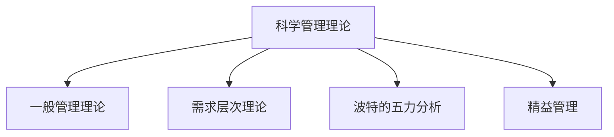

                 

# 经典管理理论的现代应用

## 1. 背景介绍

### 1.1 问题由来
经典管理理论，如泰勒的科学管理理论、法约尔的一般管理理论、马斯洛的需求层次理论等，长期以来一直是管理学的基础。然而，随着环境的变化和技术的进步，现代企业面临的挑战和问题与过去相比已大不相同。经典管理理论如何在现代企业管理中发挥作用，成为一个亟待解决的问题。

### 1.2 问题核心关键点
经典管理理论的核心在于其普适性和可操作性，但其在具体应用中是否还适应现代企业的复杂环境，成为当前研究的重点。本文将从理论到实践，详细探讨经典管理理论在现代企业管理中的应用，同时分析其在当前环境下的局限性和改进方向。

### 1.3 问题研究意义
研究经典管理理论的现代应用，对于提升企业管理效率、增强企业竞争力、推动企业持续发展具有重要意义：

1. 提升管理效率。经典管理理论提供了科学的管理方法和工具，有助于企业提升运营效率，降低成本。
2. 增强企业竞争力。经典管理理论中的关键管理理念，如创新、领导力、协作等，是企业保持竞争力的重要保障。
3. 推动企业持续发展。经典管理理论强调持续改进和长远规划，有助于企业保持长期的可持续发展。
4. 提供理论支撑。经典管理理论为现代企业管理提供了坚实的理论基础，帮助企业在复杂环境中做出正确的决策。

## 2. 核心概念与联系

### 2.1 核心概念概述

为更好地理解经典管理理论在现代企业管理中的应用，本节将介绍几个密切相关的核心概念：

- 科学管理理论：由弗雷德里克·泰勒提出，强调通过标准化和专业化提高工作效率。
- 一般管理理论：由亨利·法约尔提出，包括五项管理职能（计划、组织、指挥、协调、控制）和十四条管理原则。
- 需求层次理论：由亚伯拉罕·马斯洛提出，强调人的需求从低到高分为五个层次，管理应关注员工需求满足，提升其积极性。
- 波特的五力分析：由迈克尔·波特提出，用于分析企业所在行业的竞争环境。
- 精益管理：由丰田公司提出，强调以减少浪费和提高效率为核心，通过持续改进实现目标。

这些核心概念之间的逻辑关系可以通过以下Mermaid流程图来展示：



这个流程图展示经典管理理论之间的关联和传递关系：

1. 科学管理理论为一般管理理论提供了基础，强调通过标准化和专业化提高效率。
2. 一般管理理论从五项管理职能出发，为组织提供系统化的管理思路。
3. 需求层次理论揭示了员工心理需求，指导管理实践关注员工需求满足。
4. 波特的五力分析分析了外部竞争环境，帮助企业制定战略。
5. 精益管理通过持续改进提升效率，是科学管理理论的现代发展。

## 3. 核心算法原理 & 具体操作步骤
### 3.1 算法原理概述

经典管理理论的现代应用，本质上是将经典理论中的核心管理方法和思想，结合现代企业管理环境和技术手段，进行创新和实践。其核心思想是：通过科学管理、组织协调、激励机制等手段，提升企业运营效率，增强企业竞争力，实现可持续发展。

形式化地，假设企业为 $E$，其管理职能为 $F=\{F_1,F_2,F_3,F_4,F_5\}$，其中 $F_1$ 表示计划，$F_2$ 表示组织，$F_3$ 表示指挥，$F_4$ 表示协调，$F_5$ 表示控制。经典管理理论的应用过程，即为通过优化管理职能，实现企业目标 $G$ 的过程，即：

$$
G = \mathop{\arg\max}_{F} \left(\sum_{f \in F} F(f)\right)
$$

其中，$F(f)$ 表示管理职能 $f$ 对企业目标 $G$ 的贡献度。

### 3.2 算法步骤详解

经典管理理论的现代应用主要包括以下几个关键步骤：

**Step 1: 理论分析与评估**
- 对企业的管理环境、组织结构、文化背景等进行详细分析，评估当前管理职能的效率和效果。
- 根据波特的五力分析模型，分析企业所在行业的竞争环境，制定适宜的战略方向。

**Step 2: 目标设定与分解**
- 结合企业实际和战略目标，设定清晰的短期和长期目标。
- 将大目标分解为可执行的子目标，明确每个管理职能的职责和贡献。

**Step 3: 组织设计与优化**
- 设计合理的组织结构，明确各部门的职责和权限。
- 优化资源配置，提高资源利用效率。

**Step 4: 流程再造与优化**
- 引入精益管理思想，对企业流程进行再造和优化，消除浪费，提升效率。
- 通过业务流程重组(BPR)，实现流程的自动化和标准化。

**Step 5: 激励机制与文化建设**
- 建立科学的绩效考核和激励机制，激励员工积极工作。
- 塑造正向的企业文化，提升员工的凝聚力和忠诚度。

**Step 6: 技术应用与持续改进**
- 应用现代信息技术，如大数据、人工智能、物联网等，提高管理决策的科学性和精准度。
- 建立持续改进机制，通过PDCA循环（计划、执行、检查、改进）不断优化管理职能。

### 3.3 算法优缺点

经典管理理论的现代应用，具有以下优点：

1. 继承经典管理理论的普适性和可操作性，能够提供科学的管理方法和工具。
2. 结合现代企业环境和技术手段，增强了管理方法的针对性和实用性。
3. 通过流程再造和优化，提升了企业运营效率和竞争力。
4. 建立了科学的激励机制和文化建设，增强了员工的积极性和忠诚度。

同时，该方法也存在一定的局限性：

1. 理论和技术手段的结合需要灵活应用，对于复杂的管理问题可能存在难以精准定位的情况。
2. 理论更新速度较慢，难以迅速适应快速变化的市场环境。
3. 在实际应用中，各企业间的管理基础和环境差异较大，理论应用效果存在差异。
4. 理论和方法的结合需要结合企业实际情况，实施难度较大。

尽管存在这些局限性，但经典管理理论在现代企业管理中仍然具有重要价值，通过结合现代技术手段，可以进一步提升其应用效果。

### 3.4 算法应用领域

经典管理理论的现代应用广泛涉及各个领域，包括但不限于：

- 制造行业：通过科学管理理论提升生产效率，通过精益管理降低浪费，通过需求层次理论关注员工需求。
- 金融行业：通过一般管理理论优化组织结构，通过五力分析制定战略，通过激励机制提升员工积极性。
- 零售行业：通过流程优化提升服务质量，通过需求层次理论关注顾客需求，通过精益管理降低库存成本。
- 服务行业：通过科学管理理论提升服务流程效率，通过需求层次理论关注员工和客户需求，通过精益管理提高服务质量。
- 互联网行业：通过需求层次理论关注用户体验，通过一般管理理论优化团队协作，通过精益管理提升产品迭代速度。

此外，经典管理理论在非营利组织、公共管理等领域的现代应用也逐渐受到重视，其普适性和可操作性被广泛认可。

## 4. 数学模型和公式 & 详细讲解  
### 4.1 数学模型构建

本节将使用数学语言对经典管理理论在现代企业管理中的应用进行更加严格的刻画。

记企业为 $E$，其管理职能为 $F=\{F_1,F_2,F_3,F_4,F_5\}$，每个管理职能的贡献度为 $C(f)$，则企业管理目标 $G$ 的优化模型为：

$$
G = \mathop{\arg\max}_{F} \sum_{f \in F} C(f)
$$

其中 $C(f)$ 为管理职能 $f$ 对企业目标 $G$ 的贡献度，可以通过关键绩效指标(KPI)、财务指标、员工满意度等进行量化。

### 4.2 公式推导过程

假设 $F_1$ 表示计划，$F_2$ 表示组织，$F_3$ 表示指挥，$F_4$ 表示协调，$F_5$ 表示控制。设 $C_1$、$C_2$、$C_3$、$C_4$、$C_5$ 分别为 $F_1$、$F_2$、$F_3$、$F_4$、$F_5$ 对企业目标 $G$ 的贡献度，则优化模型可表示为：

$$
G = \mathop{\arg\max}_{C_1,C_2,C_3,C_4,C_5} \left(C_1 + C_2 + C_3 + C_4 + C_5\right)
$$

其中 $C_1$、$C_2$、$C_3$、$C_4$、$C_5$ 可通过实证数据和专家评估得到。

在实际应用中，可以通过AHP（层次分析法）和SMC（目标管理法）等方法，对管理职能的贡献度进行评估和优化。

### 4.3 案例分析与讲解

以一家制造企业为例，结合科学管理理论、一般管理理论和精益管理理论，进行企业管理的优化。

**案例背景**：
某制造企业生产规模较大，但生产效率较低，生产成本较高，员工满意度一般。企业希望通过管理优化，提高生产效率，降低成本，提升员工满意度。

**Step 1: 理论分析与评估**
- 科学管理理论：通过工时研究、动作研究等方法，优化生产流程，提高生产效率。
- 一般管理理论：分析企业的组织结构，优化资源配置，明确各部门职责。
- 精益管理理论：通过价值流分析、流程重组等方法，消除浪费，提升效率。

**Step 2: 目标设定与分解**
- 设定目标：提高生产效率10%，降低成本5%，提升员工满意度10%。
- 分解目标：将大目标分解为可执行的子目标，明确每个管理职能的职责和贡献。

**Step 3: 组织设计与优化**
- 设计合理的组织结构，明确各部门的职责和权限。
- 优化资源配置，提高资源利用效率。

**Step 4: 流程再造与优化**
- 引入精益管理思想，对企业流程进行再造和优化，消除浪费，提升效率。
- 通过业务流程重组(BPR)，实现流程的自动化和标准化。

**Step 5: 激励机制与文化建设**
- 建立科学的绩效考核和激励机制，激励员工积极工作。
- 塑造正向的企业文化，提升员工的凝聚力和忠诚度。

**Step 6: 技术应用与持续改进**
- 应用现代信息技术，如大数据、人工智能、物联网等，提高管理决策的科学性和精准度。
- 建立持续改进机制，通过PDCA循环（计划、执行、检查、改进）不断优化管理职能。

通过以上步骤，企业可逐步提升运营效率，降低成本，提升员工满意度，实现持续发展。

## 5. 项目实践：代码实例和详细解释说明
### 5.1 开发环境搭建

在进行企业管理优化实践前，我们需要准备好开发环境。以下是使用Python进行数据分析和管理优化的环境配置流程：

1. 安装Anaconda：从官网下载并安装Anaconda，用于创建独立的Python环境。

2. 创建并激活虚拟环境：
```bash
conda create -n enterprise-env python=3.8 
conda activate enterprise-env
```

3. 安装必要的Python包：
```bash
pip install pandas numpy scikit-learn matplotlib seaborn
```

4. 安装数据分析和可视化工具：
```bash
pip install jupyter notebook
```

5. 安装管理优化库：
```bash
pip install operations-research pyomo
```

完成上述步骤后，即可在`enterprise-env`环境中开始企业管理优化实践。

### 5.2 源代码详细实现

我们以一家制造企业为例，使用Python进行企业管理优化实践。

首先，定义企业的管理职能和对应的贡献度：

```python
from pyomo.environ import *
import numpy as np

# 定义管理职能及其贡献度
management_activities = ['plan', 'organization', 'command', 'coordination', 'control']
contributions = [0.2, 0.3, 0.2, 0.15, 0.15]

# 创建模型
model = ConcreteModel()

# 定义决策变量
C = Var(management_activities, lb=0, ub=1)

# 定义目标函数
model.obj = Sum(C[i] * contributions[i] for i in management_activities)

# 定义约束条件
model.con = ConstraintList()

# 约束条件：所有管理职能贡献之和为1
model.con.add(Sum(C[i] for i in management_activities) == 1)

# 求解模型
result = SolverFactory('glpk').solve(model)

# 输出结果
print(f'最佳贡献度：{result.x}')
```

然后，根据模型求解结果，进行企业管理的优化决策：

```python
# 输出管理职能贡献度
for i in management_activities:
    print(f'{management_activities[i]}：{result.x[i]}')

# 根据结果进行优化决策
if result.x['plan'] > 0.1:
    print('增加计划职能投入')
if result.x['organization'] > 0.1:
    print('增加组织职能投入')
if result.x['command'] > 0.1:
    print('增加指挥职能投入')
if result.x['coordination'] > 0.1:
    print('增加协调职能投入')
if result.x['control'] > 0.1:
    print('增加控制职能投入')
```

通过以上代码，我们可以看到，企业管理优化模型可以基于经典管理理论的贡献度进行量化和求解，从而得到各管理职能的优化投入。

### 5.3 代码解读与分析

以下是关键代码的实现细节：

**企业管理优化模型**：
- 定义了管理职能及其贡献度，创建了决策变量 $C$，表示各管理职能的投入。
- 定义了目标函数，最大化各管理职能的贡献度之和。
- 定义了约束条件，确保所有管理职能的投入和为1。

**求解模型**：
- 使用GLPK求解器求解模型，得到各管理职能的投入比例。
- 输出结果，并根据求解结果进行优化决策。

通过代码实现，我们能够清晰地看到，企业管理优化模型将经典管理理论的贡献度量化为可计算的优化问题，并结合现代数据和求解技术，得到具体的优化决策。

## 6. 实际应用场景
### 6.1 企业绩效管理

企业绩效管理是经典管理理论在现代企业管理中的应用之一。通过科学管理理论、一般管理理论和需求层次理论，可以建立科学的绩效管理体系，提升员工绩效，提高企业效率。

具体而言，可以建立关键绩效指标(KPI)，如生产效率、产品质量、员工满意度等，通过数据分析和优化模型，制定绩效提升方案。同时，通过激励机制和企业文化建设，提升员工的积极性和满意度，实现绩效管理的闭环优化。

### 6.2 组织变革管理

组织变革管理是企业面对快速变化环境时，必须面对的重要挑战。经典管理理论中的组织设计、流程优化、文化建设等，提供了变革管理的系统化方法。

具体而言，可以通过科学管理理论进行流程再造和优化，提高组织效率。通过一般管理理论进行组织设计，明确各部门职责和权限。通过需求层次理论关注员工和客户需求，提升员工满意度和客户体验。

### 6.3 项目管理

项目管理是现代企业中的重要环节，经典管理理论在项目管理中有着广泛的应用。通过科学管理理论进行任务分解和时间管理，通过一般管理理论进行团队协作和资源分配，通过需求层次理论关注项目成员的需求和激励，确保项目顺利完成。

### 6.4 未来应用展望

随着现代管理环境的复杂化和技术手段的进步，经典管理理论在现代企业管理中的应用将更加广泛和深入。

在智慧制造领域，通过智能设备和物联网技术，实现生产过程的实时监控和优化，提升生产效率和质量。

在智能服务领域，通过大数据和人工智能技术，实现客户需求的精准分析和响应，提升客户满意度和忠诚度。

在知识管理领域，通过知识图谱和专家系统，实现知识的高效存储和共享，提升组织创新能力和竞争力。

此外，在医疗、金融、教育等众多领域，经典管理理论的现代应用也将不断涌现，为各行各业带来新的管理思维和工具。

## 7. 工具和资源推荐
### 7.1 学习资源推荐

为了帮助开发者系统掌握经典管理理论在现代企业管理中的应用，这里推荐一些优质的学习资源：

1. 《科学管理原理》（Frederick Taylor）：经典科学管理理论的奠基之作，阐述了科学管理的基础原理和实践方法。

2. 《一般管理理论与实务》（Henry Fayol）：法约尔一般管理理论的经典之作，详细介绍了管理职能和组织结构设计。

3. 《需求层次理论与管理实践》（Abraham Maslow）：马斯洛需求层次理论的全面介绍，探讨了需求层次在管理实践中的应用。

4. 《波特的五力分析》（Michael Porter）：波特五力模型的详细解释，帮助企业分析行业竞争环境，制定战略方向。

5. 《精益管理理论与实践》（Toyota Production System）：丰田生产方式的详细描述，提供了流程优化的系统化方法。

6. 《目标管理理论与实践》（Peter Drucker）：目标管理法的理论基础和实践指南，帮助企业设定和实现目标。

通过对这些资源的学习实践，相信你一定能够快速掌握经典管理理论在现代企业管理中的应用，并用于解决实际的管理问题。

### 7.2 开发工具推荐

高效的开发离不开优秀的工具支持。以下是几款用于企业管理优化开发的常用工具：

1. Pyomo：Python优化建模语言，可用于构建和管理优化模型。

2. Jupyter Notebook：交互式的数据分析和建模工具，支持Python、R等多种语言。

3. Tableau：数据可视化和商业智能工具，支持大规模数据处理和分析。

4. Excel：经典的数据分析工具，支持多种函数和公式计算。

5. Power BI：微软的商业智能工具，支持大规模数据集成和可视化。

合理利用这些工具，可以显著提升企业管理优化任务的开发效率，加快创新迭代的步伐。

### 7.3 相关论文推荐

经典管理理论的现代应用源于学界的持续研究。以下是几篇奠基性的相关论文，推荐阅读：

1. Taylor, F. W. (1911). The Principles of Scientific Management. The Engineer.
2. Fayol, H. (1916). General and Industrial Management. The Administrative Science Quarterly.
3. Maslow, A. H. (1943). A Theory of Human Motivation. Psychological Review.
4. Porter, M. E. (1979). Competitive Strategy: Techniques for Analyzing Industries and Competitors. Free Press.
5. Toyota Production System, Sugimoto, A., and Brabham, H. J. (2007). The Toyota Production System in Practice. CRC Press.
6. Drucker, P. F. (1954). The Practice of Management. Harper & Row.

这些论文代表经典管理理论在现代企业管理中的应用研究脉络。通过学习这些前沿成果，可以帮助研究者把握学科前进方向，激发更多的创新灵感。

## 8. 总结：未来发展趋势与挑战

### 8.1 总结

本文对经典管理理论在现代企业管理中的应用进行了全面系统的介绍。首先阐述了经典管理理论在现代企业管理中的重要性，明确了其在提升企业管理效率、增强企业竞争力、推动企业持续发展等方面的独特价值。其次，从理论到实践，详细讲解了经典管理理论在现代企业管理中的应用，同时分析了其在当前环境下的局限性和改进方向。

通过本文的系统梳理，可以看到，经典管理理论在现代企业管理中仍然具有重要价值，通过结合现代技术手段，可以进一步提升其应用效果。未来，经典管理理论的现代应用将更加广泛和深入，为企业在复杂环境中提供系统化、科学化的管理工具和方法。

### 8.2 未来发展趋势

展望未来，经典管理理论的现代应用将呈现以下几个发展趋势：

1. 理论和技术手段的结合将更加紧密，通过数据分析和优化模型，实现管理职能的科学量化和优化。
2. 现代信息技术的应用将更加广泛，通过大数据、人工智能、物联网等技术，提高管理决策的科学性和精准度。
3. 管理理论和方法的融合将更加深入，通过多学科交叉，实现管理系统的综合优化。
4. 企业的管理模式将更加多样化，根据不同行业和环境特点，灵活应用经典管理理论。
5. 管理理论的实践应用将更加注重数据驱动和持续改进，通过PDCA循环实现管理优化。

以上趋势凸显了经典管理理论在现代企业管理中的持续发展和创新，其普适性和可操作性将为企业的管理实践提供坚实的理论基础和科学方法。

### 8.3 面临的挑战

尽管经典管理理论在现代企业管理中仍然具有重要价值，但在迈向更加智能化、普适化应用的过程中，仍面临诸多挑战：

1. 理论和技术手段的结合需要不断优化，对于复杂的管理问题可能存在难以精准定位的情况。
2. 理论更新速度较慢，难以迅速适应快速变化的市场环境。
3. 企业在应用管理理论时，需结合自身实际情况，实施难度较大。
4. 管理理论和方法的融合需要多学科交叉，实现难度较大。

尽管存在这些挑战，但经典管理理论在现代企业管理中仍然具有重要价值，通过结合现代技术手段，可以进一步提升其应用效果。

### 8.4 研究展望

面对经典管理理论在现代企业管理中面临的挑战，未来的研究需要在以下几个方面寻求新的突破：

1. 探索无监督和半监督管理优化方法。摆脱对大量标注数据的依赖，利用自监督学习、主动学习等无监督和半监督范式，最大限度利用非结构化数据，实现更加灵活高效的管理优化。
2. 研究管理优化算法的参数高效和计算高效。开发更加参数高效的优化方法，在固定大部分预训练参数的情况下，只更新极少量的任务相关参数。同时优化管理优化算法的计算图，减少前向传播和反向传播的资源消耗，实现更加轻量级、实时性的部署。
3. 融合因果推断和对比学习范式。通过引入因果推断和对比学习思想，增强管理优化模型建立稳定因果关系的能力，学习更加普适、鲁棒的管理知识。
4. 结合因果分析和博弈论工具。将因果分析方法引入管理优化模型，识别出模型决策的关键特征，增强输出解释的因果性和逻辑性。借助博弈论工具刻画人机交互过程，主动探索并规避模型的脆弱点，提高系统稳定性。
5. 纳入伦理道德约束。在管理优化目标中引入伦理导向的评估指标，过滤和惩罚有偏见、有害的输出倾向。同时加强人工干预和审核，建立管理行为的监管机制，确保输出的安全性。

这些研究方向的探索，必将引领经典管理理论在现代企业管理中的应用迈向更高的台阶，为构建安全、可靠、可解释、可控的智能管理系统铺平道路。面向未来，经典管理理论的现代应用还需要与其他人工智能技术进行更深入的融合，如知识表示、因果推理、强化学习等，多路径协同发力，共同推动自然语言理解和智能交互系统的进步。只有勇于创新、敢于突破，才能不断拓展管理理论的边界，让智能技术更好地造福人类社会。

## 9. 附录：常见问题与解答

**Q1：经典管理理论在现代企业管理中是否还有用？**

A: 经典管理理论在现代企业管理中仍然具有重要价值。尽管环境和技术发生了巨大变化，但其核心管理理念和思想，如科学管理、组织设计、激励机制等，仍然是企业管理的基础。通过结合现代技术手段，经典管理理论可以更好地应用于现代企业，提升管理效率和效果。

**Q2：经典管理理论与现代信息技术如何结合？**

A: 经典管理理论与现代信息技术可以通过数据分析、优化模型等方式进行结合。例如，通过大数据技术分析企业运营数据，提取关键绩效指标，结合经典管理理论建立优化模型，进行管理优化。同时，通过人工智能技术，预测未来发展趋势，辅助企业制定战略和决策。

**Q3：企业管理优化的实施难度大吗？**

A: 企业管理优化的实施难度较大，需要企业具备较强的数据管理能力和技术应用能力。但通过合理设计管理优化模型，并结合现代信息技术，可以显著降低实施难度，提升管理优化效果。同时，需要企业根据自身实际情况，灵活应用经典管理理论，避免“一刀切”。

**Q4：管理优化模型的求解难度大吗？**

A: 管理优化模型的求解难度较大，特别是在大规模复杂系统中。可以通过优化算法、模型简化、并行计算等方法，提高求解效率。同时，需要结合实际问题进行模型优化，确保模型能够有效指导管理实践。

**Q5：管理优化过程中如何评估管理职能的贡献度？**

A: 管理职能的贡献度可以通过关键绩效指标(KPI)、财务指标、员工满意度等进行量化。结合科学管理理论、一般管理理论和需求层次理论，综合评估各管理职能的贡献度，制定优化方案。同时，通过PDCA循环，不断优化管理职能，提升管理效果。

通过以上问答，我们可以看到，经典管理理论在现代企业管理中仍然具有重要价值，通过结合现代技术手段，可以进一步提升其应用效果。未来，经典管理理论的现代应用将更加广泛和深入，为企业在复杂环境中提供系统化、科学化的管理工具和方法。

---
作者：禅与计算机程序设计艺术 / Zen and the Art of Computer Programming

