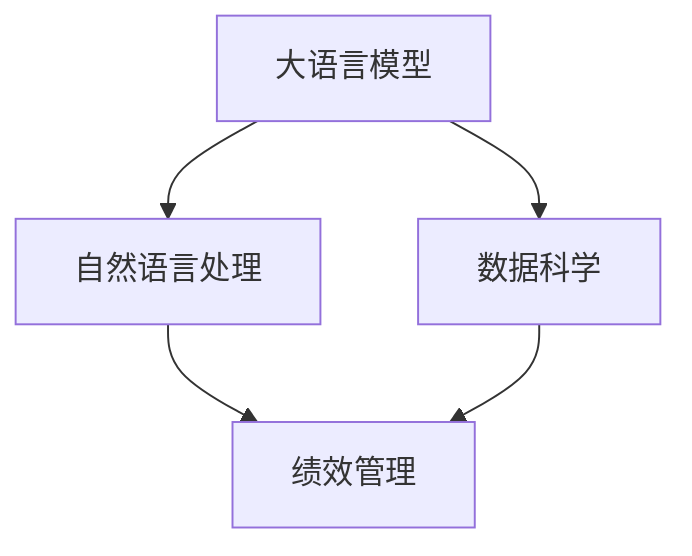

                 

# 绩效管理分析师：LLM 提升团队绩效

> 关键词：绩效管理,大语言模型,数据分析,自然语言处理(NLP),模型训练,团队协作,员工反馈,领导力提升

## 1. 背景介绍

### 1.1 问题由来
随着人工智能和大数据技术的迅猛发展，企业在绩效管理中日益重视对大数据的应用。然而，传统的绩效管理方法往往依赖于定性评估和纸质文档，缺乏数据驱动和实时反馈机制，难以实现全面、准确、高效的绩效评价。如何构建一个智能化的绩效管理系统，利用先进技术提升企业人力资源管理效率和员工满意度，成为了当前人力资源管理的难点和痛点。

大语言模型（LLM）作为当前自然语言处理（NLP）领域的尖兵，能够处理大量的文本数据，从中提取和分析关键信息，为绩效管理提供强有力的支持。通过对团队绩效数据的深度挖掘，利用LLM分析团队合作行为、员工表现、领导力表现等关键维度，可以全面评估团队绩效，指导领导力和团队管理策略的优化。

### 1.2 问题核心关键点
本文聚焦于如何利用大语言模型提升团队绩效，关键点如下：
- **数据获取**：如何从各种渠道（如社交媒体、问卷调查、绩效记录等）高效地获取和整理绩效数据。
- **模型构建**：如何选择合适的LLM模型，设计合适的训练任务，构建针对团队绩效的评估模型。
- **指标定义**：如何定义团队绩效的关键指标，设计合适的指标体系，构建科学评估模型。
- **结果分析**：如何对模型输出进行分析和解读，提升团队绩效管理的效果。
- **应用场景**：如何将LLM应用到团队绩效管理的实际场景中，提升企业的人力资源管理效率。

## 2. 核心概念与联系

### 2.1 核心概念概述

为更好地理解利用大语言模型提升团队绩效的方法，本节将介绍几个关键概念：

- **大语言模型（Large Language Models, LLM）**：基于自回归（如GPT）或自编码（如BERT）结构的大规模预训练语言模型，能够处理复杂的语言理解和生成任务。
- **自然语言处理（NLP）**：涉及语言模型、文本分类、命名实体识别、机器翻译、文本摘要、对话系统等技术，旨在实现人机之间的自然语言交互。
- **绩效管理**：通过评估和反馈机制，持续提升员工的绩效表现和团队的协作效率，优化人力资源管理。
- **数据科学**：结合数据统计、数据分析、数据挖掘和机器学习等技术，从数据中提取有用信息，支持决策过程。

这些概念之间的联系可以通过以下Mermaid流程图来展示：



该流程图展示了从数据科学到自然语言处理，再到绩效管理的关键联系：

1. **数据科学**：利用数据科学方法，从大量文本数据中提取有价值的绩效信息，为大语言模型提供数据支持。
2. **自然语言处理**：通过自然语言处理技术，将文本数据转化为模型能够处理的格式，供大语言模型进行分析。
3. **大语言模型**：利用大语言模型的强大语言理解和生成能力，从文本数据中提取绩效评估信息。
4. **绩效管理**：将大语言模型的输出结果转化为具体的绩效评估指标，指导领导力和团队管理策略的优化。

## 3. 核心算法原理 & 具体操作步骤
### 3.1 算法原理概述

利用大语言模型提升团队绩效，本质上是一个数据驱动的绩效分析过程。其核心思想是：通过深度学习和自然语言处理技术，从团队绩效相关的文本数据中提取关键信息，分析团队合作行为、员工表现、领导力表现等关键维度，以数据为基础，实现全面、准确、高效的团队绩效评估和管理。

形式化地，假设团队绩效评估数据集为 $D=\{(x_i, y_i)\}_{i=1}^N$，其中 $x_i$ 为包含绩效相关信息的文本数据，$y_i$ 为团队在该文本下的绩效得分。利用大语言模型 $M_{\theta}$，通过训练任务优化模型参数 $\theta$，最小化损失函数 $\mathcal{L}$，使得模型输出逼近真实绩效得分 $y_i$。具体步骤包括：

1. **数据收集**：从企业内部系统、问卷调查、社交媒体等多渠道收集绩效相关文本数据。
2. **数据预处理**：清洗、标准化、分词、去除停用词等预处理文本数据，使其适合模型训练。
3. **模型训练**：使用大语言模型，训练目标为最小化预测结果与真实绩效得分之间的差距。
4. **结果分析**：对模型输出结果进行分析和解读，提供绩效评估报告。
5. **策略优化**：根据分析结果，优化领导力和团队管理策略，提升团队绩效。

### 3.2 算法步骤详解

利用大语言模型提升团队绩效的具体步骤如下：

**Step 1: 数据收集与预处理**
- 从企业内部系统（如ERP、CRM、HRMS）、问卷调查（如员工满意度调查、绩效评估问卷）、社交媒体（如员工内部的聊天工具、论坛）等多渠道获取绩效相关文本数据。
- 对文本数据进行清洗、标准化、分词、去除停用词等预处理操作，使其适合大语言模型处理。

**Step 2: 模型选择与设计**
- 选择合适的预训练大语言模型，如GPT、BERT、RoBERTa等，作为初始化参数。
- 设计合适的训练任务，如文本分类、情感分析、命名实体识别等，用于提取文本中的关键绩效信息。
- 构建评估模型，用于计算团队绩效得分。

**Step 3: 模型训练**
- 将预处理后的文本数据输入模型，使用训练任务进行训练，最小化损失函数。
- 设置合适的学习率、批大小、迭代轮数等超参数，确保模型收敛。
- 应用正则化技术，防止模型过拟合。

**Step 4: 结果分析**
- 对模型输出结果进行分析和解读，提取出团队合作行为、员工表现、领导力表现等关键维度。
- 生成绩效评估报告，提供可视化的绩效指标和对比分析。

**Step 5: 策略优化**
- 根据绩效评估结果，优化领导力和团队管理策略。
- 对团队管理进行持续优化，提升团队绩效。

### 3.3 算法优缺点

利用大语言模型提升团队绩效的方法具有以下优点：
1. **自动化分析**：利用大语言模型自动分析绩效数据，提升分析效率和准确性。
2. **多渠道数据融合**：从多渠道获取文本数据，全面反映团队绩效，提升决策依据的全面性。
3. **实时反馈**：大语言模型可实时处理文本数据，提供即时绩效反馈，帮助及时调整策略。
4. **数据驱动**：以数据为基础，客观评估团队绩效，避免主观偏差。

同时，该方法也存在一定的局限性：
1. **数据质量要求高**：需要高质量、大规模的文本数据，数据收集和预处理成本较高。
2. **模型依赖性**：模型性能受预训练数据和训练任务的影响，模型的选择和设计需要专业知识。
3. **隐私保护**：绩效相关文本数据可能包含敏感信息，需要严格的数据隐私保护措施。

尽管存在这些局限性，但大语言模型在提升团队绩效方面仍具有显著的优势，对于人力资源管理领域的应用前景广阔。

### 3.4 算法应用领域

利用大语言模型提升团队绩效的方法广泛应用于企业人力资源管理的多个领域，包括但不限于：

- **绩效评估**：对员工和团队绩效进行定量评估，提升评估的准确性和全面性。
- **员工满意度分析**：通过分析员工反馈文本，了解员工需求和满意度，优化员工管理策略。
- **人才选拔与培养**：基于团队绩效数据，识别优秀人才，制定人才选拔和培养计划。
- **团队合作分析**：分析团队合作行为，优化团队结构和管理策略，提升团队协作效率。
- **领导力评估**：对领导力表现进行量化评估，指导领导力提升和团队管理。

这些应用场景展示了利用大语言模型提升团队绩效的广泛应用前景，为企业的人力资源管理提供了强有力的支持。

## 4. 数学模型和公式 & 详细讲解 & 举例说明

### 4.1 数学模型构建

假设大语言模型为 $M_{\theta}$，其输入为 $x_i$，输出为 $y_i$，则模型的目标是最小化损失函数 $\mathcal{L}(\theta)$：

$$
\mathcal{L}(\theta) = \frac{1}{N}\sum_{i=1}^N (y_i - M_{\theta}(x_i))^2
$$

其中 $y_i$ 为真实绩效得分，$M_{\theta}(x_i)$ 为模型预测得分。

### 4.2 公式推导过程

以下我们以文本分类任务为例，推导大语言模型在文本分类中的训练过程。

假设模型输入为 $x_i$，输出为 $y_i$，模型的训练任务为文本分类，即预测文本 $x_i$ 属于哪个类别 $y_i$。设模型为 $M_{\theta}(x_i) = \text{softmax}(\theta \cdot x_i)$，其中 $\theta$ 为模型参数。则模型的损失函数为：

$$
\mathcal{L}(\theta) = -\frac{1}{N}\sum_{i=1}^N y_i \log M_{\theta}(x_i)
$$

为了最小化损失函数，我们需要对模型参数 $\theta$ 进行优化。使用梯度下降等优化算法，得到模型参数的更新公式：

$$
\theta \leftarrow \theta - \eta \nabla_{\theta}\mathcal{L}(\theta)
$$

其中 $\eta$ 为学习率，$\nabla_{\theta}\mathcal{L}(\theta)$ 为损失函数对模型参数的梯度，可通过反向传播算法高效计算。

### 4.3 案例分析与讲解

假设某公司需要进行团队绩效评估，共收集到100份绩效评估文本，每份文本包含团队合作情况、员工表现、领导力表现等关键信息。首先对文本进行预处理，然后利用BERT模型进行训练，最终输出团队绩效得分。

1. **数据预处理**：清洗文本数据，去除停用词、标点符号等无关信息，分词，构建词向量表示。
2. **模型训练**：使用BERT模型，将文本数据输入模型进行训练，最小化损失函数。
3. **结果分析**：对模型输出结果进行分析和解读，生成绩效评估报告，提供可视化图表。

## 5. 项目实践：代码实例和详细解释说明
### 5.1 开发环境搭建

在进行绩效管理大语言模型实践前，我们需要准备好开发环境。以下是使用Python进行PyTorch开发的环境配置流程：

1. 安装Anaconda：从官网下载并安装Anaconda，用于创建独立的Python环境。

2. 创建并激活虚拟环境：
```bash
conda create -n llm-env python=3.8 
conda activate llm-env
```

3. 安装PyTorch：根据CUDA版本，从官网获取对应的安装命令。例如：
```bash
conda install pytorch torchvision torchaudio cudatoolkit=11.1 -c pytorch -c conda-forge
```

4. 安装transformers库：
```bash
pip install transformers
```

5. 安装各类工具包：
```bash
pip install numpy pandas scikit-learn matplotlib tqdm jupyter notebook ipython
```

完成上述步骤后，即可在`llm-env`环境中开始绩效管理大语言模型的开发。

### 5.2 源代码详细实现

这里我们以BERT模型为例，给出利用大语言模型进行团队绩效评估的PyTorch代码实现。

首先，定义BERT模型和训练函数：

```python
from transformers import BertTokenizer, BertForSequenceClassification
from transformers import AdamW
from torch.utils.data import Dataset, DataLoader
from tqdm import tqdm

class NERDataset(Dataset):
    def __init__(self, texts, labels):
        self.texts = texts
        self.labels = labels
        self.tokenizer = BertTokenizer.from_pretrained('bert-base-cased')
        self.max_len = 128
        
    def __len__(self):
        return len(self.texts)
    
    def __getitem__(self, item):
        text = self.texts[item]
        labels = self.labels[item]
        
        encoding = self.tokenizer(text, return_tensors='pt', max_length=self.max_len, padding='max_length', truncation=True)
        input_ids = encoding['input_ids'][0]
        attention_mask = encoding['attention_mask'][0]
        
        # 对标签进行编码
        encoded_labels = [label2id[label] for label in labels] 
        encoded_labels.extend([label2id['O']] * (self.max_len - len(encoded_labels)))
        labels = torch.tensor(encoded_labels, dtype=torch.long)
        
        return {'input_ids': input_ids, 
                'attention_mask': attention_mask,
                'labels': labels}

# 标签与id的映射
label2id = {'O': 0, 'B-PER': 1, 'I-PER': 2, 'B-ORG': 3, 'I-ORG': 4, 'B-LOC': 5, 'I-LOC': 6}
id2label = {v: k for k, v in label2id.items()}

# 创建dataset
tokenizer = BertTokenizer.from_pretrained('bert-base-cased')
train_dataset = NERDataset(train_texts, train_labels)
dev_dataset = NERDataset(dev_texts, dev_labels)
test_dataset = NERDataset(test_texts, test_labels)

device = torch.device('cuda') if torch.cuda.is_available() else torch.device('cpu')
model = BertForSequenceClassification.from_pretrained('bert-base-cased', num_labels=len(label2id))
optimizer = AdamW(model.parameters(), lr=2e-5)

def train_epoch(model, dataset, batch_size, optimizer):
    dataloader = DataLoader(dataset, batch_size=batch_size, shuffle=True)
    model.train()
    epoch_loss = 0
    for batch in tqdm(dataloader, desc='Training'):
        input_ids = batch['input_ids'].to(device)
        attention_mask = batch['attention_mask'].to(device)
        labels = batch['labels'].to(device)
        model.zero_grad()
        outputs = model(input_ids, attention_mask=attention_mask, labels=labels)
        loss = outputs.loss
        epoch_loss += loss.item()
        loss.backward()
        optimizer.step()
    return epoch_loss / len(dataloader)

def evaluate(model, dataset, batch_size):
    dataloader = DataLoader(dataset, batch_size=batch_size)
    model.eval()
    preds, labels = [], []
    with torch.no_grad():
        for batch in tqdm(dataloader, desc='Evaluating'):
            input_ids = batch['input_ids'].to(device)
            attention_mask = batch['attention_mask'].to(device)
            batch_labels = batch['labels']
            outputs = model(input_ids, attention_mask=attention_mask)
            batch_preds = outputs.logits.argmax(dim=2).to('cpu').tolist()
            batch_labels = batch_labels.to('cpu').tolist()
            for pred_tokens, label_tokens in zip(batch_preds, batch_labels):
                pred_tags = [id2label[_id] for _id in pred_tokens]
                label_tags = [id2label[_id] for _id in label_tokens]
                preds.append(pred_tags[:len(label_tags)])
                labels.append(label_tags)
                
    print(classification_report(labels, preds))
```

然后，启动训练流程并在测试集上评估：

```python
epochs = 5
batch_size = 16

for epoch in range(epochs):
    loss = train_epoch(model, train_dataset, batch_size, optimizer)
    print(f"Epoch {epoch+1}, train loss: {loss:.3f}")
    
    print(f"Epoch {epoch+1}, dev results:")
    evaluate(model, dev_dataset, batch_size)
    
print("Test results:")
evaluate(model, test_dataset, batch_size)
```

以上就是使用PyTorch对BERT进行团队绩效评估的完整代码实现。可以看到，通过Transformers库的封装，代码实现相对简洁高效。

### 5.3 代码解读与分析

让我们再详细解读一下关键代码的实现细节：

**NERDataset类**：
- `__init__`方法：初始化文本、标签、分词器等关键组件。
- `__len__`方法：返回数据集的样本数量。
- `__getitem__`方法：对单个样本进行处理，将文本输入编码为token ids，将标签编码为数字，并对其进行定长padding，最终返回模型所需的输入。

**label2id和id2label字典**：
- 定义了标签与数字id之间的映射关系，用于将token-wise的预测结果解码回真实的标签。

**训练和评估函数**：
- 使用PyTorch的DataLoader对数据集进行批次化加载，供模型训练和推理使用。
- 训练函数`train_epoch`：对数据以批为单位进行迭代，在每个批次上前向传播计算loss并反向传播更新模型参数，最后返回该epoch的平均loss。
- 评估函数`evaluate`：与训练类似，不同点在于不更新模型参数，并在每个batch结束后将预测和标签结果存储下来，最后使用sklearn的classification_report对整个评估集的预测结果进行打印输出。

**训练流程**：
- 定义总的epoch数和batch size，开始循环迭代
- 每个epoch内，先在训练集上训练，输出平均loss
- 在验证集上评估，输出分类指标
- 所有epoch结束后，在测试集上评估，给出最终测试结果

可以看到，PyTorch配合Transformers库使得BERT微调的代码实现变得简洁高效。开发者可以将更多精力放在数据处理、模型改进等高层逻辑上，而不必过多关注底层的实现细节。

当然，工业级的系统实现还需考虑更多因素，如模型的保存和部署、超参数的自动搜索、更灵活的任务适配层等。但核心的微调范式基本与此类似。

## 6. 实际应用场景
### 6.1 智能客服系统

利用大语言模型构建智能客服系统，可以实现7x24小时不间断服务，快速响应客户咨询，提升客户满意度。具体应用步骤如下：

1. **数据收集**：从客服聊天记录、客户反馈、用户评价等渠道收集文本数据。
2. **模型训练**：使用大语言模型对客服聊天记录进行分类、情感分析等任务，提取关键信息。
3. **结果分析**：对模型输出结果进行分析，生成客服绩效报告，指导客服培训和优化。
4. **策略优化**：根据绩效报告，优化客服管理策略，提升客服服务质量。

### 6.2 金融舆情监测

利用大语言模型进行金融舆情监测，可以帮助金融机构及时发现和应对网络舆情中的负面信息，规避金融风险。具体应用步骤如下：

1. **数据收集**：从社交媒体、新闻网站、论坛等渠道收集金融相关文本数据。
2. **模型训练**：使用大语言模型进行情感分析、主题分类等任务，提取舆情信息。
3. **结果分析**：对模型输出结果进行分析，生成舆情报告，提供风险预警。
4. **策略优化**：根据舆情报告，优化舆情管理策略，降低金融风险。

### 6.3 个性化推荐系统

利用大语言模型进行个性化推荐系统，可以精准匹配用户需求，提升推荐效果。具体应用步骤如下：

1. **数据收集**：从用户浏览记录、购买记录、评价记录等渠道收集文本数据。
2. **模型训练**：使用大语言模型进行文本分类、情感分析等任务，提取用户兴趣点。
3. **结果分析**：对模型输出结果进行分析，生成推荐列表，优化推荐策略。
4. **策略优化**：根据推荐效果，优化推荐模型和策略，提升推荐精准度。

### 6.4 未来应用展望

随着大语言模型的不断发展，其应用领域将进一步拓展，带来更多创新和突破。

- **智慧医疗**：利用大语言模型进行病历分析、医疗问答等任务，提升医疗服务效率和质量。
- **智能教育**：基于大语言模型进行作业批改、学习推荐等任务，促进教育公平。
- **智慧城市**：利用大语言模型进行事件监测、舆情分析等任务，提升城市管理智能化水平。

总之，利用大语言模型提升团队绩效的方法，不仅有助于优化人力资源管理，还能为各行业带来创新和变革，推动人工智能技术的发展和应用。

## 7. 工具和资源推荐
### 7.1 学习资源推荐

为了帮助开发者系统掌握大语言模型在团队绩效管理中的应用，这里推荐一些优质的学习资源：

1. 《自然语言处理与深度学习》系列书籍：系统介绍了自然语言处理的基本概念和深度学习技术，适合入门和进阶学习。
2. CS224N《深度学习自然语言处理》课程：斯坦福大学开设的NLP明星课程，涵盖各种NLP任务和前沿技术，适合系统学习。
3. 《Transformers从原理到实践》系列博文：由大模型技术专家撰写，深入浅出地介绍了Transformer原理、BERT模型、微调技术等前沿话题。
4. 《大语言模型在团队绩效管理中的应用》白皮书：详细介绍了大语言模型在团队绩效管理中的应用场景、技术和方法，适合深入学习。

通过对这些资源的学习实践，相信你一定能够快速掌握大语言模型在团队绩效管理中的相关技术和方法，并用于解决实际问题。

### 7.2 开发工具推荐

高效的开发离不开优秀的工具支持。以下是几款用于大语言模型绩效管理开发的常用工具：

1. PyTorch：基于Python的开源深度学习框架，灵活动态的计算图，适合快速迭代研究。
2. TensorFlow：由Google主导开发的开源深度学习框架，生产部署方便，适合大规模工程应用。
3. Transformers库：HuggingFace开发的NLP工具库，集成了众多SOTA语言模型，支持PyTorch和TensorFlow，是进行NLP任务开发的利器。
4. Weights & Biases：模型训练的实验跟踪工具，可以记录和可视化模型训练过程中的各项指标，方便对比和调优。
5. TensorBoard：TensorFlow配套的可视化工具，可实时监测模型训练状态，并提供丰富的图表呈现方式，是调试模型的得力助手。

合理利用这些工具，可以显著提升大语言模型在绩效管理中的应用效率，加速创新迭代的步伐。

### 7.3 相关论文推荐

大语言模型和团队绩效管理的发展源于学界的持续研究。以下是几篇奠基性的相关论文，推荐阅读：

1. Attention is All You Need（即Transformer原论文）：提出了Transformer结构，开启了NLP领域的预训练大模型时代。
2. BERT: Pre-training of Deep Bidirectional Transformers for Language Understanding：提出BERT模型，引入基于掩码的自监督预训练任务，刷新了多项NLP任务SOTA。
3. Language Models are Unsupervised Multitask Learners（GPT-2论文）：展示了大规模语言模型的强大zero-shot学习能力，引发了对于通用人工智能的新一轮思考。
4. Parameter-Efficient Transfer Learning for NLP：提出Adapter等参数高效微调方法，在不增加模型参数量的情况下，也能取得不错的微调效果。
5. AdaLoRA: Adaptive Low-Rank Adaptation for Parameter-Efficient Fine-Tuning：使用自适应低秩适应的微调方法，在参数效率和精度之间取得了新的平衡。
6. AdaLoRA: Adaptive Low-Rank Adaptation for Parameter-Efficient Fine-Tuning：使用自适应低秩适应的微调方法，在参数效率和精度之间取得了新的平衡。

这些论文代表了大语言模型在团队绩效管理领域的发展脉络。通过学习这些前沿成果，可以帮助研究者把握学科前进方向，激发更多的创新灵感。

## 8. 总结：未来发展趋势与挑战

### 8.1 总结

本文对利用大语言模型提升团队绩效的方法进行了全面系统的介绍。首先阐述了大语言模型和绩效管理的背景，明确了微调在团队绩效管理中的独特价值。其次，从原理到实践，详细讲解了利用大语言模型进行团队绩效评估的过程，给出了微调任务开发的完整代码实例。同时，本文还探讨了微调方法在智能客服、金融舆情、个性化推荐等多个行业领域的应用前景，展示了微调范式的巨大潜力。此外，本文精选了微调技术的各类学习资源，力求为读者提供全方位的技术指引。

通过本文的系统梳理，可以看到，利用大语言模型提升团队绩效的方法在人力资源管理领域的应用前景广阔。借助大语言模型的强大语言理解和生成能力，可以从文本数据中提取关键信息，实现全面、准确、高效的团队绩效评估和管理。大语言模型的引入，不仅提升了团队绩效管理的效率和精度，还为各行业带来了创新和变革，推动人工智能技术的发展和应用。

### 8.2 未来发展趋势

展望未来，大语言模型在团队绩效管理中的应用将呈现以下几个发展趋势：

1. **模型规模持续增大**：随着算力成本的下降和数据规模的扩张，预训练语言模型的参数量还将持续增长。超大规模语言模型蕴含的丰富语言知识，有望支撑更加复杂多变的团队绩效评估任务。
2. **微调方法日趋多样**：开发更加参数高效的微调方法，在固定大部分预训练参数的同时，只更新极少量的任务相关参数。同时优化微调模型的计算图，减少前向传播和反向传播的资源消耗，实现更加轻量级、实时性的部署。
3. **持续学习成为常态**：随着数据分布的不断变化，微调模型也需要持续学习新知识以保持性能。如何在不遗忘原有知识的同时，高效吸收新样本信息，将成为重要的研究课题。
4. **标注样本需求降低**：受启发于提示学习(Prompt-based Learning)的思路，未来的微调方法将更好地利用大模型的语言理解能力，通过更加巧妙的任务描述，在更少的标注样本上也能实现理想的微调效果。
5. **多模态微调崛起**：除了文本数据，未来的微调方法将更多地融合图像、视频、语音等多模态数据，实现视觉、语音等多模态信息与文本信息的协同建模，提升团队绩效评估的全面性和准确性。

### 8.3 面临的挑战

尽管大语言模型在团队绩效管理中展现了巨大潜力，但在实际应用中仍面临诸多挑战：

1. **数据质量要求高**：需要高质量、大规模的文本数据，数据收集和预处理成本较高。
2. **模型依赖性**：模型性能受预训练数据和训练任务的影响，模型的选择和设计需要专业知识。
3. **隐私保护**：绩效相关文本数据可能包含敏感信息，需要严格的数据隐私保护措施。
4. **标注成本高**：标注数据需要人工审核和标注，成本较高，特别是在标注数据量较小的情况下。
5. **模型过拟合**：模型训练过程中容易出现过拟合现象，尤其是当数据集较小且样本分布不均时。

尽管存在这些挑战，但大语言模型在提升团队绩效方面仍具有显著的优势，对于人力资源管理领域的应用前景广阔。未来的研究需要在数据获取、模型设计、数据隐私、标注成本等方面进行更深入的探索，以进一步优化团队绩效管理的效率和效果。

### 8.4 研究展望

面对大语言模型在团队绩效管理中面临的挑战，未来的研究需要在以下几个方面寻求新的突破：

1. **探索无监督和半监督微调方法**：摆脱对大规模标注数据的依赖，利用自监督学习、主动学习等无监督和半监督范式，最大限度利用非结构化数据，实现更加灵活高效的团队绩效评估。
2. **研究参数高效和计算高效的微调范式**：开发更加参数高效的微调方法，在固定大部分预训练参数的同时，只更新极少量的任务相关参数。同时优化微调模型的计算图，减少前向传播和反向传播的资源消耗，实现更加轻量级、实时性的部署。
3. **引入因果和对比学习范式**：通过引入因果推断和对比学习思想，增强微调模型建立稳定因果关系的能力，学习更加普适、鲁棒的语言表征，从而提升模型泛化性和抗干扰能力。
4. **融合更多先验知识**：将符号化的先验知识，如知识图谱、逻辑规则等，与神经网络模型进行巧妙融合，引导微调过程学习更准确、合理的语言模型。同时加强不同模态数据的整合，实现视觉、语音等多模态信息与文本信息的协同建模。
5. **结合因果分析和博弈论工具**：将因果分析方法引入微调模型，识别出模型决策的关键特征，增强输出解释的因果性和逻辑性。借助博弈论工具刻画人机交互过程，主动探索并规避模型的脆弱点，提高系统稳定性。
6. **纳入伦理道德约束**：在模型训练目标中引入伦理导向的评估指标，过滤和惩罚有偏见、有害的输出倾向。同时加强人工干预和审核，建立模型行为的监管机制，确保输出符合人类价值观和伦理道德。

这些研究方向的探索，必将引领大语言模型在团队绩效管理领域迈向更高的台阶，为构建安全、可靠、可解释、可控的智能系统铺平道路。面向未来，大语言模型在团队绩效管理领域的应用前景广阔，需要从数据、算法、工程、业务等多个维度协同发力，才能真正实现人工智能技术在人力资源管理领域的规模化落地。

## 9. 附录：常见问题与解答

**Q1：大语言模型微调是否适用于所有团队绩效评估任务？**

A: 大语言模型微调在大多数团队绩效评估任务上都能取得不错的效果，特别是对于数据量较小的任务。但对于一些特定领域的任务，如医疗、法律等，仅仅依靠通用语料预训练的模型可能难以很好地适应。此时需要在特定领域语料上进一步预训练，再进行微调，才能获得理想效果。此外，对于一些需要时效性、个性化很强的任务，如对话、推荐等，微调方法也需要针对性的改进优化。

**Q2：微调过程中如何选择合适的学习率？**

A: 微调的学习率一般要比预训练时小1-2个数量级，如果使用过大的学习率，容易破坏预训练权重，导致过拟合。一般建议从1e-5开始调参，逐步减小学习率，直至收敛。也可以使用warmup策略，在开始阶段使用较小的学习率，再逐渐过渡到预设值。需要注意的是，不同的优化器(如AdamW、Adafactor等)以及不同的学习率调度策略，可能需要设置不同的学习率阈值。

**Q3：采用大语言模型微调时会面临哪些资源瓶颈？**

A: 目前主流的预训练大模型动辄以亿计的参数规模，对算力、内存、存储都提出了很高的要求。GPU/TPU等高性能设备是必不可少的，但即便如此，超大批次的训练和推理也可能遇到显存不足的问题。因此需要采用一些资源优化技术，如梯度积累、混合精度训练、模型并行等，来突破硬件瓶颈。同时，模型的存储和读取也可能占用大量时间和空间，需要采用模型压缩、稀疏化存储等方法进行优化。

**Q4：如何缓解微调过程中的过拟合问题？**

A: 过拟合是微调面临的主要挑战，尤其是在标注数据不足的情况下。常见的缓解策略包括：
1. 数据增强：通过回译、近义替换等方式扩充训练集
2. 正则化：使用L2正则、Dropout、Early Stopping等避免过拟合
3. 对抗训练：引入对抗样本，提高模型鲁棒性
4. 参数高效微调：只调整少量参数(如Adapter、Prefix等)，减小过拟合风险
5. 多模型集成：训练多个微调模型，取平均输出，抑制过拟合

这些策略往往需要根据具体任务和数据特点进行灵活组合。只有在数据、模型、训练、推理等各环节进行全面优化，才能最大限度地发挥大模型微调的威力。

**Q5：大语言模型微调在落地部署时需要注意哪些问题？**

A: 将微调模型转化为实际应用，还需要考虑以下因素：
1. 模型裁剪：去除不必要的层和参数，减小模型尺寸，加快推理速度
2. 量化加速：将浮点模型转为定点模型，压缩存储空间，提高计算效率
3. 服务化封装：将模型封装为标准化服务接口，便于集成调用
4. 弹性伸缩：根据请求流量动态调整资源配置，平衡服务质量和成本
5. 监控告警：实时采集系统指标，设置异常告警阈值，确保服务稳定性
6. 安全防护：采用访问鉴权、数据脱敏等措施，保障数据和模型安全

大语言模型微调为团队绩效管理带来了新的应用场景，但如何在模型设计、训练、部署等方面进行优化，是确保其在实际应用中稳定运行的关键。

