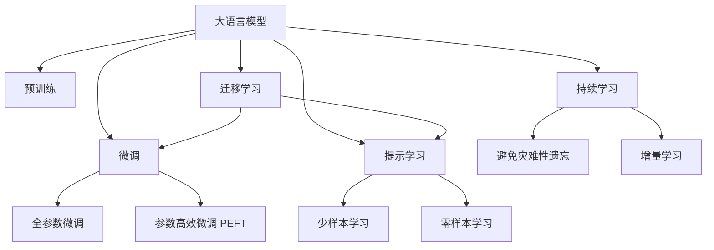

                 

# 绩效管理：LLM 分析驱动

> 关键词：绩效管理, 大语言模型, 数据分析, 模型评估, 机器学习, 业务优化

## 1. 背景介绍

### 1.1 问题由来

绩效管理一直是企业管理中的重要环节，对员工表现进行科学的评估和管理，不仅能提升企业整体竞争力，还能激发员工的工作积极性。传统的绩效管理方式大多依赖于人工评价，主观性强，难以实现全面、客观的评估。而在数字化转型的浪潮中，引入数据分析和人工智能技术，将绩效管理带入了一个新的发展阶段。

### 1.2 问题核心关键点

当前，基于大语言模型（Large Language Model, LLM）的绩效管理系统成为业界的热点。该系统通过结合 LLM 的能力，可以自动分析员工工作表现，提供全面的绩效报告，并提出优化建议，使得绩效管理更加高效、客观。

具体而言，LLM 能够从文本数据中提取关键信息，识别员工的优势和不足，并通过自然语言生成技术，自动生成绩效评估报告。相比于传统的人工评估，这种基于 LLM 的绩效管理系统能够有效降低评估成本，提高评估的客观性和准确性。

### 1.3 问题研究意义

研究基于 LLM 的绩效管理系统，对于提升企业管理效率、优化人力资源配置、提升员工工作积极性等方面具有重要意义：

1. **降低评估成本**：LLM 自动化分析员工表现，减少了人工评估的时间和成本。
2. **提高评估准确性**：LLM 的深度学习能力能够从海量的文本数据中提取关键信息，避免主观偏见，提高评估的客观性。
3. **辅助管理决策**：通过分析员工绩效，系统能够提供优化建议，帮助管理层制定更为科学的人力资源策略。
4. **提升员工满意度**：基于 LLM 的反馈和优化建议，员工能够更清楚地了解自身工作表现，提升工作积极性。

## 2. 核心概念与联系

### 2.1 核心概念概述

为更好地理解基于 LLM 的绩效管理系统，本节将介绍几个密切相关的核心概念：

- **大语言模型 (LLM)**：以自回归（如GPT）或自编码（如BERT）模型为代表的大规模预训练语言模型。通过在海量无标签文本数据上进行预训练，学习通用的语言表示，具备强大的语言理解和生成能力。
- **预训练**：指在大规模无标签文本语料上，通过自监督学习任务训练通用语言模型的过程。常见的预训练任务包括言语建模、遮挡语言模型等。
- **微调 (Fine-tuning)**：指在预训练模型的基础上，使用下游任务的少量标注数据，通过有监督地训练来优化模型在该任务上的性能。
- **迁移学习 (Transfer Learning)**：指将一个领域学习到的知识，迁移应用到另一个不同但相关的领域的学习范式。LLM 的预训练-微调过程即是一种典型的迁移学习方式。
- **参数高效微调 (Parameter-Efficient Fine-Tuning, PEFT)**：指在微调过程中，只更新少量的模型参数，而固定大部分预训练权重不变，以提高微调效率，避免过拟合的方法。
- **提示学习 (Prompt Learning)**：通过在输入文本中添加提示模板 (Prompt Template)，引导 LLM 进行特定任务的推理和生成。可以在不更新模型参数的情况下，实现零样本或少样本学习。
- **少样本学习 (Few-shot Learning)**：指在只有少量标注样本的情况下，模型能够快速适应新任务的学习方法。在大语言模型中，通常通过在输入中提供少量示例来实现，无需更新模型参数。
- **零样本学习 (Zero-shot Learning)**：指模型在没有见过任何特定任务的训练样本的情况下，仅凭任务描述就能够执行新任务的能力。大语言模型通过预训练获得的广泛知识，使其能够理解任务指令并生成相应输出。
- **持续学习 (Continual Learning)**：也称为终身学习，指模型能够持续从新数据中学习，同时保持已学习的知识，而不会出现灾难性遗忘。这对于保持大语言模型的时效性和适应性至关重要。

这些核心概念之间的逻辑关系可以通过以下 Mermaid 流程图来展示：



这个流程图展示了大语言模型的核心概念及其之间的关系：

1. 大语言模型通过预训练获得基础能力。
2. 微调是对预训练模型进行任务特定的优化，可以分为全参数微调和参数高效微调（PEFT）。
3. 提示学习是一种不更新模型参数的方法，可以实现少样本学习和零样本学习。
4. 迁移学习是连接预训练模型与下游任务的桥梁，可以通过微调或提示学习来实现。
5. 持续学习旨在使模型能够不断学习新知识，同时避免遗忘旧知识。

这些概念共同构成了大语言模型的学习和应用框架，使其能够在各种场景下发挥强大的语言理解和生成能力。通过理解这些核心概念，我们可以更好地把握大语言模型的工作原理和优化方向。

## 3. 核心算法原理 & 具体操作步骤
### 3.1 算法原理概述

基于 LLM 的绩效管理系统，本质上是一个结合了数据分析和自然语言处理技术的综合系统。其核心思想是：将 LLM 作为强大的数据分析工具，从员工绩效数据中提取关键信息，并通过自然语言生成技术，自动生成绩效评估报告，辅助企业管理决策。

### 3.2 算法步骤详解

基于 LLM 的绩效管理系统一般包括以下几个关键步骤：

**Step 1: 准备绩效数据**
- 收集员工工作表现的相关数据，如工作日志、绩效评估表、项目成果等。
- 对数据进行清洗和格式化，确保数据质量和一致性。

**Step 2: 预训练 LLM 模型**
- 选择预训练好的 LLM 模型，如 BERT、GPT-3 等，作为初始化参数。
- 通过大规模无标签数据进行预训练，学习通用的语言表示。

**Step 3: 设计绩效评估指标**
- 根据企业需求，设计合适的绩效评估指标，如工作量、工作质量、创新能力等。
- 确定评估指标的计算方式和权重分配。

**Step 4: 添加任务适配层**
- 根据评估指标，在预训练模型顶层设计合适的输出层和损失函数。
- 对于分类任务，通常在顶层添加线性分类器和交叉熵损失函数。
- 对于生成任务，通常使用语言模型的解码器输出概率分布，并以负对数似然为损失函数。

**Step 5: 设置微调超参数**
- 选择合适的优化算法及其参数，如 AdamW、SGD 等，设置学习率、批大小、迭代轮数等。
- 设置正则化技术及强度，包括权重衰减、Dropout、Early Stopping 等。
- 确定冻结预训练参数的策略，如仅微调顶层，或全部参数都参与微调。

**Step 6: 执行梯度训练**
- 将绩效数据分批次输入模型，前向传播计算损失函数。
- 反向传播计算参数梯度，根据设定的优化算法和学习率更新模型参数。
- 周期性在验证集上评估模型性能，根据性能指标决定是否触发 Early Stopping。
- 重复上述步骤直到满足预设的迭代轮数或 Early Stopping 条件。

**Step 7: 测试和部署**
- 在测试集上评估微调后模型 $M_{\hat{\theta}}$ 的性能，对比微调前后的精度提升。
- 使用微调后的模型对新员工绩效进行推理预测，集成到实际的管理系统中。
- 持续收集新的员工绩效数据，定期重新微调模型，以适应数据分布的变化。

以上是基于 LLM 的绩效管理系统的一般流程。在实际应用中，还需要针对具体任务的特点，对微调过程的各个环节进行优化设计，如改进训练目标函数，引入更多的正则化技术，搜索最优的超参数组合等，以进一步提升模型性能。

### 3.3 算法优缺点

基于 LLM 的绩效管理系统具有以下优点：
1. **高效性**：通过 LLM 自动化分析员工表现，减少了人工评估的时间和成本。
2. **客观性**：LLM 的深度学习能力能够从海量的文本数据中提取关键信息，避免主观偏见，提高评估的客观性。
3. **灵活性**：LLM 的迁移学习能力使其能够快速适应不同类型的绩效评估指标。
4. **可扩展性**：系统能够自动扩展到更多的员工和任务，易于部署和维护。

同时，该方法也存在一定的局限性：
1. **依赖高质量数据**：绩效数据的质量直接影响系统的评估效果。
2. **模型复杂性**：LLM 模型的复杂性较高，需要较高的计算资源和存储空间。
3. **过拟合风险**：在少数标注样本的情况下，模型可能出现过拟合现象。
4. **解释性不足**：LLM 模型的决策过程通常缺乏可解释性，难以对其推理逻辑进行分析和调试。

尽管存在这些局限性，但就目前而言，基于 LLM 的绩效管理系统仍是大规模数据分析和人力资源管理的重要工具。未来相关研究的重点在于如何进一步降低模型复杂度，提高模型的可解释性和鲁棒性，以及优化数据采集和处理流程，以实现更高效、更准确的绩效评估。

### 3.4 算法应用领域

基于 LLM 的绩效管理系统在企业管理、人力资源配置、员工培训等多个领域都有广泛的应用：

- **企业管理**：通过自动化分析员工绩效数据，系统能够提供全面的绩效报告，辅助管理层进行决策。
- **人力资源配置**：通过分析员工的工作表现和能力，系统能够优化人力资源配置，提升整体工作效率。
- **员工培训**：通过分析员工绩效数据，系统能够识别员工的不足之处，提供个性化的培训建议。
- **薪酬福利**：基于员工绩效数据，系统能够计算合理的薪酬福利，提升员工满意度。

除了上述这些经典应用外，大语言模型在绩效管理系统的应用领域还在不断拓展，如可控文本生成、情感分析、知识管理等，为企业管理提供更多创新思路。

## 4. 数学模型和公式 & 详细讲解
### 4.1 数学模型构建

本节将使用数学语言对基于 LLM 的绩效管理系统进行更加严格的刻画。

记绩效评估任务的数据集为 $D=\{(x_i, y_i)\}_{i=1}^N, x_i \in \mathcal{X}, y_i \in \mathcal{Y}$，其中 $\mathcal{X}$ 为输入空间，$\mathcal{Y}$ 为输出空间。假设模型 $M_{\theta}$ 在输入 $x$ 上的输出为 $\hat{y}=M_{\theta}(x) \in [0,1]$，表示员工工作表现的评分。真实标签 $y \in \{0,1\}$ 表示员工工作表现的实际评分。

定义模型 $M_{\theta}$ 在数据样本 $(x,y)$ 上的损失函数为 $\ell(M_{\theta}(x),y)$，则在数据集 $D$ 上的经验风险为：

$$
\mathcal{L}(\theta) = \frac{1}{N} \sum_{i=1}^N \ell(M_{\theta}(x_i),y_i)
$$

微调的优化目标是最小化经验风险，即找到最优参数：

$$
\theta^* = \mathop{\arg\min}_{\theta} \mathcal{L}(\theta)
$$

在实践中，我们通常使用基于梯度的优化算法（如SGD、Adam等）来近似求解上述最优化问题。设 $\eta$ 为学习率，$\lambda$ 为正则化系数，则参数的更新公式为：

$$
\theta \leftarrow \theta - \eta \nabla_{\theta}\mathcal{L}(\theta) - \eta\lambda\theta
$$

其中 $\nabla_{\theta}\mathcal{L}(\theta)$ 为损失函数对参数 $\theta$ 的梯度，可通过反向传播算法高效计算。

### 4.2 公式推导过程

以下我们以二分类任务为例，推导交叉熵损失函数及其梯度的计算公式。

假设模型 $M_{\theta}$ 在输入 $x$ 上的输出为 $\hat{y}=M_{\theta}(x) \in [0,1]$，表示员工工作表现的评分。真实标签 $y \in \{0,1\}$。则二分类交叉熵损失函数定义为：

$$
\ell(M_{\theta}(x),y) = -[y\log \hat{y} + (1-y)\log (1-\hat{y})]
$$

将其代入经验风险公式，得：

$$
\mathcal{L}(\theta) = -\frac{1}{N}\sum_{i=1}^N [y_i\log M_{\theta}(x_i)+(1-y_i)\log(1-M_{\theta}(x_i))]
$$

根据链式法则，损失函数对参数 $\theta_k$ 的梯度为：

$$
\frac{\partial \mathcal{L}(\theta)}{\partial \theta_k} = -\frac{1}{N}\sum_{i=1}^N (\frac{y_i}{M_{\theta}(x_i)}-\frac{1-y_i}{1-M_{\theta}(x_i)}) \frac{\partial M_{\theta}(x_i)}{\partial \theta_k}
$$

其中 $\frac{\partial M_{\theta}(x_i)}{\partial \theta_k}$ 可进一步递归展开，利用自动微分技术完成计算。

在得到损失函数的梯度后，即可带入参数更新公式，完成模型的迭代优化。重复上述过程直至收敛，最终得到适应绩效评估任务的最优模型参数 $\theta^*$。

## 5. 项目实践：代码实例和详细解释说明
### 5.1 开发环境搭建

在进行绩效管理系统开发前，我们需要准备好开发环境。以下是使用Python进行PyTorch开发的环境配置流程：

1. 安装Anaconda：从官网下载并安装Anaconda，用于创建独立的Python环境。

2. 创建并激活虚拟环境：
```bash
conda create -n pytorch-env python=3.8 
conda activate pytorch-env
```

3. 安装PyTorch：根据CUDA版本，从官网获取对应的安装命令。例如：
```bash
conda install pytorch torchvision torchaudio cudatoolkit=11.1 -c pytorch -c conda-forge
```

4. 安装Transformers库：
```bash
pip install transformers
```

5. 安装各类工具包：
```bash
pip install numpy pandas scikit-learn matplotlib tqdm jupyter notebook ipython
```

完成上述步骤后，即可在`pytorch-env`环境中开始绩效管理系统开发。

### 5.2 源代码详细实现

下面我们以二分类任务为例，给出使用Transformers库对BERT模型进行绩效评估任务微调的PyTorch代码实现。

首先，定义绩效评估任务的数据处理函数：

```python
from transformers import BertTokenizer
from torch.utils.data import Dataset
import torch

class PerformanceDataset(Dataset):
    def __init__(self, texts, labels, tokenizer, max_len=128):
        self.texts = texts
        self.labels = labels
        self.tokenizer = tokenizer
        self.max_len = max_len
        
    def __len__(self):
        return len(self.texts)
    
    def __getitem__(self, item):
        text = self.texts[item]
        label = self.labels[item]
        
        encoding = self.tokenizer(text, return_tensors='pt', max_length=self.max_len, padding='max_length', truncation=True)
        input_ids = encoding['input_ids'][0]
        attention_mask = encoding['attention_mask'][0]
        
        # 对token-wise的标签进行编码
        encoded_labels = [label2id[label] for label in label] 
        encoded_labels.extend([label2id['O']] * (self.max_len - len(encoded_labels)))
        labels = torch.tensor(encoded_labels, dtype=torch.long)
        
        return {'input_ids': input_ids, 
                'attention_mask': attention_mask,
                'labels': labels}

# 标签与id的映射
label2id = {'O': 0, 'P': 1}
id2label = {v: k for k, v in label2id.items()}

# 创建dataset
tokenizer = BertTokenizer.from_pretrained('bert-base-cased')

train_dataset = PerformanceDataset(train_texts, train_labels, tokenizer)
dev_dataset = PerformanceDataset(dev_texts, dev_labels, tokenizer)
test_dataset = PerformanceDataset(test_texts, test_labels, tokenizer)
```

然后，定义模型和优化器：

```python
from transformers import BertForTokenClassification, AdamW

model = BertForTokenClassification.from_pretrained('bert-base-cased', num_labels=len(label2id))

optimizer = AdamW(model.parameters(), lr=2e-5)
```

接着，定义训练和评估函数：

```python
from torch.utils.data import DataLoader
from tqdm import tqdm
from sklearn.metrics import classification_report

device = torch.device('cuda') if torch.cuda.is_available() else torch.device('cpu')
model.to(device)

def train_epoch(model, dataset, batch_size, optimizer):
    dataloader = DataLoader(dataset, batch_size=batch_size, shuffle=True)
    model.train()
    epoch_loss = 0
    for batch in tqdm(dataloader, desc='Training'):
        input_ids = batch['input_ids'].to(device)
        attention_mask = batch['attention_mask'].to(device)
        labels = batch['labels'].to(device)
        model.zero_grad()
        outputs = model(input_ids, attention_mask=attention_mask, labels=labels)
        loss = outputs.loss
        epoch_loss += loss.item()
        loss.backward()
        optimizer.step()
    return epoch_loss / len(dataloader)

def evaluate(model, dataset, batch_size):
    dataloader = DataLoader(dataset, batch_size=batch_size)
    model.eval()
    preds, labels = [], []
    with torch.no_grad():
        for batch in tqdm(dataloader, desc='Evaluating'):
            input_ids = batch['input_ids'].to(device)
            attention_mask = batch['attention_mask'].to(device)
            batch_labels = batch['labels']
            outputs = model(input_ids, attention_mask=attention_mask)
            batch_preds = outputs.logits.argmax(dim=2).to('cpu').tolist()
            batch_labels = batch_labels.to('cpu').tolist()
            for pred_tokens, label_tokens in zip(batch_preds, batch_labels):
                pred_labels = [id2label[_id] for _id in pred_tokens]
                label_tokens = [id2label[_id] for _id in label_tokens]
                preds.append(pred_labels[:len(label_tokens)])
                labels.append(label_tokens)
                
    print(classification_report(labels, preds))
```

最后，启动训练流程并在测试集上评估：

```python
epochs = 5
batch_size = 16

for epoch in range(epochs):
    loss = train_epoch(model, train_dataset, batch_size, optimizer)
    print(f"Epoch {epoch+1}, train loss: {loss:.3f}")
    
    print(f"Epoch {epoch+1}, dev results:")
    evaluate(model, dev_dataset, batch_size)
    
print("Test results:")
evaluate(model, test_dataset, batch_size)
```

以上就是使用PyTorch对BERT进行绩效评估任务微调的完整代码实现。可以看到，得益于Transformers库的强大封装，我们可以用相对简洁的代码完成BERT模型的加载和微调。

### 5.3 代码解读与分析

让我们再详细解读一下关键代码的实现细节：

**PerformanceDataset类**：
- `__init__`方法：初始化文本、标签、分词器等关键组件。
- `__len__`方法：返回数据集的样本数量。
- `__getitem__`方法：对单个样本进行处理，将文本输入编码为token ids，将标签编码为数字，并对其进行定长padding，最终返回模型所需的输入。

**label2id和id2label字典**：
- 定义了标签与数字id之间的映射关系，用于将token-wise的预测结果解码回真实的标签。

**训练和评估函数**：
- 使用PyTorch的DataLoader对数据集进行批次化加载，供模型训练和推理使用。
- 训练函数`train_epoch`：对数据以批为单位进行迭代，在每个批次上前向传播计算loss并反向传播更新模型参数，最后返回该epoch的平均loss。
- 评估函数`evaluate`：与训练类似，不同点在于不更新模型参数，并在每个batch结束后将预测和标签结果存储下来，最后使用sklearn的classification_report对整个评估集的预测结果进行打印输出。

**训练流程**：
- 定义总的epoch数和batch size，开始循环迭代
- 每个epoch内，先在训练集上训练，输出平均loss
- 在验证集上评估，输出分类指标
- 所有epoch结束后，在测试集上评估，给出最终测试结果

可以看到，PyTorch配合Transformers库使得BERT微调的代码实现变得简洁高效。开发者可以将更多精力放在数据处理、模型改进等高层逻辑上，而不必过多关注底层的实现细节。

当然，工业级的系统实现还需考虑更多因素，如模型的保存和部署、超参数的自动搜索、更灵活的任务适配层等。但核心的微调范式基本与此类似。

## 6. 实际应用场景
### 6.1 智能招聘

基于大语言模型的绩效管理系统可以广泛应用于智能招聘系统，提升招聘效率和质量。传统招聘过程往往依赖于人工筛选简历，效率低、主观性强，难以找到最合适的候选人。而使用基于LLM的绩效管理系统，系统能够自动筛选和推荐候选人的简历，判断其工作能力和潜力，从而提升招聘的成功率。

在技术实现上，可以收集公司内部和外部的简历数据，将简历内容作为输入，将候选人的工作表现作为标签，在此基础上对预训练模型进行微调。微调后的模型能够自动分析简历内容，生成简历评分和推荐结果。对于推荐结果不满意的候选人，还可以提供详细的评分报告，帮助招聘经理做出更为准确的决策。

### 6.2 绩效管理优化

企业中的绩效管理往往存在主观性强、数据难以获取等问题。基于大语言模型的绩效管理系统可以通过分析员工绩效数据，自动生成全面的绩效报告，辅助企业进行决策。系统可以基于工作量、工作质量、创新能力等多个指标，对员工表现进行多维度评估，并提出针对性的改进建议。

具体而言，系统可以自动收集员工的工作日志、项目成果、绩效评估表等数据，通过自然语言处理技术，从文本中提取关键信息，生成绩效报告。对于评分不达标的员工，系统还可以自动分析其不足之处，提供个性化的培训建议，帮助员工提升工作能力。

### 6.3 绩效反馈系统

绩效反馈系统是绩效管理中的重要环节，能够帮助员工了解自己的工作表现，提升工作积极性。基于大语言模型的绩效管理系统可以自动生成绩效反馈报告，提供具体的反馈意见和改进建议。

在技术实现上，系统可以自动收集员工的日常工作数据，通过LLM分析生成绩效反馈报告。报告中不仅包含评分，还包括具体的评分依据和改进建议。员工可以通过系统查看自己的绩效报告，了解自己的优点和不足，从而制定改进计划，提升工作效率和质量。

### 6.4 未来应用展望

随着大语言模型和微调方法的不断发展，基于LLM的绩效管理系统将在更多领域得到应用，为企业管理带来变革性影响。

在智慧医疗领域，基于LLM的绩效管理系统可以用于医疗人员绩效评估，提升医疗服务质量。在智能教育领域，系统可以用于学生表现评估和反馈，帮助教师制定更为科学的教育策略。在智慧城市治理中，系统可以用于城市员工绩效评估，提高城市管理的自动化和智能化水平。

此外，在企业生产、社会治理、文娱传媒等众多领域，基于大语言模型的绩效管理系统也将不断涌现，为经济社会发展注入新的动力。相信随着技术的日益成熟，LMM的绩效管理系统必将成为企业管理的重要工具，推动企业管理向数字化、智能化转型。

## 7. 工具和资源推荐
### 7.1 学习资源推荐

为了帮助开发者系统掌握大语言模型微调的理论基础和实践技巧，这里推荐一些优质的学习资源：

1. 《Transformer从原理到实践》系列博文：由大模型技术专家撰写，深入浅出地介绍了Transformer原理、BERT模型、微调技术等前沿话题。

2. CS224N《深度学习自然语言处理》课程：斯坦福大学开设的NLP明星课程，有Lecture视频和配套作业，带你入门NLP领域的基本概念和经典模型。

3. 《Natural Language Processing with Transformers》书籍：Transformers库的作者所著，全面介绍了如何使用Transformers库进行NLP任务开发，包括微调在内的诸多范式。

4. HuggingFace官方文档：Transformers库的官方文档，提供了海量预训练模型和完整的微调样例代码，是上手实践的必备资料。

5. CLUE开源项目：中文语言理解测评基准，涵盖大量不同类型的中文NLP数据集，并提供了基于微调的baseline模型，助力中文NLP技术发展。

通过对这些资源的学习实践，相信你一定能够快速掌握大语言模型微调的精髓，并用于解决实际的NLP问题。
###  7.2 开发工具推荐

高效的开发离不开优秀的工具支持。以下是几款用于大语言模型微调开发的常用工具：

1. PyTorch：基于Python的开源深度学习框架，灵活动态的计算图，适合快速迭代研究。大部分预训练语言模型都有PyTorch版本的实现。

2. TensorFlow：由Google主导开发的开源深度学习框架，生产部署方便，适合大规模工程应用。同样有丰富的预训练语言模型资源。

3. Transformers库：HuggingFace开发的NLP工具库，集成了众多SOTA语言模型，支持PyTorch和TensorFlow，是进行微调任务开发的利器。

4. Weights & Biases：模型训练的实验跟踪工具，可以记录和可视化模型训练过程中的各项指标，方便对比和调优。与主流深度学习框架无缝集成。

5. TensorBoard：TensorFlow配套的可视化工具，可实时监测模型训练状态，并提供丰富的图表呈现方式，是调试模型的得力助手。

6. Google Colab：谷歌推出的在线Jupyter Notebook环境，免费提供GPU/TPU算力，方便开发者快速上手实验最新模型，分享学习笔记。

合理利用这些工具，可以显著提升大语言模型微调任务的开发效率，加快创新迭代的步伐。

### 7.3 相关论文推荐

大语言模型和微调技术的发展源于学界的持续研究。以下是几篇奠基性的相关论文，推荐阅读：

1. Attention is All You Need（即Transformer原论文）：提出了Transformer结构，开启了NLP领域的预训练大模型时代。

2. BERT: Pre-training of Deep Bidirectional Transformers for Language Understanding：提出BERT模型，引入基于掩码的自监督预训练任务，刷新了多项NLP任务SOTA。

3. Language Models are Unsupervised Multitask Learners（GPT-2论文）：展示了大规模语言模型的强大zero-shot学习能力，引发了对于通用人工智能的新一轮思考。

4. Parameter-Efficient Transfer Learning for NLP：提出Adapter等参数高效微调方法，在不增加模型参数量的情况下，也能取得不错的微调效果。

5. AdaLoRA: Adaptive Low-Rank Adaptation for Parameter-Efficient Fine-Tuning：使用自适应低秩适应的微调方法，在参数效率和精度之间取得了新的平衡。

这些论文代表了大语言模型微调技术的发展脉络。通过学习这些前沿成果，可以帮助研究者把握学科前进方向，激发更多的创新灵感。

## 8. 总结：未来发展趋势与挑战
### 8.1 总结

本文对基于LLM的绩效管理系统进行了全面系统的介绍。首先阐述了绩效管理系统的研究背景和意义，明确了基于LLM的绩效管理系统在提升企业管理效率、优化人力资源配置等方面的独特价值。其次，从原理到实践，详细讲解了LLM在绩效评估任务中的微调方法，给出了微调任务开发的完整代码实例。同时，本文还广泛探讨了LMM在智能招聘、绩效管理优化、绩效反馈系统等多个领域的实际应用场景，展示了LMM在人力资源管理中的巨大潜力。

通过本文的系统梳理，可以看到，基于LLM的绩效管理系统正在成为人力资源管理的重要工具，极大地提升了企业管理效率，优化了人力资源配置。未来，伴随LMM和微调方法的持续演进，基于LLM的绩效管理系统必将在更广泛的应用领域大放异彩，深刻影响企业的运营和管理。

### 8.2 未来发展趋势

展望未来，基于LLM的绩效管理系统将呈现以下几个发展趋势：

1. **模型规模持续增大**：随着算力成本的下降和数据规模的扩张，LLM的参数量还将持续增长。超大规模LMM蕴含的丰富语言知识，有望支撑更加复杂多变的绩效评估任务。

2. **微调方法日趋多样**：除了传统的全参数微调外，未来会涌现更多参数高效的微调方法，如Adapter、Prompt-based Learning等，在节省计算资源的同时也能保证微调精度。

3. **持续学习成为常态**：随着数据分布的不断变化，绩效管理系统也需要持续学习新知识以保持性能。如何在不遗忘原有知识的同时，高效吸收新样本信息，将成为重要的研究课题。

4. **标注样本需求降低**：受启发于Prompt-based Learning的思路，未来的微调方法将更好地利用LMM的语言理解能力，通过更加巧妙的任务描述，在更少的标注样本上也能实现理想的微调效果。

5. **多模态微调崛起**：当前的微调主要聚焦于纯文本数据，未来会进一步拓展到图像、视频、语音等多模态数据微调。多模态信息的融合，将显著提升LMM对现实世界的理解和建模能力。

6. **模型通用性增强**：经过海量数据的预训练和多领域任务的微调，未来的LMM将具备更强大的常识推理和跨领域迁移能力，逐步迈向通用人工智能(AGI)的目标。

以上趋势凸显了基于LMM的绩效管理系统的前景，这些方向的探索发展，必将进一步提升绩效管理系统的效果和应用范围，为企业管理带来更高效的解决方案。

### 8.3 面临的挑战

尽管基于LMM的绩效管理系统已经取得了瞩目成就，但在迈向更加智能化、普适化应用的过程中，它仍面临着诸多挑战：

1. **标注成本瓶颈**：绩效数据的质量直接影响系统的评估效果。对于长尾应用场景，难以获得充足的高质量标注数据，成为制约绩效管理系统性能的瓶颈。如何进一步降低标注成本，将是一大难题。

2. **模型鲁棒性不足**：在少数标注样本的情况下，模型可能出现过拟合现象。对于测试样本的微小扰动，模型预测也容易发生波动。如何提高模型的鲁棒性，避免灾难性遗忘，还需要更多理论和实践的积累。

3. **推理效率有待提高**：LMM虽然精度高，但在实际部署时往往面临推理速度慢、内存占用大等效率问题。如何在保证性能的同时，简化模型结构，提升推理速度，优化资源占用，将是重要的优化方向。

4. **可解释性亟需加强**：LMM的决策过程通常缺乏可解释性，难以对其推理逻辑进行分析和调试。对于医疗、金融等高风险应用，算法的可解释性和可审计性尤为重要。如何赋予绩效管理系统更强的可解释性，将是亟待攻克的难题。

5. **安全性有待保障**：LMM难免会学习到有偏见、有害的信息，通过微调传递到下游任务，产生误导性、歧视性的输出，给实际应用带来安全隐患。如何从数据和算法层面消除模型偏见，避免恶意用途，确保输出的安全性，也将是重要的研究课题。

6. **知识整合能力不足**：现有的绩效管理系统往往局限于任务内数据，难以灵活吸收和运用更广泛的先验知识。如何让绩效管理系统更好地与外部知识库、规则库等专家知识结合，形成更加全面、准确的信息整合能力，还有很大的想象空间。

正视绩效管理系统面临的这些挑战，积极应对并寻求突破，将是大语言模型微调走向成熟的必由之路。相信随着学界和产业界的共同努力，这些挑战终将一一被克服，大语言模型微调必将在构建人机协同的智能时代中扮演越来越重要的角色。

### 8.4 研究展望

面对绩效管理系统所面临的种种挑战，未来的研究需要在以下几个方面寻求新的突破：

1. **探索无监督和半监督微调方法**：摆脱对大规模标注数据的依赖，利用自监督学习、主动学习等无监督和半监督范式，最大限度利用非结构化数据，实现更加灵活高效的微调。

2. **研究参数高效和计算高效的微调范式**：开发更加参数高效的微调方法，在固定大部分预训练参数的同时，只更新极少量的任务相关参数。同时优化微调模型的计算图，减少前向传播和反向传播的资源消耗，实现更加轻量级、实时性的部署。

3. **融合因果和对比学习范式**：通过引入因果推断和对比学习思想，增强绩效管理系统建立稳定因果关系的能力，学习更加普适、鲁棒的语言表征，从而提升模型泛化性和抗干扰能力。

4. **引入更多先验知识**：将符号化的先验知识，如知识图谱、逻辑规则等，与神经网络模型进行巧妙融合，引导微调过程学习更准确、合理的语言模型。同时加强不同模态数据的整合，实现视觉、语音等多模态信息与文本信息的协同建模。

5. **结合因果分析和博弈论工具**：将因果分析方法引入绩效管理系统，识别出模型决策的关键特征，增强输出解释的因果性和逻辑性。借助博弈论工具刻画人机交互过程，主动探索并规避模型的脆弱点，提高系统稳定性。

6. **纳入伦理道德约束**：在模型训练目标中引入伦理导向的评估指标，过滤和惩罚有偏见、有害的输出倾向。同时加强人工干预和审核，建立模型行为的监管机制，确保输出符合人类价值观和伦理道德。

这些研究方向的探索，必将引领绩效管理系统技术迈向更高的台阶，为构建安全、可靠、可解释、可控的智能系统铺平道路。面向未来，绩效管理系统还需要与其他人工智能技术进行更深入的融合，如知识表示、因果推理、强化学习等，多路径协同发力，共同推动自然语言理解和智能交互系统的进步。只有勇于创新、敢于突破，才能不断拓展绩效管理系统的边界，让智能技术更好地造福企业管理。

## 9. 附录：常见问题与解答

**Q1：绩效管理系统是否可以适用于所有行业和企业？**

A: 绩效管理系统在大多数行业中都有应用价值，尤其是对于管理复杂、人力资源需求大、自动化程度低的行业，如制造、物流、金融等。但对于一些高风险、专业性强的行业，如医疗、法律等，仍需结合行业特点进行定制化开发。

**Q2：绩效管理系统如何处理数据不一致性？**

A: 绩效管理系统通常需要收集多种数据源，如工作日志、项目成果、绩效评估表等。数据不一致性是常见问题，需要系统具备数据清洗和整合能力。通过自然语言处理技术，系统能够自动识别数据中的不一致性，并进行校正或合并。

**Q3：绩效管理系统是否需要持续更新？**

A: 绩效管理系统需要持续更新，以适应企业内部的业务变化和员工的职业发展。通过周期性的微调，系统能够不断优化绩效评估指标和标准，提升评估的准确性和实用性。

**Q4：如何保证绩效管理系统的高效性？**

A: 绩效管理系统的高效性依赖于算力、存储和网络等多方面的优化。通过采用分布式计算、数据压缩、缓存技术等，系统能够实现高效的数据处理和分析。同时，通过前端优化，如用户界面设计、交互设计等，系统能够提供良好的用户体验。

**Q5：绩效管理系统是否需要考虑数据隐私和安全性？**

A: 绩效管理系统需要严格遵守数据隐私和安全性要求，保护员工的个人信息。系统应当采用数据加密、访问控制等技术，确保数据在传输和存储过程中的安全性。同时，系统还应当符合相关法律法规，如GDPR、CCPA等。

总之，绩效管理系统在企业管理中具有重要意义，能够帮助企业提升管理效率，优化人力资源配置。通过不断优化模型、数据和算法，结合最新的技术趋势，系统将在更多行业和企业中发挥重要作用，推动企业管理向数字化、智能化转型。

