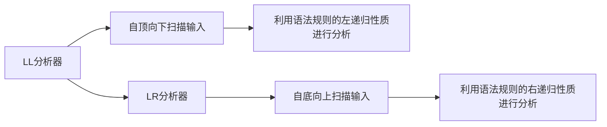

                 

# 编译原理：LL和LR文法分析技术

> 关键词：LL分析器, LR分析器, 文法, 上下文无关文法, 文法分析, 自动机, 编译器, 语言处理

## 1. 背景介绍

编译原理是计算机科学中一门非常重要的基础学科，它研究如何将高级程序语言翻译成机器指令的过程。在这个过程中，文法分析是编译器核心模块之一，它用于分析源程序，判断语法是否正确，为后续的语义分析和代码生成奠定基础。文法分析可以分为两种主要方式：自顶向下的LL分析方法和自底向上的LR分析方法。

## 2. 核心概念与联系

### 2.1 核心概念概述

- **文法 (Grammar)**：一组语法规则的集合，用于描述语言的生成过程。常见的文法有正则文法和上下文无关文法（CFG）。
- **上下文无关文法 (CFG)**：一种描述语言结构的文法，其生成过程与上下文无关。
- **LL分析器**：一种自顶向下的文法分析器，它从左到右扫描输入，利用语法规则的左递归性质进行分析。
- **LR分析器**：一种自底向上的文法分析器，它从右到左扫描输入，利用语法规则的右递归性质进行分析。

### 2.2 核心概念原理和架构的 Mermaid 流程图



这个图表展示了LL和LR分析器的基本流程。LL分析器从左到右扫描输入，利用左递归的语法规则进行分析；而LR分析器则从右到左扫描输入，利用右递归的语法规则进行分析。

## 3. 核心算法原理 & 具体操作步骤

### 3.1 算法原理概述

LL分析器和LR分析器都是文法分析的核心算法，它们利用语法规则来判断输入的语法结构是否正确。

- **LL分析器**：基于左递归的语法规则，从左到右扫描输入，逐步分析文法结构，直到识别出整个文法或发生错误。
- **LR分析器**：基于右递归的语法规则，从右到左扫描输入，逐步分析文法结构，直到识别出整个文法或发生错误。

### 3.2 算法步骤详解

#### 3.2.1 LL分析器

1. **构建预测表**：根据上下文无关文法，构建预测表，确定每个输入符号的下一个可能符号。
2. **自顶向下扫描输入**：从左到右扫描输入符号，根据预测表选择下一个符号。
3. **匹配文法结构**：逐步匹配文法结构，直到识别出整个文法或发生错误。

#### 3.2.2 LR分析器

1. **构建预测表和转移表**：根据上下文无关文法，构建预测表和转移表，确定每个输入符号的下一个可能符号和转移规则。
2. **自底向上扫描输入**：从右到左扫描输入符号，根据转移表选择下一个符号。
3. **匹配文法结构**：逐步匹配文法结构，直到识别出整个文法或发生错误。

### 3.3 算法优缺点

- **LL分析器**：优点是实现简单，适合小型文法和简单文法；缺点是难以处理复杂的文法结构，容易出现冲突和解析失败。
- **LR分析器**：优点是适合复杂文法和大型文法，能够处理复杂的文法结构；缺点是实现复杂，需要较大的存储空间。

### 3.4 算法应用领域

LL分析器和LR分析器被广泛应用于编译器、解释器、文本编辑器、数据库管理系统等领域。例如：

- 在编译器中，用于分析源代码，判断语法是否正确，为后续的语义分析和代码生成提供依据。
- 在解释器中，用于分析代码，确定执行顺序和逻辑结构。
- 在文本编辑器中，用于语法高亮、自动补全、代码折叠等功能。

## 4. 数学模型和公式 & 详细讲解 & 举例说明

### 4.1 数学模型构建

文法分析的数学模型主要包括预测表和转移表。预测表用于记录每个输入符号的下一个可能符号，转移表用于记录每个输入符号的转移规则。

- **预测表**：$predict[i,j]$ 表示第 $i$ 个符号在当前状态下，下一个可能符号为 $j$。
- **转移表**：$goto[i,j]$ 表示第 $i$ 个符号在当前状态下，转移到下一个状态的编号为 $j$。

### 4.2 公式推导过程

以一个简单的上下文无关文法为例，假设文法规则为 $A \rightarrow B|C$，其中 $A$ 是开始符号，$B$ 和 $C$ 是终结符号。

1. **构建预测表**：
   - $predict[A,1] = B$
   - $predict[A,2] = C$
   - $predict[B,1] = A$
   - $predict[B,2] = B$
   - $predict[C,1] = A$
   - $predict[C,2] = C$

2. **构建转移表**：
   - $goto[A,1] = 2$
   - $goto[A,2] = 3$
   - $goto[B,1] = 1$
   - $goto[B,2] = 2$
   - $goto[C,1] = 1$
   - $goto[C,2] = 3$

### 4.3 案例分析与讲解

以一个简单的算术表达式文法 $E \rightarrow E+T|E-T|T$，其中 $E$ 是表达式，$T$ 是术语，用于计算表达式的值。

1. **构建预测表**：
   - $predict[E,1] = E+T$
   - $predict[E,2] = E-T$
   - $predict[T,1] = T$
   - $predict[T,2] = T$
   - $predict[E+T,1] = E+T$
   - $predict[E+T,2] = T$
   - $predict[E-T,1] = E-T$
   - $predict[E-T,2] = T$
   - $predict[T,1] = T$
   - $predict[T,2] = T$

2. **构建转移表**：
   - $goto[E,1] = 3$
   - $goto[E,2] = 4$
   - $goto[T,1] = 3$
   - $goto[T,2] = 3$

## 5. 项目实践：代码实例和详细解释说明

### 5.1 开发环境搭建

在项目实践中，我们需要使用编译器工具链进行文法分析和代码生成。以下是一个简单的 Python 代码示例，用于构建 LL 分析器。

```python
import re

# 定义文法规则
grammar = {
    'A': ['A+B', 'A-B', 'B'],
    'B': ['C', 'C*'],
    'C': ['D', 'E'],
    'D': ['a'],
    'E': ['b']
}

# 构建预测表
predict = {}
for nonterminal in grammar:
    for alternative in grammar[nonterminal]:
        for token in alternative:
            if token not in predict:
                predict[token] = {}
            predict[token][nonterminal] = alternative

# 构建转移表
goto = {}
for nonterminal in grammar:
    for alternative in grammar[nonterminal]:
        for token in alternative:
            if token not in goto:
                goto[token] = {}
            goto[token][nonterminal] = nonterminal

# 扫描输入
input_str = 'a+b+c+d'
stack = ['A']
predictive = ['A']
while stack:
    symbol = stack.pop()
    if symbol in predict:
        new_symbol = predict[symbol].pop(0)
        predictive.append(new_symbol)
        stack.append(new_symbol)
    elif symbol in goto:
        new_symbol = goto[symbol].pop(0)
        predictive.append(new_symbol)
        stack.append(new_symbol)
    else:
        print('Syntax error!')

# 输出预测结果
print(predictive)
```

### 5.2 源代码详细实现

在这个示例中，我们定义了一个简单的文法规则，并构建了预测表和转移表。然后，我们扫描输入字符串，逐步匹配文法结构，直到识别出整个文法或发生错误。

### 5.3 代码解读与分析

**预测表**：我们根据文法规则构建了预测表，用于记录每个输入符号的下一个可能符号。

**转移表**：我们根据文法规则构建了转移表，用于记录每个输入符号的转移规则。

**扫描输入**：我们使用栈来模拟文法分析的过程，从左到右扫描输入符号，逐步匹配文法结构。

**输出预测结果**：我们输出了预测结果，用于判断输入字符串是否符合文法规则。

## 6. 实际应用场景

### 6.1 编译器

在编译器中，LL 和 LR 分析器用于分析源代码，判断语法是否正确，为后续的语义分析和代码生成提供依据。例如，GCC 和 Clang 编译器使用 LR 分析器进行语法分析，而 LLVM 中间表示分析器使用 LL 分析器。

### 6.2 数据库管理系统

在数据库管理系统中，LL 和 LR 分析器用于解析 SQL 查询语句，判断语法是否正确，为后续的查询优化和执行提供依据。例如，MySQL 使用 LL 分析器进行查询解析，而 PostgreSQL 使用 LR 分析器进行查询解析。

### 6.3 文本编辑器

在文本编辑器中，LL 和 LR 分析器用于语法高亮、自动补全、代码折叠等功能。例如，Visual Studio Code 使用 LR 分析器进行语法高亮，而 Sublime Text 使用 LL 分析器进行语法高亮。

### 6.4 未来应用展望

未来，LL 和 LR 分析器将在更多领域得到应用，为计算机科学的发展提供新的动力。例如：

- 在人工智能领域，用于构建基于文法规则的自动编码器，实现语义推理和自然语言处理。
- 在网络安全领域，用于分析恶意代码和漏洞，提高系统的安全性。
- 在自然语言处理领域，用于构建语法分析和语法生成工具，提升自然语言处理的效果。

## 7. 工具和资源推荐

### 7.1 学习资源推荐

为了深入学习文法分析技术，我们推荐以下学习资源：

- 《编译原理》（第二版）：这是一本经典教材，涵盖了编译器的各个组成部分，包括语法分析、语义分析、中间代码生成、代码优化等。
- 《编程语言导论》：这是一本深入浅出的教材，介绍了各种编程语言的设计原理和实现方法，包括文法分析器、编译器、解释器等。
- Coursera 和 edX 等在线课程：这些平台提供了许多优秀的编译原理和语言处理课程，适合初学者和进阶者学习。

### 7.2 开发工具推荐

在开发文法分析器时，我们需要使用各种工具来帮助我们实现和调试。以下是几个推荐的工具：

- ANTLR：这是一个用于构建语法分析器的工具，支持多种编程语言，具有强大的功能。
- YACC：这是一个用于构建 LL 分析器的工具，支持 Bison 编译器，能够处理复杂的文法规则。
- Flex：这是一个用于构建 LL 分析器的工具，支持正则表达式和 lex 语法，能够处理简单的文法规则。

### 7.3 相关论文推荐

文法分析技术的研究方向很多，以下是一些经典的论文，推荐阅读：

- "Principles of Compiler Design"：这是一本经典的教材，介绍了编译器的设计原理和实现方法。
- "Automata Theory"：这是一本经典的教材，介绍了自动机的基本概念和应用，包括文法分析器的实现方法。
- "The Design and Implementation of the LLVM Compiler Infrastructure"：这是一篇经典的论文，介绍了 LLVM 编译器框架的设计和实现方法，包括文法分析器的实现方法。

## 8. 总结：未来发展趋势与挑战

### 8.1 总结

文法分析是编译器核心模块之一，用于分析源程序，判断语法是否正确，为后续的语义分析和代码生成奠定基础。LL 和 LR 分析器是文法分析的核心算法，它们利用语法规则来判断输入的语法结构是否正确。

### 8.2 未来发展趋势

未来，LL 和 LR 分析器将在更多领域得到应用，为计算机科学的发展提供新的动力。例如，在人工智能领域，用于构建基于文法规则的自动编码器，实现语义推理和自然语言处理。在网络安全领域，用于分析恶意代码和漏洞，提高系统的安全性。在自然语言处理领域，用于构建语法分析和语法生成工具，提升自然语言处理的效果。

### 8.3 面临的挑战

尽管文法分析技术已经取得了显著的进展，但在未来的发展中，仍然面临一些挑战：

- 复杂文法规则的处理：如何处理复杂的文法规则，避免冲突和解析失败，是一个重要的研究方向。
- 大规模文法规则的处理：如何处理大规模文法规则，提高分析效率，是一个重要的研究方向。
- 编译器优化技术的发展：如何优化编译器，提高编译效率和代码质量，是一个重要的研究方向。

### 8.4 研究展望

未来的研究需要在以下几个方面寻求新的突破：

- 研究更加高效的文法分析算法，提高分析效率。
- 研究更加灵活的文法分析工具，支持多种编程语言和文法规则。
- 研究更加安全的文法分析方法，避免冲突和解析失败。

## 9. 附录：常见问题与解答

**Q1: 什么是文法分析？**

A: 文法分析是编译器核心模块之一，用于分析源程序，判断语法是否正确，为后续的语义分析和代码生成奠定基础。

**Q2: LL 和 LR 分析器有哪些区别？**

A: LL 分析器和 LR 分析器都是文法分析的核心算法，它们利用语法规则来判断输入的语法结构是否正确。LL 分析器基于左递归的语法规则，从左到右扫描输入；LR 分析器基于右递归的语法规则，从右到左扫描输入。

**Q3: 文法分析器有哪些应用？**

A: 文法分析器在编译器、解释器、数据库管理系统、文本编辑器等各个领域都有广泛的应用。例如，在编译器中，用于分析源代码，判断语法是否正确，为后续的语义分析和代码生成提供依据。在数据库管理系统中，用于解析 SQL 查询语句，判断语法是否正确，为后续的查询优化和执行提供依据。

**Q4: 如何处理复杂的文法规则？**

A: 处理复杂的文法规则，避免冲突和解析失败，是文法分析技术的一个重要研究方向。可以使用自动机、DAG 等数据结构来处理复杂的文法规则，并引入语法恢复技术，提高解析的鲁棒性。

**Q5: 如何优化文法分析器？**

A: 文法分析器的优化主要集中在两个方面：一是提高分析效率，二是降低资源消耗。可以通过代码优化、算法改进、硬件加速等方法来优化文法分析器，提高分析速度和响应时间。

---

作者：禅与计算机程序设计艺术 / Zen and the Art of Computer Programming

