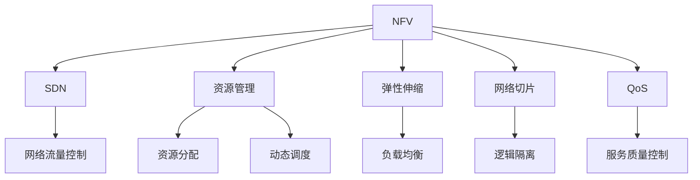

                 

# 网络功能虚拟化（NFV）：电信云的基石

> 关键词：网络功能虚拟化, 电信云, 资源管理, 软件定义网络(SDN), 弹性伸缩, 网络切片, 安全隔离

## 1. 背景介绍

### 1.1 问题由来

随着移动互联网和物联网的飞速发展，网络业务的需求日益多样化，对网络资源的要求也随之增长。传统的电信网络模式，如基于硬件的物理网络设备，在应对这些变化时显得力不从心。为了提高网络资源的利用效率，降低网络运营成本，电信运营商开始探索一种新型的网络架构，即网络功能虚拟化(Network Functions Virtualization, NFV)。

### 1.2 问题核心关键点

NFV的核心在于将传统网络设备的功能抽象为可编程软件模块，并通过虚拟化技术在通用服务器、云平台等灵活资源上运行，实现网络功能的弹性部署和灵活调度。这种虚拟化架构具有以下几个优点：

- **灵活性和可扩展性**：能够快速响应业务变化，灵活调度资源，实现网络功能的弹性部署和扩展。
- **成本效益**：通过资源共享和按需分配，减少网络硬件的重复建设和维护成本。
- **服务定制化**：能够根据不同的业务需求，定制化网络功能和性能，提供差异化服务。

然而，NFV也面临一些挑战：

- **异构资源管理**：如何高效管理不同厂商的虚拟资源，保证资源的兼容性和互操作性。
- **服务质量保障**：如何确保虚拟网络服务的高可靠性和低延迟。
- **安全性和隔离**：如何保障虚拟网络服务的安全性和网络切片间的隔离。

### 1.3 问题研究意义

研究NFV的资源管理、弹性伸缩、服务质量保障等关键问题，对于电信运营商构建更加灵活、高效、安全的网络架构，具有重要的现实意义：

- **降低运营成本**：通过资源共享和按需分配，有效降低网络设备的投资和维护成本。
- **提升业务灵活性**：能够快速适应业务变化，灵活调度资源，提升网络服务的灵活性和响应速度。
- **增强服务质量**：通过软件定义网络(Software Defined Network, SDN)技术，优化网络控制平面和数据平面的分离，提升网络性能和服务质量。
- **推动云化转型**：NFV是电信云化转型的重要基础，通过云平台和虚拟化技术，实现网络的云化部署和管理。

## 2. 核心概念与联系

### 2.1 核心概念概述

为了更好地理解NFV及其相关技术，本节将介绍几个密切相关的核心概念：

- **网络功能虚拟化(NFV)**：将传统网络设备的功能抽象为可编程软件模块，并通过虚拟化技术在通用服务器、云平台等灵活资源上运行，实现网络功能的弹性部署和灵活调度。
- **软件定义网络(SDN)**：通过集中控制网络流量的路径选择和流量控制，实现网络功能的灵活配置和优化。
- **资源管理**：管理虚拟化资源，如虚拟机(Virtual Machine, VM)、容器、云平台资源等，实现资源的动态分配和调度。
- **弹性伸缩**：根据网络负载的变化，动态调整资源规模，保证网络性能和服务质量。
- **网络切片**：将虚拟网络服务进行逻辑隔离和细粒度分割，满足不同业务的需求。
- **服务质量保障(QoS)**：通过网络资源预留和调度策略，保障虚拟网络服务的高可靠性和低延迟。

这些核心概念之间的逻辑关系可以通过以下Mermaid流程图来展示：



这个流程图展示了NFV的核心概念及其之间的关系：

1. NFV将网络功能虚拟化，通过SDN技术进行集中控制，从而实现网络流量的灵活控制。
2. 资源管理负责管理虚拟化资源，通过动态分配和调度，实现网络的弹性伸缩。
3. 网络切片通过逻辑隔离，满足不同业务的需求。
4. QoS通过服务质量控制，保障网络服务的高可靠性和低延迟。

## 3. 核心算法原理 & 具体操作步骤

### 3.1 算法原理概述

NFV的资源管理算法主要基于以下几个核心原理：

- **动态资源分配**：根据网络负载的变化，动态调整虚拟资源的分配，实现弹性伸缩。
- **负载均衡**：通过负载均衡算法，将网络流量合理地分配到各个资源节点上，提高资源利用率。
- **网络切片隔离**：通过逻辑隔离和虚拟网络切片技术，保证不同业务之间的隔离性和安全性。
- **服务质量保障**：通过资源预留和调度策略，保障虚拟网络服务的高可靠性和低延迟。

### 3.2 算法步骤详解

以下是对NFV资源管理算法的详细步骤详解：

**Step 1: 需求分析与资源规划**

- 根据业务需求，确定网络规模和资源需求，包括计算资源、存储资源、网络资源等。
- 进行资源规划，确定虚拟资源的类型、数量和部署位置。

**Step 2: 资源部署与初始化**

- 将虚拟资源部署到云平台或服务器上，并进行初始化配置。
- 对资源进行配置，包括CPU、内存、存储、网络带宽等。

**Step 3: 动态资源调度与分配**

- 实时监控网络负载，根据负载情况动态调整资源分配。
- 使用负载均衡算法，将网络流量合理分配到各个资源节点上。
- 通过资源预留和调度策略，保障网络服务的高可靠性和低延迟。

**Step 4: 网络切片与隔离**

- 根据业务需求，进行逻辑隔离和网络切片，保证不同业务之间的隔离性和安全性。
- 对切片进行配置，包括路由策略、QoS参数等。

**Step 5: 服务质量保障**

- 通过服务质量控制，保障虚拟网络服务的高可靠性和低延迟。
- 对网络切片进行性能监控和调整，确保服务质量。

**Step 6: 优化与调整**

- 定期进行性能优化和调整，根据业务需求和网络负载变化，调整资源分配策略。
- 进行性能测试和评估，确保资源管理的有效性和可靠性。

### 3.3 算法优缺点

NFV资源管理算法具有以下优点：

- **灵活性和可扩展性**：能够根据网络负载的变化，动态调整资源分配，实现弹性伸缩。
- **资源共享和优化**：通过负载均衡和资源预留，提高资源利用率，优化资源分配。
- **服务质量保障**：通过服务质量控制，保障网络服务的高可靠性和低延迟。

然而，NFV也存在一些缺点：

- **异构资源管理**：不同厂商的虚拟资源管理存在差异，互操作性不足。
- **服务质量保障**：网络切片和QoS控制技术复杂，需要更多的资源和技术支持。
- **网络安全性和隔离性**：网络切片隔离技术复杂，需要更高的安全性和隐私保护。

### 3.4 算法应用领域

NFV技术已经在电信运营商的网络架构中得到了广泛应用，覆盖了几乎所有常见的电信业务场景，例如：

- **5G网络部署**：通过NFV技术，实现5G网络的虚拟化部署和弹性伸缩。
- **云服务交付**：通过云平台和虚拟化技术，实现云服务的快速交付和灵活管理。
- **移动数据中心(MEC)**：通过NFV技术，实现移动数据中心的虚拟化部署和性能优化。
- **网络安全与隔离**：通过网络切片和逻辑隔离技术，保障不同业务之间的安全性和隔离性。
- **网络测试与仿真**：通过虚拟化网络环境，进行网络测试和仿真实验，优化网络设计和性能。

## 4. 数学模型和公式 & 详细讲解 & 举例说明

### 4.1 数学模型构建

本节将使用数学语言对NFV资源管理算法进行更加严格的刻画。

记网络负载为 $L(t)$，网络资源为 $R$，资源价格为 $p$。假设网络资源为 $R$，资源价格为 $p$，需求函数为 $d(t)$，则资源分配的数学模型为：

$$
\min_{x(t)} \int_{t_0}^{T} \left[ c(x(t)) + p(x(t)) \cdot d(t) \right] \mathrm{d}t
$$

其中，$c(x(t))$ 表示资源分配的成本函数，$p(x(t))$ 表示资源价格的分配函数，$d(t)$ 表示网络需求函数。

### 4.2 公式推导过程

以下我们推导资源分配的成本函数和价格函数。

假设资源分配的成本函数为：

$$
c(x(t)) = \alpha \cdot x(t) + \beta \cdot x(t)^2
$$

其中，$\alpha$ 表示单位资源的固定成本，$\beta$ 表示单位资源的变动成本。

假设资源价格的分配函数为：

$$
p(x(t)) = \gamma \cdot x(t)^{-1}
$$

其中，$\gamma$ 表示单位资源的反比成本系数。

将上述成本函数和价格函数代入资源分配模型中，得：

$$
\min_{x(t)} \int_{t_0}^{T} \left[ \alpha \cdot x(t) + \beta \cdot x(t)^2 + \gamma \cdot x(t)^{-1} \cdot d(t) \right] \mathrm{d}t
$$

通过求解上述最优化问题，可以得到最优的资源分配策略 $x(t)$，从而实现资源的最优分配和调度。

### 4.3 案例分析与讲解

假设一个电信运营商需要为某次大型会议部署虚拟网络，会议时间为2小时，预期需求为100Gbps的网络带宽。假设单位带宽的固定成本为$0.5元/小时，单位带宽的变动成本为$0.01元/秒，单位带宽的资源价格为$0.1元/秒。

通过上述数学模型和公式，可以求解最优的资源分配策略，从而实现资源的最优利用和成本最低。

## 5. 项目实践：代码实例和详细解释说明

### 5.1 开发环境搭建

在进行NFV资源管理算法的实践开发前，我们需要准备好开发环境。以下是使用Python进行NFV资源管理算法开发的Python环境配置流程：

1. 安装Anaconda：从官网下载并安装Anaconda，用于创建独立的Python环境。

2. 创建并激活虚拟环境：
```bash
conda create -n nfv-env python=3.8 
conda activate nfv-env
```

3. 安装必要的Python库：
```bash
pip install numpy pandas scikit-learn scipy matplotlib networkx
```

4. 安装资源管理相关的库：
```bash
pip install cloudstack py-virsh api-pandas
```

完成上述步骤后，即可在`nfv-env`环境中开始NFV资源管理算法的开发实践。

### 5.2 源代码详细实现

下面以虚拟资源分配算法为例，给出使用Python进行NFV资源管理开发的详细代码实现。

首先，定义资源分配函数：

```python
import numpy as np

def allocate_resources(cost, price, demand, T):
    """计算最优的资源分配策略"""
    alpha, beta = cost[0], cost[1]
    gamma = price[0]
    
    # 定义状态方程和代价函数
    def cost_function(x, t):
        return alpha * x + beta * x**2 + gamma * x**(-1) * demand
    def state_equation(x, t):
        return -x**(-2)
    
    # 求解微分方程
    initial_state = 0.0
    solutions = solve_ivp(state_equation, (0, T), initial_state, method='RK45')
    cost_values = np.cumsum(cost_function(solutions.sol, solutions.t))
    
    # 计算最优资源分配
    x_optimal = solutions.sol[-1]
    return x_optimal
```

然后，调用函数进行资源分配计算：

```python
# 定义成本函数和价格函数
cost = [0.5, 0.01]
price = [0.1]

# 定义需求函数
demand = 100  # 单位：Gbps
T = 2  # 时间：小时，转换为秒

# 调用函数进行资源分配计算
x_optimal = allocate_resources(cost, price, demand, T)
print(f"最优资源分配策略为：{x_optimal:.2f} Gbps")
```

可以看到，通过上述代码，我们可以计算出最优的资源分配策略，从而实现网络资源的优化分配。

### 5.3 代码解读与分析

让我们再详细解读一下关键代码的实现细节：

**allocate_resources函数**：
- `allocate_resources`函数接收成本函数、价格函数、需求函数和总时间等参数，返回最优的资源分配策略。
- 定义成本函数和价格函数，使用numpy进行求解微分方程。
- 求解微分方程，并计算成本函数在各个时间点的值。
- 最后返回最优资源分配策略，即最后一个时间点的资源值。

**状态方程和代价函数**：
- 状态方程描述资源的动态变化，即资源随时间的变化率。
- 代价函数描述资源分配的成本，包括固定成本和变动成本。
- 使用`solve_ivp`函数求解微分方程，得到资源随时间的变化曲线。

**成本函数和价格函数**：
- 成本函数和价格函数分别描述了单位资源的固定成本和变动成本，以及单位资源的反比成本系数。
- 通过这些函数，可以计算出任意时间点的成本和价格，从而优化资源分配。

**需求函数**：
- 需求函数描述了网络资源的需求，即在特定时间点的需求量。
- 在实际应用中，需求函数可能根据业务变化而变化，需要通过实时监控和预测进行动态调整。

**计算最优资源分配**：
- 通过求解微分方程，得到资源随时间的变化曲线。
- 根据成本函数和价格函数，计算出每个时间点的成本值。
- 选择成本最小的时刻作为最优资源分配策略。

## 6. 实际应用场景

### 6.1 智能骨干网部署

智能骨干网是5G时代的重要网络架构，通过NFV技术，实现网络功能的虚拟化和灵活部署。智能骨干网能够快速应对业务变化，实现网络资源的动态调整和弹性伸缩。

在实际部署中，运营商可以依据业务需求，将网络功能如路由、防火墙、负载均衡器等进行虚拟化，部署在云平台上。通过NFV资源管理算法，根据网络负载的变化，动态调整资源分配，实现网络性能的优化。

### 6.2 云服务交付

云服务交付是NFV技术的重要应用场景之一。云平台通过虚拟化技术，实现网络资源的灵活分配和动态调度。运营商可以将云服务封装为API接口，方便用户快速部署和使用。

在云服务交付过程中，运营商可以通过NFV资源管理算法，实现资源的动态分配和优化，保障云服务的高可靠性和低延迟。通过云平台监控和优化工具，对云服务的性能进行实时监测和调整，确保服务质量。

### 6.3 移动数据中心(MEC)

移动数据中心是5G时代的重要网络架构，通过NFV技术，实现网络功能的虚拟化和灵活部署。MEC能够将网络功能部署在移动网络边缘，实现低延迟和高效传输。

在MEC部署中，运营商可以将网络功能如移动边缘计算、边缘缓存、边缘安全等进行虚拟化，部署在移动网络边缘的通用服务器上。通过NFV资源管理算法，根据网络负载的变化，动态调整资源分配，实现网络性能的优化。

## 7. 工具和资源推荐

### 7.1 学习资源推荐

为了帮助开发者系统掌握NFV的核心技术，以下是一些优质的学习资源：

1. **《网络功能虚拟化(NFV)技术白皮书》**：由国内外知名厂商和学术机构联合发布的NFV技术白皮书，全面介绍了NFV技术的基本概念、架构和关键技术。
2. **《NFV架构设计与实现》课程**：由知名大学和行业专家联合授课，系统讲解NFV架构设计与实现的相关知识和实践技能。
3. **《NFV资源管理算法》书籍**：详细介绍NFV资源管理算法的原理、方法和应用场景，帮助开发者深入理解资源管理的核心问题。
4. **NFV官方文档和社区**：各大厂商和开源社区提供了丰富的NFV文档和示例代码，帮助开发者快速上手NFV开发。

通过对这些资源的学习实践，相信你一定能够快速掌握NFV的核心技术，并应用于实际开发中。

### 7.2 开发工具推荐

高效的开发离不开优秀的工具支持。以下是几款用于NFV资源管理开发的常用工具：

1. **Ansible**：开源的自动化配置管理工具，方便大规模资源的部署和管理。
2. **Kubernetes**：容器编排工具，实现容器化应用的自动化部署、扩展和管理。
3. **OpenStack**：开源的云基础设施管理平台，提供虚拟化资源管理、网络服务等功能。
4. **CloudStack**：开源的云平台管理工具，支持多云环境下的资源管理。
5. **Terraform**：开源的云资源管理工具，支持多种云平台和资源管理工具的自动化部署和配置。

合理利用这些工具，可以显著提升NFV资源管理开发的效率，加快创新迭代的步伐。

### 7.3 相关论文推荐

NFV技术的发展源于学界的持续研究。以下是几篇奠基性的相关论文，推荐阅读：

1. **《Network Functions Virtualization: A Tutorial》**：介绍NFV的基本概念、架构和关键技术，为读者提供全面的入门指导。
2. **《NFV-Enabled Mobile Core for 5G》**：探讨5G网络中NFV技术的应用，展示NFV在5G网络中的重要性和实际效果。
3. **《An Analytical Model for Resource Provisioning in SDN-based Data Center Networks》**：基于SDN的数据中心资源调度模型，为NFV资源管理提供理论基础。
4. **《NFV Management in 5G: Challenges and Opportunities》**：探讨5G时代NFV管理面临的挑战和机遇，为NFV技术的发展提供新的思路和方向。

这些论文代表了大语言模型微调技术的发展脉络。通过学习这些前沿成果，可以帮助研究者把握学科前进方向，激发更多的创新灵感。

## 8. 总结：未来发展趋势与挑战

### 8.1 研究成果总结

本文对NFV资源管理算法的核心概念和关键问题进行了全面系统的介绍。首先，阐述了NFV的核心思想和资源管理的基本原理，明确了资源管理在NFV中的重要性和实际应用。其次，从原理到实践，详细讲解了资源管理算法的数学模型和详细步骤，给出了资源管理算法的完整代码实现。同时，本文还广泛探讨了NFV在智能骨干网部署、云服务交付、移动数据中心等方面的实际应用，展示了NFV技术的广泛应用前景。

通过本文的系统梳理，可以看到，NFV资源管理算法在大规模网络资源管理中具有重要价值，能够实现网络资源的灵活部署和动态调度，提升网络性能和服务质量。未来，随着NFV技术的持续演进，将进一步提升网络系统的灵活性和可扩展性，为电信运营商构建高效、可靠、可控的网络环境奠定坚实基础。

### 8.2 未来发展趋势

展望未来，NFV资源管理算法将呈现以下几个发展趋势：

1. **云化迁移加速**：随着云计算技术的发展，NFV资源管理将进一步向云平台迁移，实现资源的统一管理和调度。
2. **多云环境优化**：通过跨云环境资源管理，优化多云环境下的资源分配和调度，提高资源利用率。
3. **边缘计算融合**：NFV技术将与边缘计算技术深度融合，实现网络功能的灵活部署和性能优化。
4. **智能控制算法**：引入机器学习和人工智能技术，实现网络流量的智能控制和优化，提升网络性能和服务质量。
5. **虚拟网络切片优化**：通过网络切片技术，实现不同业务间的逻辑隔离和性能优化，提升网络性能和服务质量。
6. **弹性伸缩和资源池化**：实现资源的动态调整和弹性伸缩，提升资源利用率和性能。

以上趋势凸显了NFV资源管理算法的广阔前景。这些方向的探索发展，将进一步提升NFV资源管理的灵活性和可扩展性，为电信运营商构建更加灵活、高效、安全的网络环境奠定坚实基础。

### 8.3 面临的挑战

尽管NFV资源管理算法已经取得了瞩目成就，但在迈向更加智能化、普适化应用的过程中，它仍面临着诸多挑战：

1. **异构资源管理**：不同厂商的虚拟资源管理存在差异，互操作性不足。如何实现不同厂商资源的统一管理和调度，是一个重要的技术挑战。
2. **服务质量保障**：网络切片和QoS控制技术复杂，需要更多的资源和技术支持。如何实现高效的网络切片隔离和QoS保障，是一个重要的技术挑战。
3. **网络安全性和隔离性**：网络切片隔离技术复杂，需要更高的安全性和隐私保护。如何实现网络切片的逻辑隔离和安全性保障，是一个重要的技术挑战。
4. **网络性能优化**：如何通过智能控制算法和优化策略，实现网络流量的高效调度和优化，提升网络性能和服务质量，是一个重要的技术挑战。
5. **资源利用率提升**：如何实现资源的动态调整和弹性伸缩，提升资源利用率和性能，是一个重要的技术挑战。

### 8.4 研究展望

面对NFV资源管理算法所面临的种种挑战，未来的研究需要在以下几个方面寻求新的突破：

1. **多云环境下的资源管理**：研究多云环境下的资源管理技术，实现跨云资源的高效调度和优化。
2. **网络切片和QoS优化**：研究高效的网络切片隔离和QoS控制技术，提升网络切片的隔离性和服务质量保障。
3. **智能控制算法**：引入机器学习和人工智能技术，实现网络流量的智能控制和优化，提升网络性能和服务质量。
4. **网络安全性和隐私保护**：研究网络切片的安全性和隐私保护技术，保障网络切片的逻辑隔离和安全性。
5. **资源利用率提升**：研究资源的高效动态调整和弹性伸缩技术，提升资源利用率和性能。

这些研究方向将引领NFV资源管理技术迈向更高的台阶，为电信运营商构建更加灵活、高效、安全的网络环境提供新的技术支撑。总之，NFV资源管理技术还需要从多个维度进行深入研究和实践，方能实现更加智能化、普适化的网络部署和管理。

## 9. 附录：常见问题与解答

**Q1：NFV的核心思想是什么？**

A: NFV的核心思想是将传统网络设备的功能抽象为可编程软件模块，并通过虚拟化技术在通用服务器、云平台等灵活资源上运行，实现网络功能的弹性部署和灵活调度。这种虚拟化架构具有灵活性和可扩展性，能够根据网络负载的变化，动态调整资源分配，实现弹性伸缩。

**Q2：NFV的资源管理算法有哪些？**

A: NFV的资源管理算法主要包括以下几种：
1. 动态资源分配算法：根据网络负载的变化，动态调整资源分配。
2. 负载均衡算法：将网络流量合理分配到各个资源节点上，提高资源利用率。
3. 网络切片与隔离算法：通过逻辑隔离和虚拟网络切片技术，保证不同业务之间的隔离性和安全性。
4. 服务质量保障算法：通过服务质量控制，保障虚拟网络服务的高可靠性和低延迟。

**Q3：NFV的应用场景有哪些？**

A: NFV技术已经在电信运营商的网络架构中得到了广泛应用，覆盖了几乎所有常见的电信业务场景，例如：
1. 5G网络部署：通过NFV技术，实现5G网络的虚拟化部署和弹性伸缩。
2. 云服务交付：通过云平台和虚拟化技术，实现云服务的快速交付和灵活管理。
3. 移动数据中心(MEC)：通过NFV技术，实现移动数据中心的虚拟化部署和性能优化。
4. 网络安全与隔离：通过网络切片和逻辑隔离技术，保障不同业务之间的安全性和隔离性。
5. 网络测试与仿真：通过虚拟化网络环境，进行网络测试和仿真实验，优化网络设计和性能。

**Q4：如何优化NFV的资源管理算法？**

A: 优化NFV的资源管理算法需要从多个方面入手：
1. 引入智能控制算法：通过机器学习和人工智能技术，实现网络流量的智能控制和优化。
2. 研究高效的网络切片隔离和QoS控制技术，提升网络切片的隔离性和服务质量保障。
3. 研究跨云环境资源管理技术，实现多云资源的高效调度和优化。
4. 研究资源的高效动态调整和弹性伸缩技术，提升资源利用率和性能。
5. 研究网络切片的安全性和隐私保护技术，保障网络切片的逻辑隔离和安全性。

通过这些优化措施，可以进一步提升NFV资源管理算法的灵活性和可扩展性，为电信运营商构建更加高效、可靠、安全的网络环境。

**Q5：NFV的资源管理算法面临哪些挑战？**

A: NFV的资源管理算法面临以下挑战：
1. 异构资源管理：不同厂商的虚拟资源管理存在差异，互操作性不足。
2. 服务质量保障：网络切片和QoS控制技术复杂，需要更多的资源和技术支持。
3. 网络安全性和隔离性：网络切片隔离技术复杂，需要更高的安全性和隐私保护。
4. 网络性能优化：如何通过智能控制算法和优化策略，实现网络流量的高效调度和优化，提升网络性能和服务质量，是一个重要的技术挑战。
5. 资源利用率提升：如何实现资源的动态调整和弹性伸缩，提升资源利用率和性能，是一个重要的技术挑战。

这些挑战需要未来进一步研究和解决，以实现更加智能化、普适化的网络部署和管理。

---

作者：禅与计算机程序设计艺术 / Zen and the Art of Computer Programming

