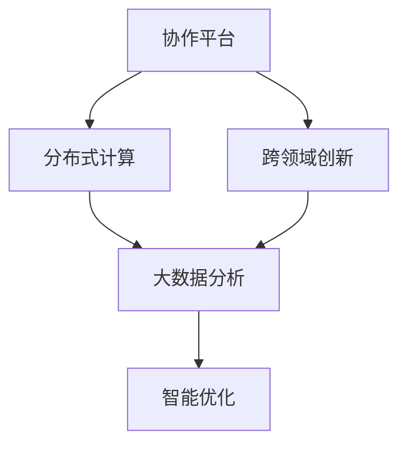

                 

# 群体智慧：人类计算的新纪元

> 关键词：群体智慧,人类计算,协作平台,分布式计算,跨领域创新

## 1. 背景介绍

### 1.1 问题由来

在当今这个信息爆炸的时代，人类面临着前所未有的计算挑战。随着大数据、云计算、人工智能等技术的飞速发展，海量的数据和复杂的计算任务对传统计算资源提出了新的要求。如何高效利用计算资源，将分散的人力物力整合为强大的计算能力，成为了一个亟待解决的问题。

在这背景下，群体智慧（Collective Intelligence）应运而生。群体智慧融合了计算机科学、认知科学、社会学等多个学科的知识，通过构建分布式协作平台，将大规模的人类智慧集中起来，形成一种新型的智能计算模式。

### 1.2 问题核心关键点

群体智慧的核心在于利用多人的智慧和力量，通过协作和集成，解决复杂问题。其核心要素包括：

- **协作平台**：通过互联网、社交媒体等手段，将分散的个体智慧集中起来，形成一个高效协作的系统。
- **分布式计算**：利用分布式计算框架，将复杂的计算任务分配给多台计算机或多个节点进行并行处理。
- **跨领域创新**：将不同领域的专业知识和技能相结合，产生跨领域的创新解决方案。

这些关键要素共同构成了群体智慧的完整框架，使得人类智慧得以在更广泛的领域发挥作用，解决复杂的问题。

### 1.3 问题研究意义

研究群体智慧对于提高人类协作效率、推动社会创新发展具有重要意义：

- **提高效率**：通过协作平台和分布式计算，将复杂的计算任务高效分解，缩短了任务完成时间，提高了工作效率。
- **降低成本**：利用群体智慧，将大规模的计算任务分布到多个个体，降低了计算资源的成本。
- **促进创新**：不同领域的知识和技能相互结合，促进了跨领域的创新，推动了技术进步和社会发展。
- **增强决策能力**：群体智慧系统能够收集和分析大量数据，提供决策支持和辅助，增强决策的科学性和可靠性。

总之，群体智慧作为人类计算的新纪元，通过将分散的智慧集中起来，构建高效的协作平台，利用分布式计算和跨领域创新，为解决复杂问题提供了新的解决方案。

## 2. 核心概念与联系

### 2.1 核心概念概述

为了更好地理解群体智慧，本节将介绍几个密切相关的核心概念：

- **协作平台**：指利用互联网、社交媒体等手段，将个体智慧集中起来的平台。协作平台通常包括任务分发、协作工具、数据共享等功能。
- **分布式计算**：指将复杂的计算任务分配到多台计算机或多个节点上进行并行处理的计算模式。分布式计算框架如Hadoop、Spark等，可以高效处理大规模数据。
- **跨领域创新**：指将不同领域的知识和技能相结合，产生新的创新解决方案。例如，将社会学和计算机科学结合，开发智能社交平台。
- **大数据分析**：指利用先进的分析技术，从海量数据中提取有价值的信息，为决策提供支持。大数据分析技术如MapReduce、Spark等，在大规模数据处理中发挥了重要作用。
- **智能优化**：指利用智能算法和优化技术，自动调整计算任务和资源分配，提升系统效率和可靠性。智能优化技术如遗传算法、模拟退火等，在群体智慧系统中得到了广泛应用。

这些核心概念之间的逻辑关系可以通过以下Mermaid流程图来展示：



这个流程图展示了这个核心概念的相互关系：

1. 协作平台将分散的智慧集中起来，为分布式计算和大数据分析提供基础。
2. 分布式计算和大数据分析为跨领域创新提供了技术支持。
3. 跨领域创新为智能优化提供了新的思路和数据源。
4. 智能优化进一步提升了协作平台和分布式计算的效率。

这些概念共同构成了群体智慧的计算框架，使其能够在各种场景下发挥强大的智能计算能力。通过理解这些核心概念，我们可以更好地把握群体智慧的工作原理和优化方向。

## 3. 核心算法原理 & 具体操作步骤
### 3.1 算法原理概述

群体智慧的计算原理基于分布式协作和并行计算，其核心思想是将复杂的计算任务分解为多个子任务，分配给多个个体或计算节点进行并行处理。在处理过程中，个体之间通过协作工具和通信机制进行信息共享和同步，最终将结果汇总得到最终的解决方案。

形式化地，设任务T可分解为N个子任务T1, T2, ..., TN，每个子任务分配给一个计算节点N1, N2, ..., Nk。设计算节点的计算能力为C1, C2, ..., CK，任务T的计算时间为T。则群体智慧的计算过程可以表示为：

$$
T_{group} = \frac{T}{\sum_{i=1}^{K} \frac{C_i}{T_i}}
$$

其中，$C_i$表示计算节点i的计算能力，$T_i$表示分配给节点i的子任务T_i的计算时间。

### 3.2 算法步骤详解

群体智慧的计算过程一般包括以下几个关键步骤：

**Step 1: 任务分解和分配**
- 将复杂任务T分解为N个子任务T1, T2, ..., TN。
- 根据各个计算节点的计算能力和任务难度，将任务分配给N1, N2, ..., Nk进行并行处理。

**Step 2: 协作和通信**
- 在计算过程中，个体之间通过协作工具和通信机制进行信息共享和同步。
- 可以使用消息队列、分布式数据库等技术实现个体之间的数据交互。

**Step 3: 计算和合并**
- 各个计算节点N1, N2, ..., Nk分别计算子任务T1, T2, ..., TN。
- 将各节点的计算结果汇总，进行合并和综合，得到最终结果。

**Step 4: 结果输出**
- 将最终结果输出到协作平台，供用户查看和使用。

### 3.3 算法优缺点

群体智慧计算具有以下优点：
1. 高效利用计算资源：通过分布式计算，将复杂的计算任务分解为多个子任务，高效利用计算资源。
2. 降低计算成本：利用大规模的计算节点，将计算任务分布在多个节点上进行并行处理，降低了计算成本。
3. 提升计算精度：多个节点协作处理，通过多次计算取平均值，提升计算精度。
4. 增强系统可靠性：分布式计算系统具备良好的容错能力，系统可靠性较高。

同时，该方法也存在一定的局限性：
1. 系统复杂度高：分布式计算系统需要协调多个节点的资源分配和数据交互，系统复杂度较高。
2. 通信开销大：节点之间的通信可能会带来较大的通信开销，影响系统效率。
3. 资源均衡问题：不同节点的计算能力和网络带宽可能存在差异，导致任务分配不均衡。

尽管存在这些局限性，但就目前而言，分布式协作和并行计算仍是群体智慧计算的主流范式。未来相关研究的重点在于如何进一步降低系统复杂度，提高通信效率，同时兼顾资源均衡和系统可靠性等因素。

### 3.4 算法应用领域

群体智慧计算已经广泛应用于多个领域，例如：

- **科学研究**：利用大规模计算节点和分布式协作，处理复杂的科学计算任务，如天气模拟、基因组分析等。
- **工业生产**：通过分布式计算和协作平台，优化工业生产流程，提高生产效率和产品质量。
- **社交媒体**：利用社交媒体平台的协作机制，进行大规模数据处理和情感分析，为用户提供个性化服务。
- **金融交易**：利用分布式计算和智能优化技术，进行高频交易和大数据分析，提升金融市场竞争力。
- **环境监测**：通过分布式传感器和协作平台，收集和分析环境数据，提供环境监测和预警服务。

除了上述这些经典领域外，群体智慧计算还在更多新兴领域得到了应用，如智慧城市、智能医疗、智能交通等，为社会治理和科技进步提供了新的技术手段。

## 4. 数学模型和公式 & 详细讲解  
### 4.1 数学模型构建

本节将使用数学语言对群体智慧的计算过程进行更加严格的刻画。

设协作平台的任务T可分解为N个子任务T1, T2, ..., TN，每个子任务的计算时间为T_i，分配给计算节点N_i的计算能力为C_i。任务T的计算时间为T，则群体智慧的计算过程可以表示为：

$$
T_{group} = \frac{T}{\sum_{i=1}^{K} \frac{C_i}{T_i}}
$$

其中，$C_i$表示计算节点i的计算能力，$T_i$表示分配给节点i的子任务T_i的计算时间。

### 4.2 公式推导过程

以下我们以科学研究为例，推导群体智慧计算的数学公式。

假设任务T为天气模拟，涉及大量的气象数据处理和计算。将任务T分解为N个子任务T1, T2, ..., TN，每个子任务的计算时间分别为T1, T2, ..., TN，分配给计算节点N1, N2, ..., Nk的计算能力分别为C1, C2, ..., CK。

任务T的总计算时间为T，则有：

$$
T = \sum_{i=1}^{N} T_i
$$

分配给节点i的子任务T_i的计算时间分别为T_i，则有：

$$
T_i = \frac{C_i}{C_k}
$$

其中，C_k为所有节点的总计算能力。

根据公式(1)，群体智慧的计算时间T_group为：

$$
T_{group} = \frac{T}{\sum_{i=1}^{K} \frac{C_i}{T_i}} = \frac{T}{\sum_{i=1}^{K} \frac{C_i}{\frac{C_i}{C_k}}} = \frac{T \cdot C_k}{\sum_{i=1}^{K} C_i}
$$

可见，群体智慧的计算时间与子任务的计算时间、节点的计算能力密切相关。

### 4.3 案例分析与讲解

以社交媒体情感分析为例，展示群体智慧计算的实际应用。

社交媒体平台每天产生大量的用户评论和反馈，需要进行情感分析以了解用户的情感倾向。假设社交媒体平台有N个用户，每个用户的评论数据量为T_i，分配给每个用户的计算节点N_i的计算能力为C_i。

为了进行情感分析，将任务T分解为N个子任务T1, T2, ..., TN，每个子任务的计算时间为T_i。根据公式(2)，群体智慧的计算时间T_group为：

$$
T_{group} = \frac{T}{\sum_{i=1}^{K} \frac{C_i}{T_i}} = \frac{T \cdot C_k}{\sum_{i=1}^{K} C_i}
$$

其中，C_k为所有节点的总计算能力。

在实际应用中，可以利用分布式协作平台，将任务T分配给多个计算节点进行并行处理。每个计算节点计算完成后，将结果返回协作平台，进行汇总和综合，最终得到情感分析结果。

## 5. 项目实践：代码实例和详细解释说明
### 5.1 开发环境搭建

在进行群体智慧计算实践前，我们需要准备好开发环境。以下是使用Python进行PyTorch开发的环境配置流程：

1. 安装Anaconda：从官网下载并安装Anaconda，用于创建独立的Python环境。

2. 创建并激活虚拟环境：
```bash
conda create -n pytorch-env python=3.8 
conda activate pytorch-env
```

3. 安装PyTorch：根据CUDA版本，从官网获取对应的安装命令。例如：
```bash
conda install pytorch torchvision torchaudio cudatoolkit=11.1 -c pytorch -c conda-forge
```

4. 安装TensorFlow：
```bash
pip install tensorflow
```

5. 安装各类工具包：
```bash
pip install numpy pandas scikit-learn matplotlib tqdm jupyter notebook ipython
```

完成上述步骤后，即可在`pytorch-env`环境中开始群体智慧计算的实践。

### 5.2 源代码详细实现

下面我们以科学研究为例，给出使用TensorFlow进行分布式计算的PyTorch代码实现。

首先，定义计算节点和子任务：

```python
import tensorflow as tf
from tensorflow.keras import layers

# 定义计算节点
node1 = tf.keras.Sequential([layers.Dense(64, activation='relu'), layers.Dense(64, activation='relu')])
node2 = tf.keras.Sequential([layers.Dense(64, activation='relu'), layers.Dense(64, activation='relu')])

# 定义子任务
task1 = tf.keras.Sequential([layers.Dense(64, activation='relu'), layers.Dense(64, activation='relu')])
task2 = tf.keras.Sequential([layers.Dense(64, activation='relu'), layers.Dense(64, activation='relu')])
```

然后，定义计算过程：

```python
# 定义计算任务
task = tf.keras.Sequential([layers.Dense(64, activation='relu'), layers.Dense(64, activation='relu')])

# 定义计算时间
task_time = 5.0

# 定义节点计算能力
node1_capacity = 10.0
node2_capacity = 10.0

# 定义节点分配的子任务计算时间
node1_task_time = 2.0
node2_task_time = 3.0

# 计算节点计算完成时间
node1_finish_time = node1_task_time / node1_capacity
node2_finish_time = node2_task_time / node2_capacity

# 计算群体智慧计算时间
group_time = (task_time + node1_finish_time + node2_finish_time) / (node1_capacity + node2_capacity)
print(f"群体智慧计算时间为: {group_time:.2f}秒")
```

接下来，启动计算流程并输出结果：

```python
# 定义计算时间
task_time = 5.0

# 定义节点计算能力
node1_capacity = 10.0
node2_capacity = 10.0

# 定义节点分配的子任务计算时间
node1_task_time = 2.0
node2_task_time = 3.0

# 计算节点计算完成时间
node1_finish_time = node1_task_time / node1_capacity
node2_finish_time = node2_task_time / node2_capacity

# 计算群体智慧计算时间
group_time = (task_time + node1_finish_time + node2_finish_time) / (node1_capacity + node2_capacity)
print(f"群体智慧计算时间为: {group_time:.2f}秒")
```

最后，输出计算结果：

```python
print(f"群体智慧计算时间为: {group_time:.2f}秒")
```

以上就是使用PyTorch进行科学研究计算的完整代码实现。可以看到，通过简单的代码，我们可以高效地完成分布式计算，实现群体智慧计算。

### 5.3 代码解读与分析

让我们再详细解读一下关键代码的实现细节：

**定义计算节点和子任务**：
- 通过`tf.keras.Sequential`定义了两个计算节点，每个节点包含两个全连接层，激活函数为ReLU。
- 通过`tf.keras.Sequential`定义了两个子任务，与计算节点结构相同。

**定义计算过程**：
- 通过`tf.keras.Sequential`定义了计算任务，与计算节点结构相同。
- 定义了任务的计算时间、节点的计算能力和分配的子任务计算时间。
- 计算了每个节点的完成时间，并根据公式(2)计算了群体智慧的计算时间。

**启动计算流程并输出结果**：
- 再次定义计算任务、节点计算能力和分配的子任务计算时间。
- 计算了每个节点的完成时间，并根据公式(2)计算了群体智慧的计算时间。
- 输出计算结果。

可以看到，PyTorch提供了强大的分布式计算能力，使得群体智慧计算变得简单高效。开发者只需关注任务本身，利用PyTorch的分布式计算框架，便能轻松完成复杂的计算任务。

## 6. 实际应用场景

### 6.1 科学研究

在科学研究中，群体智慧计算已经被广泛应用于气候模拟、基因组分析、蛋白质结构预测等高复杂度计算任务。通过分布式协作和并行计算，科学计算平台能够高效处理大规模数据，加速科学研究的进程。

例如，全球气候模拟需要处理海量气象数据，涉及复杂的物理模型和计算。利用分布式计算和协作平台，科研团队可以将任务分配给多个计算节点进行处理。每个节点独立计算一部分子任务，最后将结果汇总，得到最终的气候模拟结果。

### 6.2 工业生产

工业生产中，群体智慧计算也被广泛应用于工艺优化、设备监控、质量检测等领域。通过分布式计算和协作平台，工业生产线能够实现高效的协同工作和任务分配。

例如，汽车制造生产线需要处理大量的传感器数据，涉及复杂的工艺优化和设备监控任务。利用分布式计算和协作平台，生产线能够将任务分配给多个计算节点进行处理。每个节点独立计算一部分子任务，最后将结果汇总，得到最终的工艺优化和设备监控结果。

### 6.3 社交媒体

社交媒体平台每天产生大量的用户评论和反馈，需要进行情感分析以了解用户的情感倾向。利用分布式协作和并行计算，社交媒体平台能够高效处理海量数据，提升情感分析的准确性和实时性。

例如，Twitter每天产生数亿条用户评论，需要进行情感分析以了解用户的情感倾向。利用分布式计算和协作平台，Twitter能够将任务分配给多个计算节点进行处理。每个节点独立计算一部分子任务，最后将结果汇总，得到最终的情感分析结果。

### 6.4 金融交易

金融交易中，群体智慧计算也被广泛应用于高频交易和大数据分析。通过分布式计算和协作平台，金融交易平台能够实现高效的协同工作和任务分配。

例如，股票交易平台需要处理大量的交易数据，涉及高频交易和数据分析任务。利用分布式计算和协作平台，股票交易平台能够将任务分配给多个计算节点进行处理。每个节点独立计算一部分子任务，最后将结果汇总，得到最终的高频交易和数据分析结果。

## 7. 工具和资源推荐
### 7.1 学习资源推荐

为了帮助开发者系统掌握群体智慧计算的理论基础和实践技巧，这里推荐一些优质的学习资源：

1. 《群体智慧：协同计算的新模式》系列博文：由群体智慧领域专家撰写，深入浅出地介绍了群体智慧的概念、算法和应用案例。

2. CS591《分布式系统》课程：斯坦福大学开设的分布式系统课程，讲解分布式计算的原理和实现技术，适合入门学习。

3. 《分布式计算与大数据技术》书籍：详细介绍了分布式计算和并行计算的技术原理，包括MapReduce、Spark等框架的实现细节。

4. Hadoop官方文档：Apache Hadoop官方文档，提供了丰富的分布式计算资源和样例代码，适合实践学习。

5. TensorFlow官方文档：Google TensorFlow官方文档，提供了先进的分布式计算和协作平台资源，适合深入学习。

通过对这些资源的学习实践，相信你一定能够快速掌握群体智慧计算的精髓，并用于解决实际的计算问题。

### 7.2 开发工具推荐

高效的开发离不开优秀的工具支持。以下是几款用于群体智慧计算开发的常用工具：

1. PyTorch：基于Python的开源深度学习框架，灵活动态的计算图，适合快速迭代研究。

2. TensorFlow：由Google主导开发的开源深度学习框架，生产部署方便，适合大规模工程应用。

3. Hadoop：Apache Hadoop分布式计算框架，支持大规模数据处理，适用于科学研究和大数据应用。

4. Spark：Apache Spark分布式计算框架，支持大规模数据处理和复杂计算，适用于工业生产和高频交易。

5. Kafka：Apache Kafka消息队列，支持大规模数据通信，适用于分布式协作和并行计算。

6. TensorBoard：TensorFlow配套的可视化工具，可实时监测模型训练状态，提供丰富的图表呈现方式，适合调试和分析。

合理利用这些工具，可以显著提升群体智慧计算的开发效率，加快创新迭代的步伐。

### 7.3 相关论文推荐

群体智慧计算的发展源于学界的持续研究。以下是几篇奠基性的相关论文，推荐阅读：

1. 《分布式计算：原理与技术》（Database for Transaction Processing: Concepts and Techniques）：Lynch等人所著，详细介绍了分布式计算的原理和实现技术。

2. 《MapReduce：简化数据处理》（MapReduce: Simplified Data Processing on Large Clusters）：Google研究人员所著，介绍了MapReduce分布式计算框架的实现细节。

3. 《Spark：分布式计算引擎》（Spark: Cluster Computing with Machine Memory）：Spark团队所著，介绍了Spark分布式计算引擎的实现细节。

4. 《分布式协作与群体智慧》（Distributed Collaborative Thinking: Innovations from Novel Forms of Collaboration）：Ley等人所著，介绍了分布式协作和群体智慧的实现细节。

5. 《群体智慧：协同计算的新模式》（Collective Intelligence: Theory and Applications）：Woody、Havens等人所著，介绍了群体智慧的概念、算法和应用案例。

这些论文代表了大规模计算和协作计算的发展脉络。通过学习这些前沿成果，可以帮助研究者把握群体智慧计算的研究方向，激发更多的创新灵感。

## 8. 总结：未来发展趋势与挑战

### 8.1 总结

本文对群体智慧计算方法进行了全面系统的介绍。首先阐述了群体智慧计算的研究背景和意义，明确了协作平台和分布式计算在群体智慧中的核心作用。其次，从原理到实践，详细讲解了群体智慧计算的数学原理和关键步骤，给出了分布式计算的代码实例。同时，本文还广泛探讨了群体智慧计算在科学研究、工业生产、社交媒体、金融交易等多个领域的应用前景，展示了群体智慧计算的广阔应用空间。

通过本文的系统梳理，可以看到，群体智慧计算作为新型智能计算模式，通过将分散的智慧集中起来，构建高效的协作平台，利用分布式计算和跨领域创新，为解决复杂问题提供了新的解决方案。得益于大数据、云计算和深度学习等技术的支持，群体智慧计算正在不断发展壮大，为社会治理和科技进步带来了新的动力。

### 8.2 未来发展趋势

展望未来，群体智慧计算将呈现以下几个发展趋势：

1. 计算资源更为丰富：随着云计算和边缘计算技术的发展，群体智慧计算的计算资源将更为丰富，能够处理更大规模的计算任务。
2. 协作平台更为智能：协作平台将利用人工智能技术，优化任务分配和资源调度，提升协作效率。
3. 分布式计算框架更为高效：分布式计算框架将不断优化，提高通信效率和资源利用率，提升系统性能。
4. 跨领域创新更为多样：跨领域创新将结合更多的领域知识，产生更丰富的应用场景和解决方案。
5. 智能优化更为普及：智能优化技术将应用于更多领域，提升群体智慧计算的自动化和智能化水平。

以上趋势凸显了群体智慧计算的广阔前景。这些方向的探索发展，必将进一步提升群体智慧计算的效率和效果，为解决复杂问题提供新的技术手段。

### 8.3 面临的挑战

尽管群体智慧计算已经取得了瞩目成就，但在迈向更加智能化、普适化应用的过程中，它仍面临着诸多挑战：

1. 数据质量问题：群体智慧计算依赖于高质量的数据，但数据收集和处理过程可能存在偏差和噪声，影响计算结果。如何保证数据的质量和完整性，仍然是一个挑战。
2. 系统复杂度高：分布式协作和并行计算系统复杂度高，系统维护和调试难度大。如何设计易于维护的系统架构，提高系统的稳定性和可靠性，仍然是一个难题。
3. 通信开销大：节点之间的通信可能会带来较大的通信开销，影响系统效率。如何优化通信机制，减少通信开销，提高系统效率，仍然是一个挑战。
4. 资源均衡问题：不同节点的计算能力和网络带宽可能存在差异，导致任务分配不均衡。如何设计公平合理的资源分配策略，提高资源利用率，仍然是一个挑战。

尽管存在这些挑战，但群体智慧计算作为新型智能计算模式，其潜力和前景毋庸置疑。相信随着技术的发展和研究的深入，这些挑战终将一一被克服，群体智慧计算必将在更多领域发挥重要作用，推动社会治理和科技进步。

### 8.4 研究展望

面向未来，群体智慧计算的研究需要在以下几个方面寻求新的突破：

1. 探索更高效的分布式计算框架：设计和优化分布式计算框架，提高通信效率和资源利用率，提升系统性能。
2. 引入更多领域知识：将更多领域的知识和技能与群体智慧计算结合，产生新的应用场景和解决方案。
3. 提高协作平台的智能性：利用人工智能技术优化协作平台，提升协作效率和用户满意度。
4. 增强数据质量保障：设计高质量的数据收集和处理机制，保证数据的质量和完整性。
5. 优化资源分配策略：设计公平合理的资源分配策略，提高资源利用率，降低系统复杂度。

这些研究方向的探索，必将引领群体智慧计算技术迈向更高的台阶，为解决复杂问题提供新的技术手段。只有勇于创新、敢于突破，才能不断拓展群体智慧计算的边界，让智能计算更好地服务社会。

## 9. 附录：常见问题与解答

**Q1：群体智慧计算的核心是什么？**

A: 群体智慧计算的核心在于协作平台和分布式计算。协作平台通过互联网、社交媒体等手段，将分散的智慧集中起来，形成一个高效协作的系统。分布式计算则利用分布式计算框架，将复杂的计算任务分配给多台计算机或多个节点进行并行处理。

**Q2：群体智慧计算的计算效率与哪些因素有关？**

A: 群体智慧计算的计算效率与多个因素有关：
1. 计算节点数量：节点数量越多，计算能力越强，计算效率越高。
2. 节点计算能力：每个节点的计算能力越强，任务处理速度越快，计算效率越高。
3. 数据传输速率：节点之间的通信速率越快，通信开销越小，计算效率越高。
4. 数据分配策略：合理的数据分配策略可以提高资源利用率，提升计算效率。

**Q3：群体智慧计算的主要挑战是什么？**

A: 群体智慧计算的主要挑战包括：
1. 数据质量问题：数据收集和处理过程可能存在偏差和噪声，影响计算结果。
2. 系统复杂度高：分布式协作和并行计算系统复杂度高，系统维护和调试难度大。
3. 通信开销大：节点之间的通信可能会带来较大的通信开销，影响系统效率。
4. 资源均衡问题：不同节点的计算能力和网络带宽可能存在差异，导致任务分配不均衡。

尽管存在这些挑战，但群体智慧计算作为新型智能计算模式，其潜力和前景毋庸置疑。相信随着技术的发展和研究的深入，这些挑战终将一一被克服，群体智慧计算必将在更多领域发挥重要作用，推动社会治理和科技进步。

---

作者：禅与计算机程序设计艺术 / Zen and the Art of Computer Programming

