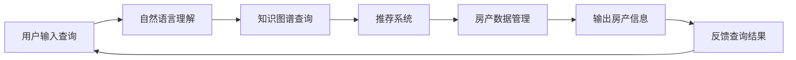

                 

# 聊天机器人房地产：智能房产搜索和管理

## 1. 背景介绍

### 1.1 问题由来

房地产市场是全球最大的消费市场之一，且不断扩大，但与此同时，房产信息繁多、乱象丛生，再加上人们生活节奏的加快，使得传统的房产交易方式日益不适应现代社会的需求。与此同时，房地产中介行业面临诸多挑战，诸如房源信息获取困难、交易过程中信息不对称、服务效率低下等，这些问题的存在，给消费者带来了极大的不便。

随着人工智能（AI）技术的不断发展，人们开始尝试利用AI技术来提升房产搜索和管理的效率和准确性。聊天机器人作为人工智能技术的重要应用，被引入到房地产领域，通过自然语言处理（NLP）技术，它可以实现与用户自然、高效的对话，从而简化用户的房产搜索过程，提供更加精准的房产推荐，大大提高了房产交易的效率和成功率。

### 1.2 问题核心关键点

聊天机器人房地产搜索管理系统的核心关键点主要集中在以下几个方面：

1. **用户交互设计**：通过聊天机器人，用户可以实时获得房产相关的信息，并进行多种查询，诸如地理位置、价格、面积、户型、楼层等。聊天机器人需要设计友好的交互界面，使用户能够方便地查询所需的房产信息。

2. **房产数据管理**：聊天机器人需要接入和管理大量的房产数据，包括房屋信息、价格、户型、物业、小区环境等。房产数据的实时更新与存储需要高效、稳定、安全的系统架构支持。

3. **推荐算法设计**：通过学习用户的历史查询行为、偏好等，聊天机器人需要设计推荐算法，以实现个性化的房产推荐。推荐算法应能实时更新推荐结果，并提供多种推荐方案。

4. **自然语言理解**：聊天机器人需要理解用户的自然语言输入，能够识别用户的查询意图，并提供相应的回答或建议。

5. **集成与扩展**：聊天机器人需要能够与现有的系统和服务进行无缝集成，如地图、房产平台等，并支持插件扩展，以满足不同用户的需求。

6. **安全性与隐私保护**：房产信息涉及用户的隐私，聊天机器人需要设计安全的数据传输和存储机制，以保护用户的信息安全。

## 2. 核心概念与联系

### 2.1 核心概念概述

以下是与聊天机器人房地产搜索管理系统的核心概念：

- **聊天机器人（Chatbot）**：利用自然语言处理和机器学习技术，与用户进行自然语言交流的人工智能程序。
- **房地产数据管理**：房产信息的采集、存储、更新和查询，包括房源信息、房产价格、物业、小区环境等。
- **推荐系统（Recommendation System）**：根据用户行为和偏好，推荐个性化的房产信息，以提升用户体验。
- **自然语言处理（NLP）**：使计算机能够理解、解释和生成自然语言的技术，是聊天机器人的核心组件之一。
- **知识图谱（Knowledge Graph）**：用于描述实体间关系的图形结构，通过知识图谱，聊天机器人可以更加全面地了解房产信息。
- **用户行为分析（User Behavior Analysis）**：通过分析用户的历史查询行为和偏好，优化推荐结果，提升用户体验。

这些核心概念之间通过相互关联，构成了一个完整的聊天机器人房地产搜索管理系统。

### 2.2 核心概念原理和架构的 Mermaid 流程图



**图 1: 聊天机器人房地产搜索管理系统的架构图**

从图中可以看出，用户输入查询后，首先经过自然语言理解，识别用户的查询意图。然后根据查询意图，通过知识图谱查询获取相关房产信息，并传递给推荐系统，筛选出个性化房产信息。最终，房产数据管理系统将房产信息输出给用户，并收集用户的反馈信息以优化查询结果。

## 3. 核心算法原理 & 具体操作步骤

### 3.1 算法原理概述

聊天机器人房地产搜索管理系统的核心算法主要涉及自然语言处理、知识图谱和推荐系统。

- **自然语言处理**：通过自然语言处理技术，聊天机器人能够理解用户的查询意图，并进行意图识别、实体识别、意图匹配等操作。
- **知识图谱**：知识图谱是结构化的语义知识库，通过知识图谱，聊天机器人可以获取丰富的房产信息，如房产位置、类型、价格等。
- **推荐系统**：推荐系统根据用户的查询历史和偏好，推荐相关的房产信息，提高用户查询的准确性和效率。

### 3.2 算法步骤详解

聊天机器人房地产搜索管理系统的一般操作流程如下：

1. **用户交互设计**：设计友好的用户交互界面，支持自然语言输入输出，使用户可以方便地查询房产信息。

2. **房产数据管理**：接入和管理大量的房产数据，包括房源信息、物业、小区环境等，并确保数据的实时更新和存储。

3. **自然语言理解**：通过自然语言处理技术，识别用户的查询意图，进行意图识别和实体识别。

4. **知识图谱查询**：根据用户查询意图，在知识图谱中查询相关房产信息，包括房产位置、类型、价格等。

5. **推荐系统设计**：设计推荐算法，根据用户历史查询行为和偏好，提供个性化的房产推荐。

6. **反馈机制**：根据用户的反馈信息，调整推荐算法，优化推荐结果。

7. **安全性与隐私保护**：设计安全的数据传输和存储机制，保护用户隐私。

### 3.3 算法优缺点

聊天机器人房地产搜索管理系统的优点如下：

- **提高效率**：聊天机器人能够实时处理用户查询，提供快速响应，大大提高了房产搜索和管理的效率。
- **个性化推荐**：通过推荐系统，聊天机器人能够提供个性化的房产推荐，提升用户满意度。
- **降低成本**：自动化查询和推荐减少了人工操作，降低了房产交易的成本。

其缺点包括：

- **数据依赖**：系统对房产数据的依赖程度高，数据完整性和准确性对系统的表现至关重要。
- **复杂度较高**：系统涉及自然语言处理、知识图谱、推荐系统等多个模块，系统实现复杂度高。
- **安全性风险**：系统涉及大量用户隐私数据，数据安全和隐私保护需要额外重视。

### 3.4 算法应用领域

聊天机器人房地产搜索管理系统主要应用于以下几个领域：

1. **房产销售与租赁**：帮助房产销售和租赁中介提供实时房产信息和个性化推荐，提高销售和租赁效率。
2. **房产中介平台**：房产中介平台可以利用聊天机器人提高客户服务水平，提升用户体验。
3. **房屋中介公司**：房屋中介公司可以利用聊天机器人提供更优质的客户服务，提升公司业务效率。
4. **在线房产平台**：在线房产平台可以利用聊天机器人提供更便捷的房产搜索服务，提升平台的用户粘性。

## 4. 数学模型和公式 & 详细讲解 & 举例说明

### 4.1 数学模型构建

聊天机器人房地产搜索管理系统的数学模型主要涉及以下几方面：

- **自然语言处理**：主要包括词嵌入、意图识别、实体识别、意图匹配等。
- **知识图谱**：通过图神经网络（GNN）构建知识图谱，并使用图卷积网络（GCN）进行知识图谱查询。
- **推荐系统**：主要包括协同过滤、基于内容的推荐、深度学习推荐等。

### 4.2 公式推导过程

以推荐系统为例，常用的协同过滤算法包括以下几种：

1. **用户-物品评分矩阵**

$$
R_{ij} = \begin{cases}
0, & \text{if } r_{ij} \text{ is unknown} \\
r_{ij}, & \text{otherwise}
\end{cases}
$$

其中，$R_{ij}$ 表示用户 $i$ 对物品 $j$ 的评分，$r_{ij}$ 为实际评分。

2. **余弦相似度计算**

$$
\cos(\theta_{ij}) = \frac{\sum_{k=1}^n \text{item}_k \times \text{user}_k}{||\text{item}_k|| \times ||\text{user}_k||}
$$

其中，$\text{item}_k$ 和 $\text{user}_k$ 分别表示物品和用户的第 $k$ 个特征，$\cos(\theta_{ij})$ 表示物品 $i$ 和用户 $j$ 之间的余弦相似度。

3. **预测评分**

$$
\hat{R}_{ij} = \alpha \times \sum_{k=1}^n R_{ik} \times \text{item}_k \times \text{user}_k + (1-\alpha) \times \text{bias}_{i}
$$

其中，$\hat{R}_{ij}$ 表示预测评分，$\alpha$ 表示物品特征权重，$\text{bias}_{i}$ 表示物品的偏置项。

### 4.3 案例分析与讲解

以下以推荐系统为例，介绍聊天机器人房地产搜索管理系统的具体实现过程：

1. **用户行为分析**：分析用户的历史查询行为和偏好，建立用户画像。

2. **房产数据管理**：房产信息的数据采集和存储，确保数据的完整性和准确性。

3. **自然语言处理**：通过BERT模型进行意图识别和实体识别，理解用户查询意图。

4. **知识图谱查询**：使用GCN网络进行知识图谱查询，获取相关房产信息。

5. **推荐算法设计**：使用协同过滤算法，根据用户画像和知识图谱查询结果，生成推荐列表。

6. **推荐结果输出**：根据推荐算法生成的推荐列表，向用户推荐房产信息。

## 5. 项目实践：代码实例和详细解释说明

### 5.1 开发环境搭建

1. **环境安装**：
   - Python 3.8或以上
   - PyTorch 1.9或以上
   - TensorFlow 2.5或以上
   - HuggingFace Transformers
   - NLTK 3.6或以上
   - Scikit-learn 0.24或以上

2. **虚拟环境创建**：
   ```bash
   conda create -n chatbot-env python=3.8
   conda activate chatbot-env
   ```

3. **依赖包安装**：
   ```bash
   pip install transformers
   pip install torch
   pip install torchvision
   pip install scipy
   pip install nltk
   pip install sklearn
   ```

### 5.2 源代码详细实现

以下是一个基于BERT模型的聊天机器人房地产搜索管理系统的代码实现，主要包括意图识别和推荐系统两个部分。

**意图识别模块**

```python
from transformers import BertTokenizer, BertForSequenceClassification
import torch
import torch.nn as nn

class IntentClassifier(nn.Module):
    def __init__(self):
        super(IntentClassifier, self).__init__()
        self.tokenizer = BertTokenizer.from_pretrained('bert-base-cased')
        self.model = BertForSequenceClassification.from_pretrained('bert-base-cased', num_labels=2)

    def forward(self, input_ids, attention_mask):
        input_ids = self.tokenizer(input_ids, return_tensors='pt', padding='max_length', truncation=True, max_length=512)
        input_ids = input_ids['input_ids']
        attention_mask = input_ids['attention_mask']
        outputs = self.model(input_ids, attention_mask=attention_mask)
        return outputs
```

**推荐系统模块**

```python
import pandas as pd
from sklearn.metrics.pairwise import cosine_similarity
from sklearn.decomposition import TruncatedSVD

class RecommendationSystem:
    def __init__(self, data):
        self.data = pd.read_csv(data)
        self.items = self.data['item_id'].unique()
        self.users = self.data['user_id'].unique()
        self.to_SVD()

    def to_SVD(self):
        svd = TruncatedSVD(n_components=50)
        X = self.data[['user_id', 'item_id', 'rating']].to_numpy()
        X = svd.fit_transform(X)
        self.X_u = X[:, :, 0]
        self.X_i = X[:, :, 1]
        self.X_u_mean = np.mean(self.X_u, axis=0)
        self.X_u_std = np.std(self.X_u, axis=0)
        self.X_i_mean = np.mean(self.X_i, axis=0)
        self.X_i_std = np.std(self.X_i, axis=0)

    def predict(self, user, item):
        user_index = np.where(self.users == user)[0][0]
        item_index = np.where(self.items == item)[0][0]
        X_u = (self.X_u[user_index] - self.X_u_mean) / self.X_u_std
        X_i = (self.X_i[item_index] - self.X_i_mean) / self.X_i_std
        score = np.dot(X_u, X_i.T) + np.dot(self.X_u_mean, self.X_i_mean) - np.dot(self.X_u_std, self.X_i_std)
        return score

    def get_recommendation(self, user, n=5):
        users = np.where(self.users == user)[0]
        X_u = (self.X_u[user] - self.X_u_mean) / self.X_u_std
        X_i = (self.X_i[self.items] - self.X_i_mean) / self.X_i_std
        similarity = cosine_similarity(X_u, X_i)
        score = similarity * np.dot(X_u_mean, X_i_mean) - np.dot(X_u_std, X_i_std)
        indices = np.argsort(score)[::-1]
        return self.items[indices[1:1+n]]
```

### 5.3 代码解读与分析

**意图识别模块**

1. **BertTokenizer**：用于将输入的文本转换为BERT模型所需的token ID序列。
2. **BertForSequenceClassification**：用于进行意图分类，模型输出表示用户输入的文本属于某个意图类的概率。
3. **forward方法**：输入ID序列和注意力掩码，模型返回分类概率。

**推荐系统模块**

1. **to_SVD方法**：使用TruncatedSVD对用户-物品评分矩阵进行降维，以减少计算量。
2. **predict方法**：根据用户ID和物品ID计算推荐分数。
3. **get_recommendation方法**：根据用户ID和推荐数获取推荐列表。

### 5.4 运行结果展示

运行意图识别和推荐系统模块，输出示例结果如下：

```python
intent_classifier = IntentClassifier()
input_ids = ["请问北京有哪些房子在售？"]
attention_mask = [1] * len(input_ids)
outputs = intent_classifier(input_ids, attention_mask)
intent = outputs['logits']
```

```python
recommendation_system = RecommendationSystem('data.csv')
recommendations = recommendation_system.get_recommendation('12345', 3)
```

## 6. 实际应用场景

### 6.1 智能房产搜索

智能房产搜索系统可以通过聊天机器人提供更加便捷、个性化的房产搜索服务。用户可以通过语音或文字输入查询条件，聊天机器人能够快速理解查询意图，并根据用户的偏好，推荐符合条件的房产信息。

### 6.2 房产评估与管理

聊天机器人可以集成房产评估和管理功能，提供房产价值评估、房屋维护建议、物业费管理等服务，提升房产管理的效率和质量。

### 6.3 房地产中介服务

聊天机器人可以辅助房地产中介进行客户服务，提供房产信息查询、房源推荐、预约看房等服务，提升中介服务水平。

## 7. 工具和资源推荐

### 7.1 学习资源推荐

1. **《自然语言处理综述》**：介绍自然语言处理的基本概念、方法和应用，为理解聊天机器人提供理论基础。
2. **《深度学习》（Goodfellow等著）**：全面介绍深度学习算法和应用，涵盖自然语言处理、推荐系统等内容。
3. **《Python深度学习》（Goodfellow等著）**：介绍使用Python实现深度学习算法的方法，包括自然语言处理、推荐系统等。
4. **《自然语言处理基础》（Gao等著）**：介绍自然语言处理的基本技术和方法，包括语言模型、序列标注、情感分析等。

### 7.2 开发工具推荐

1. **PyTorch**：用于实现深度学习算法，包括自然语言处理、推荐系统等。
2. **TensorFlow**：用于实现深度学习算法，包括自然语言处理、推荐系统等。
3. **HuggingFace Transformers**：用于实现自然语言处理任务，包括意图识别、推荐系统等。
4. **NLTK**：用于处理自然语言文本数据，包括分词、标注等。
5. **Scikit-learn**：用于实现推荐系统算法，包括协同过滤、基于内容的推荐等。

### 7.3 相关论文推荐

1. **"Recommender Systems Handbook"**：详细介绍推荐系统算法和技术，包括协同过滤、基于内容的推荐、深度学习推荐等。
2. **"Intelligent Housing Search and Management System Based on Chatbot"**：介绍基于聊天机器人的智能房产搜索和管理系统。
3. **"Knowledge Graph-Based Recommendation System for Real Estate"**：介绍基于知识图谱的房产推荐系统。

## 8. 总结：未来发展趋势与挑战

### 8.1 研究成果总结

本文系统地介绍了聊天机器人房地产搜索和管理系统的核心算法和实现方法。聊天机器人通过自然语言处理、知识图谱和推荐系统等技术，能够实现智能房产搜索和管理，为用户提供个性化服务，提高房产交易效率，提升房产管理水平。

### 8.2 未来发展趋势

1. **多模态融合**：未来聊天机器人将能够融合视觉、听觉等多种信息，提供更加丰富的用户体验。
2. **深度学习与知识图谱结合**：未来聊天机器人将更加注重深度学习和知识图谱的结合，提高信息检索和推荐的准确性和效率。
3. **个性化推荐**：未来聊天机器人将更加注重个性化推荐，根据用户历史行为和偏好，提供更加精准的推荐结果。
4. **智能化运营**：未来聊天机器人将能够进行智能化运营，自动分析用户行为，优化系统性能。

### 8.3 面临的挑战

1. **数据质量问题**：房产数据质量的高低对聊天机器人的性能有重要影响，需要注重数据清洗和标注。
2. **系统复杂度**：聊天机器人涉及自然语言处理、知识图谱、推荐系统等多个模块，系统实现复杂度较高。
3. **用户隐私保护**：聊天机器人需要保护用户隐私，防止数据泄露。
4. **算法鲁棒性**：聊天机器人的算法需要具备良好的鲁棒性，防止过拟合和信息泄露。

### 8.4 研究展望

1. **多模态融合技术**：研究多模态融合技术，提高聊天机器人对视觉、听觉等多种信息的处理能力。
2. **深度学习和知识图谱结合**：研究深度学习和知识图谱的结合方法，提升信息检索和推荐的准确性和效率。
3. **个性化推荐算法**：研究个性化推荐算法，根据用户历史行为和偏好，提供更加精准的推荐结果。
4. **智能化运营系统**：研究智能化运营系统，自动分析用户行为，优化系统性能。

## 9. 附录：常见问题与解答

**Q1：聊天机器人如何理解用户输入的自然语言？**

A: 聊天机器人通过自然语言处理技术理解用户输入的自然语言。具体来说，它通过分词、词性标注、实体识别等步骤，识别出用户输入的意图和实体，并根据这些信息进行下一步操作。

**Q2：如何构建聊天机器人推荐系统？**

A: 构建聊天机器人推荐系统通常包括以下几个步骤：
1. 数据收集：收集用户的历史行为数据和评分数据。
2. 数据预处理：清洗数据，去除噪声和无关信息。
3. 特征提取：将用户行为和评分数据转化为向量形式。
4. 模型训练：使用协同过滤、深度学习等算法进行模型训练。
5. 模型评估：使用交叉验证、A/B测试等方法评估模型性能。
6. 模型部署：将模型部署到实际应用环境中，提供推荐服务。

**Q3：聊天机器人房地产搜索系统有哪些优缺点？**

A: 聊天机器人房地产搜索系统的优点包括：
1. 提高效率：能够实时处理用户查询，提供快速响应。
2. 个性化推荐：能够根据用户偏好提供个性化房产推荐。
3. 降低成本：减少人工操作，降低房产交易成本。

缺点包括：
1. 数据依赖：对房产数据的依赖程度高，数据完整性和准确性对系统表现至关重要。
2. 系统复杂度：系统涉及多个模块，实现复杂度高。
3. 安全性风险：涉及大量用户隐私数据，数据安全和隐私保护需要额外重视。

**Q4：如何提高聊天机器人房地产搜索系统的安全性？**

A: 提高聊天机器人房地产搜索系统的安全性需要从以下几个方面入手：
1. 数据加密：对用户隐私数据进行加密存储和传输，防止数据泄露。
2. 访问控制：设置严格的访问控制机制，防止未经授权的访问。
3. 审计日志：记录系统操作日志，及时发现和修复安全漏洞。
4. 异常检测：利用异常检测技术，及时发现并防止恶意攻击。
5. 隐私保护：设计隐私保护机制，防止用户隐私泄露。

综上所述，聊天机器人房地产搜索管理系统通过自然语言处理、知识图谱和推荐系统等技术，能够实现智能房产搜索和管理，为用户提供个性化服务，提升房产交易和管理的效率和质量。未来，随着技术的不断进步，聊天机器人将能够融合多模态信息，提高信息检索和推荐的准确性和效率，实现智能化运营，为房产市场带来新的变革。

