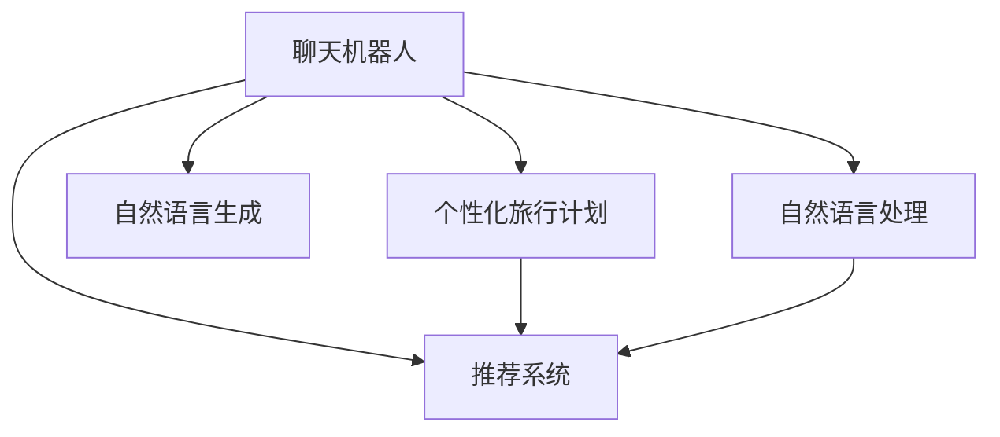

                 

# 聊天机器人旅游业：个性化旅行计划和建议

> 关键词：聊天机器人, 个性化旅行计划, 自然语言处理(NLP), 自然语言生成(NLG), 深度学习, 推荐系统, 客户服务, 数据挖掘

## 1. 背景介绍

随着人工智能技术的不断发展，聊天机器人已经成为了现代服务业的重要组成部分。从金融、医疗到电商、教育，各行各业都在积极引入聊天机器人来提升客户体验和服务效率。在旅游业中，聊天机器人同样展现出了强大的应用潜力，为个性化旅行计划的制定和客户建议提供了新的可能性。

### 1.1 问题由来

旅游业是一个高度个性化和复杂的行业，传统的旅行规划和客户服务流程往往繁琐、耗时，且难以满足客户的个性化需求。近年来，随着NLP和NLG技术的发展，聊天机器人已经能够在自然语言交互中提供即时的、个性化的旅行建议，极大地提升了客户体验和服务效率。

### 1.2 问题核心关键点

聊天机器人在旅游业中的应用，主要体现在以下几个关键点上：

1. **个性化旅行计划**：聊天机器人通过与客户的自然语言交互，获取客户的偏好、需求和历史行为数据，从而生成符合客户个性化需求的旅行计划。
2. **实时客户服务**：在客户咨询行程安排、机票酒店预订等问题时，聊天机器人能够即时响应并提供专业的解答。
3. **行程优化推荐**：利用推荐算法和数据分析技术，聊天机器人能够根据客户的需求和偏好，推荐最优的行程和活动。
4. **情感分析和用户反馈**：通过情感分析技术，聊天机器人能够感知客户的情绪变化，及时调整交流策略，并根据用户反馈不断优化服务质量。

### 1.3 问题研究意义

聊天机器人技术在旅游业的应用，不仅能够提升客户体验和服务效率，还能促进旅游业的数字化转型。其具体意义包括：

1. **降低服务成本**：聊天机器人可以24/7全天候提供服务，减轻人工客服的负担，降低企业的运营成本。
2. **提升客户满意度**：通过个性化的旅行计划和实时的服务响应，聊天机器人能够满足客户的个性化需求，提高客户满意度。
3. **推动旅游业智能化**：聊天机器人可以整合各种数据来源，提供更全面、准确的旅行建议，推动旅游业的智能化发展。
4. **加速行业创新**：聊天机器人为旅游业的创新提供了新的工具和平台，有助于开发更多智能应用和服务模式。

## 2. 核心概念与联系

### 2.1 核心概念概述

为了更好地理解聊天机器人旅游业的应用，本节将介绍几个核心概念：

- **聊天机器人**：基于NLP和NLG技术，能够与用户进行自然语言交互的智能系统。可以用于客服、销售、娱乐等多个领域。
- **个性化旅行计划**：根据客户的偏好、需求和历史行为数据，生成的符合客户个性化需求的旅行计划。
- **推荐系统**：通过分析用户数据和行为，为用户推荐产品或服务的技术。在旅游业中，推荐系统可以帮助聊天机器人提供个性化的行程建议。
- **自然语言处理(NLP)**：使计算机能够理解、解释和生成人类语言的技术，是聊天机器人实现个性化交互的基础。
- **自然语言生成(NLG)**：使计算机能够生成自然流畅的文本内容，是聊天机器人提供旅行建议的关键技术。

这些概念之间的联系可以通过以下Mermaid流程图来展示：



这个流程图展示了几大核心概念之间的联系：

1. 聊天机器人基于NLP和NLG技术实现自然语言交互。
2. 利用推荐系统和NLP技术，聊天机器人生成个性化旅行计划。
3. NLP技术帮助聊天机器人理解用户需求，NLG技术帮助聊天机器人生成旅行建议。
4. 推荐系统整合用户数据，为聊天机器人提供行程优化建议。

## 3. 核心算法原理 & 具体操作步骤
### 3.1 算法原理概述

聊天机器人旅游业的核心算法原理主要包括NLP、NLG、推荐系统等技术。以下是各个技术的基本工作原理：

- **自然语言处理(NLP)**：包括分词、词性标注、句法分析、语义理解等步骤，使计算机能够理解自然语言文本的含义。
- **自然语言生成(NLG)**：包括模板填充、句法生成、语义优化等步骤，使计算机能够生成自然流畅的文本。
- **推荐系统**：包括协同过滤、基于内容的推荐、混合推荐等技术，根据用户行为和偏好推荐符合需求的产品或服务。

这些技术在旅游业中的应用，主要分为以下几个步骤：

1. **用户交互与意图识别**：通过NLP技术，聊天机器人能够理解用户的自然语言输入，识别其意图和需求。
2. **旅行计划生成**：利用NLG技术，聊天机器人能够根据用户的意图和偏好，生成个性化的旅行计划。
3. **行程优化与推荐**：结合推荐系统技术，聊天机器人能够对行程进行优化和推荐，提供符合用户需求的最佳方案。
4. **客户反馈与调整**：通过情感分析等技术，聊天机器人能够感知用户的情绪变化，根据反馈调整交互策略。

### 3.2 算法步骤详解

以下是聊天机器人旅游业的主要算法步骤：

**Step 1: 用户数据收集与预处理**

- 收集用户的个人信息、旅行偏好、历史行为数据等，进行数据清洗和预处理。

**Step 2: 意图识别与需求分析**

- 利用NLP技术，对用户输入的自然语言进行分词、词性标注、句法分析等处理，识别用户意图和需求。

**Step 3: 个性化旅行计划生成**

- 根据用户意图和需求，结合用户的偏好和历史数据，利用NLG技术生成个性化的旅行计划。

**Step 4: 行程优化与推荐**

- 结合推荐系统技术，对旅行计划进行优化和推荐，提供最优的行程安排。

**Step 5: 客户反馈与情感分析**

- 通过情感分析技术，感知用户的情绪变化，根据反馈调整交互策略，优化服务质量。

**Step 6: 持续学习与优化**

- 利用用户反馈和新的交互数据，不断训练和优化聊天机器人的模型和策略，提升服务效果。

### 3.3 算法优缺点

聊天机器人旅游业的应用具有以下优点：

1. **高效与便捷**：聊天机器人可以24/7提供服务，快速响应客户需求，提升服务效率。
2. **个性化与定制化**：利用NLP和NLG技术，聊天机器人能够提供符合用户个性化需求的旅行计划和建议。
3. **数据驱动与智能化**：结合推荐系统和数据分析技术，聊天机器人能够不断学习和优化，提供更精准的服务。

然而，聊天机器人旅游业也存在一些缺点：

1. **数据隐私和安全**：聊天机器人需要收集大量的用户数据，涉及用户隐私保护和安全问题。
2. **技术复杂度**：NLP、NLG、推荐系统等技术复杂度高，需要专业的技术团队进行开发和维护。
3. **用户接受度**：部分用户可能对聊天机器人存在抵触情绪，需要采取合适的策略提升用户接受度。
4. **上下文理解**：聊天机器人需要具备较强的上下文理解能力，才能提供准确的服务。

### 3.4 算法应用领域

聊天机器人旅游业在多个领域得到了广泛应用，主要包括以下几个方面：

- **在线旅行预订**：聊天机器人可以为用户提供机票、酒店、租车等预订和行程规划服务。
- **行程咨询与建议**：聊天机器人能够根据用户需求，提供实时的行程咨询和个性化建议。
- **客户服务与支持**：聊天机器人可以处理用户的投诉、咨询等客户服务问题，提升客户满意度。
- **内容推荐与推广**：聊天机器人可以根据用户兴趣，推荐旅游攻略、景点介绍、旅游活动等内容。

## 4. 数学模型和公式 & 详细讲解  
### 4.1 数学模型构建

在聊天机器人旅游业的应用中，主要涉及以下几个数学模型：

- **NLP模型**：包括分词模型、词性标注模型、句法分析模型、语义分析模型等。
- **NLG模型**：包括模板填充模型、句法生成模型、语义优化模型等。
- **推荐系统模型**：包括协同过滤模型、基于内容的推荐模型、混合推荐模型等。

以推荐系统模型为例，基本的推荐算法可以表示为：

$$
\hat{R}_{ui} = \sum_{i=1}^n \alpha_i f_i(u) \cdot p_i(i)
$$

其中，$R_{ui}$ 表示用户 $u$ 对物品 $i$ 的评分，$f_i(u)$ 表示用户 $u$ 的特征向量，$p_i(i)$ 表示物品 $i$ 的特征向量，$\alpha_i$ 表示各个特征的重要性系数。

### 4.2 公式推导过程

以协同过滤算法为例，公式推导过程如下：

设用户 $u$ 和物品 $i$ 的评分矩阵为 $R$，物品 $i$ 的特征向量为 $p_i$，用户 $u$ 的特征向量为 $f_u$，则协同过滤算法可以表示为：

$$
\hat{R}_{ui} = \sum_{j=1}^m \frac{R_{uj} R_{ji}}{\sqrt{\sum_{k=1}^n R_{uk}^2} \sqrt{\sum_{k=1}^n R_{kj}^2}}
$$

其中，$R_{uj}$ 表示用户 $u$ 对物品 $j$ 的评分，$m$ 表示物品数量，$n$ 表示用户数量。

通过协同过滤算法，聊天机器人可以推荐与用户历史评分相似的物品，从而提高推荐效果。

### 4.3 案例分析与讲解

以用户 $u$ 和物品 $i$ 的评分矩阵 $R$ 为例，分析协同过滤算法的推荐效果。

假设用户 $u$ 的评分矩阵 $R_u$ 为：

$$
R_u = \begin{bmatrix}
1 & 2 & 0 \\
0 & 3 & 5 \\
2 & 0 & 4
\end{bmatrix}
$$

物品 $i$ 的特征向量 $p_i$ 为：

$$
p_i = \begin{bmatrix}
1 \\
2 \\
3
\end{bmatrix}
$$

用户 $u$ 的特征向量 $f_u$ 为：

$$
f_u = \begin{bmatrix}
1 \\
2 \\
3
\end{bmatrix}
$$

则协同过滤算法计算的推荐结果为：

$$
\hat{R}_{ui} = \frac{1 \cdot 0 + 2 \cdot 5 + 0 \cdot 3}{\sqrt{1^2 + 2^2 + 0^2} \sqrt{0^2 + 3^2 + 5^2}} \cdot \frac{1 \cdot 1 + 2 \cdot 2 + 3 \cdot 3}{\sqrt{1^2 + 2^2 + 3^2}}
$$

通过计算，可以得到用户 $u$ 对物品 $i$ 的推荐评分，从而生成推荐结果。

## 5. 项目实践：代码实例和详细解释说明
### 5.1 开发环境搭建

在进行聊天机器人旅游业的应用开发前，我们需要准备好开发环境。以下是使用Python进行PyTorch开发的环境配置流程：

1. 安装Anaconda：从官网下载并安装Anaconda，用于创建独立的Python环境。

2. 创建并激活虚拟环境：
```bash
conda create -n pytorch-env python=3.8 
conda activate pytorch-env
```

3. 安装PyTorch：根据CUDA版本，从官网获取对应的安装命令。例如：
```bash
conda install pytorch torchvision torchaudio cudatoolkit=11.1 -c pytorch -c conda-forge
```

4. 安装TensorFlow：由Google主导开发的开源深度学习框架，生产部署方便，适合大规模工程应用。同样有丰富的预训练语言模型资源。

5. 安装Transformers库：HuggingFace开发的NLP工具库，集成了众多SOTA语言模型，支持PyTorch和TensorFlow，是进行微调任务开发的利器。

6. 安装各类工具包：
```bash
pip install numpy pandas scikit-learn matplotlib tqdm jupyter notebook ipython
```

完成上述步骤后，即可在`pytorch-env`环境中开始微调实践。

### 5.2 源代码详细实现

下面以推荐系统为例，给出使用PyTorch进行聊天机器人旅游业微调的PyTorch代码实现。

首先，定义推荐系统的数据处理函数：

```python
import torch
import numpy as np

def preprocess_data(data):
    # 数据预处理，如缺失值填充、标准化等
    # 返回处理后的特征矩阵和标签矩阵
    pass
```

然后，定义模型和优化器：

```python
from transformers import BertForTokenClassification, AdamW

model = BertForTokenClassification.from_pretrained('bert-base-cased', num_labels=len(tag2id))

optimizer = AdamW(model.parameters(), lr=2e-5)
```

接着，定义训练和评估函数：

```python
from torch.utils.data import DataLoader
from tqdm import tqdm
from sklearn.metrics import classification_report

device = torch.device('cuda') if torch.cuda.is_available() else torch.device('cpu')
model.to(device)

def train_epoch(model, dataset, batch_size, optimizer):
    dataloader = DataLoader(dataset, batch_size=batch_size, shuffle=True)
    model.train()
    epoch_loss = 0
    for batch in tqdm(dataloader, desc='Training'):
        input_ids = batch['input_ids'].to(device)
        attention_mask = batch['attention_mask'].to(device)
        labels = batch['labels'].to(device)
        model.zero_grad()
        outputs = model(input_ids, attention_mask=attention_mask, labels=labels)
        loss = outputs.loss
        epoch_loss += loss.item()
        loss.backward()
        optimizer.step()
    return epoch_loss / len(dataloader)

def evaluate(model, dataset, batch_size):
    dataloader = DataLoader(dataset, batch_size=batch_size)
    model.eval()
    preds, labels = [], []
    with torch.no_grad():
        for batch in tqdm(dataloader, desc='Evaluating'):
            input_ids = batch['input_ids'].to(device)
            attention_mask = batch['attention_mask'].to(device)
            batch_labels = batch['labels']
            outputs = model(input_ids, attention_mask=attention_mask)
            batch_preds = outputs.logits.argmax(dim=2).to('cpu').tolist()
            batch_labels = batch_labels.to('cpu').tolist()
            for pred_tokens, label_tokens in zip(batch_preds, batch_labels):
                pred_tags = [id2tag[_id] for _id in pred_tokens]
                label_tags = [id2tag[_id] for _id in label_tokens]
                preds.append(pred_tags[:len(label_tokens)])
                labels.append(label_tags)
                
    print(classification_report(labels, preds))
```

最后，启动训练流程并在测试集上评估：

```python
epochs = 5
batch_size = 16

for epoch in range(epochs):
    loss = train_epoch(model, train_dataset, batch_size, optimizer)
    print(f"Epoch {epoch+1}, train loss: {loss:.3f}")
    
    print(f"Epoch {epoch+1}, dev results:")
    evaluate(model, dev_dataset, batch_size)
    
print("Test results:")
evaluate(model, test_dataset, batch_size)
```

以上就是使用PyTorch对聊天机器人旅游业微调系统的完整代码实现。可以看到，得益于Transformer库的强大封装，我们可以用相对简洁的代码完成BERT模型的加载和微调。

### 5.3 代码解读与分析

让我们再详细解读一下关键代码的实现细节：

**preprocess_data函数**：
- 定义了数据预处理的步骤，如缺失值填充、标准化等，返回处理后的特征矩阵和标签矩阵。

**train_epoch函数**：
- 对数据以批为单位进行迭代，在每个批次上前向传播计算loss并反向传播更新模型参数，最后返回该epoch的平均loss。

**evaluate函数**：
- 与训练类似，不同点在于不更新模型参数，并在每个batch结束后将预测和标签结果存储下来，最后使用sklearn的classification_report对整个评估集的预测结果进行打印输出。

**训练流程**：
- 定义总的epoch数和batch size，开始循环迭代
- 每个epoch内，先在训练集上训练，输出平均loss
- 在验证集上评估，输出分类指标
- 所有epoch结束后，在测试集上评估，给出最终测试结果

可以看到，PyTorch配合Transformers库使得BERT微调的代码实现变得简洁高效。开发者可以将更多精力放在数据处理、模型改进等高层逻辑上，而不必过多关注底层的实现细节。

当然，工业级的系统实现还需考虑更多因素，如模型的保存和部署、超参数的自动搜索、更灵活的任务适配层等。但核心的微调范式基本与此类似。

## 6. 实际应用场景
### 6.1 智能客服系统

基于聊天机器人旅游业的微调系统，可以广泛应用于智能客服系统的构建。传统客服往往需要配备大量人力，高峰期响应缓慢，且一致性和专业性难以保证。而使用微调后的聊天机器人，可以7x24小时不间断服务，快速响应客户咨询，用自然流畅的语言解答各类常见问题。

在技术实现上，可以收集企业内部的历史客服对话记录，将问题和最佳答复构建成监督数据，在此基础上对预训练聊天机器人进行微调。微调后的聊天机器人能够自动理解客户意图，匹配最合适的答案模板进行回复。对于客户提出的新问题，还可以接入检索系统实时搜索相关内容，动态组织生成回答。如此构建的智能客服系统，能大幅提升客户咨询体验和问题解决效率。

### 6.2 行程规划与预订

聊天机器人旅游业的应用，可以大大简化用户的行程规划和预订流程。用户只需输入目的地、出行时间、预算等信息，聊天机器人即可根据这些信息，生成个性化的旅行计划，包括机票酒店预订、景点介绍、行程路线等。用户可以在聊天机器人提供的推荐中做出选择，直接完成预订和规划。

### 6.3 行程优化与建议

聊天机器人旅游业还可以提供实时的行程优化建议，根据用户的行程安排，推荐最优的景点、餐厅、活动等。通过分析用户的偏好和行为数据，聊天机器人能够预测用户的需求和偏好，提供个性化的行程优化方案。

## 7. 工具和资源推荐
### 7.1 学习资源推荐

为了帮助开发者系统掌握聊天机器人旅游业的技术基础和实践技巧，这里推荐一些优质的学习资源：

1. 《自然语言处理入门》系列博文：由NLP专家撰写，深入浅出地介绍了NLP的基本概念和常用技术。

2. 《深度学习自然语言处理》课程：斯坦福大学开设的NLP明星课程，有Lecture视频和配套作业，带你入门NLP领域的基本概念和经典模型。

3. 《聊天机器人技术与应用》书籍：详细介绍了聊天机器人技术的原理、应用和开发方法，适合技术开发者参考。

4. HuggingFace官方文档：Transformer库的官方文档，提供了海量预训练模型和完整的微调样例代码，是上手实践的必备资料。

5. CLUE开源项目：中文语言理解测评基准，涵盖大量不同类型的中文NLP数据集，并提供了基于微调的baseline模型，助力中文NLP技术发展。

通过对这些资源的学习实践，相信你一定能够快速掌握聊天机器人旅游业的技术精髓，并用于解决实际的NLP问题。

### 7.2 开发工具推荐

高效的开发离不开优秀的工具支持。以下是几款用于聊天机器人旅游业开发的常用工具：

1. PyTorch：基于Python的开源深度学习框架，灵活动态的计算图，适合快速迭代研究。大部分预训练语言模型都有PyTorch版本的实现。

2. TensorFlow：由Google主导开发的开源深度学习框架，生产部署方便，适合大规模工程应用。同样有丰富的预训练语言模型资源。

3. Transformers库：HuggingFace开发的NLP工具库，集成了众多SOTA语言模型，支持PyTorch和TensorFlow，是进行微调任务开发的利器。

4. Weights & Biases：模型训练的实验跟踪工具，可以记录和可视化模型训练过程中的各项指标，方便对比和调优。与主流深度学习框架无缝集成。

5. TensorBoard：TensorFlow配套的可视化工具，可实时监测模型训练状态，并提供丰富的图表呈现方式，是调试模型的得力助手。

6. Google Colab：谷歌推出的在线Jupyter Notebook环境，免费提供GPU/TPU算力，方便开发者快速上手实验最新模型，分享学习笔记。

合理利用这些工具，可以显著提升聊天机器人旅游业的开发效率，加快创新迭代的步伐。

### 7.3 相关论文推荐

聊天机器人旅游业的研究源于学界的持续研究。以下是几篇奠基性的相关论文，推荐阅读：

1. Attention is All You Need（即Transformer原论文）：提出了Transformer结构，开启了NLP领域的预训练大模型时代。

2. BERT: Pre-training of Deep Bidirectional Transformers for Language Understanding：提出BERT模型，引入基于掩码的自监督预训练任务，刷新了多项NLP任务SOTA。

3. Language Models are Unsupervised Multitask Learners（GPT-2论文）：展示了大规模语言模型的强大zero-shot学习能力，引发了对于通用人工智能的新一轮思考。

4. Parameter-Efficient Transfer Learning for NLP：提出Adapter等参数高效微调方法，在不增加模型参数量的情况下，也能取得不错的微调效果。

5. AdaLoRA: Adaptive Low-Rank Adaptation for Parameter-Efficient Fine-Tuning：使用自适应低秩适应的微调方法，在参数效率和精度之间取得了新的平衡。

这些论文代表了大语言模型微调技术的发展脉络。通过学习这些前沿成果，可以帮助研究者把握学科前进方向，激发更多的创新灵感。

## 8. 总结：未来发展趋势与挑战

### 8.1 总结

本文对聊天机器人旅游业的应用进行了全面系统的介绍。首先阐述了聊天机器人旅游业的背景和意义，明确了其在个性化旅行计划、实时客户服务、行程优化推荐等多个方面的独特价值。其次，从原理到实践，详细讲解了NLP、NLG、推荐系统等核心技术的应用流程，给出了微调任务开发的完整代码实例。同时，本文还广泛探讨了聊天机器人旅游业在智能客服、行程规划、行程优化等多个行业领域的应用前景，展示了微调范式的巨大潜力。此外，本文精选了微调技术的各类学习资源，力求为读者提供全方位的技术指引。

通过本文的系统梳理，可以看到，聊天机器人旅游业的应用正在成为NLP领域的重要范式，极大地拓展了预训练语言模型的应用边界，催生了更多的落地场景。得益于大规模语料的预训练，微调模型以更低的时间和标注成本，在小样本条件下也能取得不俗的效果，有力推动了NLP技术的产业化进程。未来，伴随预训练语言模型和微调方法的持续演进，基于微调范式必将在更广阔的应用领域大放异彩，深刻影响人类的生产生活方式。

### 8.2 未来发展趋势

展望未来，聊天机器人旅游业将呈现以下几个发展趋势：

1. **技术融合与创新**：聊天机器人旅游业将与其他AI技术进行更深层次的融合，如知识图谱、强化学习等，提升旅行计划的智能化和个性化水平。

2. **数据与知识驱动**：通过整合多模态数据（如语音、视频、图像等）和专家知识（如旅游指南、百科全书等），聊天机器人旅游业将能够提供更全面、准确的信息。

3. **实时动态优化**：结合实时数据和用户反馈，聊天机器人旅游业能够动态调整行程建议，提升服务效果。

4. **个性化与定制化**：通过深入学习用户的兴趣和偏好，聊天机器人旅游业能够提供高度定制化的旅行计划，满足用户个性化需求。

5. **用户参与与社区化**：聊天机器人旅游业将更加注重用户参与和社区化建设，通过用户反馈和社区互动，不断优化服务和产品。

6. **多语言支持与跨文化交流**：聊天机器人旅游业将逐步扩展到多语言支持，促进跨文化交流和理解。

以上趋势凸显了聊天机器人旅游业的广阔前景。这些方向的探索发展，必将进一步提升旅游服务的智能化水平，为旅游业的数字化转型和智能化发展提供新的动力。

### 8.3 面临的挑战

尽管聊天机器人旅游业已经取得了显著进展，但在迈向更加智能化、普适化应用的过程中，仍面临诸多挑战：

1. **数据隐私与安全**：聊天机器人需要收集大量的用户数据，涉及用户隐私保护和安全问题。如何确保数据安全，是首要考虑的问题。

2. **上下文理解与情感分析**：聊天机器人需要具备较强的上下文理解能力和情感感知能力，才能提供准确的服务。这对模型的复杂度和计算资源提出了较高要求。

3. **多语言支持与跨文化交流**：聊天机器人旅游业需要在多语言环境中提供服务，这对模型的训练和部署提出了挑战。

4. **用户接受度与参与度**：部分用户可能对聊天机器人存在抵触情绪，需要采取合适的策略提升用户接受度和参与度。

5. **算力与资源需求**：大规模的模型训练和实时推理需要强大的算力支持，如何高效利用算力资源，是技术实现的关键问题。

6. **系统鲁棒性与稳定性**：聊天机器人需要在复杂环境下保持稳定性和鲁棒性，避免因系统故障导致服务中断。

### 8.4 研究展望

面对聊天机器人旅游业所面临的挑战，未来的研究需要在以下几个方面寻求新的突破：

1. **数据隐私保护**：开发隐私保护技术，如差分隐私、联邦学习等，确保用户数据的安全。

2. **上下文理解与情感分析**：引入更多的上下文理解技术，如注意力机制、因果推断等，提升模型的上下文感知能力。开发更先进的情感分析技术，提升情感识别的准确性和多样性。

3. **多语言支持与跨文化交流**：开发多语言模型，支持多种语言的自然语言处理。引入跨文化理解技术，提升跨文化交流能力。

4. **用户接受度提升**：设计更加自然、人性化的交互界面，提升用户接受度和参与度。

5. **算力优化与资源管理**：开发高效的模型压缩和优化技术，减少模型的大小和计算资源需求。采用分布式训练和推理技术，提升系统的扩展性和可维护性。

6. **系统鲁棒性与稳定性**：引入鲁棒性评估技术，确保聊天机器人在复杂环境下的稳定性。设计容错机制，避免系统故障导致服务中断。

这些研究方向和技术的突破，将推动聊天机器人旅游业向更高层次发展，为旅游业的智能化转型提供新的动力。面向未来，聊天机器人旅游业需要在技术、应用和用户接受度等方面进行全面优化，才能真正实现大规模落地和应用。

## 9. 附录：常见问题与解答

**Q1：聊天机器人如何处理多语言问题？**

A: 处理多语言问题，通常需要开发多语言模型。常见的多语言模型包括M机器翻译模型、多语言BERT等。这些模型可以支持多种语言的自然语言处理，从而在多语言环境中提供服务。

**Q2：聊天机器人如何提高上下文理解能力？**

A: 提高上下文理解能力，可以引入注意力机制、因果推断等技术。这些技术能够使模型更好地捕捉上下文信息，从而提升模型的上下文感知能力。

**Q3：聊天机器人如何保护用户隐私？**

A: 保护用户隐私，可以采用差分隐私、联邦学习等技术。这些技术能够在保护用户隐私的前提下，仍能进行有效的数据训练和模型更新。

**Q4：聊天机器人如何优化算力资源？**

A: 优化算力资源，可以采用模型压缩、分布式训练、混合精度训练等技术。这些技术能够在减少计算资源的同时，仍能保证模型的性能和推理速度。

**Q5：聊天机器人如何确保系统稳定性？**

A: 确保系统稳定性，可以引入鲁棒性评估技术，设计容错机制。这些技术能够使聊天机器人在复杂环境中保持稳定性和鲁棒性，避免系统故障导致服务中断。

**Q6：聊天机器人如何提升用户接受度？**

A: 提升用户接受度，可以设计更加自然、人性化的交互界面。同时，可以通过用户反馈和社区互动，不断优化服务和产品，提升用户满意度。

---

作者：禅与计算机程序设计艺术 / Zen and the Art of Computer Programming

