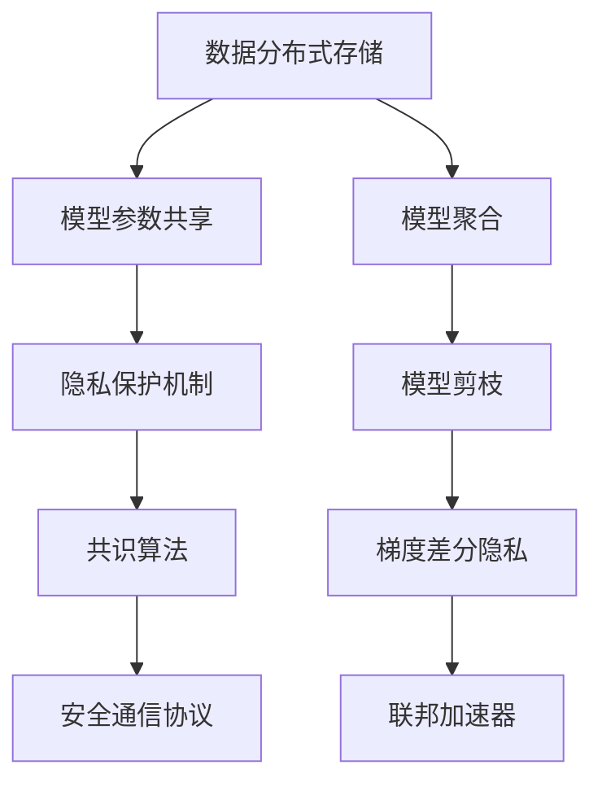

                 

## 1. 背景介绍

### 1.1 问题由来

随着人工智能技术的快速发展，数据的价值愈发凸显，数据在智能算法中扮演着至关重要的角色。然而，数据的分布往往是分散的，由多个组织持有，这些组织由于业务隐私保护的需求，不愿意直接共享原始数据。传统的集中式数据分析方法无法满足这一需求，使得数据的价值难以被充分利用。为了解决这一问题，联邦学习（Federated Learning, FL）应运而生。

联邦学习是一种分布式机器学习方法，它允许多个数据持有者在不共享原始数据的前提下，通过各自的数据本地训练模型参数，实现全局模型的更新和优化。相比于传统的集中式训练方法，联邦学习在保护隐私、确保数据安全方面具有显著优势，因此在医疗、金融、电信等数据敏感领域得到了广泛应用。

### 1.2 问题核心关键点

联邦学习在隐私保护数据分析中的应用，关键在于如何在数据分散的情况下，实现多个组织之间的跨组织协作，从而共享模型更新，提升整体模型的性能。以下是核心关键点：

- **数据分布式存储**：数据在多个组织本地存储，不集中到某个中心点。
- **模型参数共享**：各个组织本地训练的模型参数在联邦聚合后，共享给其他组织，实现全局模型优化。
- **隐私保护机制**：通过加密、差分隐私等手段，确保在数据传输和共享过程中，不泄露敏感数据。
- **共识算法**：解决分布式系统中各个组织间的协调问题，确保模型更新的一致性。
- **安全通信协议**：保护模型参数传输过程中的机密性和完整性，防止数据泄露和篡改。

这些关键点共同构成了联邦学习的基本框架，使得各组织能够在保护隐私的前提下，共同提升模型的性能。

## 2. 核心概念与联系

### 2.1 核心概念概述

为了更好地理解联邦学习在隐私保护数据分析中的应用，本节将介绍几个密切相关的核心概念：

- **联邦学习**：一种分布式机器学习方法，允许多个数据持有者在不共享原始数据的前提下，通过本地训练模型参数，实现全局模型的更新和优化。
- **模型聚合**：多个组织本地训练的模型参数通过某种机制汇总，生成全局模型更新。
- **差分隐私**：一种隐私保护技术，通过对模型训练过程中的噪声引入，确保个体数据的隐私不被泄露。
- **安全多方计算**：一种密码学技术，允许多方在不泄露各自输入的情况下，计算任意函数值。
- **模型剪枝**：一种参数压缩技术，通过移除不重要的参数，减少模型的存储空间和计算量。
- **梯度差分隐私**：一种差分隐私机制，在梯度更新过程中引入噪声，实现隐私保护。
- **联邦加速器**：一种硬件加速设备，如FedML（Federated Learning Acceleration and Model Pruning），优化联邦学习的训练过程，提升效率。

这些核心概念之间的逻辑关系可以通过以下Mermaid流程图来展示：



这个流程图展示了大规模隐私保护数据分析中联邦学习的核心概念及其之间的关系：

1. 数据分布式存储，确保数据的安全性和隐私性。
2. 模型参数共享，实现全局模型的更新和优化。
3. 隐私保护机制，防止数据在传输和共享过程中的泄露。
4. 共识算法，协调多个组织间的训练过程。
5. 安全通信协议，保护模型参数的机密性和完整性。
6. 模型剪枝，压缩模型参数，减少存储空间和计算量。
7. 梯度差分隐私，引入噪声保护个体数据的隐私。
8. 联邦加速器，优化训练过程，提升联邦学习效率。

这些概念共同构成了联邦学习在隐私保护数据分析中的应用框架，使得各组织能够在保护隐私的前提下，实现数据的跨组织协作和共享。

## 3. 核心算法原理 & 具体操作步骤

### 3.1 算法原理概述

联邦学习在隐私保护数据分析中的应用，本质是一种分布式机器学习算法。其核心思想是：通过多个组织本地训练模型参数，将各个组织的模型更新汇总为全局模型更新，从而提升整体模型的性能。

具体来说，假设每个组织拥有本地数据集 $D_i$，其中 $i$ 表示不同的组织。每个组织使用本地数据集 $D_i$ 训练模型 $M_i$，并通过某种机制汇总模型更新，生成全局模型更新 $W^t$。其中 $t$ 表示当前的训练轮次。通过不断更新全局模型，各组织可以共同提升模型的性能。

联邦学习的优化目标是最小化全局损失函数，即：

$$
\min_{W^t} \sum_{i=1}^N \mathcal{L}_i(W^t)
$$

其中 $\mathcal{L}_i$ 表示组织 $i$ 的损失函数。

### 3.2 算法步骤详解

联邦学习在隐私保护数据分析中的应用，主要包括以下几个关键步骤：

**Step 1: 数据分布式存储与模型初始化**

- 确定参与联邦学习的各个组织，并分配本地数据集 $D_i$。
- 在每个组织本地初始化一个相同结构的模型 $M_i$。

**Step 2: 本地模型训练**

- 在每个组织本地，使用本地数据集 $D_i$ 训练模型 $M_i$，并计算本地梯度 $g_i^t$。
- 对本地梯度 $g_i^t$ 进行差分隐私处理，生成噪声扰动的梯度 $\tilde{g}_i^t$。

**Step 3: 模型参数汇总**

- 通过某种机制汇总各个组织的噪声扰动的梯度 $\tilde{g}_i^t$，生成全局梯度 $\tilde{G}^t$。
- 更新全局模型参数 $W^t$，使其沿着全局梯度 $\tilde{G}^t$ 方向移动。

**Step 4: 参数聚合**

- 在每个组织本地，使用全局模型参数 $W^t$ 更新本地模型 $M_i$。
- 重复执行本地模型训练和模型参数汇总过程，直至满足预设的训练轮数或性能指标。

### 3.3 算法优缺点

联邦学习在隐私保护数据分析中的应用具有以下优点：

- 保护隐私：各组织在不共享原始数据的情况下，仍然能够共同提升模型的性能。
- 减少数据移动：数据不离开本地，减少了数据传输和存储成本。
- 降低数据泄露风险：通过差分隐私等技术，确保数据隐私不被泄露。

同时，联邦学习也存在一些缺点：

- 通信开销较大：每次模型参数更新都需要通过网络传输，增加了通信开销。
- 模型收敛速度较慢：由于参数更新频率较低，模型收敛速度较慢。
- 存在网络攻击风险：如恶意组织篡改通信数据，破坏模型训练。
- 难以处理异质数据：各组织的本地数据集可能存在差异，难以统一处理。

尽管存在这些缺点，但联邦学习在隐私保护数据分析中的应用具有不可替代的优势，得到了广泛的应用。

### 3.4 算法应用领域

联邦学习在隐私保护数据分析中的应用，主要包括以下几个领域：

- **医疗数据分析**：多个医疗机构共享病人数据，共同训练医疗诊断模型，提升疾病诊断的准确性。
- **金融风控**：银行等金融机构共享客户数据，联合训练信用评估模型，提升风险预测的准确性。
- **电信网络优化**：多个电信运营商共享用户数据，联合训练网络优化模型，提升网络性能。
- **智能制造**：多个制造企业共享生产线数据，联合训练生产优化模型，提升生产效率。
- **智能交通**：多个交通管理部门共享交通数据，联合训练交通优化模型，提升交通管理效率。

这些领域中，联邦学习的应用为数据的跨组织协作提供了新的解决方案，提升了各组织的模型性能和数据利用效率。

## 4. 数学模型和公式 & 详细讲解 & 举例说明

### 4.1 数学模型构建

在联邦学习中，我们通常使用梯度下降算法来更新全局模型参数。假设每个组织本地训练的模型参数为 $m_i^t$，本地梯度为 $g_i^t$，差分隐私处理后的噪声扰动的梯度为 $\tilde{g}_i^t$，全局模型参数为 $W^t$。则梯度下降算法的更新公式为：

$$
W^{t+1} = W^t - \eta \sum_{i=1}^N \tilde{g}_i^t
$$

其中 $\eta$ 为学习率。

### 4.2 公式推导过程

假设每个组织本地数据集 $D_i$ 的损失函数为 $\mathcal{L}_i(m_i^t; x)$，其中 $x$ 表示样本。则本地梯度为：

$$
g_i^t = \nabla_{m_i^t} \mathcal{L}_i(m_i^t; x)
$$

差分隐私处理的噪声扰动的梯度为：

$$
\tilde{g}_i^t = g_i^t + \epsilon
$$

其中 $\epsilon$ 为噪声向量，通常采用拉普拉斯分布。则全局梯度为：

$$
\tilde{G}^t = \sum_{i=1}^N \tilde{g}_i^t
$$

全局模型参数更新公式为：

$$
W^{t+1} = W^t - \eta \tilde{G}^t
$$

### 4.3 案例分析与讲解

以医疗数据分析为例，展示联邦学习的应用过程。

假设参与联邦学习的医院共有 $N=3$ 家，分别持有病人数据集 $D_1, D_2, D_3$。每家医院使用本地数据集训练模型 $m_i^t$，并计算本地梯度 $g_i^t$。对本地梯度进行差分隐私处理，生成噪声扰动的梯度 $\tilde{g}_i^t$。通过某种机制汇总全局梯度 $\tilde{G}^t$，更新全局模型参数 $W^t$。最后，在每家医院本地更新本地模型 $m_i^{t+1}$，得到全局模型 $W^{t+1}$。

具体步骤如下：

1. 初始化模型参数 $m_i^0$，设置学习率 $\eta$ 和差分隐私参数 $\epsilon$。
2. 在每家医院本地，使用本地数据集 $D_i$ 训练模型 $m_i^t$，并计算本地梯度 $g_i^t$。
3. 对本地梯度进行差分隐私处理，生成噪声扰动的梯度 $\tilde{g}_i^t$。
4. 通过某种机制汇总全局梯度 $\tilde{G}^t$。
5. 更新全局模型参数 $W^t$，得到 $W^{t+1}$。
6. 在每家医院本地，使用全局模型参数 $W^{t+1}$ 更新本地模型 $m_i^{t+1}$。
7. 重复执行步骤2-6，直至满足预设的训练轮数或性能指标。

## 5. 项目实践：代码实例和详细解释说明

### 5.1 开发环境搭建

在进行联邦学习实践前，我们需要准备好开发环境。以下是使用Python进行TensorFlow联邦学习开发的环境配置流程：

1. 安装Anaconda：从官网下载并安装Anaconda，用于创建独立的Python环境。

2. 创建并激活虚拟环境：
```bash
conda create -n fl-env python=3.8 
conda activate fl-env
```

3. 安装TensorFlow：根据CUDA版本，从官网获取对应的安装命令。例如：
```bash
conda install tensorflow tensorflow-gpu -c conda-forge
```

4. 安装联邦学习相关库：
```bash
pip install federated-learning
```

5. 安装各类工具包：
```bash
pip install numpy pandas scikit-learn matplotlib tqdm jupyter notebook ipython
```

完成上述步骤后，即可在`fl-env`环境中开始联邦学习实践。

### 5.2 源代码详细实现

下面我们以医疗数据分析为例，给出使用TensorFlow联邦学习进行本地模型训练和参数汇总的PyTorch代码实现。

首先，定义数据加载函数：

```python
import tensorflow as tf
from tensorflow_federated import server
from tensorflow_federated import dataset as tfds

def load_data(tfds_id):
    def dataset_fn():
        return tfds.load(tfds_id, with_info=True, as_supervised=True)
    return dataset_fn
```

然后，定义模型和优化器：

```python
import tensorflow_federated as tff
from tensorflow.keras import layers, models

def build_model(input_shape):
    model = models.Sequential([
        layers.Dense(64, activation='relu', input_shape=input_shape),
        layers.Dense(1)
    ])
    return model

def create_optimizer(model):
    optimizer = tf.keras.optimizers.Adam()
    return optimizer
```

接着，定义本地模型训练和参数汇总函数：

```python
def train_model(model, optimizer, dataset_fn, num_epochs, batch_size, num_clients):
    server = server.create_server()

    def local_dataset_fn(data):
        return dataset_fn(data).shuffle(buffer_size=1000).batch(batch_size)

    # 定义本地训练函数
    def local_train_fn(model, optimizer, batch_dataset):
        losses = []
        for batch in batch_dataset:
            features, labels = batch
            with tf.GradientTape() as tape:
                predictions = model(features)
                loss = tf.keras.losses.mean_squared_error(labels, predictions)
            gradients = tape.gradient(loss, model.trainable_variables)
            optimizer.apply_gradients(zip(gradients, model.trainable_variables))
            losses.append(loss.numpy())
        return losses

    # 定义全局参数聚合函数
    def aggregate_gradients(gradient_list):
        aggregated_gradients = []
        for i in range(len(model.weights)):
            aggregated_gradients.append(sum(gradient_list[i]))
        return aggregated_gradients

    # 训练过程
    for epoch in range(num_epochs):
        client_data = server.next()
        local_dataset = local_dataset_fn(client_data)

        # 本地模型训练
        local_train_fn(model, optimizer, local_dataset)

        # 参数汇总
        gradients = server.get_gradients()
        aggregated_gradients = aggregate_gradients(gradients)

        # 更新全局模型参数
        for i, weight in enumerate(model.weights):
            weight.assign(weight - optimizer.get_lr() * aggregated_gradients[i])

    server.stop()
```

最后，启动联邦学习训练流程：

```python
model = build_model(input_shape=(1,))
optimizer = create_optimizer(model)

# 设置参数
num_epochs = 10
batch_size = 32
num_clients = 3

# 数据集
dataset_fn = load_data('boston_housing')
data = dataset_fn()

# 训练模型
train_model(model, optimizer, dataset_fn, num_epochs, batch_size, num_clients)
```

以上就是使用TensorFlow进行联邦学习实践的完整代码实现。可以看到，通过TensorFlow提供的联邦学习API，我们可以方便地进行本地模型训练和参数汇总。

### 5.3 代码解读与分析

让我们再详细解读一下关键代码的实现细节：

**load_data函数**：
- 定义数据加载函数，接收数据集ID，返回数据加载函数。
- 使用TensorFlow联邦学习的数据集API，加载指定ID的数据集。

**build_model和create_optimizer函数**：
- 定义模型和优化器函数，用于本地模型训练。
- 使用TensorFlow的Keras API，定义一个简单的线性回归模型，并使用Adam优化器。

**train_model函数**：
- 定义联邦学习训练过程的各个环节。
- 创建TensorFlow联邦学习的服务器，用于分布式训练。
- 定义本地训练函数local_train_fn，用于在每个客户端本地训练模型。
- 定义全局参数聚合函数aggregate_gradients，用于汇总客户端的模型梯度。
- 在每个训练轮次，从服务器获取客户端数据，进行本地模型训练和参数汇总。
- 更新全局模型参数，并通过服务器发送更新。
- 重复执行训练过程，直至满足预设的训练轮数或性能指标。

可以看到，TensorFlow联邦学习API使得联邦学习的实现变得简洁高效。开发者可以将更多精力放在数据处理、模型改进等高层逻辑上，而不必过多关注底层的实现细节。

当然，工业级的系统实现还需考虑更多因素，如模型的保存和部署、超参数的自动搜索、更灵活的共识算法等。但核心的联邦学习流程基本与此类似。

## 6. 实际应用场景

### 6.1 智能医疗

联邦学习在智能医疗领域具有广泛的应用前景。医疗机构共享病人数据，共同训练疾病诊断和药物研发模型，可以提升诊断的准确性和药物研发的效率。例如，通过联合多个医院的数据，训练一个基于深度学习的疾病诊断模型，可以更准确地预测病人的疾病类型，为医生提供诊断参考。此外，联邦学习还可以用于药物分子设计、基因组数据分析等领域，加速生物医药领域的创新。

### 6.2 金融风控

金融行业中的数据敏感性要求较高，联邦学习可以在保障数据隐私的前提下，实现跨银行、跨机构的风控模型优化。通过联合多家银行的客户数据，训练一个风险预测模型，可以更准确地评估客户的信用风险，提高银行的贷款审批效率和准确性。联邦学习还可以用于市场预测、反欺诈检测等领域，提升金融机构的业务能力。

### 6.3 电信网络优化

电信运营商共享用户数据，联合训练网络优化模型，可以提升网络性能和用户体验。例如，通过联合多个电信运营商的用户数据，训练一个基于深度学习的网络优化模型，可以更准确地预测网络拥塞情况，优化网络资源分配，提升网络稳定性和传输速度。联邦学习还可以用于用户行为分析、内容推荐等领域，提升电信运营商的业务能力。

### 6.4 智能制造

智能制造领域中的数据往往分布在不同的制造企业和生产线中。通过联合多家制造企业的数据，训练一个基于深度学习的生产优化模型，可以更准确地预测生产线的运行状态，优化生产计划和资源分配，提升生产效率和产品质量。联邦学习还可以用于供应链管理、质量控制等领域，提升制造企业的业务能力。

### 6.5 智能交通

交通管理部门共享交通数据，联合训练交通优化模型，可以提升交通管理效率和安全性。例如，通过联合多个城市的交通数据，训练一个基于深度学习的交通优化模型，可以更准确地预测交通流量，优化交通信号灯和路网结构，缓解交通拥堵，减少交通事故。联邦学习还可以用于智能交通监控、车辆管理等领域，提升交通管理的智能化水平。

## 7. 工具和资源推荐

### 7.1 学习资源推荐

为了帮助开发者系统掌握联邦学习的理论基础和实践技巧，这里推荐一些优质的学习资源：

1. 《Federated Learning: Concepts and Applications》系列博文：由联邦学习专家撰写，深入浅出地介绍了联邦学习的概念、原理和应用。

2. Google TensorFlow Federated官方文档：TensorFlow联邦学习官方文档，提供了丰富的教程和样例代码，是联邦学习开发的必备资料。

3. 《Federated Learning: Concepts and Applications》书籍：联邦学习领域的经典教材，全面介绍了联邦学习的原理和应用，适合深入学习。

4. Stanford CS 224W《Machine Learning in Production》课程：斯坦福大学开设的机器学习在生产应用中的课程，涵盖联邦学习的原理和实践，适合系统学习。

5. UCI机器学习数据集：包含大量联邦学习相关的数据集，如医疗数据、金融数据、交通数据等，适合联邦学习研究和实验。

通过对这些资源的学习实践，相信你一定能够快速掌握联邦学习的精髓，并用于解决实际的隐私保护数据分析问题。

### 7.2 开发工具推荐

高效的开发离不开优秀的工具支持。以下是几款用于联邦学习开发的常用工具：

1. TensorFlow：由Google主导开发的开源深度学习框架，生产部署方便，适合大规模工程应用。TensorFlow提供了丰富的联邦学习API和工具，是联邦学习开发的主流选择。

2. PyTorch federated：由Facebook开发的PyTorch联邦学习工具，易于使用，支持各种分布式系统。

3. FederatedAI：由Apache软件基金会支持的联邦学习开源项目，提供丰富的联邦学习框架和工具。

4. FederatedX：由Baidu开发的联邦学习框架，支持多种分布式系统和硬件平台，提供丰富的联邦学习模型和算法。

5. Tune：由Facebook开发的超参数优化工具，支持TensorFlow和PyTorch联邦学习，可以自动化搜索最优的超参数组合。

合理利用这些工具，可以显著提升联邦学习的开发效率，加快创新迭代的步伐。

### 7.3 相关论文推荐

联邦学习在隐私保护数据分析中的应用，已经取得了丰富的研究成果。以下是几篇奠基性的相关论文，推荐阅读：

1. TensorFlow Federated: A TensorFlow-Based System for Collaborative Machine Learning: 介绍TensorFlow Federated系统的设计理念和应用场景。

2. federated averaging: Scaling and Speeding up Distributed Machine Learning: 提出联邦学习中的平均聚合方法，解决了跨组织协作中的协调问题。

3. Differential Privacy: 介绍差分隐私的基本概念和实现方法，是联邦学习中常用的隐私保护技术。

4. Secure Multi-party Computation in Machine Learning: 介绍安全多方计算的基本概念和应用场景，是联邦学习中常用的加密技术。

5. A federated learning system for heterogeneous data: 提出一个适用于异质数据的联邦学习系统，支持不同类型的数据和模型。

这些论文代表了大规模隐私保护数据分析中联邦学习的最新进展。通过学习这些前沿成果，可以帮助研究者把握学科前进方向，激发更多的创新灵感。

## 8. 总结：未来发展趋势与挑战

### 8.1 总结

本文对联邦学习在隐私保护数据分析中的应用进行了全面系统的介绍。首先阐述了联邦学习的背景和意义，明确了其在隐私保护数据分析中的独特价值。其次，从原理到实践，详细讲解了联邦学习的数学原理和关键步骤，给出了联邦学习任务开发的完整代码实例。同时，本文还广泛探讨了联邦学习在医疗、金融、电信等数据敏感领域的应用前景，展示了联邦学习范式的巨大潜力。此外，本文精选了联邦学习的各类学习资源，力求为读者提供全方位的技术指引。

通过本文的系统梳理，可以看到，联邦学习在隐私保护数据分析中的应用，已经成为数据跨组织协作的重要手段。通过分布式训练，各组织在不共享原始数据的情况下，仍然能够共同提升模型的性能，极大地拓展了数据的应用范围。未来，伴随联邦学习技术的不断演进，其在各行业的落地应用将更加广泛，为数据的共享和协同建模提供新的解决方案。

### 8.2 未来发展趋势

展望未来，联邦学习在隐私保护数据分析中的应用将呈现以下几个发展趋势：

1. 模型异质性处理：未来联邦学习将支持更多的模型类型和架构，适应更复杂的数据分布。

2. 联邦算法优化：未来联邦学习将开发更高效的共识算法和参数聚合方法，提升训练速度和模型精度。

3. 联邦加速器普及：未来联邦学习将普及到更多的硬件设备上，如FedML（Federated Learning Acceleration and Model Pruning），优化联邦学习的训练过程。

4. 跨域联邦学习：未来联邦学习将支持跨域数据融合，实现不同类型数据和模型的协同训练。

5. 联邦区块链应用：未来联邦学习将结合区块链技术，实现更加透明、安全的数据共享和协作。

6. 隐私保护技术提升：未来联邦学习将进一步提升隐私保护技术，如差分隐私、安全多方计算等，保护数据的隐私和安全。

以上趋势凸显了联邦学习在隐私保护数据分析中的广阔前景。这些方向的探索发展，将进一步提升联邦学习模型的性能和应用范围，为数据跨组织协作提供新的解决方案。

### 8.3 面临的挑战

尽管联邦学习在隐私保护数据分析中的应用已经取得了一定的进展，但在迈向更加智能化、普适化应用的过程中，它仍面临诸多挑战：

1. 通信开销较大：联邦学习需要频繁的网络通信，增加了系统的资源消耗。

2. 模型收敛速度较慢：由于参数更新频率较低，模型收敛速度较慢。

3. 异质数据处理困难：各组织的本地数据集可能存在差异，难以统一处理。

4. 分布式系统复杂：联邦学习涉及多个组织和设备，系统设计和实现复杂。

5. 隐私保护技术挑战：差分隐私、安全多方计算等隐私保护技术，仍存在一些理论和实践难题。

尽管存在这些挑战，但联邦学习在隐私保护数据分析中的应用具有不可替代的优势，得到了广泛的应用。未来，需要通过技术创新和工程实践，逐步克服这些挑战，实现联邦学习的进一步发展。

### 8.4 研究展望

面对联邦学习面临的种种挑战，未来的研究需要在以下几个方面寻求新的突破：

1. 探索联邦学习与分布式深度学习的结合：通过分布式深度学习技术，优化联邦学习的训练过程，提升训练效率和模型精度。

2. 研究联邦学习与边缘计算的结合：通过边缘计算技术，将联邦学习模型的计算任务分散到本地设备，降低通信开销和网络延迟。

3. 融合联邦学习与人工智能：将联邦学习与其他人工智能技术进行融合，如自然语言处理、计算机视觉等，提升联邦学习模型的表现力。

4. 引入联邦学习与区块链技术：通过区块链技术，实现更加透明、安全的数据共享和协作，保护数据的隐私和安全。

5. 开发联邦学习算法优化器：开发更加高效的联邦学习算法优化器，提升联邦学习的训练速度和模型精度。

这些研究方向的探索，必将引领联邦学习在隐私保护数据分析中迈向更高的台阶，为数据的跨组织协作提供新的解决方案。面向未来，联邦学习还需要与其他人工智能技术进行更深入的融合，共同推动数据科学的进步。

## 9. 附录：常见问题与解答

**Q1：联邦学习是否适用于所有数据类型？**

A: 联邦学习适用于结构化数据、半结构化数据和图像数据等类型的数据。但对于文本数据、音频数据等非结构化数据，需要进行预处理和特征提取，才能适配联邦学习框架。

**Q2：联邦学习在异质数据处理中存在哪些难点？**

A: 异质数据处理是联邦学习面临的主要难点。不同类型的数据可能需要不同的特征提取和模型选择，因此如何处理异质数据，实现跨领域的数据协同训练，是未来联邦学习的研究方向之一。

**Q3：联邦学习中的共识算法有哪些？**

A: 联邦学习中的共识算法主要包括基于平均的共识算法（如FedAvg）、基于梯度的共识算法（如Scaffold）、基于共识的共识算法（如Federated Averaging with Consensus）等。不同的共识算法适用于不同的应用场景，需要根据具体问题选择合适的算法。

**Q4：联邦学习中的差分隐私如何实现？**

A: 差分隐私通过在梯度更新过程中引入噪声，保护个体数据的隐私。常见的差分隐私机制包括拉普拉斯差分隐私、高斯差分隐私等。具体实现时，需要在梯度计算过程中，对每个梯度向量添加噪声向量，确保梯度的隐私性。

**Q5：联邦学习中如何处理模型的稀疏性？**

A: 联邦学习中的模型往往存在稀疏性，即只有一部分参数参与了梯度更新。为了处理模型的稀疏性，可以采用参数压缩技术，如剪枝、量化、低秩分解等，减小模型的存储空间和计算量。

这些问题的解答，有助于开发者更好地理解和应用联邦学习技术，进一步拓展其在隐私保护数据分析中的应用范围。

---

作者：禅与计算机程序设计艺术 / Zen and the Art of Computer Programming

