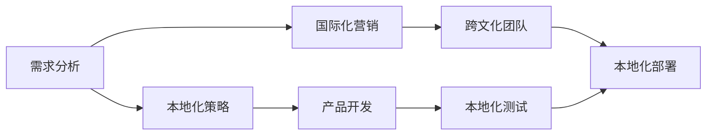

                 

# 自动化创业中的国际化战略

在当前全球化和技术飞速发展的背景下，自动化创业不仅是企业追求效率和创新的重要手段，更是拓展国际市场、实现全球化布局的关键战略。本文将从自动化创业的背景、核心概念、战略规划、实施步骤、案例分析、应用展望、工具和资源推荐、总结与未来发展趋势等多个维度，全面阐述自动化创业中的国际化战略，希望能为有意拓展海外市场的创业者提供有益的参考和建议。

## 1. 背景介绍

### 1.1 问题由来

随着科技的不断进步，自动化技术在各行各业的应用日益普及。自动化创业，即利用自动化技术创新创业模式，已经成为企业提升竞争力、抢占市场先机的有力武器。特别是近年来，人工智能、机器学习、大数据等技术的迅猛发展，为自动化创业提供了强有力的技术支撑。

然而，全球化的自动化创业并非易事。国际市场的复杂性、文化差异、法律法规等诸多因素，都可能成为制约企业国际化的障碍。如何在全球化竞争中保持优势，实现可持续的发展，是每个自动化创业者必须面对的挑战。

### 1.2 问题核心关键点

在自动化创业中实施国际化战略，核心关键点包括：
1. **市场需求定位**：准确识别目标市场的潜在需求，确定自动化解决方案的适用性。
2. **文化差异适应**：理解和尊重不同文化背景下的商业习惯和用户偏好，实现产品本地化。
3. **法律法规遵循**：熟悉并遵守目标市场的法律法规，确保合规运营。
4. **成本效益分析**：在全球化布局中权衡成本与收益，制定合理的市场进入策略。
5. **跨文化团队建设**：组建具备多元文化背景的团队，提升跨文化沟通和协作能力。
6. **持续创新能力**：保持技术创新和产品迭代，不断优化自动化解决方案。

## 2. 核心概念与联系

### 2.1 核心概念概述

为了更好地理解自动化创业中的国际化战略，本节将介绍几个关键概念：

- **自动化创业**：利用自动化技术创新创业模式，通过优化流程、提高效率、降低成本等方式，实现企业发展。
- **国际化战略**：企业在全球化背景下，通过市场开拓、品牌建设、资源配置等手段，实现全球化的商业布局和发展。
- **需求分析**：识别目标市场的需求特点，分析潜在的商业机会。
- **本地化策略**：根据目标市场的文化、语言、法规等环境特点，调整产品和服务的本地化适应性。
- **跨文化管理**：在多元文化背景下，通过有效沟通和协作，提升团队和业务的国际竞争力。

这些概念之间存在紧密的联系，共同构成了自动化创业中的国际化战略框架。

### 2.2 核心概念原理和架构的 Mermaid 流程图



这个流程图展示了自动化创业中从需求分析到本地化部署的主要步骤。需求分析为产品开发提供指导，本地化策略指导产品开发和测试，跨文化团队促进本地化部署，而国际化营销则是实现全球市场覆盖的关键手段。

## 3. 核心算法原理 & 具体操作步骤

### 3.1 算法原理概述

自动化创业中的国际化战略，本质上是通过自动化技术和全球市场环境的分析，制定和执行一套系统化的策略，以实现企业在全球市场的布局和发展。这一过程涉及多个方面的算法和操作，包括需求分析、本地化策略制定、产品开发、测试和部署等。

### 3.2 算法步骤详解

1. **需求分析**：
   - 收集和分析目标市场的数据，如市场需求、竞争情况、用户行为等。
   - 识别潜在用户和用户痛点，确定自动化解决方案的适用性和价值。
   - 使用数据分析和预测模型，评估市场需求潜力和发展趋势。

2. **本地化策略制定**：
   - 研究目标市场的文化、语言、法律法规等环境因素，识别本地化需求。
   - 制定产品本地化策略，包括界面设计、功能优化、语言翻译等。
   - 分析竞争对手的本地化策略，调整和优化自身的国际化战略。

3. **产品开发**：
   - 根据需求分析和本地化策略，设计自动化解决方案的架构和功能。
   - 选择适当的自动化技术和工具，开发和测试产品原型。
   - 结合敏捷开发方法，进行快速迭代和优化。

4. **本地化测试**：
   - 在目标市场进行产品测试，验证其本地化适应性。
   - 收集用户反馈，识别和修复潜在问题。
   - 通过A/B测试等方法，评估不同本地化策略的效果。

5. **本地化部署**：
   - 选择合适的部署平台和方式，如云服务、本地服务器等。
   - 进行市场推广和销售，建立本地用户基础。
   - 监控产品性能和用户反馈，不断优化和改进产品。

### 3.3 算法优缺点

**优点**：
1. **提高效率和成本效益**：自动化技术的应用可以大幅提升业务流程效率，降低运营成本。
2. **扩大市场份额**：全球化布局有助于企业在全球市场开拓新的业务机会，扩大市场份额。
3. **增强竞争力**：通过技术创新和产品优化，保持企业在全球市场的竞争力。
4. **提升品牌价值**：国际化战略可以增强企业品牌形象，提升国际知名度。

**缺点**：
1. **复杂度增加**：国际化涉及多文化和多法规的适应，增加了运营复杂度。
2. **高风险**：全球化布局可能面临国际政治、经济、社会等风险。
3. **资源需求大**：国际化需要大量资源投入，包括资金、人力、技术等。
4. **文化冲突**：不同文化背景可能带来沟通和协作障碍。

### 3.4 算法应用领域

自动化创业中的国际化战略不仅适用于传统的制造业和服务业，也广泛应用于医疗、金融、教育、农业等多个领域。例如：

- **医疗领域**：通过自动化医疗设备和服务，提升医疗效率和质量，满足不同地区的医疗需求。
- **金融领域**：利用自动化技术优化金融产品设计和服务流程，提升金融服务水平和市场竞争力。
- **教育领域**：开发自动化教育平台和工具，实现个性化教育和跨文化教学。
- **农业领域**：通过自动化设备和管理系统，提高农业生产效率和精准度。

## 4. 数学模型和公式 & 详细讲解 & 举例说明

### 4.1 数学模型构建

自动化创业中的国际化战略，可以通过多种数学模型和公式进行量化分析和优化。以下是一个简化的数学模型：

**需求模型**：
\[ D = f(C, E, T, G) \]
其中，$D$ 为市场需求，$C$ 为用户需求，$E$ 为经济环境，$T$ 为技术环境，$G$ 为政策法规。

**成本效益模型**：
\[ R = \frac{P - C}{C} \]
其中，$R$ 为收益率，$P$ 为产品价格，$C$ 为成本。

**风险模型**：
\[ R = \sum_{i=1}^n \alpha_i \cdot R_i \]
其中，$R$ 为总风险，$\alpha_i$ 为各风险因素的权重，$R_i$ 为各风险因素的风险值。

### 4.2 公式推导过程

**需求模型推导**：
\[ D = C \cdot F(E, T, G) \]
其中，$C$ 为需求系数，$F$ 为环境影响函数，包括经济、技术和政策法规等因素。

**成本效益模型推导**：
\[ R = \frac{P - C}{C} = 1 - \frac{C}{P} \]
即收益率为成本占产品价格的百分比。

**风险模型推导**：
\[ R = \sum_{i=1}^n \alpha_i \cdot R_i \]
其中，$\alpha_i$ 为风险权重，可以是历史数据、专家评估等。

### 4.3 案例分析与讲解

以一家自动化医疗设备公司为例，分析其国际化战略的数学模型应用：

- **需求模型应用**：通过收集全球医疗市场数据，利用回归分析确定需求系数$C$，并建立环境影响函数$F$，预测全球市场需求$D$。
- **成本效益模型应用**：通过市场调研，确定不同国家和地区的成本$C$和产品价格$P$，计算各地收益率$R$。
- **风险模型应用**：通过专家评估和市场分析，确定各风险因素权重$\alpha_i$和风险值$R_i$，综合评估总风险$R$。

## 5. 项目实践：代码实例和详细解释说明

### 5.1 开发环境搭建

在自动化创业中实施国际化战略，需要一个高效的开发环境。以下是搭建开发环境的示例：

1. **环境准备**：
   - 安装Python、Jupyter Notebook等开发工具。
   - 安装数据科学库，如Pandas、NumPy、Scikit-learn等。
   - 安装自动化开发工具，如Jenkins、GitLab等。

2. **数据准备**：
   - 收集和整理目标市场的数据，包括市场规模、用户行为、竞争情况等。
   - 对数据进行清洗和预处理，确保数据质量和完整性。

3. **模型开发**：
   - 使用Python编写模型代码，进行需求分析、本地化策略制定、产品开发等。
   - 利用Jupyter Notebook进行模型调试和可视化展示。

4. **测试和部署**：
   - 在目标市场进行模型测试，验证其效果和稳定性。
   - 使用自动化工具进行模型部署，建立本地化服务。

### 5.2 源代码详细实现

以下是一个简化的自动化创业国际化战略的Python代码示例：

```python
import pandas as pd
from sklearn.linear_model import LinearRegression
from sklearn.metrics import r2_score

# 需求分析
data = pd.read_csv('demand_data.csv')
C = data['C']  # 需求系数
E = data['E']  # 经济环境
T = data['T']  # 技术环境
G = data['G']  # 政策法规

# 需求模型
model = LinearRegression()
model.fit([E, T, G], C)
D = model.predict([E, T, G])

# 成本效益模型
P = data['P']  # 产品价格
C = data['C']  # 成本
R = (P - C) / C

# 风险模型
alpha = [0.2, 0.3, 0.5]  # 风险权重
Ri = [data['Ri'] for i in range(len(data))]
R = sum(alpha[i] * Ri[i] for i in range(len(data)))

# 输出结果
print('市场需求预测结果：', D)
print('收益率：', R)
print('总风险：', R)
```

### 5.3 代码解读与分析

代码示例中，首先使用Pandas库读取市场需求数据，并提取需求系数$C$和环境因素$E$、$T$、$G$。通过LinearRegression模型预测市场需求$D$。

接着，使用成本效益模型计算各地收益率$R$，结合风险模型评估总风险$R$。

### 5.4 运行结果展示

运行上述代码，可以输出市场需求预测结果、收益率和总风险，为国际化战略提供数据支持。

## 6. 实际应用场景

### 6.1 智能制造

一家智能制造企业可以利用自动化技术优化生产流程，提高生产效率和产品质量。通过国际化战略，该企业可以在全球市场推广其智能制造解决方案，扩大市场份额，提升品牌知名度。

### 6.2 跨境电商

跨境电商企业通过自动化技术实现物流、仓储、客服等环节的智能化管理。通过国际化战略，该企业可以进入多个国家和地区的市场，提供本地化服务，提升用户体验和销售业绩。

### 6.3 智能交通

智能交通领域通过自动化技术优化交通管理，提升道路通行效率和安全性。通过国际化战略，该企业可以在全球城市推广其解决方案，改善城市交通状况，提升城市形象。

## 7. 工具和资源推荐

### 7.1 学习资源推荐

1. **《Python数据分析实战》**：一本介绍Python数据分析和建模的经典书籍，适合初学者和进阶者。
2. **Coursera《机器学习》课程**：斯坦福大学开设的机器学习课程，涵盖各种算法和模型，适合提高技术能力。
3. **Kaggle竞赛**：参加Kaggle数据科学竞赛，提升数据分析和模型优化能力。
4. **Github开源项目**：通过阅读和贡献Github上的开源项目，学习自动化创业的实践经验。

### 7.2 开发工具推荐

1. **Jupyter Notebook**：用于数据科学和模型开发的交互式开发工具。
2. **Jenkins**：自动化构建和部署工具，提高自动化创业的效率。
3. **GitLab**：代码管理和版本控制工具，支持团队协作和持续集成。
4. **Tableau**：数据可视化工具，帮助企业进行数据驱动决策。

### 7.3 相关论文推荐

1. **《自动化制造：现状、挑战与未来》**：综述自动化制造技术的现状和未来发展方向。
2. **《全球化电子商务的市场进入策略》**：分析跨境电商的全球化市场进入策略和风险管理。
3. **《智能交通系统的自动化技术应用》**：探讨智能交通中的自动化技术应用和未来发展。

## 8. 总结：未来发展趋势与挑战

### 8.1 研究成果总结

自动化创业中的国际化战略，通过需求分析、本地化策略、产品开发、测试和部署等关键步骤，实现企业在全球市场的布局和发展。这一过程涉及需求模型、成本效益模型、风险模型等多种数学模型，需要通过数据科学和机器学习技术进行量化分析和优化。

### 8.2 未来发展趋势

未来，自动化创业中的国际化战略将呈现以下几个趋势：

1. **技术创新加速**：随着人工智能、大数据、物联网等技术的不断发展，自动化创业将迎来更多创新机会。
2. **全球化市场深化**：企业将通过全球化布局，深入拓展新兴市场，提升国际竞争力。
3. **本地化服务提升**：通过本地化策略，提升产品和服务的适应性，提升用户体验。
4. **跨文化管理优化**：提升跨文化沟通和协作能力，增强团队国际竞争力。

### 8.3 面临的挑战

在自动化创业的国际化战略实施过程中，面临以下挑战：

1. **文化差异**：不同文化背景可能带来沟通和协作障碍。
2. **法规合规**：需要熟悉和遵守不同市场的法律法规，避免合规风险。
3. **数据安全**：需要保障数据隐私和安全性，防止数据泄露和滥用。
4. **市场竞争**：面临本地市场的激烈竞争，需要保持技术创新和市场竞争力。

### 8.4 研究展望

未来的研究需要在以下几个方向寻求新的突破：

1. **跨文化数据建模**：开发适用于多元文化背景的数据建模方法，提升需求分析的准确性。
2. **自动化测试优化**：通过自动化测试工具和框架，提升本地化测试的效率和精度。
3. **本地化服务定制**：根据不同市场的特点，定制本地化服务，提升用户体验。
4. **合规和隐私保护**：制定合规和隐私保护策略，确保国际化战略的合法性和安全性。

## 9. 附录：常见问题与解答

**Q1：自动化创业的国际化战略是否适用于所有企业？**

A: 自动化创业的国际化战略适用于拥有一定技术实力和国际市场需求的各类企业。但需要注意的是，不同行业和企业类型可能需要根据自身情况进行调整和优化。

**Q2：实施国际化战略时，应如何选择合适的市场进入策略？**

A: 应综合考虑市场需求、竞争状况、文化差异、法律法规等因素，选择合适的市场进入策略。常用的策略包括直接进入、合资合作、战略联盟等。

**Q3：如何在全球化布局中提升跨文化管理能力？**

A: 建立多元文化背景的团队，加强跨文化培训，提升沟通和协作能力。同时，尊重和理解不同文化背景下的商业习惯和用户偏好，实现产品本地化。

**Q4：实施国际化战略时，应如何平衡成本和收益？**

A: 需要进行详细的成本效益分析，权衡成本和收益，制定合理的市场进入策略。同时，通过自动化技术优化运营流程，降低运营成本，提高效率和收益。

---

作者：禅与计算机程序设计艺术 / Zen and the Art of Computer Programming

