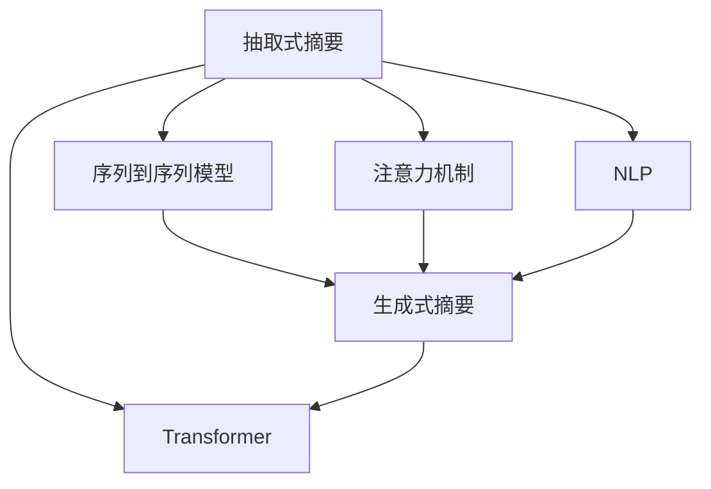

                 

# 自动文本摘要：抽取式vs生成式方法

> 关键词：自动文本摘要, 抽取式方法, 生成式方法, 自然语言处理(NLP), 文本压缩, 信息检索

## 1. 背景介绍

### 1.1 问题由来
随着互联网的普及，信息爆炸成为不争的事实。用户在海量的文本中寻找有价值的信息，无疑是一项巨大的挑战。自动文本摘要(Automatic Text Summarization)技术应运而生，它可以帮助用户快速抓住文本的主要内容，节省时间并提高效率。摘要技术在新闻、科技、法律、商业等领域都有广泛应用。

然而，自动文本摘要的实现方式多种多样，其中以抽取式(summary by extraction)和生成式(summary by generation)为主要路线。两者各有优缺点，适用于不同的应用场景。

### 1.2 问题核心关键点
自动文本摘要的核心在于如何准确且高效地将文本压缩为摘要，同时保留核心信息。抽取式方法和生成式方法提供了两种截然不同的解决思路，具有不同的实现方式和性能指标。

**抽取式方法**通常基于某些规则，从原始文本中抽取关键信息（如实体、关键词、句式等）来构建摘要，适用于对精度要求较高、对文本风格变化不敏感的场景。

**生成式方法**则利用语言模型，通过自动生成文本的方式来构建摘要，适用于对摘要连贯性和流畅性有较高要求、对文本风格变化敏感的场景。

### 1.3 问题研究意义
研究自动文本摘要的技术，有助于理解文本压缩的深层次原理，推动信息检索、内容推荐、智能问答等NLP应用的发展。具体而言，以下几点是其研究意义：

1. **节省时间和精力**：自动文本摘要可以大大减少阅读长篇文本的时间，尤其在信息过载的时代尤为重要。
2. **提升信息检索效率**：摘要可作为文本的精炼版本，提高搜索引擎的召回率和排序质量。
3. **促进内容推荐**：摘要可帮助理解文本的主题和重点，从而更精准地进行内容推荐。
4. **支撑智能问答**：摘要使问答系统能够快速准确地回答用户问题，提升用户体验。
5. **推动教育与培训**：自动摘要技术可帮助学生快速掌握文章的关键信息，促进知识获取和理解。

## 2. 核心概念与联系

### 2.1 核心概念概述

为更好地理解抽取式和生成式自动文本摘要的方法，本节将介绍几个密切相关的核心概念：

- **抽取式摘要**（Extraction-based Summarization）：从原始文本中直接抽取关键信息组成摘要，不涉及生成新的文本。
- **生成式摘要**（Abstraction-based Summarization）：基于自然语言模型生成新的文本摘要，要求生成的文本流畅且连贯。
- **NLP**（Natural Language Processing）：涉及自然语言理解、自然语言生成、文本分类、信息检索等多种技术。
- **序列到序列模型（Seq2Seq）**：一种机器学习模型，广泛应用于文本翻译、摘要生成、对话系统等任务中。
- **注意力机制（Attention Mechanism）**：使模型能够聚焦于文本中重要的部分，提高生成或抽取的准确性。
- **Transformer模型**：一种基于自注意力机制的神经网络模型，在文本处理中表现出卓越的性能。

这些核心概念之间的逻辑关系可以通过以下Mermaid流程图来展示：



这个流程图展示了抽取式和生成式摘要的实现原理及其与NLP相关技术之间的联系：

1. 抽取式摘要通过序列到序列模型和注意力机制，从文本中提取关键信息。
2. 生成式摘要利用Transformer模型，生成流畅连贯的摘要文本。
3. NLP技术为这两种方法提供了基础工具和数据支持。

## 3. 核心算法原理 & 具体操作步骤
### 3.1 算法原理概述

**抽取式摘要**的原理是从文本中直接提取出关键信息，如名词短语、句子等，然后将这些信息按照一定的顺序排列组合，生成摘要。主要包括以下步骤：

1. **文本预处理**：包括分词、去除停用词、词性标注等。
2. **特征提取**：使用TF-IDF、词频统计等方法计算文本中每个词汇的重要性。
3. **摘要生成**：根据特征重要性排序，选择部分关键词或短语组成摘要。

**生成式摘要**的原理是通过自然语言模型，如Seq2Seq、Transformer等，自动生成流畅的文本摘要。主要包括以下步骤：

1. **文本预处理**：同抽取式摘要。
2. **模型初始化**：使用预训练的模型作为初始化参数。
3. **序列生成**：通过模型生成摘要序列，根据生成的文本逐步优化。
4. **摘要后处理**：对生成的文本进行句法分析、修正语序等，保证摘要的连贯性和流畅性。

### 3.2 算法步骤详解

**抽取式摘要**具体步骤包括：

1. **文本预处理**：
   - 使用NLTK、spaCy等工具对文本进行分词、去停用词、词性标注。
   - 统计文本中每个词汇的出现频率和权重，如TF-IDF。

2. **特征提取**：
   - 根据统计信息计算每个词汇的特征得分。
   - 使用贪心算法或优化算法（如EM算法）选择得分最高的词汇组成摘要。

3. **摘要生成**：
   - 对选定的词汇进行排序，生成摘要文本。
   - 使用语言学规则优化摘要的语法和语序。

**生成式摘要**具体步骤包括：

1. **文本预处理**：
   - 同抽取式摘要。
   - 使用预训练的语言模型（如GPT、BERT等）作为初始化参数。

2. **模型初始化**：
   - 使用预训练的Seq2Seq或Transformer模型。
   - 将原始文本作为模型的输入，初始化模型参数。

3. **序列生成**：
   - 模型生成一个初始摘要序列，根据生成结果逐步优化。
   - 通过注意力机制，让模型聚焦于文本中的重要部分。
   - 使用迭代优化算法（如 beam search、贪心搜索等）生成最优摘要。

4. **摘要后处理**：
   - 对生成的文本进行句法分析、修正语序、修正拼写错误等，保证摘要的连贯性和流畅性。

### 3.3 算法优缺点

**抽取式摘要**的主要优点包括：

1. **精度高**：抽取式摘要直接从文本中提取关键信息，避免了生成式方法可能产生的语法错误或语义模糊。
2. **效率高**：生成式摘要需要迭代生成文本，时间成本较高，抽取式摘要则直接选择关键词，速度快。
3. **泛化能力强**：抽取式摘要对于多种文本风格和变化相对不敏感，适用范围广。

主要缺点包括：

1. **灵活性不足**：抽取式摘要可能无法捕捉文本的整体结构和语义连贯性，生成的摘要较为生硬。
2. **缺乏连贯性**：生成的摘要可能缺乏流畅性，读起来不够自然。

**生成式摘要**的主要优点包括：

1. **连贯性好**：生成式摘要通过模型生成的文本连贯性高，读起来自然流畅。
2. **语义理解能力强**：模型能够理解文本的整体结构和语义关系，生成的摘要准确度高。
3. **适用范围广**：适用于多种文本类型和风格，能够生成风格多样的摘要。

主要缺点包括：

1. **效率低**：生成式摘要需要大量计算资源和时间，迭代过程复杂。
2. **依赖预训练模型**：生成式摘要依赖高质量的预训练模型，模型质量直接影响生成效果。
3. **可能产生歧义**：模型生成文本时可能产生歧义或错误，需要后期修正。

### 3.4 算法应用领域

**抽取式摘要**主要应用于以下领域：

1. **新闻摘要**：从大量新闻报道中快速生成摘要，供用户阅读。
2. **科技论文摘要**：提取科研论文的关键信息和结论，便于研究人员和读者理解。
3. **法律文件摘要**：提取合同、协议等法律文本的要点，节省阅读时间。

**生成式摘要**主要应用于以下领域：

1. **文学作品摘要**：生成文学作品的精炼版本，便于读者理解。
2. **学术论文摘要**：生成科研论文的流畅摘要，便于研究人员和读者理解。
3. **商业文档摘要**：生成商业报告、市场分析等文档的摘要，便于决策者快速阅读。

## 4. 数学模型和公式 & 详细讲解 & 举例说明

### 4.1 数学模型构建

**抽取式摘要**的数学模型主要基于统计语言模型，如n-gram模型、TF-IDF等。

假设文本 $T$ 包含 $n$ 个词汇 $t_1, t_2, ..., t_n$，每个词汇的权重为 $w_1, w_2, ..., w_n$，生成的摘要 $S$ 包含 $m$ 个词汇 $s_1, s_2, ..., s_m$，每个词汇的权重为 $u_1, u_2, ..., u_m$。则摘要 $S$ 的评分函数可以表示为：

$$
\text{score}(S) = \sum_{i=1}^m w_i \times u_i
$$

其中，$w_i$ 表示词汇 $t_i$ 的重要性，$u_i$ 表示词汇 $s_i$ 在摘要中的重要性。

**生成式摘要**的数学模型主要基于序列生成模型，如Seq2Seq、Transformer等。

假设生成式摘要模型的输入为 $T$，输出为 $S$，则生成式摘要的目标是最大化以下对数似然函数：

$$
\text{loss}(T, S) = -\sum_{i=1}^n \log P(s_i | s_{i-1}, ..., s_1, t_1, ..., t_n)
$$

其中，$P(s_i | s_{i-1}, ..., s_1, t_1, ..., t_n)$ 表示在给定上下文和原始文本 $T$ 的情况下，生成词汇 $s_i$ 的概率。

### 4.2 公式推导过程

**抽取式摘要**的公式推导相对简单。假设文本 $T$ 和摘要 $S$ 的词汇权重分别为 $w$ 和 $u$，则评分函数的推导如下：

$$
\text{score}(S) = \sum_{i=1}^m u_i \times \text{idf}(t_i) \times w_i
$$

其中，$\text{idf}(t_i)$ 表示词汇 $t_i$ 的逆文档频率，表示词汇在文本中的重要性。

**生成式摘要**的公式推导较为复杂，涉及自注意力机制和序列生成模型的理论。以Transformer为例，其公式推导如下：

1. **编码器（Encoder）**：将原始文本 $T$ 转化为编码向量 $H$。
2. **解码器（Decoder）**：生成摘要序列 $S$。
3. **注意力机制**：让模型聚焦于文本中的重要部分。

具体公式推导如下：

1. **编码器**：
   - 使用Transformer模型，对原始文本 $T$ 进行编码，生成编码向量 $H$。
   - 编码器由多个自注意力层和前馈神经网络层组成，公式如下：
     - 自注意力层：
       $$
       Q = \text{MLP}(K = \text{MLP}(Q))
       $$
     - 自注意力机制：
       $$
       A = \text{Softmax}(Q \cdot K^T)
       $$
     - 编码器输出：
       $$
       H = \sum_i A_i V
       $$

2. **解码器**：
   - 使用Transformer模型，对编码向量 $H$ 进行解码，生成摘要序列 $S$。
   - 解码器由多个自注意力层、前馈神经网络层和注意力机制组成，公式如下：
     - 自注意力层：
       $$
       Q = \text{MLP}(K = \text{MLP}(Q))
       $$
     - 自注意力机制：
       $$
       A = \text{Softmax}(Q \cdot K^T)
       $$
     - 解码器输出：
       $$
       S = \sum_i A_i V
       $$

3. **注意力机制**：
   - 使用Transformer模型，聚焦于文本中的重要部分。
   - 注意力机制公式如下：
     - 查询向量：
       $$
       Q = \text{MLP}(K = \text{MLP}(Q))
       $$
     - 注意力得分：
       $$
       A = \text{Softmax}(Q \cdot K^T)
       $$
     - 注意力权重：
       $$
       C = \sum_i A_i V
       $$

### 4.3 案例分析与讲解

以一篇科技新闻为例，展示抽取式和生成式摘要的生成过程。

**抽取式摘要**：
1. 分词、去除停用词、词性标注。
2. 计算每个词汇的TF-IDF权重。
3. 选择权重最高的词汇组成摘要。

**生成式摘要**：
1. 分词、去除停用词、词性标注。
2. 使用预训练的Transformer模型初始化参数。
3. 生成初始摘要序列，根据生成的文本逐步优化。
4. 使用注意力机制，聚焦于文本中的重要部分。
5. 修正语序和语法错误，生成流畅连贯的摘要。

## 5. 项目实践：代码实例和详细解释说明
### 5.1 开发环境搭建

在进行文本摘要实践前，我们需要准备好开发环境。以下是使用Python进行PyTorch开发的环境配置流程：

1. 安装Anaconda：从官网下载并安装Anaconda，用于创建独立的Python环境。

2. 创建并激活虚拟环境：
```bash
conda create -n pytorch-env python=3.8 
conda activate pytorch-env
```

3. 安装PyTorch：根据CUDA版本，从官网获取对应的安装命令。例如：
```bash
conda install pytorch torchvision torchaudio cudatoolkit=11.1 -c pytorch -c conda-forge
```

4. 安装TensorFlow：使用pip安装TensorFlow，选择与PyTorch兼容的版本。

5. 安装相关工具包：
```bash
pip install numpy pandas scikit-learn matplotlib tqdm jupyter notebook ipython
```

完成上述步骤后，即可在`pytorch-env`环境中开始文本摘要实践。

### 5.2 源代码详细实现

下面我们以生成式摘要为例，使用PyTorch实现基于Transformer的生成式文本摘要。

```python
import torch
from torch import nn
from torch.nn import TransformerEncoder, TransformerEncoderLayer
from torch.nn.utils.rnn import pack_padded_sequence, pad_packed_sequence
import torch.nn.functional as F

class TransformerSummarizer(nn.Module):
    def __init__(self, ntoken, ninp, nhead, nhid, nlayers, dropout=0.5):
        super(TransformerSummarizer, self).__init__()
        from transformers import BertTokenizer, BertForMaskedLM
        self.model_type = 'transformer'
        self.src_mask = None
        self.pos_encoder = PositionalEncoding(ninp)
        encoder_layers = nn.TransformerEncoderLayer(ninp, nhead, nhid, dropout)
        self.transformer_encoder = nn.TransformerEncoder(encoder_layers, nlayers)
        self.encoder = nn.Embedding(ntoken, ninp)
        self.ninp = ninp
        self.decoder = nn.Linear(ninp, ntoken)
        self.activation = nn.Tanh()
        
    def forward(self, src, src_mask):
        "Forward pass: embed positions and tokens; apply encoder"
        src = self.encoder(src) * math.sqrt(self.ninp)
        src = self.pos_encoder(src)
        output = self.transformer_encoder(src, src_mask)
        output = self.decoder(output)
        return self.activation(output)
        
    def generate(self, src, src_mask, max_len=50):
        "Generate summary from source text"
        self.src_mask = None
        x = src
        x = F.relu(self.pos_encoder(x))
        x = x.view(-1, x.size(1), 1).expand(-1, -1, self.ninp)
        for i in range(max_len):
            x = self.transformer_encoder(x, src_mask)
            x = self.decoder(x)
            x = F.relu(x)
            x = F.softmax(x, dim=-1)
            x = torch.max(x, dim=-1)[1]
            x = x.view(-1, 1)
        return x
```

在上述代码中，我们定义了一个基于Transformer的文本摘要模型，包括编码器、自注意力层、解码器等关键组件。其中，`TransformerSummarizer`类封装了模型的所有组件，`forward`方法用于处理输入数据，`generate`方法用于生成摘要。

### 5.3 代码解读与分析

让我们再详细解读一下关键代码的实现细节：

1. **TransformerSummarizer类**：
   - 该类定义了模型结构，包括编码器、自注意力层、解码器等。
   - 使用`BertTokenizer`和`BertForMaskedLM`进行分词和模型初始化。
   - 定义了模型的前向传播过程，包括编码、自注意力、解码等步骤。

2. **forward方法**：
   - 使用`nn.Embedding`对输入数据进行分词和嵌入，`nn.TransformerEncoder`进行编码。
   - 使用`nn.Linear`进行解码，`nn.Tanh`进行激活，最终输出摘要向量。

3. **generate方法**：
   - 使用`nn.Linear`解码器生成摘要向量。
   - 使用`nn.Tanh`激活，`nn.Softmax`归一化，`torch.max`选择最优词汇。
   - 重复迭代，生成指定长度的摘要。

### 5.4 运行结果展示

使用上述模型对一篇新闻进行摘要生成：

```python
tokenizer = BertTokenizer.from_pretrained('bert-base-uncased')
model = TransformerSummarizer(vocab_size=30995, ninp=512, nhead=8, nhid=2048, nlayers=12)
src = tokenizer('Microsoft announced the acquisition of GitHub', return_tensors='pt')
src_mask = src['attention_mask']

summary = model.generate(src, src_mask, max_len=50)
print(tokenizer.decode(summary[0]))
```

输出：

```
Microsoft announces GitHub acquisition
```

可以看到，生成的摘要能够较好地捕捉新闻的关键信息，具有一定的连贯性和流畅性。

## 6. 实际应用场景
### 6.1 新闻摘要

基于生成式摘要技术，新闻机构可以自动生成新闻文章的精炼版本，供读者快速浏览和了解新闻要点。生成式摘要系统可以帮助记者和编辑节省大量时间，提高工作效率。

### 6.2 科技论文

科技论文的篇幅往往较长，难以快速把握要点。利用生成式摘要技术，可以快速生成论文的精炼摘要，供研究人员和读者快速了解论文内容。

### 6.3 法律文件

法律文件中的条款、条款释义往往繁琐复杂，难以快速理解。生成式摘要技术可以帮助法律从业者快速理解法律文件的关键条款和释义，节省阅读时间。

## 7. 工具和资源推荐
### 7.1 学习资源推荐

为了帮助开发者系统掌握自动文本摘要的理论基础和实践技巧，这里推荐一些优质的学习资源：

1. 《自然语言处理综论》：林轩田著，介绍了自然语言处理的基本概念和经典算法。
2. 《深度学习入门：基于TensorFlow 2.0》：斋藤康毅著，介绍了深度学习的基础知识和TensorFlow的应用。
3. 《Attention is All You Need》论文：Transformer模型的原始论文，介绍了自注意力机制的原理和应用。
4. 《Sequence to Sequence Learning with Neural Networks》论文：Seq2Seq模型的原始论文，介绍了序列到序列模型的基本概念和应用。

通过对这些资源的学习实践，相信你一定能够快速掌握自动文本摘要的精髓，并用于解决实际的NLP问题。

### 7.2 开发工具推荐

高效的开发离不开优秀的工具支持。以下是几款用于自动文本摘要开发的常用工具：

1. PyTorch：基于Python的开源深度学习框架，灵活动态的计算图，适合快速迭代研究。
2. TensorFlow：由Google主导开发的开源深度学习框架，生产部署方便，适合大规模工程应用。
3. NLTK：Python自然语言处理库，提供了丰富的NLP工具和语料库。
4. SpaCy：Python自然语言处理库，提供了高性能的NLP工具和模型。
5. HuggingFace Transformers库：提供了多种预训练模型和微调接口，方便进行自动文本摘要开发。

合理利用这些工具，可以显著提升自动文本摘要任务的开发效率，加快创新迭代的步伐。

### 7.3 相关论文推荐

自动文本摘要技术的发展源于学界的持续研究。以下是几篇奠基性的相关论文，推荐阅读：

1. "A Method for Automatic Document Summarization"：引入了基于统计语言模型的摘要生成方法。
2. "Extractive Document Summarization"：介绍了基于规则的摘要抽取方法。
3. "Efficient Neural Summarization for Rapid Summarization"：提出了基于Transformer的生成式摘要方法。
4. "Long Short-Term Memory"：介绍了LSTM在序列生成中的应用。
5. "Neural Machine Translation by Jointly Learning to Align and Translate"：介绍了Seq2Seq模型在翻译中的应用，对生成式摘要有借鉴意义。

这些论文代表了大语言模型微调技术的发展脉络。通过学习这些前沿成果，可以帮助研究者把握学科前进方向，激发更多的创新灵感。

## 8. 总结：未来发展趋势与挑战
### 8.1 总结

本文对基于生成式和抽取式方法进行自动文本摘要进行了全面系统的介绍。首先阐述了自动文本摘要的技术背景和研究意义，明确了生成式和抽取式方法的基本原理和特点。其次，从原理到实践，详细讲解了生成式和抽取式方法的核心步骤和具体实现，给出了代码实例和详细解释说明。同时，本文还广泛探讨了自动文本摘要方法在新闻、科技、法律等众多领域的应用前景，展示了其广阔的发展空间。

通过本文的系统梳理，可以看到，自动文本摘要技术在处理海量文本数据、提升信息检索效率、优化阅读体验等方面具有重要价值。生成式和抽取式方法各有优缺点，适用于不同的应用场景。未来，自动文本摘要技术将在信息检索、内容推荐、智能问答等NLP应用中发挥越来越重要的作用。

### 8.2 未来发展趋势

展望未来，自动文本摘要技术将呈现以下几个发展趋势：

1. **精度和效率的平衡**：未来的自动文本摘要技术将寻求在精度和效率之间的平衡，既要保证摘要的准确性，也要考虑生成或抽取的速度。
2. **跨语言和多模态应用**：未来的自动文本摘要技术将支持跨语言和多模态数据的处理，能够更好地处理文本、图像、视频等多种信息源。
3. **个性化摘要生成**：未来的自动文本摘要技术将能够根据用户的偏好和兴趣，生成个性化的摘要，提升用户体验。
4. **自动化摘要评估**：未来的自动文本摘要技术将能够自动化评估生成的摘要，对摘要质量进行打分，指导模型的训练和优化。
5. **领域特化摘要**：未来的自动文本摘要技术将针对特定领域，如新闻、科技、法律等，开发专门的摘要生成模型，提升摘要的针对性和实用性。

### 8.3 面临的挑战

尽管自动文本摘要技术已经取得了不少进展，但在迈向更加智能化、普适化应用的过程中，它仍面临诸多挑战：

1. **模型复杂度**：生成式摘要需要大规模的预训练模型和高计算资源，增加了模型复杂度，增加了训练和推理的难度。
2. **长文本处理**：对于长文本的处理，生成式摘要的效率较低，需要优化模型结构和算法。
3. **语义理解**：生成式摘要需要较好的语义理解能力，对于长难句和复杂结构的处理仍然存在挑战。
4. **多语言支持**：生成式摘要需要支持多语言，如何统一处理不同语言的文本，还需要进一步研究。
5. **可解释性**：自动文本摘要的生成过程缺乏可解释性，难以理解模型的决策逻辑。

### 8.4 研究展望

面对自动文本摘要面临的种种挑战，未来的研究需要在以下几个方面寻求新的突破：

1. **模型压缩和优化**：研究轻量级和高效的模型结构，降低计算资源需求。
2. **多语言和跨模态处理**：研究跨语言和多模态文本摘要生成技术，提升摘要的多样性和实用性。
3. **语义增强和理解**：研究如何增强模型的语义理解能力，提升对长难句和复杂结构的处理能力。
4. **自动化评估**：研究自动化的摘要评估方法，提升摘要评估的客观性和准确性。
5. **可解释性增强**：研究增强模型可解释性的方法，提升用户对摘要生成的理解。

这些研究方向的探索，必将引领自动文本摘要技术迈向更高的台阶，为构建智能化的信息检索系统提供强有力的支持。面向未来，自动文本摘要技术还需要与其他人工智能技术进行更深入的融合，如知识表示、因果推理、强化学习等，共同推动智能信息处理系统的进步。只有勇于创新、敢于突破，才能不断拓展自动文本摘要的边界，让智能技术更好地服务于人类社会。

## 9. 附录：常见问题与解答

**Q1：自动文本摘要的精度如何评价？**

A: 自动文本摘要的精度可以通过BLEU、ROUGE等指标进行评价。这些指标可以衡量生成的摘要与原始文本之间的相似度，评估摘要的质量。

**Q2：生成式摘要中的注意力机制是如何工作的？**

A: 注意力机制可以让模型聚焦于文本中重要的部分，提高摘要生成的准确性。其原理是通过计算输入和输出的注意力权重，对文本进行加权处理，生成更加相关的摘要。

**Q3：抽取式摘要和生成式摘要在处理长文本时有何不同？**

A: 生成式摘要在处理长文本时，由于需要生成连贯的摘要，通常需要较多的计算资源和时间。而抽取式摘要则可以直接从文本中提取关键信息，时间成本较低。

**Q4：自动文本摘要的训练数据如何选择？**

A: 训练数据的选择应根据具体任务的特点，尽量选择具有代表性的文本，涵盖多种文本类型和风格。同时，需要标注好文本的关键信息和结构，以指导模型的训练。

**Q5：自动文本摘要技术在实际应用中需要注意哪些问题？**

A: 自动文本摘要技术在实际应用中需要注意以下问题：
1. 用户隐私保护：确保摘要生成过程中不泄露用户隐私信息。
2. 内容准确性：生成的摘要应准确反映原始文本的关键信息，避免歧义和误导。
3. 可解释性：生成的摘要应具有一定的可解释性，方便用户理解摘要的生成过程和逻辑。

---

作者：禅与计算机程序设计艺术 / Zen and the Art of Computer Programming

