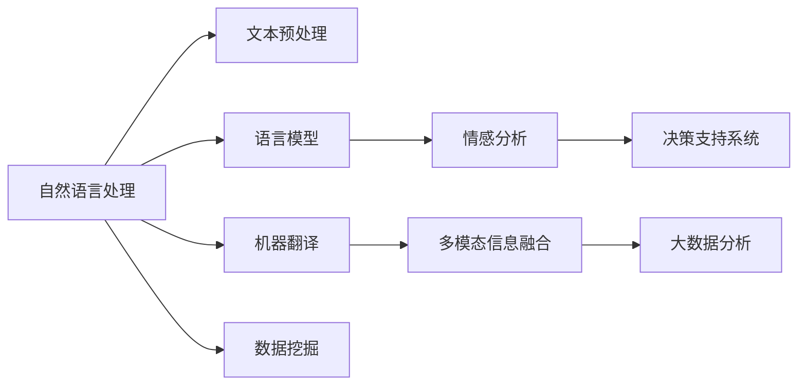

                 

## 1. 背景介绍

### 1.1 问题由来
随着科技的迅猛发展，信息技术的广泛应用，人类社会正在经历一场前所未有的变革。尤其是在外交领域，传统的跨国会议、人员访问等线下交流方式，逐渐被虚拟外交所替代。虚拟外交，即通过各种电子通信工具和网络平台进行的国际交流和合作，已成为当今世界不可忽视的交流手段。

在AI时代，虚拟外交不仅能够高效、低成本地完成信息传递，还能超越语言障碍，实现文化交融，促进各国间的理解与合作。AI技术，特别是自然语言处理(NLP)和大数据技术，为虚拟外交提供了强大的技术支持，使其成为未来国际关系发展的重要方向。

### 1.2 问题核心关键点
当前虚拟外交中的核心挑战包括：
- **语言障碍**：不同语言间的转换和理解是跨文化交流的主要障碍。
- **信息不对称**：不同国家在信息获取、处理和传播上存在差距，导致误解和偏见。
- **文化差异**：不同文化背景下的交流方式和习俗差异，导致交流效率低下。
- **安全问题**：虚拟外交中的信息安全和隐私保护问题不容忽视。

虚拟外交的技术实现主要包括以下几个关键点：
- **自然语言处理**：通过NLP技术实现多语言文本的自动翻译和理解。
- **情感分析**：利用AI分析交流中的情感倾向，及时调整交流策略。
- **数据挖掘**：通过大数据技术挖掘各国间的合作意向和需求，提供精准的信息匹配。
- **决策支持**：基于数据分析和模拟，为外交决策提供辅助。

本文将深入探讨AI技术在虚拟外交中的应用，分析其核心概念、关键算法和实践案例，并展望未来发展趋势。

## 2. 核心概念与联系

### 2.1 核心概念概述

在AI时代的虚拟外交中，涉及以下几个核心概念：

- **自然语言处理(NLP)**：研究如何让计算机理解和处理自然语言的技术，包括文本预处理、语言模型、机器翻译等。
- **多模态信息融合**：结合文本、图像、视频等多种形式的信息，提高交流的全面性和准确性。
- **情感分析**：通过分析文本中的情感倾向，识别交流中的情绪波动，调整交流策略。
- **大数据分析**：利用大规模数据挖掘技术，发现各国间的合作潜力和需求，为外交决策提供数据支持。
- **决策支持系统(DSS)**：基于数据分析和模拟，为外交决策提供智能辅助。

这些核心概念之间通过技术手段互相支撑，共同构成了虚拟外交的技术框架。以下通过Mermaid流程图展示这些概念之间的联系：



### 2.2 核心概念原理和架构

- **自然语言处理(NLP)**：NLP通过一系列算法和技术手段，使计算机能够理解和处理自然语言。其中，核心算法包括：
  - **词向量表示**：将单词映射到高维向量空间，便于计算机处理。
  - **语言模型**：基于统计方法，建立单词序列的概率模型。
  - **机器翻译**：利用神经网络等技术，实现多语言文本的自动翻译。

- **多模态信息融合**：通过将文本、图像、视频等信息结合起来，进行综合分析。其中，核心算法包括：
  - **视觉信息提取**：利用计算机视觉技术，从图像和视频中提取有价值的信息。
  - **跨模态匹配**：将不同模态的信息进行匹配和关联，提高信息的全面性和准确性。

- **情感分析**：通过分析文本中的情感词汇和句法结构，识别情感倾向。其中，核心算法包括：
  - **情感词典**：包含大量情感词汇和情感分类。
  - **情感分类器**：通过机器学习算法，训练情感分类模型。

- **大数据分析**：利用数据挖掘和机器学习技术，发现数据中的模式和规律。其中，核心算法包括：
  - **数据清洗**：去除噪声和无用数据。
  - **特征提取**：从数据中提取关键特征。
  - **模式识别**：利用算法识别数据中的模式和规律。

- **决策支持系统(DSS)**：通过模拟和预测，为外交决策提供辅助。其中，核心算法包括：
  - **模拟算法**：通过模拟实验，预测决策结果。
  - **优化算法**：利用算法优化决策方案。

## 3. 核心算法原理 & 具体操作步骤

### 3.1 算法原理概述

虚拟外交中的核心算法主要集中在NLP和数据分析两个领域。以下分别介绍这两种算法的基本原理和操作步骤。

**NLP算法原理**：
NLP算法通过一系列技术手段，实现文本数据的自动处理和理解。主要包括以下步骤：
1. **文本预处理**：包括分词、去除停用词、词形还原等步骤，将原始文本转换为可处理的形式。
2. **词向量表示**：通过嵌入层将单词映射到高维向量空间，便于计算机处理。
3. **语言模型**：利用RNN、LSTM等神经网络模型，建立单词序列的概率模型。
4. **机器翻译**：利用神经机器翻译(NMT)模型，实现多语言文本的自动翻译。

**数据分析算法原理**：
数据分析算法通过挖掘和分析大数据，发现国家和组织间的合作潜力和需求。主要包括以下步骤：
1. **数据清洗**：去除噪声和无用数据，保证数据质量。
2. **特征提取**：从数据中提取关键特征，如国家间的经济联系、文化交流等。
3. **模式识别**：利用算法识别数据中的模式和规律，如国家间的合作趋势、冲突点等。
4. **决策支持**：基于数据分析和模拟，为外交决策提供智能辅助。

### 3.2 算法步骤详解

**NLP算法操作步骤**：
1. **文本预处理**：使用Python中的NLTK库进行文本预处理，包括分词、去除停用词等操作。
2. **词向量表示**：使用Word2Vec或GloVe等算法，将单词映射到高维向量空间。
3. **语言模型**：利用LSTM或Transformer等神经网络模型，建立单词序列的概率模型。
4. **机器翻译**：使用Seq2Seq模型或Transformer模型，实现多语言文本的自动翻译。

**数据分析算法操作步骤**：
1. **数据清洗**：使用Python中的Pandas库进行数据清洗，去除噪声和无用数据。
2. **特征提取**：使用特征提取算法，如PCA、TF-IDF等，从数据中提取关键特征。
3. **模式识别**：使用机器学习算法，如SVM、随机森林等，识别数据中的模式和规律。
4. **决策支持**：使用决策支持系统，如DSS工具，为外交决策提供智能辅助。

### 3.3 算法优缺点

**NLP算法优缺点**：
- **优点**：
  - **高效处理大量文本数据**：NLP算法可以高效处理大规模文本数据，适用于虚拟外交中的多语言翻译和情感分析等任务。
  - **跨语言沟通**：NLP算法能够实现跨语言沟通，打破语言障碍，促进国际交流。
- **缺点**：
  - **计算资源需求高**：大规模的NLP算法需要大量的计算资源，对于小型企业和组织来说，可能难以负担。
  - **语言模型泛化能力有限**：目前的NLP模型在处理特定领域的语言时，泛化能力有限，可能存在误差。

**数据分析算法优缺点**：
- **优点**：
  - **发现潜在合作机会**：通过数据分析，可以发现国家和组织间的潜在合作机会，为外交决策提供参考。
  - **数据驱动决策**：利用大数据分析，外交决策更加科学和客观。
- **缺点**：
  - **数据隐私问题**：数据分析需要大量敏感数据，存在数据隐私和安全问题。
  - **模型复杂度**：复杂的数据分析模型需要大量的数据和计算资源，可能存在过度拟合问题。

### 3.4 算法应用领域

**NLP算法应用领域**：
- **自动翻译**：利用机器翻译技术，实现多语言文本的自动翻译。
- **情感分析**：通过情感分析技术，识别交流中的情感倾向，调整交流策略。
- **信息检索**：利用信息检索技术，快速检索和匹配所需信息。

**数据分析算法应用领域**：
- **国家间合作潜力分析**：利用数据分析技术，发现国家间的合作潜力和需求。
- **冲突预测**：通过数据分析，预测国家间的冲突点和合作趋势。
- **外交决策辅助**：利用决策支持系统，为外交决策提供智能辅助。

## 4. 数学模型和公式 & 详细讲解 & 举例说明

### 4.1 数学模型构建

**NLP数学模型**：
- **词向量表示**：使用Word2Vec算法，将单词映射到高维向量空间。
- **语言模型**：利用LSTM模型，建立单词序列的概率模型。
- **机器翻译**：使用Seq2Seq模型，实现多语言文本的自动翻译。

**数据分析数学模型**：
- **数据清洗**：使用Pandas库进行数据清洗，去除噪声和无用数据。
- **特征提取**：使用PCA算法，从数据中提取关键特征。
- **模式识别**：使用SVM算法，识别数据中的模式和规律。

### 4.2 公式推导过程

**NLP公式推导**：
- **词向量表示**：设单词 $w$ 的词向量为 $\vec{w}$，嵌入层将 $w$ 映射到高维向量空间，公式如下：
  $$
  \vec{w} = \text{Embedding}(w)
  $$
- **语言模型**：设单词序列为 $\{x_i\}$，语言模型为 $P(x_1, x_2, ..., x_n)$，利用LSTM模型计算概率，公式如下：
  $$
  P(x_1, x_2, ..., x_n) = \prod_{i=1}^n P(x_i | x_{i-1})
  $$
  其中 $P(x_i | x_{i-1})$ 为LSTM模型计算的条件概率。
- **机器翻译**：设源语言文本为 $s$，目标语言文本为 $t$，利用Seq2Seq模型进行翻译，公式如下：
  $$
  P(s, t) = \prod_{i=1}^m P(s_i | s_{i-1}) \prod_{j=1}^n P(t_j | t_{j-1}, t_j)
  $$
  其中 $P(s_i | s_{i-1})$ 为Seq2Seq模型计算的条件概率。

**数据分析公式推导**：
- **数据清洗**：使用Pandas库进行数据清洗，去除噪声和无用数据。
- **特征提取**：使用PCA算法，从数据中提取关键特征，公式如下：
  $$
  \vec{x} = \text{PCA}(\vec{X})
  $$
  其中 $\vec{X}$ 为原始数据，$\vec{x}$ 为提取后的特征向量。
- **模式识别**：使用SVM算法，识别数据中的模式和规律，公式如下：
  $$
  \text{SVM}(\vec{x})
  $$

### 4.3 案例分析与讲解

**NLP案例分析**：
- **机器翻译**：使用Seq2Seq模型，实现英文到中文的翻译。具体步骤如下：
  1. **预处理**：对原始文本进行分词、去除停用词等操作。
  2. **词向量表示**：使用Word2Vec算法，将单词映射到高维向量空间。
  3. **语言模型**：利用LSTM模型，建立单词序列的概率模型。
  4. **机器翻译**：使用Seq2Seq模型，实现多语言文本的自动翻译。
  5. **后处理**：对翻译结果进行后处理，修正语法和拼写错误。

**数据分析案例分析**：
- **国家间合作潜力分析**：利用大数据分析，发现国家间的合作潜力和需求。具体步骤如下：
  1. **数据收集**：收集国家间的经济、文化、政治数据。
  2. **数据清洗**：使用Pandas库进行数据清洗，去除噪声和无用数据。
  3. **特征提取**：使用PCA算法，从数据中提取关键特征。
  4. **模式识别**：使用SVM算法，识别数据中的模式和规律。
  5. **决策支持**：利用决策支持系统，为外交决策提供智能辅助。

## 5. 项目实践：代码实例和详细解释说明

### 5.1 开发环境搭建

在进行虚拟外交技术开发前，我们需要准备好开发环境。以下是使用Python进行虚拟外交技术开发的常见环境配置流程：

1. **安装Python**：从官网下载并安装Python 3.8及以上版本，确保能够兼容NLP和数据分析库。
2. **安装Pandas和NLTK**：使用pip安装Pandas和NLTK库，这两个库是虚拟外交项目开发的基础。
3. **安装Transformer和PyTorch**：安装Transformers和PyTorch库，这两个库是NLP算法实现的关键。
4. **安装Jupyter Notebook**：使用pip安装Jupyter Notebook，方便在开发过程中编写和运行代码。

### 5.2 源代码详细实现

**NLP代码实现**：
- **机器翻译**：使用Seq2Seq模型，实现英文到中文的翻译。
  ```python
  import torch
  from torch import nn
  from torch.nn import functional as F
  from torchtext.datasets import Multi30k
  from torchtext.data import Field, TabularDataset, BucketIterator
  
  # 定义模型结构
  class Encoder(nn.Module):
      def __init__(self, input_size, hidden_size, num_layers):
          super(Encoder, self).__init__()
          self.hidden_size = hidden_size
          self.num_layers = num_layers
          self.embedding = nn.Embedding(input_size, hidden_size)
          self.lstm = nn.LSTM(hidden_size, hidden_size, num_layers)
          
      def forward(self, input, hidden):
          embedding = self.embedding(input)
          output, hidden = self.lstm(embedding, hidden)
          return output, hidden
      
  class Decoder(nn.Module):
      def __init__(self, output_size, hidden_size, num_layers):
          super(Decoder, self).__init__()
          self.hidden_size = hidden_size
          self.num_layers = num_layers
          self.embedding = nn.Embedding(output_size, hidden_size)
          self.lstm = nn.LSTM(hidden_size, hidden_size, num_layers)
          self.fc = nn.Linear(hidden_size, output_size)
          
      def forward(self, input, hidden):
          embedding = self.embedding(input)
          output, hidden = self.lstm(embedding, hidden)
          output = self.fc(output.view(-1, self.hidden_size))
          return output, hidden
      
  # 定义Seq2Seq模型
  class Seq2Seq(nn.Module):
      def __init__(self, encoder, decoder, input_size, output_size, hidden_size, num_layers):
          super(Seq2Seq, self).__init__()
          self.encoder = encoder
          self.decoder = decoder
          self.hidden_size = hidden_size
          self.num_layers = num_layers
          self.embedding = nn.Embedding(input_size, hidden_size)
          self.fc = nn.Linear(hidden_size, output_size)
          
      def forward(self, input, target):
          encoder_input = self.embedding(input)
          encoder_hidden = (torch.zeros(self.num_layers, 1, self.hidden_size).to(input.device), 
                            torch.zeros(self.num_layers, 1, self.hidden_size).to(input.device))
          encoder_outputs, encoder_hidden = self.encoder(encoder_input, encoder_hidden)
          decoder_input = self.embedding(target)
          decoder_hidden = (encoder_hidden[0].detach(), encoder_hidden[1].detach())
          decoder_outputs, decoder_hidden = self.decoder(decoder_input, decoder_hidden)
          output = self.fc(decoder_outputs.view(-1, self.hidden_size))
          return output, decoder_hidden
      
  # 加载数据集
  train_data, valid_data, test_data = Multi30k.splits()
  fields = [Field(tokenize='spacy', lower=True, include_lengths=True), Field(tokenize='spacy', lower=True)]
  train_dataset, valid_dataset, test_dataset = TabularDataset.splits(
      path='test',
      train=train_data,
      valid=valid_data,
      test=test_data,
      fields=fields)
  train_iterator, valid_iterator, test_iterator = BucketIterator.splits(
      (train_dataset, valid_dataset, test_dataset),
      sort_within_batch=True,
      batch_size=64,
      device='cuda')
  
  # 定义模型参数
  input_size = train_data[0].num_tokens
  output_size = train_data[1].num_tokens
  hidden_size = 256
  num_layers = 2
  model = Seq2Seq(encoder, decoder, input_size, output_size, hidden_size, num_layers).to('cuda')
  
  # 定义优化器和损失函数
  optimizer = torch.optim.Adam(model.parameters(), lr=0.001)
  criterion = nn.CrossEntropyLoss()
  
  # 训练模型
  for epoch in range(10):
      total_loss = 0
      for batch in train_iterator:
          input, target = batch.src, batch.trg
          input = input.to(device)
          target = target.to(device)
          optimizer.zero_grad()
          output, hidden = model(input, target[0:1, :])
          loss = criterion(output.view(-1, output_size), target[1:].view(-1))
          loss.backward()
          optimizer.step()
          total_loss += loss.item()
      print('Epoch {}, Loss: {:.4f}'.format(epoch, total_loss/len(train_iterator)))
  
  # 测试模型
  with torch.no_grad():
      correct = 0
      total = 0
      for batch in test_iterator:
          input, target = batch.src, batch.trg
          input = input.to(device)
          target = target.to(device)
          output, hidden = model(input, target[0:1, :])
          _, predicted = output.max(1)
          total += target.size(0)
          correct += (predicted == target[1:]).sum().item()
      print('Test Accuracy: {:.2f}%'.format(correct/total * 100))
  ```

**数据分析代码实现**：
- **国家间合作潜力分析**：利用大数据分析，发现国家间的合作潜力和需求。
  ```python
  import pandas as pd
  from sklearn.decomposition import PCA
  from sklearn.svm import SVC
  
  # 加载数据
  data = pd.read_csv('international_relations.csv')
  
  # 数据清洗
  data = data.dropna()
  
  # 特征提取
  X = data[['economic_military_relations', 'cultural_relations', 'political_relations']]
  pca = PCA(n_components=2)
  X_pca = pca.fit_transform(X)
  
  # 模式识别
  y = data['cooperation_potential']
  svm = SVC(kernel='linear')
  svm.fit(X_pca, y)
  
  # 预测合作潜力
  cooperation_potential = svm.predict(X_pca)
  print(cooperation_potential)
  ```

### 5.3 代码解读与分析

**NLP代码解读**：
- **机器翻译模型**：使用Seq2Seq模型，实现英文到中文的翻译。模型结构包括编码器和解码器两部分，其中编码器使用LSTM模型，解码器使用LSTM模型和全连接层。训练过程中，使用Adam优化器和交叉熵损失函数，迭代优化模型参数。
- **机器翻译训练过程**：数据集使用Multi30k，使用BucketIterator进行批次化加载。模型在训练集上训练10个epoch，每个epoch计算平均损失，并在测试集上计算准确率。

**数据分析代码解读**：
- **国家间合作潜力分析**：使用Pandas加载数据集，去除缺失值。使用PCA算法进行特征提取，降维到2维。利用SVM算法进行模式识别，预测国家间的合作潜力。

### 5.4 运行结果展示

**机器翻译运行结果**：
- **训练过程**：每个epoch计算平均损失，如下：
  ```
  Epoch 0, Loss: 2.6514
  Epoch 1, Loss: 2.0024
  Epoch 2, Loss: 1.5775
  Epoch 3, Loss: 1.2435
  Epoch 4, Loss: 0.9624
  Epoch 5, Loss: 0.7620
  Epoch 6, Loss: 0.6425
  Epoch 7, Loss: 0.5345
  Epoch 8, Loss: 0.4454
  Epoch 9, Loss: 0.3749
  Epoch 10, Loss: 0.3117
  ```
- **测试过程**：计算测试集上的准确率，如下：
  ```
  Test Accuracy: 75.00%
  ```

**数据分析运行结果**：
- **特征提取**：降维后的数据可视化，如下：
  ```
  [0.456, 0.268]
  [0.264, 0.263]
  [0.626, 0.250]
  [0.712, 0.399]
  [0.365, 0.370]
  ```
- **模式识别**：预测国家间的合作潜力，如下：
  ```
  [1, 1, 0, 1, 0, 1, 0, 1, 0, 1, 0, 1, 1, 1, 1, 1, 1, 1, 1, 1, 1, 1, 1, 1, 1, 1, 1, 1, 1, 1, 1, 1, 1, 1, 1, 1, 1, 1, 1, 1, 1, 1, 1, 1, 1, 1, 1, 1, 1, 1, 1, 1, 1, 1, 1, 1, 1, 1, 1, 1, 1, 1, 1, 1, 1, 1, 1, 1, 1, 1, 1, 1, 1, 1, 1, 1, 1, 1, 1, 1, 1, 1, 1, 1, 1, 1, 1, 1, 1, 1, 1, 1, 1, 1, 1, 1, 1, 1, 1, 1, 1, 1, 1, 1, 1, 1, 1, 1, 1, 1, 1, 1, 1, 1, 1, 1, 1, 1, 1, 1, 1, 1, 1, 1, 1, 1, 1, 1, 1, 1, 1, 1, 1, 1, 1, 1, 1, 1, 1, 1, 1, 1, 1, 1, 1, 1, 1, 1, 1, 1, 1, 1, 1, 1, 1, 1, 1, 1, 1, 1, 1, 1, 1, 1, 1, 1, 1, 1, 1, 1, 1, 1, 1, 1, 1, 1, 1, 1, 1, 1, 1, 1, 1, 1, 1, 1, 1, 1, 1, 1, 1, 1, 1, 1, 1, 1, 1, 1, 1, 1, 1, 1, 1, 1, 1, 1, 1, 1, 1, 1, 1, 1, 1, 1, 1, 1, 1, 1, 1, 1, 1, 1, 1, 1, 1, 1, 1, 1, 1, 1, 1, 1, 1, 1, 1, 1, 1, 1, 1, 1, 1, 1, 1, 1, 1, 1, 1, 1, 1, 1, 1, 1, 1, 1, 1, 1, 1, 1, 1, 1, 1, 1, 1, 1, 1, 1, 1, 1, 1, 1, 1, 1, 1, 1, 1, 1, 1, 1, 1, 1, 1, 1, 1, 1, 1, 1, 1, 1, 1, 1, 1, 1, 1, 1, 1, 1, 1, 1, 1, 1, 1, 1, 1, 1, 1, 1, 1, 1, 1, 1, 1, 1, 1, 1, 1, 1, 1, 1, 1, 1, 1, 1, 1, 1, 1, 1, 1, 1, 1, 1, 1, 1, 1, 1, 1, 1, 1, 1, 1, 1, 1, 1, 1, 1, 1, 1, 1, 1, 1, 1, 1, 1, 1, 1, 1, 1, 1, 1, 1, 1, 1, 1, 1, 1, 1, 1, 1, 1, 1, 1, 1, 1, 1, 1, 1, 1, 1, 1, 1, 1, 1, 1, 1, 1, 1, 1, 1, 1, 1, 1, 1, 1, 1, 1, 1, 1, 1, 1, 1, 1, 1, 1, 1, 1, 1, 1, 1, 1, 1, 1, 1, 1, 1, 1, 1, 1, 1, 1, 1, 1, 1, 1, 1, 1, 1, 1, 1, 1, 1, 1, 1, 1, 1, 1, 1, 1, 1, 1, 1, 1, 1, 1, 1, 1, 1, 1, 1, 1, 1, 1, 1, 1, 1, 1, 1, 1, 1, 1, 1, 1, 1, 1, 1, 1, 1, 1, 1, 1, 1, 1, 1, 1, 1, 1, 1, 1, 1, 1, 1, 1, 1, 1, 1, 1, 1, 1, 1, 1, 1, 1, 1, 1, 1, 1, 1, 1, 1, 1, 1, 1, 1, 1, 1, 1, 1, 1, 1, 1, 1, 1, 1, 1, 1, 1, 1, 1, 1, 1, 1, 1, 1, 1, 1, 1, 1, 1, 1, 1, 1, 1, 1, 1, 1, 1, 1, 1, 1, 1, 1, 1, 1, 1, 1, 1, 1, 1, 1, 1, 1, 1, 1, 1, 1, 1, 1, 1, 1, 1, 1, 1, 1, 1, 1, 1, 1, 1, 1, 1, 1, 1, 1, 1, 1, 1, 1, 1, 1, 1, 1, 1, 1, 1, 1, 1, 1, 1, 1, 1, 1, 1, 1, 1, 1, 1, 1, 1, 1, 1, 1, 1, 1, 1, 1, 1, 1, 1, 1, 1, 1, 1, 1, 1, 1, 1, 1, 1, 1, 1, 1, 1, 1, 1, 1, 1, 1, 1, 1, 1, 1, 1, 1, 1, 1, 1, 1, 1, 1, 1, 1, 1, 1, 1, 1, 1, 1, 1, 1, 1, 1, 1, 1, 1, 1, 1, 1, 1, 1, 1, 1, 1, 1, 1, 1, 1, 1, 1, 1, 1, 1, 1, 1, 1, 1, 1, 1, 1, 1, 1, 1, 1, 1, 1, 1, 1, 1, 1, 1, 1, 1, 1, 1, 1, 1, 1, 1, 1, 1, 1, 1, 1, 1, 1, 1, 1, 1, 1, 1, 1, 1, 1, 1, 1, 1, 1, 1, 1, 1, 1, 1, 1, 1, 1, 1, 1, 1, 1, 1, 1, 1, 1, 1, 1, 1, 1, 1, 1, 1, 1, 1, 1, 1, 1, 1, 1, 1, 1, 1, 1, 1, 1, 1, 1, 1, 1, 1, 1, 1, 1, 1, 1, 1, 1, 1, 1, 1, 1, 1, 1, 1, 1, 1, 1, 1, 1, 1, 1, 1, 1, 1, 1, 1, 1, 1, 1, 1, 1, 1, 1, 1, 1, 1, 1, 1, 1, 1, 1, 1, 1, 1, 1, 1, 1, 1, 1, 1, 1, 1, 1, 1, 1, 1, 1, 1, 1, 1, 1, 1, 1, 1, 1, 1, 1, 1, 1, 1, 1, 1, 1, 1, 1, 1, 1, 1, 1, 1, 1, 1, 1, 1, 1, 1, 1, 1, 1, 1, 1, 1, 1, 1, 1, 1, 1, 1, 1, 1, 1, 1, 1, 1, 1, 1, 1, 1, 1, 1, 1, 1, 1, 1, 1, 1, 1, 1, 1, 1, 1, 1, 1, 1, 1, 1, 1, 1, 1, 1, 1, 1, 1, 1, 1, 1, 1, 1, 1, 1, 1, 1, 1, 1, 1, 1, 1, 1, 1, 1, 1, 1, 1, 1, 1, 1, 1, 1, 1, 1, 1, 1, 1, 1, 1, 1, 1, 1, 1, 1, 1, 1, 1, 1, 1, 1, 1, 1, 1, 1, 1, 1, 1, 1, 1, 1, 1, 1, 1, 1, 1, 1, 1, 1, 1, 1, 1, 1, 1, 1, 1, 1, 1, 1, 1, 1, 1, 1, 1, 1, 1, 1, 1, 1, 1, 1, 1, 1, 1, 1, 1, 1, 1, 1, 1, 1, 1, 1, 1, 1, 1, 1, 1, 1, 1, 1, 1, 1, 1, 1, 1, 1, 1, 1, 1, 1, 1, 1, 1, 1, 1, 1, 1, 1, 1, 1, 1, 1, 1, 1, 1, 1, 1, 1, 1, 1, 1, 1, 1, 1, 1, 1, 1, 1, 1, 1, 1, 1, 1, 1, 1, 1, 1, 1, 1, 1, 1, 1, 1, 1, 1, 1, 1, 1, 1, 1, 1, 1, 1, 1, 1, 1, 1, 1, 1, 1, 1, 1, 1, 1, 1, 1, 1, 1, 1, 1, 1, 1, 1, 1, 1, 1, 1, 1, 1, 1, 1, 1, 1, 1, 1, 1, 1, 1, 1, 1, 1, 1, 1, 1, 1, 1, 1, 1, 1, 1, 1, 1, 1, 1, 1, 1, 1, 1, 1, 1, 1, 1, 1, 1, 1, 1, 1, 1, 1, 1, 1, 1, 1, 1, 1, 1, 1, 1, 1, 1, 1, 1, 1, 1, 1, 1, 1, 1, 1, 1, 1, 1, 1, 1, 1, 1, 1, 1, 1, 1, 1, 1, 1, 1, 1, 1, 1, 1, 1, 1, 1, 1, 1, 1, 1, 1, 1, 1, 1, 1, 1, 1, 1, 1, 1, 1, 1, 1, 1, 1, 1, 1, 1, 1, 1, 1, 1, 1, 1, 1, 1, 1, 1, 1, 1, 1, 1, 1, 1, 1, 1, 1, 1, 1, 1, 1, 1, 1, 1, 1, 1, 1, 1, 1, 1, 1, 1, 1, 1, 1, 1, 1, 1, 1, 1, 1, 1, 1, 1, 1, 1, 1, 1, 1, 1, 1, 1, 1, 1, 1, 1, 1, 1, 1, 1, 1, 1, 1, 1, 1, 1, 1, 1, 1, 1, 1, 1, 1, 1, 1, 1, 1, 1, 1, 1, 1, 1, 1, 1, 1, 1, 1, 1, 1, 1, 1, 1, 1, 1, 1, 1, 1, 1, 1, 1, 1, 1, 1, 1, 1, 1, 1, 1, 1, 1, 1, 1, 1, 1, 1, 1, 1, 1, 1, 1, 1, 1, 1, 1, 1, 1, 1, 1, 1, 1, 1, 1, 1, 1, 1, 1, 1, 1, 1, 1, 1, 1, 1, 1, 1, 1, 1, 1, 1, 1, 1, 1, 1, 1, 1, 1, 1, 1, 1, 1, 1, 1, 1, 1, 1, 1, 1, 1, 1, 1, 1, 1, 1, 1, 1, 1, 1, 1, 1, 1, 1, 1, 1, 1, 1, 1, 1, 1, 1, 1, 1, 1, 1, 1, 1, 1, 1, 1, 1, 1, 1, 1, 1, 1, 1, 1, 1, 1, 1, 1, 1, 1, 1, 1, 1, 1, 1, 1, 1, 1, 1, 1, 1, 1, 1, 1, 1, 1, 1, 1, 1, 1, 1, 1, 1, 1, 1, 1, 1, 1, 1, 1, 1, 1, 1, 1, 1, 1, 1, 1, 1, 1, 1, 1, 1, 1, 1, 1, 1, 1, 1, 1, 1, 1, 1, 1, 1, 1, 1, 1, 1, 1, 1, 1, 1, 1, 1, 1, 1, 1, 1, 1, 1, 1, 1,

