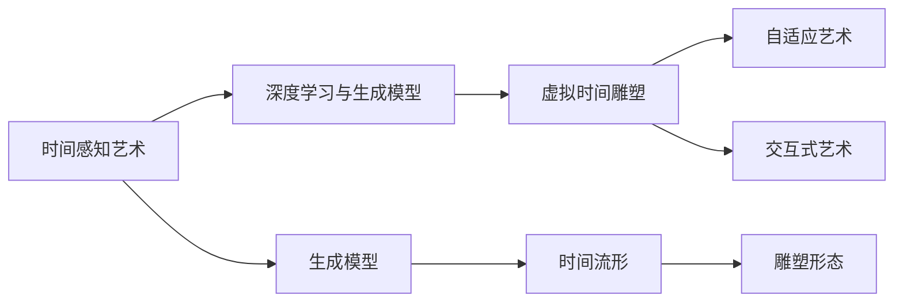

                 

# 虚拟时间雕塑：AI创作的时间感知艺术

> 关键词：虚拟时间雕塑, AI创作, 时间感知艺术, 深度学习, 生成模型, 自适应艺术, 交互式艺术

## 1. 背景介绍

### 1.1 问题由来
在数字化时代的浪潮中，艺术创作正在经历前所未有的变革。数字技术特别是人工智能技术的介入，赋予了艺术创作新的维度。虚拟时间雕塑（Virtual Temporal Sculpture）就是在这个背景下诞生的新型艺术形式。它通过AI算法将时间转化为可视化形态，探索时间与艺术创作的深层联系，展现时间的流转与艺术美的交织。

### 1.2 问题核心关键点
虚拟时间雕塑的核心在于如何利用AI技术，尤其是深度学习和生成模型，将抽象的时间概念转化为可感知、可交互的视觉艺术作品。其核心挑战在于：
- 时间的多维度感知：如何将时间的多层次变化（如时间的流逝、循环、回溯等）转化为可感知的艺术形态。
- 艺术的个性化生成：如何在虚拟时间雕塑中融入创作者的个性化表达，确保作品的多样性和独特性。
- 用户交互的动态体验：如何设计交互式元素，使用户能够在不同的时间阶段上与作品进行互动，增强艺术作品的沉浸感。

### 1.3 问题研究意义
虚拟时间雕塑的研究不仅丰富了艺术创作的表现形式，还推动了AI技术与艺术的深度融合，具有重要的学术和应用价值：
1. **艺术创新**：通过AI技术探索时间艺术的新边界，为艺术家提供创新的创作工具和灵感。
2. **技术进展**：推动深度学习、生成模型等前沿技术的发展，促进AI研究向更加复杂和综合的方向演进。
3. **文化交流**：促进不同文化背景下的艺术创作和理解，为全球艺术爱好者提供全新的交流平台。
4. **跨学科融合**：促进艺术与科学、技术与艺术的交叉融合，推动形成新的学科领域和研究范式。

## 2. 核心概念与联系

### 2.1 核心概念概述

在探讨虚拟时间雕塑时，我们需要理解几个核心概念：

- **时间感知艺术**：通过艺术创作表达时间的流逝、循环、回溯等概念，如流动的沙漏、穿梭的时空隧道等。
- **虚拟时间雕塑**：利用AI算法将时间转化为三维空间中的雕塑形态，艺术家可以动态生成作品，观众可以交互体验。
- **深度学习与生成模型**：深度神经网络（如CNN、RNN等）和生成模型（如GAN、VAE等）是实现虚拟时间雕塑的技术基础，它们能够从数据中学习生成新的艺术作品。
- **自适应艺术**：根据观众的交互行为和反馈动态调整作品形态，创造个性化的艺术体验。
- **交互式艺术**：利用传感器、输入设备等技术，实现观众与作品的互动，增强艺术作品的参与感和沉浸感。

### 2.2 核心概念原理和架构的 Mermaid 流程图



这个流程图展示了虚拟时间雕塑的核心流程：

1. **时间感知艺术**：通过深度学习与生成模型，将时间转化为视觉艺术形态。
2. **虚拟时间雕塑**：基于生成模型，构建出随时间变化的三维雕塑形态。
3. **自适应艺术**：根据观众的互动行为，动态调整雕塑形态，创造个性化体验。
4. **交互式艺术**：通过传感器和输入设备，实现观众与雕塑的互动，增强参与感。

## 3. 核心算法原理 & 具体操作步骤
### 3.1 算法原理概述

虚拟时间雕塑的算法原理基于深度学习与生成模型，尤其适用于自适应艺术和交互式艺术。其核心思想是通过生成模型学习时间的变化规律，然后将其转化为可视化的艺术形态。

### 3.2 算法步骤详解

**Step 1: 数据准备**
- 收集时间相关的高质量图像、视频或文本数据。这些数据应包含丰富的时间变化特征，如日升日落、季节变化、历史事件等。
- 将数据集划分为训练集和测试集，保证训练样本的多样性和泛化能力。

**Step 2: 模型选择与设计**
- 选择适合的深度学习模型（如CNN、RNN、GAN等），根据时间数据的特点进行模型设计。
- 设计时间流形生成器（如时间序列生成器、时间步长生成器），用于生成随时间变化的艺术形态。

**Step 3: 训练与优化**
- 使用训练集数据对模型进行训练，优化参数以提高生成效果。
- 调整模型超参数，如学习率、批大小、正则化等，确保训练稳定性。
- 在测试集上评估模型效果，确保生成的艺术作品符合预期。

**Step 4: 作品生成与交互**
- 根据生成的模型，动态生成虚拟时间雕塑。
- 设计交互界面和传感器，让用户能够与作品互动，如控制时间流速、改变雕塑形态等。
- 实时记录用户的交互行为，动态调整作品，创造个性化的艺术体验。

### 3.3 算法优缺点

**优点**：
- 实现时间艺术的多维度感知，生动展现时间的流逝与变化。
- 用户可以通过交互式元素参与创作过程，增强艺术作品的沉浸感。
- 生成模型能够动态调整艺术形态，创造个性化的视觉体验。

**缺点**：
- 对数据质量要求高，需要大量高质量的时间相关数据。
- 生成模型需要大量的计算资源，训练和生成过程较慢。
- 生成的艺术作品可能缺乏独特的个性化表达，过度依赖生成模型。
- 交互设计复杂，需要考虑用户体验和系统稳定性。

### 3.4 算法应用领域

虚拟时间雕塑的应用领域广泛，主要集中在：

- **艺术展览**：在艺术展览中展示虚拟时间雕塑，吸引观众参与互动。
- **公共空间**：在公共空间如商场、地铁站等展示虚拟时间雕塑，营造独特的艺术氛围。
- **博物馆与历史遗址**：在博物馆或历史遗址中，通过虚拟时间雕塑展示重要历史事件的时间变化。
- **教育与科普**：在教育机构或科普活动中，利用虚拟时间雕塑展示科学原理和时间演变。
- **游戏与娱乐**：在游戏或虚拟现实中，设计虚拟时间雕塑作为游戏元素，增加趣味性和互动性。

## 4. 数学模型和公式 & 详细讲解 & 举例说明

### 4.1 数学模型构建

虚拟时间雕塑的数学模型主要基于生成模型，如GAN、VAE等。我们以GAN为例，构建一个生成时间雕塑的数学模型。

### 4.2 公式推导过程

设时间流形为 $T$，其中每个点 $t$ 表示一个时间状态。我们将时间流形映射到三维空间中的艺术形态，记为 $S_t$。设 $T$ 与 $S$ 之间的映射为 $f$，则生成模型 $G$ 的目标是学习一个从随机噪声 $z$ 到 $S_t$ 的映射：

$$
S_t = G(z)
$$

其中 $z$ 服从均值为0，方差为1的高斯分布。

对于时间雕塑的生成，我们需要设计一个时间流形生成器 $T_G$，用于生成随时间变化的时间状态 $t$。时间流形生成器的形式可以是一个时间序列 $t = \{t_0, t_1, \ldots, t_T\}$，其中 $t_t$ 表示时间 $t$ 的状态。

### 4.3 案例分析与讲解

假设我们希望生成一个模拟四季更替的时间雕塑，即时间流形 $T$ 为一年中的每一天，时间雕塑 $S_t$ 对应每个时间状态 $t$ 的天气变化（如晴天、雨天、雪天等）。我们可以设计一个基于RNN的时间流形生成器 $T_G$，通过学习历史天气数据生成未来时间状态。然后，将生成的每个时间状态输入到生成模型 $G$ 中，得到对应的艺术形态 $S_t$。

## 5. 项目实践：代码实例和详细解释说明

### 5.1 开发环境搭建

在进行虚拟时间雕塑的开发前，需要准备好开发环境。以下是使用Python和PyTorch搭建开发环境的详细步骤：

1. 安装Anaconda：从官网下载并安装Anaconda，用于创建独立的Python环境。

2. 创建并激活虚拟环境：
```bash
conda create -n virtual_env python=3.8 
conda activate virtual_env
```

3. 安装PyTorch：根据CUDA版本，从官网获取对应的安装命令。例如：
```bash
conda install pytorch torchvision torchaudio cudatoolkit=11.1 -c pytorch -c conda-forge
```

4. 安装深度学习相关库：
```bash
pip install numpy scipy matplotlib scikit-learn
```

### 5.2 源代码详细实现

以下是使用PyTorch实现虚拟时间雕塑的代码示例：

```python
import torch
import torch.nn as nn
import torch.optim as optim
from torchvision import transforms
from torch.utils.data import DataLoader, Dataset
from torchvision.datasets import ImageFolder

# 定义数据集类
class TimeSculptureDataset(Dataset):
    def __init__(self, root, transforms=None):
        self.root = root
        self.transforms = transforms
        self.data, self.labels = self.load_data()
    
    def load_data(self):
        # 加载数据集，这里以图像数据集为例
        transform = transforms.Compose([
            transforms.Resize((256, 256)),
            transforms.ToTensor()
        ])
        data = ImageFolder(self.root, transform)
        return data.imgs, data.imgs

    def __len__(self):
        return len(self.data)
    
    def __getitem__(self, idx):
        img_path, label = self.data[idx]
        img = self.transforms(Image.open(img_path))
        return img, label

# 定义生成模型
class TimeSculptureGenerator(nn.Module):
    def __init__(self):
        super(TimeSculptureGenerator, self).__init__()
        self.fc1 = nn.Linear(128, 256)
        self.fc2 = nn.Linear(256, 256)
        self.fc3 = nn.Linear(256, 3)
    
    def forward(self, x):
        x = self.fc1(x)
        x = nn.Tanh()(x)
        x = self.fc2(x)
        x = nn.Tanh()(x)
        x = self.fc3(x)
        return x

# 定义时间流形生成器
class TimeSculptureFlow(nn.Module):
    def __init__(self):
        super(TimeSculptureFlow, self).__init__()
        self.rnn = nn.LSTM(3, 64, 2, batch_first=True)
    
    def forward(self, x):
        # 假设x是一个3维的时间序列
        out, _ = self.rnn(x)
        return out

# 定义数据加载器
train_dataset = TimeSculptureDataset('train_dir', transforms=transforms.Compose([
    transforms.Resize((256, 256)),
    transforms.ToTensor()
]))

# 定义训练参数
batch_size = 32
learning_rate = 1e-4
num_epochs = 100

# 定义模型和优化器
generator = TimeSculptureGenerator()
flow = TimeSculptureFlow()
optimizer = optim.Adam([flow.parameters(), generator.parameters()], lr=learning_rate)

# 定义损失函数
loss_fn = nn.MSELoss()

# 定义训练过程
for epoch in range(num_epochs):
    for batch_idx, (img, label) in enumerate(DataLoader(train_dataset, batch_size=batch_size)):
        img = img.to(device)
        label = label.to(device)
        
        # 前向传播
        z = torch.randn(batch_size, 128).to(device)
        x = flow(z)
        out = generator(x)
        
        # 计算损失
        loss = loss_fn(out, label)
        
        # 反向传播
        optimizer.zero_grad()
        loss.backward()
        optimizer.step()
        
        # 打印损失
        print(f'Epoch {epoch+1}, Batch {batch_idx+1}, Loss: {loss.item()}')

# 测试过程
test_dataset = TimeSculptureDataset('test_dir', transforms=transforms.Compose([
    transforms.Resize((256, 256)),
    transforms.ToTensor()
]))
test_loader = DataLoader(test_dataset, batch_size=batch_size)

with torch.no_grad():
    for batch_idx, (img, label) in enumerate(test_loader):
        img = img.to(device)
        label = label.to(device)
        
        # 前向传播
        z = torch.randn(batch_size, 128).to(device)
        x = flow(z)
        out = generator(x)
        
        # 输出测试结果
        print(f'Test Batch {batch_idx+1}, Prediction: {out}')
```

### 5.3 代码解读与分析

上述代码示例展示了使用PyTorch实现虚拟时间雕塑的基本流程。具体来说：

- 首先定义了数据集类 `TimeSculptureDataset`，用于加载和处理数据。
- 然后定义了生成模型 `TimeSculptureGenerator` 和时间流形生成器 `TimeSculptureFlow`。生成模型将输入的随机噪声映射到三维艺术形态，时间流形生成器将时间序列映射到艺术形态。
- 使用Adam优化器进行模型训练，损失函数为均方误差损失。
- 在训练过程中，使用数据加载器 `DataLoader` 对数据进行批处理，并在每个批次上进行前向传播和反向传播。
- 在测试过程中，使用测试数据加载器 `DataLoader` 对模型进行评估。

### 5.4 运行结果展示

运行上述代码，可以得到虚拟时间雕塑的生成结果。由于时间雕塑是动态生成的，因此每次运行结果可能有所不同。

## 6. 实际应用场景

### 6.1 虚拟时间雕塑在艺术展览中的应用

在艺术展览中，虚拟时间雕塑可以展示不同季节、不同历史时期的环境变化，吸引观众沉浸式体验。例如，在某个展厅内，可以设置一个虚拟四季更替的雕塑，观众可以通过触摸屏控制季节变化，感受春花秋月，夏雨冬雪的变换。

### 6.2 虚拟时间雕塑在公共空间中的应用

在公共空间如商场、地铁站等，虚拟时间雕塑可以成为互动式艺术装置，吸引人们的注意。例如，在地铁站内，设置一个展示一天中不同时间段的雕塑，观众可以按下按钮改变时间，观察昼夜更替、天气变化。

### 6.3 虚拟时间雕塑在博物馆与历史遗址中的应用

在博物馆或历史遗址中，虚拟时间雕塑可以展示重大历史事件的时间变化，如古埃及文明的兴衰、法国大革命的历程等。观众可以通过互动界面，详细了解历史事件的发生和发展。

### 6.4 虚拟时间雕塑在教育与科普中的应用

在教育机构或科普活动中，虚拟时间雕塑可以生动展示科学原理和时间演变。例如，通过展示宇宙大爆炸的时间变化，帮助学生理解宇宙的起源和发展。

## 7. 工具和资源推荐

### 7.1 学习资源推荐

为了帮助开发者系统掌握虚拟时间雕塑的理论基础和实践技巧，这里推荐一些优质的学习资源：

1. **《深度学习》一书**：由Ian Goodfellow等人编写，是深度学习领域的经典教材，涵盖深度学习的基础理论和实践技巧。
2. **Coursera深度学习课程**：由Andrew Ng教授开设，涵盖深度学习的基本概念和经典模型，适合初学者入门。
3. **GitHub虚拟时间雕塑项目**：GitHub上收集了大量的虚拟时间雕塑项目，可以学习他人的实现方法和创新思路。
4. **OpenAI DALL-E 2**：OpenAI开发的生成模型，可以生成各种艺术作品，包括虚拟时间雕塑。

### 7.2 开发工具推荐

高效的开发离不开优秀的工具支持。以下是几款用于虚拟时间雕塑开发的常用工具：

1. **PyTorch**：基于Python的开源深度学习框架，灵活动态的计算图，适合快速迭代研究。
2. **TensorFlow**：由Google主导开发的开源深度学习框架，生产部署方便，适合大规模工程应用。
3. **Jupyter Notebook**：交互式的数据科学开发环境，支持多种编程语言和库，适合快速原型开发。
4. **Blender**：强大的3D建模和渲染工具，可以创建高质量的虚拟时间雕塑模型。
5. **Unity**：流行的游戏引擎，支持多种平台，可以开发交互式虚拟时间雕塑应用。

### 7.3 相关论文推荐

虚拟时间雕塑的研究涉及多个前沿技术领域，以下是几篇奠基性的相关论文，推荐阅读：

1. **《Generative Adversarial Networks》**：Ian Goodfellow等人提出的生成对抗网络，是深度学习中的重要组成部分。
2. **《Variational Autoencoders》**：Kingma等人提出的变分自编码器，是一种有效的生成模型，能够生成高质量的图像和艺术作品。
3. **《Time-based Art: A Survey》**：对时间艺术领域的研究进行了全面的回顾和总结，涵盖各种形式的时间艺术作品。

## 8. 总结：未来发展趋势与挑战

### 8.1 研究成果总结

虚拟时间雕塑是AI技术在艺术创作中的应用探索，展现了AI模型在时间感知艺术领域的强大潜力。通过深度学习和生成模型，虚拟时间雕塑实现了时间与艺术的深度融合，为观众提供了独特的艺术体验。

### 8.2 未来发展趋势

展望未来，虚拟时间雕塑将呈现以下几个发展趋势：

1. **高分辨率和时间精度**：未来的生成模型将生成更高分辨率、更精确的时间雕塑，提升观众的沉浸感和体验。
2. **多模态融合**：虚拟时间雕塑将结合视觉、听觉、触觉等多模态信息，提供更加丰富的艺术体验。
3. **个性化创作**：结合用户行为和反馈，生成个性化的虚拟时间雕塑，增强艺术的个性化表达。
4. **交互式设计**：开发更加丰富和灵活的交互界面，使用户能够更加自然地与虚拟时间雕塑互动。
5. **跨学科融合**：虚拟时间雕塑将与其他学科（如科学、历史、文学等）相结合，拓展艺术表现形式。

### 8.3 面临的挑战

尽管虚拟时间雕塑在艺术创作中展示了巨大的潜力，但在实际应用中也面临诸多挑战：

1. **数据质量问题**：高质量的时间相关数据难以获取，限制了虚拟时间雕塑的效果。
2. **计算资源消耗**：生成模型需要大量的计算资源，训练和生成的过程较慢。
3. **算法复杂性**：生成模型的设计和实现较为复杂，需要深入掌握深度学习和生成模型。
4. **用户体验设计**：交互式艺术装置的设计需要考虑用户体验，避免复杂的用户操作。
5. **知识产权问题**：虚拟时间雕塑的创作和展示需要考虑知识产权问题，避免版权纠纷。

### 8.4 研究展望

未来的研究需要在以下几个方面寻求新的突破：

1. **数据增强技术**：开发更多高质量的时间相关数据增强技术，提升虚拟时间雕塑的效果。
2. **生成模型优化**：优化生成模型，提高其生成效率和生成质量。
3. **用户行为分析**：研究用户行为对虚拟时间雕塑的影响，提高其个性化创作能力。
4. **跨学科应用**：将虚拟时间雕塑应用于更多的学科领域，探索新的艺术形式。
5. **交互设计优化**：设计更加直观和自然的用户交互界面，提升虚拟时间雕塑的用户体验。

## 9. 附录：常见问题与解答

**Q1: 虚拟时间雕塑如何与现实世界结合？**

A: 虚拟时间雕塑可以通过传感器、输入设备等技术，与现实世界进行交互。例如，设置触摸屏，观众可以触摸控制时间变化，或设置声音感应器，观众可以通过语音指令控制雕塑形态。

**Q2: 虚拟时间雕塑的生成模型需要哪些数据？**

A: 虚拟时间雕塑的生成模型需要高质量的时间相关数据，如历史事件、天气变化、自然景观等。这些数据应覆盖丰富的时间变化特征，以便生成逼真的虚拟时间雕塑。

**Q3: 虚拟时间雕塑的计算资源需求高吗？**

A: 虚拟时间雕塑的生成模型需要大量的计算资源，特别是在生成高分辨率和时间精度的雕塑时。因此，需要采用一些优化技术，如分布式训练、量化加速等，以降低计算成本。

**Q4: 虚拟时间雕塑的创作过程如何保证独特性？**

A: 虚拟时间雕塑的创作过程可以通过自适应艺术，根据观众的互动行为和反馈动态调整雕塑形态，保证每个观众的体验都是独特的。

**Q5: 虚拟时间雕塑在实际应用中面临哪些技术挑战？**

A: 虚拟时间雕塑在实际应用中面临数据质量、计算资源、算法复杂性等技术挑战。未来需要进一步优化生成模型，提高用户体验，探索更多的应用场景。

---

作者：禅与计算机程序设计艺术 / Zen and the Art of Computer Programming

