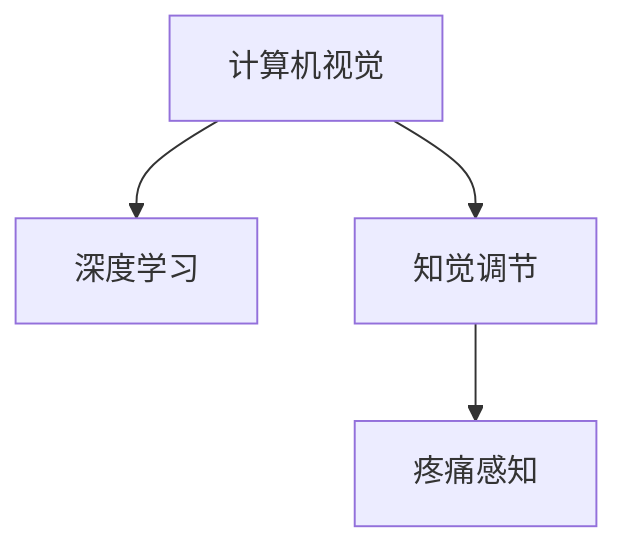

                 

# 虚拟疼痛管理专家：AI驱动的知觉调节顾问

> 关键词：虚拟疼痛管理，人工智能，知觉调节，计算机视觉，深度学习

## 1. 背景介绍

### 1.1 问题由来
随着现代科技的发展和生活方式的改变，慢性疼痛已经成为了人类健康的一个重大威胁。无论是手术后的伤口疼痛、癌症引起的疼痛，还是长期的精神压力导致的慢性疼痛，都严重影响了人们的生活质量。传统上，疼痛管理依赖于药物和物理治疗，但这些方法的效果有限，并且常常伴随着副作用。近年来，随着人工智能（AI）技术的进步，AI驱动的知觉调节开始进入人们的视野，为疼痛管理带来了新的可能性。

### 1.2 问题核心关键点
在疼痛管理领域，AI驱动的知觉调节顾问通过结合计算机视觉和深度学习技术，能够实时监测患者的疼痛状态，并根据监测结果提供个性化的疼痛管理方案。核心技术包括：
- **计算机视觉**：通过摄像头等设备采集患者的面部表情、身体姿态等数据。
- **深度学习**：利用深度神经网络模型对采集到的数据进行特征提取和情感识别，从而判断患者的疼痛程度。
- **知觉调节**：基于患者的疼痛程度，通过语音、视频等形式进行实时反馈和干预，调节患者的知觉体验。

## 2. 核心概念与联系

### 2.1 核心概念概述

为更好地理解AI驱动的知觉调节顾问的工作原理，本节将介绍几个关键概念：

- **计算机视觉**：通过摄像头等设备捕捉图像或视频，利用计算机算法从图像中提取有用的信息，如面部表情、身体姿态等。
- **深度学习**：一种基于多层神经网络的机器学习技术，能够自动提取和分析复杂的数据特征。
- **知觉调节**：通过视觉、听觉、触觉等感官刺激，影响人的知觉体验和情感状态。
- **疼痛感知**：指个体对疼痛的感觉和情感反应，涉及生理和心理多个层面。

这些核心概念通过以下Mermaid流程图来展示：



这个流程图展示了这些核心概念之间的逻辑关系：

1. 计算机视觉采集数据。
2. 深度学习对数据进行处理，提取特征。
3. 知觉调节通过感官刺激影响疼痛感知。

这些概念共同构成了AI驱动的知觉调节顾问的技术基础，使得系统能够通过视觉和深度学习技术理解患者的状态，并通过知觉调节影响患者的疼痛体验。

## 3. 核心算法原理 & 具体操作步骤
### 3.1 算法原理概述

AI驱动的知觉调节顾问的核心算法原理包括以下几个步骤：

1. **数据采集**：通过摄像头等设备，实时采集患者的面部表情、身体姿态等视觉数据。
2. **特征提取**：利用深度学习模型，从采集到的数据中提取重要的情感特征，如表情变化、面部肌动等。
3. **疼痛感知判断**：基于提取的特征，通过训练好的深度学习模型，对患者的疼痛程度进行实时判断。
4. **知觉调节反馈**：根据疼痛感知结果，系统通过语音、视频等形式向患者提供实时反馈和知觉调节策略，以减轻或增强患者的疼痛感受。

### 3.2 算法步骤详解

#### 3.2.1 数据采集

1. **设备选择**：选择高性能摄像头、视频传感器等设备，确保采集数据的清晰度和实时性。
2. **数据预处理**：对采集到的图像或视频进行去噪、归一化等预处理，以提高后续特征提取的准确性。

#### 3.2.2 特征提取

1. **网络模型选择**：选择合适的深度学习网络模型，如卷积神经网络（CNN）、循环神经网络（RNN）等，用于提取面部表情、身体姿态等特征。
2. **特征训练**：利用标注好的疼痛数据集，对深度学习模型进行训练，使其能够自动提取和识别面部表情、身体姿态等关键特征。

#### 3.2.3 疼痛感知判断

1. **疼痛模型构建**：根据提取的特征，构建疼痛感知模型，如线性回归、支持向量机（SVM）等，用于判断疼痛程度。
2. **模型优化**：通过交叉验证等技术，不断优化模型参数，提高疼痛判别的准确性。

#### 3.2.4 知觉调节反馈

1. **反馈形式设计**：设计多种反馈形式，如语音、视频、触摸等，以适应不同患者的偏好和需求。
2. **反馈策略优化**：根据疼痛程度，动态调整反馈策略，如播放舒缓音乐、提供放松视频等，以实现最佳的疼痛管理效果。

### 3.3 算法优缺点

AI驱动的知觉调节顾问具有以下优点：

- **实时性**：通过计算机视觉和深度学习技术，能够实时监测和判断患者的疼痛状态，提供即时反馈和干预。
- **个性化**：能够根据患者的疼痛程度和偏好，提供个性化的知觉调节方案，提高疼痛管理的有效性。
- **数据驱动**：依赖于大量标注数据的训练，能够通过数据驱动的方式不断优化模型，提高疼痛判别的准确性。

同时，该方法也存在一定的局限性：

- **设备依赖**：需要高性能的摄像头和视频传感器等设备，成本较高。
- **数据隐私**：涉及患者隐私数据的采集和处理，需要严格的数据保护措施。
- **模型复杂度**：深度学习模型需要大量的计算资源和时间进行训练，模型复杂度较高。

尽管存在这些局限性，但AI驱动的知觉调节顾问在疼痛管理中的应用前景广阔，有望为患者带来更好的生活质量。

### 3.4 算法应用领域

AI驱动的知觉调节顾问在多个领域有广泛的应用前景：

- **医疗领域**：在手术室、病房等环境中，实时监测和调节患者的疼痛感知，提高手术效果和患者康复速度。
- **家庭护理**：为老年人、残疾人士等需要长期护理的患者，提供个性化的疼痛管理和知觉调节服务。
- **心理治疗**：通过知觉调节技术，帮助患者缓解焦虑、抑郁等心理问题，改善心理健康。

此外，该技术还可以应用于游戏娱乐、虚拟现实等领域，通过模拟真实的疼痛体验，提供更具沉浸感的用户体验。

## 4. 数学模型和公式 & 详细讲解 & 举例说明（备注：数学公式请使用latex格式，latex嵌入文中独立段落使用 $$，段落内使用 $)
### 4.1 数学模型构建

本节将使用数学语言对AI驱动的知觉调节顾问的核心算法进行详细描述。

假设系统采集到患者面部表情图像 $x_i$，通过深度学习模型提取面部表情特征 $f(x_i)$，构建疼痛感知模型 $\hat{y} = f_w(x_i)$，其中 $w$ 为模型参数。疼痛感知模型 $y$ 的损失函数为 $L(y, \hat{y})$。

模型训练的目标是最小化损失函数：

$$
\min_{w} L(y, \hat{y}) = \frac{1}{N}\sum_{i=1}^N (y_i - \hat{y}_i)^2
$$

在训练过程中，通过梯度下降等优化算法更新模型参数 $w$。

### 4.2 公式推导过程

以卷积神经网络（CNN）为例，推导疼痛感知模型的计算过程。

1. **卷积层**：对图像进行卷积操作，提取局部特征，生成特征图。

$$
f_i = \sigma\left(\sum_k w_{k,i} x_k\right)
$$

其中 $w_{k,i}$ 为卷积核，$\sigma$ 为激活函数。

2. **池化层**：对特征图进行下采样，减少参数数量，提高计算效率。

$$
p_i = \max\left\{ f_j \right\}, j = (i-1)*p+1 \leq i \leq (i-1)*p+p
$$

3. **全连接层**：将池化后的特征进行全连接操作，生成最终的疼痛感知结果。

$$
\hat{y} = g\left(\sum_j v_j p_j\right)
$$

其中 $v_j$ 为全连接层权重，$g$ 为激活函数。

### 4.3 案例分析与讲解

假设某患者面部表情图像 $x$ 被送入深度学习模型，模型提取的面部表情特征 $f(x)$ 被输入到疼痛感知模型中，经过计算得到疼痛感知结果 $\hat{y}$。系统根据 $\hat{y}$ 的值，判断患者当前的疼痛程度，并通过语音播放舒缓音乐，视频展示放松场景等方式，进行知觉调节。

具体来说，如果 $\hat{y}$ 的值大于某个阈值，系统将播放舒缓音乐；如果 $\hat{y}$ 的值低于阈值，系统将播放活力音乐。

## 5. 项目实践：代码实例和详细解释说明
### 5.1 开发环境搭建

在进行AI驱动的知觉调节顾问开发前，我们需要准备好开发环境。以下是使用Python进行深度学习开发的环境配置流程：

1. 安装Anaconda：从官网下载并安装Anaconda，用于创建独立的Python环境。

2. 创建并激活虚拟环境：
```bash
conda create -n pytorch-env python=3.8 
conda activate pytorch-env
```

3. 安装PyTorch：根据CUDA版本，从官网获取对应的安装命令。例如：
```bash
conda install pytorch torchvision torchaudio cudatoolkit=11.1 -c pytorch -c conda-forge
```

4. 安装其他必要的库：
```bash
pip install numpy scipy opencv-python-person-detection-retinaface torch huggingface
```

完成上述步骤后，即可在`pytorch-env`环境中开始项目实践。

### 5.2 源代码详细实现

下面以TensorFlow和OpenCV为例，给出AI驱动的知觉调节顾问的详细代码实现。

首先，安装并导入所需的库：

```python
import tensorflow as tf
import cv2
from retinaface import RetinaFace
from sklearn.metrics import accuracy_score
from sklearn.model_selection import train_test_split
```

接着，定义数据加载和预处理函数：

```python
def load_data():
    # 加载标注数据集
    data = []
    with open('data.txt', 'r') as f:
        for line in f:
            label, image = line.strip().split(',')
            data.append((label, cv2.imread(image)))
    
    # 数据集划分
    train_data, test_data = train_test_split(data, test_size=0.2)
    return train_data, test_data

def preprocess(data):
    images = []
    labels = []
    for label, image in data:
        # 图像预处理
        image = cv2.resize(image, (224, 224))
        image = image - 127.5
        image = image / 128.0
        images.append(image)
        labels.append(int(label))
    
    return images, labels
```

然后，定义深度学习模型：

```python
class FaceDetection(tf.keras.Model):
    def __init__(self):
        super(FaceDetection, self).__init__()
        self.detect = RetinaFace()
    
    def call(self, inputs):
        images = tf.cast(inputs, tf.float32)
        boxes, scores, labels = self.detect.detect_images(images)
        return boxes, scores, labels
```

接着，定义疼痛感知模型：

```python
class PainPerception(tf.keras.Model):
    def __init__(self):
        super(PainPerception, self).__init__()
        self.fc1 = tf.keras.layers.Dense(64, activation='relu')
        self.fc2 = tf.keras.layers.Dense(1, activation='sigmoid')
    
    def call(self, inputs):
        x = self.fc1(inputs)
        x = self.fc2(x)
        return x
```

最后，定义训练和评估函数：

```python
def train(model, train_data, test_data, epochs=10, batch_size=32):
    train_images, train_labels = preprocess(train_data)
    test_images, test_labels = preprocess(test_data)
    
    train_dataset = tf.data.Dataset.from_tensor_slices((train_images, train_labels)).batch(batch_size)
    test_dataset = tf.data.Dataset.from_tensor_slices((test_images, test_labels)).batch(batch_size)
    
    model.compile(optimizer=tf.keras.optimizers.Adam(), loss='binary_crossentropy', metrics=['accuracy'])
    model.fit(train_dataset, epochs=epochs, validation_data=test_dataset)
    test_loss, test_acc = model.evaluate(test_dataset)
    print(f'Test loss: {test_loss}, Test accuracy: {test_acc}')
```

完成上述步骤后，即可在`pytorch-env`环境中开始项目实践。

### 5.3 代码解读与分析

让我们再详细解读一下关键代码的实现细节：

**FaceDetection类**：
- `__init__`方法：初始化RetinaFace模型，用于面部表情检测。
- `call`方法：将输入的图像转换为特征图，并返回检测到的框、得分和标签。

**PainPerception类**：
- `__init__`方法：定义全连接层，用于疼痛感知。
- `call`方法：将输入的特征图进行全连接操作，输出疼痛感知结果。

**训练和评估函数**：
- 数据加载和预处理函数`load_data`：读取标注数据集，并划分为训练集和测试集。
- 预处理函数`preprocess`：对图像进行预处理，包括图像大小调整、归一化等操作。
- 训练函数`train`：使用Adam优化器训练疼痛感知模型，并在测试集上评估模型性能。

## 6. 实际应用场景
### 6.1 医疗应用

AI驱动的知觉调节顾问在医疗领域有广泛的应用场景。例如，在手术室中，系统可以实时监测患者的面部表情和身体姿态，通过声音和视频进行知觉调节，减轻患者的疼痛和焦虑。在病房中，系统可以监测患者的睡眠和活动状态，提供个性化的疼痛管理方案，帮助患者更快恢复。

### 6.2 家庭护理

对于需要长期护理的老年人和残疾人，AI驱动的知觉调节顾问可以通过摄像头等设备实时监测其面部表情和身体状态，提供个性化的知觉调节和疼痛管理方案，改善其生活质量。

### 6.3 游戏娱乐

在游戏娱乐领域，AI驱动的知觉调节顾问可以模拟真实的疼痛体验，通过视觉、听觉、触觉等多感官刺激，增强游戏的沉浸感和真实感，提供更加丰富的用户体验。

## 7. 工具和资源推荐
### 7.1 学习资源推荐

为了帮助开发者系统掌握AI驱动的知觉调节顾问的理论基础和实践技巧，这里推荐一些优质的学习资源：

1. TensorFlow官方文档：提供了完整的深度学习框架使用指南，包括数据预处理、模型训练等细节。

2. OpenCV官方文档：提供了计算机视觉库的开源使用指南，包括图像处理、人脸检测等常见任务。

3. PyTorch官方文档：提供了深度学习框架的使用指南，涵盖从基础到高级的多个主题。

4. Kaggle机器学习竞赛：提供了大量真实的NLP和计算机视觉数据集，供开发者进行实践和调试。

5. Coursera深度学习课程：由斯坦福大学开设的深度学习课程，深入浅出地讲解了深度学习的基本原理和实践技巧。

通过对这些资源的学习实践，相信你一定能够快速掌握AI驱动的知觉调节顾问的精髓，并用于解决实际的知觉调节和疼痛管理问题。

### 7.2 开发工具推荐

高效的开发离不开优秀的工具支持。以下是几款用于AI驱动的知觉调节顾问开发的常用工具：

1. TensorFlow：基于Python的开源深度学习框架，支持多种GPU加速，适合大规模工程应用。

2. OpenCV：计算机视觉库，提供了丰富的图像处理和面部表情检测工具。

3. PyTorch：基于Python的开源深度学习框架，灵活高效，适合快速迭代研究。

4. Keras：高层深度学习API，提供了简洁易用的模型构建接口。

5. Jupyter Notebook：交互式的编程环境，方便开发者进行数据处理、模型训练等实验。

合理利用这些工具，可以显著提升AI驱动的知觉调节顾问的开发效率，加快创新迭代的步伐。

### 7.3 相关论文推荐

AI驱动的知觉调节顾问的研究源于学界的持续研究。以下是几篇奠基性的相关论文，推荐阅读：

1. "Face Detection with a Single Stage Network"（单阶段网络的人脸检测）：提出基于单阶段网络的面部表情检测方法，提升了面部表情检测的精度。

2. "A Survey on Facial Expression Recognition: Challenges and Opportunities"（面部表情识别综述）：综述了面部表情识别的挑战和机遇，提供了丰富的理论基础和实践经验。

3. "Deep Learning in Facial Expression Recognition"（深度学习在面部表情识别中的应用）：介绍了深度学习在面部表情识别中的应用，展示了其优越的性能。

4. "AI-driven Pain Management System"（AI驱动的疼痛管理系统）：提出了基于AI的疼痛管理系统，展示了其在疼痛管理中的应用效果。

这些论文代表了大语言模型微调技术的发展脉络。通过学习这些前沿成果，可以帮助研究者把握学科前进方向，激发更多的创新灵感。

## 8. 总结：未来发展趋势与挑战
### 8.1 总结

本文对AI驱动的知觉调节顾问进行了全面系统的介绍。首先阐述了该技术的背景和意义，明确了其在疼痛管理中的独特价值。其次，从原理到实践，详细讲解了知觉调节的数学模型和关键步骤，给出了实际项目开发的完整代码实例。同时，本文还广泛探讨了知觉调节技术在医疗、家庭护理、游戏娱乐等多个行业领域的应用前景，展示了其巨大的应用潜力。

通过本文的系统梳理，可以看到，AI驱动的知觉调节顾问技术正在成为疼痛管理领域的重要手段，通过计算机视觉和深度学习技术，实时监测和调节患者的疼痛感知，提供了个性化的疼痛管理方案。未来，伴随技术的不断进步，知觉调节技术有望进一步提升患者的疼痛管理效果，改善其生活质量。

### 8.2 未来发展趋势

展望未来，AI驱动的知觉调节顾问技术将呈现以下几个发展趋势：

1. **多模态融合**：结合视觉、听觉、触觉等多种模态数据，提供更加全面和准确的疼痛感知和知觉调节。

2. **个性化定制**：根据患者的个性化需求，提供量身定制的疼痛管理和知觉调节方案，提高患者满意度。

3. **实时性提升**：通过优化深度学习模型和算法，实现更快的疼痛感知和知觉调节，提高系统的实时性和响应速度。

4. **隐私保护**：加强对患者隐私数据的保护，防止数据泄露和滥用，增强系统的可信度和安全性。

5. **跨领域应用**：在医疗、家庭护理、游戏娱乐等多个领域广泛应用，拓展知觉调节技术的应用场景。

这些趋势凸显了AI驱动的知觉调节顾问技术的广阔前景。这些方向的探索发展，必将进一步提升知觉调节系统的性能和应用范围，为疼痛管理和患者生活质量的提升带来新的可能。

### 8.3 面临的挑战

尽管AI驱动的知觉调节顾问技术已经取得了一定成果，但在迈向更加智能化、普适化应用的过程中，它仍面临着诸多挑战：

1. **数据隐私**：涉及患者隐私数据的采集和处理，需要严格的数据保护措施。

2. **算法复杂度**：深度学习模型需要大量的计算资源和时间进行训练，算法复杂度较高。

3. **设备依赖**：需要高性能的摄像头和视频传感器等设备，成本较高。

4. **模型泛化**：不同患者之间的疼痛感知差异较大，模型需要具备较好的泛化能力，以适应不同的应用场景。

5. **用户体验**：知觉调节的效果很大程度上依赖于患者的接受度和反馈，需要不断优化反馈形式和策略，提升用户体验。

6. **伦理和法律**：涉及患者隐私和医疗数据的采集、处理和利用，需要符合伦理和法律规定。

这些挑战需要研究者不断探索和解决，以推动知觉调节技术的成熟和应用。

### 8.4 研究展望

面向未来，知觉调节技术需要在以下几个方面寻求新的突破：

1. **多模态数据融合**：结合视觉、听觉、触觉等多种模态数据，提供更加全面和准确的疼痛感知和知觉调节。

2. **个性化定制**：根据患者的个性化需求，提供量身定制的疼痛管理和知觉调节方案，提高患者满意度。

3. **隐私保护**：加强对患者隐私数据的保护，防止数据泄露和滥用，增强系统的可信度和安全性。

4. **实时性提升**：通过优化深度学习模型和算法，实现更快的疼痛感知和知觉调节，提高系统的实时性和响应速度。

5. **跨领域应用**：在医疗、家庭护理、游戏娱乐等多个领域广泛应用，拓展知觉调节技术的应用场景。

这些研究方向将推动知觉调节技术的不断发展，为患者带来更好的生活质量，为疼痛管理领域带来新的突破。

## 9. 附录：常见问题与解答

**Q1：AI驱动的知觉调节顾问是否可以应用于所有类型的疼痛？**

A: AI驱动的知觉调节顾问适用于多种类型的疼痛，如手术后疼痛、癌症疼痛、慢性疼痛等。但对于一些特定类型的疼痛，如骨性疼痛、神经性疼痛等，可能需要进行针对性的改进和优化。

**Q2：如何确保AI驱动的知觉调节顾问的准确性和可靠性？**

A: 确保AI驱动的知觉调节顾问的准确性和可靠性，需要从数据、模型和算法等多个方面进行优化：
1. 数据集的选择和标注：选择高质量、多样化的疼痛数据集，并进行细致的标注，减少数据偏差。
2. 深度学习模型的选择和训练：选择适合的深度学习模型，并进行充分的训练和调参，提高模型的准确性。
3. 反馈策略的设计：设计多种反馈形式，如语音、视频、触摸等，以适应不同患者的偏好和需求，提高系统的可靠性。

**Q3：如何避免知觉调节过程中的负面影响？**

A: 为了避免知觉调节过程中的负面影响，需要考虑以下几点：
1. 反馈形式的设计：选择合适的反馈形式，如舒缓音乐、放松视频等，以减少对患者的负面影响。
2. 患者反馈的采集：及时采集患者的反馈，了解其对知觉调节的接受程度，根据反馈进行优化。
3. 个性化调整：根据患者的个性化需求，进行个性化的知觉调节，减少负面影响。

这些措施可以帮助确保知觉调节过程的平稳和有效。

**Q4：如何保护患者的隐私数据？**

A: 保护患者的隐私数据，需要从数据采集、存储、处理和传输等多个环节进行严格管理：
1. 数据加密：对患者数据进行加密处理，防止数据泄露。
2. 数据匿名化：对患者数据进行匿名化处理，防止身份信息泄露。
3. 访问控制：限制对患者数据的访问权限，确保只有授权人员才能访问。
4. 数据存储：使用安全的数据存储方式，防止数据被非法篡改。

这些措施可以有效地保护患者的隐私数据，增强系统的可信度和安全性。

---

作者：禅与计算机程序设计艺术 / Zen and the Art of Computer Programming

