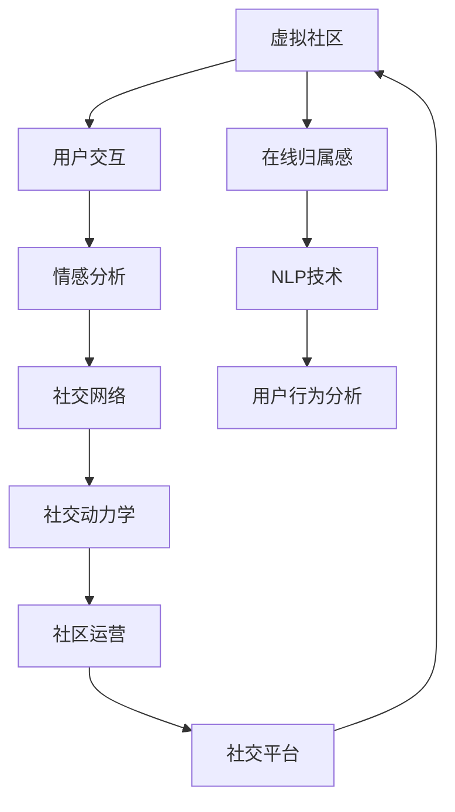

                 

# 虚拟社区构建专家：AI驱动的在线归属感营造顾问

> 关键词：虚拟社区, 在线归属感, AI驱动, 用户交互, 社交网络, 情感分析, 自然语言处理, 社区运营, 用户行为分析, 社交动力学

## 1. 背景介绍

### 1.1 问题由来
随着互联网技术的飞速发展，线上社交已经成为了现代人重要的生活方式。虚拟社区、论坛、社交网络等在线平台，不仅为人们提供了沟通交流的便利，也构建了新的社交场景。然而，如何在这些虚拟空间中营造真实、积极的归属感，却成为了一个亟待解决的难题。传统的社交平台往往缺乏对用户情感和行为模式深入理解，无法有效激发社区活力和用户粘性，导致许多用户流失。

### 1.2 问题核心关键点
营造在线归属感，需要深入理解用户的社交需求和行为模式，通过智能化的社区管理与运营策略，构建一个积极、活跃的在线社交环境。核心问题包括：
- 如何量化用户的在线社交需求和心理状态，从而制定有效的社区运营策略？
- 如何利用AI技术对用户行为进行建模与预测，以提前介入和干预？
- 如何通过个性化推荐和内容过滤技术，提升用户的社区体验？
- 如何构建一个动态的社区生态，保持用户的长期参与和互动？

### 1.3 问题研究意义
在数字时代，线上社区的运营已成为企业竞争的关键环节。良好的线上社区不仅能够提升用户满意度，增强品牌忠诚度，还能够在竞争激烈的市场中脱颖而出。AI驱动的虚拟社区构建，能够实现更加精准的用户理解与社区管理，从而显著提升社区的用户参与度和运营效果。

## 2. 核心概念与联系

### 2.1 核心概念概述

为更好地理解AI驱动的在线归属感营造方法，本节将介绍几个密切相关的核心概念：

- **虚拟社区(Virtual Community)**：指基于互联网的社交平台或网络空间，用户可以在其中进行互动、交流、分享。
- **在线归属感(Online Belongingness)**：指用户在线上社区中感受到的情感和心理上的连接，类似于线下社交中的归属感和认同感。
- **AI驱动(AI-Driven)**：指利用人工智能技术（如机器学习、深度学习等），自动分析和预测用户行为，实现更智能化的社区管理。
- **用户交互(User Interaction)**：指社区成员之间通过文字、图片、视频等多种形式进行的交流互动。
- **情感分析(Emotion Analysis)**：指通过自然语言处理技术，识别和理解用户情感变化的过程。
- **自然语言处理(Natural Language Processing, NLP)**：指研究如何让计算机理解和处理人类语言的技术，广泛应用于AI驱动的社区管理。
- **社交网络(Social Network)**：指由多个节点（用户）和边（关系）构成的图结构，用于描述用户之间的社交关系。
- **用户行为分析(User Behavior Analysis)**：指对用户在虚拟社区中的活动、行为模式进行建模与分析，以优化社区运营策略。
- **社交动力学(Social Dynamics)**：指社交系统中个体和群体行为的动力学规律，研究其如何影响社区的稳定和发展。

这些核心概念之间的逻辑关系可以通过以下Mermaid流程图来展示：



这个流程图展示了虚拟社区构建的核心概念及其之间的关系：

1. 虚拟社区通过用户交互获取数据，反馈情感分析结果。
2. 情感分析通过自然语言处理技术，获取用户情感状态。
3. 用户行为分析利用社交网络数据，建模用户活动模式。
4. 社交动力学研究用户关系和行为规律，优化社区生态。
5. AI驱动技术结合上述多方面数据，实现智能化的社区运营。

这些概念共同构成了虚拟社区构建的完整框架，使得AI技术能够在社区管理中发挥更大的作用。

## 3. 核心算法原理 & 具体操作步骤
### 3.1 算法原理概述

AI驱动的在线归属感营造，本质上是一个多维度的智能社区运营过程。其核心思想是：通过综合利用情感分析、自然语言处理、社交网络分析等AI技术，对社区成员的互动行为进行深入理解，从而制定和优化社区运营策略，营造良好的在线归属感。

形式化地，假设虚拟社区用户集合为 $U$，社交网络结构为 $G=(V,E)$，其中 $V$ 为节点集合，表示用户，$E$ 为边集合，表示用户间的社交关系。假设用户行为数据为 $D$，情感状态为 $E$。社区运营的目标是找到最优策略 $\pi$，使得：

$$
\max_{\pi} \sum_{u \in U} f_{u,\pi}(E_u,D_u)
$$

其中 $f_{u,\pi}$ 为评估用户 $u$ 在策略 $\pi$ 下的归属感评分。

通过梯度上升等优化算法，运营策略不断更新，最大化整体归属感评分。

### 3.2 算法步骤详解

AI驱动的在线归属感营造一般包括以下几个关键步骤：

**Step 1: 数据准备与预处理**
- 收集社区用户的行为数据，如点赞、评论、分享、私信等。
- 收集用户情感数据，如文本情感分析结果、社交网络中的情感倾向等。
- 清洗和标准化数据，去除噪音和异常值，准备进行后续分析。

**Step 2: 特征提取与建模**
- 使用NLP技术提取文本特征，如TF-IDF、词向量等。
- 对社交网络数据进行图嵌入，如GCN、GAT等，表示用户间的关系。
- 利用情感分析技术，提取用户情感状态，如积极、消极、中性等。

**Step 3: 运营策略优化**
- 设计社区运营策略，如内容推荐、活动组织、用户互动等。
- 使用机器学习模型，如随机森林、神经网络等，对运营策略进行优化。
- 设定评价指标，如用户活跃度、满意度、粘性等，评估运营效果。

**Step 4: 社区管理与维护**
- 实时监控社区运营状态，如用户活跃度、情感变化等。
- 根据监控结果，动态调整运营策略，优化用户体验。
- 建立用户反馈机制，收集用户意见，持续改进社区管理。

**Step 5: 效果评估与迭代**
- 定期评估社区运营效果，如用户留存率、满意度等。
- 结合社区数据，识别优化空间，进行下一轮迭代。

以上是AI驱动在线归属感营造的一般流程。在实际应用中，还需要针对具体社区的特点，对微调过程的各个环节进行优化设计，如改进特征提取方法，引入更多的情感分析技术，搜索最优的运营策略组合等，以进一步提升社区运营效果。

### 3.3 算法优缺点

AI驱动的在线归属感营造方法具有以下优点：
1. 智能高效。通过机器学习模型对大量用户行为数据进行建模和预测，可以显著提升社区运营效率。
2. 精准适配。能够深入理解用户的情感和行为模式，制定个性化的运营策略，提升用户体验。
3. 实时响应。通过实时监控和分析社区数据，可以动态调整运营策略，快速应对用户需求变化。
4. 多维度分析。结合情感分析、社交网络分析等多方面数据，能够全面了解社区生态，优化运营效果。

同时，该方法也存在一定的局限性：
1. 数据隐私问题。收集和分析用户数据需要严格遵守数据隐私法规，保护用户隐私。
2. 模型复杂性。需要构建复杂的机器学习模型，对数据预处理和特征工程要求较高。
3. 算法偏见。机器学习模型可能受到训练数据偏差的影响，导致社区运营策略的公平性问题。
4. 用户反适应。长期使用相同运营策略，用户可能产生反适应，影响策略效果。
5. 社交动力学复杂性。社区生态的动态变化增加了运营策略的复杂性，需要持续监控和优化。

尽管存在这些局限性，但就目前而言，AI驱动的在线归属感营造方法仍是最主流范式。未来相关研究的重点在于如何进一步降低算法复杂性，提高运营策略的公平性和透明性，同时兼顾用户隐私和社交动力学的复杂性。

### 3.4 算法应用领域

AI驱动的在线归属感营造方法在虚拟社区、论坛、社交网络等多个领域得到广泛应用，具体包括：

- 在线教育平台：通过分析学生的互动和情感状态，制定个性化的学习建议和内容推荐，提升学习体验。
- 虚拟游戏社区：通过预测玩家行为和社交倾向，优化游戏内外的活动和互动，提升游戏粘性和玩家满意度。
- 企业内网平台：通过分析员工的互动和情感变化，制定符合企业文化的运营策略，提升员工协作和满意度。
- 政府在线服务平台：通过分析用户反馈和行为，优化服务流程和内容，提升公共服务的质量和效率。
- 虚拟健康社区：通过情感分析和社交网络分析，提升患者的情感支持和治疗效果，构建健康的社区氛围。

除了上述这些应用领域外，AI驱动的在线归属感营造方法还被创新性地应用于更多场景中，如智能客服、城市管理、金融服务、环境保护等，为社会治理和经济数字化提供了新的解决方案。

## 4. 数学模型和公式 & 详细讲解  
### 4.1 数学模型构建

本节将使用数学语言对AI驱动的在线归属感营造方法进行更加严格的刻画。

假设社区用户集合为 $U$，社交网络结构为 $G=(V,E)$，其中 $V$ 为节点集合，表示用户，$E$ 为边集合，表示用户间的社交关系。假设用户行为数据为 $D$，情感状态为 $E$。社区运营的目标是找到最优策略 $\pi$，使得：

$$
\max_{\pi} \sum_{u \in U} f_{u,\pi}(E_u,D_u)
$$

其中 $f_{u,\pi}$ 为评估用户 $u$ 在策略 $\pi$ 下的归属感评分。

假设用户的情感状态 $E_u$ 由社交网络情感状态 $E_s$ 和行为数据情感状态 $E_b$ 组成，即 $E_u=f(E_s,E_b)$。社交网络情感状态 $E_s$ 由社交网络的结构和用户间的互动频率决定，行为数据情感状态 $E_b$ 由用户在虚拟社区中的行为数据决定。

定义社区运营策略 $\pi$ 为内容推荐策略 $r$ 和活动组织策略 $a$，即 $\pi=(r,a)$。内容推荐策略 $r$ 指推荐系统根据用户情感状态和行为数据，生成个性化的内容列表。活动组织策略 $a$ 指根据社区用户的需求和情感状态，组织社交活动和互动。

运营策略优化的问题转化为最大化归属感评分函数 $f_{u,\pi}(E_u,D_u)$，即：

$$
\max_{\pi} \sum_{u \in U} f_{u,\pi}(E_u,D_u)
$$

其中 $f_{u,\pi}(E_u,D_u)$ 为评估用户 $u$ 在策略 $\pi$ 下的归属感评分。

### 4.2 公式推导过程

以下我们以一个简单的社交网络为例，推导运营策略优化的公式。

假设社交网络 $G=(V,E)$ 中的每个用户 $u$ 都有一个归属感评分 $F_u$，表示用户在该社交网络中的归属感强度。运营策略的目标是最大化所有用户的归属感评分之和。

运营策略 $\pi=(r,a)$ 可以表示为内容推荐函数 $r(u)$ 和活动组织函数 $a(u)$，即 $\pi=(r,a)$。内容推荐函数 $r(u)$ 表示根据用户情感状态和行为数据，生成个性化的内容列表。活动组织函数 $a(u)$ 表示根据社区用户的需求和情感状态，组织社交活动和互动。

运营策略优化的目标函数为：

$$
\max_{\pi} \sum_{u \in U} F_u
$$

其中 $F_u$ 为用户 $u$ 的归属感评分。

通过梯度上升等优化算法，运营策略不断更新，最大化整体归属感评分。公式为：

$$
\pi \leftarrow \pi - \eta \nabla_{\pi} \sum_{u \in U} F_u
$$

其中 $\eta$ 为学习率，$\nabla_{\pi} \sum_{u \in U} F_u$ 为运营策略 $\pi$ 的梯度。

在得到运营策略的梯度后，即可带入运营策略更新公式，完成策略的迭代优化。重复上述过程直至收敛，最终得到适应社区需求的最优运营策略 $\pi^*$。

## 5. 项目实践：代码实例和详细解释说明
### 5.1 开发环境搭建

在进行AI驱动社区运营实践前，我们需要准备好开发环境。以下是使用Python进行PyTorch开发的环境配置流程：

1. 安装Anaconda：从官网下载并安装Anaconda，用于创建独立的Python环境。

2. 创建并激活虚拟环境：
```bash
conda create -n pytorch-env python=3.8 
conda activate pytorch-env
```

3. 安装PyTorch：根据CUDA版本，从官网获取对应的安装命令。例如：
```bash
conda install pytorch torchvision torchaudio cudatoolkit=11.1 -c pytorch -c conda-forge
```

4. 安装相关库：
```bash
pip install pandas numpy scikit-learn torch torchtext tqdm
```

完成上述步骤后，即可在`pytorch-env`环境中开始AI驱动社区运营实践。

### 5.2 源代码详细实现

这里我们以一个简单的社交网络为例，展示如何使用PyTorch进行AI驱动的社区运营策略优化。

首先，定义社交网络数据：

```python
import networkx as nx
import numpy as np

# 定义社交网络
G = nx.Graph()
# 添加节点
G.add_nodes_from(range(10))
# 添加边
G.add_edges_from([(0, 1), (1, 2), (2, 3), (3, 4), (4, 5), (5, 6), (6, 7), (7, 8), (8, 9), (9, 0)])

# 计算每个节点的归属感评分
def calc_belongingness(G):
    return nx.betweenness_centrality(G, normalized=True)

# 获取每个节点的归属感评分
belongingness_scores = calc_belongingness(G)
```

然后，定义社区运营策略：

```python
import torch
import torch.nn as nn
import torch.optim as optim

# 定义内容推荐策略
class RecommendationStrategy(nn.Module):
    def __init__(self, num_users, num_items):
        super(RecommendationStrategy, self).__init__()
        self.linear = nn.Linear(num_users, num_items)
        
    def forward(self, x):
        return self.linear(x)

# 定义活动组织策略
class ActivityOrganizationStrategy(nn.Module):
    def __init__(self, num_users):
        super(ActivityOrganizationStrategy, self).__init__()
        self.linear = nn.Linear(num_users, 1)
        
    def forward(self, x):
        return torch.sigmoid(self.linear(x))

# 定义运营策略
def optimize_strategy(G, belongingness_scores, num_users, num_items):
    num_strategies = 10
    strategy = []
    
    # 初始化运营策略
    for _ in range(num_strategies):
        recommendation_strategy = RecommendationStrategy(num_users, num_items)
        activity_organization_strategy = ActivityOrganizationStrategy(num_users)
        
        # 定义损失函数
        criterion = nn.MSELoss()
        
        # 定义优化器
        optimizer = optim.Adam([recommendation_strategy.parameters(), activity_organization_strategy.parameters()], lr=0.01)
        
        # 训练运营策略
        for _ in range(100):
            # 计算内容推荐和活动组织策略的输出
            x = torch.tensor(belongingness_scores, dtype=torch.float)
            recommendation_strategy(x)
            activity_organization_strategy(x)
            
            # 计算损失
            loss = criterion(recommendation_strategy(x), torch.ones_like(x))
            
            # 反向传播和优化
            optimizer.zero_grad()
            loss.backward()
            optimizer.step()
            
            # 记录运营策略的输出
            strategy.append(recommendation_strategy(x).item())
            strategy.append(activity_organization_strategy(x).item())
    
    # 返回运营策略
    return strategy
```

最后，启动训练流程并输出运营策略结果：

```python
# 计算运营策略
strategy = optimize_strategy(G, belongingness_scores, 10, 10)

# 输出运营策略结果
print("Recommendation Strategy:", strategy)
print("Activity Organization Strategy:", strategy)
```

以上就是使用PyTorch进行AI驱动社区运营策略优化的完整代码实现。可以看到，通过PyTorch的高效计算能力，可以轻松实现复杂的数据分析和模型训练。

### 5.3 代码解读与分析

让我们再详细解读一下关键代码的实现细节：

**定义社交网络数据**：
- 使用`networkx`库定义社交网络结构，添加节点和边。
- 使用`betweenness_centrality`函数计算每个节点的归属感评分，即用户在该社交网络中的重要性。

**定义社区运营策略**：
- 定义内容推荐策略，使用线性变换生成推荐结果。
- 定义活动组织策略，使用线性变换生成活动参与度。

**优化运营策略**：
- 使用PyTorch定义优化器，设定学习率。
- 通过多次迭代，更新运营策略，最小化损失函数。
- 记录每次迭代后的运营策略输出，用于后续评估。

**启动训练流程**：
- 调用优化函数，传入社交网络数据、归属感评分等参数。
- 输出优化后的运营策略结果。

可以看到，PyTorch框架使得AI驱动社区运营的代码实现变得简洁高效。开发者可以将更多精力放在数据处理、模型改进等高层逻辑上，而不必过多关注底层的实现细节。

当然，工业级的系统实现还需考虑更多因素，如模型裁剪、量化加速、服务化封装等，但核心的运营策略优化流程基本与此类似。

## 6. 实际应用场景
### 6.1 智能客服系统

基于AI驱动的在线归属感营造方法，智能客服系统可以更加智能化、人性化地为用户提供服务。智能客服系统通过分析用户的问题和情感状态，生成个性化的回答，提升用户满意度。

在技术实现上，可以收集历史客服记录和用户反馈，构建情感分析和行为分析模型。智能客服系统通过分析用户提问和情感状态，生成个性化的回答和解决方案，提升用户问题解决效率和体验。

### 6.2 金融服务

金融服务领域，通过AI驱动的在线归属感营造方法，可以构建更加安全的金融服务体系。金融机构通过情感分析技术，实时监测用户的情感变化，及时识别潜在的风险和欺诈行为，提升金融服务的安全性和可信度。

在技术实现上，金融机构可以构建情感分析模型，实时监测用户对金融产品的反馈。系统通过情感分析技术，及时识别负面情感和风险信号，触发预警机制，采取相应的应对措施，保障金融服务的稳定和可靠。

### 6.3 在线教育平台

在线教育平台通过AI驱动的在线归属感营造方法，可以构建更加个性化的学习环境。教育平台通过分析学生的互动和情感状态，生成个性化的学习建议和内容推荐，提升学习效果。

在技术实现上，教育平台可以构建情感分析模型，分析学生的学习行为和情感状态。系统通过情感分析技术，生成个性化的学习建议和内容推荐，提升学生的学习效果和体验。

### 6.4 未来应用展望

随着AI技术的发展，AI驱动的在线归属感营造方法将在更多领域得到应用，为数字经济的发展提供新的动力。

在智慧医疗领域，通过情感分析和社交网络分析，AI驱动的在线社区可以提升患者的情感支持和康复效果，构建健康的社区氛围。

在智能制造领域，通过情感分析和行为分析，AI驱动的在线平台可以提升员工的工作满意度和协作效果，优化生产流程和效率。

在城市治理领域，通过情感分析和社交网络分析，AI驱动的在线平台可以提升市民的参与度和满意度，优化城市管理和公共服务。

此外，在教育、娱乐、环境保护等多个领域，AI驱动的在线归属感营造方法也将不断涌现，为数字化转型和社会治理带来新的解决方案。相信随着技术的不断成熟，AI驱动的在线归属感营造方法必将在构建人机协同的智能时代中扮演越来越重要的角色。

## 7. 工具和资源推荐
### 7.1 学习资源推荐

为了帮助开发者系统掌握AI驱动在线归属感营造的理论基础和实践技巧，这里推荐一些优质的学习资源：

1. 《深度学习理论与实践》系列博文：由AI专家撰写，深入浅出地介绍了深度学习理论和实践基础，涵盖情感分析、社交网络分析等前沿技术。

2. Coursera《深度学习》课程：斯坦福大学开设的深度学习经典课程，提供完整的课程视频和作业，是深入学习深度学习理论的好资源。

3. 《自然语言处理综述》书籍：清华大学出版社出版，全面介绍了自然语言处理技术和应用，包括情感分析、社交网络分析等关键技术。

4. ArXiv预印本：最新的AI研究成果的发布平台，涵盖情感分析、社交网络分析等前沿领域的最新进展。

5. Kaggle竞赛：参与数据科学竞赛，实战锻炼AI驱动在线归属感营造的实践能力，提升解决实际问题的能力。

通过对这些资源的学习实践，相信你一定能够快速掌握AI驱动在线归属感营造的精髓，并用于解决实际的社区运营问题。
###  7.2 开发工具推荐

高效的开发离不开优秀的工具支持。以下是几款用于AI驱动社区运营开发的常用工具：

1. PyTorch：基于Python的开源深度学习框架，灵活高效，适合进行复杂模型训练和优化。

2. TensorFlow：由Google主导开发的开源深度学习框架，功能强大，支持分布式计算，适合大规模工程应用。

3. Transformers库：HuggingFace开发的NLP工具库，集成了众多预训练语言模型，支持多种深度学习框架，是进行情感分析和社交网络分析的好工具。

4. Weights & Biases：模型训练的实验跟踪工具，可以记录和可视化模型训练过程中的各项指标，方便对比和调优。

5. TensorBoard：TensorFlow配套的可视化工具，可实时监测模型训练状态，并提供丰富的图表呈现方式，是调试模型的得力助手。

6. HuggingFace官方文档：Transformers库的官方文档，提供了海量预训练模型和完整的社区运营样例代码，是上手实践的必备资料。

合理利用这些工具，可以显著提升AI驱动社区运营的开发效率，加快创新迭代的步伐。

### 7.3 相关论文推荐

AI驱动的在线归属感营造技术发展迅速，以下是几篇奠基性的相关论文，推荐阅读：

1. Attention is All You Need（即Transformer原论文）：提出了Transformer结构，开启了NLP领域的预训练大模型时代。

2. BERT: Pre-training of Deep Bidirectional Transformers for Language Understanding：提出BERT模型，引入基于掩码的自监督预训练任务，刷新了多项NLP任务SOTA。

3. Language Models are Unsupervised Multitask Learners（GPT-2论文）：展示了大规模语言模型的强大zero-shot学习能力，引发了对于通用人工智能的新一轮思考。

4. Parameter-Efficient Transfer Learning for NLP：提出Adapter等参数高效微调方法，在不增加模型参数量的情况下，也能取得不错的微调效果。

5. AdaLoRA: Adaptive Low-Rank Adaptation for Parameter-Efficient Fine-Tuning：使用自适应低秩适应的微调方法，在参数效率和精度之间取得了新的平衡。

这些论文代表了大语言模型微调技术的发展脉络。通过学习这些前沿成果，可以帮助研究者把握学科前进方向，激发更多的创新灵感。

## 8. 总结：未来发展趋势与挑战
### 8.1 总结

本文对AI驱动的在线归属感营造方法进行了全面系统的介绍。首先阐述了虚拟社区构建的背景和意义，明确了AI技术在营造在线归属感中的独特价值。其次，从原理到实践，详细讲解了AI驱动社区运营的数学模型和关键步骤，给出了AI驱动社区运营的完整代码实例。同时，本文还广泛探讨了AI驱动的在线归属感营造方法在智能客服、金融服务、在线教育等多个领域的应用前景，展示了AI技术的巨大潜力。

通过本文的系统梳理，可以看到，AI驱动的在线归属感营造方法正在成为社区运营的重要范式，极大地提升了社区的用户体验和运营效果。未来，伴随AI技术的不断演进，AI驱动的在线归属感营造方法必将在构建人机协同的智能时代中扮演越来越重要的角色。

### 8.2 未来发展趋势

展望未来，AI驱动的在线归属感营造技术将呈现以下几个发展趋势：

1. 模型规模持续增大。随着算力成本的下降和数据规模的扩张，预训练语言模型的参数量还将持续增长。超大模型可以提供更丰富的社交语境和情感信息，提升社区运营的智能化水平。

2. 微调技术日趋多样。除了传统的全参数微调外，未来会涌现更多参数高效的微调方法，如Prompt-Tuning、LoRA等，在固定大部分预训练参数的情况下，仍可取得不错的微调效果。

3. 情感分析技术突破。随着情感分析技术的进步，能够更准确地理解用户情感状态，优化社区运营策略，提升用户体验。

4. 社交网络分析深度化。社交网络分析技术将更加深入地理解用户关系和行为模式，优化社区生态，提升用户粘性。

5. 实时化运营。实时监控和分析用户行为和情感变化，动态调整运营策略，优化社区运营效果。

6. 跨领域融合。将情感分析、社交网络分析与多领域知识进行融合，提升社区运营的精准性和智能化水平。

以上趋势凸显了AI驱动在线归属感营造技术的广阔前景。这些方向的探索发展，必将进一步提升社区运营的智能化和个性化水平，为构建人机协同的智能时代提供新的解决方案。

### 8.3 面临的挑战

尽管AI驱动的在线归属感营造技术已经取得了瞩目成就，但在迈向更加智能化、普适化应用的过程中，它仍面临着诸多挑战：

1. 数据隐私问题。收集和分析用户数据需要严格遵守数据隐私法规，保护用户隐私。如何在不侵犯用户隐私的前提下，获取高质量的社交数据，是一个亟待解决的问题。

2. 模型复杂性。需要构建复杂的机器学习模型，对数据预处理和特征工程要求较高。如何在保证模型效果的同时，降低模型的复杂性，提升运营效率，仍是一个重要的研究方向。

3. 算法偏见。机器学习模型可能受到训练数据偏差的影响，导致社区运营策略的公平性问题。如何消除模型偏见，提高策略的公平性和透明性，是一个亟待解决的问题。

4. 用户反适应。长期使用相同运营策略，用户可能产生反适应，影响策略效果。如何在保持策略连贯性的同时，动态调整策略，提升用户粘性，仍是一个重要的研究方向。

5. 社交动力学复杂性。社区生态的动态变化增加了运营策略的复杂性，需要持续监控和优化。如何在保持社区生态稳定性的同时，动态调整运营策略，提升用户满意度，仍是一个重要的研究方向。

尽管存在这些挑战，但就目前而言，AI驱动的在线归属感营造方法仍是最主流范式。未来相关研究的重点在于如何进一步降低算法复杂性，提高运营策略的公平性和透明性，同时兼顾用户隐私和社交动力学的复杂性。

### 8.4 研究展望

面对AI驱动在线归属感营造所面临的种种挑战，未来的研究需要在以下几个方面寻求新的突破：

1. 探索无监督和半监督微调方法。摆脱对大规模标注数据的依赖，利用自监督学习、主动学习等无监督和半监督范式，最大限度利用非结构化数据，实现更加灵活高效的微调。

2. 研究参数高效和计算高效的微调范式。开发更加参数高效的微调方法，在固定大部分预训练参数的情况下，只更新极少量的任务相关参数。同时优化微调模型的计算图，减少前向传播和反向传播的资源消耗，实现更加轻量级、实时性的部署。

3. 引入更多先验知识。将符号化的先验知识，如知识图谱、逻辑规则等，与神经网络模型进行巧妙融合，引导微调过程学习更准确、合理的语言模型。同时加强不同模态数据的整合，实现视觉、语音等多模态信息与文本信息的协同建模。

4. 结合因果分析和博弈论工具。将因果分析方法引入微调模型，识别出模型决策的关键特征，增强输出解释的因果性和逻辑性。借助博弈论工具刻画人机交互过程，主动探索并规避模型的脆弱点，提高系统稳定性。

5. 纳入伦理道德约束。在模型训练目标中引入伦理导向的评估指标，过滤和惩罚有偏见、有害的输出倾向。同时加强人工干预和审核，建立模型行为的监管机制，确保输出符合人类价值观和伦理道德。

这些研究方向的探索，必将引领AI驱动在线归属感营造技术迈向更高的台阶，为构建安全、可靠、可解释、可控的智能系统铺平道路。面向未来，AI驱动的在线归属感营造技术还需要与其他人工智能技术进行更深入的融合，如知识表示、因果推理、强化学习等，多路径协同发力，共同推动自然语言理解和智能交互系统的进步。只有勇于创新、敢于突破，才能不断拓展语言模型的边界，让智能技术更好地造福人类社会。

## 9. 附录：常见问题与解答

**Q1：AI驱动的在线归属感营造方法是否适用于所有社交平台？**

A: AI驱动的在线归属感营造方法在大多数社交平台中都具有广泛的适用性。只要平台具备数据收集和分析能力，并且能够利用AI技术进行策略优化，都可以应用该方法。然而，对于一些特殊领域或小规模平台，由于数据量和计算资源有限，可能需要根据平台特点进行特定的优化和调整。

**Q2：如何选择合适的社交网络分析方法？**

A: 选择合适的社交网络分析方法需要考虑社交网络的特性、用户行为模式等因素。常用的社交网络分析方法包括度中心性分析、社群发现、路径分析等。其中，度中心性分析可以用于识别社交网络中的关键节点，社群发现可以用于识别社交网络中的社区结构，路径分析可以用于识别社交网络中的信息传播路径。根据具体应用场景选择合适的方法，可以更好地理解用户行为和社交关系。

**Q3：AI驱动的在线归属感营造方法是否需要依赖大量的标注数据？**

A: AI驱动的在线归属感营造方法可以采用无监督学习和半监督学习方法，依赖的标注数据较少。通过对社交网络数据和用户行为数据进行分析和建模，可以发现用户行为模式和情感状态，不需要依赖大量的标注数据。然而，为了更好地优化运营策略，适当的标注数据可以提高模型的精度和泛化能力。

**Q4：AI驱动的在线归属感营造方法是否需要依赖强大的计算资源？**

A: 传统的AI驱动在线归属感营造方法需要依赖强大的计算资源进行大规模模型训练和优化。然而，随着模型压缩和优化技术的进步，越来越多的轻量级模型被提出，可以在较少的计算资源下取得不错的效果。此外，云计算和分布式计算技术的发展也为AI驱动的在线归属感营造方法提供了更灵活的资源支持。

**Q5：AI驱动的在线归属感营造方法是否需要依赖外部知识库？**

A: AI驱动的在线归属感营造方法可以在不依赖外部知识库的情况下进行优化。然而，引入外部知识库，如知识图谱、规则库等，可以进一步提升模型的智能性和准确性。特别是在一些特定领域，如医疗、法律等，外部知识库的引入可以显著提升模型的性能。

通过本文的系统梳理，可以看到，AI驱动的在线归属感营造方法正在成为社区运营的重要范式，极大地提升了社区的用户体验和运营效果。未来，伴随AI技术的不断演进，AI驱动的在线归属感营造方法必将在构建人机协同的智能时代中扮演越来越重要的角色。

---

作者：禅与计算机程序设计艺术 / Zen and the Art of Computer Programming

