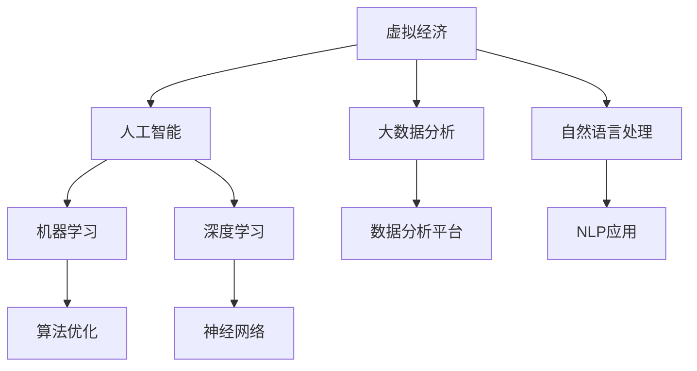

                 

# 虚拟经济：AI驱动的新型价值交换

## 1. 背景介绍

### 1.1 问题由来

随着科技的进步和互联网的普及，虚拟经济正在逐步成为全球经济的新引擎。虚拟经济是指通过互联网平台进行的交易，如金融投资、电子商务、游戏、数字资产等，与传统经济形式相比，具有更高的自由度、更广的覆盖范围和更强的创新能力。然而，虚拟经济也面临着交易安全、信息透明度、监管难度等诸多挑战。

人工智能（AI）技术的迅速发展为虚拟经济注入了新的活力，推动了新型价值交换方式的形成。AI可以通过大数据分析、机器学习、自然语言处理等技术，提升虚拟经济的安全性、效率性和透明度，使交易更加便捷、智能和可信。

### 1.2 问题核心关键点

AI在虚拟经济中的应用，主要集中在以下几个方面：

1. **智能风控**：利用机器学习模型分析交易数据，及时发现和防范欺诈行为，提高交易安全。
2. **信息聚合**：通过自然语言处理技术，自动抓取和分析海量信息，为用户提供更全面的市场分析、价格预测等。
3. **个性化推荐**：使用协同过滤、深度学习等技术，推荐符合用户兴趣和需求的产品和服务，提升用户体验。
4. **自动化交易**：借助AI算法，实现高频交易、算法交易等，提升交易效率和收益。
5. **虚拟资产管理**：利用AI对虚拟资产进行智能管理，优化投资组合，降低风险。

AI技术的发展，使得虚拟经济的价值交换更加高效、透明、可信，为虚拟经济的发展注入了新的动力。

## 2. 核心概念与联系

### 2.1 核心概念概述

为更好地理解AI驱动的虚拟经济，本节将介绍几个密切相关的核心概念：

- **虚拟经济**：通过互联网平台进行的交易，包括金融投资、电子商务、游戏、数字资产等。
- **人工智能**：利用计算机技术和算法，模拟人类智能活动，如学习、推理、感知等。
- **大数据分析**：通过对海量数据进行收集、存储、分析和可视化，揭示数据背后的规律和趋势。
- **自然语言处理**（Natural Language Processing, NLP）：使计算机能够理解和处理人类语言的技术。
- **机器学习**（Machine Learning, ML）：通过算法使计算机从数据中学习规律，实现自动决策和预测。
- **深度学习**（Deep Learning, DL）：一种基于多层神经网络的机器学习技术，擅长处理非结构化数据。

这些核心概念之间的逻辑关系可以通过以下Mermaid流程图来展示：



这个流程图展示了大语言模型的核心概念及其之间的关系：

1. 虚拟经济通过人工智能进行驱动，利用AI技术提升交易效率和安全性。
2. 人工智能在虚拟经济中应用了大数据分析和自然语言处理等技术。
3. 机器学习和深度学习是AI的核心算法，使AI具备强大的学习和决策能力。
4. 数据分析平台和大NLP应用是AI技术的基础设施，为虚拟经济提供了支撑。

这些核心概念共同构成了AI驱动虚拟经济的技术框架，使其能够高效地进行新型价值交换。

## 3. 核心算法原理 & 具体操作步骤
### 3.1 算法原理概述

AI在虚拟经济中的应用，主要基于以下算法原理：

1. **数据预处理**：通过数据清洗、特征提取等步骤，将原始数据转换为适合机器学习模型处理的格式。
2. **模型训练**：利用历史数据训练机器学习模型，使其具备预测和分类能力。
3. **模型部署**：将训练好的模型部署到生产环境，实现自动决策和预测。
4. **模型优化**：通过实时监控和反馈机制，不断优化模型性能。

### 3.2 算法步骤详解

以下以智能风控为例，详细讲解AI在虚拟经济中的应用步骤：

**Step 1: 数据收集**

1. 收集历史交易数据，包括交易时间、金额、交易对象等。
2. 清洗数据，去除噪声和不完整记录。
3. 提取特征，如交易频率、金额变化、交易对象信誉等。

**Step 2: 模型训练**

1. 选择合适的机器学习算法，如逻辑回归、随机森林、梯度提升树等。
2. 划分数据集，分为训练集和测试集。
3. 使用训练集数据训练模型，通过交叉验证优化参数。

**Step 3: 模型部署**

1. 将训练好的模型部署到生产环境，实现实时交易监控。
2. 监控模型的预测结果和准确率，进行实时优化。
3. 当模型发现异常交易时，及时发出警报。

**Step 4: 模型优化**

1. 定期更新模型，增加新数据进行训练。
2. 引入新的特征，提升模型的预测能力。
3. 使用对抗样本等方法，增强模型的鲁棒性。

### 3.3 算法优缺点

AI在虚拟经济中的应用，具有以下优点：

1. **高效性**：利用机器学习和深度学习算法，可以在短时间内处理海量交易数据，实现高效决策。
2. **透明度**：AI模型提供自动化的决策过程，减少了人为干预，提高了交易透明度。
3. **安全性**：通过异常检测和风险预测，可以有效防范欺诈行为，提升交易安全性。
4. **个性化**：利用NLP和协同过滤技术，提供个性化推荐和市场分析，提升用户体验。

同时，AI在虚拟经济中也有一些局限性：

1. **数据质量要求高**：AI模型对数据质量要求较高，需要清洗和处理海量数据。
2. **模型复杂度高**：深度学习模型复杂度较高，需要大量的计算资源和存储资源。
3. **模型解释性差**：AI模型往往是“黑盒”，难以解释其决策过程。
4. **模型过拟合风险**：模型过于复杂，容易过拟合训练数据，降低泛化能力。

尽管存在这些局限性，但AI在虚拟经济中的应用前景广阔，其高效、透明和安全的特性，将使其成为未来虚拟经济的重要驱动力。

### 3.4 算法应用领域

AI在虚拟经济中的应用，涵盖了以下几个领域：

1. **金融投资**：利用AI进行市场分析、风险评估和投资组合优化，提升投资收益。
2. **电子商务**：通过AI进行个性化推荐、库存管理和物流优化，提升用户体验。
3. **游戏领域**：利用AI进行游戏策略分析、玩家行为预测和智能客服，提升游戏体验。
4. **数字资产**：通过AI进行虚拟资产管理、价格预测和交易自动化，降低风险。

此外，AI还在虚拟经济的其他领域，如社交媒体、数字内容等，展现了其强大的应用潜力。

## 4. 数学模型和公式 & 详细讲解 & 举例说明（备注：数学公式请使用latex格式，latex嵌入文中独立段落使用 $$，段落内使用 $)
### 4.1 数学模型构建

本节将使用数学语言对AI在虚拟经济中的应用进行更加严格的刻画。

记虚拟经济交易数据集为 $D=\{(x_i, y_i)\}_{i=1}^N$，其中 $x_i$ 为输入特征，$y_i$ 为交易标签（如欺诈与否）。

定义机器学习模型的损失函数为 $\ell(\theta, D)$，用于衡量模型预测与真实标签之间的差异。常见的损失函数包括交叉熵损失、均方误差损失等。

模型的预测结果为 $\hat{y}=f_{\theta}(x)$，其中 $f_{\theta}(x)$ 为机器学习模型的映射函数，$\theta$ 为模型参数。

模型的训练目标是最小化损失函数：

$$
\theta^* = \mathop{\arg\min}_{\theta} \ell(\theta, D)
$$

在实践中，我们通常使用基于梯度的优化算法（如SGD、Adam等）来近似求解上述最优化问题。设 $\eta$ 为学习率，$\lambda$ 为正则化系数，则参数的更新公式为：

$$
\theta \leftarrow \theta - \eta \nabla_{\theta}\ell(\theta) - \eta\lambda\theta
$$

其中 $\nabla_{\theta}\ell(\theta)$ 为损失函数对参数 $\theta$ 的梯度，可通过反向传播算法高效计算。

### 4.2 公式推导过程

以下以逻辑回归模型为例，推导其损失函数和梯度计算公式。

逻辑回归模型的预测结果为：

$$
\hat{y} = \sigma(\theta^T x)
$$

其中 $\sigma(z)=\frac{1}{1+e^{-z}}$ 为sigmoid函数，$\theta^T x$ 为输入特征的线性组合。

假设模型在训练集上的损失函数为：

$$
\ell(\theta) = -\frac{1}{N}\sum_{i=1}^N [y_i\log \hat{y_i} + (1-y_i)\log(1-\hat{y_i})]
$$

利用梯度下降算法，对损失函数求导，得：

$$
\nabla_{\theta}\ell(\theta) = \frac{1}{N}\sum_{i=1}^N [(y_i-\hat{y_i})x_i]
$$

其中 $x_i$ 为输入特征向量，$y_i$ 为真实标签。

将 $\nabla_{\theta}\ell(\theta)$ 代入参数更新公式，得：

$$
\theta \leftarrow \theta - \eta [(y_i-\hat{y_i})x_i] - \eta\lambda\theta
$$

在得到损失函数的梯度后，即可带入参数更新公式，完成模型的迭代优化。重复上述过程直至收敛，最终得到适应虚拟经济场景的最优模型参数 $\theta^*$。

## 5. 项目实践：代码实例和详细解释说明
### 5.1 开发环境搭建

在进行AI驱动的虚拟经济项目开发前，我们需要准备好开发环境。以下是使用Python进行Scikit-learn开发的环境配置流程：

1. 安装Anaconda：从官网下载并安装Anaconda，用于创建独立的Python环境。

2. 创建并激活虚拟环境：
```bash
conda create -n ai-env python=3.8 
conda activate ai-env
```

3. 安装Scikit-learn：
```bash
conda install scikit-learn
```

4. 安装各类工具包：
```bash
pip install numpy pandas scikit-learn matplotlib tqdm jupyter notebook ipython
```

完成上述步骤后，即可在`ai-env`环境中开始项目实践。

### 5.2 源代码详细实现

这里我们以智能风控项目为例，给出使用Scikit-learn进行机器学习模型训练的Python代码实现。

首先，定义数据预处理函数：

```python
import pandas as pd
from sklearn.preprocessing import StandardScaler

def preprocess_data(data_file):
    df = pd.read_csv(data_file)
    # 去除不完整和异常记录
    df = df.dropna()
    # 特征工程，提取和构造新特征
    # 例如，计算交易金额的累积变化
    df['amount_change'] = df['amount'].diff()
    # 标准化特征数据
    scaler = StandardScaler()
    df[['amount_change']] = scaler.fit_transform(df[['amount_change']])
    return df
```

然后，定义模型训练函数：

```python
from sklearn.linear_model import LogisticRegression
from sklearn.model_selection import train_test_split
from sklearn.metrics import accuracy_score

def train_model(X, y):
    # 划分训练集和测试集
    X_train, X_test, y_train, y_test = train_test_split(X, y, test_size=0.2, random_state=42)
    # 训练逻辑回归模型
    model = LogisticRegression()
    model.fit(X_train, y_train)
    # 测试模型性能
    y_pred = model.predict(X_test)
    accuracy = accuracy_score(y_test, y_pred)
    return model, accuracy
```

接着，定义模型部署函数：

```python
def deploy_model(model, data_file):
    df = preprocess_data(data_file)
    # 实时监控新数据
    while True:
        df_new = pd.read_csv(data_file, header=0)
        df_new = df_new.dropna()
        X_new = df_new[['amount_change']]
        y_new = df_new['is_fraud']
        y_pred = model.predict(X_new)
        if y_pred[0] == 1:
            print('警报：存在欺诈行为')
```

最后，启动模型训练和部署流程：

```python
# 读取训练数据
train_data = 'train.csv'
test_data = 'test.csv'

# 训练模型
model, accuracy = train_model(train_data, test_data)
print(f'模型准确率：{accuracy:.2f}')

# 部署模型
deploy_model(model, train_data)
```

以上就是使用Scikit-learn对虚拟经济智能风控项目进行机器学习模型训练的完整代码实现。可以看到，Scikit-learn提供了丰富的算法库和工具函数，使得模型开发过程相对简洁高效。

### 5.3 代码解读与分析

让我们再详细解读一下关键代码的实现细节：

**preprocess_data函数**：
- `read_csv`方法：读取训练数据文件。
- `dropna`方法：去除不完整和异常记录。
- `diff`方法：计算交易金额的累积变化。
- `StandardScaler`：对特征数据进行标准化处理。
- `fit_transform`方法：对标准化数据进行拟合和转换。

**train_model函数**：
- `train_test_split`方法：将数据集划分为训练集和测试集。
- `LogisticRegression`：定义逻辑回归模型。
- `fit`方法：使用训练集数据训练模型。
- `predict`方法：对测试集数据进行预测。
- `accuracy_score`方法：计算模型预测的准确率。

**deploy_model函数**：
- `while True`循环：持续读取新数据。
- `preprocess_data`方法：预处理新数据。
- `X_new`和`y_new`：提取新数据中的特征和标签。
- `predict`方法：对新数据进行预测。
- `if`语句：判断是否存在欺诈行为，并发出警报。

通过这些关键代码，可以看到Scikit-learn在虚拟经济智能风控中的应用效果。Scikit-learn提供了丰富的算法和工具函数，使得模型开发和部署变得相对简单。开发者可以灵活组合这些函数，构建满足实际需求的智能风控系统。

当然，工业级的系统实现还需考虑更多因素，如模型的保存和部署、超参数的自动搜索、更灵活的任务适配层等。但核心的智能风控模型开发流程基本与此类似。

## 6. 实际应用场景
### 6.1 智能投顾系统

AI驱动的智能投顾系统，可以基于用户的历史交易数据和行为数据，进行智能分析并给出投资建议。通过AI算法，系统可以动态调整投资组合，降低风险，提升收益。例如，可以通过机器学习模型分析市场趋势，预测股票价格波动，推荐买入或卖出股票。

在技术实现上，可以收集用户的投资偏好、风险承受能力等数据，构建监督学习模型进行训练。通过实时获取市场数据，动态调整投资组合，实现精准的投资建议。智能投顾系统还可以通过个性化推荐、智能客服等功能，提升用户体验。

### 6.2 电商推荐系统

AI驱动的电商推荐系统，可以基于用户的浏览历史、购买记录等数据，进行个性化推荐。通过NLP和协同过滤算法，系统可以理解用户需求，推荐符合用户兴趣的商品，提升用户体验和销售额。

在技术实现上，可以收集用户的点击、浏览、购买行为数据，构建推荐模型进行训练。利用NLP技术对商品描述进行文本分析，提取特征，提升推荐模型的精准度。同时，系统还可以通过用户行为数据进行实时调整，实现更个性化的推荐服务。

### 6.3 虚拟资产管理平台

AI驱动的虚拟资产管理平台，可以基于数字资产的历史交易数据和市场信息，进行智能管理和风险控制。通过机器学习模型，系统可以预测市场走势，动态调整投资组合，降低风险。例如，可以通过深度学习模型分析市场数据，预测数字资产价格波动，实现自动买卖。

在技术实现上，可以收集数字资产的历史交易数据、市场信息等数据，构建预测模型进行训练。利用深度学习技术，提升预测模型的精准度。同时，系统还可以通过实时监控和调整，实现更智能的数字资产管理。

### 6.4 未来应用展望

随着AI技术的不断发展，虚拟经济中的应用场景将更加广泛，带来更多的创新和变革。

在智慧金融领域，AI可以应用于智能投顾、量化交易、风险管理等环节，提升金融服务的智能化水平，降低交易成本，提升用户体验。

在智慧零售领域，AI可以应用于电商推荐、库存管理、智能客服等环节，提升零售服务的智能化水平，提升销售额和客户满意度。

在数字资产领域，AI可以应用于虚拟资产管理、价格预测、自动化交易等环节，提升资产管理的智能化水平，降低风险，提升收益。

此外，在智慧社交、智慧媒体等更多领域，AI技术也将发挥重要作用，推动虚拟经济的发展。

## 7. 工具和资源推荐
### 7.1 学习资源推荐

为了帮助开发者系统掌握AI在虚拟经济中的应用，这里推荐一些优质的学习资源：

1. **《Python机器学习》书籍**：介绍机器学习算法和Scikit-learn库，适合初学者入门。
2. **Coursera《机器学习》课程**：由斯坦福大学开设的机器学习经典课程，涵盖各种机器学习算法和应用。
3. **Kaggle竞赛平台**：数据科学和机器学习的竞赛平台，提供大量真实数据集和实践机会。
4. **GitHub代码仓库**：包含各种开源AI项目和代码，适合学习和参考。
5. **AISTATS和ICML会议论文**：机器学习和AI领域的顶级会议论文，提供最新的研究成果和前沿技术。

通过对这些资源的学习实践，相信你一定能够快速掌握AI在虚拟经济中的应用。

### 7.2 开发工具推荐

高效的开发离不开优秀的工具支持。以下是几款用于AI在虚拟经济项目开发的常用工具：

1. **Jupyter Notebook**：交互式的数据分析和模型开发平台，支持Python、R等语言。
2. **TensorFlow**：谷歌主导的开源深度学习框架，适合大规模工程应用。
3. **PyTorch**：Facebook主导的开源深度学习框架，灵活易用，适合研究和原型开发。
4. **Scikit-learn**：基于Python的机器学习库，适合算法开发和应用。
5. **Pandas**：Python的数据分析库，适合数据处理和分析。

合理利用这些工具，可以显著提升AI驱动虚拟经济项目开发的效率，加快创新迭代的步伐。

### 7.3 相关论文推荐

AI在虚拟经济中的应用，源于学界的持续研究。以下是几篇奠基性的相关论文，推荐阅读：

1. **《Deep Learning for Fraud Detection in Financial Sector》**：研究深度学习模型在金融欺诈检测中的应用。
2. **《Recommender Systems》**：介绍推荐系统的发展历史和常用算法。
3. **《AI for Asset Management》**：探讨AI在资产管理中的应用，包括投资组合优化和风险控制。
4. **《E-commerce Recommendation Engines》**：介绍电商推荐系统的设计和实现方法。
5. **《Natural Language Processing in Finance》**：研究自然语言处理技术在金融领域的应用。

这些论文代表了大语言模型微调技术的发展脉络。通过学习这些前沿成果，可以帮助研究者把握学科前进方向，激发更多的创新灵感。

## 8. 总结：未来发展趋势与挑战

### 8.1 总结

本文对AI在虚拟经济中的应用进行了全面系统的介绍。首先阐述了虚拟经济和AI的基本概念及其之间的关系，明确了AI在虚拟经济中的核心价值。其次，从原理到实践，详细讲解了AI在虚拟经济中的核心算法和操作步骤，给出了AI驱动虚拟经济项目开发的完整代码实例。同时，本文还广泛探讨了AI在虚拟经济的不同应用场景，展示了AI技术在虚拟经济中的广泛应用前景。

通过本文的系统梳理，可以看到，AI在虚拟经济中的应用前景广阔，其高效、透明和安全的特性，将使其成为未来虚拟经济的重要驱动力。

### 8.2 未来发展趋势

展望未来，AI在虚拟经济中的应用将呈现以下几个发展趋势：

1. **模型复杂度提升**：随着深度学习技术的进步，AI模型将变得越来越复杂，能够处理更复杂的问题。
2. **多模态融合**：AI将结合视觉、语音、文本等多种模态数据，提升智能决策的全面性和准确性。
3. **实时性增强**：通过边缘计算和云计算的结合，AI系统将具备更强的实时处理能力。
4. **个性化定制**：AI将根据用户需求进行个性化定制，提升用户体验和满意度。
5. **自动化管理**：AI将自动完成数据清洗、模型训练和模型部署等环节，提升开发效率和系统稳定性。

以上趋势凸显了AI驱动虚拟经济的广阔前景。这些方向的探索发展，必将进一步提升虚拟经济的智能化水平，带来更多的创新和变革。

### 8.3 面临的挑战

尽管AI在虚拟经济中的应用前景广阔，但在迈向更加智能化、普适化应用的过程中，它仍面临着诸多挑战：

1. **数据质量瓶颈**：虚拟经济中的数据质量参差不齐，存在噪声和不完整记录，对模型训练和预测造成影响。
2. **模型复杂度高**：深度学习模型复杂度高，训练和推理耗时较长，需要大规模的计算资源和存储资源。
3. **模型解释性差**：AI模型通常是“黑盒”，难以解释其内部决策过程，缺乏透明度。
4. **数据隐私和安全**：虚拟经济中的数据隐私和安全问题，需要严格的数据保护和隐私保护措施。
5. **法规和政策**：虚拟经济中的AI应用涉及复杂的法规和政策，需要合规性审查和监管。

尽管存在这些挑战，但AI在虚拟经济中的应用前景广阔，其高效、透明和安全的特性，将使其成为未来虚拟经济的重要驱动力。

### 8.4 研究展望

面对AI在虚拟经济中的应用所面临的挑战，未来的研究需要在以下几个方面寻求新的突破：

1. **数据预处理技术**：改进数据清洗和特征工程方法，提升数据质量，优化模型训练效果。
2. **模型解释性研究**：研究模型解释性算法，提升模型的透明性和可解释性。
3. **隐私保护技术**：研究隐私保护算法，保护用户数据隐私。
4. **法规合规技术**：研究法规合规技术，确保AI应用符合相关法规和政策。
5. **跨模态融合技术**：研究跨模态数据融合算法，提升AI系统的全面性和准确性。

这些研究方向的探索，必将引领AI驱动虚拟经济技术迈向更高的台阶，为构建智能、安全、可信的虚拟经济系统铺平道路。面向未来，AI驱动虚拟经济技术还需要与其他人工智能技术进行更深入的融合，如知识表示、因果推理、强化学习等，多路径协同发力，共同推动虚拟经济的发展。只有勇于创新、敢于突破，才能不断拓展虚拟经济的应用边界，推动虚拟经济向更广阔的领域加速渗透。

