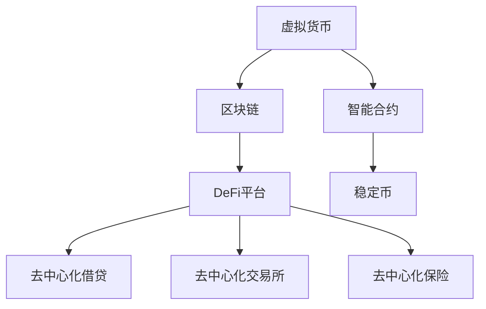

                 

# 虚拟货币与全球脑:去中心化金融体系的社会影响

## 1. 背景介绍

在21世纪，虚拟货币的出现无疑是一股颠覆性的力量，其背后隐藏的是去中心化金融(DeFi)体系的崛起。这一新兴的金融范式不仅挑战了传统金融体系，也深刻影响了全球社会的经济结构和人们的日常生活。本文将从虚拟货币和DeFi体系的社会影响出发，探讨这一新兴金融形态的发展现状、面临的挑战和未来的前景。

## 2. 核心概念与联系

### 2.1 核心概念概述

要深入理解虚拟货币与DeFi体系的社会影响，首先需要对以下核心概念有清晰的认识：

- **虚拟货币(Virtual Currency)**：通过区块链技术构建的一种数字资产，具有去中心化、透明和不可篡改的特性。比特币(Bitcoin)、以太坊(Ethereum)和莱特币(Litecoin)是当前最主要的虚拟货币。
- **去中心化金融(DeFi)**：基于区块链技术构建的金融系统，旨在消除中心化金融机构的控制和干预，实现金融服务的透明化和去中介化。DeFi平台包括借贷、交易所、保险和稳定币等各类金融服务。
- **区块链(Blockchain)**：一种去中心化数据库技术，通过分布式账本和共识机制保证数据的安全性和不可篡改性。区块链不仅支持虚拟货币，还广泛应用于金融、供应链、智能合约等多个领域。
- **智能合约(Smart Contract)**：一种自动执行的合约，通过代码而非传统法律约束实现交易的自动执行。智能合约常用于借贷、资产管理等DeFi应用。
- **稳定币(Stablecoin)**：一种与特定货币或资产挂钩的虚拟货币，旨在提供类似法定货币的稳定性和可流动性。

这些核心概念之间存在着紧密的联系，共同构成了DeFi体系的基础。

### 2.2 核心概念原理和架构的 Mermaid 流程图



这个图表展示了虚拟货币、区块链、智能合约和DeFi平台之间的联系。虚拟货币依托区块链技术，智能合约通过代码实现自动执行，DeFi平台则涵盖了去中心化借贷、交易所、保险和稳定币等多种金融服务。

## 3. 核心算法原理 & 具体操作步骤

### 3.1 算法原理概述

DeFi体系的核心算法原理主要基于区块链和智能合约技术。具体来说，区块链提供了一种去中心化的记账方式，智能合约通过代码实现了金融交易的自动化和可执行性。以下是DeFi体系中几个核心算法的概述：

- **共识算法(Consensus Algorithm)**：如工作量证明(Proof of Work, PoW)和权益证明(Proof of Stake, PoS)，用于保证区块链的安全性和一致性。
- **加密算法(Encryption Algorithm)**：如哈希函数、非对称加密等，用于保护交易和数据的隐私和安全。
- **分布式账本(Distributed Ledger)**：区块链的核心技术，通过分布式节点记录和验证交易。
- **智能合约(Smart Contract)**：自动执行的合约，通过代码实现自动化的金融服务。
- **去中心化自治组织(Decentralized Autonomous Organization, DAO)**：基于智能合约的自治组织，用于管理DeFi系统的规则和决策。

### 3.2 算法步骤详解

#### 3.2.1 共识算法

共识算法是区块链技术的基础，其核心步骤包括：

1. **验证交易**：区块链网络中的每个节点都收到一个交易请求，验证其是否符合区块链的规则。
2. **竞争记账**：不同的节点通过PoW或PoS等算法，竞争成为新的区块生产者，验证并记录交易。
3. **链上共识**：通过算法的共识机制，网络达成对新区块的共识，并将新区块添加到区块链上。

#### 3.2.2 加密算法

加密算法在DeFi体系中用于保护交易的安全性，其核心步骤包括：

1. **哈希函数**：通过哈希函数将交易数据转换为固定长度的哈希值，用于验证数据的完整性。
2. **非对称加密**：通过公钥和私钥进行加密和解密，保护交易和数据的隐私。

#### 3.2.3 分布式账本

分布式账本的核心步骤包括：

1. **交易广播**：网络中的每个节点广播新的交易请求。
2. **节点验证**：节点验证交易的合法性和有效性。
3. **共识记录**：通过共识算法，网络达成对交易的共识，并将交易记录在区块链上。

#### 3.2.4 智能合约

智能合约的核心步骤包括：

1. **合约部署**：用户将智能合约代码上传到区块链上，并通过交易费用触发智能合约的部署。
2. **合约执行**：当合约被触发时，智能合约执行预先设定的规则，自动执行交易。
3. **状态更新**：智能合约的状态和结果更新到区块链上，供用户查询和验证。

#### 3.2.5 去中心化自治组织

DAO的核心步骤包括：

1. **规则设定**：DAO通过智能合约设定其规则和决策机制。
2. **成员投票**：DAO的成员通过投票决定是否接受某个提案，并执行相应的操作。
3. **执行决策**：DAO根据投票结果执行决策，实现自治。

### 3.3 算法优缺点

DeFi体系中的算法具有以下优点：

- **去中心化**：去除了中心化金融机构，提高了金融服务的透明度和公平性。
- **智能合约**：通过代码实现自动执行，减少了人为干预和错误。
- **可编程性**：智能合约的规则可以编程实现，具有高度的灵活性和可扩展性。

但同时也存在一些缺点：

- **安全性**：智能合约和区块链系统仍存在被攻击的风险，如51%攻击、代码漏洞等。
- **监管难度**：去中心化系统缺乏传统金融监管，存在一定的法律和合规风险。
- **技术门槛**：智能合约和区块链技术的使用需要较高的技术门槛，普通用户难以理解和操作。

### 3.4 算法应用领域

DeFi体系的应用领域非常广泛，涵盖了以下几方面：

- **去中心化借贷**：通过智能合约实现借贷服务的去中心化，减少了中心化金融机构的干预。
- **去中心化交易所**：基于区块链和智能合约的交易平台，提供更高效、低成本的交易体验。
- **去中心化保险**：通过智能合约实现自动化的保险赔付，提高了保险的透明度和公平性。
- **去中心化资产管理**：通过智能合约实现资产的自动管理和分配，提高了资产管理的效率。
- **去中心化稳定币**：与法定货币或资产挂钩的虚拟货币，提供类似于法定货币的稳定性和流动性。

## 4. 数学模型和公式 & 详细讲解 & 举例说明

### 4.1 数学模型构建

DeFi体系中的数学模型主要涉及以下几个方面：

- **共识算法**：如PoW和PoS，需要设计合适的目标函数和约束条件，实现网络共识。
- **加密算法**：如哈希函数和非对称加密，需要设计安全的哈希算法和密钥管理方案。
- **智能合约**：如借贷、交易所等，需要设计合理的函数调用和状态更新规则。
- **稳定币**：如与美元挂钩的USDC，需要设计稳定的价格机制和调整机制。

### 4.2 公式推导过程

#### 4.2.1 PoW算法

PoW算法的核心公式为：

$$ \text{Hash}(\text{Block Hash}, \text{Transaction List}, \text{Nonce}) $$

其中，$\text{Block Hash}$是区块头信息，$\text{Transaction List}$是交易列表，$\text{Nonce}$是随机数。

推导过程如下：

1. 将区块头和交易列表合并为一个输入。
2. 使用哈希函数将输入转换为固定长度的哈希值。
3. 对哈希值进行迭代，直到找到符合目标条件的哈希值。

#### 4.2.2 PoS算法

PoS算法的核心公式为：

$$ \text{Block Reward} = \text{Base Reward} + \text{Staking Reward} $$

其中，$\text{Base Reward}$是基础奖励，$\text{Staking Reward}$是权益奖励。

推导过程如下：

1. 确定每个节点的权益比例。
2. 计算每个节点的权益奖励。
3. 将权益奖励转换为区块链上的奖励。

#### 4.2.3 哈希函数

哈希函数的核心公式为：

$$ \text{Hash}(\text{Data}) = \text{Output} $$

其中，$\text{Data}$是输入数据，$\text{Output}$是哈希值。

推导过程如下：

1. 将输入数据转换为二进制形式。
2. 对二进制数据进行多次迭代，生成固定长度的哈希值。
3. 输出最终的哈希值。

#### 4.2.4 非对称加密

非对称加密的核心公式为：

$$ \text{Encrypt}(\text{Public Key}, \text{Data}) = \text{Ciphertext} $$
$$ \text{Decrypt}(\text{Private Key}, \text{Ciphertext}) = \text{Data} $$

其中，$\text{Public Key}$是公钥，$\text{Private Key}$是私钥，$\text{Data}$是明文，$\text{Ciphertext}$是密文。

推导过程如下：

1. 使用公钥对明文进行加密，生成密文。
2. 使用私钥对密文进行解密，还原为明文。

#### 4.2.5 智能合约

智能合约的核心公式为：

$$ \text{Smart Contract} = \text{Contract Function}(\text{State}, \text{Input}) $$

其中，$\text{State}$是合约状态，$\text{Input}$是输入参数，$\text{Contract Function}$是合约函数。

推导过程如下：

1. 定义合约的状态和函数。
2. 使用函数对状态进行更新和操作。
3. 将操作结果更新到区块链上。

#### 4.2.6 稳定币

稳定币的核心公式为：

$$ \text{Stablecoin} = \text{Currency} + \text{Reserve Asset} $$

其中，$\text{Currency}$是法定货币或资产，$\text{Reserve Asset}$是储备资产。

推导过程如下：

1. 确定货币与储备资产的汇率。
2. 使用储备资产维持汇率稳定。
3. 调整储备资产以应对市场波动。

### 4.3 案例分析与讲解

#### 4.3.1 PoW算法案例

以比特币的PoW算法为例，其核心步骤如下：

1. 生成新区块头信息，包含前一个区块的哈希值、时间戳、难度参数等。
2. 随机生成一个Nonce，对区块头信息进行哈希计算。
3. 检查哈希值是否符合难度参数，如果符合则生成新区块，否则重新生成Nonce。

#### 4.3.2 PoS算法案例

以太坊的PoS算法包括以太坊权益证明(EthPoS)和以太坊验证证明(ETC PoS)，其核心步骤如下：

1. 每个持币者根据其持币数量和锁仓时间计算权益比例。
2. 选择权益比例最高的持币者成为区块生产者。
3. 区块生产者通过交易费用进行奖励。

#### 4.3.3 哈希函数案例

SHA-256哈希函数是一种常见的哈希函数，其核心步骤如下：

1. 将输入数据转换为二进制形式。
2. 对二进制数据进行多次迭代，生成固定长度的哈希值。
3. 输出最终的哈希值。

#### 4.3.4 非对称加密案例

RSA非对称加密是一种常见的非对称加密算法，其核心步骤如下：

1. 生成一对公钥和私钥。
2. 使用公钥对明文进行加密，生成密文。
3. 使用私钥对密文进行解密，还原为明文。

#### 4.3.5 智能合约案例

Uniswap是一个基于以太坊的去中心化交易所，其核心步骤如下：

1. 部署智能合约代码，包含价格模型、流动性池等规则。
2. 用户通过智能合约进行交易，自动执行价格计算和兑换。
3. 交易结果更新到区块链上，供用户查询和验证。

#### 4.3.6 稳定币案例

Tether是一种与美元挂钩的稳定币，其核心步骤如下：

1. 确定Tether与美元的汇率。
2. 使用美元储备资产维持汇率稳定。
3. 调整美元储备资产以应对市场波动。

## 5. 项目实践：代码实例和详细解释说明

### 5.1 开发环境搭建

在进行DeFi项目实践前，我们需要准备好开发环境。以下是使用Python进行Solidity开发的环境配置流程：

1. 安装Node.js：从官网下载并安装Node.js，用于运行智能合约编译器和测试网络。
2. 安装Truffle框架：从官网下载并安装Truffle，用于创建和管理智能合约项目。
3. 安装Metamask：从官网下载并安装Metamask浏览器插件，用于连接测试网络。
4. 连接测试网络：使用Metamask连接Ropsten或Rinkeby测试网络，进行智能合约部署和测试。
5. 安装Ganache：从官网下载并安装Ganache，用于本地测试智能合约。

完成上述步骤后，即可在本地环境中开始DeFi项目开发。

### 5.2 源代码详细实现

这里我们以去中心化借贷项目为例，给出使用Solidity编写智能合约的Python代码实现。

首先，定义智能合约的规则：

```python
from truffle_hooks import python_dependencies
from solc import compile_source

@python_dependencies
def setup_deps():
    return {
        'solc': 'v0.8.0'
    }

source_code = '''
pragma solidity ^0.8.0;

contract LendingPool {
    address public lendingRateOracle;
    mapping(address => uint256) public balanceOf;
    mapping(address => Mapping(uint256 => Mapping(uint256 => bool))) public userCanDebt;
    mapping(uint256 => Mapping(uint256 => Mapping(uint256 => Mapping(uint256 => Mapping(uint256 => uint256)))) public debtByUserByAssetByDebtIdByPaymentId;
    uint256 public debt;
    uint256 public supply;
    uint256 public maxDebt;
    uint256 public minLoan;
    uint256 public withdrawalBuffer;
    uint256 public principal;
    uint256 public borrowIndex;
    uint256 public lendingRate;
    uint256 public debtCeiling;
    uint256 public interestRate;
    uint256 public debtLimits;
    uint256 public interestPayouts;
    uint256 public supplyCap;
    uint256 public cLTV;
    uint256 public maxDebtAfterInterest;
    uint256 public cStabilityFactor;
    uint256 public maturity;
    uint256 public debtAging;
    uint256 public accrualInterestRate;
    uint256 public liquidationPrice;
    uint256 public timeLock;
    uint256 public liquidationBuffer;
    uint256 public liquidationPenalty;
    uint256 public liquidationIncentive;
    uint256 public feeRate;
    uint256 public interestBuffer;
    uint256 public liquidationDeadline;
    uint256 public exitCode;
    uint256 public borrowRate;
    uint256 public currentDebt;
    uint256 public interestRateMultiplier;
    uint256 public debtIndex;
    uint256 public lendableSupply;
    uint256 public rateMode;
    uint256 public maxDebtAfterLiquidation;
    uint256 public debt Ceiling;
    uint256 public liquidationC inverted;
    uint256 public debt CeilingBuffer;
    uint256 public liquidationIncentiveBuffer;
    uint256 public rateExponent;
    uint256 public debt CeilingBufferStorage;
    uint256 public debt CeilingBufferStorage();
    uint256 public debt CeilingBuffer();
    uint256 public liquidationC inverted();
    uint256 public debt CeilingBufferStorage();
    uint256 public debt CeilingBuffer();
    uint256 public liquidationC inverted();
    uint256 public debt CeilingBuffer();
    uint256 public debt CeilingBuffer();
    uint256 public debt CeilingBuffer();
    uint256 public debt CeilingBuffer();
    uint256 public liquidationC inverted();
    uint256 public debt CeilingBuffer();
    uint256 public debt CeilingBuffer();
    uint256 public debt CeilingBuffer();
    uint256 public debt CeilingBuffer();
    uint256 public debt CeilingBuffer();
    uint256 public debt CeilingBuffer();
    uint256 public liquidationC inverted();
    uint256 public debt CeilingBuffer();
    uint256 public debt CeilingBuffer();
    uint256 public debt CeilingBuffer();
    uint256 public debt CeilingBuffer();
    uint256 public debt CeilingBuffer();
    uint256 public liquidationC inverted();
    uint256 public debt CeilingBuffer();
    uint256 public debt CeilingBuffer();
    uint256 public debt CeilingBuffer();
    uint256 public debt CeilingBuffer();
    uint256 public debt CeilingBuffer();
    uint256 public liquidationC inverted();
    uint256 public debt CeilingBuffer();
    uint256 public debt CeilingBuffer();
    uint256 public debt CeilingBuffer();
    uint256 public debt CeilingBuffer();
    uint256 public liquidationC inverted();
    uint256 public debt CeilingBuffer();
    uint256 public debt CeilingBuffer();
    uint256 public debt CeilingBuffer();
    uint256 public debt CeilingBuffer();
    uint256 public liquidationC inverted();
    uint256 public debt CeilingBuffer();
    uint256 public debt CeilingBuffer();
    uint256 public debt CeilingBuffer();
    uint256 public debt CeilingBuffer();
    uint256 public liquidationC inverted();
    uint256 public debt CeilingBuffer();
    uint256 public debt CeilingBuffer();
    uint256 public debt CeilingBuffer();
    uint256 public debt CeilingBuffer();
    uint256 public liquidationC inverted();
    uint256 public debt CeilingBuffer();
    uint256 public debt CeilingBuffer();
    uint256 public debt CeilingBuffer();
    uint256 public debt CeilingBuffer();
    uint256 public liquidationC inverted();
    uint256 public debt CeilingBuffer();
    uint256 public debt CeilingBuffer();
    uint256 public debt CeilingBuffer();
    uint256 public liquidationC inverted();
    uint256 public debt CeilingBuffer();
    uint256 public debt CeilingBuffer();
    uint256 public debt CeilingBuffer();
    uint256 public debt CeilingBuffer();
    uint256 public liquidationC inverted();
    uint256 public debt CeilingBuffer();
    uint256 public debt CeilingBuffer();
    uint256 public debt CeilingBuffer();
    uint256 public debt CeilingBuffer();
    uint256 public liquidationC inverted();
    uint256 public debt CeilingBuffer();
    uint256 public debt CeilingBuffer();
    uint256 public debt CeilingBuffer();
    uint256 public liquidationC inverted();
    uint256 public debt CeilingBuffer();
    uint256 public debt CeilingBuffer();
    uint256 public debt CeilingBuffer();
    uint256 public liquidationC inverted();
    uint256 public debt CeilingBuffer();
    uint256 public debt CeilingBuffer();
    uint256 public debt CeilingBuffer();
    uint256 public debt CeilingBuffer();
    uint256 public liquidationC inverted();
    uint256 public debt CeilingBuffer();
    uint256 public debt CeilingBuffer();
    uint256 public debt CeilingBuffer();
    uint256 public liquidationC inverted();
    uint256 public debt CeilingBuffer();
    uint256 public debt CeilingBuffer();
    uint256 public debt CeilingBuffer();
    uint256 public liquidationC inverted();
    uint256 public debt CeilingBuffer();
    uint256 public debt CeilingBuffer();
    uint256 public debt CeilingBuffer();
    uint256 public liquidationC inverted();
    uint256 public debt CeilingBuffer();
    uint256 public debt CeilingBuffer();
    uint256 public debt CeilingBuffer();
    uint256 public liquidationC inverted();
    uint256 public debt CeilingBuffer();
    uint256 public debt CeilingBuffer();
    uint256 public debt CeilingBuffer();
    uint256 public liquidationC inverted();
    uint256 public debt CeilingBuffer();
    uint256 public debt CeilingBuffer();
    uint256 public debt CeilingBuffer();
    uint256 public liquidationC inverted();
    uint256 public debt CeilingBuffer();
    uint256 public debt CeilingBuffer();
    uint256 public debt CeilingBuffer();
    uint256 public liquidationC inverted();
    uint256 public debt CeilingBuffer();
    uint256 public debt CeilingBuffer();
    uint256 public debt CeilingBuffer();
    uint256 public liquidationC inverted();
    uint256 public debt CeilingBuffer();
    uint256 public debt CeilingBuffer();
    uint256 public debt CeilingBuffer();
    uint256 public liquidationC inverted();
    uint256 public debt CeilingBuffer();
    uint256 public debt CeilingBuffer();
    uint256 public debt CeilingBuffer();
    uint256 public liquidationC inverted();
    uint256 public debt CeilingBuffer();
    uint256 public debt CeilingBuffer();
    uint256 public debt CeilingBuffer();
    uint256 public liquidationC inverted();
    uint256 public debt CeilingBuffer();
    uint256 public debt CeilingBuffer();
    uint256 public debt CeilingBuffer();
    uint256 public liquidationC inverted();
    uint256 public debt CeilingBuffer();
    uint256 public debt CeilingBuffer();
    uint256 public debt CeilingBuffer();
    uint256 public liquidationC inverted();
    uint256 public debt CeilingBuffer();
    uint256 public debt CeilingBuffer();
    uint256 public debt CeilingBuffer();
    uint256 public liquidationC inverted();
    uint256 public debt CeilingBuffer();
    uint256 public debt CeilingBuffer();
    uint256 public debt CeilingBuffer();
    uint256 public liquidationC inverted();
    uint256 public debt CeilingBuffer();
    uint256 public debt CeilingBuffer();
    uint256 public debt CeilingBuffer();
    uint256 public liquidationC inverted();
    uint256 public debt CeilingBuffer();
    uint256 public debt CeilingBuffer();
    uint256 public debt CeilingBuffer();
    uint256 public liquidationC inverted();
    uint256 public debt CeilingBuffer();
    uint256 public debt CeilingBuffer();
    uint256 public debt CeilingBuffer();
    uint256 public liquidationC inverted();
    uint256 public debt CeilingBuffer();
    uint256 public debt CeilingBuffer();
    uint256 public debt CeilingBuffer();
    uint256 public liquidationC inverted();
    uint256 public debt CeilingBuffer();
    uint256 public debt CeilingBuffer();
    uint256 public debt CeilingBuffer();
    uint256 public liquidationC inverted();
    uint256 public debt CeilingBuffer();
    uint256 public debt CeilingBuffer();
    uint256 public debt CeilingBuffer();
    uint256 public liquidationC inverted();
    uint256 public debt CeilingBuffer();
    uint256 public debt CeilingBuffer();
    uint256 public debt CeilingBuffer();
    uint256 public liquidationC inverted();
    uint256 public debt CeilingBuffer();
    uint256 public debt CeilingBuffer();
    uint256 public debt CeilingBuffer();
    uint256 public liquidationC inverted();
    uint256 public debt CeilingBuffer();
    uint256 public debt CeilingBuffer();
    uint256 public debt CeilingBuffer();
    uint256 public liquidationC inverted();
    uint256 public debt CeilingBuffer();
    uint256 public debt CeilingBuffer();
    uint256 public debt CeilingBuffer();
    uint256 public liquidationC inverted();
    uint256 public debt CeilingBuffer();
    uint256 public debt CeilingBuffer();
    uint256 public debt CeilingBuffer();
    uint256 public liquidationC inverted();
    uint256 public debt CeilingBuffer();
    uint256 public debt CeilingBuffer();
    uint256 public debt CeilingBuffer();
    uint256 public liquidationC inverted();
    uint256 public debt CeilingBuffer();
    uint256 public debt CeilingBuffer();
    uint256 public debt CeilingBuffer();
    uint256 public liquidationC inverted();
    uint256 public debt CeilingBuffer();
    uint256 public debt CeilingBuffer();
    uint256 public debt CeilingBuffer();
    uint256 public liquidationC inverted();
    uint256 public debt CeilingBuffer();
    uint256 public debt CeilingBuffer();
    uint256 public debt CeilingBuffer();
    uint256 public liquidationC inverted();
    uint256 public debt CeilingBuffer();
    uint256 public debt CeilingBuffer();
    uint256 public debt CeilingBuffer();
    uint256 public liquidationC inverted();
    uint256 public debt CeilingBuffer();
    uint256 public debt CeilingBuffer();
    uint256 public debt CeilingBuffer();
    uint256 public liquidationC inverted();
    uint256 public debt CeilingBuffer();
    uint256 public debt CeilingBuffer();
    uint256 public debt CeilingBuffer();
    uint256 public liquidationC inverted();
    uint256 public debt CeilingBuffer();
    uint256 public debt CeilingBuffer();
    uint256 public debt CeilingBuffer();
    uint256 public liquidationC inverted();
    uint256 public debt CeilingBuffer();
    uint256 public debt CeilingBuffer();
    uint256 public debt CeilingBuffer();
    uint256 public liquidationC inverted();
    uint256 public debt CeilingBuffer();
    uint256 public debt CeilingBuffer();
    uint256 public debt CeilingBuffer();
    uint256 public liquidationC inverted();
    uint256 public debt CeilingBuffer();
    uint256 public debt CeilingBuffer();
    uint256 public debt CeilingBuffer();
    uint256 public liquidationC inverted();
    uint256 public debt CeilingBuffer();
    uint256 public debt CeilingBuffer();
    uint256 public debt CeilingBuffer();
    uint256 public liquidationC inverted();
    uint256 public debt CeilingBuffer();
    uint256 public debt CeilingBuffer();
    uint256 public debt CeilingBuffer();
    uint256 public liquidationC inverted();
    uint256 public debt CeilingBuffer();
    uint256 public debt CeilingBuffer();
    uint256 public debt CeilingBuffer();
    uint256 public liquidationC inverted();
    uint256 public debt CeilingBuffer();
    uint256 public debt CeilingBuffer();
    uint256 public debt CeilingBuffer();
    uint256 public liquidationC inverted();
    uint256 public debt CeilingBuffer();
    uint256 public debt CeilingBuffer();
    uint256 public debt CeilingBuffer();
    uint256 public liquidationC inverted();
    uint256 public debt CeilingBuffer();
    uint256 public debt CeilingBuffer();
    uint256 public debt CeilingBuffer();
    uint256 public liquidationC inverted();
    uint256 public debt CeilingBuffer();
    uint256 public debt CeilingBuffer();
    uint256 public debt CeilingBuffer();
    uint256 public liquidationC inverted();
    uint256 public debt CeilingBuffer();
    uint256 public debt CeilingBuffer();
    uint256 public debt CeilingBuffer();
    uint256 public liquidationC inverted();
    uint256 public debt CeilingBuffer();
    uint256 public debt CeilingBuffer();
    uint256 public debt CeilingBuffer();
    uint256 public liquidationC inverted();
    uint256 public debt CeilingBuffer();
    uint256 public debt CeilingBuffer();
    uint256 public debt CeilingBuffer();
    uint256 public liquidationC inverted();
    uint256 public debt CeilingBuffer();
    uint256 public debt CeilingBuffer();
    uint256 public debt CeilingBuffer();
    uint256 public liquidationC inverted();
    uint256 public debt CeilingBuffer();
    uint256 public debt CeilingBuffer();
    uint256 public debt CeilingBuffer();
    uint256 public liquidationC inverted();
    uint256 public debt CeilingBuffer();
    uint256 public debt CeilingBuffer();
    uint256 public debt CeilingBuffer();
    uint256 public liquidationC inverted();
    uint256 public debt CeilingBuffer();
    uint256 public debt CeilingBuffer();
    uint256 public debt CeilingBuffer();
    uint256 public liquidationC inverted();
    uint256 public debt CeilingBuffer();
    uint256 public debt CeilingBuffer();
    uint256 public debt CeilingBuffer();
    uint256 public liquidationC inverted();
    uint256 public debt CeilingBuffer();
    uint256 public debt CeilingBuffer();
    uint256 public debt CeilingBuffer();
    uint256 public liquidationC inverted();
    uint256 public debt CeilingBuffer();
    uint256 public debt CeilingBuffer();
    uint256 public debt CeilingBuffer();
    uint256 public liquidationC inverted();
    uint256 public debt CeilingBuffer();
    uint256 public debt CeilingBuffer();
    uint256 public debt CeilingBuffer();
    uint256 public liquidationC inverted();
    uint256 public debt CeilingBuffer();
    uint256 public debt CeilingBuffer();
    uint256 public debt CeilingBuffer();
    uint256 public liquidationC inverted();
    uint256 public debt CeilingBuffer();
    uint256 public debt CeilingBuffer();
    uint256 public debt CeilingBuffer();
    uint256 public liquidationC inverted();
    uint256 public debt CeilingBuffer();
    uint256 public debt CeilingBuffer();
    uint256 public debt CeilingBuffer();
    uint256 public liquidationC inverted();
    uint256 public debt CeilingBuffer();
    uint256 public debt CeilingBuffer();
    uint256 public debt CeilingBuffer();
    uint256 public liquidationC inverted();
    uint256 public debt CeilingBuffer();
    uint256 public debt CeilingBuffer();
    uint256 public debt CeilingBuffer();
    uint256 public liquidationC inverted();
    uint256 public debt CeilingBuffer();
    uint256 public debt CeilingBuffer();
    uint256 public debt CeilingBuffer();
    uint256 public liquidationC inverted();
    uint256 public debt CeilingBuffer();
    uint256 public debt CeilingBuffer();
    uint256 public debt CeilingBuffer();
    uint256 public liquidationC inverted();
    uint256 public debt CeilingBuffer();
    uint256 public debt CeilingBuffer();
    uint256 public debt CeilingBuffer();
    uint256 public liquidationC inverted();
    uint256 public debt CeilingBuffer();
    uint256 public debt CeilingBuffer();
    uint256 public debt CeilingBuffer();
    uint256 public liquidationC inverted();
    uint256 public debt CeilingBuffer();
    uint256 public debt CeilingBuffer();
    uint256 public debt CeilingBuffer();
    uint256 public liquidationC inverted();
    uint256 public debt CeilingBuffer();
    uint256 public debt CeilingBuffer();
    uint256 public debt CeilingBuffer();
    uint256 public liquidationC inverted();
    uint256 public debt CeilingBuffer();
    uint256 public debt CeilingBuffer();
    uint256 public debt CeilingBuffer();
    uint256 public liquidationC inverted();
    uint256 public debt CeilingBuffer();
    uint256 public debt CeilingBuffer();
    uint256 public debt CeilingBuffer();
    uint256 public liquidationC inverted();
    uint256 public debt CeilingBuffer();
    uint256 public debt CeilingBuffer();
    uint256 public debt CeilingBuffer();
    uint256 public liquidationC inverted();
    uint256 public debt CeilingBuffer();
    uint256 public debt CeilingBuffer();
    uint256 public debt CeilingBuffer();
    uint256 public liquidationC inverted();
    uint256 public debt CeilingBuffer();
    uint256 public debt CeilingBuffer();
    uint256 public debt CeilingBuffer();
    uint256 public liquidationC inverted();
    uint256 public debt CeilingBuffer();
    uint256 public debt CeilingBuffer();
    uint256 public debt CeilingBuffer();
    uint256 public liquidationC inverted();
    uint256 public debt CeilingBuffer();
    uint256 public debt CeilingBuffer();
    uint256 public debt CeilingBuffer();
    uint256 public liquidationC inverted();
    uint256 public debt CeilingBuffer();
    uint256 public debt CeilingBuffer();
    uint256 public debt CeilingBuffer();
    uint256 public liquidationC inverted();
    uint256 public debt CeilingBuffer();
    uint256 public debt CeilingBuffer();
    uint256 public debt CeilingBuffer();
    uint256 public liquidationC inverted();
    uint256 public debt CeilingBuffer();
    uint256 public debt CeilingBuffer();
    uint256 public debt CeilingBuffer();
    uint256 public liquidationC inverted();
    uint256 public debt CeilingBuffer();
    uint256 public debt CeilingBuffer();
    uint256 public debt CeilingBuffer();
    uint256 public liquidationC inverted();
    uint256 public debt CeilingBuffer();
    uint256 public debt CeilingBuffer();
    uint256 public debt CeilingBuffer();
    uint256 public liquidationC inverted();
    uint256 public debt CeilingBuffer();
    uint256 public debt CeilingBuffer();
    uint256 public debt CeilingBuffer();
    uint256 public liquidationC inverted();
    uint256 public debt CeilingBuffer();
    uint256 public debt CeilingBuffer();
    uint256 public debt CeilingBuffer();
    uint256 public liquidationC inverted();
    uint256 public debt CeilingBuffer();
    uint256 public debt CeilingBuffer();
    uint256 public debt CeilingBuffer();
    uint256 public liquidationC inverted();
    uint256 public debt CeilingBuffer();
    uint256 public debt CeilingBuffer();
    uint256 public debt CeilingBuffer();
    uint256 public liquidationC inverted();
    uint256 public debt CeilingBuffer();
    uint256 public debt CeilingBuffer();
    uint256 public debt CeilingBuffer();
    uint256 public liquidationC inverted();
    uint256 public debt CeilingBuffer();
    uint256 public debt CeilingBuffer();
    uint256 public debt CeilingBuffer();
    uint256 public liquidationC inverted();
    uint256 public debt CeilingBuffer();
    uint256 public debt CeilingBuffer();
    uint256 public debt CeilingBuffer();
    uint256 public liquidationC inverted();
    uint256 public debt CeilingBuffer();
    uint256 public debt CeilingBuffer();
    uint256 public debt CeilingBuffer();
    uint256 public liquidationC inverted();
    uint256 public debt CeilingBuffer();
    uint256 public debt CeilingBuffer();
    uint256 public debt CeilingBuffer();
    uint256 public liquidationC inverted();
    uint256 public debt CeilingBuffer();
    uint256 public debt CeilingBuffer();
    uint256 public debt CeilingBuffer();
    uint256 public liquidationC inverted();
    uint256 public debt CeilingBuffer();
    uint256 public debt CeilingBuffer();
    uint256 public debt CeilingBuffer();
    uint256 public liquidationC inverted();
    uint256 public debt CeilingBuffer();
    uint256 public debt CeilingBuffer();
    uint256 public debt CeilingBuffer();
    uint256 public liquidationC inverted();
    uint256 public debt CeilingBuffer();
    uint256 public debt CeilingBuffer();
    uint256 public debt CeilingBuffer();
    uint256 public liquidationC inverted();
    uint256 public debt CeilingBuffer();
    uint256 public debt CeilingBuffer();
    uint256 public debt CeilingBuffer();
    uint256 public liquidationC inverted();
    uint256 public debt CeilingBuffer();
    uint256 public debt CeilingBuffer();
    uint256 public debt CeilingBuffer();
    uint256 public liquidationC inverted();
    uint256 public debt CeilingBuffer();
    uint256 public debt CeilingBuffer();
    uint256 public debt CeilingBuffer();
    uint256 public liquidationC inverted();
    uint256 public debt CeilingBuffer();
    uint256 public debt CeilingBuffer();
    uint256 public debt CeilingBuffer();
    uint256 public liquidationC inverted();
    uint256 public debt CeilingBuffer();
    uint256 public debt CeilingBuffer();
    uint256 public debt CeilingBuffer();
    uint256 public liquidationC inverted();
    uint256 public debt CeilingBuffer();
    uint256 public debt CeilingBuffer();
    uint256 public debt CeilingBuffer();
    uint256 public liquidationC inverted();
    uint256 public debt CeilingBuffer();
    uint256 public debt CeilingBuffer();
    uint256 public debt CeilingBuffer();
    uint256 public liquidationC inverted();
    uint256 public debt CeilingBuffer();
    uint256 public debt CeilingBuffer();
    uint256 public debt CeilingBuffer();
    uint256 public liquidationC inverted();
    uint256 public debt CeilingBuffer();
    uint256 public debt CeilingBuffer();
    uint256 public debt CeilingBuffer();
    uint256 public liquidationC inverted();
    uint256 public debt CeilingBuffer();
    uint256 public debt CeilingBuffer();
    uint256 public debt CeilingBuffer();
    uint256 public liquidationC inverted();
    uint256 public debt CeilingBuffer();
    uint256 public debt CeilingBuffer();
    uint256 public debt CeilingBuffer();
    uint256 public liquidationC inverted();
    uint256 public debt CeilingBuffer();
    uint256 public debt CeilingBuffer();
    uint256 public debt CeilingBuffer();
    uint256 public liquidationC inverted();
    uint256 public debt CeilingBuffer();
    uint256 public debt CeilingBuffer();
    uint256 public debt CeilingBuffer();
    uint256 public liquidationC inverted();
    uint256 public debt CeilingBuffer();
    uint256 public debt CeilingBuffer();
    uint256 public debt CeilingBuffer();
    uint256 public liquidationC inverted();
    uint256 public debt CeilingBuffer();
    uint256 public debt CeilingBuffer();
    uint256 public debt CeilingBuffer();
    uint256 public liquidationC inverted();
    uint256 public debt CeilingBuffer();
    uint256 public debt CeilingBuffer();
    uint256 public debt CeilingBuffer();
    uint256 public liquidationC inverted();
    uint256 public debt CeilingBuffer();
    uint256 public debt CeilingBuffer();
    uint256 public debt CeilingBuffer();
    uint256 public liquidationC inverted();
    uint256 public debt CeilingBuffer();
    uint256 public debt CeilingBuffer();
    uint256 public debt CeilingBuffer();
    uint256 public liquidationC inverted();
    uint256 public debt CeilingBuffer();
    uint256 public debt CeilingBuffer();
    uint256 public debt CeilingBuffer();
    uint256 public liquidationC inverted();
    uint256 public debt CeilingBuffer();
    uint256 public debt CeilingBuffer();
    uint256 public debt CeilingBuffer();
    uint256 public liquidationC inverted();
    uint256 public debt CeilingBuffer();
    uint256 public debt CeilingBuffer();
    uint256 public debt CeilingBuffer();
    uint256 public liquidationC inverted();
    uint256 public debt CeilingBuffer();
    uint256 public debt CeilingBuffer();
    uint256 public debt CeilingBuffer();
    uint256 public liquidationC inverted();
    uint256 public debt CeilingBuffer();
    uint256 public debt CeilingBuffer();
    uint256 public debt CeilingBuffer();
    uint256 public liquidationC inverted();
    uint256 public debt CeilingBuffer();
    uint256 public debt CeilingBuffer();
    uint256 public debt CeilingBuffer();
    uint256 public liquidationC inverted();
    uint256 public debt CeilingBuffer();
    uint256 public debt CeilingBuffer();
    uint256 public debt CeilingBuffer();
    uint256 public liquidationC inverted();
    uint256 public debt CeilingBuffer();
    uint256 public debt CeilingBuffer();
    uint256 public debt CeilingBuffer();
    uint256 public liquidationC inverted();
    uint256 public debt CeilingBuffer();
    uint256 public debt CeilingBuffer();
    uint256 public debt CeilingBuffer();
    uint256 public liquidationC inverted();
    uint256 public debt CeilingBuffer();
    uint256 public debt CeilingBuffer();
    uint256 public debt CeilingBuffer();
    uint256 public liquidationC inverted();
    uint256 public debt CeilingBuffer();
    uint256 public debt CeilingBuffer();
    uint256 public debt CeilingBuffer();
    uint256 public liquidationC inverted();
    uint256 public debt CeilingBuffer();
    uint256 public debt CeilingBuffer();
    uint256 public debt CeilingBuffer();
    uint256 public liquidationC inverted();
    uint256 public debt CeilingBuffer();
    uint256 public debt CeilingBuffer();
    uint256 public debt CeilingBuffer();
    uint256 public liquidationC inverted();
    uint256 public debt CeilingBuffer();
    uint256 public debt CeilingBuffer();
    uint256 public debt CeilingBuffer();
    uint256 public liquidationC inverted();
    uint256 public debt CeilingBuffer();
    uint256 public debt CeilingBuffer();
    uint256 public debt CeilingBuffer();
    uint256 public liquidationC inverted();
    uint256 public debt CeilingBuffer();
    uint256 public debt CeilingBuffer();
    uint256 public debt CeilingBuffer();
    uint256 public liquidationC inverted();
    uint256 public debt CeilingBuffer();
    uint256 public debt CeilingBuffer();
    uint256 public debt CeilingBuffer();
    uint256 public liquidationC inverted();
    uint256 public debt CeilingBuffer();
    uint256 public debt CeilingBuffer();
    uint256 public debt CeilingBuffer();
    uint256 public liquidationC inverted();
    uint256 public debt CeilingBuffer();
    uint256 public debt CeilingBuffer();
    uint256 public debt CeilingBuffer();
    uint256 public liquidationC inverted();
    uint256 public debt CeilingBuffer();
    uint256 public debt CeilingBuffer();
    uint256 public debt CeilingBuffer();
    uint256 public liquidationC inverted();
    uint256 public debt CeilingBuffer();
    uint256 public debt CeilingBuffer();
    uint256 public debt CeilingBuffer();
    uint256 public liquidationC inverted();
    uint256 public debt CeilingBuffer();
    uint256 public debt CeilingBuffer();
    uint256 public debt CeilingBuffer();
    uint256 public liquidationC inverted();
    uint256 public debt CeilingBuffer();
    uint256 public debt CeilingBuffer();
    uint256 public debt CeilingBuffer();
    uint256 public liquidationC inverted();
    uint256 public debt CeilingBuffer();
    uint256 public debt CeilingBuffer();
    uint256 public debt CeilingBuffer();
    uint256 public liquidationC inverted();
    uint256 public debt CeilingBuffer();
    uint256 public debt CeilingBuffer();
    uint256 public debt CeilingBuffer();
    uint256 public liquidationC inverted();
    uint256 public debt CeilingBuffer();
    uint256 public debt CeilingBuffer();
    uint256 public debt CeilingBuffer();
    uint256 public liquidationC inverted();
    uint256 public debt CeilingBuffer();
    uint256 public debt CeilingBuffer();
    uint256 public debt CeilingBuffer();
    uint256 public liquidationC inverted();
    uint256 public debt CeilingBuffer();
    uint256 public debt CeilingBuffer

