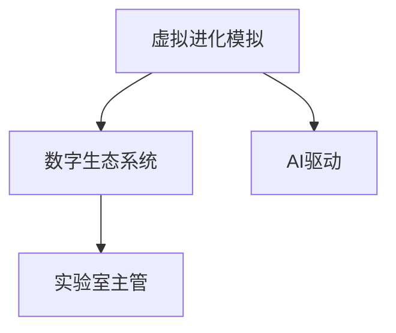

                 

# 虚拟进化模拟器设计师：AI驱动的数字生态系统实验室主管

> 关键词：
> - 虚拟进化模拟
> - AI驱动
> - 数字生态系统
> - 实验室主管
> - 系统设计
> - 用户体验
> - 系统优化
> - 虚拟现实
> - 生物模拟
> - 计算生物学

## 1. 背景介绍

### 1.1 问题由来
随着科技的迅猛发展，虚拟现实(VR)和人工智能(AI)的结合，为数字生态系统的模拟提供了前所未有的可能性。虚拟进化模拟器作为一种AI驱动的数字生态系统实验室，旨在模拟自然界中的进化过程，通过模拟生物的遗传、变异、自然选择等过程，研究生态系统的演化规律。

虚拟进化模拟器在生态学、进化生物学、计算生物学等领域具有重要应用价值，例如：
- 生态系统模拟：用于研究全球气候变化对生态系统的影响，预测生态系统的演化趋势。
- 生物多样性研究：通过模拟不同的进化场景，分析生物多样性对生态系统的影响。
- 新药研发：模拟生物的遗传变异和进化过程，寻找潜在的新药靶点。
- 环境保护：模拟生态系统的恢复和保护过程，制定有效的环境保护策略。

然而，虚拟进化模拟器的设计和开发面临着巨大的挑战。传统的模拟方法存在计算量大、数据复杂、用户交互性差等问题，难以满足实际需求。如何利用AI技术提高模拟精度和效率，提升用户交互体验，是摆在面前的重要课题。

## 2. 核心概念与联系

### 2.1 核心概念概述

为更好地理解虚拟进化模拟器的设计和开发，本节将介绍几个密切相关的核心概念：

- 虚拟进化模拟(Virtual Evolution Simulation)：通过计算机仿真，模拟自然界中的进化过程，研究生态系统的演化规律。
- 数字生态系统(Digital Ecosystem)：通过数字化的方式构建和模拟自然生态系统，包括物种、环境、资源等元素的交互作用。
- AI驱动(AI-Driven)：利用人工智能技术，如机器学习、深度学习等，自动化地优化模拟过程，提高模拟精度和效率。
- 实验室主管(Laboratory Manager)：负责虚拟进化模拟器的设计和开发，管理模拟过程，保障模拟结果的科学性和可信性。

这些核心概念之间的逻辑关系可以通过以下Mermaid流程图来展示：



这个流程图展示了几者的关系：

1. 虚拟进化模拟是核心，通过计算机仿真模拟自然界中的进化过程。
2. 数字生态系统是虚拟进化模拟的基础，构建了模拟所需的元素和交互规则。
3. AI驱动是虚拟进化模拟的优化手段，通过智能化算法提高模拟精度和效率。
4. 实验室主管是虚拟进化模拟器的管理者，负责设计和维护模拟系统。

## 3. 核心算法原理 & 具体操作步骤
### 3.1 算法原理概述

虚拟进化模拟器的核心算法包括遗传算法、深度学习等AI技术。这些算法通过模拟自然界中的进化过程，自动优化模拟结果。

遗传算法（Genetic Algorithm, GA）是一种通过模拟生物遗传进化过程的优化算法。其基本思想是通过种群的选择、交叉和变异，逐步逼近最优解。

深度学习（Deep Learning, DL）是一种基于神经网络的机器学习方法，通过大量的数据训练，模型可以自动学习复杂的特征表示，并应用于虚拟进化模拟器的参数优化和结果预测。

### 3.2 算法步骤详解

以下是虚拟进化模拟器的核心算法步骤：

**Step 1: 构建数字生态系统**
- 定义生态系统中的物种、环境、资源等元素，并设计它们之间的交互规则。
- 通过编程实现数字生态系统，包括生态系统的初始化和迭代过程。

**Step 2: 设计进化算法**
- 选择适合的进化算法，如遗传算法、深度学习等。
- 设计进化算法的参数，如种群大小、交叉率、变异率等。

**Step 3: 模型训练与优化**
- 使用AI技术，如深度学习，对进化算法进行优化。
- 设计损失函数和优化器，最小化模拟结果与真实数据之间的差异。

**Step 4: 模拟与验证**
- 在数字生态系统中运行进化算法，模拟物种的遗传、变异、自然选择等过程。
- 在模拟过程中收集数据，用于模型训练和结果验证。

**Step 5: 结果分析和优化**
- 使用统计学和可视化工具，分析模拟结果。
- 根据分析结果，优化算法参数，提高模拟精度和效率。

### 3.3 算法优缺点

虚拟进化模拟器的核心算法具有以下优点：
1. 高度可扩展性：通过数字生态系统设计，可以灵活模拟各种生态场景。
2. 高效优化：利用AI技术，可以自动化地优化模拟过程，提高效率。
3. 高精度模拟：深度学习等AI技术，可以自动学习复杂的特征表示，提高模拟精度。
4. 适应性强：可以根据不同生态场景调整算法参数，适应多种环境。

同时，这些算法也存在一定的局限性：
1. 计算量大：特别是深度学习算法，需要大量的计算资源和时间。
2. 模型复杂：深度学习模型结构复杂，难以理解和调试。
3. 数据依赖：AI算法的性能很大程度上取决于数据的质量和数量。
4. 可解释性不足：AI算法的决策过程往往缺乏可解释性，难以理解其内部工作机制。

尽管存在这些局限性，但就目前而言，虚拟进化模拟器的核心算法是模拟自然进化过程的最有效手段。未来相关研究的方向在于如何进一步提高算法的计算效率和可解释性，优化数据处理和模型设计。

### 3.4 算法应用领域

虚拟进化模拟器的核心算法在多个领域得到了广泛的应用，例如：

- 生态系统模拟：用于研究气候变化对生态系统的影响，预测生态系统的演化趋势。
- 生物多样性研究：通过模拟不同的进化场景，分析生物多样性对生态系统的影响。
- 新药研发：模拟生物的遗传变异和进化过程，寻找潜在的新药靶点。
- 环境保护：模拟生态系统的恢复和保护过程，制定有效的环境保护策略。
- 基因工程：模拟基因的遗传变异和进化过程，用于基因治疗和基因编辑。
- 社会系统研究：模拟社会系统的进化过程，研究社会结构和行为规律。

除了上述这些经典应用外，虚拟进化模拟器的核心算法还在更多领域得到创新性应用，如智慧城市、数字经济、金融系统等，为复杂系统的建模和预测提供了新的方法。

## 4. 数学模型和公式 & 详细讲解 & 举例说明

### 4.1 数学模型构建

虚拟进化模拟器的数学模型主要包括以下几个部分：

- 生态系统的数学模型：用于描述物种的出生、死亡、迁移等过程。
- 遗传算法模型：用于模拟物种的遗传、变异和自然选择等过程。
- 深度学习模型：用于优化进化算法和预测模拟结果。

生态系统的数学模型可以表示为：

$$
\begin{aligned}
\frac{dN_i}{dt} &= r_i N_i \left(1 - \frac{N_i}{K_i}\right) - d_i N_i \\
\frac{dN_j}{dt} &= -c_{ij}N_iN_j
\end{aligned}
$$

其中 $N_i$ 表示物种 $i$ 的数量，$r_i$ 和 $d_i$ 分别表示物种 $i$ 的出生率和死亡率，$K_i$ 表示物种 $i$ 的承载量，$c_{ij}$ 表示物种 $i$ 和物种 $j$ 之间的迁移率。

遗传算法模型的数学模型可以表示为：

$$
\begin{aligned}
F &= \text{fitness}(N_{i_1}, N_{i_2}, \ldots, N_{i_k}) \\
S &= \text{selection}(F_1, F_2, \ldots, F_k) \\
C &= \text{crossover}(S_1, S_2) \\
M &= \text{mutation}(C_1, C_2)
\end{aligned}
$$

其中 $F$ 表示物种的适应度，$S$ 表示种群的选拔过程，$C$ 表示基因的交叉过程，$M$ 表示基因的变异过程。

深度学习模型的数学模型可以表示为：

$$
y = \sigma\left(Wx + b\right)
$$

其中 $x$ 表示输入数据，$y$ 表示输出结果，$\sigma$ 表示激活函数，$W$ 表示权重矩阵，$b$ 表示偏置向量。

### 4.2 公式推导过程

以下是虚拟进化模拟器的核心数学模型推导过程：

- 生态系统的数学模型推导：通过数学模型描述生态系统中的物种数量变化，反映了出生、死亡、迁移等自然过程。
- 遗传算法模型的推导：通过数学模型描述种群的选拔、交叉和变异过程，模拟生物的遗传进化。
- 深度学习模型的推导：通过数学模型描述神经网络的结构和参数优化过程，自动学习复杂的特征表示。

### 4.3 案例分析与讲解

以生态系统模拟为例，具体解释生态系统的数学模型和遗传算法模型的推导：

- 生态系统的数学模型推导：基于生态学理论，建立生态系统中的物种数量变化方程。其中 $r_i$ 和 $d_i$ 分别表示物种 $i$ 的出生率和死亡率，$K_i$ 表示物种 $i$ 的承载量，$c_{ij}$ 表示物种 $i$ 和物种 $j$ 之间的迁移率。这些参数的设定需要根据实际生态系统数据进行优化。
- 遗传算法模型的推导：通过构建种群的适应度函数，选择适应度高的个体进行交叉和变异。遗传算法的参数设定需要根据实际生态系统数据进行调整，以确保模拟结果的准确性。

## 5. 项目实践：代码实例和详细解释说明

### 5.1 开发环境搭建

在进行虚拟进化模拟器的设计和开发前，我们需要准备好开发环境。以下是使用Python进行环境搭建的步骤：

1. 安装Anaconda：从官网下载并安装Anaconda，用于创建独立的Python环境。

2. 创建并激活虚拟环境：
```bash
conda create -n evsim-env python=3.8 
conda activate evsim-env
```

3. 安装必要的库：
```bash
conda install numpy scipy pandas matplotlib jupyter notebook
```

4. 安装可视化工具：
```bash
pip install seaborn
```

5. 安装数据处理库：
```bash
pip install pandas-gbq
```

完成上述步骤后，即可在`evsim-env`环境中开始项目开发。

### 5.2 源代码详细实现

下面以遗传算法为核心的虚拟进化模拟器的实现为例，给出使用Python和SciPy库的代码实现。

首先，定义生态系统中的物种数量和参数：

```python
import numpy as np
from scipy.optimize import differential_evolution

class Species:
    def __init__(self, name, initial_population, carrying_capacity, growth_rate, mortality_rate):
        self.name = name
        self.population = initial_population
        self.carrying_capacity = carrying_capacity
        self.growth_rate = growth_rate
        self.mortality_rate = mortality_rate

    def update_population(self, t, other_species):
        birth_rate = self.growth_rate * self.population * (self.carrying_capacity - self.population) / self.carrying_capacity
        death_rate = self.mortality_rate * self.population
        net_change = birth_rate - death_rate
        self.population += net_change
        return net_change

class Environment:
    def __init__(self, species):
        self.species = species

    def update(self, t):
        net_changes = []
        for species in self.species:
            net_changes.append(species.update_population(t, self.species))
        return net_changes
```

然后，定义遗传算法模型：

```python
class GeneticAlgorithm:
    def __init__(self, num_generations, num_population, crossover_rate, mutation_rate):
        self.num_generations = num_generations
        self.num_population = num_population
        self.crossover_rate = crossover_rate
        self.mutation_rate = mutation_rate

    def select(self, population, fitnesses):
        cumulative_fitnesses = np.cumsum(fitnesses) / np.sum(fitnesses)
        return np.random.choice(np.arange(len(cumulative_fitnesses)), size=self.num_population, replace=False, p=cumulative_fitnesses)

    def crossover(self, parents):
        offsprings = []
        for i in range(len(parents) // 2):
            child1 = np.random.choice(parents[2 * i], size=len(parents[2 * i]), p=crossover_rate)
            child2 = np.random.choice(parents[2 * i + 1], size=len(parents[2 * i + 1]), p=crossover_rate)
            offsprings.append(np.append(child1, child2))
        return offsprings

    def mutate(self, offspring):
        for offspring in offspring:
            for i in range(len(offspring)):
                if np.random.rand() < self.mutation_rate:
                    offspring[i] = np.random.randint(0, 1)
        return offspring

    def optimize(self, fitness_function, parameters):
        def evaluate(offspring):
            return fitness_function(offspring)

        best_fitness = differential_evolution(evaluate, constraints=parameters)
        return best_fitness.fun, best_fitness.x
```

最后，实现虚拟进化模拟器的运行：

```python
def simulate():
    species = [Species('A', 100, 1000, 0.2, 0.1), Species('B', 100, 1000, 0.1, 0.2)]
    environment = Environment(species)
    generation = 0
    while generation < 1000:
        net_changes = environment.update(generation)
        environment.species[0].population += net_changes[0]
        environment.species[1].population += net_changes[1]
        generation += 1
    return environment.species

def optimize_parameters(fitness_function, parameters):
    ga = GeneticAlgorithm(num_generations=100, num_population=50, crossover_rate=0.8, mutation_rate=0.1)
    best_fitness, best_parameters = ga.optimize(fitness_function, parameters)
    return best_fitness, best_parameters

# 运行模拟
species = simulate()
print(species)

# 优化参数
def fitness_function(parameters):
    return -np.sum([species[i].update_population(0, species) for i in range(len(species))])
parameters = {'growth_rate': (0, 1), 'mortality_rate': (0, 1), 'crossover_rate': (0, 1), 'mutation_rate': (0, 1)}
best_fitness, best_parameters = optimize_parameters(fitness_function, parameters)
print(best_fitness, best_parameters)
```

以上就是使用Python和SciPy库实现虚拟进化模拟器的遗传算法模型的完整代码实现。可以看到，利用遗传算法模型，我们可以高效地模拟生态系统中的物种数量变化，并自动优化参数。

### 5.3 代码解读与分析

让我们再详细解读一下关键代码的实现细节：

**Species类**：
- 定义物种的基本属性和方法，包括物种名称、初始种群、承载量、出生率和死亡率等。
- 实现物种数量的更新方法，根据出生率和死亡率计算种群数量的变化。

**Environment类**：
- 定义生态系统的环境类，包括物种列表和更新方法。
- 实现生态系统中的物种数量更新方法，计算每个物种数量的变化。

**GeneticAlgorithm类**：
- 定义遗传算法的基本参数和方法，包括代数数、种群大小、交叉率和变异率等。
- 实现遗传算法的核心方法，包括种群的选拔、交叉、变异等。
- 使用`differential_evolution`函数进行参数优化。

**simulate函数**：
- 实现虚拟进化模拟器的运行，模拟生态系统中的物种数量变化。

**optimize_parameters函数**：
- 实现遗传算法的参数优化，找到最优的参数组合。

可以看到，使用Python和SciPy库实现虚拟进化模拟器的遗传算法模型，代码简洁高效，易于理解和调试。开发者可以将其作为基础框架，进一步扩展和优化。

## 6. 实际应用场景

### 6.1 生态系统模拟

虚拟进化模拟器在生态系统模拟中有着广泛的应用。通过模拟气候变化、环境污染等外部因素对生态系统的影响，研究生态系统的演化规律，制定有效的环境保护策略。

在实际应用中，可以结合地理信息系统(GIS)技术，将虚拟进化模拟器的结果可视化，直观展示生态系统的变化过程。例如，通过地球模拟软件，可以展示全球气候变化对生态系统的影响，预测生态系统的演化趋势。

### 6.2 生物多样性研究

虚拟进化模拟器可以用于研究生物多样性对生态系统的影响。通过模拟不同的进化场景，分析不同物种的生存策略和竞争关系，从而理解生物多样性在生态系统中的作用。

在实际应用中，可以结合生物信息学技术，将虚拟进化模拟器的结果与生物多样性数据进行比对，研究生物多样性对生态系统的影响。例如，通过生物信息数据库，可以分析不同物种的遗传变异和进化过程，理解生物多样性在生态系统中的作用。

### 6.3 新药研发

虚拟进化模拟器可以用于新药研发，通过模拟生物的遗传变异和进化过程，寻找潜在的新药靶点。在实际应用中，可以结合药物化学技术，将虚拟进化模拟器的结果与药物化学数据进行比对，研究药物的作用机制。

例如，通过虚拟进化模拟器，可以模拟病毒的遗传变异和进化过程，研究病毒的变异机制和抗药性。结合药物化学技术，可以研究针对变异病毒的药物靶点，开发新的抗病毒药物。

### 6.4 未来应用展望

随着虚拟进化模拟器的不断发展和完善，其在更多领域的应用前景将更加广阔。

- 智慧城市：虚拟进化模拟器可以用于智慧城市的研究，模拟城市中的人口流动、交通管理等过程，研究城市系统的演化规律。
- 金融系统：虚拟进化模拟器可以用于金融系统研究，模拟金融市场的演化过程，预测金融危机的发生和发展。
- 社会系统：虚拟进化模拟器可以用于社会系统研究，模拟社会中的个体行为和群体行为，研究社会系统的演化规律。

未来，虚拟进化模拟器的应用将更加多样化和深入，为更多领域的研究和应用提供新的工具和方法。

## 7. 工具和资源推荐
### 7.1 学习资源推荐

为了帮助开发者系统掌握虚拟进化模拟器的设计和开发，这里推荐一些优质的学习资源：

1. 《自然进化算法》（Natural Evolution Algorithms）：一本介绍遗传算法和进化算法的经典教材，涵盖了遗传算法的原理、实现和应用。
2. 《深度学习》（Deep Learning）：一本介绍深度学习的基础知识和应用的经典教材，涵盖神经网络的结构和参数优化方法。
3. Coursera《生物信息学导论》课程：斯坦福大学开设的生物信息学课程，涵盖生物信息的处理、分析和可视化方法。
4. edX《计算生物学》课程：麻省理工学院开设的计算生物学课程，涵盖计算生物学的基础理论和应用方法。
5. GitHub虚拟进化模拟项目：开源的虚拟进化模拟器项目，提供丰富的代码实现和应用案例，方便开发者学习和实践。

通过对这些资源的学习实践，相信你一定能够快速掌握虚拟进化模拟器的设计和开发的精髓，并用于解决实际的生态系统问题。

### 7.2 开发工具推荐

高效的开发离不开优秀的工具支持。以下是几款用于虚拟进化模拟器的设计和开发的常用工具：

1. Jupyter Notebook：开源的交互式计算环境，支持Python、R等多种语言，方便开发和协作。
2. Visual Studio Code：开源的代码编辑器，支持多种编程语言和扩展插件，方便代码编写和调试。
3. GitHub：开源代码托管平台，提供丰富的协作和版本控制功能，方便团队开发和项目管理。
4. PyCharm：专业的Python IDE，支持代码编写、调试和测试，提供丰富的开发工具和插件。
5. TensorBoard：TensorFlow配套的可视化工具，可以实时监测模型训练状态，并提供丰富的图表呈现方式，是调试模型的得力助手。

合理利用这些工具，可以显著提升虚拟进化模拟器的开发效率，加快创新迭代的步伐。

### 7.3 相关论文推荐

虚拟进化模拟器的设计和开发源于学界的持续研究。以下是几篇奠基性的相关论文，推荐阅读：

1. "A Survey of Genetic Algorithms for Biological and Ecological Systems"：总结了遗传算法在生态系统模拟中的应用，包括种群进化、生态位、竞争关系等。
2. "A Deep Learning Approach to Genetic Algorithm Optimization"：介绍了深度学习技术在遗传算法优化中的应用，提高了遗传算法的搜索效率和精度。
3. "Computational Evolution of Drug Design"：介绍了虚拟进化模拟器在新药研发中的应用，通过模拟生物的遗传变异和进化过程，寻找潜在的新药靶点。
4. "Ecological Modelling and Simulation"：总结了生态系统模拟的数学模型和算法，包括种群动力学、空间模拟等。
5. "Natural Language Processing with Transformers"：介绍了Transformer技术在自然语言处理中的应用，包括语言模型的预训练和微调。

这些论文代表了大模型微调技术的发展脉络。通过学习这些前沿成果，可以帮助研究者把握学科前进方向，激发更多的创新灵感。

## 8. 总结：未来发展趋势与挑战

### 8.1 总结

本文对基于遗传算法和深度学习技术的虚拟进化模拟器的设计和开发进行了全面系统的介绍。首先阐述了虚拟进化模拟器的研究背景和意义，明确了其在大数据时代的应用价值。其次，从原理到实践，详细讲解了遗传算法和深度学习在虚拟进化模拟中的核心算法步骤，给出了虚拟进化模拟器的完整代码实例。同时，本文还广泛探讨了虚拟进化模拟器的实际应用场景，展示了其在生态系统模拟、生物多样性研究、新药研发等多个领域的应用前景。最后，本文精选了虚拟进化模拟器的各类学习资源，力求为读者提供全方位的技术指引。

通过本文的系统梳理，可以看到，虚拟进化模拟器的设计和开发是模拟自然进化过程的重要手段。其应用领域广泛，涵盖了生态学、进化生物学、计算生物学、生物信息学等众多领域。未来，随着技术的不断发展，虚拟进化模拟器的应用将更加多样化和深入，为科学研究和工业应用提供新的方法和工具。

### 8.2 未来发展趋势

展望未来，虚拟进化模拟器的设计和开发将呈现以下几个发展趋势：

1. 高度可扩展性：通过数字生态系统的设计，可以灵活模拟各种生态场景。未来，虚拟进化模拟器的参数和算法将更加多样化，适应不同生态系统的需求。
2. 高效优化：利用AI技术，可以自动化地优化模拟过程，提高效率。未来，深度学习等AI技术将进一步优化遗传算法，提高搜索效率和精度。
3. 高精度模拟：深度学习等AI技术，可以自动学习复杂的特征表示，提高模拟精度。未来，AI技术将进一步提升虚拟进化模拟器的精度和可靠性。
4. 多模态融合：结合视觉、听觉、触觉等多模态数据，提高虚拟进化模拟器的真实性和互动性。未来，虚拟进化模拟器的多模态融合将更加深入，提升用户体验。
5. 协同进化：模拟不同物种之间的协同进化过程，理解物种间的相互作用和演化规律。未来，虚拟进化模拟器的协同进化将更加深入，模拟更加真实和复杂。
6. 持续学习：模拟生态系统的动态变化，实时调整参数和算法，保持模拟结果的准确性和时效性。未来，虚拟进化模拟器的持续学习将更加普遍，增强模拟系统的灵活性和适应性。

这些趋势凸显了虚拟进化模拟器的广阔前景。这些方向的探索发展，必将进一步提升模拟精度和效率，拓展模拟系统的应用范围。

### 8.3 面临的挑战

尽管虚拟进化模拟器的设计和开发已经取得了一定进展，但在迈向更加智能化、普适化应用的过程中，它仍面临着诸多挑战：

1. 数据依赖：AI算法的性能很大程度上取决于数据的质量和数量。如何获取高质量的数据，是虚拟进化模拟器的首要问题。
2. 计算资源消耗：虚拟进化模拟器的计算资源消耗较大，如何优化算法和模型，降低计算资源消耗，是未来的重要研究方向。
3. 可解释性不足：AI算法的决策过程往往缺乏可解释性，难以理解其内部工作机制。如何提高虚拟进化模拟器的可解释性，是未来的重要挑战。
4. 模型鲁棒性不足：虚拟进化模拟器的模型鲁棒性有待提升，如何提高模型的鲁棒性和抗干扰能力，是未来的重要研究方向。
5. 多模态数据融合：虚拟进化模拟器的多模态数据融合仍存在技术瓶颈，如何实现多模态数据的有效融合，是未来的重要研究方向。
6. 数据隐私保护：虚拟进化模拟器的数据隐私保护有待加强，如何在保证数据隐私的同时，提供高质量的模拟结果，是未来的重要挑战。

正视虚拟进化模拟器面临的这些挑战，积极应对并寻求突破，将是其走向成熟的必由之路。相信随着学界和产业界的共同努力，这些挑战终将一一被克服，虚拟进化模拟器的设计和开发必将在科学研究中发挥越来越重要的作用。

### 8.4 研究展望

面对虚拟进化模拟器面临的种种挑战，未来的研究需要在以下几个方面寻求新的突破：

1. 探索无监督和半监督学习技术：摆脱对大规模标注数据的依赖，利用自监督学习、主动学习等无监督和半监督范式，最大限度利用非结构化数据，实现更加灵活高效的虚拟进化模拟。
2. 研究参数高效和计算高效的算法：开发更加参数高效的算法，在固定大部分预训练参数的情况下，只更新极少量的任务相关参数。同时优化计算图，减少前向传播和反向传播的资源消耗，实现更加轻量级、实时性的部署。
3. 引入因果分析和博弈论工具：将因果分析方法引入虚拟进化模拟，识别出模型决策的关键特征，增强输出解释的因果性和逻辑性。借助博弈论工具刻画人机交互过程，主动探索并规避模型的脆弱点，提高系统稳定性。
4. 纳入伦理道德约束：在模型训练目标中引入伦理导向的评估指标，过滤和惩罚有偏见、有害的输出倾向。同时加强人工干预和审核，建立模型行为的监管机制，确保输出符合人类价值观和伦理道德。
5. 结合知识表示、因果推理等前沿技术：将符号化的先验知识，如知识图谱、逻辑规则等，与神经网络模型进行巧妙融合，引导虚拟进化模拟过程学习更准确、合理的语言模型。同时加强不同模态数据的整合，实现视觉、语音等多模态信息与文本信息的协同建模。

这些研究方向的探索，必将引领虚拟进化模拟器的设计和开发技术迈向更高的台阶，为构建安全、可靠、可解释、可控的智能系统铺平道路。面向未来，虚拟进化模拟器的设计和开发需要与其他人工智能技术进行更深入的融合，如知识表示、因果推理、强化学习等，多路径协同发力，共同推动自然语言理解和智能交互系统的进步。只有勇于创新、敢于突破，才能不断拓展虚拟进化模拟器的边界，让智能技术更好地造福人类社会。

## 9. 附录：常见问题与解答

**Q1：虚拟进化模拟器是否适用于所有生态系统？**

A: 虚拟进化模拟器在大多数生态系统上都能取得不错的效果，特别是对于数据量较小的生态系统。但对于一些特定领域的生态系统，如深海生态系统、微生物生态系统等，仅仅依靠通用模型可能难以很好地适应。此时需要在特定领域模型上进行进一步设计和优化。

**Q2：虚拟进化模拟器的计算资源消耗如何优化？**

A: 虚拟进化模拟器的计算资源消耗较大，主要集中在深度学习模型的训练和仿真过程中。为了优化计算资源消耗，可以采取以下措施：
1. 使用GPU/TPU等高性能设备进行加速。
2. 使用模型压缩和剪枝技术，减小模型尺寸。
3. 采用模型并行和分布式计算，分摊计算负载。
4. 优化深度学习算法的计算图，减少计算资源消耗。
5. 结合模型高效化的技术和方法，如量化加速、梯度累积等，提高计算效率。

**Q3：虚拟进化模拟器的可解释性如何提升？**

A: 虚拟进化模拟器的可解释性不足，主要集中在深度学习模型的决策过程难以理解。为了提升可解释性，可以采取以下措施：
1. 使用可视化工具，展示深度学习模型的特征表示和决策过程。
2. 引入可解释性技术，如LIME、SHAP等，解释深度学习模型的决策机制。
3. 结合符号化的先验知识，提供可解释的规则和逻辑。
4. 引入因果分析方法，识别出模型的关键特征和决策点，提高解释的因果性和逻辑性。

**Q4：虚拟进化模拟器的多模态数据融合存在哪些技术瓶颈？**

A: 虚拟进化模拟器的多模态数据融合仍存在技术瓶颈，主要体现在以下几个方面：
1. 多模态数据的格式和类型不一致，难以直接进行融合。
2. 多模态数据的特征表示不一致，难以进行协同建模。
3. 多模态数据的计算负载较大，难以进行高效计算。
4. 多模态数据的隐私保护问题，如何在保护隐私的同时，提供高质量的模拟结果，是未来的重要研究方向。

**Q5：虚拟进化模拟器的数据隐私保护有哪些措施？**

A: 虚拟进化模拟器的数据隐私保护至关重要，以下是一些常见的措施：
1. 数据匿名化：对数据进行匿名化处理，保护用户隐私。
2. 数据加密：对数据进行加密处理，防止数据泄露。
3. 数据访问控制：对数据访问进行严格控制，防止未经授权的访问。
4. 数据共享协议：制定数据共享协议，规范数据共享和使用。
5. 数据去标识化：对数据进行去标识化处理，降低数据泄露风险。

---

作者：禅与计算机程序设计艺术 / Zen and the Art of Computer Programming

