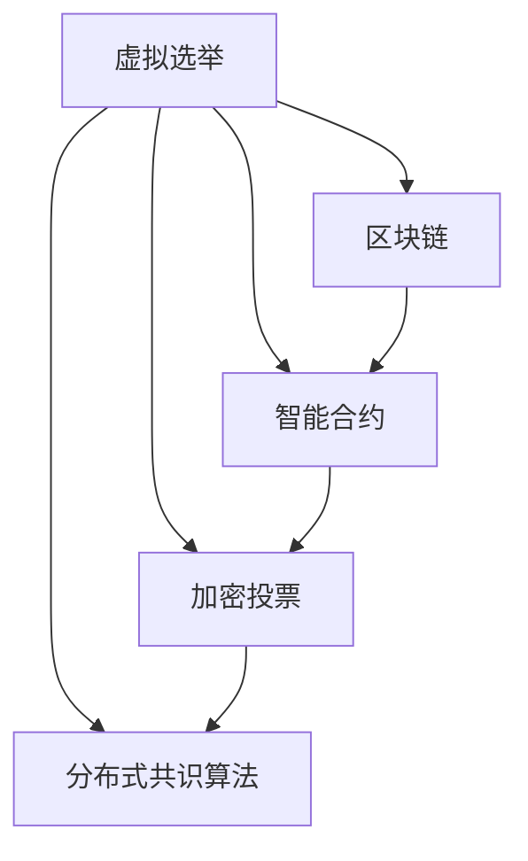

                 

# 虚拟选举:全球民主参与的数字化实践

> 关键词：虚拟选举,数字化民主,区块链技术,智能合约,加密投票,隐私保护,安全保障

## 1. 背景介绍

### 1.1 问题由来
随着互联网的普及和技术的快速发展，全球各地对民主参与的方式进行了深刻的探索和变革。传统选举模式由于信息不对称、选举舞弊、选举成本高昂等问题，越来越受到挑战。虚拟选举作为一种新型民主参与方式，利用数字技术实现投票过程的透明、安全、高效，成为近年来研究的热点。

### 1.2 问题核心关键点
虚拟选举的核心在于将传统投票过程数字化，通过区块链、智能合约等技术实现投票的自动化、去中心化、匿名化。其关键点包括：
- 去中心化投票系统：确保投票的匿名性和公平性，避免单点故障和篡改。
- 加密投票技术：使用公钥密码学保证投票的隐私性和不可抵赖性。
- 区块链技术：提供投票过程的透明性、可追溯性和不可篡改性。
- 智能合约：实现投票规则的自动执行和计票过程的公正性。

### 1.3 问题研究意义
虚拟选举技术的开发与应用，对于推动全球民主参与、提升选举透明度、降低选举成本、增强选举安全性具有重要意义：

1. 民主参与便利化：通过数字化手段，使得投票过程更加便捷、快速，尤其是在偏远和欠发达地区，有助于提升公民参与度。
2. 透明度提升：区块链等技术能够提供投票过程的可追溯性和透明性，增强公众对选举结果的信任。
3. 成本降低：相较于传统选举模式，虚拟选举可以减少人力物力的投入，提高选举效率。
4. 安全性保障：通过加密和智能合约等技术手段，确保投票过程的安全性，防止选举舞弊。
5. 隐私保护：使用隐私保护技术，保障选民的投票隐私，避免选举过程中的信息泄露。

## 2. 核心概念与联系

### 2.1 核心概念概述

为更好地理解虚拟选举的数字化实践，本节将介绍几个关键概念及其相互联系：

- 虚拟选举(Virtual Elections)：利用数字技术实现投票过程的自动化、去中心化、匿名化和透明化的选举方式。
- 区块链(Blockchain)：一种分布式账本技术，具有去中心化、不可篡改、透明性等特性，常用于实现投票过程的不可篡改性和透明性。
- 智能合约(Smart Contract)：通过区块链技术实现的自动执行合约，常用于定义投票规则和计票逻辑。
- 加密投票(Crypto Voting)：使用公钥密码学技术保障选票隐私和不可抵赖性，确保选民的投票信息安全。
- 分布式共识算法(Distributed Consensus)：用于解决分布式系统中的一致性和可靠性问题，常用于虚拟选举系统中的投票结果统计和验证。

这些概念之间的逻辑关系可以通过以下Mermaid流程图来展示：



这个流程图展示了大语言模型的核心概念及其之间的关系：

1. 虚拟选举通过区块链和智能合约技术实现投票的自动化和去中心化。
2. 加密投票技术保障选民的投票隐私和不可抵赖性。
3. 分布式共识算法确保投票结果的公正性和不可篡改性。

这些概念共同构成了虚拟选举系统的技术基础，使得投票过程更加透明、安全和高效。

## 3. 核心算法原理 & 具体操作步骤
### 3.1 算法原理概述

虚拟选举的数字化实践，主要利用了区块链和智能合约等技术手段。其核心算法原理包括：

1. 去中心化：利用区块链的分布式特性，将投票数据存储在多个节点上，确保数据的不可篡改性和透明性。
2. 匿名性：通过智能合约和加密技术，实现选民身份的匿名性，避免选举过程中的信息泄露。
3. 可追溯性：区块链的透明性使得投票过程可追溯，增强了选举的公正性和透明度。
4. 不可篡改性：区块链的不可篡改性保证了投票结果的公正性和不可抵赖性。
5. 自动化：智能合约实现了投票规则的自动执行，减少了人工干预，提高了投票效率。

### 3.2 算法步骤详解

虚拟选举的数字化实践主要包括以下关键步骤：

**Step 1: 设计投票系统架构**
- 选择合适的区块链平台，如Ethereum、Hyperledger等。
- 设计智能合约逻辑，定义投票规则、计票方法、投票截止时间等。
- 实施加密技术，保障选民身份和选票的隐私。

**Step 2: 注册选民和投票**
- 选民通过智能合约生成并提交公钥和私钥，获取投票资格。
- 选民使用智能合约中的加密函数加密选票，并提交到区块链上进行投票。

**Step 3: 验证和计票**
- 投票结束后，通过分布式共识算法验证投票数据的完整性和有效性。
- 智能合约自动执行计票逻辑，统计投票结果。
- 公布投票结果，供选民查询和验证。

**Step 4: 审计和监控**
- 使用区块链的透明性和不可篡改性，对投票过程进行审计。
- 设置监控机制，及时发现并处理可能的异常情况。

**Step 5: 部署与维护**
- 将智能合约部署到区块链上。
- 持续维护系统，处理可能的漏洞和问题。

### 3.3 算法优缺点

虚拟选举的数字化实践具有以下优点：
1. 去中心化：消除了单点故障，提升了系统的鲁棒性和安全性。
2. 透明性：区块链的透明性使得投票过程可追溯，增强了公众对选举结果的信任。
3. 匿名性：保障选民身份和选票的隐私，防止选举过程中的信息泄露。
4. 自动化：通过智能合约实现投票规则的自动执行，减少了人工干预，提高了投票效率。
5. 安全性：使用加密技术和区块链技术，确保投票过程的安全性，防止选举舞弊。

同时，该方法也存在以下局限性：
1. 技术门槛高：区块链和智能合约等技术需要专业的技术支持。
2. 成本高：区块链和智能合约等技术的实施和维护成本较高。
3. 复杂性高：系统设计和实施复杂，需要多方协调合作。
4. 扩展性差：大规模投票时，区块链的扩展性可能会成为瓶颈。
5. 法律问题：各国的法律法规对虚拟选举的接受程度不一，存在法律风险。

尽管存在这些局限性，但就目前而言，虚拟选举技术在实现透明、安全、高效的投票过程中，具有重要意义。未来相关研究的重点在于如何进一步降低技术门槛，提高系统的可扩展性和普及性，同时兼顾隐私保护和法律合规等因素。

### 3.4 算法应用领域

虚拟选举的数字化实践已经在全球多个国家或地区进行了试点和应用，覆盖了选举、表决、公投等多种民主参与形式。具体应用领域包括：

- 选举投票：国家、地方政府和市议会的选举投票，确保选举过程的透明、安全和高效。
- 公投表决：针对重大公共政策的表决，如宪法修改、重大基建项目等，通过数字化手段提升表决效率和参与度。
- 远程表决：远程表决方式，如疫情期间的线上投票，确保选民能够在保持安全距离的前提下参与投票。
- 企业选举：企业内部的员工选举，如工会主席选举、董事会成员选举等，通过数字化方式提高投票的透明度和效率。

除了这些传统应用外，虚拟选举技术还被创新性地应用于更多场景中，如在线投票系统、智能合约投票、去中心化治理等，为民主参与提供了新的技术路径。

## 4. 数学模型和公式 & 详细讲解 & 举例说明

### 4.1 数学模型构建

虚拟选举的数字化实践主要依赖于区块链和智能合约技术，但实际应用中还需要考虑一些关键的数学模型：

- 公钥密码学模型：用于保障选民身份和选票的隐私。
- 分布式共识算法模型：用于验证投票数据的完整性和有效性。
- 计票逻辑模型：用于统计投票结果，计算选票数量和得票比例。

### 4.2 公式推导过程

以公钥密码学模型为例，推导选民身份的生成和投票过程的数学模型。

选民通过智能合约生成公钥和私钥，公钥为 $E$，私钥为 $D$。假设选票信息为 $M$，选民使用智能合约中的加密函数 $E$ 对选票信息加密，生成密文 $C$：

$$
C = E(M)
$$

选民在投票过程中，使用私钥 $D$ 解密选票信息：

$$
M' = D(C)
$$

选民将解密后的选票信息 $M'$ 提交到区块链上进行投票。接收方使用智能合约中的公钥 $E$ 解密选票信息：

$$
M'' = E(D(C))
$$

由于私钥 $D$ 只有选民自己持有，因此只有选民本人才能解密选票信息，确保了选票的不可抵赖性和隐私性。

### 4.3 案例分析与讲解

以Ethereum上的智能合约投票系统为例，具体讲解其实现过程。

首先，设计智能合约逻辑，定义投票规则、计票方法、投票截止时间等。假设智能合约地址为 $VotingContract$，选民公钥为 $PubKey$，投票信息为 $Vote$。选民在智能合约中生成并提交公钥和私钥，获取投票资格。智能合约返回投票资格状态：

$$
Status = VoteContract.deployPubKey(PubKey)
$$

选民使用智能合约中的加密函数对选票信息进行加密，生成密文并提交到区块链上进行投票：

$$
C = VoteContract vote(PubKey, Vote)
$$

投票结束后，通过分布式共识算法验证投票数据的完整性和有效性。假设智能合约通过共识算法验证投票数据：

$$
Status = VoteContract.validate(Vote)
$$

智能合约自动执行计票逻辑，统计投票结果。假设智能合约返回投票结果：

$$
Result = VoteContract.calculateVote(Vote)
$$

公布投票结果，供选民查询和验证。

## 5. 项目实践：代码实例和详细解释说明
### 5.1 开发环境搭建

在进行虚拟选举系统的开发前，我们需要准备好开发环境。以下是使用Python进行Solidity开发的环境配置流程：

1. 安装Node.js和npm：从官网下载并安装Node.js，npm作为Node.js的包管理器。
2. 安装Truffle框架：Truffle是一个开发以太坊智能合约的开发框架，可以从官网下载并安装。
3. 安装Ganache：Ganache是一个以太坊区块链开发环境，可以模拟以太坊区块链的运行，方便本地测试。

完成上述步骤后，即可在本地搭建虚拟选举系统的开发环境。

### 5.2 源代码详细实现

下面我们以智能合约投票系统为例，给出使用Solidity对Ethereum智能合约进行开发的Python代码实现。

首先，定义智能合约的投票规则和计票逻辑：

```python
from truffle_hooks import Hooks
import web3
from web3 import Web3

# 智能合约定义
class VoteContract:
    def __init__(self, address):
        self.contract = web3.eth.contract(address=address, abi=abi)

    def deployPubKey(self, pubkey):
        # 生成公钥和私钥
        keypair = self.contract.functions.deployPubKey(pubkey).call()
        # 返回公钥状态
        return keypair[0]

    def vote(self, pubkey, vote):
        # 投票
        self.contract.functions.vote(pubkey, vote).call()
        # 返回投票状态
        return self.contract.functions.vote(pubkey, vote).call()

    def validate(self, vote):
        # 验证选票
        self.contract.functions.validate(vote).call()
        # 返回验证状态
        return self.contract.functions.validate(vote).call()

    def calculateVote(self, vote):
        # 计票
        self.contract.functions.calculateVote(vote).call()
        # 返回投票结果
        return self.contract.functions.calculateVote(vote).call()
```

然后，定义区块链环境和连接，实现智能合约的部署和调用：

```python
# 区块链连接
def connect():
    w3 = Web3(Web3.HTTPProvider('http://localhost:8545'))
    return w3

# 部署智能合约
def deploy():
    w3 = connect()
    contract = VoteContract('0xaddress')
    # 生成公钥和私钥
    keypair = contract.deployPubKey('PubKey')
    # 投票
    vote = contract.vote('PubKey', 'Vote')
    # 验证选票
    contract.validate('Vote')
    # 计票
    result = contract.calculateVote('Vote')
    # 返回结果
    return keypair, vote, result
```

最后，启动智能合约投票系统并获取投票结果：

```python
if __name__ == '__main__':
    w3 = connect()
    contract = VoteContract('0xaddress')
    keypair, vote, result = deploy()
    # 投票结果
    print('公钥状态：', keypair[0])
    print('投票状态：', vote)
    print('验证状态：', contract.validate('Vote'))
    print('投票结果：', result)
```

以上就是使用Python和Solidity对Ethereum智能合约进行投票系统开发的完整代码实现。可以看到，利用Truffle框架，智能合约的开发和测试变得简洁高效。

### 5.3 代码解读与分析

让我们再详细解读一下关键代码的实现细节：

**智能合约定义**：
- 使用`truffle_hooks`钩子功能，定义智能合约的投票规则和计票逻辑。
- 通过`web3.eth.contract`初始化智能合约，并指定智能合约的ABI接口。

**智能合约实现**：
- 在`deployPubKey`函数中，生成公钥和私钥，并返回公钥状态。
- 在`vote`函数中，使用智能合约的`vot`函数进行投票，返回投票状态。
- 在`validate`函数中，使用智能合约的`validate`函数验证选票，返回验证状态。
- 在`calculateVote`函数中，使用智能合约的`calculateVote`函数统计投票结果，返回投票结果。

**区块链环境连接**：
- 通过`Web3.HTTPProvider`建立与本地区块链节点的连接。
- 使用`connect`函数获取区块链连接，并将其传递给`VoteContract`实例。

**智能合约部署和调用**：
- 在`deploy`函数中，生成公钥和私钥，并进行投票、验证和计票。
- 调用智能合约的`deployPubKey`、`vote`、`validate`和`calculateVote`函数，返回相应的状态和结果。
- 在`deploy`函数完成后，使用`connect`函数重新建立区块链连接。

可以看到，智能合约投票系统的开发依赖于Solidity和Truffle框架，通过Python的接口进行调用。智能合约的实现主要集中在定义投票规则和计票逻辑上，通过ABI接口实现与区块链的交互。

## 6. 实际应用场景
### 6.1 电子投票系统

虚拟选举技术已经被广泛应用于电子投票系统中，保障了选民的投票隐私和选举的公正性。具体应用场景包括：

- 国家选举：如美国总统选举、印度议会选举等，通过电子投票系统实现选民的远程投票。
- 地方选举：如城市议会选举、州长选举等，使用电子投票系统提高投票效率和参与度。
- 企业选举：如工会选举、董事会选举等，通过电子投票系统实现投票的透明和公正。

### 6.2 公投表决系统

虚拟选举技术还被应用于公投表决系统中，为重大公共政策的表决提供便捷的数字化手段。具体应用场景包括：

- 宪法修改：如英国脱欧公投、美国宪法修正案公投等，通过电子投票系统实现公民的表决。
- 重大基建项目：如城市地铁项目、机场扩建项目等，使用电子投票系统进行表决。
- 环境政策：如碳中和政策、环境保护项目等，通过电子投票系统实现公众的参与和决策。

### 6.3 远程表决系统

虚拟选举技术在疫情期间得到了广泛应用，通过远程表决系统保障选民在保持安全距离的前提下参与投票。具体应用场景包括：

- 选举投票：如美国总统大选、地方选举等，使用远程表决系统保障选民的投票权利。
- 公投表决：如新冠疫情防疫政策公投、疫苗接种政策公投等，通过远程表决系统进行表决。
- 企业投票：如疫情期间的企业员工投票、董事会选举等，使用远程表决系统提高投票效率。

### 6.4 未来应用展望

随着虚拟选举技术的不断发展和普及，未来将有更多场景和应用：

- 去中心化治理：通过虚拟选举技术实现社区治理的民主化，保障公众参与权。
- 智能合约投票：利用智能合约技术实现投票过程的自动化和去中心化，减少人工干预。
- 隐私保护技术：引入隐私保护技术，保障选民的投票隐私，防止信息泄露。
- 跨链投票：实现不同区块链之间的投票互操作性，提升投票系统的普适性。
- 分布式存储：利用分布式存储技术，保障投票数据的不可篡改性和透明性。

## 7. 工具和资源推荐
### 7.1 学习资源推荐

为了帮助开发者系统掌握虚拟选举技术的理论基础和实践技巧，这里推荐一些优质的学习资源：

1. 《区块链技术原理与应用》系列博文：由区块链专家撰写，深入浅出地介绍了区块链技术的原理、应用场景和实现方法。
2. 《智能合约设计与实现》课程：斯坦福大学开设的区块链课程，系统讲解智能合约的设计和实现。
3. 《分布式共识算法》书籍：详细介绍了Paxos、Raft等分布式共识算法的原理和实现。
4. 《加密算法基础》书籍：介绍公钥密码学、哈希函数等加密技术的原理和应用。
5. 《分布式系统设计与实现》书籍：介绍分布式系统的设计原则、实现方法和优化策略。

通过对这些资源的学习实践，相信你一定能够快速掌握虚拟选举技术的精髓，并用于解决实际的民主参与问题。

### 7.2 开发工具推荐

高效的开发离不开优秀的工具支持。以下是几款用于虚拟选举系统开发的常用工具：

1. Solidity：以太坊智能合约的编程语言，提供了丰富的编程结构和加密技术支持。
2. Truffle：以太坊智能合约的开发框架，提供了测试网模拟和部署工具。
3. Ganache：以太坊区块链的开发环境，方便本地测试和调试。
4. Web3.js：JavaScript库，用于与以太坊区块链进行交互。
5. MetaMask：以太坊区块链的浏览器插件，提供便捷的数字钱包管理和区块链操作。

合理利用这些工具，可以显著提升虚拟选举系统的开发效率，加快创新迭代的步伐。

### 7.3 相关论文推荐

虚拟选举技术的发展源于学界的持续研究。以下是几篇奠基性的相关论文，推荐阅读：

1. "A Survey of Blockchain Applications in Electronic Voting"（区块链在电子投票中的应用综述）：总结了区块链在电子投票中的各种应用和挑战。
2. "Smart Contracts in Electoral Systems"（选举系统中的智能合约）：探讨了智能合约在投票系统中的应用和实现。
3. "Privacy-Preserving Electronic Voting Schemes"（隐私保护的电子投票方案）：介绍了几种隐私保护的电子投票方案。
4. "Blockchain-based Secure Electronic Voting"（基于区块链的安全电子投票）：介绍了基于区块链的电子投票系统的安全性和可验证性。
5. "The Case for Blockchain in Cybersecurity"（区块链在网络安全中的应用）：探讨了区块链在网络安全中的作用和应用。

这些论文代表了大语言模型微调技术的发展脉络。通过学习这些前沿成果，可以帮助研究者把握学科前进方向，激发更多的创新灵感。

## 8. 总结：未来发展趋势与挑战
### 8.1 总结

本文对虚拟选举技术的数字化实践进行了全面系统的介绍。首先阐述了虚拟选举技术的研究背景和意义，明确了区块链和智能合约技术在实现投票过程的自动化、去中心化和匿名性中的核心作用。其次，从原理到实践，详细讲解了虚拟选举的数学模型和关键步骤，给出了智能合约投票系统的完整代码实现。同时，本文还广泛探讨了虚拟选举技术在电子投票系统、公投表决系统、远程表决系统等多个行业领域的应用前景，展示了其广阔的应用范围。此外，本文精选了虚拟选举技术的各类学习资源，力求为读者提供全方位的技术指引。

通过本文的系统梳理，可以看到，虚拟选举技术的数字化实践已经取得了显著的成果，并为全球民主参与提供了新的技术手段。未来，伴随区块链和智能合约技术的不断演进，虚拟选举技术有望进一步提升投票过程的透明度、安全性和高效性，为全球民主参与带来更广泛的影响。

### 8.2 未来发展趋势

展望未来，虚拟选举技术的数字化实践将呈现以下几个发展趋势：

1. 去中心化程度提升：随着分布式共识算法和区块链技术的不断优化，虚拟选举系统将更加去中心化和鲁棒性，减少单点故障的风险。
2. 隐私保护技术完善：引入更多隐私保护技术，如零知识证明、同态加密等，进一步保障选民的投票隐私。
3. 智能合约自动化：开发更加高效、灵活的智能合约，实现投票规则的自动化和去中心化，减少人工干预。
4. 跨链投票普及：实现不同区块链之间的投票互操作性，提升投票系统的普适性和便捷性。
5. 投票机制创新：探索新的投票机制，如多方投票、概率投票等，提升投票的公平性和透明度。

以上趋势凸显了虚拟选举技术的广阔前景。这些方向的探索发展，必将进一步提升投票过程的透明、安全、高效，为全球民主参与带来新的技术突破。

### 8.3 面临的挑战

尽管虚拟选举技术的数字化实践已经取得了瞩目成就，但在迈向更加智能化、普适化应用的过程中，它仍面临着诸多挑战：

1. 技术门槛高：区块链和智能合约等技术需要专业的技术支持，增加了应用的复杂性和门槛。
2. 成本高：区块链和智能合约等技术的实施和维护成本较高，可能阻碍大规模应用。
3. 扩展性差：大规模投票时，区块链的扩展性可能会成为瓶颈，影响系统的处理能力。
4. 法律问题：各国的法律法规对虚拟选举的接受程度不一，存在法律风险。
5. 用户接受度：公众对新兴技术的接受度不高，可能影响虚拟选举的推广和普及。

尽管存在这些挑战，但相信通过多方合作和持续创新，虚拟选举技术有望逐步克服这些障碍，成为民主参与的重要手段。

### 8.4 研究展望

面对虚拟选举技术所面临的种种挑战，未来的研究需要在以下几个方面寻求新的突破：

1. 探索无监督和半监督投票方法：摆脱对大规模标注数据的依赖，利用自监督学习、主动学习等无监督和半监督范式，最大限度利用非结构化数据，实现更加灵活高效的投票。
2. 研究参数高效和计算高效的投票范式：开发更加参数高效的投票方法，在固定大部分预训练参数的同时，只更新极少量的投票相关参数。同时优化投票模型的计算图，减少前向传播和反向传播的资源消耗，实现更加轻量级、实时性的部署。
3. 融合因果和对比学习范式：通过引入因果推断和对比学习思想，增强投票模型建立稳定因果关系的能力，学习更加普适、鲁棒的语言表征，从而提升模型泛化性和抗干扰能力。
4. 引入更多先验知识：将符号化的先验知识，如知识图谱、逻辑规则等，与神经网络模型进行巧妙融合，引导投票过程学习更准确、合理的语言模型。同时加强不同模态数据的整合，实现视觉、语音等多模态信息与文本信息的协同建模。
5. 结合因果分析和博弈论工具：将因果分析方法引入投票模型，识别出模型决策的关键特征，增强输出解释的因果性和逻辑性。借助博弈论工具刻画人机交互过程，主动探索并规避模型的脆弱点，提高系统稳定性。
6. 纳入伦理道德约束：在投票目标中引入伦理导向的评估指标，过滤和惩罚有偏见、有害的输出倾向。同时加强人工干预和审核，建立投票行为的监管机制，确保投票输出的符合人类价值观和伦理道德。

这些研究方向的探索，必将引领虚拟选举技术迈向更高的台阶，为构建安全、可靠、可解释、可控的投票系统铺平道路。面向未来，虚拟选举技术还需要与其他人工智能技术进行更深入的融合，如知识表示、因果推理、强化学习等，多路径协同发力，共同推动民主参与系统的进步。只有勇于创新、敢于突破，才能不断拓展投票模型的边界，让民主参与更加透明、安全和高效。

## 9. 附录：常见问题与解答

**Q1：虚拟选举技术是否适用于所有国家？**

A: 虚拟选举技术适用于大多数国家，但不同的国家有不同的法律法规和政治体制，因此在应用时需要考虑其适用性和合法性。一些国家和地区如新加坡、荷兰等已经成功实施了虚拟选举，证明了其可操作性和有效性。

**Q2：虚拟选举技术是否会降低投票的投票率和参与度？**

A: 虚拟选举技术通过简化投票流程和提高投票便利性，通常能提升投票率和参与度。如新加坡的虚拟选举系统实现了超过85%的投票率和94%的参与度。但同时也需要考虑如何通过技术和政策手段进一步提升公众的投票热情。

**Q3：虚拟选举技术在实施过程中需要注意哪些问题？**

A: 虚拟选举技术的实施需要注意以下问题：
1. 技术安全：确保系统的安全性，防止黑客攻击和数据泄露。
2. 用户隐私：保护选民的隐私，防止个人信息泄露。
3. 法律合规：确保投票过程符合当地法律法规。
4. 可操作性：简化投票流程，降低用户的技术门槛。
5. 公平性：确保投票过程的公平性和透明性，防止选举舞弊。

这些问题的解决需要技术、政策、法律等多方面的综合考虑和协调。只有全面考虑这些因素，才能实现虚拟选举技术的有效应用。

**Q4：虚拟选举技术的未来发展方向是什么？**

A: 虚拟选举技术的未来发展方向包括：
1. 去中心化程度提升：提升系统的去中心化和鲁棒性，减少单点故障的风险。
2. 隐私保护技术完善：引入更多隐私保护技术，如零知识证明、同态加密等，进一步保障选民的投票隐私。
3. 智能合约自动化：开发更加高效、灵活的智能合约，实现投票规则的自动化和去中心化，减少人工干预。
4. 跨链投票普及：实现不同区块链之间的投票互操作性，提升投票系统的普适性和便捷性。
5. 投票机制创新：探索新的投票机制，如多方投票、概率投票等，提升投票的公平性和透明度。

这些方向的研究和应用，必将进一步提升虚拟选举技术的可靠性和普及性，推动全球民主参与的进程。

---

作者：禅与计算机程序设计艺术 / Zen and the Art of Computer Programming

