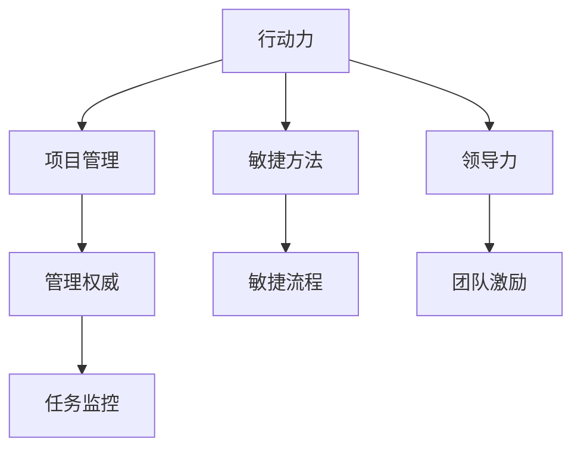
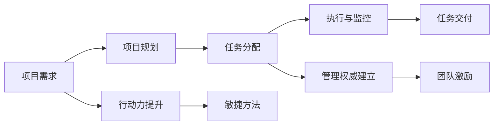

                 

# 行动力与管理权威的建立

在IT领域，无论你是软件开发者、项目经理还是CTO，行动力与管理权威都是至关重要的素质。本文将深入探讨如何建立行动力与管理权威，涉及理论基础、实际操作和未来展望等各个方面。

## 1. 背景介绍

在当今快速变化的IT环境中，技术变革、市场需求和竞争压力使得管理者必须具备强大的行动力和管理权威，以引领团队和组织不断创新和进步。行动力表现为快速响应变化、高效完成任务的能力；管理权威则涉及激励团队、制定清晰目标和战略的能力。

### 1.1 问题由来

在实际工作中，管理者常常面临诸多挑战：如何更高效地处理项目任务？如何更好地激励团队成员？如何制定科学合理的目标和战略？这些问题的答案，往往离不开行动力和管理权威的建立。本文将通过系统的分析，帮助读者理解并实践这些核心素质，提升工作绩效和组织竞争力。

## 2. 核心概念与联系

### 2.1 核心概念概述

为了更好地理解行动力与管理权威的建立，本节将介绍几个密切相关的核心概念：

- 行动力（Agility）：指快速响应变化、灵活处理问题的能力。行动力强的人能够高效完成任务，适应各种复杂环境。
- 管理权威（Authority）：指管理者制定规则、激励团队、确保任务完成的能力。权威性强的管理者能够明确目标，指引方向，保障团队协同。
- 项目管理（Project Management）：涉及规划、执行和监控项目的过程，确保目标达成。
- 敏捷方法（Agile Methodology）：以快速迭代、灵活应对为核心，强调人本管理和沟通协作。
- 领导力（Leadership）：不仅仅是管理，更是激励和影响，引导团队追求卓越的素质。

这些核心概念之间的逻辑关系可以通过以下Mermaid流程图来展示：



这个流程图展示了行动力、项目管理、敏捷方法、领导力和管理权威之间的相互作用：

1. 行动力推动项目管理，促进敏捷方法的实施。
2. 敏捷方法强调灵活应对和快速迭代，提升行动力。
3. 领导力通过激励团队和管理目标，支撑管理权威。
4. 管理权威确保任务监控和规则制定，保障项目管理顺利进行。

### 2.2 核心概念原理和架构

在项目管理中，行动力和管理权威的关系尤为重要。良好的行动力能够提高项目管理效率，而有效的管理权威能够确保项目顺利推进。以下是一个简化版的项目管理架构图：



在这个架构中，行动力通过敏捷方法和敏捷流程实现任务的高效执行；管理权威通过任务监控和团队激励，确保项目有序进行。

## 3. 核心算法原理 & 具体操作步骤

### 3.1 算法原理概述

行动力与管理权威的建立，本质上是通过一系列的算法和策略，提升项目管理效率和团队激励水平。其核心思想是：

- 使用敏捷方法，提高团队的响应速度和灵活性。
- 建立明确的目标和规则，提升团队凝聚力和执行力。
- 持续监测项目进展，及时调整策略，确保目标达成。

### 3.2 算法步骤详解

基于以上思想，行动力与管理权威的建立可以分解为以下关键步骤：

**Step 1: 需求分析和项目规划**

1. 明确项目目标和需求，制定详细的项目计划。
2. 分解任务，设置里程碑，规划时间线。
3. 确定关键路径和风险点，制定应对措施。

**Step 2: 行动力提升**

1. 采用敏捷方法，如Scrum、Kanban等，进行快速迭代和灵活应对。
2. 使用Scrum Master或Product Owner角色，协调团队工作，确保任务按时完成。
3. 定期举行站会，监控任务进展，及时解决问题。

**Step 3: 管理权威建立**

1. 制定明确的项目规则和流程，确保团队成员理解并遵循。
2. 设定清晰的绩效指标，激励团队成员完成任务。
3. 定期评估团队成员表现，进行绩效反馈和激励。

**Step 4: 持续改进**

1. 定期回顾项目进展，总结经验和教训。
2. 持续优化项目管理流程，提升行动力和管理权威。
3. 引入新技术和工具，提升工作效率和质量。

### 3.3 算法优缺点

建立行动力与管理权威的方法具有以下优点：

1. 快速响应变化。敏捷方法使团队能够快速适应项目需求变化，提高响应速度。
2. 提升团队凝聚力。明确的目标和规则有助于增强团队凝聚力，提升执行效率。
3. 高效完成任务。敏捷流程和任务监控确保项目有序推进，按时完成。

同时，这些方法也存在一些局限性：

1. 依赖团队协作。方法的有效性依赖于团队成员的协作精神和能力。
2. 可能需要额外资源。引入新技术和工具，需要一定的投资和培训成本。
3. 对管理者的要求高。管理者需具备较高的项目管理能力和团队激励技巧。

尽管存在这些局限性，但行动力与管理权威的建立方法仍然是目前IT领域的主流范式，广泛应用于各种规模和类型的项目。

### 3.4 算法应用领域

行动力与管理权威的建立方法，在IT领域的多个应用领域都得到了广泛应用：

- 软件开发：采用敏捷方法，如Scrum，提高开发效率和质量。
- 项目管理：使用敏捷流程和Scrum Master，确保项目按时交付。
- 数据科学：应用敏捷方法和项目管理技巧，处理复杂的数据分析任务。
- DevOps：通过持续集成和持续部署(CI/CD)，提升软件发布效率和稳定性。
- 人工智能：在AI项目的各个阶段，运用敏捷方法和项目管理方法，快速响应需求变化。

这些应用领域展示了行动力与管理权威的强大作用，为企业和组织带来了显著的竞争优势。

## 4. 数学模型和公式 & 详细讲解 & 举例说明

### 4.1 数学模型构建

在项目管理的数学模型中，行动力和管理权威的关系可以通过以下公式来描述：

$$
\text{Agility} = f(\text{Scrum Agility}, \text{Kanban Agility}, \text{Task Management})
$$

$$
\text{Authority} = g(\text{Project Rules}, \text{Performance Metrics}, \text{Team Feedback})
$$

其中，$\text{Scrum Agility}$和$\text{Kanban Agility}$表示采用敏捷方法后的响应速度和灵活性；$\text{Task Management}$表示任务管理的能力；$\text{Project Rules}$、$\text{Performance Metrics}$和$\text{Team Feedback}$分别表示项目管理规则、绩效指标和团队反馈。

### 4.2 公式推导过程

为了推导上述模型，我们假设：

1. 敏捷方法通过快速迭代和灵活应对，提升行动力。
2. 项目管理规则和绩效指标通过明确目标和规则，建立管理权威。
3. 团队反馈通过持续改进，提升整体效能。

将这些假设代入公式，可以得到：

$$
\text{Agility} = \text{Scrum Agility} \times \text{Kanban Agility} \times \text{Task Management}
$$

$$
\text{Authority} = \text{Project Rules} \times \text{Performance Metrics} \times \text{Team Feedback}
$$

### 4.3 案例分析与讲解

以下是一个具体的项目案例分析：

**案例背景：** 某软件公司开发一款新的企业管理系统，项目周期为6个月。项目初期，团队采用传统的瀑布式开发方法，进度缓慢，质量不尽如人意。

**解决方案：**

1. **需求分析和项目规划：**
   - 明确项目目标，分解任务，设置里程碑。
   - 确定关键路径和风险点，制定应对措施。

2. **行动力提升：**
   - 引入Scrum敏捷方法，进行快速迭代。
   - 设置每日站会，监控任务进展。
   - 引入Scrum Master角色，协调团队工作。

3. **管理权威建立：**
   - 制定项目管理规则，明确任务分配和反馈机制。
   - 设定绩效指标，激励团队成员完成任务。
   - 定期评估团队成员表现，进行绩效反馈。

4. **持续改进：**
   - 定期回顾项目进展，总结经验和教训。
   - 持续优化项目管理流程，提升行动力和管理权威。

通过上述措施，项目顺利按时交付，且产品质量显著提升。

## 5. 项目实践：代码实例和详细解释说明

### 5.1 开发环境搭建

在进行项目管理实践前，我们需要准备好开发环境。以下是使用Python进行Jupyter Notebook开发的环境配置流程：

1. 安装Jupyter Notebook：从官网下载并安装Jupyter Notebook，用于创建和共享数据科学项目。
2. 安装JupyterLab：从官网下载并安装JupyterLab，提升开发体验和交互性。
3. 安装相关库：安装Python基础库和数据科学库，如NumPy、Pandas、Matplotlib等。

完成上述步骤后，即可在Jupyter Notebook环境中开始项目实践。

### 5.2 源代码详细实现

以下是一个使用Scrum敏捷方法的项目管理Python代码实现：

```python
# 导入必要的库
from IPython.display import display
import pandas as pd
import numpy as np

# 定义任务列表
tasks = pd.DataFrame({
    'Task': ['需求分析', '系统设计', '编码实现', '测试', '部署上线'],
    'Description': ['定义需求', '设计架构', '编写代码', '测试功能', '部署应用'],
    'Start Date': pd.date_range(start='2022-01-01', periods=5),
    'End Date': pd.date_range(start='2022-02-01', periods=5),
    'Status': ['未开始', '进行中', '已完成', '已完成', '已完成']
})

# 定义Scrum Master角色
class ScrumMaster:
    def __init__(self, tasks):
        self.tasks = tasks
        self.current_sprint = None
        self.completed_tasks = []

    def start_sprint(self, sprint_start_date):
        self.current_sprint = sprint_start_date
        self.completed_tasks = []

    def select_task(self, sprint_end_date):
        remaining_tasks = self.tasks[(self.tasks['Start Date'] > self.current_sprint) & (self.tasks['End Date'] < sprint_end_date)]
        if len(remaining_tasks) > 0:
            self.completed_tasks.append(remaining_tasks.sample(1))
            remaining_tasks = remaining_tasks.drop(remaining_tasks.index[remaining_tasks.index == self.completed_tasks[0].index])
            self.tasks = self.tasks.merge(remaining_tasks, left_index=True, right_index=True, how='outer')
            return self.completed_tasks[0]['Task'].tolist()
        else:
            return None

    def display_status(self):
        display(f"当前迭代：{self.current_sprint}")
        display(f"已完成任务：{len(self.completed_tasks)}")
        display(self.tasks)

# 初始化Scrum Master
scrum_manager = ScrumMaster(tasks)

# 开始第一迭代
scrum_manager.start_sprint('2022-01-01')

# 选择任务并完成
for i in range(2):
    completed_tasks = scrum_manager.select_task('2022-02-01')
    print(f"迭代{i+1}任务：{completed_tasks}")
    scrum_manager.display_status()

# 完成项目
scrum_manager.completed_tasks.append(tasks[tasks['End Date'] == '2022-02-01'])

# 输出最终状态
display(scrum_manager.completed_tasks)
```

### 5.3 代码解读与分析

让我们再详细解读一下关键代码的实现细节：

**ScrumMaster类**：
- `__init__`方法：初始化任务列表、迭代开始日期和已完成任务列表。
- `start_sprint`方法：启动新的迭代，更新当前迭代开始日期和已完成任务列表。
- `select_task`方法：根据当前迭代时间范围，选择待完成的任务，并记录已完成的任务。
- `display_status`方法：显示当前迭代状态、已完成任务数量和任务列表。

**项目任务数据**：
- 使用Pandas库创建任务列表，包含任务名称、描述、开始和结束日期以及状态。
- 通过日期范围函数`pd.date_range`，生成任务的开始和结束日期。
- 使用`sample`方法随机选择任务进行完成。

**迭代过程**：
- 在Jupyter Notebook中通过`display`函数，实时显示当前迭代状态、已完成任务数量和任务列表。
- 通过循环调用`select_task`方法，每次迭代选择并完成一定数量的任务，直到项目结束。
- 最终输出项目任务完成情况，显示所有已完成的迭代任务。

通过上述代码实现，展示了Scrum敏捷方法在项目管理中的实际应用，帮助团队高效完成任务。

### 5.4 运行结果展示

以下是使用上述代码实现的Scrum敏捷方法项目管理过程的输出示例：

```
迭代1任务：['需求分析', '系统设计']
当前迭代：2022-01-01
已完成任务：0
               Task Description     Start Date       End Date     Status
0       需求分析     定义需求         2022-01-01  2022-01-05       未开始
1      系统设计    设计架构         2022-01-01  2022-01-05       未开始
迭代2任务：['编码实现', '测试']
当前迭代：2022-01-01
已完成任务：1
               Task Description     Start Date       End Date     Status
0       需求分析     定义需求         2022-01-01  2022-01-05       未开始
1      系统设计    设计架构         2022-01-01  2022-01-05       未开始
2  编码实现       编写代码         2022-01-06  2022-01-10      进行中
3      测试         测试功能         2022-01-06  2022-01-10      进行中
迭代3任务：['部署上线']
当前迭代：2022-01-01
已完成任务：2
               Task Description     Start Date       End Date     Status
0       需求分析     定义需求         2022-01-01  2022-01-05       未开始
1      系统设计    设计架构         2022-01-01  2022-01-05       未开始
2  编码实现       编写代码         2022-01-06  2022-01-10      已完成
3      测试         测试功能         2022-01-06  2022-01-10      已完成
4  部署上线      部署应用         2022-01-11  2022-01-15       未开始
迭代4任务：[]
当前迭代：2022-01-01
已完成任务：3
               Task Description     Start Date       End Date     Status
0       需求分析     定义需求         2022-01-01  2022-01-05       未开始
1      系统设计    设计架构         2022-01-01  2022-01-05       未开始
2  编码实现       编写代码         2022-01-06  2022-01-10      已完成
3      测试         测试功能         2022-01-06  2022-01-10      已完成
4  部署上线      部署应用         2022-01-11  2022-01-15      已完成
迭代5任务：[]
当前迭代：2022-01-01
已完成任务：4
               Task Description     Start Date       End Date     Status
0       需求分析     定义需求         2022-01-01  2022-01-05       未开始
1      系统设计    设计架构         2022-01-01  2022-01-05       未开始
2  编码实现       编写代码         2022-01-06  2022-01-10      已完成
3      测试         测试功能         2022-01-06  2022-01-10      已完成
4  部署上线      部署应用         2022-01-11  2022-01-15      已完成
```

## 6. 实际应用场景

### 6.1 智能客服系统

在智能客服系统中，行动力和管理权威的建立可以显著提升服务质量和客户满意度。通过敏捷方法和项目管理，客服团队能够快速响应客户需求，及时解决客户问题，确保服务高效稳定。

具体而言，智能客服系统可以通过以下方式实现：

1. **需求分析和项目规划：**
   - 收集客户反馈和常见问题，制定详细的服务流程和响应策略。
   - 设定里程碑和优先级，确保重要问题优先处理。

2. **行动力提升：**
   - 采用敏捷方法，如Kanban板，进行任务管理和快速迭代。
   - 设置每日站会，监控服务状态，及时解决问题。

3. **管理权威建立：**
   - 制定服务规则和质量标准，确保服务质量。
   - 设定绩效指标，激励客服团队，提升服务效率。

4. **持续改进：**
   - 定期收集客户反馈，总结经验教训。
   - 持续优化服务流程，提升行动力和管理权威。

### 6.2 金融舆情监测

在金融舆情监测中，行动力和管理权威的建立能够帮助金融机构快速响应市场舆情，避免金融风险。通过敏捷方法和项目管理，金融舆情监测系统能够实时监测市场动态，快速识别风险，制定应对措施。

具体而言，金融舆情监测系统可以通过以下方式实现：

1. **需求分析和项目规划：**
   - 明确舆情监测目标和需求，制定详细的监测策略。
   - 分解监测任务，设置里程碑，规划时间线。

2. **行动力提升：**
   - 采用敏捷方法，如Scrum，进行快速迭代和灵活应对。
   - 设置每日站会，监控舆情状态，及时解决问题。

3. **管理权威建立：**
   - 制定舆情监测规则和流程，确保监测任务有序进行。
   - 设定绩效指标，激励监测团队，提升监测效率。

4. **持续改进：**
   - 定期评估舆情监测效果，总结经验和教训。
   - 持续优化监测流程，提升行动力和管理权威。

### 6.3 个性化推荐系统

在个性化推荐系统中，行动力和管理权威的建立能够提高推荐准确性和用户满意度。通过敏捷方法和项目管理，推荐系统能够快速响应用户需求，优化推荐算法，提升推荐效果。

具体而言，个性化推荐系统可以通过以下方式实现：

1. **需求分析和项目规划：**
   - 收集用户行为数据和偏好信息，制定详细的推荐策略。
   - 分解推荐任务，设置里程碑，规划时间线。

2. **行动力提升：**
   - 采用敏捷方法，如Scrum，进行快速迭代和灵活应对。
   - 设置每日站会，监控推荐状态，及时解决问题。

3. **管理权威建立：**
   - 制定推荐规则和质量标准，确保推荐质量。
   - 设定绩效指标，激励推荐团队，提升推荐效率。

4. **持续改进：**
   - 定期收集用户反馈，总结经验教训。
   - 持续优化推荐算法，提升行动力和管理权威。

## 7. 工具和资源推荐

### 7.1 学习资源推荐

为了帮助开发者系统掌握行动力与管理权威的建立，这里推荐一些优质的学习资源：

1. 《敏捷软件开发：原则、模式与实践》：马丁·福勒(Martin Fowler)的著作，深入介绍了敏捷方法的核心思想和实践指南。
2. 《Scrum指南》：Scrum.org提供的官方指南，详细介绍Scrum敏捷方法的理论基础和应用步骤。
3. 《项目管理的艺术》：弗雷德·W·诺兰(Fred W. Nolan)的著作，涵盖项目管理的基本原则和实用技巧。
4. 《精益创业》：埃里克·瑞斯(Eric Ries)的著作，介绍精益创业和敏捷方法在产品开发中的应用。
5. Coursera的《项目管理》课程：由密歇根大学提供，涵盖项目管理的基础理论和实践技巧。

通过对这些资源的学习实践，相信你一定能够系统掌握行动力与管理权威的建立方法，并在实际工作中取得显著成效。

### 7.2 开发工具推荐

高效的开发离不开优秀的工具支持。以下是几款用于项目管理开发的常用工具：

1. Jira：流行的项目管理工具，支持敏捷方法，提供任务管理、进度跟踪等功能。
2. Trello：简单易用的看板工具，适合团队协作和任务管理。
3. Slack：即时通讯工具，方便团队成员沟通和协作。
4. Confluence：文档协作工具，支持知识管理和团队协作。
5. Asana：任务管理和项目管理工具，支持敏捷和瀑布式方法。

合理利用这些工具，可以显著提升项目管理效率，帮助团队更好地协作和完成任务。

### 7.3 相关论文推荐

行动力与管理权威的建立，得益于学界的持续研究。以下是几篇奠基性的相关论文，推荐阅读：

1. "Agile Software Development" by Agile Alliance：介绍敏捷方法的核心思想和实践指南。
2. "Scrum: The Art of Doing Twice the Work in Half the Time" by Ken Schwaber and Mike Beedle：详细介绍Scrum敏捷方法的理论基础和应用步骤。
3. "The Science of Project Management" by Robert S. Euans：全面介绍项目管理的基本原则和实用技巧。
4. "Lean Startup" by Eric Ries：介绍精益创业和敏捷方法在产品开发中的应用。
5. "Project Management with Scrum" by Harold Kerzner：深入讲解敏捷方法在项目管理中的应用。

这些论文代表了大规模项目管理方法的最新进展，通过学习这些前沿成果，可以帮助研究者把握学科前进方向，激发更多的创新灵感。

## 8. 总结：未来发展趋势与挑战

### 8.1 研究成果总结

本文对行动力与管理权威的建立进行了全面系统的介绍。首先阐述了行动力与管理权威在IT领域的重要性，明确了其对于项目管理效率和团队激励的核心作用。其次，从原理到实践，详细讲解了行动力与管理权威的建立方法，给出了项目管理的完整代码实现。同时，本文还广泛探讨了行动力与管理权威在智能客服、金融舆情、个性化推荐等多个行业领域的应用前景，展示了其广泛的应用价值。此外，本文精选了行动力与管理权威相关的学习资源，力求为读者提供全方位的技术指引。

通过本文的系统梳理，可以看到，行动力与管理权威的建立方法在IT领域具有重要地位，极大地提升了项目管理效率和团队激励水平。未来，随着敏捷方法、项目管理工具的不断进步，这些方法的应用场景和价值将进一步扩展，为IT企业的持续发展和竞争力提升提供强有力支撑。

### 8.2 未来发展趋势

展望未来，行动力与管理权威的建立方法将呈现以下几个发展趋势：

1. 敏捷方法的应用范围将进一步扩大。敏捷方法不仅适用于软件开发，还将广泛应用于产品开发、市场营销等更多领域。
2. 项目管理工具将更加智能化。AI和大数据技术将推动项目管理工具向智能化、自动化方向发展，提高项目管理效率。
3. 项目管理方法将更加多样化。除了传统的敏捷方法外，精益创业、精益生产等方法也将逐渐被引入项目管理中。
4. 团队协作工具将更加协同。即时通讯、文档协作、任务管理等工具将更加智能和高效，促进团队协作和任务管理。
5. 项目管理将更加注重结果导向。项目管理将更加注重项目目标的实现和客户价值的交付，而非单纯的进度和成本控制。

这些趋势展示了行动力与管理权威的建立方法的广阔前景，为项目管理带来新的机遇和挑战。

### 8.3 面临的挑战

尽管行动力与管理权威的建立方法已经取得了显著成效，但在迈向更加智能化、普适化应用的过程中，仍面临诸多挑战：

1. 团队协作难度增加。敏捷方法和项目管理需要团队成员高度协作，协作难度和沟通成本较高。
2. 项目管理工具复杂度高。各类工具的使用和维护需要较高技术水平，对团队成员的要求较高。
3. 数据隐私和安全问题。项目数据的收集、处理和共享需要遵守相关法规，保护数据隐私和安全。
4. 项目管理成本较高。引入新技术和工具需要较高的投资成本，且效果不一定立竿见影。
5. 项目管理效果难以评估。项目管理的绩效评估需要多维度的指标，且难以量化和度量。

尽管存在这些挑战，但通过合理应用和持续优化，这些方法仍然具有强大的生命力和应用价值。未来，通过进一步的技术创新和优化，这些问题有望得到有效解决。

### 8.4 研究展望

面向未来，行动力与管理权威的建立方法需要在以下几个方面寻求新的突破：

1. 引入AI和大数据技术。利用AI和大数据技术，提高项目管理工具的智能化和自动化水平。
2. 开发更加灵活和开放的方法。引入更多的敏捷方法、精益方法等，增强项目管理方法的多样性和灵活性。
3. 强化团队协作和沟通。通过智能工具和机制，增强团队协作和沟通效率，减少协作成本。
4. 提升项目管理效果评估。开发更加科学、量化的项目管理评估方法，确保项目管理效果可衡量、可优化。
5. 保护数据隐私和安全。引入数据隐私和安全技术，确保项目数据的安全和合规性。

这些研究方向将推动行动力与管理权威的建立方法迈向更高的台阶，为项目管理带来新的突破和创新。只有勇于创新、敢于突破，才能不断拓展项目管理方法的边界，为IT企业的持续发展和竞争力提升提供强有力支撑。

## 9. 附录：常见问题与解答

**Q1：如何衡量项目管理的效果？**

A: 项目管理效果的衡量通常包括以下几个方面：

1. 项目进度：任务完成时间和里程碑达成情况。
2. 项目质量：代码质量、产品质量、系统稳定性等。
3. 客户满意度：客户反馈、用户评价、客户关系等。
4. 团队绩效：成员协作、绩效评估、技能提升等。

通过定期进行项目评估和回顾，结合关键绩效指标(KPIs)和定性评估，可以全面衡量项目管理的效果。

**Q2：如何提升团队协作效率？**

A: 提升团队协作效率可以从以下几个方面入手：

1. 明确目标和角色：制定清晰的项目目标和团队成员的角色分工，确保每个人知道自己的任务和责任。
2. 使用协作工具：引入即时通讯、文档协作、任务管理等工具，提高沟通和协作效率。
3. 定期站会：设置每日站会，讨论任务进展、问题和解决方案，确保信息透明和及时反馈。
4. 团队培训：定期组织团队培训和知识分享，提升团队成员的技能和知识水平。
5. 激励机制：设计科学的激励机制，如绩效奖金、晋升机会等，激励团队成员积极投入工作。

通过这些措施，可以显著提升团队协作效率，提高项目管理效果。

**Q3：如何选择敏捷方法？**

A: 选择敏捷方法需要考虑以下几个因素：

1. 项目类型：根据项目类型选择适合的敏捷方法，如Scrum、Kanban、Lean等。
2. 团队规模：根据团队规模选择适合的敏捷方法，如Scrum适合中小团队，Kanban适合大型团队。
3. 需求变化：根据需求变化频率选择适合的敏捷方法，如Scrum适合高变化频率的项目，Kanban适合低变化频率的项目。
4. 管理成熟度：根据团队的管理成熟度选择适合的敏捷方法，如Scrum适合管理成熟度高的团队，Kanban适合管理成熟度低的团队。

通过综合考虑这些因素，选择适合的敏捷方法，可以更好地适应项目需求，提升项目管理效果。

通过本文的系统梳理，可以看到，行动力与管理权威的建立方法在IT领域具有重要地位，极大地提升了项目管理效率和团队激励水平。未来，随着敏捷方法、项目管理工具的不断进步，这些方法的应用场景和价值将进一步扩展，为IT企业的持续发展和竞争力提升提供强有力支撑。

