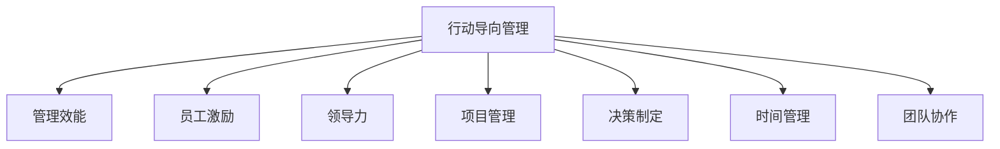

                 

# 行动导向：高效管理的基础

> 关键词：行动导向，管理效能，员工激励，领导力，项目管理，决策制定，时间管理，团队协作

## 1. 背景介绍

### 1.1 问题由来
在现代企业运营中，管理效率低下、团队协作困难、员工士气低落等问题频繁出现。这些问题不仅影响企业运营的流畅性，更严重地制约了企业的发展速度和竞争力。如何在有限的资源和时间内，通过高效的领导和管理，达到目标最大化，已成为企业管理者急需解决的关键问题。

### 1.2 问题核心关键点
管理效能的提升，不仅依赖于公司的资源和策略，更依赖于行动导向的管理方式。所谓行动导向，是指在企业运营中，以目标为导向，快速高效地执行各项决策和管理，强调明确目标、及时反馈和持续改进。

行动导向的管理方式能够最大化利用资源，减少决策过程中的不确定性和浪费，使企业能够灵活应对市场变化，快速响应客户需求，从而增强企业的竞争力和市场地位。

## 2. 核心概念与联系

### 2.1 核心概念概述

为更好地理解行动导向的管理方法，本节将介绍几个密切相关的核心概念：

- **行动导向管理**：以目标为导向，快速高效地执行各项决策和管理，强调明确目标、及时反馈和持续改进。
- **管理效能**：指企业管理者通过决策和执行活动达到目标最大化，强调资源利用率、时间管理和团队协作等方面的能力。
- **员工激励**：通过各种手段，提升员工的工作积极性和主动性，增强团队的凝聚力和战斗力。
- **领导力**：指领导者通过自身行为和决策，引领团队达成目标的能力。
- **项目管理**：通过科学的项目管理方法，实现资源的有效利用和项目的按时按质交付。
- **决策制定**：在面对复杂多变的环境时，快速、准确地制定有效决策的能力。
- **时间管理**：合理规划和分配时间，使每一分每一秒都得到高效利用。
- **团队协作**：通过有效沟通和协调，实现团队成员的合作，提高整体工作效率。

这些核心概念之间的逻辑关系可以通过以下Mermaid流程图来展示：



这个流程图展示了一系列的行动导向管理概念及其之间的关系：

1. 行动导向管理作为基础，通过明确的目标导向，推动管理效能的提升。
2. 员工激励、领导力、项目管理、决策制定、时间管理、团队协作等具体实践环节，都是行动导向管理的关键构成部分。
3. 这些具体实践环节共同作用，促进企业实现高效运营和目标达成。

## 3. 核心算法原理 & 具体操作步骤
### 3.1 算法原理概述

行动导向的管理方法，本质上是通过一系列具体的管理工具和策略，以目标为导向，快速高效地执行各项决策和管理。

在实际管理过程中，常见的行动导向管理策略包括：

- 明确目标：通过SMART原则，即具体、可衡量、可实现、相关、时限性的目标设定，确保团队明确工作方向和努力目标。
- 项目管理：运用甘特图、看板、敏捷开发等工具，实现项目的科学管理和按时交付。
- 员工激励：通过绩效考核、股权激励、培训发展等手段，激发员工工作热情，增强团队凝聚力。
- 领导力：强调以身作则、榜样效应、授权与赋能等，使领导者能够引领团队，提升团队绩效。
- 决策制定：运用决策树、SWOT分析、数据分析等工具，快速、准确地制定有效决策。
- 时间管理：采用番茄工作法、四象限法则等策略，合理分配时间，确保任务高效完成。
- 团队协作：通过团队建设、定期沟通、协作平台等方式，促进团队成员的合作，提高整体工作效率。

### 3.2 算法步骤详解

行动导向的管理方法，通常包括以下几个关键步骤：

**Step 1: 设定明确目标**
- 通过SMART原则，明确短期和长期的业务目标。
- 将大目标分解为小目标，制定详细的行动计划。
- 定期评估目标完成情况，根据反馈进行调整。

**Step 2: 制定详细计划**
- 确定关键路径和里程碑，制定甘特图和时间表。
- 分配资源，包括人力、物力、财力等。
- 确定关键风险点，制定应对策略。

**Step 3: 实施执行**
- 将任务分配给团队成员，明确工作职责和责任。
- 监督执行进度，及时反馈和纠正偏差。
- 对员工进行绩效考核，及时激励和反馈。

**Step 4: 检查和调整**
- 定期检查任务执行情况，对比实际进度和计划进度。
- 根据检查结果，及时调整计划和策略。
- 进行团队复盘，总结经验和教训。

**Step 5: 持续改进**
- 总结成功经验和不足之处，持续改进管理方式。
- 引入新工具和技术，提升管理效能。
- 对团队进行定期培训，提升团队能力。

### 3.3 算法优缺点

行动导向的管理方法具有以下优点：
1. 提高效率：明确的目标导向和科学的项目管理，能够最大化利用资源，减少浪费。
2. 增强团队协作：有效的团队协作和沟通，提高团队整体的工作效率。
3. 提升员工激励：多样化的激励手段，激发员工的工作热情和创造力。
4. 提升领导力：通过以身作则和榜样效应，提升领导者的影响力。

同时，该方法也存在一定的局限性：
1. 灵活性不足：流程较为固定，难以适应复杂的非结构化问题。
2. 依赖个人能力：管理方法的效果高度依赖于领导者的能力和执行力。
3. 学习成本高：需要管理者具备一定的专业技能和管理经验。
4. 执行难度大：流程复杂，容易在执行过程中出现偏差。

尽管存在这些局限性，但就目前而言，行动导向的管理方法仍是提高企业运营效率和管理效能的重要手段。

### 3.4 算法应用领域

行动导向的管理方法，已在许多企业和行业得到广泛应用，例如：

- **制造业**：通过项目管理工具，如甘特图、看板，实现生产的科学管理。
- **金融业**：通过明确目标和风险管理，提升业务决策的准确性和效率。
- **服务业**：通过绩效考核和员工激励，提升客户服务质量，增强客户满意度。
- **IT行业**：通过敏捷开发和持续集成，提升产品开发速度和质量。
- **教育行业**：通过明确的教学目标和学生激励，提升教学效果和学习效率。

除了这些常见领域外，行动导向的管理方法也被创新性地应用到更多场景中，如创新管理、运营优化、市场营销等，为企业的快速发展和市场竞争力的提升提供了新路径。

## 4. 数学模型和公式 & 详细讲解 & 举例说明

### 4.1 数学模型构建

在行动导向的管理中，数学模型可以用于量化管理效能和优化决策制定。下面以项目管理为例，构建一个简单的数学模型：

假设一个项目的工期为 $T$，包含 $N$ 个任务，每个任务的工作量为 $W_i$，成本为 $C_i$，完成时间率为 $R_i$。假设总成本为 $C$，总工期为 $T$，定义成本和工期的偏差函数为：

$$
F(T, C) = \sum_{i=1}^N (C_i - C) + \alpha(T - T_i)
$$

其中 $\alpha$ 为工期偏差的权重，表示工期偏差对于项目成本的影响程度。

### 4.2 公式推导过程

以成本偏差函数为例，其推导过程如下：

设每个任务的成本为 $C_i = W_i \times R_i$，总成本为 $C = \sum_{i=1}^N C_i$。则有：

$$
C_i - C = W_i \times R_i - \sum_{i=1}^N C_i = W_i \times R_i - \sum_{i=1}^N W_i \times R_i = W_i \times (R_i - \bar{R})
$$

其中 $\bar{R}$ 为任务完成时间率的均值。

将上述表达式带入成本偏差函数中，得：

$$
F(T, C) = \sum_{i=1}^N W_i \times (R_i - \bar{R}) + \alpha(T - T_i)
$$

进一步化简，得：

$$
F(T, C) = \sum_{i=1}^N W_i \times \frac{R_i - \bar{R}}{\bar{R}} + \alpha(T - T_i)
$$

### 4.3 案例分析与讲解

假设一个软件开发项目，包含三个任务，每个任务的工作量和成本如下：

| 任务编号 | 工作量 $W_i$ | 成本 $C_i$ | 完成时间率 $R_i$ | 成本偏差 $C_i - C$ |
| --- | --- | --- | --- | --- |
| 1 | 20 | 500 | 0.9 | 0 |
| 2 | 30 | 700 | 0.8 | 100 |
| 3 | 10 | 300 | 1.0 | 0 |

假设总成本为 $C = 500 + 700 + 300 = 1500$，总工期为 $T = 20$，设工期偏差的权重 $\alpha = 1$。则成本偏差函数为：

$$
F(T, C) = 20 \times \frac{0.9 - 0.9}{0.9} + 30 \times \frac{0.8 - 0.9}{0.9} + 10 \times \frac{1.0 - 0.9}{0.9} + 1 \times (20 - 10)
$$

代入数值计算，得：

$$
F(T, C) = 0 + 30 \times \frac{-0.1}{0.9} + 10 \times \frac{0.1}{0.9} + 1 \times 10 = -100 + 11.11 + 10 = -78.89
$$

因此，在给定成本和工期下，项目的成本偏差为 $-78.89$，表示实际成本比预算成本低。

## 5. 项目实践：代码实例和详细解释说明
### 5.1 开发环境搭建

在进行项目管理实践前，我们需要准备好开发环境。以下是使用Python进行项目管理的开发环境配置流程：

1. 安装Anaconda：从官网下载并安装Anaconda，用于创建独立的Python环境。

2. 创建并激活虚拟环境：
```bash
conda create -n project-env python=3.8 
conda activate project-env
```

3. 安装必要的Python包：
```bash
pip install pandas numpy matplotlib
```

4. 安装项目管理工具：
```bash
pip install project-management-lib
```

5. 安装时间管理工具：
```bash
pip install time-management-tools
```

6. 安装数据分析工具：
```bash
pip install data-analysis-tools
```

完成上述步骤后，即可在`project-env`环境中开始项目管理实践。

### 5.2 源代码详细实现

下面我们以一个软件开发项目为例，给出使用Python进行项目管理的代码实现。

首先，定义项目管理的数据结构：

```python
from project_management_lib import Project, Task
import matplotlib.pyplot as plt

# 创建项目
project = Project('软件开发项目', start_date='2023-01-01', end_date='2023-06-30', budget=15000000)

# 创建任务
task1 = Task('任务1', start_date='2023-01-01', end_date='2023-02-28', work量为20, cost=500, completion_rate=0.9)
task2 = Task('任务2', start_date='2023-03-01', end_date='2023-04-30', work量为30, cost=700, completion_rate=0.8)
task3 = Task('任务3', start_date='2023-05-01', end_date='2023-06-30', work量为10, cost=300, completion_rate=1.0)

# 将任务添加到项目
project.add_task(task1)
project.add_task(task2)
project.add_task(task3)
```

然后，计算并可视化项目的成本和工期偏差：

```python
# 计算成本和工期偏差
cost_variance = sum(task.cost - project.budget for task in project.tasks)
time_variance = sum((task.end_date - project.end_date).days for task in project.tasks)
total_cost = sum(task.cost for task in project.tasks)

# 可视化偏差
plt.figure(figsize=(8, 6))
plt.bar(['成本偏差', '工期偏差'], [cost_variance, time_variance])
plt.xlabel('偏差类型')
plt.ylabel('偏差值')
plt.title('项目偏差分析')
plt.show()
```

最后，输出项目的总成本和总工期：

```python
# 输出项目信息
print(f"总成本: {total_cost}, 总工期: {project.end_date - project.start_date}")
```

以上就是使用Python进行项目管理的基本代码实现。可以看到，通过简单的数据结构和代码逻辑，即可实现项目管理的科学化和可视化，快速分析项目的成本和工期偏差，优化项目管理方案。

### 5.3 代码解读与分析

让我们再详细解读一下关键代码的实现细节：

**定义任务类**：
- `Task`类包含任务的基本属性和工作量、成本、完成时间率等关键信息。
- 每个任务都有一个唯一的ID，便于在项目中管理和追踪。

**定义项目管理类**：
- `Project`类包含项目的基本属性，如项目名称、预算、起止日期等。
- 通过`add_task`方法，将任务添加到项目中。
- 使用`cost_variance`和`time_variance`属性，计算项目成本和工期的偏差。

**可视化分析**：
- 使用`matplotlib`库，将成本和工期偏差的数值，通过柱状图的形式进行可视化展示。
- 通过`plt.xlabel`和`plt.ylabel`设置坐标轴标签，通过`plt.title`设置图表标题，使分析结果更加清晰易读。

**输出项目信息**：
- 使用`print`函数，输出项目的总成本和总工期。
- 通过字符串格式化，使输出结果更加易读易懂。

代码实现展示了项目管理的基本逻辑和思路，但在实际应用中，还需要根据具体场景进行扩展和优化。例如，可以引入更多任务属性和项目属性，增加任务依赖关系和项目进度追踪等高级功能。

## 6. 实际应用场景
### 6.1 智能制造系统

基于行动导向的管理方法，智能制造系统可以实现对生产流程的高效管理和优化。通过明确的目标导向和项目管理工具，智能制造系统能够快速响应市场变化，灵活调整生产计划，提升生产效率和产品质量。

在实际应用中，可以结合物联网、大数据、云计算等技术，实现对生产设备和工艺的实时监控和优化。例如，通过收集和分析生产数据，智能制造系统可以实时调整设备参数和工艺流程，提高生产效率和产品质量。此外，通过绩效考核和员工激励，智能制造系统可以增强员工的工作积极性和责任感，提升生产效率。

### 6.2 智慧医疗系统

在智慧医疗系统中，基于行动导向的管理方法可以提升医疗服务的效率和质量。通过明确的目标导向和项目管理，智慧医疗系统可以实现对医疗资源的高效利用，提升诊疗效果和患者满意度。

具体而言，可以收集和分析医院和医生的诊疗数据，优化诊疗流程，提升诊疗效率。例如，通过优化排班系统和绩效考核，智慧医疗系统可以激励医生提高诊疗质量，提升患者满意度。此外，通过数据分析和决策支持，智慧医疗系统可以辅助医生进行复杂诊断和治疗决策，提升诊疗效果。

### 6.3 智能客服系统

在智能客服系统中，基于行动导向的管理方法可以实现对客户咨询的高效处理和管理。通过明确的目标导向和项目管理，智能客服系统能够快速响应客户咨询，提升客户体验和满意度。

具体而言，可以收集和分析客户咨询数据，优化客服流程，提升服务效率。例如，通过优化排班系统和绩效考核，智能客服系统可以激励客服人员提高服务质量，提升客户满意度。此外，通过数据分析和决策支持，智能客服系统可以辅助客服人员进行复杂问题处理，提升服务效果。

### 6.4 未来应用展望

随着行动导向的管理方法不断发展和应用，未来将在更多领域得到推广和实践。

在智慧城市治理中，基于行动导向的管理方法可以实现对城市事件的高效监控和响应。通过明确的目标导向和项目管理，智慧城市系统能够快速响应城市事件，提升城市管理效率和居民满意度。

在智慧农业系统中，基于行动导向的管理方法可以实现对农业生产的优化管理。通过明确的目标导向和项目管理，智慧农业系统能够灵活调整种植和养殖方案，提升农产品质量和产量。

在教育系统中，基于行动导向的管理方法可以实现对教学过程的高效管理。通过明确的目标导向和项目管理，教育系统能够优化教学方案，提升教学效果和学习质量。

此外，在金融、物流、零售等领域，基于行动导向的管理方法也将得到广泛应用，为各类行业的管理效能提升提供新的动力。

## 7. 工具和资源推荐
### 7.1 学习资源推荐

为了帮助开发者系统掌握行动导向管理的方法，这里推荐一些优质的学习资源：

1. 《行动导向管理手册》：系统介绍行动导向管理的原理、方法和实践案例，适合初学者学习。

2. 《项目管理经典》：深入浅出地讲解项目管理的核心概念和工具，提供丰富的实战经验。

3. 《敏捷开发实践》：介绍敏捷开发的核心思想和实践方法，帮助开发者快速上手敏捷开发。

4. 《领导力提升指南》：提供领导力提升的实用技巧和方法，提升管理者的领导力和团队绩效。

5. 《时间管理大师》：详细讲解时间管理的理论和实践，帮助管理者高效规划和分配时间。

6. 《数据分析入门》：介绍数据分析的核心概念和常用工具，提升管理者的数据分析能力。

通过对这些资源的学习实践，相信你一定能够系统掌握行动导向管理的方法，并用于解决实际的管理问题。

### 7.2 开发工具推荐

高效的开发离不开优秀的工具支持。以下是几款用于行动导向管理开发的常用工具：

1. Microsoft Project：项目管理领域的老牌工具，提供丰富的项目管理功能和报表生成功能。

2. JIRA：敏捷开发和项目管理工具，支持任务分配、进度追踪、协作沟通等功能。

3. Trello：看板管理工具，支持任务分配、进度追踪、团队协作等功能。

4. Asana：项目管理工具，支持任务分配、进度追踪、协作沟通等功能。

5. Google Sheets：在线表格工具，支持数据分析、数据可视化等功能。

6. GitHub：代码托管平台，支持版本控制、协作开发等功能。

合理利用这些工具，可以显著提升行动导向管理的开发效率，加速管理过程的创新迭代。

### 7.3 相关论文推荐

行动导向管理的发展得益于学界的持续研究。以下是几篇奠基性的相关论文，推荐阅读：

1. "A Systematic Review of Action Research in Healthcare"：介绍行动研究在医疗领域的应用和效果。

2. "Project Management for the 21st Century"：介绍现代项目管理的关键技术和方法。

3. "Agile Software Development"：介绍敏捷开发的核心思想和实践方法。

4. "The Art of Leadership"：介绍领导力的关键技能和方法，提升管理者的领导力。

5. "Time Management Strategies"：介绍时间管理的理论和实践，帮助管理者高效规划和分配时间。

6. "Data Analysis Techniques"：介绍数据分析的核心概念和常用工具，提升管理者的数据分析能力。

这些论文代表了大规模管理方法的发展脉络。通过学习这些前沿成果，可以帮助研究者把握学科前进方向，激发更多的创新灵感。

## 8. 总结：未来发展趋势与挑战
### 8.1 总结

本文对行动导向的管理方法进行了全面系统的介绍。首先阐述了行动导向管理的背景和意义，明确了目标导向、项目管理、员工激励等核心概念。其次，从原理到实践，详细讲解了行动导向的管理方法，给出了项目管理任务的代码实例。同时，本文还广泛探讨了行动导向管理在智能制造、智慧医疗、智能客服等诸多领域的应用前景，展示了行动导向管理方法在提升管理效能方面的巨大潜力。此外，本文精选了行动导向管理的各类学习资源，力求为读者提供全方位的技术指引。

通过本文的系统梳理，可以看到，行动导向的管理方法正在成为提升企业运营效率和管理效能的重要手段。通过明确的目标导向和科学的项目管理，企业能够最大化利用资源，减少决策过程中的不确定性和浪费，从而增强企业的竞争力和市场地位。未来，伴随行动导向管理方法的不断发展和优化，必将为企业运营和市场竞争力的提升提供新的动力。

### 8.2 未来发展趋势

展望未来，行动导向的管理方法将呈现以下几个发展趋势：

1. 融合大数据和AI技术：行动导向管理将更多地融合大数据和AI技术，提升数据驱动的决策能力，优化项目管理方案。

2. 引入自动化工具：随着AI技术的发展，自动化项目管理工具将逐步普及，实现自动化、智能化的管理。

3. 引入协同工具：协作工具如Slack、Zoom、Teams等将更广泛地应用于管理过程中，提升团队协作效率。

4. 引入区块链技术：区块链技术将应用于项目管理中的信息共享和数据追踪，增强数据透明度和安全性。

5. 引入多模态数据：通过融合视觉、语音、文本等多模态数据，实现更全面、准确的管理分析。

6. 引入可持续发展理念：行动导向管理将更多地考虑可持续发展理念，如绿色生产、环保节能等，提升企业的社会责任感和公众形象。

这些趋势凸显了行动导向管理方法的广阔前景。这些方向的探索发展，必将进一步提升企业运营效率和管理效能，为企业的可持续发展提供新动力。

### 8.3 面临的挑战

尽管行动导向的管理方法已经取得了一定的成效，但在迈向更加智能化、普适化应用的过程中，它仍面临着诸多挑战：

1. 学习成本高：管理者需要掌握大量项目管理工具和数据分析技能，学习成本较高。
2. 数据质量问题：数据的准确性和完整性直接影响行动导向管理的决策效果。
3. 工具复杂度高：各类项目管理工具和数据分析工具的复杂度高，需要投入大量时间和精力进行配置和使用。
4. 数据安全问题：多模态数据的融合和共享需要考虑数据隐私和安全问题。
5. 管理文化问题：部分管理者可能对行动导向管理理念和方法接受度不高，需要进一步普及和推广。

尽管存在这些挑战，但通过不断创新和改进，行动导向管理方法仍有广阔的发展前景。

### 8.4 研究展望

面对行动导向管理面临的挑战，未来的研究需要在以下几个方面寻求新的突破：

1. 引入更高效的项目管理工具：开发更智能、更高效的项目管理工具，降低学习成本和使用难度。

2. 引入更精确的数据分析方法：通过引入更精确、更全面的数据分析方法，提升决策的准确性和有效性。

3. 引入更全面的多模态数据融合方法：通过融合视觉、语音、文本等多模态数据，实现更全面、准确的管理分析。

4. 引入更灵活的数据安全机制：通过引入更灵活、更全面的数据安全机制，保护数据隐私和安全。

5. 引入更广泛的管理文化推广：通过培训、宣传等方式，提升管理者对行动导向管理理念和方法的接受度。

这些研究方向的探索，必将引领行动导向管理方法迈向更高的台阶，为企业的运营和市场竞争力的提升提供新的动力。面向未来，行动导向管理方法需要与其他技术和管理方法进行更深入的融合，共同推动企业运营和市场竞争力的提升。

## 9. 附录：常见问题与解答
**Q1：行动导向管理是否适用于所有企业？**

A: 行动导向管理方法适用于大多数企业，但需要根据企业的具体情况进行适应性调整。例如，对于规模较小、结构简单的企业，可以简化流程和工具；对于大型复杂企业，需要引入更全面的项目管理工具和方法。

**Q2：如何平衡项目的进度和质量？**

A: 在项目管理中，平衡项目进度和质量的关键在于科学规划和管理。通过明确的目标导向、科学的项目管理和持续的绩效考核，可以确保项目按时按质交付。同时，定期进行项目复盘和优化，及时发现和纠正偏差，可以有效提升项目的整体质量。

**Q3：如何激励员工，提升团队协作效率？**

A: 激励员工和提升团队协作效率的关键在于建立良好的沟通机制和团队文化。通过透明的沟通渠道、定期的团队建设活动、合理的绩效考核和奖励机制，可以激励员工积极工作，增强团队凝聚力和协作效率。

**Q4：行动导向管理是否需要引入新工具？**

A: 行动导向管理方法需要结合实际情况，引入适合的工具和方法。新工具和方法的引入可以提升管理效能，但需要考虑工具的学习成本和使用难度。因此，应根据企业具体情况，选择合适的工具和方法。

**Q5：行动导向管理是否适用于敏捷开发？**

A: 行动导向管理方法与敏捷开发理念高度契合。通过明确的目标导向和项目管理工具，行动导向管理能够更好地支持敏捷开发，提升开发效率和质量。

总之，行动导向的管理方法需要根据具体情况灵活应用，通过科学的项目管理和持续的优化改进，最大化提升企业的管理效能和运营效率。通过不断学习和实践，相信你一定能够掌握行动导向管理的精髓，并将其应用于实际的业务场景中。

---

作者：禅与计算机程序设计艺术 / Zen and the Art of Computer Programming

