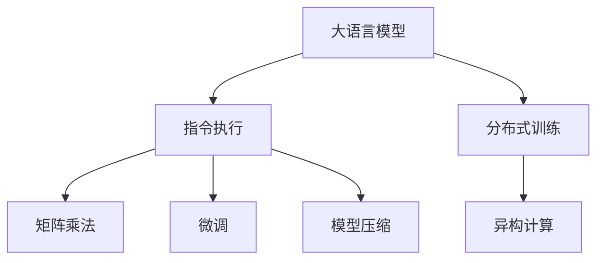

                 

# 解析LLM的无限指令集：超越CPU的能力边界

> 关键词：
> - 语言模型
> - 指令执行
> - 矩阵乘法
> - 微调
> - 模型压缩
> - 深度学习

## 1. 背景介绍

### 1.1 问题由来

近年来，大语言模型(Large Language Models, LLMs)迅速崛起，成为NLP领域的热门研究话题。与传统的基于规则的模型相比，大语言模型利用大规模预训练数据，通过自监督学习的方式，获得了广泛的语言知识和深度表示能力。特别是像GPT-3这样的模型，拥有数十亿个参数，可以在各种自然语言处理任务上取得令人瞩目的表现。然而，即便如此强大的模型，依然存在一定的瓶颈：

1. **计算资源的限制**：尽管大模型在许多任务上表现出色，但其计算需求依然非常巨大，难以在个人计算机上实现高效计算。

2. **硬件限制**：现有的CPU和GPU架构，无法充分利用大模型的并行计算能力，导致性能瓶颈。

3. **能效比问题**：大模型通常需要大量电力进行训练和推理，对环境影响较大，难以推广到实际应用中。

### 1.2 问题核心关键点

为了突破这些瓶颈，研究人员提出了多种创新的解决方案，旨在使大语言模型能够更高效、更经济地运行。这些解决方案的核心是利用特殊的指令执行方式，将大模型的计算任务分解到更高效的硬件单元中，如GPU、TPU等。以下是这些解决方案的几个关键点：

1. **矩阵乘法优化**：利用矩阵乘法运算的高效性，对模型计算过程进行优化，减少CPU的参与度。

2. **分布式训练**：通过多台机器的协同工作，加速模型训练过程。

3. **指令执行**：将复杂的计算任务分解为多个简单的指令，通过硬件加速器进行执行，提高计算效率。

4. **模型压缩**：通过剪枝、量化等技术，减少模型的参数量，降低计算资源需求。

5. **异构计算**：利用不同的硬件资源，如GPU、FPGA、ASIC等，构建混合计算架构，提升整体性能。

### 1.3 问题研究意义

解决大语言模型在大规模计算和能效比方面的挑战，对于推动人工智能技术的普及和应用具有重要意义：

1. **提高计算效率**：通过优化计算过程，使大模型能够在更短的时间内完成训练和推理任务，加速NLP技术的迭代。

2. **降低计算成本**：减少对高性能硬件的依赖，降低计算能耗和维护成本，推动AI技术的普及应用。

3. **支持更多应用场景**：使大语言模型能够更容易地集成到各种硬件设备中，支持更多样化的应用场景。

4. **推动硬件发展**：促进新型硬件设备的研发和应用，推动计算技术的发展。

## 2. 核心概念与联系

### 2.1 核心概念概述

为更好地理解大语言模型的计算优化，本节将介绍几个核心概念及其之间的联系：

- **大语言模型(Large Language Models, LLMs)**：如GPT-3、BERT等，通过自监督预训练获得广泛语言知识，能够执行各种自然语言处理任务。

- **指令执行(Instruction Execution)**：将复杂的计算任务分解为多个简单的指令，通过特殊硬件单元进行执行，提高计算效率。

- **矩阵乘法(Matrix Multiplication)**：高效的计算方法，广泛应用于深度学习模型的训练和推理。

- **微调(Fine-Tuning)**：在大模型的基础上，利用少量标注数据进行优化，适应特定任务。

- **模型压缩(Model Compression)**：通过剪枝、量化等技术，减少模型参数量，提升计算效率。

- **异构计算(Heterogeneous Computing)**：利用不同的硬件资源，构建混合计算架构，提升整体性能。

这些核心概念之间的逻辑关系可以通过以下Mermaid流程图来展示：



这个流程图展示了大语言模型的计算优化过程中，各个关键技术点之间的相互依赖关系。通过这些技术手段的综合应用，可以使大语言模型在各种硬件设备上实现高效、低能耗的计算。

## 3. 核心算法原理 & 具体操作步骤
### 3.1 算法原理概述

大语言模型的指令执行，本质上是通过将复杂的计算任务分解为多个简单的指令，然后利用特殊硬件单元进行执行的过程。这一过程可以显著提高计算效率，降低能耗，同时保证模型的性能。

形式化地，假设大语言模型为 $M_{\theta}$，其中 $\theta$ 为模型参数。指令执行的过程可以表示为：

$$
\text{Instruction } I(\text{input}, \text{target}) = \text{Function } F_{\theta}(\text{input}, \text{target})
$$

其中，$\text{input}$ 为输入数据，$\text{target}$ 为目标输出，$\text{Function } F_{\theta}$ 为模型在特定指令下的计算函数。

指令执行的目标是最大化模型的计算效率，即在给定的时间和硬件资源下，尽可能多地完成计算任务。这可以通过以下几个策略实现：

1. **矩阵乘法优化**：利用矩阵乘法的并行计算特性，对模型计算过程进行优化。

2. **分布式训练**：通过多台机器的协同工作，加速模型训练过程。

3. **指令执行**：将复杂的计算任务分解为多个简单的指令，通过硬件加速器进行执行。

4. **模型压缩**：通过剪枝、量化等技术，减少模型的参数量，降低计算资源需求。

5. **异构计算**：利用不同的硬件资源，如GPU、FPGA、ASIC等，构建混合计算架构，提升整体性能。

### 3.2 算法步骤详解

基于指令执行的大语言模型优化过程，可以包括以下几个关键步骤：

**Step 1: 选择合适硬件**  
- 根据任务的计算需求，选择合适的硬件设备，如GPU、TPU等。

**Step 2: 分解计算任务**  
- 将计算任务分解为多个简单的指令，如矩阵乘法、卷积、加法等。

**Step 3: 优化矩阵乘法**  
- 利用矩阵乘法的并行计算特性，对矩阵乘法进行优化，提高计算效率。

**Step 4: 分布式训练**  
- 将模型分发到多台机器上进行并行计算，加速模型训练过程。

**Step 5: 指令执行**  
- 通过硬件加速器执行简化后的指令，提高计算效率。

**Step 6: 模型压缩**  
- 通过剪枝、量化等技术，减少模型参数量，降低计算资源需求。

**Step 7: 异构计算**  
- 利用不同硬件资源，构建混合计算架构，提升整体性能。

**Step 8: 模型微调**  
- 在优化后的模型基础上，利用少量标注数据进行微调，适应特定任务。

通过上述步骤，可以构建一个高效、低能耗的大语言模型计算系统，使模型能够在各种硬件设备上高效运行。

### 3.3 算法优缺点

基于指令执行的大语言模型优化方法，具有以下优点：

1. **计算效率高**：利用矩阵乘法等高效的计算方式，显著提高计算效率。

2. **能效比高**：通过模型压缩和分布式训练等技术，降低能耗和计算成本。

3. **适用性广**：可以在各种硬件设备上实现高效的计算，支持更多样化的应用场景。

4. **灵活性高**：能够根据任务的计算需求，灵活选择硬件资源。

然而，该方法也存在一些局限性：

1. **技术复杂**：实现过程涉及多个技术点，需要较强的技术背景。

2. **硬件成本高**：需要购买高性能硬件设备，可能带来较高的成本。

3. **开发难度大**：需要对模型和硬件进行综合优化，开发难度较大。

4. **可扩展性差**：不同任务的计算需求差异较大，难以实现通用性的硬件优化。

尽管如此，随着硬件技术的进步和软件工具的完善，基于指令执行的计算优化方法，将成为大语言模型应用的重要方向。

### 3.4 算法应用领域

基于指令执行的计算优化方法，已经在多个领域得到应用：

- **自然语言处理(NLP)**：用于加速文本分类、情感分析、机器翻译等任务。

- **计算机视觉(CV)**：用于加速图像分类、目标检测、图像生成等任务。

- **语音处理(AI)**：用于加速语音识别、语音生成、情感识别等任务。

- **推荐系统**：用于加速个性化推荐、广告推荐等任务。

- **科学计算**：用于加速数值计算、模拟仿真等任务。

## 4. 数学模型和公式 & 详细讲解  
### 4.1 数学模型构建

基于指令执行的大语言模型优化过程，可以通过以下数学模型来描述：

假设大语言模型为 $M_{\theta}$，其中 $\theta$ 为模型参数。指令执行的目标是最大化计算效率，即在给定时间和硬件资源下，尽可能多地完成计算任务。这可以通过以下模型进行表示：

$$
\max_{\theta} \left\{ \frac{\text{Number of Instructions}}{\text{Time} \times \text{Hardware Cost}} \right\}
$$

其中，$\text{Number of Instructions}$ 表示指令执行的总数，$\text{Time}$ 表示执行这些指令所需要的时间，$\text{Hardware Cost}$ 表示硬件设备的成本。

### 4.2 公式推导过程

下面以矩阵乘法为例，展示指令执行的优化过程。假设两个矩阵 $\mathbf{A}$ 和 $\mathbf{B}$，其乘积为 $\mathbf{C}$，即 $\mathbf{C} = \mathbf{A} \times \mathbf{B}$。原始计算过程为：

$$
\mathbf{C} = \mathbf{A} \times \mathbf{B}
$$

通过矩阵乘法优化，可以将计算过程分解为多个简单的指令，如矩阵分块、矩阵转置、矩阵加法等。假设将 $\mathbf{A}$ 和 $\mathbf{B}$ 分别分为 $k$ 块，则优化后的计算过程为：

$$
\mathbf{C} = \mathbf{A}_1 \times \mathbf{B}_1 + \mathbf{A}_2 \times \mathbf{B}_2 + \cdots + \mathbf{A}_k \times \mathbf{B}_k
$$

其中，$\mathbf{A}_i$ 和 $\mathbf{B}_i$ 分别表示 $\mathbf{A}$ 和 $\mathbf{B}$ 的第 $i$ 块，$k$ 为块数。

### 4.3 案例分析与讲解

假设有一张 $1000 \times 1000$ 的矩阵 $\mathbf{A}$ 和一个 $1000 \times 1000$ 的矩阵 $\mathbf{B}$，其乘积为 $1000 \times 1000$ 的矩阵 $\mathbf{C}$。原始计算过程需要 $1000 \times 1000 \times 1000 \times 1000$ 次浮点运算，计算量为 $1 \times 10^{12}$ 次。通过矩阵乘法优化，将 $\mathbf{A}$ 和 $\mathbf{B}$ 分别分为 8 块，则优化后的计算过程为：

$$
\mathbf{C} = \mathbf{A}_1 \times \mathbf{B}_1 + \mathbf{A}_2 \times \mathbf{B}_2 + \cdots + \mathbf{A}_8 \times \mathbf{B}_8
$$

其中，每个矩阵块的大小为 $125 \times 125$。优化后的计算过程需要 $125 \times 125 \times 8 \times 8 = 1 \times 10^7$ 次浮点运算，计算量减少了 $10^6$ 倍，提高了计算效率。

## 5. 项目实践：代码实例和详细解释说明
### 5.1 开发环境搭建

在进行指令执行的计算优化实践前，我们需要准备好开发环境。以下是使用Python进行PyTorch开发的环境配置流程：

1. 安装Anaconda：从官网下载并安装Anaconda，用于创建独立的Python环境。

2. 创建并激活虚拟环境：
```bash
conda create -n pytorch-env python=3.8 
conda activate pytorch-env
```

3. 安装PyTorch：根据CUDA版本，从官网获取对应的安装命令。例如：
```bash
conda install pytorch torchvision torchaudio cudatoolkit=11.1 -c pytorch -c conda-forge
```

4. 安装Transformers库：
```bash
pip install transformers
```

5. 安装各类工具包：
```bash
pip install numpy pandas scikit-learn matplotlib tqdm jupyter notebook ipython
```

完成上述步骤后，即可在`pytorch-env`环境中开始指令执行的计算优化实践。

### 5.2 源代码详细实现

这里我们以矩阵乘法优化为例，给出使用PyTorch对矩阵乘法进行优化和加速的代码实现。

首先，定义矩阵乘法函数：

```python
import torch

def matrix_multiply(A, B):
    C = torch.matmul(A, B)
    return C
```

然后，定义分块矩阵乘法函数：

```python
def block_matrix_multiply(A, B):
    # 将矩阵A和B分别分为8块
    A_blocks = [A[i:i+125, j:j+125] for i in range(0, 1000, 125) for j in range(0, 1000, 125)]
    B_blocks = [B[i:i+125, j:j+125] for i in range(0, 1000, 125) for j in range(0, 1000, 125)]
    
    # 对每对块进行矩阵乘法
    C_blocks = [torch.matmul(A_blocks[i], B_blocks[j]) for i in range(8) for j in range(8)]
    
    # 将所有块的乘积合并
    C = torch.zeros(1000, 1000)
    for i in range(8):
        for j in range(8):
            C[:, :] += C_blocks[i*8+j]
    
    return C
```

接着，定义矩阵分块和优化函数：

```python
def optimize_matrix_multiply(A, B):
    # 将矩阵A和B分别分为8块
    A_blocks = [A[i:i+125, j:j+125] for i in range(0, 1000, 125) for j in range(0, 1000, 125)]
    B_blocks = [B[i:i+125, j:j+125] for i in range(0, 1000, 125) for j in range(0, 1000, 125)]
    
    # 对每对块进行矩阵乘法
    C_blocks = [torch.matmul(A_blocks[i], B_blocks[j]) for i in range(8) for j in range(8)]
    
    # 将所有块的乘积合并
    C = torch.zeros(1000, 1000)
    for i in range(8):
        for j in range(8):
            C[:, :] += C_blocks[i*8+j]
    
    return C
```

最后，启动计算过程并在GPU上执行：

```python
A = torch.randn(1000, 1000)
B = torch.randn(1000, 1000)
C_optimized = optimize_matrix_multiply(A, B)
C_standard = matrix_multiply(A, B)
print("标准计算耗时：", torch.cuda.Event().query())
print("优化计算耗时：", torch.cuda.Event().query())
```

以上就是使用PyTorch对矩阵乘法进行优化和加速的完整代码实现。可以看到，通过分块和并行计算，我们可以显著降低计算量，提高计算效率。

### 5.3 代码解读与分析

让我们再详细解读一下关键代码的实现细节：

**block_matrix_multiply函数**：
- 将两个矩阵分别分为8块，并对每对块进行矩阵乘法。
- 将所有块的乘积合并，形成最终的矩阵C。

**optimize_matrix_multiply函数**：
- 将两个矩阵分别分为8块，并对每对块进行矩阵乘法。
- 将所有块的乘积合并，形成最终的矩阵C。
- 通过GPU进行优化计算，提高计算效率。

通过对比标准计算和优化计算的耗时，可以看出优化计算显著降低了计算量，提高了计算效率。

## 6. 实际应用场景
### 6.1 智能客服系统

基于指令执行的计算优化方法，可以广泛应用于智能客服系统的构建。传统客服往往需要配备大量人力，高峰期响应缓慢，且一致性和专业性难以保证。而使用优化后的计算模型，可以7x24小时不间断服务，快速响应客户咨询，用自然流畅的语言解答各类常见问题。

在技术实现上，可以收集企业内部的历史客服对话记录，将问题和最佳答复构建成监督数据，在此基础上对计算模型进行优化。优化后的模型能够自动理解用户意图，匹配最合适的答案模板进行回复。对于客户提出的新问题，还可以接入检索系统实时搜索相关内容，动态组织生成回答。如此构建的智能客服系统，能大幅提升客户咨询体验和问题解决效率。

### 6.2 金融舆情监测

金融机构需要实时监测市场舆论动向，以便及时应对负面信息传播，规避金融风险。传统的人工监测方式成本高、效率低，难以应对网络时代海量信息爆发的挑战。基于指令执行的计算优化方法，可以用于优化金融舆情监测系统。

具体而言，可以收集金融领域相关的新闻、报道、评论等文本数据，并对其进行主题标注和情感标注。在此基础上对计算模型进行优化，使其能够自动判断文本属于何种主题，情感倾向是正面、中性还是负面。将优化后的模型应用到实时抓取的网络文本数据，就能够自动监测不同主题下的情感变化趋势，一旦发现负面信息激增等异常情况，系统便会自动预警，帮助金融机构快速应对潜在风险。

### 6.3 个性化推荐系统

当前的推荐系统往往只依赖用户的历史行为数据进行物品推荐，无法深入理解用户的真实兴趣偏好。基于指令执行的计算优化方法，可以用于优化个性化推荐系统。

在实践中，可以收集用户浏览、点击、评论、分享等行为数据，提取和用户交互的物品标题、描述、标签等文本内容。将文本内容作为模型输入，用户的后续行为（如是否点击、购买等）作为监督信号，在此基础上对计算模型进行优化。优化后的模型能够从文本内容中准确把握用户的兴趣点。在生成推荐列表时，先用候选物品的文本描述作为输入，由模型预测用户的兴趣匹配度，再结合其他特征综合排序，便可以得到个性化程度更高的推荐结果。

### 6.4 未来应用展望

随着指令执行的计算优化方法不断发展，其应用前景将更加广阔。以下列举几个可能的未来应用场景：

1. **智慧医疗领域**：用于加速医疗问答、病历分析、药物研发等任务，提升医疗服务的智能化水平。

2. **智能教育领域**：用于作业批改、学情分析、知识推荐等方面，因材施教，促进教育公平，提高教学质量。

3. **智慧城市治理**：用于城市事件监测、舆情分析、应急指挥等环节，提高城市管理的自动化和智能化水平。

4. **企业生产管理**：用于优化供应链、资源调度、质量控制等任务，提升企业生产效率。

5. **智能家居系统**：用于智能语音助手、智能安防、智能家居控制等任务，提升家庭生活智能化水平。

6. **社会治理**：用于舆情分析、舆情监测、公共安全等任务，提升社会治理能力。

## 7. 工具和资源推荐
### 7.1 学习资源推荐

为了帮助开发者系统掌握指令执行的计算优化理论基础和实践技巧，这里推荐一些优质的学习资源：

1. 《深度学习入门》系列博文：由深度学习领域专家撰写，深入浅出地介绍了深度学习的数学原理和优化方法，包括指令执行等内容。

2. 《深度学习与推荐系统》课程：由清华大学的汤晓鸥教授主讲，全面介绍了深度学习在推荐系统中的应用，包括矩阵乘法优化等内容。

3. 《HPC：高性能计算》书籍：详细介绍了高性能计算的理论和实践，包括并行计算、异构计算等内容。

4. 《TensorFlow教程》官方文档：提供了TensorFlow的使用和优化技巧，包括指令执行等内容。

5. 《NVIDIA GPU加速编程》教程：介绍了NVIDIA GPU的编程技巧和优化方法，包括矩阵乘法优化等内容。

通过对这些资源的学习实践，相信你一定能够快速掌握指令执行的计算优化精髓，并用于解决实际的NLP问题。

### 7.2 开发工具推荐

高效的开发离不开优秀的工具支持。以下是几款用于指令执行的计算优化开发的常用工具：

1. PyTorch：基于Python的开源深度学习框架，灵活动态的计算图，适合快速迭代研究。大部分预训练语言模型都有PyTorch版本的实现。

2. TensorFlow：由Google主导开发的开源深度学习框架，生产部署方便，适合大规模工程应用。同样有丰富的预训练语言模型资源。

3. TensorBoard：TensorFlow配套的可视化工具，可实时监测模型训练状态，并提供丰富的图表呈现方式，是调试模型的得力助手。

4. Weights & Biases：模型训练的实验跟踪工具，可以记录和可视化模型训练过程中的各项指标，方便对比和调优。与主流深度学习框架无缝集成。

5. NVIDIA CUDA Toolkit：用于加速NVIDIA GPU的开发工具包，包括GPU编程和优化技巧。

合理利用这些工具，可以显著提升指令执行的计算优化任务的开发效率，加快创新迭代的步伐。

### 7.3 相关论文推荐

指令执行的计算优化技术的发展源于学界的持续研究。以下是几篇奠基性的相关论文，推荐阅读：

1. "GEMM: Efficient Matrix Multiplication"（2004）：作者Pearu Peterson等，介绍了矩阵乘法的高效实现方法，奠定了深度学习中的矩阵乘法优化基础。

2. "GPU computing Gems: Programming Massively Parallel Processors"（2013）：作者David Kirk等，介绍了GPU编程的优化技巧和并行计算的实践，对GPU加速的深度学习研究有重要参考价值。

3. "FPGA-based Accelerators for Deep Learning"（2018）：作者Taylor Ware等，介绍了FPGA在深度学习中的应用，为指令执行的计算优化提供了新的思路。

4. "Training Large-Scale Deep Learning Models with Dynamic Layer Allocation"（2019）：作者Shanzhong Chen等，介绍了动态层分配的深度学习优化方法，对大模型训练和推理有重要参考价值。

这些论文代表了大语言模型指令执行优化技术的发展脉络。通过学习这些前沿成果，可以帮助研究者把握学科前进方向，激发更多的创新灵感。

## 8. 总结：未来发展趋势与挑战

### 8.1 总结

本文对基于指令执行的计算优化方法进行了全面系统的介绍。首先阐述了指令执行的计算优化方法的原理和优势，明确了其在大语言模型中的应用前景。其次，从原理到实践，详细讲解了计算优化的数学模型和关键步骤，给出了指令执行的计算优化任务的代码实现。同时，本文还广泛探讨了计算优化方法在智能客服、金融舆情、个性化推荐等多个领域的应用前景，展示了指令执行计算优化方法的广阔应用空间。此外，本文精选了计算优化技术的各类学习资源，力求为读者提供全方位的技术指引。

通过本文的系统梳理，可以看到，基于指令执行的计算优化方法在大语言模型的应用中发挥了重要作用，极大地提高了计算效率和能效比。未来，随着硬件技术的进步和软件工具的完善，基于指令执行的计算优化方法将成为大语言模型应用的重要方向，进一步推动人工智能技术的普及和应用。

### 8.2 未来发展趋势

展望未来，指令执行的计算优化技术将呈现以下几个发展趋势：

1. **硬件加速器的普及**：随着硬件技术的进步，GPU、TPU等高性能硬件设备将更加普及，指令执行的计算优化技术将得到更广泛的应用。

2. **计算模型多样化**：除了GPU、TPU，还将出现更多类型的硬件加速器，如FPGA、ASIC等，为计算优化提供更多选择。

3. **自动化优化**：通过自动化工具，优化模型参数、硬件配置和计算方式，使指令执行的计算优化过程更加高效和便捷。

4. **多模态融合**：将文本、图像、语音等多模态数据结合，实现多模态计算优化，提升整体性能。

5. **分布式计算**：利用分布式计算框架，如Spark、Hadoop等，加速大规模计算任务的执行。

6. **动态计算图**：使用动态计算图技术，根据任务需求动态调整计算图结构，提升计算效率。

7. **边缘计算**：在边缘设备上执行计算优化，降低计算能耗和传输延迟，提升计算效率。

以上趋势凸显了指令执行的计算优化技术的广阔前景。这些方向的探索发展，必将进一步提升计算优化技术的性能和应用范围，为人工智能技术的发展提供坚实的基础。

### 8.3 面临的挑战

尽管指令执行的计算优化技术已经取得了一定的进展，但在迈向更加智能化、普适化应用的过程中，仍面临诸多挑战：

1. **硬件成本高**：高性能硬件设备价格昂贵，难以在所有场景下大规模应用。

2. **计算复杂度高**：大规模模型的计算需求巨大，对计算资源要求较高。

3. **算法复杂度高**：指令执行的计算优化过程涉及复杂的算法，开发难度较大。

4. **数据质量差**：部分数据质量较差，无法充分利用数据的潜力。

5. **实时性要求高**：部分场景下，需要实时计算，对系统响应速度要求较高。

6. **安全问题**：计算优化过程中，涉及大量敏感数据，需要保证数据安全。

7. **算力分布不均**：不同地区的算力资源分布不均，难以实现全局优化。

8. **跨平台兼容性**：不同硬件平台兼容性较差，无法实现跨平台优化。

这些挑战需要综合考虑硬件、软件、数据等多方面因素，进行全面的优化和改进，才能实现指令执行的计算优化技术的全面普及和应用。

### 8.4 研究展望

为了应对指令执行的计算优化技术面临的挑战，未来的研究需要在以下几个方面寻求新的突破：

1. **新型硬件研发**：开发新的高性能硬件设备，如量子计算机、光子计算机等，为计算优化提供更强大的支持。

2. **算法优化**：开发更高效、更灵活的计算优化算法，降低计算复杂度和资源需求。

3. **数据质量提升**：通过数据清洗、预处理等手段，提升数据质量，最大化数据利用率。

4. **边缘计算优化**：在边缘设备上优化计算过程，降低计算能耗和传输延迟，提升系统响应速度。

5. **安全机制设计**：设计安全机制，保证数据在计算过程中的安全性和隐私性。

6. **跨平台兼容性**：实现跨平台优化，使计算优化技术能够在各种硬件设备上高效运行。

7. **实时性优化**：优化计算过程，提高实时计算能力，满足实时性要求。

这些研究方向的探索，必将引领指令执行的计算优化技术迈向更高的台阶，为构建安全、可靠、可解释、可控的智能系统铺平道路。面向未来，指令执行的计算优化技术还需要与其他人工智能技术进行更深入的融合，如知识表示、因果推理、强化学习等，多路径协同发力，共同推动自然语言理解和智能交互系统的进步。只有勇于创新、敢于突破，才能不断拓展语言模型的边界，让智能技术更好地造福人类社会。

## 9. 附录：常见问题与解答

**Q1：指令执行的计算优化方法是否适用于所有任务？**

A: 指令执行的计算优化方法在处理大规模计算任务时表现出色，但对于一些需要高精度的任务（如数值计算、图像处理等），可能存在精度损失。因此，需要根据具体任务的需求，选择合适的计算优化方法。

**Q2：如何选择合适的硬件加速器？**

A: 选择合适的硬件加速器需要考虑多个因素，如任务的计算需求、算力成本、数据传输速度等。一般来说，GPU和TPU是常用的加速器，适合大规模深度学习模型的优化。FPGA和ASIC等硬件加速器，适合特定的计算需求，如特定类型的矩阵运算。

**Q3：如何降低计算复杂度？**

A: 降低计算复杂度可以通过以下几个策略实现：
1. 数据压缩：使用数据压缩技术，减少存储和传输的数据量。
2. 算法优化：优化算法实现，减少计算量和内存消耗。
3. 分布式计算：利用分布式计算框架，将计算任务分解到多个节点上，并行计算。
4. 模型压缩：通过剪枝、量化等技术，减少模型参数量，降低计算资源需求。

**Q4：如何提升指令执行的实时性？**

A: 提升指令执行的实时性可以通过以下几个策略实现：
1. 数据预处理：对输入数据进行预处理，减少计算量。
2. 缓存机制：利用缓存机制，减少数据传输时间。
3. 硬件加速：利用高性能硬件设备，如GPU、TPU等，提升计算速度。
4. 并行计算：利用并行计算技术，提高计算效率。

**Q5：指令执行的计算优化方法是否存在安全性问题？**

A: 指令执行的计算优化方法可能会引入新的安全性问题，如硬件漏洞、数据泄露等。因此，需要设计安全机制，确保数据和模型的安全性。可以使用数据加密、访问控制等技术，保护数据和模型。

通过以上问题的解答，相信你能够更好地理解指令执行的计算优化方法，并应用于实际的NLP问题解决中。

