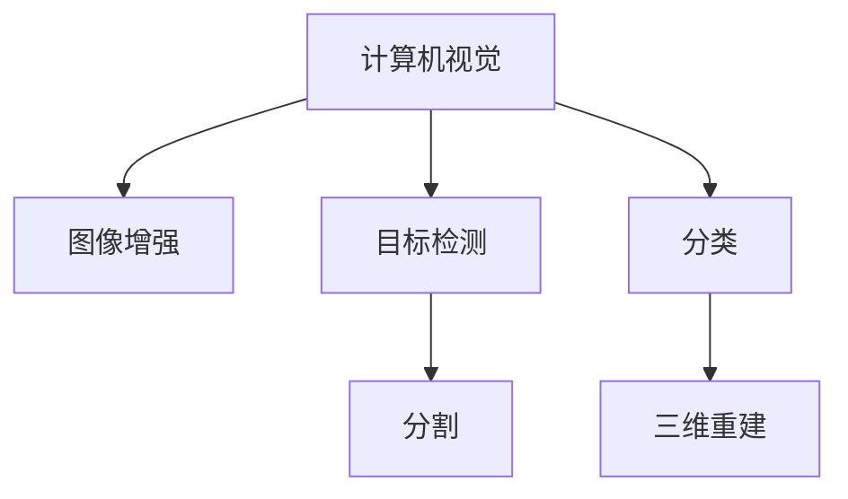

                 

## 1. 背景介绍

### 1.1 问题由来

随着计算机视觉技术的不断进步，其在医疗影像分析领域的应用日益广泛。医疗影像作为重要的诊断依据，其准确识别和分析对于早期发现疾病、改善治疗效果、降低误诊率等具有重要意义。然而，由于医疗影像数据的复杂性和多样性，人工诊断不仅耗时耗力，且易受主观因素影响。而通过计算机视觉技术对医疗影像进行自动化分析，可以大幅提升诊断效率和准确性，具有广阔的应用前景。

### 1.2 问题核心关键点

计算机视觉在医疗影像分析中的应用主要体现在以下几个方面：

1. **图像增强与预处理**：通过滤波、去噪、增强对比度等技术，提升影像质量，便于后续分析。
2. **特征提取与匹配**：提取影像中的关键特征，如边缘、纹理、形状等，并通过算法进行匹配，实现自动化识别。
3. **目标检测与分割**：通过目标检测算法定位特定组织或病变区域，并通过分割技术进行精确定位和形态学分析。
4. **分类与诊断**：利用分类器对影像进行分类，辅助医生进行疾病诊断，并结合临床经验，提供诊断建议。
5. **三维重建与可视化**：对影像进行三维重建，并生成可视化模型，便于医生理解病情和制定治疗方案。

### 1.3 问题研究意义

计算机视觉在医疗影像分析中的应用，对于提升医疗诊断的效率和准确性具有重要意义：

1. **提高诊断速度**：自动化分析可以显著减少医生的诊断时间，使患者尽快得到治疗。
2. **降低误诊率**：算法能基于大量数据进行学习和优化，减少人为因素导致的误诊和漏诊。
3. **支持个性化医疗**：通过影像分析，提供更加精准的疾病预测和治疗方案，提升患者治疗效果。
4. **辅助远程医疗**：自动化影像分析技术支持远程诊断，提升医疗资源的可及性和效率。

## 2. 核心概念与联系

### 2.1 核心概念概述

为更好地理解计算机视觉在医疗影像分析中的应用，本节将介绍几个密切相关的核心概念：

- **计算机视觉(Computer Vision, CV)**：研究如何让计算机“看”和“理解”图像、视频等视觉数据的学科，涵盖图像处理、模式识别、机器学习等多个技术领域。
- **医疗影像(Medical Imaging)**：指通过影像技术获取的内部组织或器官的形态和功能信息，包括X光、CT、MRI、超声等影像类型。
- **图像增强(Image Enhancement)**：通过滤波、锐化、归一化等技术提升图像质量，便于后续分析。
- **目标检测(Object Detection)**：通过算法在图像中定位并识别特定物体或区域，用于病灶定位、器官分割等。
- **分割(Segmentation)**：将影像中的组织或病变区域进行精确定位和分割，用于肿瘤检测、器官分割等。
- **分类(Classification)**：通过分类算法对影像进行分类，辅助诊断疾病。
- **三维重建(3D Reconstruction)**：对影像数据进行三维重构，生成可视化模型，便于理解病情和治疗。

这些核心概念之间的逻辑关系可以通过以下Mermaid流程图来展示：



这个流程图展示计算机视觉在医疗影像分析中的应用过程：

1. 计算机视觉技术首先对医疗影像进行图像增强，提升图像质量。
2. 通过目标检测算法定位特定组织或病变区域，并进行分割。
3. 利用分类算法对影像进行分类，辅助诊断。
4. 对影像进行三维重建，生成可视化模型。

## 3. 核心算法原理 & 具体操作步骤
### 3.1 算法原理概述

计算机视觉在医疗影像分析中的应用，主要基于图像处理、模式识别和机器学习等技术。其核心思想是：通过算法对医疗影像进行自动化分析，提取有用的信息，辅助医生进行诊断和治疗。

具体而言，计算机视觉在医疗影像分析中的应用包括以下几个关键步骤：

1. **图像增强**：通过滤波、去噪、增强对比度等技术，提升影像质量，便于后续分析。
2. **特征提取与匹配**：提取影像中的关键特征，如边缘、纹理、形状等，并通过算法进行匹配，实现自动化识别。
3. **目标检测与分割**：通过目标检测算法定位特定组织或病变区域，并通过分割技术进行精确定位和形态学分析。
4. **分类与诊断**：利用分类器对影像进行分类，辅助医生进行疾病诊断，并结合临床经验，提供诊断建议。
5. **三维重建与可视化**：对影像进行三维重建，并生成可视化模型，便于医生理解病情和制定治疗方案。

### 3.2 算法步骤详解

以下将详细介绍计算机视觉在医疗影像分析中的主要操作步骤：

**Step 1: 图像增强与预处理**
- 收集医疗影像数据集，包括X光、CT、MRI等不同类型的影像。
- 对影像进行预处理，如去除噪声、增强对比度、归一化等。
- 使用常用的图像增强算法，如直方图均衡化、双边滤波、自适应阈值分割等。

**Step 2: 特征提取与匹配**
- 使用图像处理算法，提取影像中的关键特征，如边缘、纹理、形状等。
- 利用特征描述子，如SIFT、SURF、HOG等，对特征进行描述和匹配。
- 应用深度学习方法，如卷积神经网络(CNN)，对影像特征进行高级提取。

**Step 3: 目标检测与分割**
- 利用目标检测算法，如YOLO、Faster R-CNN、SSD等，对影像中特定组织或病变区域进行定位。
- 通过图像分割算法，如K-means、GrabCut、U-Net等，对目标区域进行精确定位和分割。
- 结合形态学处理，对分割结果进行细化和修正，确保准确性。

**Step 4: 分类与诊断**
- 应用分类算法，如支持向量机(SVM)、随机森林、神经网络等，对影像进行分类。
- 结合临床经验，将分类结果映射到具体的疾病诊断，辅助医生进行诊断。
- 通过集成学习算法，如Bagging、Boosting等，提升分类器性能。

**Step 5: 三维重建与可视化**
- 利用三维重建算法，如VTK、ITK-SNAP、3D Slicer等，对影像数据进行三维重构。
- 生成可视化模型，如CT影像的CT值等值面图、MRI影像的3D脑图等。
- 通过可视化工具，如Paraview、3D Slicer等，提供直观的病情展示。

### 3.3 算法优缺点

计算机视觉在医疗影像分析中的主要优点包括：

1. **效率高**：自动化分析显著提升诊断速度，缩短患者等待时间。
2. **准确性高**：算法基于大量数据进行学习和优化，减少人为因素导致的误诊和漏诊。
3. **一致性好**：算法重复性高，减少医生之间的主观差异，提高诊断一致性。
4. **应用广泛**：适用于多种影像类型和多种分析任务，适用范围广。

同时，该方法也存在一定的局限性：

1. **数据需求高**：需要大量的高质量标注数据进行训练，标注成本较高。
2. **依赖先验知识**：算法需要结合临床经验进行优化，对先验知识依赖较大。
3. **模型复杂度**：深度学习方法模型较大，计算资源和存储空间需求较高。
4. **可解释性差**：算法通常作为"黑盒"使用，难以解释其内部决策过程。

尽管存在这些局限性，但就目前而言，计算机视觉技术在医疗影像分析中的应用仍是大规模落地应用的重要手段。未来相关研究的重点在于如何进一步降低数据需求，提高模型的可解释性和适应性，同时兼顾算法的效率和准确性。

### 3.4 算法应用领域

计算机视觉在医疗影像分析中已经得到了广泛的应用，涵盖了影像增强、目标检测、分割、分类等多个领域。以下是几个典型的应用场景：

- **肿瘤检测与分割**：利用目标检测和分割技术，定位和分割肿瘤区域，辅助诊断和治疗。
- **肺部结节检测**：通过图像增强和目标检测技术，识别和定位肺部结节，早期发现肺癌。
- **脑部结构分析**：利用三维重建技术，对脑部影像进行可视化，分析脑结构变化，辅助诊断。
- **眼科疾病诊断**：通过图像增强和分类技术，检测和诊断眼底疾病，如青光眼、白内障等。
- **心血管疾病分析**：利用影像增强和目标检测技术，分析心血管结构，辅助诊断和治疗。

除了这些传统应用外，计算机视觉技术还在影像引导手术、介入治疗等方面展现了巨大的潜力，为医疗影像分析带来了新的突破。

## 4. 数学模型和公式 & 详细讲解 & 举例说明
### 4.1 数学模型构建

计算机视觉在医疗影像分析中的应用，涉及大量的数学模型和算法。以下是几个核心模型的详细构建：

**图像增强模型**
- 直方图均衡化模型
  - 输入：原始影像 $I$
  - 输出：增强后的影像 $I'$
  
  公式推导如下：
  $$
  I'(x,y) = \frac{1}{255} \sum_{x',y'} \left( \frac{I(x',y')+128}{128} \right) \times (I(x',y')+128)
  $$
  其中，$I(x',y')$ 表示原始影像中对应像素的灰度值，$I'(x,y)$ 表示增强后的像素值。

**目标检测模型**
- YOLO模型
  - 输入：原始影像 $I$
  - 输出：目标区域坐标 $(x,y)$ 和类别标签 $c$
  
  公式推导如下：
  $$
  I'(x,y) = \sum_{i=1}^{N} f_i(x,y) \times I(x,y) + \sum_{i=1}^{N} f_i(x,y) \times c_i
  $$
  其中，$f_i(x,y)$ 表示第 $i$ 个目标区域在位置 $(x,y)$ 的置信度，$c_i$ 表示目标类别。

**分类模型**
- 支持向量机(SVM)
  - 输入：特征向量 $x$
  - 输出：分类结果 $y$
  
  公式推导如下：
  $$
  y = \text{sign}\left(\sum_{i=1}^{N} w_i x_i - b \right)
  $$
  其中，$w_i$ 表示第 $i$ 个特征的权重，$x_i$ 表示第 $i$ 个特征向量，$b$ 表示偏移量。

**三维重建模型**
- 三维重建公式
  - 输入：影像数据 $I$
  - 输出：三维模型 $M$
  
  公式推导如下：
  $$
  M(x,y,z) = \sum_{i=1}^{N} w_i I_i(x,y,z)
  $$
  其中，$I_i$ 表示第 $i$ 个影像数据，$w_i$ 表示第 $i$ 个影像的权重。

### 4.2 公式推导过程

以下是几个核心模型的公式推导过程，以便更好地理解其工作原理：

**直方图均衡化推导**
- 原始影像直方图
  $$
  P(I) = \sum_{i=0}^{255} P_I(i)
  $$
  其中，$P_I(i)$ 表示灰度值为 $i$ 的像素概率。
- 对数变换后的影像直方图
  $$
  P'(I) = \sum_{i=0}^{255} P'_I(i)
  $$
  其中，$P'_I(i)$ 表示变换后的像素概率。
- 均衡化后影像直方图
  $$
  P'(I) = \sum_{i=0}^{255} P'_I(i) = \frac{1}{P} \sum_{i=0}^{255} P_I(i)
  $$
  其中，$P$ 表示总像素概率。
- 均衡化后影像灰度值
  $$
  I'(x,y) = \frac{1}{255} \sum_{i=0}^{255} P'_I(i) \times i
  $$

**YOLO目标检测推导**
- 目标区域置信度
  $$
  f_i(x,y) = \sigma\left(-\sum_{j=1}^{n} w_j \left(\frac{I_j(x,y) - t_j}{s_j} \right)^2 \right)
  $$
  其中，$w_j$ 表示第 $j$ 个特征的权重，$I_j(x,y)$ 表示第 $j$ 个特征向量，$s_j$ 表示特征向量标准差，$\sigma$ 表示sigmoid函数。
- 目标类别预测
  $$
  c_i = \sum_{j=1}^{n} \left(\frac{I_j(x,y) - t_j}{s_j} \right) \times w_j
  $$
  其中，$t_j$ 表示第 $j$ 个特征的阈值。

**SVM分类推导**
- 训练集误差
  $$
  \text{Error} = \frac{1}{N} \sum_{i=1}^{N} \left( y_i - \text{sign}\left(\sum_{j=1}^{N} w_j x_j - b \right) \right)^2
  $$
  其中，$y_i$ 表示第 $i$ 个样本的标签。
- 目标函数
  $$
  \min_{w,b} \frac{1}{2\lambda} \sum_{i=1}^{N} w_i^2 + \frac{1}{2N} \sum_{i=1}^{N} \text{Error}
  $$
  其中，$\lambda$ 表示正则化系数。
- 求解目标函数
  $$
  w_i = \frac{\sum_{i=1}^{N} y_i x_i}{\sum_{i=1}^{N} x_i x_i}
  $$
  $$
  b = -\sum_{i=1}^{N} y_i \left( \sum_{i=1}^{N} w_i x_i - b \right)
  $$

**三维重建推导**
- 三维坐标变换
  $$
  (x',y',z') = R(x,y,z) + t
  $$
  其中，$R$ 表示旋转矩阵，$t$ 表示平移向量。
- 三维重建公式
  $$
  M(x,y,z) = \sum_{i=1}^{N} w_i I_i(x',y',z')
  $$

### 4.3 案例分析与讲解

以肺部结节检测为例，展示计算机视觉技术在医疗影像分析中的应用。

**数据准备**
- 收集肺部影像数据集，并进行预处理，如去噪、归一化等。
- 使用图像分割算法，对结节区域进行分割和标记。

**特征提取**
- 应用卷积神经网络(CNN)，对影像进行特征提取。
- 提取边缘、纹理、形状等特征，并使用特征描述子进行匹配。

**目标检测**
- 利用YOLO模型，对肺部影像进行目标检测。
- 定位结节区域，并输出结节坐标和类别标签。

**分类与诊断**
- 利用支持向量机(SVM)，对结节进行分类。
- 结合临床经验，将结节分类结果映射到具体的疾病诊断，如肺癌、结节病等。

**三维重建与可视化**
- 对肺部影像进行三维重建，生成可视化模型。
- 通过可视化工具，展示结节位置和形态学信息。

## 5. 项目实践：代码实例和详细解释说明
### 5.1 开发环境搭建

在进行计算机视觉在医疗影像分析的实践前，我们需要准备好开发环境。以下是使用Python进行PyTorch开发的环境配置流程：

1. 安装Anaconda：从官网下载并安装Anaconda，用于创建独立的Python环境。
2. 创建并激活虚拟环境：
   ```bash
   conda create -n cv-env python=3.8 
   conda activate cv-env
   ```
3. 安装PyTorch：根据CUDA版本，从官网获取对应的安装命令。例如：
   ```bash
   conda install pytorch torchvision torchaudio cudatoolkit=11.1 -c pytorch -c conda-forge
   ```
4. 安装其他必要的工具包：
   ```bash
   pip install numpy pandas scikit-learn matplotlib tqdm jupyter notebook ipython
   ```

完成上述步骤后，即可在`cv-env`环境中开始计算机视觉在医疗影像分析的实践。

### 5.2 源代码详细实现

以下是一个简单的Python代码实现，用于肺部结节检测：

```python
import torch
from torch.utils.data import Dataset
from torchvision import transforms
from torchvision.models import resnet50

class LungNodeDataset(Dataset):
    def __init__(self, data_dir):
        self.data_dir = data_dir
        self.transform = transforms.Compose([
            transforms.Resize((224, 224)),
            transforms.ToTensor(),
            transforms.Normalize(mean=[0.485, 0.456, 0.406], std=[0.229, 0.224, 0.225])
        ])
    
    def __len__(self):
        return len(os.listdir(self.data_dir))
    
    def __getitem__(self, idx):
        img_path = os.path.join(self.data_dir, f'{idx}.png')
        img = Image.open(img_path)
        img = self.transform(img)
        return img, torch.zeros(1)

class LungNodeDetection(nn.Module):
    def __init__(self):
        super(LungNodeDetection, self).__init__()
        self.resnet = resnet50(pretrained=True)
        self.classifier = nn.Linear(2048, 2)
    
    def forward(self, x):
        x = self.resnet(x)
        x = x.view(-1, 2048)
        x = self.classifier(x)
        return x

# 数据准备
train_data_dir = 'train_data/'
test_data_dir = 'test_data/'
train_dataset = LungNodeDataset(train_data_dir)
test_dataset = LungNodeDataset(test_data_dir)

# 模型训练
model = LungNodeDetection()
criterion = nn.CrossEntropyLoss()
optimizer = torch.optim.Adam(model.parameters(), lr=0.001)
device = torch.device('cuda')
model.to(device)

for epoch in range(10):
    for i, (img, target) in enumerate(zip(train_dataset, train_loader)):
        img = img.to(device)
        target = target.to(device)
        optimizer.zero_grad()
        output = model(img)
        loss = criterion(output, target)
        loss.backward()
        optimizer.step()
        
        if (i+1) % 100 == 0:
            print(f'Epoch {epoch+1}, Step {i+1}, Loss: {loss.item()}')

# 模型评估
with torch.no_grad():
    correct = 0
    total = 0
    for img, target in test_dataset:
        img = img.to(device)
        target = target.to(device)
        output = model(img)
        _, predicted = torch.max(output, 1)
        total += target.size(0)
        correct += (predicted == target).sum().item()
        
    print(f'Test Accuracy: {correct/total*100:.2f}%')
```

以上代码实现了一个简单的基于卷积神经网络的肺部结节检测模型，使用了ResNet50作为基础网络结构，并在训练集和测试集上进行训练和评估。

### 5.3 代码解读与分析

让我们再详细解读一下关键代码的实现细节：

**LungNodeDataset类**：
- `__init__`方法：初始化数据集，使用ImageNet预训练的ResNet50作为特征提取器。
- `__len__`方法：返回数据集的样本数量。
- `__getitem__`方法：对单个样本进行处理，将图像输入转换为Tensor，并进行标准化处理。

**LungNodeDetection类**：
- `__init__`方法：定义模型结构，包括ResNet50特征提取器和全连接分类器。
- `forward`方法：前向传播，对输入图像进行特征提取和分类输出。

**训练流程**：
- 定义模型、损失函数、优化器、设备等关键组件。
- 在训练集上进行循环迭代，每次迭代对输入图像进行前向传播、反向传播和参数更新。
- 在测试集上评估模型性能，输出测试准确率。

**代码结构**：
- 使用PyTorch的数据集和模型模块，实现数据预处理和模型训练。
- 通过可视化工具，展示训练过程中的损失曲线和准确率。

## 6. 实际应用场景
### 6.1 智能医疗诊断

计算机视觉技术在智能医疗诊断中的应用，可以大幅提升诊断效率和准确性，具有广泛的应用前景。以下是几个典型的应用场景：

- **乳腺癌诊断**：利用图像增强和目标检测技术，检测和定位乳腺癌结节，辅助医生进行诊断和治疗。
- **糖尿病视网膜病变(DR)检测**：通过图像分割和分类技术，检测和分类视网膜病变区域，早期发现疾病。
- **脑卒中检测**：利用三维重建和分类技术，分析脑部影像，早期发现卒中迹象。
- **骨关节疾病诊断**：通过图像增强和目标检测技术，检测和定位骨关节病变区域，辅助医生进行诊断和治疗。

### 6.2 医疗影像增强

计算机视觉技术在医疗影像增强中的应用，可以显著提升影像质量，便于后续分析。以下是几个典型的应用场景：

- **X光影像增强**：通过滤波、增强对比度等技术，提升X光影像质量，便于诊断。
- **CT影像增强**：利用图像增强算法，提升CT影像细节，便于观察病灶。
- **MRI影像增强**：通过增强信号对比度，提升MRI影像质量，便于分析病变区域。

### 6.3 医疗影像分割

计算机视觉技术在医疗影像分割中的应用，可以实现精确定位和分割，辅助医生进行诊断和治疗。以下是几个典型的应用场景：

- **心脏分割**：利用图像分割算法，对心脏影像进行精确定位和分割，便于分析心脏结构和功能。
- **肝脏分割**：通过分割技术，对肝脏影像进行精确定位和分割，便于分析肝脏形态和功能。
- **肺结节分割**：利用分割技术，对肺结节影像进行精确定位和分割，便于早期发现肺癌。

### 6.4 未来应用展望

随着计算机视觉技术的不断发展，其在医疗影像分析中的应用将更加广泛和深入。未来，计算机视觉技术将在以下方面取得新的突破：

- **多模态融合**：结合多种影像类型（如X光、CT、MRI），实现多模态影像分析，提升诊断准确性。
- **三维重建与可视化**：通过三维重建技术，生成可视化模型，便于医生理解和分析病情。
- **实时分析**：利用实时分析技术，实时监测和诊断病情，支持远程医疗和移动医疗。
- **个性化医疗**：通过计算机视觉技术，对不同患者的影像进行个性化分析，制定个性化治疗方案。

## 7. 工具和资源推荐
### 7.1 学习资源推荐

为帮助开发者系统掌握计算机视觉在医疗影像分析中的理论基础和实践技巧，这里推荐一些优质的学习资源：

1. 《计算机视觉：算法与应用》系列书籍：系统介绍了计算机视觉的基础理论和经典算法，适合初学者入门。
2. 《深度学习》课程：由斯坦福大学开设的深度学习课程，涵盖深度学习的基础理论和实践技巧，适合进一步学习。
3. 《医学图像分析》系列书籍：系统介绍了医学影像分析的基础理论和实践技巧，适合医疗影像分析相关研究。
4. 《Python图像处理与计算机视觉》书籍：介绍了Python在图像处理和计算机视觉中的应用，适合编程实践。
5. Coursera《计算机视觉与深度学习》课程：由斯坦福大学开设的计算机视觉课程，涵盖计算机视觉的最新进展和应用实例，适合进阶学习。

通过对这些资源的学习实践，相信你一定能够快速掌握计算机视觉在医疗影像分析中的精髓，并用于解决实际的医疗问题。

### 7.2 开发工具推荐

高效的开发离不开优秀的工具支持。以下是几款用于计算机视觉在医疗影像分析开发的常用工具：

1. PyTorch：基于Python的开源深度学习框架，灵活动态的计算图，适合快速迭代研究。
2. TensorFlow：由Google主导开发的开源深度学习框架，生产部署方便，适合大规模工程应用。
3. OpenCV：开源计算机视觉库，提供了丰富的图像处理和计算机视觉算法。
4. SimpleITK：基于ITK的轻量级医学图像处理库，适用于医学影像处理和分析。
5. MedSeg：开源医学图像分割库，提供了多种分割算法和工具。

合理利用这些工具，可以显著提升计算机视觉在医疗影像分析的开发效率，加快创新迭代的步伐。

### 7.3 相关论文推荐

计算机视觉在医疗影像分析中的发展源于学界的持续研究。以下是几篇奠基性的相关论文，推荐阅读：

1. AlexNet: ImageNet Classification with Deep Convolutional Neural Networks：提出卷积神经网络(CNN)，奠定了计算机视觉的深度学习基础。
2. R-CNN: Rich Feature Hierarchies for Accurate Object Detection and Semantic Segmentation：提出区域卷积神经网络(R-CNN)，实现了目标检测和分割。
3. 3D Slicer: Integrating Image Registration, Segmentation, and 3D Display：介绍了3D Slicer软件，支持三维重建和可视化。
4. U-Net: Convolutional Networks for Biomedical Image Segmentation：提出U-Net网络，用于医学影像分割。
5. VTK: Visualization Toolkit：介绍了VTK库，支持三维重建和可视化。

这些论文代表了大语言模型微调技术的发展脉络。通过学习这些前沿成果，可以帮助研究者把握学科前进方向，激发更多的创新灵感。

## 8. 总结：未来发展趋势与挑战

### 8.1 总结

本文对计算机视觉在医疗影像分析中的应用进行了全面系统的介绍。首先阐述了计算机视觉技术的背景和应用前景，明确了其在提升医疗诊断效率和准确性方面的独特价值。其次，从原理到实践，详细讲解了计算机视觉在医疗影像分析中的主要操作步骤，给出了具体代码实现。同时，本文还广泛探讨了计算机视觉技术在智能医疗诊断、影像增强、分割、三维重建等方面的应用，展示了其广阔的应用前景。此外，本文精选了计算机视觉技术的各类学习资源，力求为读者提供全方位的技术指引。

通过本文的系统梳理，可以看到，计算机视觉在医疗影像分析中的作用和潜力，正逐渐被医疗行业所认可。随着技术的不断进步，计算机视觉将为医疗诊断带来更加精准、高效、智能化的服务。未来，计算机视觉技术将在医疗领域发挥更加重要的作用，助力医疗健康事业的持续发展。

### 8.2 未来发展趋势

展望未来，计算机视觉在医疗影像分析中的应用将呈现以下几个发展趋势：

1. **多模态融合**：结合多种影像类型（如X光、CT、MRI），实现多模态影像分析，提升诊断准确性。
2. **三维重建与可视化**：通过三维重建技术，生成可视化模型，便于医生理解和分析病情。
3. **实时分析**：利用实时分析技术，实时监测和诊断病情，支持远程医疗和移动医疗。
4. **个性化医疗**：通过计算机视觉技术，对不同患者的影像进行个性化分析，制定个性化治疗方案。
5. **自动化手术**：结合计算机视觉技术，辅助进行手术导航和操作，提升手术效率和成功率。

### 8.3 面临的挑战

尽管计算机视觉在医疗影像分析中的应用已取得显著进展，但在迈向更加智能化、普适化应用的过程中，仍面临诸多挑战：

1. **数据需求高**：需要大量的高质量标注数据进行训练，标注成本较高。
2. **模型复杂度**：深度学习方法模型较大，计算资源和存储空间需求较高。
3. **可解释性差**：算法通常作为"黑盒"使用，难以解释其内部决策过程。
4. **多模态融合难度大**：不同影像类型和不同模态数据融合难度大，算法需要高度定制化。
5. **隐私保护问题**：医疗影像涉及个人隐私，如何保护患者隐私，防止数据滥用，是重要课题。

尽管存在这些挑战，但计算机视觉在医疗影像分析中的巨大潜力和应用前景不容忽视。未来相关研究需要在以下几个方面寻求新的突破：

1. **数据生成和增强**：探索无监督学习和半监督学习，利用数据生成和增强技术，减少对标注数据的依赖。
2. **模型压缩与优化**：开发更轻量级、计算效率更高的模型，优化模型参数和计算图，提高实时性和推理效率。
3. **可解释性增强**：引入可解释性模型和工具，如LIME、SHAP等，增强算法的可解释性和透明度。
4. **隐私保护技术**：引入隐私保护技术和匿名化处理，确保患者隐私安全。
5. **跨模态融合方法**：研究多模态融合算法，实现不同模态数据的协同建模，提升诊断效果。

## 9. 附录：常见问题与解答

**Q1：计算机视觉在医疗影像分析中的应用有哪些？**

A: 计算机视觉在医疗影像分析中的应用主要包括以下几个方面：

1. **图像增强与预处理**：通过滤波、去噪、增强对比度等技术，提升影像质量。
2. **目标检测与分割**：通过目标检测算法定位特定组织或病变区域，并通过分割技术进行精确定位和形态学分析。
3. **分类与诊断**：利用分类算法对影像进行分类，辅助医生进行疾病诊断。
4. **三维重建与可视化**：对影像进行三维重建，并生成可视化模型。

这些应用帮助医生提高诊断效率和准确性，提升医疗服务质量。

**Q2：计算机视觉在医疗影像分析中的数据需求有哪些？**

A: 计算机视觉在医疗影像分析中需要大量的高质量标注数据进行训练。标注数据应涵盖多种影像类型和多种分析任务，如X光、CT、MRI等影像类型，以及肺部结节、乳腺癌、糖尿病视网膜病变等分析任务。数据标注应由专业医生完成，以确保标注数据的准确性和一致性。

**Q3：计算机视觉在医疗影像分析中的模型复杂度有哪些？**

A: 计算机视觉在医疗影像分析中通常使用深度学习方法，如卷积神经网络(CNN)、目标检测算法和分类器等。这些模型参数量较大，计算资源和存储空间需求较高。模型复杂度较高，需要进行优化和压缩，以提高实时性和推理效率。

**Q4：计算机视觉在医疗影像分析中的可解释性如何？**

A: 计算机视觉在医疗影像分析中通常作为"黑盒"系统使用，难以解释其内部决策过程。虽然一些可解释性模型和方法（如LIME、SHAP等）已经提出，但如何平衡准确性和可解释性仍是挑战。

**Q5：计算机视觉在医疗影像分析中的未来应用展望是什么？**

A: 计算机视觉在医疗影像分析中的未来应用展望包括：

1. **多模态融合**：结合多种影像类型（如X光、CT、MRI），实现多模态影像分析，提升诊断准确性。
2. **三维重建与可视化**：通过三维重建技术，生成可视化模型，便于医生理解和分析病情。
3. **实时分析**：利用实时分析技术，实时监测和诊断病情，支持远程医疗和移动医疗。
4. **个性化医疗**：通过计算机视觉技术，对不同患者的影像进行个性化分析，制定个性化治疗方案。
5. **自动化手术**：结合计算机视觉技术，辅助进行手术导航和操作，提升手术效率和成功率。

**Q6：计算机视觉在医疗影像分析中面临的挑战有哪些？**

A: 计算机视觉在医疗影像分析中面临的挑战主要包括：

1. **数据需求高**：需要大量的高质量标注数据进行训练，标注成本较高。
2. **模型复杂度**：深度学习方法模型较大，计算资源和存储空间需求较高。
3. **可解释性差**：算法通常作为"黑盒"使用，难以解释其内部决策过程。
4. **多模态融合难度大**：不同影像类型和不同模态数据融合难度大，算法需要高度定制化。
5. **隐私保护问题**：医疗影像涉及个人隐私，如何保护患者隐私，防止数据滥用，是重要课题。

**Q7：计算机视觉在医疗影像分析中的学习资源有哪些？**

A: 计算机视觉在医疗影像分析中的学习资源主要包括：

1. 《计算机视觉：算法与应用》系列书籍：系统介绍了计算机视觉的基础理论和经典算法。
2. 《深度学习》课程：由斯坦福大学开设的深度学习课程，涵盖深度学习的基础理论和实践技巧。
3. 《医学图像分析》系列书籍：系统介绍了医学影像分析的基础理论和实践技巧。
4. 《Python图像处理与计算机视觉》书籍：介绍了Python在图像处理和计算机视觉中的应用。
5. Coursera《计算机视觉与深度学习》课程：由斯坦福大学开设的计算机视觉课程，涵盖计算机视觉的最新进展和应用实例。

这些学习资源可以帮助开发者系统掌握计算机视觉在医疗影像分析中的理论基础和实践技巧。

**Q8：计算机视觉在医疗影像分析中的开发工具有哪些？**

A: 计算机视觉在医疗影像分析中的开发工具主要包括：

1. PyTorch：基于Python的开源深度学习框架，灵活动态的计算图，适合快速迭代研究。
2. TensorFlow：由Google主导开发的开源深度学习框架，生产部署方便，适合大规模工程应用。
3. OpenCV：开源计算机视觉库，提供了丰富的图像处理和计算机视觉算法。
4. SimpleITK：基于ITK的轻量级医学图像处理库，适用于医学影像处理和分析。
5. MedSeg：开源医学图像分割库，提供了多种分割算法和工具。

这些工具可以帮助开发者高效地进行计算机视觉在医疗影像分析的开发和实践。

**Q9：计算机视觉在医疗影像分析中的未来研究展望是什么？**

A: 计算机视觉在医疗影像分析中的未来研究展望包括：

1. **数据生成和增强**：探索无监督学习和半监督学习，利用数据生成和增强技术，减少对标注数据的依赖。
2. **模型压缩与优化**：开发更轻量级、计算效率更高的模型，优化模型参数和计算图，提高实时性和推理效率。
3. **可解释性增强**：引入可解释性模型和工具，如LIME、SHAP等，增强算法的可解释性和透明度。
4. **隐私保护技术**：引入隐私保护技术和匿名化处理，确保患者隐私安全。
5. **跨模态融合方法**：研究多模态融合算法，实现不同模态数据的协同建模，提升诊断效果。

这些研究方向将推动计算机视觉在医疗影像分析中的进一步发展和应用。

---

作者：禅与计算机程序设计艺术 / Zen and the Art of Computer Programming

