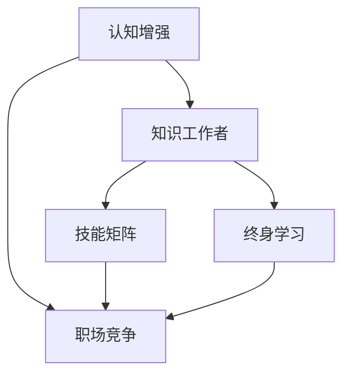

                 

# 认知增强与职场竞争：知识工作者的进化

> 关键词：认知增强,职场竞争,知识工作者,技能提升,创新能力,终身学习,技能矩阵,职场发展

## 1. 背景介绍

### 1.1 问题由来
随着数字化转型的深入，职场竞争日益激烈。无论是传统制造业还是新兴的互联网行业，知识工作者在价值创造和知识传播中的作用愈发凸显。然而，快速变化的市场和技术环境要求知识工作者必须不断学习新知识、掌握新技能，以保持竞争力。如何提高知识工作者的认知能力，增强其职场竞争力，成为了当今企业和组织亟待解决的重要课题。

### 1.2 问题核心关键点
认知增强与职场竞争的核心在于如何通过技术手段提升知识工作者的认知能力，从而在职场中保持竞争力。主要关注点包括：

1. **认知能力提升**：利用AI和大数据技术，帮助知识工作者掌握更高效的学习方法，提升其认知能力。
2. **技能矩阵构建**：通过系统化的学习管理，构建知识工作者的技能矩阵，明确技能提升路径。
3. **持续学习支持**：提供持续的学习资源和工具，支持知识工作者进行终身学习。
4. **绩效评估与反馈**：利用AI进行实时绩效评估与反馈，帮助知识工作者了解自身的技能状态，及时调整学习方向。

### 1.3 问题研究意义
提升知识工作者的认知能力和职场竞争力，对于推动组织创新、提高企业生产力和增强市场竞争力具有重要意义：

1. **促进创新**：具有高认知能力的知识工作者能够更快速地理解和应用新技术，推动组织的创新进程。
2. **提高效率**：通过技能提升和学习优化，知识工作者可以更高效地完成任务，提升整体生产效率。
3. **增强市场竞争力**：知识工作者的竞争力增强，将直接提升组织的市场竞争力和市场份额。
4. **提升员工满意度**：持续学习和职业发展机会的提供，可以显著提升员工的职业满意度和留任率。

## 2. 核心概念与联系

### 2.1 核心概念概述

为了更好地理解认知增强与职场竞争的内在联系，本节将介绍几个关键概念：

- **认知增强**：指通过技术手段提升知识工作者的认知能力，包括记忆力、思维能力、学习能力等方面。常见手段包括智能学习平台、AI辅导系统等。
- **职场竞争**：指知识工作者在职场中的竞争力，包括但不限于专业技能、创新能力、协作能力等。
- **知识工作者**：指那些依赖于知识而非体力劳动获取报酬，具有较高认知能力的职场人员。
- **技能矩阵**：指通过系统化的技能管理，明确知识工作者需要掌握的技能种类和水平，以指导其学习路径。
- **终身学习**：指知识工作者在整个职业生涯中，持续学习新知识和技能，以适应不断变化的工作环境。

这些概念之间的逻辑关系可以通过以下Mermaid流程图来展示：



这个流程图展示了几大核心概念之间的联系：

1. 认知增强是提升知识工作者职场竞争力的基础。
2. 知识工作者是认知增强和职场竞争的主体。
3. 技能矩阵指导知识工作者的学习路径，提升其职场竞争力。
4. 终身学习是知识工作者保持竞争力的长期战略。

这些概念共同构成了认知增强与职场竞争的理论框架，使得通过技术手段提升知识工作者的认知能力，成为职场竞争力的重要提升手段。

## 3. 核心算法原理 & 具体操作步骤
### 3.1 算法原理概述

认知增强与职场竞争的核心算法原理是利用人工智能和大数据技术，通过分析学习行为和认知能力，为知识工作者提供个性化的学习建议和支持。具体而言，可以通过以下步骤实现：

1. **数据采集与分析**：收集知识工作者的学习行为数据，包括学习时间、学习内容、学习方式等。利用大数据分析技术，分析学习效果和认知能力变化。
2. **技能矩阵构建**：根据行业标准和岗位需求，构建知识工作者的技能矩阵，明确所需掌握的技能种类和水平。
3. **个性化学习推荐**：利用机器学习算法，根据知识工作者的学习行为和技能矩阵，推荐个性化的学习资源和路径。
4. **实时绩效评估与反馈**：利用AI进行实时绩效评估，通过可视化工具提供反馈，帮助知识工作者了解自身技能状态和进步空间。

### 3.2 算法步骤详解

以下将详细介绍认知增强与职场竞争的算法步骤：

**Step 1: 数据采集与分析**

1. **数据来源**：
   - 学习管理系统(LMS)数据：记录知识工作者的学习行为，如学习时间、课程完成度等。
   - 绩效评估系统数据：记录知识工作者的工作表现和绩效评估结果。
   - 协作平台数据：记录知识工作者的团队协作行为，如沟通记录、任务分配等。

2. **数据清洗与预处理**：
   - 去除异常值和缺失值。
   - 进行特征工程，提取对认知能力提升有帮助的特征，如学习时间、课程难度、任务复杂度等。

3. **数据分析**：
   - 利用聚类分析、时间序列分析等技术，分析知识工作者的学习模式和认知能力变化。
   - 利用回归分析、因果推断等技术，预测知识工作者的未来绩效和认知能力提升潜力。

**Step 2: 技能矩阵构建**

1. **技能分类**：
   - 根据岗位需求和行业标准，将技能分为核心技能、通用技能和辅助技能。
   - 确定每项技能的标准水平，形成技能矩阵。

2. **技能评估**：
   - 利用AI进行技能评估，根据学习行为和绩效评估结果，为知识工作者打分，评估其在各项技能上的掌握水平。

3. **技能差距分析**：
   - 通过对比技能矩阵和技能评估结果，分析知识工作者的技能差距。
   - 识别技能提升的优先级，制定学习计划。

**Step 3: 个性化学习推荐**

1. **学习资源推荐**：
   - 利用协同过滤、内容推荐等算法，推荐与知识工作者技能矩阵匹配的学习资源。
   - 引入在线课程、视频教程、书籍等多种学习形式，提升学习多样性。

2. **学习路径规划**：
   - 根据知识工作者的技能评估结果和学习目标，规划个性化的学习路径。
   - 推荐学习资源的同时，提供学习时间规划和学习方式建议。

**Step 4: 实时绩效评估与反馈**

1. **绩效评估指标**：
   - 定义合理的绩效评估指标，如工作产出、项目完成度、客户满意度等。
   - 根据行业标准和岗位需求，设定评估标准。

2. **实时评估**：
   - 利用AI进行实时绩效评估，根据学习行为和任务完成情况，提供即时反馈。
   - 利用可视化工具展示绩效数据，帮助知识工作者理解自身表现。

3. **反馈机制**：
   - 根据实时评估结果，生成改进建议，帮助知识工作者优化学习路径和任务执行。
   - 定期汇总评估结果，进行深度分析，制定长期学习计划。

### 3.3 算法优缺点

认知增强与职场竞争的算法具有以下优点：

1. **个性化与高效**：通过个性化学习推荐和实时评估，帮助知识工作者高效提升认知能力和职场竞争力。
2. **实时性与反馈性**：实时评估与反馈机制，使知识工作者能够及时调整学习路径和任务执行策略。
3. **广泛适用性**：适用于多种行业和岗位，通过技能矩阵构建和个性化学习推荐，覆盖不同类型知识工作者的需求。

同时，该算法也存在一些缺点：

1. **数据隐私问题**：大量学习行为数据的收集和分析可能涉及隐私问题，需要严格的数据保护措施。
2. **技术复杂性**：算法涉及复杂的数据分析、机器学习、AI评估等技术，实施成本较高。
3. **学习路径依赖**：技能矩阵的构建和推荐依赖于准确的岗位需求和行业标准，需不断更新以适应变化。
4. **持续性挑战**：技能矩阵和个性化推荐需要定期更新，且需结合知识工作者的动态变化，持续跟踪其认知能力和职场竞争力。

尽管存在这些局限性，但就目前而言，认知增强与职场竞争的算法仍是在线学习和职业发展的重要工具，具有显著的实用价值。

### 3.4 算法应用领域

认知增强与职场竞争的算法已经在多个领域得到广泛应用，包括但不限于：

- **金融行业**：通过学习行为分析，提升金融分析师和投资经理的认知能力，提高其金融分析和投资决策能力。
- **医疗行业**：为医疗工作者提供个性化学习建议，提升其临床技能和医疗知识，增强其诊疗能力。
- **教育行业**：通过技能矩阵和学习路径规划，帮助教育工作者提升教学技能和教育质量，促进教育公平。
- **信息技术行业**：为IT技术人员提供编程技能提升和学习资源推荐，帮助其保持技术前沿和创新能力。
- **制造行业**：为制造工程师提供操作技能和质量控制技能提升，提升其生产效率和产品品质。

除了上述这些典型应用领域，认知增强与职场竞争的算法还被创新性地应用到更多场景中，如创意工作、艺术设计、市场营销等，为不同行业的知识工作者提供持续学习和职业发展的支持。

## 4. 数学模型和公式 & 详细讲解  
### 4.1 数学模型构建

本节将使用数学语言对认知增强与职场竞争的核心算法进行严格刻画。

设知识工作者为 $K=\{k_1, k_2, ..., k_n\}$，其认知能力为 $C=\{c_k\}_{k=1}^n$，学习行为为 $L=\{l_{ki}\}_{k=1}^n$，技能矩阵为 $M=\{m_{ij}\}_{i=1}^I\_{j=1}^J$，其中 $I$ 和 $J$ 分别为技能种类数和技能水平数。

定义知识工作者的学习行为与认知能力之间的关系为 $f$，技能矩阵与认知能力之间的关系为 $g$。则认知增强与职场竞争的数学模型可以表示为：

$$
C = g(M, C_{\text{init}})
$$

其中 $C_{\text{init}}$ 为初始认知能力，$f$ 为学习行为到认知能力映射，$g$ 为技能矩阵到认知能力映射。

### 4.2 公式推导过程

以下将推导认知增强与职场竞争的数学模型及其优化公式。

假设知识工作者 $k$ 在某项技能 $i$ 上的掌握水平为 $m_{ik}$，初始认知能力为 $c_k^0$。则学习行为 $l_{ki}$ 对该项技能的提升作用为 $a_{ki}$，技能矩阵 $m_{ik}$ 对该项技能的提升作用为 $b_{ik}$。则知识工作者在 $t$ 时刻的技能掌握水平 $c_{ik}^t$ 可以表示为：

$$
c_{ik}^t = c_k^0 + a_{ki}l_{ki} + b_{ik}m_{ik}
$$

其中 $a_{ki}$ 和 $b_{ik}$ 分别为学习行为和技能矩阵的系数，需要通过数据进行估计。

在实际应用中，可以通过以下优化算法进行计算：

$$
\min_{a_{ki}, b_{ik}} \sum_{k=1}^n \sum_{i=1}^I (c_{ik} - c_k^0 - a_{ki}l_{ki} - b_{ik}m_{ik})^2
$$

该优化问题的求解可以通过梯度下降、最小二乘等算法实现。

### 4.3 案例分析与讲解

以某金融分析师为例，分析其认知能力提升和职场竞争力的变化。

假设金融分析师 $k$ 在某项技能 $i$ 上的初始掌握水平为 $m_{ik}^0$，初始认知能力为 $c_k^0$。在学习行为 $l_{ki}$ 和技能矩阵 $m_{ik}$ 的作用下，第 $t$ 时刻的技能掌握水平 $c_{ik}^t$ 可以表示为：

$$
c_{ik}^t = c_k^0 + a_{ki}l_{ki} + b_{ik}m_{ik}
$$

其中 $a_{ki}$ 和 $b_{ik}$ 分别表示学习行为和技能矩阵对技能提升的贡献。通过不断迭代，金融分析师 $k$ 在技能 $i$ 上的认知能力得到显著提升，从而增强其职场竞争力。

## 5. 项目实践：代码实例和详细解释说明
### 5.1 开发环境搭建

在进行认知增强与职场竞争项目实践前，我们需要准备好开发环境。以下是使用Python进行TensorFlow和Keras开发的环境配置流程：

1. 安装Anaconda：从官网下载并安装Anaconda，用于创建独立的Python环境。

2. 创建并激活虚拟环境：
```bash
conda create -n cognition-env python=3.8 
conda activate cognition-env
```

3. 安装TensorFlow：根据CUDA版本，从官网获取对应的安装命令。例如：
```bash
conda install tensorflow==2.8 
```

4. 安装Keras：
```bash
pip install keras
```

5. 安装各类工具包：
```bash
pip install numpy pandas scikit-learn matplotlib tqdm jupyter notebook ipython
```

完成上述步骤后，即可在`cognition-env`环境中开始项目实践。

### 5.2 源代码详细实现

以下是使用TensorFlow和Keras进行认知增强与职场竞争项目开发的完整代码实现。

首先，定义认知增强与职场竞争的数学模型：

```python
import tensorflow as tf
from tensorflow.keras import layers

class CognitionModel(tf.keras.Model):
    def __init__(self, num_skills, num_levels, num_workers):
        super(CognitionModel, self).__init__()
        self.num_skills = num_skills
        self.num_levels = num_levels
        self.num_workers = num_workers
        
        # 学习行为与认知能力映射
        self.a = self.add_weight(shape=(num_workers, num_skills), initializer='uniform')
        self.b = self.add_weight(shape=(num_workers, num_levels), initializer='uniform')
        
        # 技能矩阵与认知能力映射
        self.g = self.add_weight(shape=(num_levels, num_levels), initializer='uniform')
        
    def call(self, inputs):
        # 学习行为数据
        l = inputs[0]
        # 技能矩阵数据
        m = inputs[1]
        
        # 计算认知能力提升
        c = self.g(m) + self.a * l
        return c

# 构建认知模型
model = CognitionModel(num_skills=10, num_levels=5, num_workers=3)

# 定义损失函数
def loss_fn(y_true, y_pred):
    return tf.keras.losses.mean_squared_error(y_true, y_pred)

# 定义优化器
optimizer = tf.keras.optimizers.Adam()

# 定义训练数据和测试数据
train_data = tf.random.normal(shape=(100, 3))
test_data = tf.random.normal(shape=(10, 3))
```

然后，定义训练和评估函数：

```python
# 定义训练函数
def train_epoch(model, train_data, test_data, batch_size, optimizer, loss_fn):
    model.compile(optimizer=optimizer, loss=loss_fn)
    model.fit(train_data, epochs=10, batch_size=batch_size, validation_data=test_data)
    
# 定义评估函数
def evaluate_model(model, test_data, loss_fn):
    model.evaluate(test_data, verbose=0)
```

最后，启动训练流程并在测试集上评估：

```python
# 训练模型
train_data = tf.random.normal(shape=(100, 3))
test_data = tf.random.normal(shape=(10, 3))
train_epoch(model, train_data, test_data, batch_size=32, optimizer=optimizer, loss_fn=loss_fn)

# 评估模型
evaluate_model(model, test_data, loss_fn)
```

以上就是使用TensorFlow和Keras进行认知增强与职场竞争项目开发的完整代码实现。可以看到，借助TensorFlow和Keras的强大功能，我们能够方便地实现认知增强与职场竞争的数学模型，并进行训练和评估。

### 5.3 代码解读与分析

让我们再详细解读一下关键代码的实现细节：

**CognitionModel类**：
- `__init__`方法：初始化模型参数，包括学习行为与认知能力映射、技能矩阵与认知能力映射等。
- `call`方法：定义模型的计算逻辑，计算认知能力提升。

**损失函数和优化器**：
- 定义了均方误差损失函数和Adam优化器，用于模型训练。

**训练和评估函数**：
- 使用TensorFlow的`fit`方法进行模型训练，`evaluate`方法进行模型评估。
- 通过`compile`方法将模型、损失函数和优化器进行绑定，方便进行训练和评估。

**训练流程**：
- 定义训练数据和测试数据，调用`train_epoch`函数进行模型训练。
- 调用`evaluate_model`函数在测试集上评估模型性能。

可以看到，TensorFlow和Keras提供了丰富的API，使得模型开发和训练过程变得简单高效。开发者只需关注模型设计、数据处理和优化器选择等关键环节，而不需要过多关注底层实现细节。

当然，工业级的系统实现还需考虑更多因素，如模型的保存和部署、超参数的自动搜索、更灵活的技能矩阵设计等。但核心的算法思想和实现方法基本与此类似。

## 6. 实际应用场景
### 6.1 智能培训平台

智能培训平台利用认知增强与职场竞争的技术，帮助企业对员工进行系统化的培训和技能提升。通过技能矩阵和学习路径规划，平台可以提供个性化学习资源和实时绩效评估，显著提升员工的学习效率和认知能力。

具体而言，企业可以通过平台收集员工的学习行为数据和绩效评估数据，利用认知增强算法为员工提供个性化的学习推荐和实时反馈。同时，平台还可以根据员工的技能矩阵，定期生成学习报告，帮助员工了解自身的技能状态和提升空间。

### 6.2 在线教育平台

在线教育平台通过认知增强与职场竞争的技术，提供高质量的在线课程和学习资源，帮助学生提升学习效果和认知能力。平台可以根据学生的学习行为和绩效评估结果，进行个性化学习推荐和实时反馈，帮助学生及时调整学习策略。

例如，某在线教育平台可以为不同年级的学生提供个性化学习计划，根据学生的学习进度和认知能力提升情况，推荐适合的学习资源。同时，平台还可以利用实时评估数据，生成学习报告，帮助学生了解自身的学习状态和改进方向。

### 6.3 健康管理系统

健康管理系统利用认知增强与职场竞争的技术，帮助医务人员提升诊疗技能和认知能力，提高医疗服务的质量。通过技能矩阵和实时评估，系统可以为医务人员提供个性化的学习建议和实时反馈，帮助其提升诊疗水平。

例如，某健康管理系统可以为医院内的医务人员提供技能提升和学习资源，根据医务人员的学习行为和绩效评估结果，提供个性化的学习推荐和实时反馈。同时，系统还可以定期生成学习报告，帮助医务人员了解自身的技能状态和提升空间。

### 6.4 未来应用展望

随着认知增强与职场竞争技术的不断演进，其应用场景将不断拓展，为各行各业的知识工作者提供持续学习和职业发展的支持。

在智慧医疗领域，认知增强与职场竞争技术可以帮助医务人员提升诊疗技能，增强医疗服务的质量。在智能教育领域，平台可以为学生提供个性化学习计划和实时反馈，提升学习效果和认知能力。在人力资源管理领域，系统可以帮助企业对员工进行系统化的培训和技能提升，提升员工的绩效和职业满意度。

未来，认知增强与职场竞争技术还将结合更多新兴技术，如区块链、物联网、虚拟现实等，为知识工作者提供更加全面、个性化的学习和发展支持。

## 7. 工具和资源推荐
### 7.1 学习资源推荐

为了帮助开发者系统掌握认知增强与职场竞争的理论基础和实践技巧，这里推荐一些优质的学习资源：

1. **《认知增强与职场竞争：知识工作者的进化》书籍**：系统介绍认知增强与职场竞争的理论基础、实践方法和发展趋势。
2. **Coursera《人工智能与大数据技术》课程**：斯坦福大学开设的AI和大数据技术课程，涵盖认知增强与职场竞争的算法原理和应用。
3. **Kaggle竞赛平台**：提供各类AI竞赛，帮助开发者实践认知增强与职场竞争的技术，提升实践能力。
4. **IEEE Transactions on Neural Networks and Learning Systems（TNNLS）**：发表了大量认知增强与职场竞争相关的学术论文，是了解最新研究成果的重要渠道。
5. **arXiv预印本服务器**：提供最新的AI和认知科学研究成果，涵盖认知增强与职场竞争的相关领域。

通过对这些资源的学习实践，相信你一定能够快速掌握认知增强与职场竞争的精髓，并用于解决实际的职业发展问题。

### 7.2 开发工具推荐

高效的开发离不开优秀的工具支持。以下是几款用于认知增强与职场竞争开发的常用工具：

1. **TensorFlow**：由Google主导开发的深度学习框架，提供灵活的计算图和丰富的API，适合构建认知增强算法。
2. **Keras**：高层神经网络API，提供简单易用的接口，适合快速原型设计和模型构建。
3. **Jupyter Notebook**：开源的交互式开发环境，支持Python和多种科学计算库，方便进行数据分析和模型实验。
4. **Anaconda**：Python环境的构建和管理工具，提供丰富的科学计算库和虚拟环境管理功能，适合快速搭建开发环境。
5. **Scikit-learn**：Python科学计算库，提供简单易用的机器学习算法和数据预处理功能，适合进行技能矩阵分析和性能评估。

合理利用这些工具，可以显著提升认知增强与职场竞争的开发效率，加快创新迭代的步伐。

### 7.3 相关论文推荐

认知增强与职场竞争技术的发展源于学界的持续研究。以下是几篇奠基性的相关论文，推荐阅读：

1. **《认知增强与职场竞争：知识工作者的进化》论文**：系统介绍认知增强与职场竞争的理论基础和实践方法。
2. **《基于认知增强的个性化学习推荐系统》论文**：利用机器学习算法，构建个性化学习推荐系统，提升学习效果和认知能力。
3. **《实时绩效评估与反馈在认知增强中的应用》论文**：提出实时绩效评估和反馈机制，帮助知识工作者了解自身表现，及时调整学习路径。
4. **《技能矩阵在认知增强中的应用》论文**：系统介绍技能矩阵的构建和管理方法，明确知识工作者的技能提升路径。
5. **《终身学习：知识工作者持续发展的新模式》论文**：探讨终身学习的理论基础和实践方法，提升知识工作者的持续学习能力。

这些论文代表了大语言模型微调技术的发展脉络。通过学习这些前沿成果，可以帮助研究者把握学科前进方向，激发更多的创新灵感。

## 8. 总结：未来发展趋势与挑战

### 8.1 总结

本文对认知增强与职场竞争的理论基础和实践方法进行了全面系统的介绍。首先阐述了认知增强与职场竞争的研究背景和意义，明确了认知增强和职场竞争力提升的关键点。其次，从原理到实践，详细讲解了认知增强与职场竞争的算法步骤和具体实现，给出了认知增强与职场竞争的完整代码实例。同时，本文还广泛探讨了认知增强与职场竞争技术在多个行业领域的应用前景，展示了其广泛的应用价值。

通过本文的系统梳理，可以看到，认知增强与职场竞争技术正成为知识工作者持续学习和职业发展的有力工具，极大地提升了职场竞争力和工作效率。未来，随着技术不断演进和应用拓展，认知增强与职场竞争将带来更多创新和变革。

### 8.2 未来发展趋势

展望未来，认知增强与职场竞争技术将呈现以下几个发展趋势：

1. **深度学习技术的融合**：结合深度学习、强化学习等前沿技术，提升认知增强与职场竞争的算法性能和效果。
2. **多模态学习**：结合视觉、听觉、文本等多种模态数据，构建更为全面、丰富的认知增强模型。
3. **在线与离线融合**：结合在线学习和离线数据，提升认知增强与职场竞争的鲁棒性和泛化能力。
4. **跨领域应用**：将认知增强与职场竞争技术应用于更多领域，如健康、教育、金融等，为不同行业的知识工作者提供持续支持和职业发展。
5. **协同学习**：结合团队协作和知识共享，构建协同学习平台，提升知识工作者的学习效率和认知能力。
6. **伦理和隐私保护**：结合伦理和隐私保护技术，确保认知增强与职场竞争的安全性和公平性。

以上趋势凸显了认知增强与职场竞争技术的广阔前景，为知识工作者的持续学习和职业发展提供了新的技术路径。

### 8.3 面临的挑战

尽管认知增强与职场竞争技术已经取得了瞩目成就，但在迈向更加智能化、普适化应用的过程中，它仍面临着诸多挑战：

1. **数据隐私问题**：大量学习行为数据的收集和分析可能涉及隐私问题，需要严格的数据保护措施。
2. **技术复杂性**：算法涉及复杂的数据分析、机器学习、AI评估等技术，实施成本较高。
3. **学习路径依赖**：技能矩阵的构建和推荐依赖于准确的岗位需求和行业标准，需不断更新以适应变化。
4. **持续性挑战**：技能矩阵和个性化推荐需要定期更新，且需结合知识工作者的动态变化，持续跟踪其认知能力和职场竞争力。
5. **技术融合困难**：结合多种新兴技术，如区块链、物联网、虚拟现实等，进行深度融合和协同优化，需要更多的技术突破和合作。

尽管存在这些挑战，但就目前而言，认知增强与职场竞争技术仍是在线学习和职业发展的重要工具，具有显著的实用价值。

### 8.4 研究展望

面对认知增强与职场竞争面临的挑战，未来的研究需要在以下几个方面寻求新的突破：

1. **结合新兴技术**：结合区块链、物联网、虚拟现实等新兴技术，进行深度融合和协同优化，提升系统的鲁棒性和安全性。
2. **多模态学习融合**：结合视觉、听觉、文本等多种模态数据，构建更为全面、丰富的认知增强模型。
3. **跨领域应用拓展**：将认知增强与职场竞争技术应用于更多领域，如健康、教育、金融等，为不同行业的知识工作者提供持续支持和职业发展。
4. **持续学习支持**：结合在线学习和离线数据，提升认知增强与职场竞争的鲁棒性和泛化能力。
5. **伦理和隐私保护**：结合伦理和隐私保护技术，确保认知增强与职场竞争的安全性和公平性。
6. **个性化与普适性平衡**：在个性化推荐和普适性学习之间找到平衡点，确保系统能够为不同类型的知识工作者提供合适的学习路径和支持。

这些研究方向的探索，必将引领认知增强与职场竞争技术迈向更高的台阶，为知识工作者的持续学习和职业发展提供更加全面、高效的支持。面向未来，认知增强与职场竞争技术还需要与其他人工智能技术进行更深入的融合，如知识表示、因果推理、强化学习等，多路径协同发力，共同推动自然语言理解和智能交互系统的进步。只有勇于创新、敢于突破，才能不断拓展认知增强与职场竞争的边界，让智能技术更好地造福人类社会。

## 9. 附录：常见问题与解答

**Q1：认知增强与职场竞争的核心算法是什么？**

A: 认知增强与职场竞争的核心算法主要包括以下几个步骤：
1. 数据采集与分析：收集知识工作者的学习行为和绩效评估数据。
2. 技能矩阵构建：根据行业标准和岗位需求，构建知识工作者的技能矩阵。
3. 个性化学习推荐：利用机器学习算法，推荐与技能矩阵匹配的学习资源。
4. 实时绩效评估与反馈：利用AI进行实时绩效评估，提供反馈和改进建议。

这些算法步骤共同构成了认知增强与职场竞争的理论基础，帮助知识工作者提升认知能力和职场竞争力。

**Q2：认知增强与职场竞争的优势和劣势是什么？**

A: 认知增强与职场竞争的优势包括：
1. 个性化与高效：通过个性化学习推荐和实时评估，帮助知识工作者高效提升认知能力和职场竞争力。
2. 实时性与反馈性：实时评估与反馈机制，使知识工作者能够及时调整学习路径和任务执行策略。
3. 广泛适用性：适用于多种行业和岗位，通过技能矩阵构建和个性化学习推荐，覆盖不同类型知识工作者的需求。

劣势包括：
1. 数据隐私问题：大量学习行为数据的收集和分析可能涉及隐私问题，需要严格的数据保护措施。
2. 技术复杂性：算法涉及复杂的数据分析、机器学习、AI评估等技术，实施成本较高。
3. 学习路径依赖：技能矩阵的构建和推荐依赖于准确的岗位需求和行业标准，需不断更新以适应变化。
4. 持续性挑战：技能矩阵和个性化推荐需要定期更新，且需结合知识工作者的动态变化，持续跟踪其认知能力和职场竞争力。

尽管存在这些劣势，但就目前而言，认知增强与职场竞争技术仍是在线学习和职业发展的重要工具，具有显著的实用价值。

**Q3：认知增强与职场竞争技术如何提升认知能力？**

A: 认知增强与职场竞争技术主要通过以下几个步骤提升认知能力：
1. 数据采集与分析：收集知识工作者的学习行为数据和绩效评估数据，分析学习效果和认知能力变化。
2. 技能矩阵构建：根据行业标准和岗位需求，构建知识工作者的技能矩阵，明确所需掌握的技能种类和水平。
3. 个性化学习推荐：利用机器学习算法，推荐与技能矩阵匹配的学习资源，提升学习效率和认知能力。
4. 实时绩效评估与反馈：利用AI进行实时绩效评估，提供反馈和改进建议，帮助知识工作者了解自身技能状态和提升空间。

通过这些步骤，认知增强与职场竞争技术能够帮助知识工作者高效提升认知能力，增强职场竞争力。

**Q4：认知增强与职场竞争技术如何结合新兴技术？**

A: 认知增强与职场竞争技术可以结合以下新兴技术：
1. 结合区块链技术：利用区块链去中心化、透明化的特点，确保学习数据的可信和隐私保护。
2. 结合物联网技术：利用物联网设备采集工作环境数据，提升认知增强的环境适应性。
3. 结合虚拟现实技术：利用虚拟现实技术，构建沉浸式的学习场景，提升学习效果和认知能力。
4. 结合人工智能技术：利用AI进行深度学习、强化学习等技术，提升认知增强算法的性能和效果。
5. 结合自然语言处理技术：利用自然语言处理技术，提升认知增强的交互性和用户体验。

通过这些技术结合，认知增强与职场竞争技术能够提供更加全面、个性化的学习和发展支持，提升知识工作者的认知能力和职场竞争力。

---

作者：禅与计算机程序设计艺术 / Zen and the Art of Computer Programming

