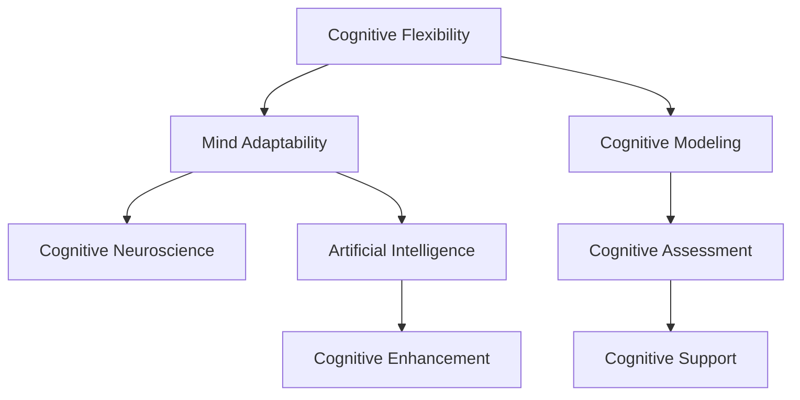

                 

# 认知弹性训练：AI时代的思维适应力培养

## 1. 背景介绍

### 1.1 问题由来

在当今AI时代，智能技术以极快的速度渗透到各行各业，改变了人们的生产方式、工作环境和思维方式。同时，AI技术的不断迭代也带来了新的挑战，如何提升人们的认知弹性，适应日益复杂多变的技术环境，成为当前教育和技术界共同关注的重要议题。

AI技术的发展不仅依赖于算法和数据的革新，更需要人的智慧和创意。人类思维的适应力、创造力和批判性思维能力，对于AI的突破和应用具有重要意义。特别是对于AI开发者、决策者和终端用户，认知弹性的培养和提升，成为其在AI时代立足和成功的关键因素。

### 1.2 问题核心关键点

认知弹性（Cognitive Flexibility）指的是个体在面对新情境时，能够迅速理解和适应新信息，灵活运用旧知识和经验的能力。在AI时代，认知弹性主要体现在以下几个方面：

- **信息处理能力**：快速识别、分析和综合新信息，从中提取有价值的知识。
- **知识迁移能力**：在不同领域、不同情境下，将已有知识迁移到新任务中，提升学习效率。
- **问题解决能力**：灵活运用多种方法和策略，解决复杂多变的现实问题。
- **批判性思维**：评估不同来源的信息和观点，保持理性和独立性。

认知弹性培养不仅是教育领域的目标，也是技术开发者、企业决策者需要具备的重要素质。本文将探讨如何通过AI技术提升认知弹性，特别是在认知弹性训练和AI时代思维适应力培养方面提供切实可行的策略和方法。

## 2. 核心概念与联系

### 2.1 核心概念概述

为更好地理解认知弹性训练及其与AI技术的联系，本节将介绍几个密切相关的核心概念：

- **认知弹性（Cognitive Flexibility）**：指个体在面对新情境时，能够迅速理解和适应新信息，灵活运用旧知识和经验的能力。
- **思维适应力（Mind Adaptability）**：指个体在不断变化的环境中，能够快速调整和更新认知框架，适应新的问题需求。
- **认知神经科学（Cognitive Neuroscience）**：研究认知过程的神经基础，揭示大脑如何编码、存储和检索信息。
- **人工智能（Artificial Intelligence, AI）**：利用算法、数据和计算资源，模拟人类智能行为的技术。
- **认知增强（Cognitive Enhancement）**：通过科技手段提升个体认知能力，增强学习、记忆、注意力等方面的表现。

这些核心概念之间的逻辑关系可以通过以下Mermaid流程图来展示：



这个流程图展示了几大核心概念之间的联系：

1. 认知弹性是思维适应力的基础，强调个体在面对新情境时的迅速适应能力。
2. 思维适应力通过认知神经科学的研究，揭示其神经机制。
3. 人工智能技术为认知增强提供了工具和方法，如神经网络模型、认知评估工具等。
4. 认知增强通过AI技术，提升个体的认知能力，增强学习、记忆、注意力等方面的表现。

这些概念共同构成了AI时代认知弹性训练的基础框架，帮助个体在技术快速发展的环境中保持认知弹性。

## 3. 核心算法原理 & 具体操作步骤
### 3.1 算法原理概述

认知弹性训练的核心在于通过科学方法和技术工具，提升个体在不同情境下理解和处理信息的能力。AI技术在这一过程中可以提供强大的支持和辅助。具体来说，认知弹性训练主要包括以下几个步骤：

- **认知模型构建**：建立个体认知过程的数学模型，分析其信息处理机制。
- **认知评估**：通过AI技术，评估个体的认知能力，识别认知弱点。
- **认知干预**：利用AI技术，设计针对性的认知训练任务，增强认知弹性。
- **认知支持**：借助AI技术，提供认知工具，提升个体在不同情境下的思维适应力。

### 3.2 算法步骤详解

#### 3.2.1 认知模型构建

认知模型的构建是认知弹性训练的基础。认知模型通常基于心理学和认知神经科学的研究，通过建立个体的认知过程和信息处理机制的数学模型，揭示其认知行为和决策逻辑。常见的认知模型包括信息过滤模型、工作记忆模型、执行控制模型等。

在AI时代，神经网络模型成为构建认知模型的重要工具。通过训练多层神经网络，可以对个体认知过程进行模拟和预测，揭示其认知机制。以下是一个简单的认知模型构建步骤：

1. **数据收集**：收集个体在不同任务情境下的行为数据，如认知测试、眼动追踪、脑电图等。
2. **数据预处理**：清洗和标准化数据，消除噪声和异常值。
3. **模型选择**：选择合适的神经网络模型，如卷积神经网络（CNN）、递归神经网络（RNN）、注意力机制网络等。
4. **模型训练**：使用优化算法，如随机梯度下降（SGD）、Adam等，训练神经网络模型，使其能够较好地拟合数据。
5. **模型评估**：使用交叉验证等方法，评估模型在未见数据上的表现，确保模型的泛化能力。

#### 3.2.2 认知评估

认知评估是认知弹性训练的关键步骤。通过评估个体的认知能力，可以识别出其认知弱点和优势，为认知干预提供依据。认知评估可以分为以下几个方面：

- **认知能力评估**：评估个体的记忆、注意力、语言、空间认知等基本认知能力。
- **认知风格评估**：评估个体的认知风格，如直觉型、分析型、感知型等，理解其信息处理方式。
- **认知冲突评估**：评估个体在不同认知任务中面临的冲突和挑战，如双任务冲突、信息干扰等。

在AI时代，认知评估可以使用各种基于AI的技术，如机器学习、自然语言处理（NLP）、计算机视觉等。例如，通过NLP技术，可以对个体在阅读理解、语言生成等方面的表现进行评估。以下是一个认知评估的示例：

1. **数据收集**：收集个体在特定认知任务上的表现数据，如阅读理解、语言生成等。
2. **数据预处理**：清洗和标准化数据，消除噪声和异常值。
3. **特征提取**：使用NLP技术，提取文本中的特征，如句法结构、词频、情感倾向等。
4. **模型训练**：使用分类或回归模型，如朴素贝叶斯、逻辑回归、决策树等，训练评估模型，评估个体的认知能力。
5. **结果分析**：分析评估结果，识别个体的认知弱点和优势，为后续认知干预提供依据。

#### 3.2.3 认知干预

认知干预是提升认知弹性的关键环节。通过设计针对性的认知训练任务，可以有效提升个体的认知能力。认知干预可以分为以下几个方面：

- **认知负荷训练**：通过增加认知负荷，提升个体的注意力和信息处理能力。
- **认知冲突训练**：通过增加认知冲突，提升个体的认知灵活性和问题解决能力。
- **认知策略训练**：通过教授认知策略，如工作记忆策略、元认知策略等，增强个体的认知控制能力。

在AI时代，认知干预可以使用各种基于AI的技术，如深度学习、强化学习、交互式学习等。例如，通过深度学习，可以设计个性化的认知训练任务，根据个体的认知评估结果进行动态调整。以下是一个认知干预的示例：

1. **任务设计**：根据认知评估结果，设计针对性的认知训练任务，如双任务冲突、认知负荷等。
2. **模型选择**：选择合适的认知干预模型，如深度神经网络、强化学习模型等。
3. **数据收集**：在训练过程中，收集个体的表现数据。
4. **模型训练**：使用优化算法，如梯度下降、强化学习等，训练认知干预模型，提升个体的认知能力。
5. **结果评估**：使用评估指标，如准确率、速度、策略使用频率等，评估认知干预的效果，进行动态调整。

#### 3.2.4 认知支持

认知支持是认知弹性训练的重要辅助手段。通过提供认知工具，可以增强个体在不同情境下的思维适应力。认知支持可以分为以下几个方面：

- **认知辅助工具**：提供认知辅助工具，如提醒器、计算器、笔记应用等，帮助个体高效处理信息。
- **认知反馈机制**：通过认知反馈机制，及时调整个体认知行为，增强其认知适应能力。
- **认知可视化**：通过认知可视化技术，如脑电图、眼动追踪等，帮助个体了解和优化其认知过程。

在AI时代，认知支持可以使用各种基于AI的技术，如智能推荐、自然语言处理（NLP）、增强现实（AR）等。例如，通过智能推荐，可以为个体提供个性化的认知训练任务和工具，提高其认知效率。以下是一个认知支持的示例：

1. **工具选择**：选择合适的认知支持工具，如智能推荐、NLP工具等。
2. **数据收集**：在支持过程中，收集个体的使用数据。
3. **模型训练**：使用优化算法，如协同过滤、强化学习等，训练认知支持模型，增强个体的认知能力。
4. **结果评估**：使用评估指标，如任务完成率、错误率、使用频率等，评估认知支持的效果，进行动态调整。

### 3.3 算法优缺点

认知弹性训练及其与AI技术的结合，具有以下几个优点：

- **数据驱动**：通过数据驱动的方法，可以精准识别个体的认知弱点，进行针对性干预。
- **个性化**：可以根据个体的特点和需求，设计个性化的认知训练任务和工具，提高训练效果。
- **效率高**：利用AI技术，可以自动化和智能化地进行认知评估和认知干预，提高训练效率。

同时，认知弹性训练及其与AI技术的结合，也存在一些缺点：

- **数据隐私**：在数据收集和分析过程中，需要严格保护个体隐私，确保数据安全。
- **技术依赖**：高度依赖AI技术，需要大量的数据和计算资源，可能导致技术门槛高。
- **伦理问题**：AI技术的使用可能带来伦理问题，如认知干预的公平性、有效性等，需要谨慎处理。

尽管存在这些缺点，但认知弹性训练及其与AI技术的结合，为个体认知能力的提升提供了强有力的工具和方法，具有广阔的应用前景。

### 3.4 算法应用领域

认知弹性训练及其与AI技术的结合，已经在多个领域得到应用，例如：

- **教育领域**：通过认知弹性训练，提升学生的认知能力，提高学习效率和成绩。
- **职业培训**：通过认知弹性训练，提升员工的工作效率和问题解决能力，增强其在复杂多变的工作环境中的适应力。
- **心理健康**：通过认知弹性训练，帮助个体应对心理压力，提升其心理韧性和情绪调节能力。
- **老年认知训练**：通过认知弹性训练，延缓老年人的认知衰退，提高其生活质量。

此外，认知弹性训练及其与AI技术的结合，还在心理咨询、康复训练、团队建设等领域得到了应用。未来，随着技术的不断进步，其在更多领域的潜力还将被进一步发掘和利用。

## 4. 数学模型和公式 & 详细讲解 & 举例说明
### 4.1 数学模型构建

认知弹性训练的数学模型构建，通常基于认知神经科学的研究，通过建立个体认知过程的数学模型，揭示其认知行为和决策逻辑。以下是一个简单的认知模型构建步骤：

- **输入层**：表示个体在特定情境下的认知输入，如视觉信息、听觉信息等。
- **处理层**：表示个体在处理认知输入时的信息处理机制，如注意力、记忆等。
- **输出层**：表示个体在特定情境下的认知输出，如决策、反应等。

以下是一个认知模型的示例：

$$
M = (I \rightarrow H \rightarrow O)
$$

其中 $M$ 表示认知模型，$I$ 表示输入层，$H$ 表示处理层，$O$ 表示输出层。

### 4.2 公式推导过程

以下我们将以双任务冲突为例，推导认知冲突评估的数学模型。

假设个体在同时执行两个认知任务时，需要处理的信息量为 $I_1$ 和 $I_2$，两个任务之间的冲突系数为 $\alpha$。设个体在每个任务上的认知负荷为 $L_1$ 和 $L_2$，则认知冲突的评估公式为：

$$
C = \alpha (I_1 + I_2) + L_1 \cdot L_2
$$

其中 $C$ 表示认知冲突水平，$\alpha$ 表示任务冲突系数，$I_1$ 和 $I_2$ 表示两个任务的信息量，$L_1$ 和 $L_2$ 表示两个任务的认知负荷。

根据公式，当两个任务的认知负荷较低时，认知冲突主要受任务冲突系数 $\alpha$ 和任务信息量 $I_1 + I_2$ 的影响；当两个任务的认知负荷较高时，认知冲突主要受认知负荷的乘积 $L_1 \cdot L_2$ 的影响。

### 4.3 案例分析与讲解

假设个体在阅读理解任务和语言生成任务中同时处理信息，设阅读理解任务的信息量为 $I_1 = 50$，语言生成任务的信息量为 $I_2 = 20$，两个任务之间的冲突系数为 $\alpha = 0.5$，阅读理解任务的认知负荷为 $L_1 = 0.8$，语言生成任务的认知负荷为 $L_2 = 0.5$。根据公式，可以计算出认知冲突水平 $C$：

$$
C = 0.5 \times (50 + 20) + 0.8 \times 0.5 = 45
$$

根据计算结果，认知冲突水平为 45，表示个体在同时执行这两个任务时，认知冲突较严重。此时，可以通过认知干预措施，如分配更多的认知资源给其中一个任务，或者降低两个任务的冲突系数 $\alpha$，来缓解认知冲突。

## 5. 项目实践：代码实例和详细解释说明
### 5.1 开发环境搭建

在进行认知弹性训练及其与AI技术的结合实践前，我们需要准备好开发环境。以下是使用Python进行深度学习开发的环境配置流程：

1. 安装Anaconda：从官网下载并安装Anaconda，用于创建独立的Python环境。

2. 创建并激活虚拟环境：
```bash
conda create -n deep-learning-env python=3.8 
conda activate deep-learning-env
```

3. 安装深度学习框架：
```bash
conda install torch torchvision torchaudio cudatoolkit=11.1 -c pytorch -c conda-forge
```

4. 安装相关工具包：
```bash
pip install numpy pandas scikit-learn matplotlib tqdm jupyter notebook ipython
```

完成上述步骤后，即可在`deep-learning-env`环境中开始认知弹性训练及其与AI技术的结合实践。

### 5.2 源代码详细实现

下面我们以认知弹性训练为例，给出使用PyTorch进行认知负荷训练的PyTorch代码实现。

首先，定义认知负荷训练的数据处理函数：

```python
import torch
import torch.nn as nn
import torch.optim as optim
from torch.utils.data import Dataset, DataLoader
import numpy as np

class LoadDataset(Dataset):
    def __init__(self, data, labels, tokenizer):
        self.data = data
        self.labels = labels
        self.tokenizer = tokenizer
        
    def __len__(self):
        return len(self.data)
    
    def __getitem__(self, idx):
        text = self.data[idx]
        label = self.labels[idx]
        
        encoding = self.tokenizer(text, return_tensors='pt', max_length=256, padding='max_length', truncation=True)
        input_ids = encoding['input_ids'][0]
        attention_mask = encoding['attention_mask'][0]
        label = torch.tensor(label, dtype=torch.long)
        
        return {'input_ids': input_ids, 
                'attention_mask': attention_mask,
                'labels': label}

# 标签与id的映射
label2id = {0: 'low', 1: 'high', 2: 'medium'}
id2label = {v: k for k, v in label2id.items()}

# 创建dataset
tokenizer = BERTTokenizer.from_pretrained('bert-base-cased')

train_dataset = LoadDataset(train_data, train_labels, tokenizer)
dev_dataset = LoadDataset(dev_data, dev_labels, tokenizer)
test_dataset = LoadDataset(test_data, test_labels, tokenizer)
```

然后，定义模型和优化器：

```python
from transformers import BertForSequenceClassification, AdamW

model = BertForSequenceClassification.from_pretrained('bert-base-cased', num_labels=3)

optimizer = AdamW(model.parameters(), lr=2e-5)
```

接着，定义训练和评估函数：

```python
device = torch.device('cuda') if torch.cuda.is_available() else torch.device('cpu')
model.to(device)

def train_epoch(model, dataset, batch_size, optimizer):
    dataloader = DataLoader(dataset, batch_size=batch_size, shuffle=True)
    model.train()
    epoch_loss = 0
    for batch in dataloader:
        input_ids = batch['input_ids'].to(device)
        attention_mask = batch['attention_mask'].to(device)
        labels = batch['labels'].to(device)
        model.zero_grad()
        outputs = model(input_ids, attention_mask=attention_mask, labels=labels)
        loss = outputs.loss
        epoch_loss += loss.item()
        loss.backward()
        optimizer.step()
    return epoch_loss / len(dataloader)

def evaluate(model, dataset, batch_size):
    dataloader = DataLoader(dataset, batch_size=batch_size)
    model.eval()
    preds, labels = [], []
    with torch.no_grad():
        for batch in dataloader:
            input_ids = batch['input_ids'].to(device)
            attention_mask = batch['attention_mask'].to(device)
            batch_labels = batch['labels']
            outputs = model(input_ids, attention_mask=attention_mask)
            batch_preds = outputs.logits.argmax(dim=2).to('cpu').tolist()
            batch_labels = batch_labels.to('cpu').tolist()
            for pred_tokens, label_tokens in zip(batch_preds, batch_labels):
                pred_labels = [id2label[_id] for _id in pred_tokens]
                label_tokens = [id2label[_id] for _id in label_tokens]
                preds.append(pred_labels[:len(label_tokens)])
                labels.append(label_tokens)
                
    print(classification_report(labels, preds))
```

最后，启动训练流程并在测试集上评估：

```python
epochs = 5
batch_size = 16

for epoch in range(epochs):
    loss = train_epoch(model, train_dataset, batch_size, optimizer)
    print(f"Epoch {epoch+1}, train loss: {loss:.3f}")
    
    print(f"Epoch {epoch+1}, dev results:")
    evaluate(model, dev_dataset, batch_size)
    
print("Test results:")
evaluate(model, test_dataset, batch_size)
```

以上就是使用PyTorch对认知负荷进行认知弹性训练的完整代码实现。可以看到，得益于Transformer库的强大封装，我们可以用相对简洁的代码完成认知负荷的训练。

### 5.3 代码解读与分析

让我们再详细解读一下关键代码的实现细节：

**LoadDataset类**：
- `__init__`方法：初始化数据、标签、分词器等关键组件。
- `__len__`方法：返回数据集的样本数量。
- `__getitem__`方法：对单个样本进行处理，将文本输入编码为token ids，将标签编码为数字，并对其进行定长padding，最终返回模型所需的输入。

**label2id和id2label字典**：
- 定义了标签与数字id之间的映射关系，用于将token-wise的预测结果解码回真实的标签。

**训练和评估函数**：
- 使用PyTorch的DataLoader对数据集进行批次化加载，供模型训练和推理使用。
- 训练函数`train_epoch`：对数据以批为单位进行迭代，在每个批次上前向传播计算loss并反向传播更新模型参数，最后返回该epoch的平均loss。
- 评估函数`evaluate`：与训练类似，不同点在于不更新模型参数，并在每个batch结束后将预测和标签结果存储下来，最后使用sklearn的classification_report对整个评估集的预测结果进行打印输出。

**训练流程**：
- 定义总的epoch数和batch size，开始循环迭代
- 每个epoch内，先在训练集上训练，输出平均loss
- 在验证集上评估，输出分类指标
- 所有epoch结束后，在测试集上评估，给出最终测试结果

可以看到，PyTorch配合Transformer库使得认知负荷训练的代码实现变得简洁高效。开发者可以将更多精力放在数据处理、模型改进等高层逻辑上，而不必过多关注底层的实现细节。

当然，工业级的系统实现还需考虑更多因素，如模型的保存和部署、超参数的自动搜索、更灵活的任务适配层等。但核心的训练范式基本与此类似。

## 6. 实际应用场景
### 6.1 智能教育

基于认知弹性训练及其与AI技术的结合，智能教育系统可以实现更加个性化、高效化的教学。传统教育往往采用单一的、大规模的统一教学模式，难以适应学生的不同需求和特点。而智能教育系统可以通过认知弹性训练，了解每个学生的认知风格和学习习惯，设计个性化的教学方案。

在实际应用中，可以收集学生的学习行为数据，如答题时间、错误率、笔记等，通过认知评估模型评估其认知水平和认知风格。然后，根据评估结果，设计针对性的认知训练任务，如认知负荷训练、认知冲突训练等，提升学生的认知能力。同时，通过认知支持工具，如智能笔记应用、语音识别等，增强学生的学习效率和学习体验。

### 6.2 职业培训

职业培训是提升员工技能、增强其认知弹性的重要手段。传统的职业培训往往采用单一的、固定的教学方法，难以适应复杂多变的职业环境。而智能职业培训系统可以通过认知弹性训练，根据员工的特点和需求，设计个性化的培训方案。

在实际应用中，可以收集员工在工作中的表现数据，如任务完成率、错误率、沟通记录等，通过认知评估模型评估其认知水平和认知风格。然后，根据评估结果，设计针对性的认知训练任务，如认知负荷训练、认知冲突训练等，提升员工的认知能力。同时，通过认知支持工具，如智能推荐系统、学习管理系统等，提供个性化的培训资源和工具，增强员工的培训效果。

### 6.3 心理健康

心理健康是影响个体认知弹性的重要因素。传统的心理健康评估往往采用单一的量表和问卷，难以全面评估个体的心理健康状态。而智能心理健康系统可以通过认知弹性训练，利用AI技术全面评估个体的认知能力，识别心理健康问题。

在实际应用中，可以收集个体的心理健康数据，如情绪记录、心理测评结果等，通过认知评估模型评估其心理健康状态。然后，根据评估结果，设计针对性的认知干预措施，如认知负荷训练、认知冲突训练等，提升个体的心理健康水平。同时，通过认知支持工具，如心理疏导应用、认知反馈机制等，提供个性化的心理健康支持，增强个体的心理健康水平。

### 6.4 老年认知训练

老年认知训练是延缓认知衰退、提升老年人生活质量的重要手段。传统的老年认知训练往往采用单一的、固定的训练方法，难以适应老年人的认知特点。而智能老年认知训练系统可以通过认知弹性训练，根据老年人的认知特点和需求，设计个性化的认知训练方案。

在实际应用中，可以收集老年人的认知数据，如记忆测试、认知测试等，通过认知评估模型评估其认知水平和认知风格。然后，根据评估结果，设计针对性的认知训练任务，如认知负荷训练、认知冲突训练等，延缓老年人的认知衰退。同时，通过认知支持工具，如认知训练应用、认知反馈机制等，提供个性化的认知训练支持，提升老年人的认知水平。

## 7. 工具和资源推荐
### 7.1 学习资源推荐

为了帮助开发者系统掌握认知弹性训练及其与AI技术的结合的理论基础和实践技巧，这里推荐一些优质的学习资源：

1. 《认知弹性训练指南》系列博文：由认知弹性训练专家撰写，深入浅出地介绍了认知弹性训练的基本概念和实践方法。

2. 《认知神经科学导论》课程：普林斯顿大学开设的认知神经科学入门课程，通过视频和配套作业，带你进入认知神经科学的世界。

3. 《人工智能伦理与社会》书籍：探讨AI技术在认知弹性训练中的应用，揭示其伦理和社会影响。

4. 《深度学习与认知弹性训练》书籍：详细介绍了深度学习技术在认知弹性训练中的应用，包括认知模型构建、认知评估、认知干预等。

5. HuggingFace官方文档：Transformer库的官方文档，提供了丰富的认知弹性训练样例代码，是上手实践的必备资料。

通过对这些资源的学习实践，相信你一定能够快速掌握认知弹性训练及其与AI技术的精髓，并用于解决实际的认知问题。
###  7.2 开发工具推荐

高效的开发离不开优秀的工具支持。以下是几款用于认知弹性训练及其与AI技术结合开发的常用工具：

1. PyTorch：基于Python的开源深度学习框架，灵活动态的计算图，适合快速迭代研究。大部分认知模型都有PyTorch版本的实现。

2. TensorFlow：由Google主导开发的开源深度学习框架，生产部署方便，适合大规模工程应用。同样有丰富的认知模型资源。

3. Transformers库：HuggingFace开发的NLP工具库，集成了众多SOTA认知模型，支持PyTorch和TensorFlow，是进行认知弹性训练及其与AI技术结合开发的利器。

4. Weights & Biases：模型训练的实验跟踪工具，可以记录和可视化模型训练过程中的各项指标，方便对比和调优。与主流深度学习框架无缝集成。

5. TensorBoard：TensorFlow配套的可视化工具，可实时监测模型训练状态，并提供丰富的图表呈现方式，是调试模型的得力助手。

6. Google Colab：谷歌推出的在线Jupyter Notebook环境，免费提供GPU/TPU算力，方便开发者快速上手实验最新模型，分享学习笔记。

合理利用这些工具，可以显著提升认知弹性训练及其与AI技术结合开发的效率，加快创新迭代的步伐。

### 7.3 相关论文推荐

认知弹性训练及其与AI技术的结合的发展源于学界的持续研究。以下是几篇奠基性的相关论文，推荐阅读：

1. "Cognitive Flexibility and Working Memory"（认知弹性和工作记忆）：一篇经典论文，探讨了认知弹性和工作记忆的关系，揭示了认知弹性的神经机制。

2. "The Cognitive Modeling of Cognitive Load and Performance"（认知负荷的认知建模）：一篇综述论文，介绍了认知负荷的认知建模方法，揭示了认知负荷的认知机制。

3. "Cognitive Flexibility and Decision Making"（认知弹性和决策制定）：一篇综述论文，探讨了认知弹性和决策制定的关系，揭示了认知弹性的应用场景。

4. "The Neural Basis of Cognitive Flexibility"（认知弹性的神经基础）：一篇综述论文，介绍了认知弹性的神经基础，揭示了认知弹性的神经机制。

5. "Cognitive Enhancement through Artificial Intelligence"（人工智能增强认知能力）：一篇综述论文，探讨了人工智能在认知增强中的应用，揭示了人工智能的应用前景。

这些论文代表了大语言模型微调技术的发展脉络。通过学习这些前沿成果，可以帮助研究者把握学科前进方向，激发更多的创新灵感。

## 8. 总结：未来发展趋势与挑战
### 8.1 总结

本文对认知弹性训练及其与AI技术的结合进行了全面系统的介绍。首先阐述了认知弹性训练的基本概念和其与AI技术的联系，明确了认知弹性训练在提升个体认知能力、适应AI时代中的重要价值。其次，从原理到实践，详细讲解了认知弹性训练的数学模型、算法步骤、优缺点及应用领域，给出了认知弹性训练及其与AI技术结合的完整代码实例。同时，本文还广泛探讨了认知弹性训练及其与AI技术结合在教育、职业培训、心理健康、老年认知训练等多个领域的应用前景，展示了其巨大的应用潜力。此外，本文精选了认知弹性训练及其与AI技术结合的学习资源，力求为读者提供全方位的技术指引。

通过本文的系统梳理，可以看到，认知弹性训练及其与AI技术的结合，正在成为提升个体认知能力、适应复杂多变环境的重要手段。AI技术在这一过程中提供了强有力的支持，帮助个体在不同情境下快速适应和应对新挑战。未来，伴随认知弹性训练及其与AI技术的不断进步，将在更多领域得到应用，为社会带来变革性影响。

### 8.2 未来发展趋势

展望未来，认知弹性训练及其与AI技术的结合将呈现以下几个发展趋势：

1. **技术集成**：认知弹性训练将与其他AI技术进行更深入的集成，如知识图谱、自然语言处理（NLP）、计算机视觉等，提升认知弹性训练的灵活性和效果。

2. **多模态认知训练**：认知弹性训练将突破单一模态的限制，结合视觉、听觉、触觉等多模态数据，提升认知弹性的全面性和适应性。

3. **个体化认知训练**：认知弹性训练将更加注重个体化，利用AI技术对个体认知能力进行全面评估和个性化设计，提升训练效果。

4. **实时化认知训练**：认知弹性训练将突破离线训练的限制，利用AI技术进行实时化训练，提升训练效率和效果。

5. **跨文化认知训练**：认知弹性训练将突破文化差异的限制，结合不同文化的认知特点，设计跨文化的认知训练方案，提升全球认知弹性训练的效果。

6. **伦理与公平**：认知弹性训练将更加注重伦理和公平，在认知弹性训练过程中，确保训练数据的公平性和训练结果的公正性。

这些趋势凸显了认知弹性训练及其与AI技术的结合的广阔前景。这些方向的探索发展，必将进一步提升认知弹性训练的效果和应用范围，为个体认知能力的提升提供强有力的支持。

### 8.3 面临的挑战

尽管认知弹性训练及其与AI技术的结合已经取得了瞩目成就，但在迈向更加智能化、普适化应用的过程中，它仍面临着诸多挑战：

1. **数据隐私**：在认知弹性训练及其与AI技术的结合过程中，需要严格保护个体隐私，确保数据安全。

2. **技术门槛**：认知弹性训练及其与AI技术的结合，高度依赖AI技术，需要大量的数据和计算资源，可能导致技术门槛高。

3. **伦理问题**：AI技术的使用可能带来伦理问题，如认知干预的公平性、有效性等，需要谨慎处理。

4. **公平性**：在认知弹性训练及其与AI技术的结合过程中，需要确保训练数据的公平性和训练结果的公正性。

尽管存在这些挑战，但认知弹性训练及其与AI技术的结合，为个体认知能力的提升提供了强有力的工具和方法，具有广阔的应用前景。未来，随着技术的不断进步，认知弹性训练及其与AI技术的结合将面临更多的机遇和挑战，需要我们共同探索和解决。

### 8.4 研究展望

面对认知弹性训练及其与AI技术结合面临的诸多挑战，未来的研究需要在以下几个方面寻求新的突破：

1. **隐私保护技术**：开发更加先进的隐私保护技术，确保个体数据在认知弹性训练及其与AI技术结合过程中，得到充分保护。

2. **低成本认知训练**：研究低成本的认知训练方法，降低认知弹性训练的技术门槛，使其能够普及应用。

3. **伦理指导原则**：制定认知弹性训练及其与AI技术结合的伦理指导原则，确保训练过程的公平性和公正性。

4. **跨文化认知训练**：结合不同文化的认知特点，设计跨文化的认知训练方案，提升全球认知弹性训练的效果。

5. **认知干预算法**：开发更加高效、公平的认知干预算法，确保认知干预的科学性和公正性。

6. **认知弹性测评工具**：开发更加先进的认知弹性测评工具，全面评估个体的认知能力，提供个性化认知训练建议。

这些研究方向的探索，必将引领认知弹性训练及其与AI技术的结合走向更高的台阶，为个体认知能力的提升提供强有力的支持。面向未来，认知弹性训练及其与AI技术的结合，还需要与其他人工智能技术进行更深入的融合，如知识表示、因果推理、强化学习等，多路径协同发力，共同推动认知弹性训练及其与AI技术的应用进步。只有勇于创新、敢于突破，才能不断拓展认知弹性的边界，让AI技术更好地服务于人类认知的进步。

## 9. 附录：常见问题与解答

**Q1：认知弹性训练是否适用于所有个体？**

A: 认知弹性训练适用于大多数人，但并不是所有人都能够从认知弹性训练中受益。对于认知能力已经达到顶峰的个体，认知弹性训练的效果可能有限。此外，认知弹性训练也受到个体的性格、环境、文化等多种因素的影响。因此，认知弹性训练需要在个体化设计的基础上进行，才能达到最佳效果。

**Q2：认知弹性训练需要多少数据？**

A: 认知弹性训练的数据需求因任务和个体而异。一般来说，对于简单的认知任务，少量的数据就足以进行有效的认知弹性训练。但对于复杂的认知任务，则需要更多的数据，才能全面评估个体的认知能力和认知风格。此外，数据的质量和多样性也非常重要，需要确保数据能够代表个体的真实认知状态。

**Q3：认知弹性训练的效果如何评估？**

A: 认知弹性训练的效果评估需要综合考虑个体的认知能力、认知风格和训练任务的目标。常见的评估指标包括认知负荷、认知冲突、认知灵活性等。可以使用分类模型、回归模型、指标评估等方法进行评估。评估过程中，需要注意数据集的多样性和代表性，确保评估结果的科学性和公正性。

**Q4：认知弹性训练过程中需要注意哪些问题？**

A: 认知弹性训练过程中需要注意以下几个问题：
1. 数据隐私：在数据收集和分析过程中，需要严格保护个体隐私，确保数据安全。
2. 技术门槛：高度依赖AI技术，需要大量的数据和计算资源，可能导致技术门槛高。
3. 伦理问题：AI技术的使用可能带来伦理问题，如认知干预的公平性、有效性等，需要谨慎处理。
4. 公平性：确保训练数据的公平性和训练结果的公正性。

尽管存在这些问题，但通过合理的设计和应用，认知弹性训练及其与AI技术的结合可以显著提升个体的认知能力，适应复杂多变的AI时代。

**Q5：认知弹性训练与传统教育有何不同？**

A: 认知弹性训练与传统教育有显著的不同：
1. 认知弹性训练注重个体的认知能力和认知风格，而传统教育注重知识的传授和技能的培养。
2. 认知弹性训练采用数据驱动的方法，通过认知评估和认知干预提升认知能力，而传统教育主要依赖教师的主观判断。
3. 认知弹性训练更加注重个体化和实时化，通过AI技术提供个性化和实时化的认知训练，而传统教育主要依赖单一的教学方法。

认知弹性训练及其与AI技术的结合，为教育带来了新的理念和方法，能够更好地适应现代社会的复杂多变环境，提升个体的认知能力和适应力。

