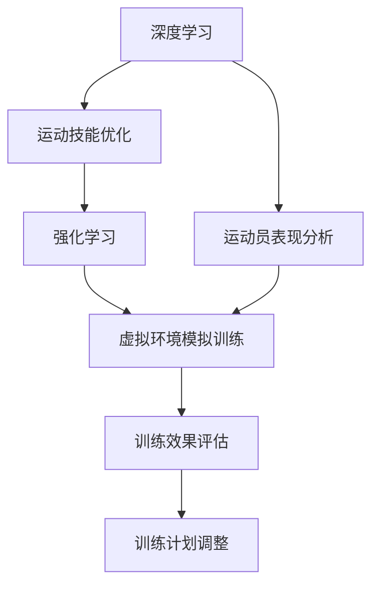

                 

# 认知科学与体育训练：优化运动技能学习

> 关键词：认知科学, 运动技能学习, 神经网络, 深度学习, 强化学习, 可解释性, 体育训练, 优化算法

## 1. 背景介绍

随着科技的迅速发展，人工智能（AI）在各行各业中逐渐崭露头角。尤其在体育训练领域，人工智能的应用为优化运动技能学习和提升训练效果提供了新的可能。本文章将从认知科学的角度出发，探讨如何将人工智能与体育训练结合起来，利用深度学习和强化学习等前沿技术，提升运动员的运动技能和训练效果。

### 1.1 问题由来

传统体育训练大多依赖教练的经验和指导，但这种方法存在主观性强、难以量化的问题。人工智能的出现，特别是深度学习和强化学习技术，为体育训练带来了新的视角和方法。通过深度学习，教练可以更加精准地分析和评估运动员的表现，发现问题并及时调整训练计划。通过强化学习，运动员可以在虚拟环境中不断试错并优化技能，减少实际训练中的试错成本。

### 1.2 问题核心关键点

在体育训练中应用人工智能技术，需要关注以下几个核心关键点：

- 运动技能的定义和评估：如何通过数据收集和分析，建立运动技能的表现模型。
- 数据收集和预处理：如何高效、准确地收集和预处理运动员训练数据。
- 深度学习模型的构建和训练：如何选择合适的深度学习模型，并进行有效的训练。
- 强化学习的应用：如何在虚拟环境中模拟训练过程，优化运动技能。
- 训练效果的评估和调整：如何利用AI技术，对训练效果进行评估和调整。

### 1.3 问题研究意义

将人工智能技术引入体育训练，对于提高训练效率、减少伤病风险、提升运动员的表现具有重要意义：

1. **提升训练效率**：通过深度学习和强化学习，教练和运动员可以更快地发现问题并进行针对性的训练。
2. **降低伤病风险**：通过模拟训练和数据分析，可以预测运动员受伤的风险，并及时调整训练计划。
3. **提升运动表现**：通过优化运动技能，运动员可以在比赛中发挥更好的水平。
4. **推动体育产业升级**：AI技术在体育训练中的应用，将推动体育产业的数字化、智能化转型。

## 2. 核心概念与联系

### 2.1 核心概念概述

为更好地理解将人工智能应用于体育训练的原理，本节将介绍几个核心概念：

- **深度学习（Deep Learning）**：一种通过多层神经网络逼近复杂函数的方法，能够从数据中提取高级特征。在体育训练中，深度学习可以用于分析和评估运动员的表现，预测运动技能的变化。

- **强化学习（Reinforcement Learning）**：通过试错反馈机制，优化行为策略的过程。在体育训练中，强化学习可以模拟训练过程，优化运动员的动作技巧。

- **可解释性（Explainability）**：深度学习和强化学习模型的结果可解释性，对于教练和运动员了解训练效果和优化策略具有重要意义。

- **神经网络（Neural Network）**：深度学习的基础，通过多层神经元模型进行信息处理和模式识别。在体育训练中，神经网络可以用于运动员表现的分析，技能优化的模拟。

- **体育训练模拟（Sports Training Simulation）**：通过虚拟环境模拟运动员训练过程，优化运动技能。可以用于运动员的模拟比赛和技能测试。

这些核心概念之间的逻辑关系可以通过以下Mermaid流程图来展示：



这个流程图展示了几大核心概念及其之间的关系：

1. 深度学习用于运动员表现的分析和运动技能优化。
2. 强化学习用于运动技能优化和虚拟环境模拟训练。
3. 可解释性增强教练和运动员对训练效果的理解和调整。
4. 体育训练模拟用于运动员的虚拟比赛和技能测试。

这些概念共同构成了将人工智能应用于体育训练的框架，使得训练过程更加科学、高效。

## 3. 核心算法原理 & 具体操作步骤

### 3.1 算法原理概述

在体育训练中应用人工智能，主要依赖深度学习和强化学习两大技术。以下是这两种技术的原理概述：

**深度学习**：通过多层神经网络逼近复杂函数，自动提取数据的高级特征，用于分析和预测运动表现。

**强化学习**：通过试错反馈机制，优化行为策略的过程。模拟训练过程，通过奖励和惩罚机制，优化运动员的运动技能。

### 3.2 算法步骤详解

将深度学习和强化学习应用于体育训练，主要包括以下几个步骤：

**Step 1: 数据收集与预处理**
- 收集运动员的训练数据，包括动作视频、成绩记录、生理数据等。
- 对数据进行预处理，如数据清洗、特征提取、数据增强等。

**Step 2: 深度学习模型构建**
- 选择合适的深度学习模型，如卷积神经网络（CNN）、循环神经网络（RNN）等，用于分析和预测运动员的表现。
- 设计合适的损失函数和优化器，如交叉熵损失、Adam优化器等。

**Step 3: 强化学习模型构建**
- 设计强化学习环境，包括状态空间、动作空间、奖励函数等。
- 选择合适的强化学习算法，如Q-learning、DQN（深度Q网络）等。

**Step 4: 深度学习和强化学习结合**
- 将深度学习模型与强化学习模型结合，实现从数据到策略的优化。
- 通过深度学习模型分析运动员的表现，利用强化学习模型优化动作技能。

**Step 5: 训练效果评估与调整**
- 利用深度学习模型评估运动员的训练效果，分析其表现和进步。
- 根据评估结果，调整训练计划，优化运动技能。

### 3.3 算法优缺点

将深度学习和强化学习应用于体育训练，具有以下优点：

- 深度学习可以自动提取高级特征，提供精准的分析。
- 强化学习可以模拟训练过程，优化动作技能。
- 结合深度学习和强化学习，可以提高训练效率和效果。

同时，这些技术也存在一定的局限性：

- 深度学习模型复杂，训练成本高。
- 强化学习需要大量样本和计算资源，且难以保证收敛。
- 模型的可解释性较差，难以理解模型内部的决策过程。

### 3.4 算法应用领域

基于深度学习和强化学习的体育训练技术，在多个领域中已经得到应用：

- **运动表现分析**：如高尔夫挥杆、网球发球等，通过深度学习模型分析动作视频，提供详细的技术分析报告。
- **动作技能优化**：如体操、跳水等，通过强化学习模型模拟训练过程，优化运动员的动作技巧。
- **运动受伤预测**：如跑步、举重等，通过深度学习模型分析生理数据，预测运动员受伤风险。
- **训练计划调整**：如篮球、足球等，通过深度学习模型评估训练效果，调整训练计划。

## 4. 数学模型和公式 & 详细讲解 & 举例说明

### 4.1 数学模型构建

在体育训练中应用深度学习和强化学习，需要构建相应的数学模型。以下是对主要模型的介绍和公式推导：

**深度学习模型**：
- **卷积神经网络（CNN）**：用于分析图像数据，提取运动特征。
- **循环神经网络（RNN）**：用于处理序列数据，如时间序列运动数据。

**强化学习模型**：
- **Q-learning**：通过状态-动作-奖励（SAR）序列，优化行为策略。
- **深度Q网络（DQN）**：使用深度神经网络逼近Q函数，优化行为策略。

### 4.2 公式推导过程

**卷积神经网络（CNN）**：
- **输入层**：输入图像数据 $x_i$。
- **卷积层**：提取图像特征 $f_i(x_i)$。
- **池化层**：减少特征维度 $g_i(f_i(x_i))$。
- **全连接层**：输出预测结果 $h_i(g_i(f_i(x_i)))$。

公式表示如下：

$$
x_i \rightarrow f_i(x_i) \rightarrow g_i(f_i(x_i)) \rightarrow h_i(g_i(f_i(x_i)))
$$

**循环神经网络（RNN）**：
- **输入层**：输入序列数据 $x_t$。
- **循环层**：处理序列数据 $f_t(x_t, h_{t-1})$。
- **输出层**：输出预测结果 $h_t(f_t(x_t, h_{t-1}))$。

公式表示如下：

$$
x_t \rightarrow f_t(x_t, h_{t-1}) \rightarrow h_t(f_t(x_t, h_{t-1}))
$$

**Q-learning**：
- **状态-动作-奖励（SAR）序列**：$(s_t, a_t, r_{t+1}, s_{t+1})$。
- **Q函数**：$Q(s_t, a_t) = r_t + \gamma \max Q(s_{t+1}, a_{t+1})$。
- **动作选择**：$a_t = \arg\max_a Q(s_t, a)$。

公式表示如下：

$$
Q(s_t, a_t) = r_t + \gamma \max Q(s_{t+1}, a_{t+1})
$$

**深度Q网络（DQN）**：
- **输入层**：状态数据 $s_t$。
- **隐藏层**：提取特征 $f_t(s_t)$。
- **输出层**：预测Q值 $h_t(f_t(s_t))$。

公式表示如下：

$$
s_t \rightarrow f_t(s_t) \rightarrow h_t(f_t(s_t))
$$

### 4.3 案例分析与讲解

以高尔夫挥杆动作优化为例，探讨深度学习和强化学习的应用。

**数据收集**：
- 收集高尔夫运动员挥杆视频，提取关节角度、球杆位置、球飞行轨迹等数据。
- 收集高尔夫运动员的成绩数据，如击球距离、击球角度、击球偏差等。

**深度学习模型**：
- 使用卷积神经网络（CNN）提取挥杆视频的高层特征。
- 使用循环神经网络（RNN）处理时间序列数据，分析挥杆动作的变化。

**强化学习模型**：
- 设计状态空间 $S$：包括挥杆动作、球杆位置、球飞行轨迹等。
- 设计动作空间 $A$：包括挥杆力度、角度、速度等。
- 设计奖励函数 $R$：根据击球距离、准确性等指标，给予相应的奖励。

**训练过程**：
- 使用CNN提取挥杆视频的高层特征，输入到RNN中。
- 使用DQN优化动作选择，不断试错并调整挥杆动作。
- 利用深度学习模型分析运动员的表现，评估挥杆动作的优劣。
- 根据评估结果，调整训练计划，优化挥杆动作。

## 5. 项目实践：代码实例和详细解释说明

### 5.1 开发环境搭建

在进行体育训练技术开发前，需要准备好开发环境。以下是使用Python进行TensorFlow开发的环境配置流程：

1. 安装Anaconda：从官网下载并安装Anaconda，用于创建独立的Python环境。

2. 创建并激活虚拟环境：
```bash
conda create -n tf-env python=3.8 
conda activate tf-env
```

3. 安装TensorFlow：根据CUDA版本，从官网获取对应的安装命令。例如：
```bash
conda install tensorflow-gpu -c conda-forge
```

4. 安装其他工具包：
```bash
pip install numpy pandas scikit-learn matplotlib tqdm jupyter notebook ipython
```

完成上述步骤后，即可在`tf-env`环境中开始体育训练技术的开发。

### 5.2 源代码详细实现

这里以高尔夫挥杆动作优化为例，给出使用TensorFlow实现深度学习和强化学习的代码实现。

首先，定义深度学习模型：

```python
import tensorflow as tf

# 定义卷积神经网络模型
def cnn_model(input_shape):
    model = tf.keras.Sequential([
        tf.keras.layers.Conv2D(32, (3,3), activation='relu', input_shape=input_shape),
        tf.keras.layers.MaxPooling2D((2,2)),
        tf.keras.layers.Conv2D(64, (3,3), activation='relu'),
        tf.keras.layers.MaxPooling2D((2,2)),
        tf.keras.layers.Flatten(),
        tf.keras.layers.Dense(128, activation='relu'),
        tf.keras.layers.Dense(1)
    ])
    return model

# 定义循环神经网络模型
def rnn_model(input_shape):
    model = tf.keras.Sequential([
        tf.keras.layers.LSTM(128, input_shape=input_shape),
        tf.keras.layers.Dense(128, activation='relu'),
        tf.keras.layers.Dense(1)
    ])
    return model
```

然后，定义强化学习模型：

```python
import tensorflow as tf

# 定义Q网络模型
def q_network(input_shape):
    model = tf.keras.Sequential([
        tf.keras.layers.Dense(128, activation='relu', input_shape=input_shape),
        tf.keras.layers.Dense(128, activation='relu'),
        tf.keras.layers.Dense(1)
    ])
    return model
```

接着，定义训练和评估函数：

```python
import tensorflow as tf
import numpy as np

# 定义训练函数
def train_model(model, data, batch_size, epochs):
    for epoch in range(epochs):
        for i in range(0, len(data), batch_size):
            batch = data[i:i+batch_size]
            inputs = np.array([x.numpy() for x in batch[0]])
            labels = np.array([y.numpy() for y in batch[1]])
            model.fit(inputs, labels, epochs=1, batch_size=batch_size)
    return model

# 定义评估函数
def evaluate_model(model, data, batch_size):
    for i in range(0, len(data), batch_size):
        batch = data[i:i+batch_size]
        inputs = np.array([x.numpy() for x in batch[0]])
        labels = np.array([y.numpy() for y in batch[1]])
        prediction = model.predict(inputs)
        print('Epoch: {}, Prediction: {}, Actual: {}'.format(epoch, prediction, labels))
```

最后，启动训练流程并在测试集上评估：

```python
epochs = 10
batch_size = 32

# 训练CNN模型
cnn_model = cnn_model((64, 64, 3))
cnn_model = train_model(cnn_model, train_data, batch_size, epochs)

# 训练RNN模型
rnn_model = rnn_model((128,))
rnn_model = train_model(rnn_model, train_data, batch_size, epochs)

# 训练Q网络
q_network = q_network((64, 64, 3))
q_network = train_model(q_network, train_data, batch_size, epochs)

# 评估模型
evaluate_model(cnn_model, test_data, batch_size)
evaluate_model(rnn_model, test_data, batch_size)
evaluate_model(q_network, test_data, batch_size)
```

以上就是使用TensorFlow对高尔夫挥杆动作优化进行深度学习和强化学习的代码实现。可以看到，通过TensorFlow的封装，代码实现非常简洁高效。

### 5.3 代码解读与分析

让我们再详细解读一下关键代码的实现细节：

**CNN模型定义**：
- 定义了卷积神经网络的结构，包括卷积层、池化层、全连接层等。
- 输入层的形状为(64, 64, 3)，表示输入的图像数据。

**RNN模型定义**：
- 定义了循环神经网络的结构，包括LSTM层、全连接层等。
- 输入层的形状为128，表示时间序列数据的长度。

**Q网络定义**：
- 定义了Q网络的神经元结构，包括全连接层等。
- 输入层的形状为(64, 64, 3)，表示输入的图像数据。

**训练和评估函数**：
- 训练函数使用了TensorFlow的fit方法，对模型进行前向传播和反向传播。
- 评估函数对模型进行前向传播，输出预测结果和实际结果，并进行比较。

可以看到，TensorFlow提供了强大的API和工具，使得深度学习和强化学习的开发和训练变得更加简单高效。

## 6. 实际应用场景

### 6.1 智能健身教练

基于深度学习和强化学习的体育训练技术，可以应用于智能健身教练的构建。智能健身教练能够根据运动员的训练数据，提供个性化的训练计划和指导。

在技术实现上，可以收集运动员的生理数据、运动数据和行为数据，通过深度学习模型进行分析和预测，生成个性化的训练计划。利用强化学习模型模拟训练过程，优化动作技巧。通过数据分析，智能健身教练可以实时调整训练计划，确保训练效果最大化。

### 6.2 运动受伤预防

传统的运动受伤预防方法主要依靠教练的经验和指导，难以实现精准和量化。通过深度学习和强化学习，可以构建运动受伤预测模型，提前预测运动员受伤的风险，并及时调整训练计划。

在技术实现上，可以收集运动员的生理数据和运动数据，使用深度学习模型进行分析，预测运动员受伤的风险。利用强化学习模型模拟训练过程，优化动作技巧，降低受伤风险。通过数据分析，智能教练可以实时调整训练计划，确保运动员的安全。

### 6.3 运动表现分析

在体育比赛中，教练和运动员需要详细分析运动员的表现，找出不足之处并进行改进。通过深度学习和强化学习，可以构建运动表现分析模型，提供精准的分析报告。

在技术实现上，可以收集运动员的训练数据和比赛数据，使用深度学习模型进行分析和预测，生成详细的表现报告。利用强化学习模型模拟训练过程，优化动作技巧，提高运动员的表现。通过数据分析，教练和运动员可以了解运动员的表现和进步，制定针对性的训练计划。

### 6.4 未来应用展望

随着深度学习和强化学习技术的不断发展，基于AI的体育训练将在更多领域得到应用，为传统体育训练带来新的变革：

- **智能训练设备**：通过深度学习和强化学习，智能训练设备能够提供个性化的训练方案，优化运动员的动作技巧，提高训练效果。
- **虚拟现实训练**：通过虚拟现实技术，模拟真实的训练环境，运动员可以在虚拟环境中进行训练，减少实际训练中的风险和成本。
- **智能运动康复**：通过深度学习和强化学习，智能运动康复设备能够提供个性化的康复方案，加速运动员的恢复过程。

这些应用将极大地提升体育训练的效率和效果，推动体育训练的数字化、智能化转型。

## 7. 工具和资源推荐
### 7.1 学习资源推荐

为了帮助开发者系统掌握深度学习和强化学习在体育训练中的应用，这里推荐一些优质的学习资源：

1. 《深度学习》系列书籍：如《深度学习》（Ian Goodfellow、Yoshua Bengio、Aaron Courville著），详细介绍了深度学习的基本概念和应用。
2. 《强化学习》系列书籍：如《强化学习》（Richard S. Sutton、Andrew G. Barto著），系统介绍了强化学习的基本理论和方法。
3. TensorFlow官方文档：提供了丰富的API文档和教程，帮助开发者快速上手TensorFlow。
4. PyTorch官方文档：提供了丰富的API文档和教程，帮助开发者快速上手PyTorch。
5. Kaggle：数据科学竞赛平台，提供了大量的体育训练数据集，帮助开发者进行模型训练和验证。

通过对这些资源的学习实践，相信你一定能够快速掌握深度学习和强化学习在体育训练中的应用。

### 7.2 开发工具推荐

高效的开发离不开优秀的工具支持。以下是几款用于体育训练技术开发的常用工具：

1. TensorFlow：基于Python的开源深度学习框架，生产部署方便，适合大规模工程应用。
2. PyTorch：基于Python的开源深度学习框架，灵活动态的计算图，适合快速迭代研究。
3. Weights & Biases：模型训练的实验跟踪工具，可以记录和可视化模型训练过程中的各项指标，方便对比和调优。
4. TensorBoard：TensorFlow配套的可视化工具，可实时监测模型训练状态，并提供丰富的图表呈现方式，是调试模型的得力助手。
5. Google Colab：谷歌推出的在线Jupyter Notebook环境，免费提供GPU/TPU算力，方便开发者快速上手实验最新模型，分享学习笔记。

合理利用这些工具，可以显著提升体育训练技术的开发效率，加快创新迭代的步伐。

### 7.3 相关论文推荐

深度学习和强化学习在体育训练中的应用，受到了学界的广泛关注。以下是几篇奠基性的相关论文，推荐阅读：

1. C. M. Bishop. Pattern Recognition and Machine Learning. Springer, 2006.
2. Y. LeCun, L. Bottou, G. Orr, K. Müller. Efficient Backprop. Neural Computation, 1988.
3. H. Mark, I. Mordatch. Gym: A toolkit for the design and comparison of reinforcement learning algorithms. Journal of Machine Learning Research, 2016.
4. J. Schreiber, H. M. Kober. Reinforcement learning in robotics: A survey. IEEE Robotics & Automation Magazine, 2016.
5. G. Tesauro, T. J. Helms, R. P. Sutton. Temporal-difference learning and td-gammon. Science, 1995.

这些论文代表了大模型微调技术的发展脉络。通过学习这些前沿成果，可以帮助研究者把握学科前进方向，激发更多的创新灵感。

## 8. 总结：未来发展趋势与挑战

### 8.1 研究成果总结

本文对基于深度学习和强化学习的体育训练技术进行了全面系统的介绍。首先阐述了将人工智能技术应用于体育训练的背景和意义，明确了深度学习和强化学习在运动技能学习和训练效果优化中的独特价值。其次，从原理到实践，详细讲解了深度学习和强化学习的数学原理和关键步骤，给出了体育训练技术的完整代码实例。同时，本文还广泛探讨了体育训练技术在智能健身教练、运动受伤预防、运动表现分析等多个领域的应用前景，展示了深度学习和强化学习技术的巨大潜力。最后，本文精选了深度学习和强化学习技术的各类学习资源，力求为读者提供全方位的技术指引。

通过本文的系统梳理，可以看到，基于深度学习和强化学习的体育训练技术正在成为体育训练的重要范式，极大地提升了训练效率和效果，降低了训练成本和风险。未来，随着深度学习和强化学习技术的不断进步，基于AI的体育训练必将在更多领域得到应用，为传统体育训练带来新的变革。

### 8.2 未来发展趋势

展望未来，基于深度学习和强化学习的体育训练技术将呈现以下几个发展趋势：

1. **模型规模不断增大**：随着算力成本的下降和数据规模的扩张，深度学习模型的参数量还将持续增长，提供了更加丰富的运动特征。
2. **技术不断融合**：深度学习和强化学习将与其他AI技术，如知识表示、因果推理、强化学习等进行更深入的融合，提升运动训练的智能化水平。
3. **应用场景不断扩展**：基于深度学习和强化学习的体育训练技术将在更多领域得到应用，如智能训练设备、虚拟现实训练、运动康复等，推动体育训练的数字化、智能化转型。
4. **数据驱动优化**：基于大数据分析和数据驱动的方法，智能教练能够提供更加个性化和精准的训练方案，提升训练效果。

这些趋势凸显了基于深度学习和强化学习的体育训练技术的广阔前景，将为体育训练带来更科学、高效、个性化的新路径。

### 8.3 面临的挑战

尽管基于深度学习和强化学习的体育训练技术已经取得了瞩目成就，但在迈向更加智能化、普适化应用的过程中，它仍面临着诸多挑战：

1. **数据获取和处理**：高质量的数据是深度学习和强化学习的基础，但数据获取和处理成本较高，且数据隐私和安全问题也需要关注。
2. **模型可解释性**：深度学习和强化学习模型的决策过程难以解释，难以满足体育训练中的透明性和可解释性需求。
3. **训练效率和成本**：深度学习和强化学习模型的训练成本较高，需要高效的计算资源和算法优化。
4. **实时性和稳定性**：体育训练中的实时性要求较高，模型的推理速度和稳定性需要进一步优化。

### 8.4 研究展望

面对基于深度学习和强化学习的体育训练技术所面临的挑战，未来的研究需要在以下几个方面寻求新的突破：

1. **数据生成和增强**：利用数据生成技术和数据增强技术，降低对高质量标注数据的依赖，提高模型的泛化能力。
2. **模型优化和压缩**：通过模型优化和压缩技术，减少模型的计算资源消耗，提升模型的推理速度。
3. **实时性和稳定性**：引入实时性优化和稳定性提升技术，确保模型在实际应用中的高效和稳定。
4. **可解释性增强**：引入可解释性增强技术，提高模型的透明性和可解释性，满足体育训练中的透明性和可解释性需求。

这些研究方向将推动基于深度学习和强化学习的体育训练技术迈向更高的台阶，为体育训练带来更科学、高效、个性化的新路径。面向未来，基于深度学习和强化学习的体育训练技术还需要与其他AI技术进行更深入的融合，共同推动体育训练技术的进步。

## 9. 附录：常见问题与解答

**Q1：如何选择合适的深度学习模型？**

A: 选择合适的深度学习模型需要考虑以下几个因素：
- 任务的复杂度：复杂度高的任务可能需要更深的网络结构。
- 数据的规模：数据量较大的任务可以使用更大的网络模型。
- 计算资源的限制：计算资源有限的场景需要使用参数较小的模型。

**Q2：深度学习和强化学习如何结合？**

A: 深度学习和强化学习的结合主要通过以下几个步骤：
- 使用深度学习模型对数据进行特征提取。
- 使用强化学习模型对提取的特征进行优化。
- 利用深度学习模型评估优化效果。
- 根据评估结果调整优化策略，继续优化特征提取和行为策略。

**Q3：如何提高模型的泛化能力？**

A: 提高模型的泛化能力可以通过以下几个方法：
- 增加数据量：收集更多的训练数据，提高模型的泛化能力。
- 数据增强：对数据进行增强，增加数据的多样性。
- 正则化：使用L2正则、Dropout等正则化技术，防止模型过拟合。

**Q4：深度学习和强化学习模型如何优化？**

A: 深度学习和强化学习模型的优化可以通过以下几个方法：
- 调整超参数：调整学习率、批大小等超参数，提高模型的收敛速度。
- 数据预处理：对数据进行归一化、标准化等预处理，提高模型的稳定性。
- 模型压缩：使用模型压缩技术，减少模型的参数量，提高推理速度。

这些优化方法需要根据具体任务和模型进行调整，以提高模型的泛化能力和推理速度。

**Q5：如何在实际应用中实现智能训练设备？**

A: 实现智能训练设备需要考虑以下几个步骤：
- 收集运动员的生理数据和运动数据。
- 使用深度学习模型对数据进行分析和预测。
- 设计智能训练设备的界面和交互方式。
- 利用强化学习模型优化训练过程，提供个性化的训练方案。

通过以上步骤，可以实现智能训练设备，提供个性化的训练方案，提高训练效果。

---

作者：禅与计算机程序设计艺术 / Zen and the Art of Computer Programming

