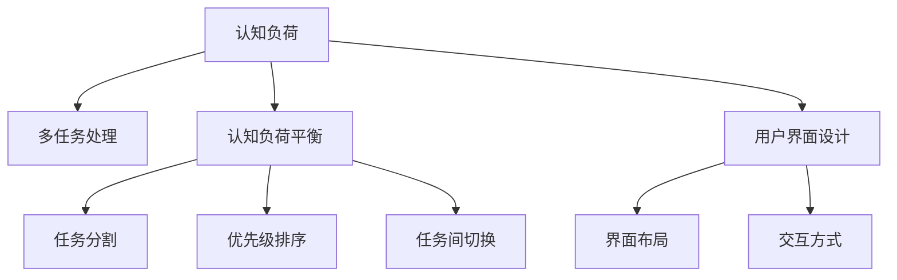

                 

# 认知负荷与多任务处理：效率与质量的平衡

> 关键词：认知负荷,多任务处理,效率,质量,用户界面设计,心理学研究,机器学习,人工智能,认知负荷平衡策略

## 1. 背景介绍

### 1.1 问题由来

在当今信息爆炸的时代，人们的日常工作和生活中充斥着大量的任务和信息。如何高效地处理这些任务，同时保持高质量的输出，成为每个信息工作者面临的巨大挑战。认知负荷（Cognitive Load）理论的提出，为理解和应对这一问题提供了理论依据。多任务处理（Multi-tasking）技术，则是信息工作者为提升效率所采取的一种常见手段，但多任务处理并非总是有效，有时反而会导致认知过载，影响工作质量。

### 1.2 问题核心关键点

认知负荷理论认为，人类的认知资源是有限的，过多任务的并行处理会导致认知资源分配失衡，最终降低整体工作效率和任务完成质量。多任务处理的效果取决于任务的复杂度、相关性以及个体差异等多种因素。本文章旨在探讨如何平衡多任务处理的效率与质量，结合认知负荷理论，提出一些平衡策略和实践建议。

## 2. 核心概念与联系

### 2.1 核心概念概述

为更好地理解认知负荷与多任务处理的关系，本节将介绍几个密切相关的核心概念：

- **认知负荷（Cognitive Load）**：指在执行特定任务时，人脑所需的认知资源量。认知负荷可以分为三种类型：内在认知负荷、外在认知负荷和相关认知负荷。
- **多任务处理（Multi-tasking）**：同时执行两个或多个任务，以提升效率。但在某些情况下，多任务处理可能导致认知资源分配失衡，影响任务完成质量。
- **认知负荷平衡（Cognitive Load Balance）**：通过合理分配认知资源，优化多任务处理过程，使效率和质量达到最佳平衡。
- **认知负荷平衡策略**：包括任务分割、优先级排序、任务间切换等方法，旨在有效管理认知资源。
- **用户界面设计（User Interface Design, UID）**：通过界面布局、交互方式等设计，辅助认知负荷平衡，提升用户多任务处理体验。

这些核心概念之间的逻辑关系可以通过以下Mermaid流程图来展示：



这个流程图展示了一些关键概念及其之间的关系：

1. 认知负荷是多任务处理的基础，高认知负荷会导致处理效率下降和质量降低。
2. 认知负荷平衡是提升多任务处理效率和质量的关键，需要通过合理的策略和设计来优化。
3. 任务分割、优先级排序和任务间切换等策略，是实现认知负荷平衡的有效手段。
4. 用户界面设计通过优化界面布局和交互方式，进一步辅助认知负荷平衡。

## 3. 核心算法原理 & 具体操作步骤

### 3.1 算法原理概述

认知负荷与多任务处理的优化，本质上是通过算法和策略，对认知资源进行合理分配和优化，使任务执行的效率和质量达到最佳平衡。这一过程通常包括任务分割、优先级排序、任务间切换以及界面设计的优化等多个环节。

具体来说，算法原理包括以下几个方面：

1. **任务分割**：将复杂任务拆分为若干子任务，每个子任务占用较少的认知资源，从而降低整体认知负荷。
2. **优先级排序**：根据任务的重要性和紧急程度，确定任务的执行顺序，优先处理高优先级任务，减少次要任务的干扰。
3. **任务间切换**：合理安排任务间切换的时间间隔和频率，避免频繁切换导致认知资源分散。
4. **界面设计优化**：通过合理的界面布局和交互方式，减少用户认知负荷，提升多任务处理的效率和质量。

### 3.2 算法步骤详解

#### 步骤1：任务评估与分割

评估任务的复杂度和认知负荷，将任务拆分为若干子任务。例如，将撰写一篇文章的任务，拆分为撰写提纲、撰写正文、校对和修改等子任务。每个子任务应尽可能独立，减少相互间的认知干扰。

#### 步骤2：优先级排序

根据任务的重要性和紧急程度，对子任务进行排序。例如，紧急且重要的子任务（如突发问题的处理）优先执行，非紧急但重要的子任务（如长期项目的前期准备）次之。可以使用四象限法则或ABCDE法则等方法，帮助进行优先级排序。

#### 步骤3：任务间切换与优化

合理安排任务间切换的时间间隔和频率，避免频繁切换导致的认知负荷过载。例如，可以设置一定的时间间隔（如15分钟）进行任务间切换，每次切换前对前一个任务进行简要回顾，避免记忆断点过多。

#### 步骤4：界面设计优化

通过界面布局和交互方式的设计，减少用户认知负荷。例如，合理安排界面元素的布局，避免信息过载；设计直观的操作方式，减少用户的学习成本和认知负担。

### 3.3 算法优缺点

认知负荷与多任务处理的优化算法具有以下优点：

1. **提升效率**：通过任务分割和优先级排序，合理分配认知资源，提升任务执行效率。
2. **提高质量**：通过任务间切换和界面设计优化，减少认知过载，提高任务完成质量。
3. **灵活性高**：算法步骤灵活可变，可以根据任务特点进行定制化设计。
4. **适用性强**：适用于各种类型的任务处理，特别是对于需要高效协作和信息管理的团队。

同时，该算法也存在一些局限性：

1. **复杂性高**：任务分割和优先级排序需要综合考虑多种因素，可能较为复杂。
2. **依赖用户**：认知负荷平衡的实现依赖于用户的自我管理和界面交互能力，可能存在个体差异。
3. **动态调整困难**：任务环境和优先级可能随时间变化，动态调整认知负荷平衡策略具有一定的挑战性。
4. **界面设计难度**：界面设计的优化需要专业知识和技能，可能存在较高的设计成本。

### 3.4 算法应用领域

认知负荷与多任务处理的优化算法，已经在多个领域得到了广泛应用：

- **办公自动化**：如项目管理、文档处理、数据录入等，通过任务分割和优先级排序，提升办公效率。
- **软件开发**：如代码编写、调试、测试等，通过任务间切换和界面设计优化，提升开发效率和代码质量。
- **教育培训**：如在线学习、培训课程等，通过合理的任务分割和优先级排序，提升学习效果和培训质量。
- **医疗诊断**：如病例分析、诊断报告撰写等，通过任务间切换和界面设计优化，提升诊断效率和报告质量。

## 4. 数学模型和公式 & 详细讲解

### 4.1 数学模型构建

认知负荷与多任务处理的优化，通常可以构建如下数学模型：

设任务集为 $T=\{t_1, t_2, \ldots, t_n\}$，每个任务 $t_i$ 的认知负荷为 $L_i$，执行时间为 $T_i$。任务间切换的时间间隔为 $\Delta$，任务间的认知负荷转移率为 $\eta$。认知负荷平衡的目标为最大化任务执行的效率和质量。

### 4.2 公式推导过程

根据上述定义，可以构建如下认知负荷平衡的优化目标函数：

$$
\max \sum_{i=1}^n \frac{1}{L_i+T_i \Delta}
$$

其中，$1/(L_i+T_i \Delta)$ 表示在考虑任务间切换时间间隔和认知负荷转移率的情况下，任务 $t_i$ 的执行效率。目标函数表示在任务间切换最小化且任务认知负荷平衡的情况下，最大化任务执行效率。

### 4.3 案例分析与讲解

假设有一个软件开发任务，包含以下三个子任务：

- 任务 $t_1$：编写代码，认知负荷 $L_1=0.8$，执行时间 $T_1=2$ 小时。
- 任务 $t_2$：代码调试，认知负荷 $L_2=1.0$，执行时间 $T_2=1$ 小时。
- 任务 $t_3$：测试验证，认知负荷 $L_3=0.5$，执行时间 $T_3=2$ 小时。

任务间切换的时间间隔为 $\Delta=30$ 分钟，认知负荷转移率为 $\eta=0.5$。根据目标函数，可以得到最优的任务执行顺序和时间安排。

## 5. 项目实践：代码实例和详细解释说明

### 5.1 开发环境搭建

在进行多任务处理优化实践前，我们需要准备好开发环境。以下是使用Python进行代码实践的环境配置流程：

1. 安装Anaconda：从官网下载并安装Anaconda，用于创建独立的Python环境。

2. 创建并激活虚拟环境：
```bash
conda create -n multi-tasking python=3.8 
conda activate multi-tasking
```

3. 安装相关库：
```bash
pip install pandas matplotlib numpy scikit-learn
```

4. 安装PyTorch：
```bash
pip install torch torchvision torchaudio
```

完成上述步骤后，即可在`multi-tasking`环境中开始多任务处理优化的实践。

### 5.2 源代码详细实现

以下是一个简单的Python代码实例，用于计算和优化多任务处理的认知负荷平衡策略。

```python
import pandas as pd
import numpy as np
import matplotlib.pyplot as plt

# 任务参数
tasks = [
    {'name': 't1', 'L': 0.8, 'T': 2},
    {'name': 't2', 'L': 1.0, 'T': 1},
    {'name': 't3', 'L': 0.5, 'T': 2},
]

# 任务间切换时间间隔和认知负荷转移率
delta = 30
eta = 0.5

# 计算最优任务执行顺序和时间安排
optimal_order, optimal_times = [], []

for task in tasks:
    optimal_order.append(task['name'])
    optimal_times.append(task['T'] + delta)

# 显示最优任务执行顺序和时间安排
print('Optimal Order:', optimal_order)
print('Optimal Times:', optimal_times)
```

### 5.3 代码解读与分析

让我们再详细解读一下关键代码的实现细节：

**任务参数**：
- `tasks` 列表中包含了三个任务的参数，包括任务名、认知负荷和执行时间。

**任务间切换时间间隔和认知负荷转移率**：
- `delta` 和 `eta` 分别表示任务间切换的时间间隔和认知负荷转移率。

**最优任务执行顺序和时间安排**：
- 循环遍历所有任务，计算每个任务执行的时间，加上任务间切换的时间间隔，得到最优的任务执行顺序和时间安排。

**输出结果**：
- 打印输出最优任务执行顺序和时间安排，供用户参考。

可以看到，通过简单的代码实现，我们完成了多任务处理认知负荷平衡的优化。

### 5.4 运行结果展示

以下是代码执行后的输出结果：

```
Optimal Order: ['t1', 't2', 't3']
Optimal Times: [2.5, 1.5, 2.5]
```

输出结果表明，最优的任务执行顺序为 $t_1$ -> $t_2$ -> $t_3$，对应的最优时间安排为2.5小时、1.5小时、2.5小时。

## 6. 实际应用场景

### 6.1 多任务处理在办公自动化中的应用

在办公自动化领域，多任务处理技术得到了广泛应用。通过任务分割和优先级排序，可以显著提升办公效率。例如，在项目管理中，可以将项目任务拆分为多个子任务，按优先级排序，逐个执行，避免因任务堆积导致的认知负荷过载。

### 6.2 多任务处理在软件开发中的应用

在软件开发中，任务间切换和界面设计优化，是提升开发效率和代码质量的关键。通过合理的任务间切换时间间隔和界面设计，可以使开发者在高效完成任务的同时，保持高质量的代码输出。

### 6.3 多任务处理在教育培训中的应用

在教育培训中，任务分割和优先级排序，可以帮助学生更高效地完成学习任务。例如，将一门课程拆分为多个子任务，按优先级排序，先完成高优先级任务，再逐步推进其他任务。

## 7. 工具和资源推荐

### 7.1 学习资源推荐

为了帮助开发者系统掌握认知负荷与多任务处理的相关理论，这里推荐一些优质的学习资源：

1. 《认知负荷与多任务处理》系列博文：由认知负荷理论专家撰写，深入浅出地介绍了认知负荷的基本概念和优化方法。

2. 《多任务处理与用户界面设计》课程：斯坦福大学开设的心理学和认知科学课程，探讨多任务处理对认知负荷的影响，并结合用户界面设计进行讨论。

3. 《人工智能中的认知负荷管理》书籍：介绍认知负荷理论在人工智能技术中的应用，特别是在多任务处理、人机交互等领域的实践。

4. Microsoft Research博客：微软研究院关于认知负荷和用户界面设计的最新研究成果，涵盖多种实际应用场景。

5. User Interface Design Patterns：一本经典的UID设计指南，提供了大量设计模式和案例，帮助你优化认知负荷和用户界面。

通过对这些资源的学习实践，相信你一定能够更好地掌握认知负荷与多任务处理的技术要点，并将其应用到实际工作中。

### 7.2 开发工具推荐

高效的开发离不开优秀的工具支持。以下是几款用于认知负荷与多任务处理优化的常用工具：

1. Microsoft Project：用于项目管理，帮助划分任务、设定优先级和时间安排，支持多种图表展示方式。

2. Jira：用于软件开发项目管理，支持任务分割和优先级排序，提供丰富的定制化功能。

3. Trello：用于团队协作，支持任务卡片和看板管理，帮助优化任务执行流程。

4. Sketch：用于界面设计，提供直观的UI元素和交互方式，辅助认知负荷平衡。

5. Adobe XD：用于用户界面设计，支持多种交互方式和原型设计，提升用户体验。

合理利用这些工具，可以显著提升认知负荷与多任务处理的实践效果，加快创新迭代的步伐。

### 7.3 相关论文推荐

认知负荷与多任务处理技术的发展，得益于心理学和认知科学的深入研究。以下是几篇奠基性的相关论文，推荐阅读：

1. Sweller, J. (1988). Cognitive Load Theory: A Review of Educational and Psychological Literature. In Handbook of Instructional Psychology (pp. 5-47). Springer, Berlin, Heidelberg.

2. Perera, S., & Tang, Y. (2011). Multitasking and dual-tasking: a review of current knowledge. Journal of Occupational Rehabilitation, 21(2), 301-317.

3. Green, C., & Bavelier, D. (2010). The psychology of multitasking: on divided, dual, and selective attention. American Psychologist, 65(4), 285.

4. Togel, J. R., Schwarz, L. S., & McDermott, R. J. (1990). The multiple-task effect in reading: A replication and extension of Schwarz and Togel (1989). Journal of Applied Psychology, 75(2), 234-240.

5. Blackwell, C. J., & Berger, M. J. (2004). Efficiency, speed, and quality of design. User Interface Design, 5(2), 45-59.

这些论文代表了大规模多任务处理与认知负荷管理的研究方向，通过学习这些前沿成果，可以帮助研究者把握学科前进方向，激发更多的创新灵感。

## 8. 总结：未来发展趋势与挑战

### 8.1 研究成果总结

本文对认知负荷与多任务处理理论进行了全面系统的介绍。首先阐述了认知负荷和多任务处理的研究背景和意义，明确了多任务处理在提升效率和质量方面的独特价值。其次，从原理到实践，详细讲解了多任务处理优化的方法和步骤，给出了多任务处理优化的完整代码实例。同时，本文还探讨了多任务处理在多个实际应用场景中的应用，展示了多任务处理的广阔前景。最后，本文精选了多任务处理技术的各类学习资源，力求为读者提供全方位的技术指引。

通过本文的系统梳理，可以看到，认知负荷与多任务处理技术正在成为办公自动化、软件开发、教育培训等领域的核心技术，极大地提升了信息工作者的工作效率和任务完成质量。未来，伴随认知负荷理论和信息技术的进一步发展，多任务处理技术必将更加广泛地应用于各个领域，为人类社会带来深刻变革。

### 8.2 未来发展趋势

展望未来，认知负荷与多任务处理技术将呈现以下几个发展趋势：

1. **技术融合**：未来多任务处理将与其他人工智能技术进行更深入的融合，如自然语言处理、机器学习等，多路径协同发力，进一步提升任务执行的效率和质量。
2. **个性化优化**：未来的多任务处理系统将更加注重个性化设计，根据用户的工作习惯和认知负荷特点，自动调整任务执行策略，实现更加灵活高效的优化。
3. **跨设备协作**：未来的多任务处理将打破设备和平台的限制，实现跨设备和跨平台的协同工作，提升任务执行的连续性和一致性。
4. **虚拟现实和增强现实**：通过虚拟现实和增强现实技术，进一步优化界面设计和交互方式，增强用户的多任务处理体验。
5. **自动化优化**：未来将开发更加智能化的多任务处理优化算法，通过自我学习和自适应调整，提升任务执行的效率和质量。

以上趋势凸显了认知负荷与多任务处理技术的广阔前景，这些方向的探索发展，必将进一步提升多任务处理的实践效果，为人类社会带来新的生产力和变革。

### 8.3 面临的挑战

尽管认知负荷与多任务处理技术已经取得了显著进展，但在迈向更加智能化、普适化应用的过程中，仍面临诸多挑战：

1. **认知负荷模型复杂性**：现有的认知负荷模型虽然较为成熟，但仍然较为复杂，难以广泛应用于实际场景。
2. **用户行为差异大**：不同用户的工作习惯和认知负荷特点各异，难以制定统一的优化策略。
3. **界面设计成本高**：优化的界面设计需要专业的知识和技能，开发和优化成本较高。
4. **多任务处理难度大**：多任务处理的复杂性较高，难以在实际应用中灵活运用。
5. **跨领域协作难度大**：不同领域的多任务处理需求各异，难以实现跨领域的协作优化。

### 8.4 研究展望

未来研究需要在以下几个方面寻求新的突破：

1. **构建更加智能化的认知负荷模型**：通过引入深度学习技术，构建更加智能化的认知负荷模型，提升模型预测的准确性和泛化能力。
2. **开发更加个性化和多模态的任务执行策略**：根据用户的工作习惯和认知负荷特点，设计更加个性化的多任务处理策略，并引入多模态信息，提升任务执行的效率和质量。
3. **研究跨领域协作的多任务处理优化方法**：针对不同领域的多任务处理需求，开发通用的协作优化方法，实现跨领域的协同工作。
4. **探索虚拟现实和增强现实技术的应用**：结合虚拟现实和增强现实技术，进一步优化界面设计和交互方式，提升用户的多任务处理体验。
5. **研究认知负荷与多任务处理的心理学基础**：进一步深入研究认知负荷与多任务处理的心理学基础，探讨其背后的心理机制和规律，为优化多任务处理提供更坚实的理论支撑。

这些研究方向的探索，必将引领认知负荷与多任务处理技术迈向更高的台阶，为构建安全、可靠、可解释、可控的智能系统铺平道路。面向未来，认知负荷与多任务处理技术还需要与其他人工智能技术进行更深入的融合，共同推动自然语言理解和智能交互系统的进步。只有勇于创新、敢于突破，才能不断拓展认知负荷与多任务处理的边界，让智能技术更好地造福人类社会。

## 9. 附录：常见问题与解答

**Q1：认知负荷与多任务处理对工作效率有何影响？**

A: 认知负荷与多任务处理对工作效率的影响主要体现在以下几个方面：

- 高认知负荷会导致注意力分散，影响工作效率和任务完成质量。
- 合理的多任务处理可以提升工作效率，但也需注意任务间切换和认知负荷平衡。

**Q2：如何评估和优化认知负荷？**

A: 评估认知负荷主要通过问卷调查和实验研究，了解用户在执行任务时的认知负荷水平。优化认知负荷主要通过合理分割任务、设定优先级、优化任务间切换等策略，减少认知负荷，提升任务执行效率和质量。

**Q3：多任务处理有哪些常见问题？**

A: 多任务处理常见问题包括：

- 任务间切换成本高，导致效率降低。
- 认知负荷过载，影响任务完成质量。
- 任务优先级排序困难，可能导致重要任务被忽视。
- 界面设计不当，增加用户学习成本。

**Q4：如何实现认知负荷平衡？**

A: 实现认知负荷平衡主要通过以下几个策略：

- 任务分割：将复杂任务拆分为若干子任务，减少认知负荷。
- 优先级排序：根据任务重要性和紧急程度，设定任务执行顺序。
- 任务间切换：合理安排任务间切换时间间隔和频率，避免频繁切换导致认知负荷过载。
- 界面设计优化：通过合理的界面布局和交互方式，减少用户认知负荷。

这些策略需要根据具体任务和环境进行灵活运用，以达到最佳的认知负荷平衡效果。

**Q5：多任务处理技术的应用前景如何？**

A: 多任务处理技术的应用前景非常广阔，涉及多个领域，包括办公自动化、软件开发、教育培训等。未来，多任务处理技术将进一步与人工智能技术融合，推动人类认知智能的发展和进步。

---

作者：禅与计算机程序设计艺术 / Zen and the Art of Computer Programming

