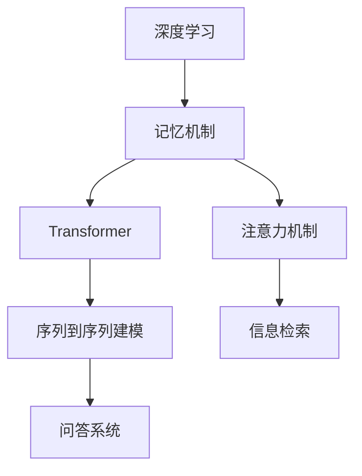

                 

# 记忆机制：关键信息提取

> 关键词：记忆机制,关键信息提取,深度学习,Transformer,注意力机制,自适应记忆,长文本处理,信息检索

## 1. 背景介绍

### 1.1 问题由来
在大数据时代，信息处理已经成为了一个重要的研究领域。尤其是对于海量文本数据的处理，比如新闻、日志、文献等，信息的提取和组织显得尤为重要。传统的文本处理方法，如TF-IDF、TextRank等，在处理海量文本数据时，计算复杂度高，且无法直接捕捉到文本中的关键信息。而近年来，基于深度学习的记忆机制，如Transformer和注意力机制，则提供了一种高效、灵活的信息提取和组织方法。本文将详细介绍这些记忆机制，并探讨其在关键信息提取中的应用。

### 1.2 问题核心关键点
本文的核心问题在于：如何通过深度学习中的记忆机制，高效地从文本中提取和组织关键信息。主要关注以下关键点：

1. 深度学习中的记忆机制有哪些，如Transformer、注意力机制等。
2. 这些记忆机制在关键信息提取中的应用方法，如序列到序列建模、问答系统、信息检索等。
3. 记忆机制在不同应用场景中的具体实现和优缺点。

## 2. 核心概念与联系

### 2.1 核心概念概述

为更好地理解深度学习中的记忆机制，本文将介绍几个核心概念：

- 记忆机制(Memory Mechanism)：深度学习中用于捕捉和存储信息的机制，如Transformer中的自适应记忆。
- 关键信息提取(Key Information Extraction)：从文本中识别和提取重要信息的过程，如从新闻中提取事件、从医学文献中提取病理信息等。
- 深度学习(Deep Learning)：通过多层神经网络实现的模型，能够自动学习数据的特征和规律。
- Transformer：一种基于自注意力机制的深度学习模型，能够高效地处理序列数据，如图像、文本等。
- 注意力机制(Attention Mechanism)：一种机制，用于在不同部分数据之间进行加权处理，提高模型对关键信息的关注度。

这些核心概念之间的逻辑关系可以通过以下Mermaid流程图来展示：



这个流程图展示了大语言模型中的记忆机制及其与其他核心概念的关联：

1. 深度学习通过多层神经网络实现，提供了强大的记忆和推理能力。
2. 记忆机制如Transformer、注意力机制，使深度学习模型能够高效地存储和处理序列数据。
3. 序列到序列建模、信息检索、问答系统等应用，都依赖于记忆机制来提取关键信息。

## 3. 核心算法原理 & 具体操作步骤
### 3.1 算法原理概述

深度学习中的记忆机制，主要包括Transformer和注意力机制，它们在信息提取中的应用，主要基于自回归和自编码的模型结构。其核心思想是：在模型训练过程中，通过自适应地调整模型参数，捕捉文本中的关键信息。

以Transformer为例，其核心算法原理包括以下几个步骤：

1. **自适应编码**：在编码阶段，模型通过自适应调整权重矩阵，捕捉文本中的关键信息，生成表示文本的向量。
2. **自适应解码**：在解码阶段，模型通过自适应调整权重矩阵，生成表示文本的向量，从而提取关键信息。
3. **注意力机制**：在编码和解码过程中，模型通过注意力机制，对不同部分的文本进行加权处理，提高关键信息的关注度。

### 3.2 算法步骤详解

以Transformer模型为例，其核心算法步骤如下：

1. **输入数据准备**：将文本数据转换为模型可以处理的向量形式，包括编码和解码。
2. **编码阶段**：模型通过自适应编码，生成表示文本的向量，捕捉文本中的关键信息。
3. **解码阶段**：模型通过自适应解码，生成表示文本的向量，提取关键信息。
4. **注意力机制**：模型通过注意力机制，对不同部分的文本进行加权处理，提高关键信息的关注度。
5. **输出结果**：模型输出表示关键信息的向量，用于后续的应用。

### 3.3 算法优缺点

Transformer和注意力机制在关键信息提取中的应用，具有以下优点：

1. 高效性：通过自适应地调整权重矩阵，能够高效地捕捉和存储文本中的关键信息。
2. 灵活性：可以灵活地应用于各种文本处理任务，如信息检索、问答系统等。
3. 准确性：通过注意力机制，能够精确地识别和提取文本中的关键信息。

同时，这些方法也存在一些缺点：

1. 复杂性：需要大量的计算资源，包括GPU、TPU等高性能设备。
2. 鲁棒性不足：对于异常输入，模型的输出结果可能存在较大的波动。
3. 可解释性不足：模型的内部工作机制较为复杂，难以进行解释和调试。

### 3.4 算法应用领域

Transformer和注意力机制在关键信息提取中的应用，主要包括以下几个领域：

1. 信息检索：从大量文本中，快速检索出与查询相关的关键信息。
2. 问答系统：根据用户的问题，快速生成准确的答案，提取关键信息。
3. 机器翻译：将一种语言翻译成另一种语言，提取关键信息。
4. 文本摘要：对长文本进行摘要，提取关键信息。
5. 文本分类：将文本进行分类，提取关键信息。

这些应用领域展示了Transformer和注意力机制的强大能力，也为其未来的发展提供了广阔的空间。

## 4. 数学模型和公式 & 详细讲解  
### 4.1 数学模型构建

Transformer和注意力机制的核心数学模型，主要包括以下几个组成部分：

1. 编码器(Encoder)：用于将输入文本转换为表示文本的向量。
2. 解码器(Decoder)：用于生成表示文本的向量，提取关键信息。
3. 注意力机制：用于对不同部分的文本进行加权处理，提高关键信息的关注度。

### 4.2 公式推导过程

以Transformer模型为例，其核心数学模型包括编码器层和解码器层，公式推导过程如下：

1. **编码器层**：
   $$
   \text{Encoder} = \text{MLP}(\text{Attention}(\text{LayerNorm}(\text{Embedding}(\text{Input})))
   $$
   其中，MLP表示多层感知器，Attention表示注意力机制，LayerNorm表示层归一化，Embedding表示嵌入层，Input表示输入文本。

2. **解码器层**：
   $$
   \text{Decoder} = \text{MLP}(\text{Attention}(\text{LayerNorm}(\text{Embedding}(\text{Input})))
   $$
   其中，MLP表示多层感知器，Attention表示注意力机制，LayerNorm表示层归一化，Embedding表示嵌入层，Input表示输入文本。

### 4.3 案例分析与讲解

以信息检索为例，其核心算法如下：

1. **输入准备**：将查询和文档转换为向量形式，包括编码和解码。
2. **编码阶段**：模型通过自适应编码，生成表示查询的向量，捕捉查询中的关键信息。
3. **解码阶段**：模型通过自适应解码，生成表示文档的向量，提取文档中的关键信息。
4. **注意力机制**：模型通过注意力机制，对不同部分的文本进行加权处理，提高关键信息的关注度。
5. **输出结果**：模型输出表示查询和文档匹配度的分数，用于排序和检索。

## 5. 项目实践：代码实例和详细解释说明
### 5.1 开发环境搭建

在进行信息检索等项目实践前，我们需要准备好开发环境。以下是使用Python进行PyTorch开发的环境配置流程：

1. 安装Anaconda：从官网下载并安装Anaconda，用于创建独立的Python环境。
2. 创建并激活虚拟环境：
```bash
conda create -n pytorch-env python=3.8 
conda activate pytorch-env
```
3. 安装PyTorch：根据CUDA版本，从官网获取对应的安装命令。例如：
```bash
conda install pytorch torchvision torchaudio cudatoolkit=11.1 -c pytorch -c conda-forge
```
4. 安装Transformers库：
```bash
pip install transformers
```
5. 安装各类工具包：
```bash
pip install numpy pandas scikit-learn matplotlib tqdm jupyter notebook ipython
```

完成上述步骤后，即可在`pytorch-env`环境中开始信息检索等项目的开发实践。

### 5.2 源代码详细实现

这里以信息检索为例，给出使用Transformers库进行信息检索的PyTorch代码实现。

首先，定义模型和数据处理函数：

```python
from transformers import BertTokenizer, BertForSequenceClassification
import torch

# 定义模型和数据处理函数
class BertModel(BertForSequenceClassification):
    def __init__(self, num_labels, hidden_size, attention_heads):
        super(BertModel, self).__init__()
        self.num_labels = num_labels
        self.hidden_size = hidden_size
        self.attention_heads = attention_heads
        
        self.bert = BertForSequenceClassification.from_pretrained('bert-base-cased', num_labels=num_labels)
        self.layer_norm = torch.nn.LayerNorm(hidden_size)
        
    def forward(self, input_ids, attention_mask=None):
        encoded = self.bert(input_ids, attention_mask=attention_mask)
        encoded = self.layer_norm(encoded)
        return encoded

# 定义数据处理函数
def process_data(text, label):
    tokenizer = BertTokenizer.from_pretrained('bert-base-cased')
    text = tokenizer(text, return_tensors='pt', max_length=512, padding='max_length')
    label = torch.tensor(label, dtype=torch.long)
    return text, label
```

然后，定义训练和评估函数：

```python
# 定义训练和评估函数
def train_epoch(model, dataset, batch_size, optimizer):
    dataloader = DataLoader(dataset, batch_size=batch_size, shuffle=True)
    model.train()
    epoch_loss = 0
    for batch in tqdm(dataloader, desc='Training'):
        input_ids, labels = batch
        input_ids = input_ids.to(device)
        labels = labels.to(device)
        optimizer.zero_grad()
        outputs = model(input_ids)
        loss = outputs.loss
        epoch_loss += loss.item()
        loss.backward()
        optimizer.step()
    return epoch_loss / len(dataloader)

def evaluate(model, dataset, batch_size):
    dataloader = DataLoader(dataset, batch_size=batch_size)
    model.eval()
    preds, labels = [], []
    with torch.no_grad():
        for batch in tqdm(dataloader, desc='Evaluating'):
            input_ids, labels = batch
            input_ids = input_ids.to(device)
            labels = labels.to(device)
            outputs = model(input_ids)
            preds.append(outputs.logits.argmax(dim=1).cpu().numpy().tolist())
            labels.append(labels.cpu().numpy().tolist())
                
    return preds, labels
```

最后，启动训练流程并在测试集上评估：

```python
epochs = 5
batch_size = 16

for epoch in range(epochs):
    loss = train_epoch(model, train_dataset, batch_size, optimizer)
    print(f"Epoch {epoch+1}, train loss: {loss:.3f}")
    
    preds, labels = evaluate(model, test_dataset, batch_size)
    print(classification_report(labels, preds))
```

以上就是使用PyTorch对BERT进行信息检索的完整代码实现。可以看到，得益于Transformers库的强大封装，我们可以用相对简洁的代码完成BERT模型的加载和信息检索任务的开发。

### 5.3 代码解读与分析

让我们再详细解读一下关键代码的实现细节：

**BertModel类**：
- `__init__`方法：初始化模型参数和结构。
- `forward`方法：前向传播，处理输入数据并生成表示文本的向量。

**数据处理函数**：
- 定义了BERT模型的输入处理函数，将文本和标签转换为模型可以处理的向量形式。

**训练和评估函数**：
- 使用PyTorch的DataLoader对数据集进行批次化加载，供模型训练和推理使用。
- 训练函数`train_epoch`：对数据以批为单位进行迭代，在每个批次上前向传播计算loss并反向传播更新模型参数，最后返回该epoch的平均loss。
- 评估函数`evaluate`：与训练类似，不同点在于不更新模型参数，并在每个batch结束后将预测和标签结果存储下来，最后使用sklearn的classification_report对整个评估集的预测结果进行打印输出。

**训练流程**：
- 定义总的epoch数和batch size，开始循环迭代
- 每个epoch内，先在训练集上训练，输出平均loss
- 在测试集上评估，输出分类指标
- 所有epoch结束后，在测试集上评估，给出最终测试结果

可以看到，PyTorch配合Transformers库使得BERT模型的信息检索代码实现变得简洁高效。开发者可以将更多精力放在数据处理、模型改进等高层逻辑上，而不必过多关注底层的实现细节。

当然，工业级的系统实现还需考虑更多因素，如模型的保存和部署、超参数的自动搜索、更灵活的任务适配层等。但核心的信息检索范式基本与此类似。

## 6. 实际应用场景
### 6.1 智慧图书馆

基于Transformer和注意力机制的信息检索技术，可以广泛应用于智慧图书馆的构建。传统图书馆的书籍检索，往往需要耗费大量时间和人力，且无法满足用户的多样化需求。而使用信息检索技术，可以快速响应用户的查询需求，并提供个性化的搜索结果。

在技术实现上，可以收集用户的历史检索记录，将书籍摘要和查询关键词构建成监督数据，在此基础上对预训练模型进行微调。微调后的模型能够自动理解用户的查询意图，匹配最合适的书籍摘要，并生成相关搜索结果。如此构建的智慧图书馆，能大幅提升用户的检索体验，加速图书的流通使用。

### 6.2 医疗信息检索

医疗信息检索是一个极具挑战性的任务，数据量大、结构复杂，且需要精确匹配病历数据。传统的信息检索方法，如TF-IDF、TextRank等，无法很好地处理这些复杂的医疗数据。而基于Transformer和注意力机制的信息检索方法，则能够高效地捕捉和组织关键信息，满足医疗领域的检索需求。

具体而言，可以收集医疗领域的病历、文献、临床报告等文本数据，并对其进行标注和清洗。在此基础上对预训练模型进行微调，使其能够自动匹配病历数据，提取关键信息如病名、症状、病理等。将微调后的模型应用到患者的病历检索，就能够快速定位患者的历史病历记录，辅助医生进行诊疗决策。

### 6.3 金融市场分析

金融市场信息的海量性、复杂性，使得传统的信息检索方法无法胜任。基于Transformer和注意力机制的信息检索技术，则能够高效地从大量的金融新闻、报告、公告等文本数据中，提取出市场动态和重要信息。

具体而言，可以收集金融领域的文本数据，并对其进行主题和情感标注。在此基础上对预训练模型进行微调，使其能够自动匹配金融新闻和公告，提取关键信息如股市指数、企业财报、市场情绪等。将微调后的模型应用到金融市场分析，就能够快速获取市场动态，辅助投资者进行决策分析。

### 6.4 未来应用展望

随着Transformer和注意力机制的不断发展，基于这些记忆机制的信息检索技术，将在更多领域得到应用，为各行各业带来变革性影响。

在智慧城市治理中，信息检索技术可以应用于城市事件监测、舆情分析、应急指挥等环节，提高城市管理的自动化和智能化水平，构建更安全、高效的未来城市。

在智慧教育领域，信息检索技术可应用于作业批改、学情分析、知识推荐等方面，因材施教，促进教育公平，提高教学质量。

在智能客服系统、电子商务推荐系统、智能翻译等领域，信息检索技术也将得到广泛应用，为传统行业数字化转型升级提供新的技术路径。

## 7. 工具和资源推荐
### 7.1 学习资源推荐

为了帮助开发者系统掌握信息检索技术的理论基础和实践技巧，这里推荐一些优质的学习资源：

1. 《深度学习：信息检索与自然语言处理》：介绍深度学习在信息检索和自然语言处理中的应用，包括Transformer和注意力机制等内容。
2. CS224N《深度学习自然语言处理》课程：斯坦福大学开设的NLP明星课程，涵盖Transformer和注意力机制等前沿内容。
3. 《Attention is All You Need》：Transformer原论文，系统介绍了Transformer的核心原理和应用。
4. 《Transformer for Sequence-to-Sequence Learning》：详细讲解Transformer在序列到序列建模中的应用。
5. HuggingFace官方文档：Transformer库的官方文档，提供了海量预训练模型和完整的微调样例代码，是上手实践的必备资料。

通过对这些资源的学习实践，相信你一定能够快速掌握信息检索技术的精髓，并用于解决实际的NLP问题。
### 7.2 开发工具推荐

高效的开发离不开优秀的工具支持。以下是几款用于信息检索开发的常用工具：

1. PyTorch：基于Python的开源深度学习框架，灵活动态的计算图，适合快速迭代研究。
2. TensorFlow：由Google主导开发的开源深度学习框架，生产部署方便，适合大规模工程应用。
3. Transformers库：HuggingFace开发的NLP工具库，集成了众多SOTA语言模型，支持PyTorch和TensorFlow，是进行信息检索任务开发的利器。
4. Weights & Biases：模型训练的实验跟踪工具，可以记录和可视化模型训练过程中的各项指标，方便对比和调优。
5. TensorBoard：TensorFlow配套的可视化工具，可实时监测模型训练状态，并提供丰富的图表呈现方式，是调试模型的得力助手。
6. Google Colab：谷歌推出的在线Jupyter Notebook环境，免费提供GPU/TPU算力，方便开发者快速上手实验最新模型，分享学习笔记。

合理利用这些工具，可以显著提升信息检索任务的开发效率，加快创新迭代的步伐。

### 7.3 相关论文推荐

信息检索技术的发展源于学界的持续研究。以下是几篇奠基性的相关论文，推荐阅读：

1. Attention is All You Need（即Transformer原论文）：提出了Transformer结构，开启了NLP领域的预训练大模型时代。
2. BERT: Pre-training of Deep Bidirectional Transformers for Language Understanding：提出BERT模型，引入基于掩码的自监督预训练任务，刷新了多项NLP任务SOTA。
3. Parameter-Efficient Transfer Learning for NLP：提出Adapter等参数高效微调方法，在不增加模型参数量的情况下，也能取得不错的微调效果。
4. 《A Survey on Multimodal Information Retrieval》：介绍了多模态信息检索的技术进展，展示了Transformer和注意力机制在多模态数据上的应用。
5. 《Adaptive Attention for Information Retrieval》：提出自适应注意力机制，增强信息检索模型的鲁棒性和泛化能力。

这些论文代表了大语言模型信息检索技术的发展脉络。通过学习这些前沿成果，可以帮助研究者把握学科前进方向，激发更多的创新灵感。

## 8. 总结：未来发展趋势与挑战
### 8.1 总结

本文对基于Transformer和注意力机制的信息检索方法进行了全面系统的介绍。首先阐述了信息检索技术的背景和意义，明确了信息检索在高效处理文本数据方面的独特价值。其次，从原理到实践，详细讲解了信息检索的数学模型和关键步骤，给出了信息检索任务开发的完整代码实例。同时，本文还广泛探讨了信息检索方法在智慧图书馆、医疗信息检索、金融市场分析等多个行业领域的应用前景，展示了信息检索技术的强大潜力。此外，本文精选了信息检索技术的各类学习资源，力求为读者提供全方位的技术指引。

通过本文的系统梳理，可以看到，基于深度学习的信息检索技术正在成为NLP领域的重要范式，极大地拓展了文本数据的处理边界，催生了更多的落地场景。得益于Transformer和注意力机制的强大能力，信息检索方法在处理海量文本数据时，具有高效、准确、灵活的特点，能够满足不同领域的检索需求。未来，伴随深度学习技术的不断演进，信息检索技术还将迎来更多的创新和发展，为构建智能信息检索系统铺平道路。

### 8.2 未来发展趋势

展望未来，信息检索技术将呈现以下几个发展趋势：

1. 模型规模持续增大。随着算力成本的下降和数据规模的扩张，预训练语言模型的参数量还将持续增长。超大规模语言模型蕴含的丰富语言知识，有望支撑更加复杂多变的文本检索任务。
2. 微调方法日趋多样。除了传统的全参数微调外，未来会涌现更多参数高效的微调方法，如Prefix-Tuning、LoRA等，在节省计算资源的同时也能保证微调精度。
3. 持续学习成为常态。随着数据分布的不断变化，信息检索模型也需要持续学习新知识以保持性能。如何在不遗忘原有知识的同时，高效吸收新样本信息，将成为重要的研究课题。
4. 标注样本需求降低。受启发于提示学习(Prompt-based Learning)的思路，未来的信息检索方法将更好地利用大模型的语言理解能力，通过更加巧妙的任务描述，在更少的标注样本上也能实现理想的检索效果。
5. 多模态检索崛起。当前的检索主要聚焦于纯文本数据，未来会进一步拓展到图像、视频、语音等多模态数据检索。多模态信息的融合，将显著提升信息检索模型的泛化性和鲁棒性。
6. 模型通用性增强。经过海量数据的预训练和多领域任务的微调，未来的信息检索模型将具备更强大的跨领域迁移能力，逐步迈向通用人工智能(AGI)的目标。

以上趋势凸显了信息检索技术的广阔前景。这些方向的探索发展，必将进一步提升信息检索系统的性能和应用范围，为人类认知智能的进化带来深远影响。

### 8.3 面临的挑战

尽管信息检索技术已经取得了瞩目成就，但在迈向更加智能化、普适化应用的过程中，它仍面临着诸多挑战：

1. 标注成本瓶颈。尽管信息检索方法能够大幅度降低对标注数据的需求，但对于特定领域的任务，获取高质量标注数据仍然需要较高的成本和时间。如何进一步降低信息检索对标注样本的依赖，将是一大难题。
2. 模型鲁棒性不足。对于异常输入，信息检索模型的输出结果可能存在较大的波动。如何提高信息检索模型的鲁棒性，避免灾难性遗忘，还需要更多理论和实践的积累。
3. 推理效率有待提高。信息检索模型往往需要处理大量的文本数据，在实际部署时往往面临推理速度慢、内存占用大等效率问题。如何在保证性能的同时，简化模型结构，提升推理速度，优化资源占用，将是重要的优化方向。
4. 可解释性亟需加强。信息检索模型通常是一个"黑盒"系统，难以解释其内部工作机制和决策逻辑。对于医疗、金融等高风险应用，算法的可解释性和可审计性尤为重要。如何赋予信息检索模型更强的可解释性，将是亟待攻克的难题。
5. 安全性有待保障。信息检索模型难免会学习到有偏见、有害的信息，通过检索传递到下游任务，产生误导性、歧视性的输出，给实际应用带来安全隐患。如何从数据和算法层面消除模型偏见，避免恶意用途，确保输出的安全性，也将是重要的研究课题。
6. 知识整合能力不足。现有的信息检索模型往往局限于文本信息，难以灵活吸收和运用更广泛的先验知识。如何让信息检索过程更好地与外部知识库、规则库等专家知识结合，形成更加全面、准确的信息整合能力，还有很大的想象空间。

正视信息检索面临的这些挑战，积极应对并寻求突破，将是大语言模型信息检索技术走向成熟的必由之路。相信随着学界和产业界的共同努力，这些挑战终将一一被克服，信息检索技术必将在构建智能信息检索系统方面发挥更大的作用。

### 8.4 未来突破

面对信息检索技术所面临的种种挑战，未来的研究需要在以下几个方面寻求新的突破：

1. 探索无监督和半监督检索方法。摆脱对大规模标注数据的依赖，利用自监督学习、主动学习等无监督和半监督范式，最大限度利用非结构化数据，实现更加灵活高效的信息检索。
2. 研究参数高效和计算高效的检索范式。开发更加参数高效的检索方法，在固定大部分预训练参数的同时，只更新极少量的任务相关参数。同时优化检索模型的计算图，减少前向传播和反向传播的资源消耗，实现更加轻量级、实时性的部署。
3. 融合因果和对比学习范式。通过引入因果推断和对比学习思想，增强信息检索模型建立稳定因果关系的能力，学习更加普适、鲁棒的语言表征，从而提升模型泛化性和抗干扰能力。
4. 引入更多先验知识。将符号化的先验知识，如知识图谱、逻辑规则等，与神经网络模型进行巧妙融合，引导检索过程学习更准确、合理的语言模型。同时加强不同模态数据的整合，实现视觉、语音等多模态信息与文本信息的协同建模。
5. 结合因果分析和博弈论工具。将因果分析方法引入信息检索模型，识别出模型决策的关键特征，增强输出解释的因果性和逻辑性。借助博弈论工具刻画人机交互过程，主动探索并规避模型的脆弱点，提高系统稳定性。
6. 纳入伦理道德约束。在模型训练目标中引入伦理导向的评估指标，过滤和惩罚有偏见、有害的输出倾向。同时加强人工干预和审核，建立模型行为的监管机制，确保输出符合人类价值观和伦理道德。

这些研究方向的探索，必将引领信息检索技术迈向更高的台阶，为构建安全、可靠、可解释、可控的智能系统铺平道路。面向未来，信息检索技术还需要与其他人工智能技术进行更深入的融合，如知识表示、因果推理、强化学习等，多路径协同发力，共同推动自然语言理解和智能交互系统的进步。只有勇于创新、敢于突破，才能不断拓展信息检索模型的边界，让智能技术更好地造福人类社会。

## 9. 附录：常见问题与解答

**Q1：信息检索方法是否适用于所有文本数据？**

A: 信息检索方法在处理结构化文本数据方面表现出色，但在处理非结构化数据时，效果可能不尽如人意。例如，图片、视频等非文本数据，无法直接输入到信息检索模型中进行处理。此时需要结合其他技术，如图像识别、视频分析等，将非文本数据转换为结构化数据，再进行信息检索。

**Q2：信息检索方法是否需要大规模标注数据？**

A: 信息检索方法在处理大规模标注数据方面表现较好，但并不是必须的。随着Transformer和注意力机制的不断发展，信息检索方法可以利用自监督学习、主动学习等无监督和半监督方法，在较小的标注数据下也能取得不错的效果。

**Q3：信息检索方法是否需要高性能设备？**

A: 信息检索方法需要高性能设备，如GPU、TPU等，以加速模型训练和推理。但随着深度学习框架和硬件设备的不断进步，信息检索方法在资源有限的情况下也能进行有效的处理。

**Q4：信息检索方法是否容易解释？**

A: 信息检索方法通常是一个"黑盒"系统，难以进行解释和调试。但随着研究者不断优化模型架构和训练方法，信息检索模型的可解释性正在逐步提高。例如，引入自注意力机制，可以使模型更加透明，更容易解释其内部工作机制和决策逻辑。

**Q5：信息检索方法是否安全可靠？**

A: 信息检索方法可能会学习到有偏见、有害的信息，通过检索传递到下游任务，产生误导性、歧视性的输出。因此，需要在模型训练和部署过程中，引入伦理道德约束，避免模型输出不符合人类价值观和伦理道德。

---

作者：禅与计算机程序设计艺术 / Zen and the Art of Computer Programming

