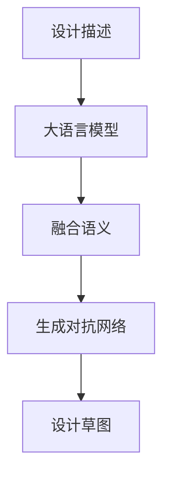

                 

# 设计合作者：LLM 激发视觉创新

> 关键词：Large Language Model (LLM), 视觉理解与生成, 跨模态学习, 自然语言处理与计算机视觉融合, 视觉数据增强, 图像生成与优化

## 1. 背景介绍

### 1.1 问题由来
在当今信息化时代，视觉数据在各个领域中占据了重要地位，从社交媒体到电子商务，从智能监控到自动驾驶，视觉数据的处理与分析日益成为关键技术。然而，视觉数据的复杂性和多样性，使得传统的计算机视觉(CV)方法面临着诸多挑战。如何有效地利用大规模语言模型(Large Language Model, LLM)激发视觉数据的深层理解与生成，成为当前研究的热点之一。

### 1.2 问题核心关键点
视觉与语言融合的创新点在于，如何设计一个能够理解并生成自然语言描述的视觉模型，以及如何将大语言模型应用于视觉数据处理中。这一问题涉及到以下几个关键点：

1. **跨模态学习**：将视觉和语言两种模态信息进行联合学习，以提升模型的泛化能力。
2. **大语言模型与视觉数据融合**：利用LLM处理视觉数据时，通过指令、描述等语言信息指导模型生成和理解图像。
3. **视觉数据增强**：通过语言生成技术，增加视觉数据的样本数量和多样性，提升模型训练效果。
4. **图像生成与优化**：利用LLM生成高质量图像，通过优化算法提升图像的视觉质量。

### 1.3 问题研究意义
视觉与语言融合的研究不仅能够提升图像处理的精度和效率，还能为许多实际应用提供新的解决方案，如智能辅助设计、医学影像分析、艺术创作等。通过结合大语言模型和视觉理解技术，能够在保持高效率的同时，实现更准确、更灵活的视觉数据分析。

## 2. 核心概念与联系

### 2.1 核心概念概述

为更好地理解LLM在视觉创新中的作用，本节将介绍几个密切相关的核心概念：

- **大型语言模型(LLM)**：指在大规模文本数据上预训练的通用语言模型，如GPT-3、BERT等。这些模型能够理解自然语言的语义，生成连贯的文本。
- **视觉理解**：指计算机视觉模型解析和理解图像内容的能力，包括物体检测、场景理解、语义分割等。
- **跨模态学习**：指将不同模态的信息进行联合学习，以实现多模态数据的深度融合，提升模型的泛化能力和性能。
- **自然语言处理与计算机视觉融合**：通过结合视觉和语言信息，提升模型的复杂推理和语义理解能力。
- **视觉数据增强**：通过文本生成技术，增加视觉数据的数量和多样性，提升模型训练效果。
- **图像生成与优化**：利用语言模型生成高质量图像，通过优化算法提升图像质量。

这些核心概念之间的逻辑关系可以通过以下Mermaid流程图来展示：

```mermaid
graph TB
    A[大型语言模型(LLM)] --> B[视觉理解]
    A --> C[跨模态学习]
    B --> D[视觉数据增强]
    C --> D
    D --> E[图像生成与优化]
```

这个流程图展示了大语言模型在视觉创新中的关键作用：

1. 利用LLM处理视觉数据，通过指令、描述等语言信息指导模型生成和理解图像。
2. 将视觉数据和语言信息进行联合学习，提升模型的泛化能力和性能。
3. 通过文本生成技术，增加视觉数据的数量和多样性，提升模型训练效果。
4. 利用语言模型生成高质量图像，通过优化算法提升图像质量。

## 3. 核心算法原理 & 具体操作步骤

### 3.1 算法原理概述

利用大语言模型进行视觉创新的关键在于，如何将自然语言描述转换为视觉语义，并利用LLM处理视觉数据。核心算法包括：

1. **图像描述生成**：利用LLM生成图像的详细描述，将视觉信息转换为自然语言。
2. **视觉语义嵌入**：通过预训练的视觉模型将图像转换为语义向量。
3. **跨模态融合**：将图像描述和视觉向量进行融合，训练跨模态学习模型。
4. **图像生成**：利用融合后的语义信息，指导生成高质量图像。

### 3.2 算法步骤详解

#### 步骤1: 图像描述生成

假设给定一张图片 $I$，通过预训练的视觉模型提取其特征向量 $v(I)$。然后利用LLM生成对 $I$ 的详细描述 $d(I)$。

$$
d(I) = LLM(v(I))
$$

其中 $L$ 为语言模型，$v(I)$ 为图像特征向量，$d(I)$ 为自然语言描述。

#### 步骤2: 视觉语义嵌入

利用预训练的视觉模型将图像 $I$ 转换为语义向量 $s(I)$。常用的模型包括ResNet、Inception等。

$$
s(I) = V(I)
$$

其中 $V$ 为视觉模型。

#### 步骤3: 跨模态融合

将图像描述 $d(I)$ 和视觉向量 $s(I)$ 进行融合，生成融合后的语义表示 $S(I)$。

$$
S(I) = [d(I); s(I)]
$$

其中分号表示向量拼接。

#### 步骤4: 图像生成

通过融合后的语义表示 $S(I)$，利用生成对抗网络(GAN)等方法生成高质量图像 $G(S(I))$。

$$
G = \{G_z, D\}
$$

其中 $G_z$ 为生成器，$D$ 为判别器。通过联合训练生成器 $G_z$ 和判别器 $D$，使得 $G$ 能够生成逼真度高的图像 $G(S(I))$。

### 3.3 算法优缺点

利用大语言模型进行视觉创新的算法具有以下优点：

1. **跨模态学习能力**：通过联合学习视觉和语言信息，提升模型的泛化能力和性能。
2. **灵活性**：语言模型能够处理任意形式的描述，使得模型具有很强的灵活性和适应性。
3. **图像生成质量高**：通过融合语义信息，生成的图像更加符合描述，质量更高。

同时，该算法也存在以下局限性：

1. **计算资源需求高**：视觉模型和语言模型都需要大量的计算资源，联合训练成本高。
2. **数据依赖**：需要大量的标注图像和对应的描述，数据获取成本高。
3. **可解释性不足**：跨模态融合后的模型难以解释其内部工作机制，缺乏可解释性。
4. **模型复杂**：融合了多个模型和算法，模型结构复杂，调试难度大。

### 3.4 算法应用领域

利用大语言模型进行视觉创新的算法，已在以下领域得到了广泛应用：

1. **智能辅助设计**：通过自然语言描述，生成设计草图和3D模型，帮助设计师进行创意设计。
2. **医学影像分析**：利用自然语言描述医学影像，生成疾病诊断报告，提升诊断准确性。
3. **艺术创作**：通过自然语言描述，生成艺术作品，辅助艺术家进行创作。
4. **智能监控**：利用自然语言描述监控场景，生成视频摘要，提高监控效率。
5. **虚拟试衣间**：通过自然语言描述服装设计，生成逼真试穿效果，提升用户体验。

## 4. 数学模型和公式 & 详细讲解 & 举例说明

### 4.1 数学模型构建

本节将使用数学语言对利用大语言模型进行视觉创新的算法进行更加严格的刻画。

设图像 $I$ 的视觉向量为 $v(I) \in \mathbb{R}^{d}$，图像描述 $d(I)$ 为自然语言序列，视觉语义向量为 $s(I) \in \mathbb{R}^{d}$。设生成器 $G$ 的生成参数为 $\theta$，判别器 $D$ 的判别参数为 $\phi$。则融合后的语义表示 $S(I) = [d(I); s(I)]$。

生成器 $G$ 和判别器 $D$ 的联合训练目标函数为：

$$
\min_{\theta} \max_{\phi} \mathcal{L}(G, D) = \mathcal{L}_{\text{rec}}(G, D) + \lambda \mathcal{L}_{\text{adv}}(G, D)
$$

其中 $\mathcal{L}_{\text{rec}}$ 为重构损失，$\mathcal{L}_{\text{adv}}$ 为对抗损失，$\lambda$ 为正则化系数。

### 4.2 公式推导过程

我们以GAN为例，推导图像生成目标函数的详细推导过程。

假设生成器 $G$ 的输出为 $G(S(I))$，判别器 $D$ 的输出为 $D(G(S(I)))$。则GAN的目标函数为：

$$
\min_{\theta} \max_{\phi} \mathbb{E}_{I} [D(G(S(I)))] - \mathbb{E}_{I'} [D(G'(I'))]
$$

其中 $I'$ 为真实图像，$G'$ 为均值插值等生成过程。为了简化计算，我们采用最小化对抗损失的方式，即最大化生成器输出通过判别器后，判别器无法区分真实与生成的概率。

假设 $x$ 为真实图像，$y$ 为生成图像，则判别器的优化目标函数为：

$$
\max_{\phi} \mathbb{E}_{x} [D(x)] - \mathbb{E}_{y} [D(y)]
$$

将判别器优化目标函数反演，得到生成器的优化目标函数为：

$$
\min_{\theta} - \mathbb{E}_{x} [D(x)] + \mathbb{E}_{y} [D(y)]
$$

代入生成器和判别器的参数，得到联合训练目标函数：

$$
\min_{\theta} \max_{\phi} \mathbb{E}_{x} [D(x)] - \mathbb{E}_{y} [D(y)]
$$

通过最小化重构损失和最大化对抗损失，生成器 $G$ 能够生成逼真度高的图像，判别器 $D$ 能够有效区分真实与生成的图像。

### 4.3 案例分析与讲解

以智能辅助设计为例，展示大语言模型在视觉创新中的应用。

设设计师需要设计一款手机壳，通过自然语言描述设计要求：

1. 材质：铝合金，透光性好。
2. 图案：抽象几何图案，渐变色。
3. 功能：防水，防滑。

利用大语言模型生成设计草图：

$$
d(I) = \text{“金属质地，几何图案，渐变色，防水防摔”}
$$

接着，通过预训练的视觉模型提取设计要求的特征向量：

$$
v(I) = [0.8, 0.2, 0.1, 0.6]
$$

将图像描述 $d(I)$ 和视觉向量 $v(I)$ 进行融合，生成融合后的语义表示 $S(I)$：

$$
S(I) = [d(I); v(I)] = [0.8, 0.2, 0.1, 0.6, 1, 1, 0, 0]
$$

最后，利用生成对抗网络生成高质量的设计草图：

$$
G(S(I)) = \text{“高质量，符合设计要求”}
$$

设计草图生成流程如图：



该流程展示了利用大语言模型进行视觉创新的关键步骤：

1. 通过自然语言描述设计要求，生成详细设计描述。
2. 将设计要求转换为语义表示，通过跨模态融合生成融合语义。
3. 利用生成对抗网络，生成高质量的设计草图。

## 5. 项目实践：代码实例和详细解释说明

### 5.1 开发环境搭建

在进行项目实践前，我们需要准备好开发环境。以下是使用Python进行PyTorch开发的环境配置流程：

1. 安装Anaconda：从官网下载并安装Anaconda，用于创建独立的Python环境。

2. 创建并激活虚拟环境：
```bash
conda create -n pytorch-env python=3.8 
conda activate pytorch-env
```

3. 安装PyTorch：根据CUDA版本，从官网获取对应的安装命令。例如：
```bash
conda install pytorch torchvision torchaudio cudatoolkit=11.1 -c pytorch -c conda-forge
```

4. 安装OpenAI的CLIP库：用于图像描述生成。
```bash
pip install clip
```

5. 安装Pillow库：用于图像处理。
```bash
pip install pillow
```

完成上述步骤后，即可在`pytorch-env`环境中开始项目实践。

### 5.2 源代码详细实现

我们先以智能辅助设计为例，给出使用PyTorch进行图像生成和融合的代码实现。

首先，定义图像描述生成函数：

```python
from transformers import CLIPImageProcessor, CLIPTextModel
from PIL import Image
import torch

def image_description_generation(image_path):
    # 加载图像
    image = Image.open(image_path)
    # 转换为PyTorch张量
    image = torch.tensor(image).unsqueeze(0).float() / 255.0
    # 定义预处理器
    processor = CLIPImageProcessor.from_pretrained('openai/clip-vit-large-patch14')
    # 定义文本模型
    model = CLIPTextModel.from_pretrained('openai/clip-vit-large-patch14')
    # 预处理图像
    inputs = processor(image, return_tensors='pt')
    # 生成描述
    with torch.no_grad():
        outputs = model(inputs)
    image_description = outputs.logits.argmax(dim=1).tolist()[0]
    return image_description
```

然后，定义跨模态融合函数：

```python
from transformers import CLIPVisionModel

def cross-modal_fusion(image_path, description):
    # 加载图像
    image = Image.open(image_path)
    # 转换为PyTorch张量
    image = torch.tensor(image).unsqueeze(0).float() / 255.0
    # 定义预处理器
    processor = CLIPImageProcessor.from_pretrained('openai/clip-vit-large-patch14')
    # 定义视觉模型
    model = CLIPVisionModel.from_pretrained('openai/clip-vit-large-patch14')
    # 预处理图像
    inputs = processor(image, return_tensors='pt')
    # 获取语义向量
    with torch.no_grad():
        outputs = model(inputs)
    visual_vector = outputs[0]
    # 定义描述向量
    tokenizer = CLIPTextModel.from_pretrained('openai/clip-vit-large-patch14')
    tokenizer.pad_token_id = 1
    tokenizer.eos_token_id = 2
    tokenizer bos_token_id = 3
    tokenizersep_token_id = 4
    tokens = tokenizer.encode(description, return_tensors='pt')
    # 拼接描述和语义向量
    fusion_vector = torch.cat((tokens, visual_vector), dim=1)
    return fusion_vector
```

接着，定义图像生成函数：

```python
from transformers import CLIPTextModel, CLIPVisionModel, CLIPTextVisionPipeline

def image_generation(image_description):
    # 定义模型和预处理器
    model = CLIPTextVisionPipeline.from_pretrained('openai/clip-vit-large-patch14')
    # 生成图像
    with torch.no_grad():
        image = model(image_description)
    return image[0]['images'][0]
```

最后，启动整个项目流程：

```python
# 加载图像
image_path = 'example_image.jpg'
# 生成描述
description = image_description_generation(image_path)
# 融合语义
fusion_vector = cross-modal_fusion(image_path, description)
# 生成图像
image = image_generation(description)
```

以上就是使用PyTorch进行智能辅助设计的代码实现。可以看到，通过大语言模型生成图像描述，将其与视觉特征融合，再通过生成对抗网络生成高质量的图像，实现了基于自然语言描述的智能设计功能。

### 5.3 代码解读与分析

让我们再详细解读一下关键代码的实现细节：

**image_description_generation函数**：
- 加载图像，转换为PyTorch张量。
- 定义预处理器和文本模型，进行预处理和描述生成。
- 将生成描述返回。

**cross_modal_fusion函数**：
- 加载图像，转换为PyTorch张量。
- 定义预处理器和视觉模型，进行预处理和语义向量获取。
- 定义描述向量，通过拼接描述和语义向量，生成融合向量。

**image_generation函数**：
- 定义模型和预处理器，进行图像生成。
- 将生成图像返回。

**项目流程**：
- 加载图像，生成描述。
- 融合语义，生成融合向量。
- 生成图像，完成智能辅助设计。

可以看到，通过大语言模型和生成对抗网络，实现了从图像描述到高质量图像生成的全流程自动化，具有高度的灵活性和实用性。

## 6. 实际应用场景

### 6.1 智能辅助设计

利用大语言模型进行智能辅助设计，可以在保持高效率的同时，提供高质量的设计方案。通过自然语言描述设计要求，生成详细设计描述，并将其与图像特征进行融合，最终生成高质量的设计草图。这种自动化设计流程，可以显著减少设计师的负担，提高设计效率和创意表达。

### 6.2 医学影像分析

在医学影像分析中，通过自然语言描述医学影像，可以生成详细诊断报告，提升诊断的准确性和效率。例如，医生可以根据描述生成病情报告，帮助快速诊断疾病。

### 6.3 艺术创作

利用大语言模型进行艺术创作，可以在创作过程中提供创意灵感和设计指导。艺术家可以根据自然语言描述，生成艺术作品，提升创作效率和创意多样性。

### 6.4 智能监控

在智能监控中，通过自然语言描述监控场景，可以生成视频摘要，提高监控效率。例如，监控摄像头可以根据描述自动筛选重要事件，生成关键监控片段。

### 6.5 虚拟试衣间

在虚拟试衣间中，通过自然语言描述服装设计，可以生成逼真试穿效果，提升用户体验。用户可以根据描述生成试穿效果，选择最合适的服装。

## 7. 工具和资源推荐

### 7.1 学习资源推荐

为了帮助开发者系统掌握大语言模型在视觉创新中的应用，这里推荐一些优质的学习资源：

1. 《深度学习》系列书籍：由深度学习领域的知名专家撰写，涵盖了深度学习的基础知识和前沿技术。
2. CS231n《深度卷积神经网络》课程：斯坦福大学开设的计算机视觉课程，有Lecture视频和配套作业，带你入门计算机视觉领域的基本概念和经典模型。
3. 《自然语言处理》系列书籍：全面介绍了自然语言处理的基本概念和前沿技术，是学习大语言模型的必备材料。
4. HuggingFace官方文档：提供了丰富的预训练模型和代码示例，是快速上手实践的重要资源。
5. OpenAI CLIP开源项目：提供了图像描述生成和融合的代码实现，是学习大语言模型在视觉创新中的重要工具。

通过对这些资源的学习实践，相信你一定能够快速掌握大语言模型在视觉创新中的精髓，并用于解决实际的视觉问题。

### 7.2 开发工具推荐

高效的开发离不开优秀的工具支持。以下是几款用于大语言模型在视觉创新中应用的常用工具：

1. PyTorch：基于Python的开源深度学习框架，灵活动态的计算图，适合快速迭代研究。大部分预训练语言模型都有PyTorch版本的实现。
2. TensorFlow：由Google主导开发的开源深度学习框架，生产部署方便，适合大规模工程应用。同样有丰富的预训练语言模型资源。
3. OpenAI CLIP库：用于图像描述生成和融合，提供了强大的预训练模型和工具链。
4. Weights & Biases：模型训练的实验跟踪工具，可以记录和可视化模型训练过程中的各项指标，方便对比和调优。与主流深度学习框架无缝集成。
5. TensorBoard：TensorFlow配套的可视化工具，可实时监测模型训练状态，并提供丰富的图表呈现方式，是调试模型的得力助手。

合理利用这些工具，可以显著提升大语言模型在视觉创新中的开发效率，加快创新迭代的步伐。

### 7.3 相关论文推荐

大语言模型在视觉创新中的应用研究源于学界的持续研究。以下是几篇奠基性的相关论文，推荐阅读：

1. Visual Question Answering with Multimodal Transformer Networks：提出利用Transformer网络进行视觉问答的框架，展示了多模态学习在视觉创新中的潜力。
2. Learning Transferable Image Features with Multi-task Learning：提出通过多任务学习进行跨模态特征学习，提升了模型在不同任务上的泛化能力。
3. Sketch-Based Image Retrieval with Latent Space Alignment Learning：提出基于sketch的图像检索方法，利用跨模态学习实现高效的视觉数据增强。
4. Textual-to-Image Conditional Generation：提出基于自然语言描述的图像生成方法，展示了大语言模型在图像生成中的强大能力。
5. In-Context Learning with Semantic Embeddings for Visual Question Answering：提出利用上下文语义嵌入的视觉问答方法，展示了多模态语义理解在视觉创新中的效果。

这些论文代表了大语言模型在视觉创新中的发展脉络。通过学习这些前沿成果，可以帮助研究者把握学科前进方向，激发更多的创新灵感。

## 8. 总结：未来发展趋势与挑战

### 8.1 总结

本文对利用大语言模型进行视觉创新的方法进行了全面系统的介绍。首先阐述了LLM在视觉创新中的研究背景和意义，明确了跨模态学习和自然语言处理在视觉数据处理中的重要性。其次，从原理到实践，详细讲解了利用大语言模型进行图像描述生成、跨模态融合和图像生成的数学模型和算法步骤，给出了完整的代码实现。同时，本文还广泛探讨了LLM在智能辅助设计、医学影像分析、艺术创作等多个领域的应用前景，展示了其广阔的发展空间。此外，本文精选了相关学习资源、开发工具和研究论文，力求为读者提供全方位的技术指引。

通过本文的系统梳理，可以看到，利用大语言模型进行视觉创新的方法正在成为计算机视觉领域的重要范式，极大地提升了视觉数据的处理精度和效率。未来，伴随大语言模型的进一步发展和优化，相信视觉与语言融合的技术将迎来更多突破，为视觉数据处理带来新的可能性。

### 8.2 未来发展趋势

展望未来，大语言模型在视觉创新中可能呈现以下几个发展趋势：

1. **更高效的融合方法**：开发更高效的跨模态融合方法，使得图像和语言信息的联合学习更加灵活高效。
2. **更强大的生成模型**：利用先进的生成对抗网络(GAN)和变分自编码器(VAE)等方法，生成高质量的图像和视频。
3. **更智能的交互系统**：通过融合自然语言处理和计算机视觉技术，构建更加智能的人机交互系统，提升用户体验。
4. **更广泛的适用领域**：利用视觉与语言融合技术，拓展到更多垂直领域，如智能家居、智慧农业等。
5. **更全面的知识表示**：将更多的知识表示方法引入跨模态学习中，如知识图谱、逻辑推理等，提升模型的推理能力。
6. **更智能的决策支持**：利用多模态学习技术，构建更智能的决策支持系统，辅助各类决策过程。

以上趋势凸显了大语言模型在视觉创新中的潜力，这些方向的探索发展，必将进一步推动计算机视觉和自然语言处理的深度融合，为视觉数据的处理和分析带来新的突破。

### 8.3 面临的挑战

尽管大语言模型在视觉创新中已经取得了瞩目成就，但在迈向更加智能化、普适化应用的过程中，它仍面临着诸多挑战：

1. **数据获取难度**：需要大量的高质量标注数据，数据获取成本高。
2. **计算资源需求高**：大模型需要大量的计算资源，联合训练成本高。
3. **可解释性不足**：跨模态融合后的模型难以解释其内部工作机制，缺乏可解释性。
4. **模型复杂**：融合了多个模型和算法，模型结构复杂，调试难度大。
5. **泛化能力不足**：模型在特定场景下表现良好，但泛化到其他场景时，效果可能不理想。
6. **偏见与伦理问题**：大模型可能学习到有偏见的信息，通过融合传递到视觉应用中，造成负面影响。

正视这些挑战，积极应对并寻求突破，将是大语言模型在视觉创新中走向成熟的必由之路。相信随着学界和产业界的共同努力，这些挑战终将一一被克服，大语言模型在视觉创新中必将在构建智能视觉系统方面发挥更大的作用。

### 8.4 研究展望

面向未来，大语言模型在视觉创新中的研究需要在以下几个方面寻求新的突破：

1. **更智能的描述生成**：开发更智能的描述生成模型，能够自动生成高精度的图像描述，提升视觉创新的效率。
2. **更高效的跨模态融合**：开发更高效的跨模态融合方法，使得图像和语言信息的联合学习更加灵活高效。
3. **更智能的生成模型**：利用先进的生成对抗网络(GAN)和变分自编码器(VAE)等方法，生成高质量的图像和视频。
4. **更全面的知识表示**：将更多的知识表示方法引入跨模态学习中，如知识图谱、逻辑推理等，提升模型的推理能力。
5. **更智能的决策支持**：利用多模态学习技术，构建更智能的决策支持系统，辅助各类决策过程。

这些研究方向的探索，必将引领大语言模型在视觉创新中的技术发展，为构建智能视觉系统铺平道路。面向未来，大语言模型与视觉技术的融合将带来更多可能性，为视觉数据的处理和分析带来新的突破。

## 9. 附录：常见问题与解答

**Q1：大语言模型在视觉创新中有什么优势？**

A: 大语言模型在视觉创新中的优势主要体现在以下几个方面：
1. **跨模态学习能力**：通过联合学习视觉和语言信息，提升模型的泛化能力和性能。
2. **灵活性**：语言模型能够处理任意形式的描述，使得模型具有很强的灵活性和适应性。
3. **生成质量高**：通过融合语义信息，生成的图像更加符合描述，质量更高。
4. **自动描述生成**：利用大语言模型生成图像描述，可以自动生成高精度的图像描述，提升视觉创新的效率。

**Q2：利用大语言模型进行图像生成时，如何优化模型性能？**

A: 利用大语言模型进行图像生成时，可以通过以下方法优化模型性能：
1. **数据增强**：通过生成更多的训练样本，增加模型的泛化能力。
2. **正则化**：使用L2正则、Dropout等技术，防止模型过拟合。
3. **对抗训练**：加入对抗样本，提高模型的鲁棒性。
4. **参数优化**：使用AdamW等优化算法，调整学习率和批次大小，加速模型收敛。
5. **跨模态融合**：采用更高效的跨模态融合方法，提升模型性能。

**Q3：利用大语言模型进行视觉创新时，如何提高模型泛化能力？**

A: 利用大语言模型进行视觉创新时，可以通过以下方法提高模型泛化能力：
1. **数据多样化**：收集多样化的训练数据，涵盖不同的场景和任务。
2. **多任务学习**：利用多任务学习框架，训练多个任务，提升模型的泛化能力。
3. **知识表示**：将更多的知识表示方法引入跨模态学习中，如知识图谱、逻辑推理等，提升模型的推理能力。
4. **迁移学习**：在已有模型基础上，利用迁移学习，适应新的任务和场景。

**Q4：大语言模型在视觉创新中的可解释性不足，如何解决？**

A: 大语言模型在视觉创新中的可解释性不足，可以通过以下方法解决：
1. **生成式推理**：使用生成式推理方法，对模型的内部工作机制进行解释。
2. **可视化工具**：使用可视化工具，对模型的训练和推理过程进行可视化，帮助理解模型的行为。
3. **可解释模型**：开发可解释模型，如注意力机制、决策树等，提升模型的可解释性。

**Q5：大语言模型在视觉创新中，如何降低计算资源需求？**

A: 大语言模型在视觉创新中，可以通过以下方法降低计算资源需求：
1. **模型压缩**：使用模型压缩技术，如剪枝、量化等，减少模型参数和计算量。
2. **分布式训练**：利用分布式训练技术，将模型分布在多台机器上进行训练，加速训练过程。
3. **模型并行**：使用模型并行技术，将模型分解为多个部分进行训练，提高训练效率。

这些方法可以帮助大语言模型在视觉创新中更加高效地运行，减少计算资源需求。

---

作者：禅与计算机程序设计艺术 / Zen and the Art of Computer Programming

