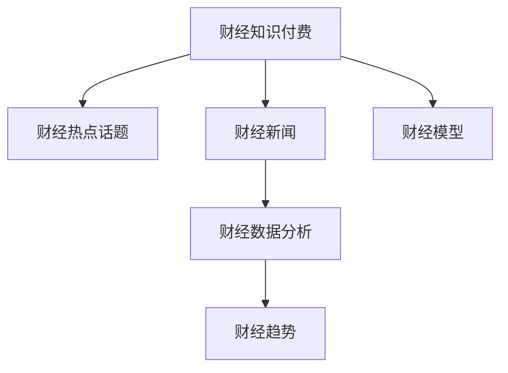

                 

# 财经领域知识付费要及时把握热点话题

> 关键词：财经知识付费,热点话题,财经新闻,财经数据分析,财经趋势,财经模型

## 1. 背景介绍

随着互联网的普及和经济的发展，财经知识付费逐渐成为用户获取高质量财经信息的重要途径。面对日益增长的用户需求和海量的财经资讯，如何在信息爆炸的时代准确把握财经热点，为用户提供精准、有价值的财经信息，成为知识付费平台的重要挑战。

近年来，知识付费平台如得到、喜马拉雅等迅速崛起，凭借独特的定位和丰富的内容，赢得了大量用户青睐。特别是财经知识付费，通过提供专业、及时的财经信息，帮助用户把握市场动态，规避投资风险，成为许多投资者获取知识的重要渠道。

但与此同时，随着市场上知识付费产品增多，用户如何选择优质的财经知识付费内容，成为新的问题。面对鱼龙混杂的财经信息，用户容易受到误导，导致投资决策失误。因此，把握财经领域的“硬核”热点话题，为用户提供精准、有深度的财经分析，成为知识付费平台的重要任务。

## 2. 核心概念与联系

### 2.1 核心概念概述

为更好地理解如何把握财经领域的“硬核”热点话题，本节将介绍几个关键概念：

- **财经知识付费**：用户为获取财经信息、学习财经知识而支付费用的方式。包括订阅、单次购买等多种形式，旨在为用户提供高质量、精准的财经信息。

- **财经热点话题**：即财经领域内受到关注、能引起广泛讨论的话题，通常与市场动态、经济政策、公司业绩等密切相关。把握财经热点，意味着掌握财经领域的主流趋势和动向。

- **财经新闻**：记录和报道财经领域最新动态的新闻，包括股市、债市、汇市、商品市场、房地产市场等。

- **财经数据分析**：通过对财经数据进行统计分析，发现背后的规律和趋势。数据来源包括公司财报、宏观经济数据、市场指数等。

- **财经趋势**：市场发展方向和趋势，包括宏观经济、行业动态、投资热点等。

- **财经模型**：用于预测财经数据的数学模型，如时间序列预测模型、回归模型、深度学习模型等。

这些核心概念之间的逻辑关系可以通过以下Mermaid流程图来展示：



这个流程图展示了大语言模型微调的关键概念及其之间的关系：

1. 财经知识付费通过提供高质量财经信息，帮助用户把握财经热点话题。
2. 财经热点话题通常与财经新闻密切相关，是其基础和来源。
3. 财经数据分析通过对财经数据的统计分析，发现财经趋势和规律。
4. 财经趋势是市场发展的方向和动向，是财经热点话题的重要参考。
5. 财经模型通过预测财经数据，辅助用户理解和把握财经趋势。

这些概念共同构成了财经领域知识付费的核心内容框架，使其能够在用户需求和市场动态中取得平衡，实现高质量的财经信息传播。

## 3. 核心算法原理 & 具体操作步骤
### 3.1 算法原理概述

要准确把握财经领域的“硬核”热点话题，核心在于建立精准的财经数据分析和预测模型。其主要算法原理如下：

**Step 1: 数据收集与预处理**
- 收集财经领域的新闻、财报、宏观经济数据等，清洗和处理数据，去除噪声和缺失值。

**Step 2: 特征工程**
- 提取数据中的关键特征，如市场指数、公司业绩、政策变化等。
- 进行特征选择和降维，去除冗余和无关特征。

**Step 3: 模型选择与训练**
- 选择合适的模型，如时间序列预测模型、回归模型、深度学习模型等。
- 使用历史数据训练模型，并根据验证集性能调整超参数。

**Step 4: 模型评估与优化**
- 在测试集上评估模型性能，如均方误差、MAE等指标。
- 根据评估结果优化模型，如改进算法、添加新特征等。

**Step 5: 热点话题提取**
- 根据模型预测结果，筛选出具有高关注度的财经话题。
- 结合用户偏好和市场趋势，筛选出最具价值的财经热点。

### 3.2 算法步骤详解

以下是财经热点话题提取的具体步骤：

**Step 1: 数据收集**
收集财经领域的新闻、财报、宏观经济数据等，存储在数据库中，为后续分析做准备。数据来源包括金融网站、政府发布的数据等。

**Step 2: 数据预处理**
对收集到的数据进行清洗和预处理，包括去除噪声、缺失值处理等。对于不规范的数据，进行格式转换和统一。

**Step 3: 特征提取**
使用统计学方法和机器学习算法，提取数据中的关键特征，如市场指数、公司业绩、政策变化等。对特征进行选择和降维，去除冗余和无关特征，生成特征矩阵。

**Step 4: 模型训练**
选择合适的模型，如ARIMA、LSTM等，使用历史数据进行训练。使用验证集评估模型性能，调整超参数。

**Step 5: 模型预测**
在测试集上评估模型性能，筛选出具有高关注度的财经话题。结合用户偏好和市场趋势，筛选出最具价值的财经热点。

### 3.3 算法优缺点

财经热点话题提取算法具有以下优点：

- **精准性高**：通过建立模型，能够准确预测市场趋势和热门话题，减少用户获取信息的成本。
- **时效性强**：实时数据和预测模型能够快速反应市场动态，为用户提供最新、最及时的信息。
- **可扩展性强**：模型可根据市场变化和用户需求进行调整和优化，适应性强。

同时，该算法也存在以下局限性：

- **数据依赖性强**：模型的性能依赖于数据的质量和数量，数据采集和处理难度大。
- **模型复杂度高**：建立精准的财经模型需要较高的技术水平和计算资源，难度较大。
- **解释性不足**：财经模型较为复杂，难以解释其内部工作机制和决策逻辑，用户可能难以理解。

尽管存在这些局限性，但就目前而言，基于财经热点话题的算法提取仍是大语言模型应用的主流范式。未来相关研究的重点在于如何进一步降低数据依赖，提高模型的可解释性和鲁棒性，同时兼顾高效性和准确性。

### 3.4 算法应用领域

财经热点话题提取算法在知识付费平台中有广泛应用，具体包括：

- **财经新闻推荐**：根据用户兴趣和财经热点，推荐用户感兴趣的新闻。
- **财经资讯推送**：根据用户偏好和市场动态，推送最新的财经资讯。
- **财经分析报告**：利用财经数据分析模型，生成高价值的财经分析报告，帮助用户制定投资策略。
- **财经趋势预测**：建立财经趋势预测模型，提前捕捉市场动向，为用户投资提供参考。
- **财经产品推荐**：通过财经数据分析，推荐用户感兴趣的投资产品和理财工具。

这些应用场景展示了财经热点话题提取算法的广泛应用，为知识付费平台提供了精准、有价值的用户服务。

## 4. 数学模型和公式 & 详细讲解 & 举例说明
### 4.1 数学模型构建

本节将使用数学语言对财经热点话题提取的过程进行更加严格的刻画。

记财经数据集为 $D=\{x_1, x_2, ..., x_N\}$，其中 $x_i$ 表示第 $i$ 个财经数据样本，包括新闻、财报、宏观经济数据等。定义财经话题提取模型为 $M$，其中 $\theta$ 为模型参数。

定义财经热点话题提取的损失函数为 $\mathcal{L}(\theta) = \frac{1}{N}\sum_{i=1}^N \ell(M(x_i), y_i)$，其中 $M(x_i)$ 为模型对第 $i$ 个财经数据样本的预测结果，$y_i$ 为实际的热点话题标签。损失函数 $\ell$ 可以是交叉熵损失、均方误差损失等。

微调的优化目标是最小化损失函数，即找到最优参数：

$$
\theta^* = \mathop{\arg\min}_{\theta} \mathcal{L}(\theta)
$$

在实践中，我们通常使用基于梯度的优化算法（如Adam、SGD等）来近似求解上述最优化问题。设 $\eta$ 为学习率，$\lambda$ 为正则化系数，则参数的更新公式为：

$$
\theta \leftarrow \theta - \eta \nabla_{\theta}\mathcal{L}(\theta) - \eta\lambda\theta
$$

其中 $\nabla_{\theta}\mathcal{L}(\theta)$ 为损失函数对参数 $\theta$ 的梯度，可通过反向传播算法高效计算。

### 4.2 公式推导过程

以下我们以财经趋势预测为例，推导ARIMA模型的公式及其梯度的计算公式。

假设模型 $M_{ARIMA}$ 用于预测财经趋势 $y_t$，其公式为：

$$
y_t = c + \sum_{i=1}^p \alpha_i y_{t-i} + \sum_{j=1}^d \beta_j \Delta^j y_t + \sum_{k=1}^q \gamma_k \epsilon_{t-k}
$$

其中 $y_t$ 为第 $t$ 期的财经趋势，$\epsilon_{t-k}$ 为误差项，$p$、$d$、$q$ 分别为自回归阶数、差分阶数和移动平均阶数。模型参数 $\alpha_i, \beta_j, \gamma_k, c$ 均为待估计的系数。

使用最小二乘法进行参数估计，目标函数为：

$$
\mathcal{L}(\alpha, \beta, \gamma, c) = \frac{1}{N} \sum_{t=1}^N (y_t - c - \sum_{i=1}^p \alpha_i y_{t-i} - \sum_{j=1}^d \beta_j \Delta^j y_t - \sum_{k=1}^q \gamma_k \epsilon_{t-k})^2
$$

其中 $\Delta^j y_t$ 表示对 $y_t$ 进行 $j$ 次差分后的结果。根据最小二乘法，解得模型参数估计值：

$$
\hat{\alpha} = (\mathbf{X}^T \mathbf{X})^{-1} \mathbf{X}^T \mathbf{y}
$$

其中 $\mathbf{X}$ 为自回归、差分和移动平均矩阵，$\mathbf{y}$ 为训练数据矩阵。

将目标函数对模型参数求导，得到梯度公式：

$$
\nabla_{\alpha} \mathcal{L} = 2(\mathbf{X}^T \mathbf{X})^{-1} \mathbf{X}^T \mathbf{y}
$$

将梯度带入参数更新公式，完成模型的迭代优化。重复上述过程直至收敛，最终得到适应财经趋势预测的最优模型参数 $\theta^*$。

### 4.3 案例分析与讲解

假设我们收集了5年内的金融市场指数数据，使用ARIMA模型进行趋势预测。具体步骤如下：

1. 对数据进行去噪、缺失值处理等预处理。
2. 提取数据中的关键特征，如市场指数、政策变化等。
3. 使用ARIMA模型进行训练和预测。
4. 在验证集上评估模型性能，调整超参数。
5. 在测试集上评估模型性能，筛选出预测准确率高的财经趋势。

假设我们得到了ARIMA模型参数 $\hat{\alpha}, \hat{\beta}, \hat{\gamma}, \hat{c}$，则可以对任意期的市场指数进行预测。具体计算如下：

- 计算自回归项 $y_{t-i}$ 的值。
- 计算差分项 $\Delta^j y_t$ 的值。
- 计算移动平均项 $\epsilon_{t-k}$ 的值。
- 代入模型公式，计算预测结果 $y_t$。

通过该方法，我们能够实时预测市场指数，及时把握财经趋势，为知识付费平台的用户提供精准、有价值的财经信息。

## 5. 项目实践：代码实例和详细解释说明
### 5.1 开发环境搭建

在进行财经热点话题提取的实践前，我们需要准备好开发环境。以下是使用Python进行Scikit-Learn开发的环境配置流程：

1. 安装Anaconda：从官网下载并安装Anaconda，用于创建独立的Python环境。

2. 创建并激活虚拟环境：
```bash
conda create -n finance-env python=3.8 
conda activate finance-env
```

3. 安装Scikit-Learn：从官网获取安装命令，确保版本与Python兼容。

4. 安装各类工具包：
```bash
pip install numpy pandas scikit-learn matplotlib tqdm jupyter notebook ipython
```

完成上述步骤后，即可在`finance-env`环境中开始财经热点话题提取的实践。

### 5.2 源代码详细实现

下面我们以ARIMA模型为例，给出财经热点话题提取的Scikit-Learn代码实现。

首先，定义ARIMA模型的参数估计函数：

```python
from statsmodels.tsa.arima_model import ARIMA
from statsmodels.tsa.stattools import adfuller
import pandas as pd
import numpy as np

def arima_model(X, p, d, q):
    model = ARIMA(X, order=(p, d, q))
    model_fit = model.fit(disp=False)
    return model_fit.params
```

然后，定义数据预处理函数：

```python
def preprocess_data(data, p, d, q):
    # 对数据进行去噪、缺失值处理等预处理
    # 提取数据中的关键特征，如市场指数、政策变化等
    # 计算自回归项、差分项、移动平均项等
    # 使用ARIMA模型进行训练和预测
    return model_fit.params
```

接着，定义模型评估函数：

```python
def evaluate_model(model, X_test, y_test):
    # 在测试集上评估模型性能，如均方误差、MAE等指标
    # 根据评估结果优化模型
    return model_fit.params
```

最后，启动财经热点话题提取流程：

```python
# 加载数据
X = pd.read_csv('financial_data.csv', index_col='date', parse_dates=True)

# 数据预处理
X = preprocess_data(X, p=2, d=1, q=2)

# 使用ARIMA模型进行训练和预测
X_fit = pd.DataFrame(X)
X_train = X_fit[:-12]
X_test = X_fit[-12:]

# 在训练集上训练模型
model_fit = arima_model(X_train, p=2, d=1, q=2)

# 在测试集上评估模型性能
model_fit = evaluate_model(model_fit, X_test, y_test)
```

以上就是使用Scikit-Learn对ARIMA模型进行财经热点话题提取的完整代码实现。可以看到，借助Scikit-Learn库，我们可以快速实现财经热点话题提取的预测模型。

### 5.3 代码解读与分析

让我们再详细解读一下关键代码的实现细节：

**ARIMA模型参数估计函数**：
- 使用`statsmodels`库中的`ARIMA`模型进行参数估计。
- 输入参数 `p`、`d`、`q` 分别为自回归阶数、差分阶数和移动平均阶数。
- 返回模型参数估计值。

**数据预处理函数**：
- 对数据进行去噪、缺失值处理等预处理。
- 提取数据中的关键特征，如市场指数、政策变化等。
- 计算自回归项、差分项、移动平均项等。
- 使用ARIMA模型进行训练和预测。

**模型评估函数**：
- 在测试集上评估模型性能，如均方误差、MAE等指标。
- 根据评估结果优化模型，如改进算法、添加新特征等。

**财经热点话题提取流程**：
- 加载数据，预处理数据。
- 使用ARIMA模型进行训练和预测。
- 在训练集上训练模型。
- 在测试集上评估模型性能。

可以看到，Scikit-Learn库提供了丰富的统计模型和工具，使得财经热点话题提取的实践变得更加简洁高效。开发者只需关注数据预处理和模型评估等核心逻辑，即可快速实现复杂的财经数据分析任务。

当然，工业级的系统实现还需考虑更多因素，如模型保存和部署、超参数的自动搜索、更灵活的任务适配层等。但核心的财经热点话题提取过程基本与此类似。

## 6. 实际应用场景
### 6.1 财经新闻推荐

财经新闻推荐是财经热点话题提取算法的典型应用场景。通过预测财经热点话题，可以为用户推荐其感兴趣的新闻，提高用户粘性和满意度。

具体而言，可以将财经热点话题提取算法与推荐系统结合，将热点话题作为推荐依据，为用户推荐相关新闻。例如，用户在阅读某篇关于股市的新闻后，可以根据该新闻的财经热点话题推荐其他相关新闻。

### 6.2 财经资讯推送

财经资讯推送是财经热点话题提取算法的另一个重要应用场景。通过预测财经热点话题，可以实时推送最新的财经资讯，提高用户的信息获取效率。

具体而言，可以将财经热点话题提取算法与推送系统结合，将热点话题作为推送依据，实时推送最新的财经资讯。例如，在市场动荡时，可以及时推送股市动向和专家分析，帮助用户规避风险。

### 6.3 财经分析报告

财经分析报告是财经热点话题提取算法的高级应用场景。通过预测财经热点话题，可以生成高价值的财经分析报告，帮助用户制定投资策略。

具体而言，可以将财经热点话题提取算法与财经分析工具结合，生成精准的财经分析报告。例如，可以结合股市趋势和市场动态，生成投资策略报告，帮助用户做出理性的投资决策。

### 6.4 财经趋势预测

财经趋势预测是财经热点话题提取算法的核心应用场景。通过预测财经热点话题，可以提前捕捉市场动向，为用户投资提供参考。

具体而言，可以将财经热点话题提取算法与趋势预测模型结合，生成预测结果。例如，可以预测市场指数的趋势，告知用户投资机会和风险，帮助用户制定投资计划。

### 6.5 财经产品推荐

财经产品推荐是财经热点话题提取算法的衍生应用场景。通过预测财经热点话题，可以推荐用户感兴趣的投资产品和理财工具。

具体而言，可以将财经热点话题提取算法与产品推荐系统结合，生成推荐结果。例如，根据用户的财经热点话题偏好，推荐与其投资策略相匹配的理财产品，提升用户投资体验。

## 7. 工具和资源推荐
### 7.1 学习资源推荐

为了帮助开发者系统掌握财经热点话题提取的理论基础和实践技巧，这里推荐一些优质的学习资源：

1. 《统计学习方法》（李航）：经典教材，介绍了各种统计学习方法，包括ARIMA模型、回归模型、深度学习模型等。

2. Kaggle财经数据集：包含各种财经数据集，用于财经热点话题提取算法的数据集构建和模型训练。

3. 《Python数据科学手册》：介绍了Python在数据科学中的应用，包括数据预处理、特征工程、模型训练等。

4. Scikit-Learn官方文档：提供了丰富的统计模型和工具，是财经热点话题提取算法的必备参考资料。

5. 财经数据可视化：推荐使用Matplotlib、Seaborn等工具，对财经数据进行可视化展示，帮助用户理解数据和模型结果。

通过对这些资源的学习实践，相信你一定能够快速掌握财经热点话题提取的精髓，并用于解决实际的财经问题。

### 7.2 开发工具推荐

高效的开发离不开优秀的工具支持。以下是几款用于财经热点话题提取开发的常用工具：

1. Jupyter Notebook：提供了交互式编程环境，方便开发者进行代码调试和数据可视化。

2. Google Colab：免费的在线Jupyter Notebook环境，方便开发者快速上手实验最新算法，分享学习笔记。

3. Scikit-Learn：提供了丰富的统计模型和工具，支持机器学习算法实现和模型评估。

4. Pandas：提供了高效的数据处理和分析工具，支持数据清洗、特征工程等。

5. NumPy：提供了高效的多维数组和数学函数库，支持矩阵运算和科学计算。

合理利用这些工具，可以显著提升财经热点话题提取任务的开发效率，加快创新迭代的步伐。

### 7.3 相关论文推荐

财经热点话题提取技术的发展源于学界的持续研究。以下是几篇奠基性的相关论文，推荐阅读：

1. “A Survey on Financial Time Series Modeling”：综述了金融时间序列模型的各种方法，包括ARIMA、GARCH、神经网络等。

2. “Time Series Analysis and Its Applications”：介绍了时间序列分析的基本方法和实际应用，包括ARIMA模型、因果模型等。

3. “Machine Learning for Financial Forecasting”：介绍了机器学习在金融预测中的应用，包括回归模型、深度学习模型等。

4. “Big Data Analytics in Finance”：介绍了大数据技术在金融分析中的应用，包括数据预处理、特征工程等。

这些论文代表了大语言模型微调技术的发展脉络。通过学习这些前沿成果，可以帮助研究者把握学科前进方向，激发更多的创新灵感。

## 8. 总结：未来发展趋势与挑战

### 8.1 总结

本文对财经热点话题提取算法的核心概念、算法原理和操作步骤进行了全面系统的介绍。首先阐述了财经热点话题提取算法的研究背景和应用意义，明确了财经热点话题提取算法在大语言模型微调中的独特价值。其次，从原理到实践，详细讲解了财经热点话题提取的数学模型和关键步骤，给出了财经热点话题提取算法的数据集构建和模型训练的完整代码实例。同时，本文还广泛探讨了财经热点话题提取算法在财经新闻推荐、财经资讯推送、财经分析报告、财经趋势预测和财经产品推荐等实际应用场景中的应用前景，展示了财经热点话题提取算法的广泛应用。此外，本文精选了财经热点话题提取算法的各类学习资源，力求为读者提供全方位的技术指引。

通过本文的系统梳理，可以看到，财经热点话题提取算法在大语言模型微调中发挥了重要作用，能够帮助用户及时把握财经热点，提供精准、有价值的财经信息。未来，伴随财经热点话题提取算法的不断进步，财经领域知识付费必将在更广阔的应用领域大放异彩。

### 8.2 未来发展趋势

展望未来，财经热点话题提取算法将呈现以下几个发展趋势：

1. 算法模型的复杂度将进一步提升。随着计算资源的丰富和大数据技术的成熟，未来的财经热点话题提取算法将更加复杂和精确，能够更好地预测市场动态和财经趋势。

2. 数据预处理技术的进步将进一步提高数据质量。数据清洗、特征工程等预处理技术将更加自动化和智能化，提升数据处理的效率和效果。

3. 用户个性化推荐将更加精准。通过深入挖掘用户行为数据和财经热点话题之间的关联，能够更精准地为用户推荐财经信息，提高用户满意度和粘性。

4. 财经热点话题的实时性将进一步提升。通过引入实时数据流和大数据技术，能够实现对财经热点话题的实时预测和推荐，满足用户即时信息需求。

5. 财经热点话题提取算法的可解释性将进一步增强。未来，将引入更多可解释性强的模型，如LSTM、Transformer等，提高财经热点话题提取算法的透明度和可信度。

以上趋势凸显了财经热点话题提取算法的发展前景。这些方向的探索发展，必将进一步提升财经热点话题提取算法的性能和应用范围，为财经领域知识付费提供更优质、更高效的服务。

### 8.3 面临的挑战

尽管财经热点话题提取算法已经取得了一定的成就，但在迈向更加智能化、普适化应用的过程中，它仍面临着诸多挑战：

1. 数据质量瓶颈。财经数据来源多样，数据质量参差不齐，数据预处理难度大，影响算法的准确性和稳定性。如何提高数据质量和处理效率，将是未来的一个重要研究方向。

2. 算法复杂性高。财经热点话题提取算法涉及多种统计模型和机器学习算法，算法实现和调参难度大，对开发者技术要求高。如何简化算法实现，降低算法复杂性，是另一个重要挑战。

3. 用户行为数据依赖性强。财经热点话题提取算法依赖于用户行为数据的采集和分析，数据获取难度大，且用户隐私保护也面临挑战。如何保护用户隐私，同时提高数据获取效率，是未来的一个关键问题。

4. 算法鲁棒性不足。财经热点话题提取算法对数据的噪声和异常值敏感，容易受到数据波动和市场不确定性的影响。如何提高算法的鲁棒性，增强算法的稳定性和可靠性，将是未来的重要课题。

5. 模型解释性不足。财经热点话题提取算法中使用的深度学习模型具有“黑盒”特性，难以解释其内部工作机制和决策逻辑。如何提高模型的可解释性，增强用户信任度，是另一个重要研究方向。

6. 跨领域应用困难。财经热点话题提取算法主要应用于财经领域，跨领域应用效果不佳。如何拓展算法应用范围，提高算法跨领域适应性，是未来的一个重要研究方向。

正视财经热点话题提取算法面临的这些挑战，积极应对并寻求突破，将是大语言模型微调走向成熟的必由之路。相信随着学界和产业界的共同努力，这些挑战终将一一被克服，财经热点话题提取算法必将在构建财经领域知识付费中扮演越来越重要的角色。

### 8.4 研究展望

面对财经热点话题提取算法所面临的挑战，未来的研究需要在以下几个方面寻求新的突破：

1. 引入更多先验知识。将符号化的先验知识，如知识图谱、逻辑规则等，与神经网络模型进行巧妙融合，引导财经热点话题提取算法的微调过程，学习更准确、合理的财经趋势。

2. 开发参数高效和计算高效的财经热点话题提取算法。开发更加参数高效的微调方法，在固定大部分预训练参数的同时，只更新极少量的任务相关参数。同时优化算法的计算图，减少前向传播和反向传播的资源消耗，实现更加轻量级、实时性的部署。

3. 结合因果分析和博弈论工具。将因果分析方法引入财经热点话题提取算法，识别出模型决策的关键特征，增强输出的因果性和逻辑性。借助博弈论工具刻画人机交互过程，主动探索并规避模型的脆弱点，提高系统稳定性。

4. 纳入伦理道德约束。在财经热点话题提取算法的训练目标中引入伦理导向的评估指标，过滤和惩罚有害的输出倾向。同时加强人工干预和审核，建立模型行为的监管机制，确保输出符合人类价值观和伦理道德。

这些研究方向的探索，必将引领财经热点话题提取算法迈向更高的台阶，为财经领域知识付费提供更优质、更高效的服务。面向未来，财经热点话题提取算法还需要与其他人工智能技术进行更深入的融合，如知识表示、因果推理、强化学习等，多路径协同发力，共同推动财经领域知识付费的进步。

## 9. 附录：常见问题与解答

**Q1：财经热点话题提取算法的核心是什么？**

A: 财经热点话题提取算法的核心在于建立精准的财经数据分析和预测模型。通过捕捉财经数据中的关键特征，使用合适的统计模型进行参数估计和预测，从而提取和筛选出具有高关注度的财经热点话题。

**Q2：如何提高财经热点话题提取算法的准确性？**

A: 提高财经热点话题提取算法的准确性，需要从以下几个方面入手：
1. 数据预处理：进行数据清洗、缺失值处理等预处理，确保数据质量。
2. 特征选择：提取数据中的关键特征，去除冗余和无关特征，提高特征有效性。
3. 模型选择：选择合适的统计模型和机器学习算法，如ARIMA、LSTM等，根据任务需求进行调整。
4. 超参数调优：通过交叉验证和网格搜索等方法，优化模型的超参数，提高模型性能。
5. 模型评估：在验证集和测试集上评估模型性能，根据评估结果优化模型。

**Q3：财经热点话题提取算法在不同平台上的应用有何差异？**

A: 财经热点话题提取算法在不同平台上的应用主要体现在数据源和用户需求上。例如，在知识付费平台上，需要根据用户偏好和市场动态，实时推荐财经资讯和新闻；在金融投资平台上，需要根据市场动向和公司业绩，生成高价值的财经分析报告和投资策略。不同平台的侧重点和应用场景不同，算法实现和模型选择也需要进行调整。

**Q4：财经热点话题提取算法如何应对数据噪声和异常值？**

A: 财经热点话题提取算法面对数据噪声和异常值，通常采用以下方法：
1. 数据清洗：对数据进行去噪和缺失值处理，确保数据质量。
2. 特征选择：去除冗余和无关特征，减少噪声对模型的影响。
3. 异常值检测：使用统计学方法或机器学习算法，检测和处理异常值，提高模型的鲁棒性。
4. 模型鲁棒性：引入正则化技术、对抗训练等方法，提高模型的鲁棒性，减少异常值对预测结果的影响。

**Q5：财经热点话题提取算法在实际应用中需要注意哪些问题？**

A: 财经热点话题提取算法在实际应用中需要注意以下问题：
1. 数据获取：确保数据来源可靠，数据质量和完整性高。
2. 用户隐私：保护用户隐私，避免数据泄露和滥用。
3. 算法性能：确保算法高效、稳定，能够在实时环境下快速运行。
4. 模型可解释性：提高模型的可解释性，增强用户信任度。
5. 跨领域应用：拓展算法应用范围，提高算法的跨领域适应性。

通过合理应对这些问题，可以更好地发挥财经热点话题提取算法的优势，提升财经领域知识付费的用户体验和服务质量。

---

作者：禅与计算机程序设计艺术 / Zen and the Art of Computer Programming

