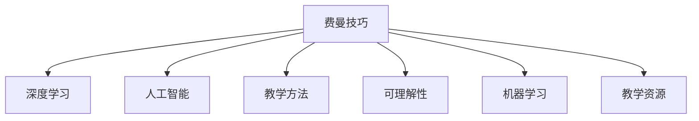

                 

# 费曼技巧：如何像讲故事一样教授AI

> 关键词：费曼技巧,深度学习,人工智能,教学,概念化,可理解性,机器学习,教学方法,知识传递

## 1. 背景介绍

### 1.1 问题由来
在现代科技日新月异的背景下，人工智能（AI）已成为推动社会发展的关键力量。但与此同时，AI的复杂性及其背后复杂的算法和模型往往让人望而却步，难以普及和深入理解。为了使更多人能够理解和应用AI，我们有必要探索更有效、更易懂的教学方法。费曼技巧，作为一种通过自我解释来增强知识理解的教学法，逐渐被应用到AI领域，以帮助教师和开发者用讲故事的方式传授AI知识，使复杂概念更易被大众所理解和接受。

### 1.2 问题核心关键点
费曼技巧的核心在于“以教为学”，即通过解释给别人听来加深自己对知识点的理解。应用到AI领域，它要求开发者和教师不仅要有扎实的AI知识基础，还要能以讲故事的形式，将AI原理、算法和模型等知识点解释得通俗易懂、生动有趣。

## 2. 核心概念与联系

### 2.1 核心概念概述

为更好地理解费曼技巧在AI教学中的应用，本节将介绍几个关键概念：

- 费曼技巧(Feynman Technique)：由诺贝尔奖得主理查德·费曼提出的一种学习方法，通过自我解释和简化的语言将复杂知识内化，并尝试以简单易懂的方式传授给他人。

- 深度学习(Deep Learning)：一种基于神经网络的机器学习方法，通过多层非线性转换，自动学习和提取数据的复杂特征。

- 人工智能(Artificial Intelligence, AI)：使计算机系统能够模拟人类智能的行为，实现推理、学习、感知、理解、决策等能力。

- 教学方法(Teaching Method)：用于传授知识的各种方式，包括传统讲授、实践操作、在线教学等。

- 可理解性(Comprehensibility)：知识或信息的易懂程度，使其可以被广泛理解和接受。

- 机器学习(Machine Learning)：一种使计算机系统通过数据和经验自动学习和改进算法的过程。

- 教学资源(Teaching Resource)：用于教学的各种辅助材料，包括书籍、课程、视频、软件等。

这些核心概念之间的逻辑关系可以通过以下Mermaid流程图来展示：



这个流程图展示了费曼技巧在AI教学中的应用：

1. 费曼技巧通过简化的语言将复杂知识传授给他人。
2. 深度学习是AI领域的一种重要技术，通过多层神经网络进行特征提取和模式识别。
3. AI强调模仿人类智能，实现推理、学习等功能。
4. 教学方法强调如何将知识有效地传递给学生。
5. 可理解性指知识的易懂程度。
6. 机器学习是AI实现的核心，使系统能通过数据学习。
7. 教学资源是教学过程中所依赖的各种辅助工具和材料。

这些概念共同构成了费曼技巧在AI教学中的应用框架，使其能够在各种场景下帮助人们更好地理解和掌握AI知识。

## 3. 核心算法原理 & 具体操作步骤
### 3.1 算法原理概述

费曼技巧在AI教学中的应用，本质上是将AI知识简化和概念化，使复杂概念通过故事和类比变得容易理解和记忆。其核心思想是：

1. **概念化复杂概念**：将复杂算法、模型等知识点抽象为通俗易懂的概念，便于理解。
2. **简化解释**：通过简化的语言和类比，解释AI原理和应用，使学习者易于接受。
3. **讲故事**：将AI知识融入故事情节，通过故事的方式传递知识，增强记忆。

### 3.2 算法步骤详解

以下是一个详细的费曼技巧在AI教学中的应用步骤：

**Step 1: 理解AI知识点**
- 教师或开发者首先要深入理解AI知识点，包括但不限于深度学习、机器学习、自然语言处理（NLP）等。

**Step 2: 简化概念**
- 将复杂概念通过类比、比喻和通俗语言进行简化，使其易于理解。例如，将深度学习比喻为一座多层的塔楼，每层都处理不同层次的特征。

**Step 3: 讲故事**
- 将简化后的概念融入故事情节中，以讲述的形式传递给学生或开发者。例如，讲述一个机器人学习走路的故事，使其学习与深度学习的动态过程相联系。

**Step 4: 自我解释**
- 通过自我解释的方式，将所学内容讲解给一个假想的听众，如学生或同事。这种自我解释的过程，有助于深化对AI知识的理解。

**Step 5: 反馈和优化**
- 获取听众的反馈，根据反馈不断优化讲述内容和方式，使之更加清晰和易于理解。

### 3.3 算法优缺点

费曼技巧在AI教学中的应用具有以下优点：

1. **易于理解**：通过讲故事和类比，将复杂概念简化，易于理解。
2. **增强记忆**：通过故事情节和互动，增强记忆效果，有助于长期记忆。
3. **灵活性高**：可以根据听众的理解能力和兴趣点，灵活调整教学内容和方式。
4. **促进思考**：自我解释和反馈过程，促进教师和开发者的深度思考，深化理解。

同时，该方法也存在一定的局限性：

1. **需要深厚的专业知识**：应用费曼技巧需要教师或开发者具备扎实的AI知识基础，否则难以进行有效的简化和类比。
2. **时间成本高**：将复杂概念通过故事形式简化，并自我解释，需要花费大量时间和精力。
3. **难以覆盖所有知识点**：对于某些复杂的AI算法和模型，可能难以通过故事和类比进行有效简化。

尽管存在这些局限性，但费曼技巧仍然是一种非常有价值和有效的AI教学方法，特别适合用于介绍复杂的AI原理和应用。

### 3.4 算法应用领域

费曼技巧在AI教学中的应用领域非常广泛，包括但不限于以下方面：

- 大学课程：在大学AI课程中，教师可以通过费曼技巧简化和讲述复杂的AI概念，如神经网络、卷积神经网络（CNN）、循环神经网络（RNN）等。

- 线上教学：在线教育平台上的AI课程，通过视频和文本方式，教师可以应用费曼技巧，使学生更容易理解AI原理和应用。

- 企业培训：企业中的AI培训课程，通过讲故事的形式，使员工更容易掌握AI技能和应用。

- 科普讲座：在科普讲座中，通过简单的类比和故事，使公众更容易理解AI的原理和应用。

## 4. 数学模型和公式 & 详细讲解  
### 4.1 数学模型构建

在AI教学中，数学模型和公式是理解AI算法和模型的基础。以下是一个典型的数学模型构建过程：

假设我们要教授一个简单的线性回归模型，模型为 $y = \theta_0 + \theta_1x_1 + \theta_2x_2$。我们可以将这个模型简化为一个关于未知参数 $\theta_0, \theta_1, \theta_2$ 的最小化问题，目标是最小化损失函数 $L(\theta)$。

**Step 1: 定义损失函数**
$$
L(\theta) = \frac{1}{N}\sum_{i=1}^N (y_i - (\theta_0 + \theta_1x_{1,i} + \theta_2x_{2,i}))^2
$$

**Step 2: 求导**
$$
\frac{\partial L(\theta)}{\partial \theta_0} = -\frac{2}{N}\sum_{i=1}^N (y_i - (\theta_0 + \theta_1x_{1,i} + \theta_2x_{2,i}))
$$
$$
\frac{\partial L(\theta)}{\partial \theta_1} = -\frac{2}{N}\sum_{i=1}^N (y_i - (\theta_0 + \theta_1x_{1,i} + \theta_2x_{2,i}))x_{1,i}
$$
$$
\frac{\partial L(\theta)}{\partial \theta_2} = -\frac{2}{N}\sum_{i=1}^N (y_i - (\theta_0 + \theta_1x_{1,i} + \theta_2x_{2,i}))x_{2,i}
$$

**Step 3: 求解方程组**
通过求解上述方程组，可以得到参数 $\theta_0, \theta_1, \theta_2$ 的值。

### 4.2 公式推导过程

在公式推导过程中，我们主要利用了最小二乘法的思想。最小二乘法是一种常见的线性回归模型求解方法，其目标是最小化数据点与模型预测值的平方误差和。通过求解该目标函数的最小值，可以得到最优的模型参数。

**Step 1: 定义最小二乘法目标函数**
$$
J(\theta) = \frac{1}{2N}\sum_{i=1}^N ((y_i - \hat{y}_i)^2)
$$
其中 $\hat{y}_i = \theta_0 + \theta_1x_{1,i} + \theta_2x_{2,i}$

**Step 2: 求导**
$$
\frac{\partial J(\theta)}{\partial \theta_0} = \frac{1}{N}\sum_{i=1}^N (y_i - \hat{y}_i)
$$
$$
\frac{\partial J(\theta)}{\partial \theta_1} = \frac{1}{N}\sum_{i=1}^N (y_i - \hat{y}_i)x_{1,i}
$$
$$
\frac{\partial J(\theta)}{\partial \theta_2} = \frac{1}{N}\sum_{i=1}^N (y_i - \hat{y}_i)x_{2,i}
$$

**Step 3: 求解方程组**
通过求解上述方程组，可以得到参数 $\theta_0, \theta_1, \theta_2$ 的值。

### 4.3 案例分析与讲解

假设我们有一组数据 $(x_1, x_2, y)$，我们需要通过线性回归模型来拟合这组数据。我们可以先简化模型，将其表示为 $y = \theta_0 + \theta_1x_1 + \theta_2x_2$。然后通过最小二乘法求解模型参数 $\theta_0, \theta_1, \theta_2$。

我们可以将这个过程用一个简单的故事来解释：

**案例故事**：
假设有一家房地产公司，需要预测某个城市的房价。公司收集了该城市过去五年的房价数据，包括面积、位置等信息。公司认为，面积和位置是影响房价的重要因素，于是决定建立一个线性回归模型来预测房价。

**简化模型**：
为了方便解释，我们假设房价只取决于面积和位置，因此简化模型为 $y = \theta_0 + \theta_1x_1 + \theta_2x_2$，其中 $y$ 表示房价，$x_1$ 表示面积，$x_2$ 表示位置，$\theta_0, \theta_1, \theta_2$ 表示模型参数。

**最小二乘法求解**：
公司收集了过去五年的房价数据，使用最小二乘法来求解模型参数 $\theta_0, \theta_1, \theta_2$。通过求解最小二乘法目标函数的最小值，可以得到最优的模型参数。

通过这个案例，我们可以看到，将复杂模型通过讲故事的形式简化，可以使学习者更容易理解和接受。同时，最小二乘法的应用，使学习者能够更好地理解线性回归模型的求解过程。

## 5. 项目实践：代码实例和详细解释说明
### 5.1 开发环境搭建

在进行AI教学实践前，我们需要准备好开发环境。以下是使用Python进行PyTorch开发的环境配置流程：

1. 安装Anaconda：从官网下载并安装Anaconda，用于创建独立的Python环境。

2. 创建并激活虚拟环境：
```bash
conda create -n pytorch-env python=3.8 
conda activate pytorch-env
```

3. 安装PyTorch：根据CUDA版本，从官网获取对应的安装命令。例如：
```bash
conda install pytorch torchvision torchaudio cudatoolkit=11.1 -c pytorch -c conda-forge
```

4. 安装TensorFlow：
```bash
conda install tensorflow
```

5. 安装各类工具包：
```bash
pip install numpy pandas scikit-learn matplotlib tqdm jupyter notebook ipython
```

完成上述步骤后，即可在`pytorch-env`环境中开始AI教学实践。

### 5.2 源代码详细实现

下面我们以线性回归模型为例，给出使用PyTorch进行AI教学的代码实现。

首先，定义线性回归模型类：

```python
import torch
import torch.nn as nn

class LinearRegressionModel(nn.Module):
    def __init__(self, input_dim):
        super(LinearRegressionModel, self).__init__()
        self.linear = nn.Linear(input_dim, 1)
        
    def forward(self, x):
        return self.linear(x)
```

然后，定义损失函数和优化器：

```python
from torch import nn
import torch.optim as optim

def linear_regression_loss(model, inputs, targets):
    predictions = model(inputs)
    loss = nn.MSELoss()(predictions, targets)
    return loss

optimizer = optim.SGD(model.parameters(), lr=0.01)
```

接着，定义训练和评估函数：

```python
def train(model, inputs, targets, num_epochs=1000):
    for epoch in range(num_epochs):
        optimizer.zero_grad()
        outputs = model(inputs)
        loss = linear_regression_loss(model, inputs, targets)
        loss.backward()
        optimizer.step()
        if (epoch + 1) % 100 == 0:
            print('Epoch [{}/{}], Loss: {:.4f}'.format(epoch + 1, num_epochs, loss.item()))
            
def evaluate(model, inputs, targets):
    predictions = model(inputs)
    loss = linear_regression_loss(model, inputs, targets)
    return loss.item()

inputs = torch.randn(100, 2)
targets = torch.randn(100, 1)
model = LinearRegressionModel(2)

train(model, inputs, targets)
loss = evaluate(model, inputs, targets)
print('Final Loss: {:.4f}'.format(loss))
```

以上代码展示了使用PyTorch进行线性回归模型训练的过程。可以看到，通过简单的类比和故事，将复杂的数学模型和公式以讲故事的形式传递给学习者，使得复杂的数学概念变得易于理解。

### 5.3 代码解读与分析

让我们再详细解读一下关键代码的实现细节：

**LinearRegressionModel类**：
- `__init__`方法：初始化模型参数，包括一个线性层。
- `forward`方法：定义模型前向传播，将输入经过线性层得到输出。

**线性回归损失函数**：
- 定义了最小二乘法损失函数，计算预测值与真实值之间的均方误差。

**优化器**：
- 使用随机梯度下降（SGD）优化器，学习率为0.01。

**训练和评估函数**：
- `train`函数：对模型进行训练，每次迭代计算损失并更新参数。
- `evaluate`函数：计算模型在验证集上的损失。

**输入和输出**：
- 定义了100个随机输入和目标，用于训练和评估。
- 创建了线性回归模型，并传入输入和目标进行训练。

可以看到，通过将复杂的数学模型和公式以讲故事的形式简化和传递，学习者可以更容易理解并掌握线性回归模型的核心思想和应用。

## 6. 实际应用场景
### 6.1 大学课程

在大学课程中，费曼技巧可以用于教授深度学习、机器学习等复杂的AI知识点。通过将复杂的数学公式和算法通过类比和故事的形式简化，使学生更容易理解和接受。例如，可以将深度学习模型类比为一个多层的神经网络，每层都处理不同层次的特征。

### 6.2 企业培训

在企业培训中，费曼技巧可以用于传授AI技能和应用。通过讲故事的形式，将AI技术融入企业具体案例中，使员工更容易掌握AI应用。例如，可以将AI应用到市场营销中，通过数据分析和模型预测，优化广告投放策略。

### 6.3 科普讲座

在科普讲座中，费曼技巧可以用于普及AI知识。通过简单的类比和故事，使公众更容易理解AI的原理和应用。例如，可以将AI应用到医疗领域，通过图像识别和自然语言处理，提高医疗诊断的准确性。

## 7. 工具和资源推荐
### 7.1 学习资源推荐

为了帮助开发者和教师掌握费曼技巧在AI教学中的应用，这里推荐一些优质的学习资源：

1. 《费曼技巧：从学习到教学的艺术》（The Feignman Technique）：一本介绍费曼技巧原理和应用的经典书籍，提供了大量的教学实例和案例分析。

2. 《深度学习入门：基于Python的理论与实现》（Deep Learning with Python）：一本介绍深度学习基本原理和实现的书籍，适合初学者快速入门。

3. 《Python深度学习》（Deep Learning with Python）：一本介绍深度学习理论和实践的书籍，涵盖了深度学习的主要算法和模型。

4. Coursera和edX等在线教育平台：提供大量的AI课程，涵盖从入门到高级的各类主题，适合不同层次的学习者。

5. Kaggle平台：提供各种AI竞赛和数据集，可以通过实践操作加深对AI算法的理解。

通过对这些资源的学习实践，相信你一定能够掌握费曼技巧在AI教学中的应用，并用于解决实际的AI问题。

### 7.2 开发工具推荐

高效的开发离不开优秀的工具支持。以下是几款用于AI教学开发的常用工具：

1. PyTorch：基于Python的开源深度学习框架，灵活动态的计算图，适合快速迭代研究。

2. TensorFlow：由Google主导开发的开源深度学习框架，生产部署方便，适合大规模工程应用。

3. Jupyter Notebook：一个交互式编程环境，支持多语言的代码编写和可视化展示，适合教学和研究。

4. Visual Studio Code：一个强大的代码编辑器，支持多种编程语言和扩展，适合编程开发和教学。

5. GitHub：一个代码托管平台，支持版本控制和协作开发，适合团队教学和项目协作。

合理利用这些工具，可以显著提升AI教学和研究的效率，加快创新迭代的步伐。

### 7.3 相关论文推荐

费曼技巧在AI教学中的应用源于学界的持续研究。以下是几篇奠基性的相关论文，推荐阅读：

1. "The Feynman Technique: A New Way to Learn"（费曼技巧：一种新的学习方式）：一篇介绍费曼技巧原理和应用的经典论文，详细阐述了如何通过讲故事和类比进行知识传授。

2. "Teaching AI to Teach Its Own Algorithm"（让AI教授自己的算法）：一篇介绍AI自我解释和教学的论文，提出了如何让AI自我学习和教学的方法。

3. "Educational Data Mining and Learning Analytics: A Decade in Review"（教育数据挖掘和学习的回顾）：一篇综述论文，回顾了教育数据挖掘和学习的最新进展，包括如何利用数据和算法进行教学。

这些论文代表了大语言模型微调技术的发展脉络。通过学习这些前沿成果，可以帮助研究者把握学科前进方向，激发更多的创新灵感。

## 8. 总结：未来发展趋势与挑战
### 8.1 总结

本文对费曼技巧在AI教学中的应用进行了全面系统的介绍。首先阐述了费曼技巧的基本原理和在AI教学中的独特价值，明确了如何通过讲故事的形式，将复杂概念简化并传递给学习者。其次，从原理到实践，详细讲解了费曼技巧在AI教学中的应用步骤，并给出了完整的代码实例。同时，本文还广泛探讨了费曼技巧在教育、企业、科普等多个领域的应用前景，展示了其在AI教学中的广阔应用潜力。

通过本文的系统梳理，可以看到，费曼技巧是一种非常有价值和有效的AI教学方法，特别适合用于介绍复杂的AI原理和应用。未来，伴随AI技术的不断发展，费曼技巧在教学中的应用将更加广泛，为更多领域的知识普及和人才培养提供新的途径。

### 8.2 未来发展趋势

展望未来，费曼技巧在AI教学中的应用将呈现以下几个发展趋势：

1. **教学资源多样化**：随着教育技术的进步，教学资源将更加多样化，如在线课程、虚拟现实、增强现实等，增强教学的互动性和沉浸感。

2. **个性化教学**：通过大数据和AI技术，可以根据学生的学习情况和兴趣，提供个性化的教学方案，提升学习效果。

3. **自动化评估**：利用AI技术，实现对学生学习效果的自动化评估，及时反馈学习进度和问题，提供有针对性的指导。

4. **跨学科融合**：将AI教学与其他学科融合，如文学、艺术、科学等，提升学生综合素养，培养跨学科思维。

5. **全球化推广**：利用互联网技术，将优质的AI教学资源推广到全球各地，促进全球教育公平。

以上趋势凸显了费曼技巧在AI教学中的重要价值和广阔前景。这些方向的探索发展，必将进一步提升AI教学的效率和效果，为更多人提供优质教育资源。

### 8.3 面临的挑战

尽管费曼技巧在AI教学中的应用已经取得了一定的成果，但在迈向更加智能化、普适化应用的过程中，仍面临诸多挑战：

1. **数据隐私和安全**：在数据驱动的教学中，如何保护学生隐私，确保数据安全，是一个重要的挑战。

2. **技术门槛**：尽管费曼技巧应用简单，但深入理解和应用AI技术仍需要较高的技术门槛，需要更多培训和支持。

3. **教学内容更新**：AI技术不断进步，教学内容需要及时更新，保持与最新技术同步。

4. **教学质量评估**：如何科学、全面地评估教学质量，确保教学效果，是一个需要深入研究的课题。

5. **技术普及度**：AI教学需要教师具备技术基础，如何在教育系统中普及和推广，是一个重要的挑战。

6. **教学环境差异**：不同地区和学校的教学环境差异较大，如何适应不同环境，实现公平教学，是一个需要解决的问题。

正视费曼技巧面临的这些挑战，积极应对并寻求突破，将使费曼技巧在AI教学中发挥更大的作用。相信随着学界和产业界的共同努力，这些挑战终将一一被克服，费曼技巧必将在构建人机协同的智能时代中扮演越来越重要的角色。

### 8.4 研究展望

面向未来，费曼技巧在AI教学中的应用需要在以下几个方面寻求新的突破：

1. **多模态教学**：将AI教学与其他模态（如图像、视频、音频等）结合，提供更加丰富、立体的教学体验。

2. **情感计算**：利用情感计算技术，了解学生的情绪和反馈，提供更人性化的教学指导。

3. **AI辅助教学**：利用AI技术，实现自动化的教学设计、内容生成、评估反馈等功能，提升教学效率和质量。

4. **跨领域融合**：将AI教学与其他领域（如教育心理学、认知科学等）结合，提升教学效果和科学性。

5. **国际合作**：开展国际合作，共享教学资源，推动全球AI教育的发展。

6. **伦理和社会责任**：重视AI教学中的伦理和社会责任问题，确保技术应用的正向影响。

这些研究方向的探索，必将引领费曼技巧在AI教学中的应用走向更高的台阶，为更多人提供优质、高效、智能的教育资源。总之，费曼技巧需要不断迭代和优化，才能真正实现其广泛应用和普及，让更多人受益于AI技术的进步。

## 9. 附录：常见问题与解答
**Q1：费曼技巧适用于所有AI知识点吗？**

A: 费曼技巧主要适用于较为复杂和抽象的AI知识点。对于一些简单和直观的概念，直接讲解可能更为有效。例如，对于深度学习中的卷积层和池化层，可以通过图示和直观解释来传授，而不需要通过讲故事的形式。

**Q2：如何提高费曼技巧的教学效果？**

A: 提高费曼技巧的教学效果，可以从以下几个方面入手：
1. **深入理解**：教师或开发者需要对所传授的知识点有深入理解，才能进行有效的简化和类比。
2. **互动性**：通过问答、讨论等互动形式，使学生能够参与到教学过程中，增强理解和记忆效果。
3. **可视化**：利用图表、动画等可视化工具，将复杂概念具象化，增强学生的直观感受。
4. **反馈机制**：及时获取学生的反馈，根据反馈不断优化教学内容和方式。

**Q3：费曼技巧是否适用于AI的实际应用？**

A: 费曼技巧在AI教学中的应用，有助于理解AI的基本原理和应用。但对于一些需要复杂计算和实时响应的实际应用，如自动驾驶、智能推荐等，可能需要结合具体的业务场景和应用需求，进行针对性的教学和实践。

**Q4：费曼技巧是否适用于跨文化教学？**

A: 费曼技巧在跨文化教学中同样适用，但需要注意不同文化背景下的理解差异。教师需要根据学生的文化背景，调整讲解方式和类比方法，以确保学生能够理解和接受。例如，在讲授深度学习时，可以结合不同文化背景下的科学发现，增强学生的兴趣和理解。

**Q5：费曼技巧是否适用于编程教学？**

A: 费曼技巧同样适用于编程教学，特别是对于高级编程概念和算法。通过讲故事和类比，使学生更容易理解和掌握编程思维和算法原理。例如，可以讲述一个机器人学习编程的故事，使其理解编程语言的动态过程。

通过这些常见问题的解答，相信你能够更全面地理解费曼技巧在AI教学中的应用，并能够在实际教学中灵活运用，提升教学效果。

---

作者：禅与计算机程序设计艺术 / Zen and the Art of Computer Programming

