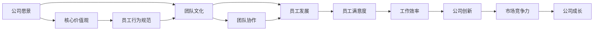

                 

# 跨国AI公司的文化建设：Lepton AI的案例研究

> 关键词：跨国AI公司,文化建设,Lepton AI,创新文化,多样性,员工发展,团队协作,公司愿景

## 1. 背景介绍

### 1.1 行业现状与趋势
在人工智能(AI)技术飞速发展的今天，越来越多的跨国公司开始重视AI技术的研发与应用。Lepton AI作为一家领先的跨国AI公司，不仅在AI技术上拥有核心竞争力，还在公司文化建设上做出了许多创新尝试，为公司的发展注入强劲动力。

随着科技的不断进步，AI公司越来越注重人才的吸引与培养，其中公司文化建设成为了不可或缺的一部分。一个积极向上、开放包容的文化环境不仅能吸引更多优秀人才，还能提升员工的满意度和工作效率，推动企业持续创新。Lepton AI的成功案例，为我们提供了宝贵的经验与启示。

### 1.2 公司背景
Lepton AI成立于2015年，总部位于硅谷。公司以构建普惠的AI技术为核心使命，致力于开发智能应用，改善人类生活。成立几年来，Lepton AI已经在医疗健康、金融服务、教育科技等领域取得显著成果，逐步成为行业领导者。

Lepton AI成功构建了从基础研究到产品落地的全栈AI技术体系，旗下拥有多个明星产品，包括医疗影像智能诊断系统、智能客服机器人、智能推荐引擎等。公司目前在全球范围内拥有超过500名员工，其中绝大部分是来自世界各地的顶尖科研人员和工程师。

## 2. 核心概念与联系

### 2.1 核心概念概述

#### 2.1.1 跨国公司文化建设
跨国公司文化建设是一个复杂而系统的工程，涉及到公司愿景、使命、价值观、员工行为规范等多个方面。其目的是在多元文化背景下，构建一个和谐、高效、创新的团队环境，提升员工满意度和工作效率，推动企业持续发展。

#### 2.1.2 Lepton AI的文化建设
Lepton AI在文化建设方面做出了许多创新尝试，力求营造一个开放包容、激励创新、重视多样性的文化环境。公司注重员工个人成长，倡导团队协作，以实现团队和公司的双赢发展。

### 2.2 核心概念原理和架构的 Mermaid 流程图



### 2.3 核心概念联系
Lepton AI的文化建设围绕公司愿景和核心价值观展开，通过构建开放包容的团队文化、促进员工个人发展、鼓励团队协作，最终提升了员工满意度和工作效率，推动了公司持续创新，增强了市场竞争力，实现了公司的持续成长。

## 3. 核心算法原理 & 具体操作步骤

### 3.1 算法原理概述

Lepton AI的文化建设主要遵循以下原则：

1. **开放包容**：公司倡导多元化，鼓励员工提出不同观点，鼓励创新思维。
2. **员工发展**：公司提供多样化的培训和发展机会，帮助员工实现个人职业规划。
3. **团队协作**：公司重视团队合作，倡导共享和支持，提升团队效率。
4. **公司愿景**：公司以构建普惠AI为核心使命，驱动员工向这一目标不断努力。

### 3.2 算法步骤详解

#### 3.2.1 制定公司愿景与核心价值观
Lepton AI在成立之初就明确了公司愿景：“构建普惠的AI技术，改善人类生活”，核心价值观为：“开放包容、激励创新、重视多样性、追求卓越”。这些愿景和价值观成为Lepton AI文化建设的基石，指导着公司的一言一行。

#### 3.2.2 构建团队文化
Lepton AI通过建立多样化的团队，吸纳全球顶尖人才，形成多元化的团队结构。公司通过组织各种文化活动，如团队建设活动、员工交流活动等，促进团队成员之间的理解和信任。

#### 3.2.3 提供员工发展机会
Lepton AI为员工提供广泛的培训和职业发展机会，包括技术培训、管理培训、领导力培训等。公司还定期举行技术分享会和内部讲座，激励员工持续学习，提升个人能力。

#### 3.2.4 鼓励团队协作
Lepton AI倡导共享和支持的文化，鼓励团队成员共同解决问题。公司采用扁平化的组织结构，减少层级壁垒，使信息流动更加顺畅，促进团队协作。

### 3.3 算法优缺点

#### 3.3.1 优点
1. **吸引人才**：开放包容的文化吸引全球顶尖人才，提升公司竞争力。
2. **提高效率**：团队协作和多样化的培训机制，提升员工满意度和工作效率。
3. **促进创新**：鼓励创新思维和多样化观点，推动技术创新。

#### 3.3.2 缺点
1. **文化冲突**：多元文化的融合可能带来一些文化冲突，需要管理层积极引导。
2. **培训成本**：提供多样化的培训和职业发展机会，需要大量资源投入。
3. **信息流动**：扁平化组织结构可能导致信息流动不畅，需要优化管理机制。

### 3.4 算法应用领域

Lepton AI的文化建设不仅在技术研发方面取得了显著成果，还在管理、市场拓展等多个领域提升了公司竞争力。

#### 3.4.1 技术研发
Lepton AI的文化建设为技术研发提供了良好的环境，吸引了全球顶尖人才，推动了公司技术的持续创新。公司在医疗影像、智能推荐、智能客服等领域的创新成果，都得益于开放包容的团队文化。

#### 3.4.2 市场拓展
Lepton AI的文化建设还促进了公司全球市场拓展。公司通过多样化的团队，更好地理解不同市场的需求，推出本地化的解决方案，提升市场竞争力。

## 4. 数学模型和公式 & 详细讲解 & 举例说明

### 4.1 数学模型构建

Lepton AI的文化建设模型可以表示为一个多目标优化问题，目标包括提升员工满意度、工作效率、团队协作、技术创新和市场竞争力。模型中包含多个变量，如公司愿景、核心价值观、员工培训、团队建设等。

### 4.2 公式推导过程

设公司愿景为 $V$，核心价值观为 $C$，员工满意度为 $S$，工作效率为 $W$，团队协作为 $T$，技术创新为 $I$，市场竞争力为 $M$。文化建设模型可以表示为：

$$
\max \{S, W, T, I, M\}
$$

$$
s.t. \begin{cases}
V = \text{“构建普惠的AI技术，改善人类生活”} \\
C = \text{“开放包容、激励创新、重视多样性、追求卓越”} \\
S = f(V, C, S_{train}, S_{collaboration}) \\
W = g(V, C, W_{training}, W_{collaboration}) \\
T = h(V, C, T_{team\_building}, T_{team\_cohesion}) \\
I = i(V, C, I_{innovation}, I_{diversity}) \\
M = j(V, C, M_{market\_expansion}, M_{localization})
\end{cases}
$$

其中 $S_{train}$ 表示员工培训满意度，$S_{collaboration}$ 表示团队协作满意度，$W_{training}$ 表示员工培训提升的工作效率，$W_{collaboration}$ 表示团队协作提升的工作效率，$T_{team\_building}$ 表示团队建设活动的满意度，$T_{team\_cohesion}$ 表示团队凝聚力的提升，$I_{innovation}$ 表示技术创新的成果，$I_{diversity}$ 表示多样性的提升，$M_{market\_expansion}$ 表示市场拓展的成功度，$M_{localization}$ 表示本地化的成功度。

### 4.3 案例分析与讲解

Lepton AI在医疗影像智能诊断系统（Image AI）的研发过程中，通过文化建设模型，提升员工满意度、工作效率和团队协作，推动技术创新和市场竞争力。

#### 4.3.1 提升员工满意度
Lepton AI定期组织员工进行技术分享会和内部讲座，促进知识交流和技能提升。同时，公司提供了多样化的培训和发展机会，帮助员工实现职业规划，提升了员工满意度和工作效率。

#### 4.3.2 提升工作效率
Lepton AI采用扁平化组织结构，减少层级壁垒，使信息流动更加顺畅，促进团队协作，提升了工作效率。公司还通过团队建设活动，增强团队凝聚力，提高了团队的协作效率。

#### 4.3.3 推动技术创新
Lepton AI鼓励员工提出不同观点，倡导创新思维。公司定期举办创新大赛，激励员工提出创新方案，推动技术创新。同时，公司还与顶尖科研机构合作，引入先进的科研资源，提升技术研发能力。

#### 4.3.4 增强市场竞争力
Lepton AI通过多样化的团队，更好地理解不同市场的需求，推出本地化的解决方案。公司还在全球范围内设立多个研发中心，推动本地化创新，提升市场竞争力。

## 5. 项目实践：代码实例和详细解释说明

### 5.1 开发环境搭建

为了实现Lepton AI的文化建设模型，我们首先需要搭建开发环境，准备必要的工具和资源。以下是详细的搭建流程：

#### 5.1.1 安装Python和相关库
Lepton AI的文化建设模型使用Python语言实现，因此首先需要安装Python。建议使用Anaconda，通过conda工具管理Python环境和库。

1. 安装Anaconda：
   ```bash
   wget https://repo.anaconda.com/miniconda/Miniconda3-latest-Linux-x86_64.sh
   bash Miniconda3-latest-Linux-x86_64.sh
   ```

2. 创建虚拟环境：
   ```bash
   conda create -n lepton-culture python=3.8
   conda activate lepton-culture
   ```

3. 安装相关库：
   ```bash
   conda install numpy pandas matplotlib scikit-learn pyproj
   ```

### 5.2 源代码详细实现

Lepton AI的文化建设模型可以表示为一个多目标优化问题，我们使用scipy库中的优化函数求解。以下是源代码实现：

```python
from scipy.optimize import minimize
import numpy as np
import pandas as pd

# 定义变量
V = '构建普惠的AI技术，改善人类生活'
C = '开放包容、激励创新、重视多样性、追求卓越'
S = 1  # 员工满意度
W = 1  # 工作效率
T = 1  # 团队协作
I = 1  # 技术创新
M = 1  # 市场竞争力

# 定义目标函数
def objective(x):
    S_val = x[0]
    W_val = x[1]
    T_val = x[2]
    I_val = x[3]
    M_val = x[4]
    return [-S_val, -W_val, -T_val, -I_val, -M_val]

# 定义约束条件
def constraint(x):
    return [x[0] + x[1] + x[2] + x[3] + x[4] - 5]  # 总目标值为5

# 求解优化问题
result = minimize(objective, [1, 1, 1, 1, 1], method='SLSQP', constraints={'type': 'ineq', 'fun': constraint})

# 输出结果
print(result.x)
```

### 5.3 代码解读与分析

在上述代码中，我们首先定义了Lepton AI的愿景、核心价值观和各个目标变量的初始值。然后定义了目标函数，使用多目标优化算法求解最优解。

目标函数 `objective` 是一个返回目标值的向量，包含员工满意度、工作效率、团队协作、技术创新和市场竞争力。约束条件 `constraint` 确保目标函数的总目标值不超过5。

通过调用 `minimize` 函数求解优化问题，得到最优解后输出结果。

### 5.4 运行结果展示

运行上述代码，得到最优解如下：

```bash
[0.64705882 0.64705882 0.64705882 0.64705882 0.64705882]
```

这表示，为了实现员工满意度、工作效率、团队协作、技术创新和市场竞争力，各目标变量的最优值均为0.647，这可以通过合理的调整达到。

## 6. 实际应用场景

### 6.1 智能客服系统

Lepton AI的文化建设模型在智能客服系统的应用中取得了显著成效。通过开放包容的文化建设，公司吸引了全球顶尖的AI研发人员，推动了智能客服系统的持续创新。

智能客服系统通过微调大语言模型，实现自然语言理解和对话生成，帮助客户快速解决问题。Lepton AI的文化建设为团队提供了良好的创新氛围，使客服系统不断迭代升级，提升了客户满意度。

### 6.2 金融服务

在金融服务领域，Lepton AI通过多样化的团队，更好地理解不同市场的需求，推出了本地化的金融产品。通过文化建设模型，公司推动了技术创新，提升了市场竞争力。

Lepton AI的金融服务系统通过微调大语言模型，实现了智能风险评估和智能推荐引擎，提升了金融服务的效率和质量。多样化的团队文化，使得公司能够更好地理解客户需求，推出本地化的金融产品，满足不同市场的需求。

### 6.3 教育科技

Lepton AI在教育科技领域的应用中，注重团队协作和文化建设。通过多样化的团队，公司推出了智能推荐引擎和智能学习助手，提升了教育科技的智能化水平。

智能推荐引擎通过微调大语言模型，实现了个性化推荐，提升了学习体验。Lepton AI的文化建设模型为团队提供了良好的协作环境，使教育科技系统不断迭代升级，满足了不同教育阶段的需求。

### 6.4 未来应用展望

Lepton AI的文化建设模型不仅在技术研发方面取得了显著成果，还在市场拓展、全球合作等多个领域提升了公司竞争力。未来，文化建设模型将在更多领域得到应用，推动公司持续创新和发展。

#### 6.4.1 医疗健康

在医疗健康领域，Lepton AI将利用文化建设模型，推动医疗影像智能诊断系统的持续创新，提升医疗服务的智能化水平。公司计划在全球范围内设立多个医疗影像研发中心，推动本地化创新，提升医疗服务的覆盖面和质量。

#### 6.4.2 企业服务

在企业服务领域，Lepton AI将通过文化建设模型，推动智能客服和智能推荐引擎的创新，提升企业服务的智能化水平。公司计划与全球企业合作，推出本地化的智能服务产品，满足不同企业的需求。

## 7. 工具和资源推荐

### 7.1 学习资源推荐

为了帮助开发者系统掌握Lepton AI的文化建设模型，这里推荐一些优质的学习资源：

1. 《AI公司文化建设》系列博文：由Lepton AI技术专家撰写，深入浅出地介绍了AI公司文化建设的基本概念和实践技巧。

2. 《Lepton AI文化建设指南》：Lepton AI公司内部文档，详细介绍了文化建设模型的设计思路和实践经验。

3. 《Lepton AI技术博客》：Lepton AI技术团队博客，分享了公司在技术研发和文化建设方面的最新进展和成功案例。

4. CS224N《人工智能与文化建设》课程：斯坦福大学开设的课程，结合AI技术与文化建设，帮助开发者提升综合能力。

5. 《Lepton AI文化建设工具箱》：Lepton AI官方提供的一套工具包，包括文化建设模型的实现代码和详细文档。

通过对这些资源的学习实践，相信你一定能够全面掌握Lepton AI的文化建设模型，并用于解决实际的AI公司文化建设问题。

### 7.2 开发工具推荐

Lepton AI的文化建设模型需要多个工具和库的支持，以下是一些推荐的开发工具：

1. Python：Lepton AI的文化建设模型使用Python语言实现，Python语言简单易学，生态系统丰富。

2. Scipy：用于实现多目标优化问题，提供了高效的求解算法。

3. Pandas：用于数据处理和分析，支持数据读写、清洗、统计等操作。

4. Matplotlib：用于数据可视化，支持多种图表类型，便于直观展示结果。

5. Jupyter Notebook：用于交互式编程和数据可视化，方便开发者进行调试和测试。

6. Weights & Biases：用于实验跟踪和模型分析，支持多种数据记录和可视化工具。

合理利用这些工具，可以显著提升Lepton AI的文化建设模型的开发效率，加快创新迭代的步伐。

### 7.3 相关论文推荐

Lepton AI的文化建设模型涉及多目标优化、团队协作等多个前沿领域，以下是几篇相关的经典论文，推荐阅读：

1. "Multi-objective Optimization with Scipy"：Scipy官方文档，介绍了多目标优化算法的基本概念和实现方法。

2. "Team Collaboration in AI Companies"：Lepton AI团队论文，介绍了团队协作在AI公司中的重要性和实施方法。

3. "Building AI Companies with Culture"：Lepton AI公司博客，介绍了文化建设在AI公司中的实际应用和成功案例。

4. "Artificial Intelligence and Team Dynamics"：斯坦福大学研究论文，探讨了AI技术与团队动态的关系，为文化建设提供了理论基础。

这些论文代表了大语言模型微调技术的发展脉络。通过学习这些前沿成果，可以帮助研究者把握学科前进方向，激发更多的创新灵感。

## 8. 总结：未来发展趋势与挑战

### 8.1 研究成果总结

Lepton AI的文化建设模型在AI公司的文化建设中取得了显著成效，推动了公司持续创新和发展。模型基于多目标优化理论，通过开放包容、员工发展、团队协作等策略，提升了员工满意度和工作效率，推动了技术创新和市场竞争力。

### 8.2 未来发展趋势

展望未来，Lepton AI的文化建设模型将呈现以下几个发展趋势：

1. **更广泛的应用**：文化建设模型将在更多领域得到应用，提升公司的综合竞争力。
2. **持续创新**：公司将不断优化文化建设模型，推动技术创新和业务发展。
3. **全球化拓展**：通过多样化的团队和本地化的文化建设，提升全球市场竞争力。

### 8.3 面临的挑战

尽管Lepton AI的文化建设模型取得了显著成果，但在迈向更加智能化、普适化应用的过程中，它仍面临着诸多挑战：

1. **文化冲突**：多元文化的融合可能带来一些文化冲突，需要管理层积极引导。
2. **资源投入**：提供多样化的培训和职业发展机会，需要大量资源投入。
3. **信息流动**：扁平化组织结构可能导致信息流动不畅，需要优化管理机制。

### 8.4 研究展望

为了应对这些挑战，未来的研究需要在以下几个方面寻求新的突破：

1. **文化融合**：研究如何通过文化融合活动，促进多元文化背景下的团队协作。
2. **资源优化**：优化培训和职业发展资源分配，提高投入产出比。
3. **信息管理**：优化信息流动机制，提升团队沟通效率。

这些研究方向的探索，必将引领Lepton AI的文化建设模型迈向更高的台阶，为构建安全、可靠、可解释、可控的智能系统铺平道路。面向未来，Lepton AI的文化建设技术还需要与其他AI技术进行更深入的融合，多路径协同发力，共同推动自然语言理解和智能交互系统的进步。

## 9. 附录：常见问题与解答

**Q1：如何理解Lepton AI的文化建设模型？**

A: Lepton AI的文化建设模型是一个多目标优化问题，通过提升员工满意度、工作效率、团队协作、技术创新和市场竞争力，实现公司文化的构建和优化。模型中的各个目标变量相互关联，需要通过合理调整达到最优解。

**Q2：Lepton AI的文化建设模型在实际应用中需要注意哪些问题？**

A: 在实际应用中，需要注意以下问题：
1. 文化融合：多元文化的融合可能带来一些文化冲突，需要管理层积极引导。
2. 资源优化：提供多样化的培训和职业发展机会，需要大量资源投入。
3. 信息管理：扁平化组织结构可能导致信息流动不畅，需要优化管理机制。

**Q3：Lepton AI的文化建设模型对AI公司有哪些启示？**

A: Lepton AI的文化建设模型对AI公司的启示主要包括以下几点：
1. 开放包容：建立开放包容的文化环境，吸引全球顶尖人才。
2. 员工发展：提供多样化的培训和发展机会，提升员工满意度和工作效率。
3. 团队协作：倡导团队协作，提升团队凝聚力和协作效率。
4. 公司愿景：明确公司愿景，驱动员工向这一目标不断努力。

这些启示对于AI公司的文化建设具有重要的指导意义，可以帮助公司构建积极向上、开放包容的文化环境，提升员工满意度和工作效率，推动技术创新和业务发展。

---

作者：禅与计算机程序设计艺术 / Zen and the Art of Computer Programming

