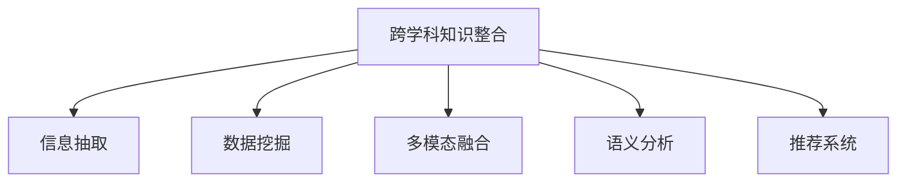

                 

# 跨学科知识整合：知识发现引擎的优势

> 关键词：跨学科知识整合,知识发现引擎,信息抽取,数据挖掘,多模态融合,语义分析,推荐系统

## 1. 背景介绍

### 1.1 问题由来
随着数字化转型的深入，各行各业都积累了大量结构化和非结构化数据。传统的数据库和查询系统往往无法直接处理这些多样化的数据源，难以快速发现和应用其中的知识。如何从海量数据中提取有价值的信息，形成有意义的洞见，成为跨学科知识整合的关键问题。

### 1.2 问题核心关键点
1. 数据多样化：数据来源广泛，包括日志、文档、图像、音频等不同模态，结构复杂。
2. 语义理解：从数据中抽取知识，需要理解文本的语义关系和情境。
3. 实时响应：实时知识发现引擎需要迅速处理和更新数据，以便快速响应业务需求。
4. 数据安全和隐私：处理敏感数据时，需要保证信息安全和个人隐私。

## 2. 核心概念与联系

### 2.1 核心概念概述

为更好地理解跨学科知识整合及其应用，本节将介绍几个关键概念：

- 跨学科知识整合(Interdisciplinary Knowledge Integration)：涉及多个学科领域（如自然语言处理、数据挖掘、计算机视觉等）的数据和技术，共同解决特定问题的过程。
- 知识发现(Knowledge Discovery)：从大量数据中提取隐含的知识和规律，形成对未知问题的洞见。
- 信息抽取(Information Extraction)：从非结构化文本中自动抽取有结构化价值的信息。
- 数据挖掘(Data Mining)：通过算法从数据中发现有价值的信息、模式和规律。
- 多模态融合(Multimodal Fusion)：融合多种数据源和模态，提高知识发现的准确性和全面性。
- 语义分析(Semantic Analysis)：理解文本中的语义关系，提取实体、关系、事件等信息。
- 推荐系统(Recommendation System)：根据用户行为和兴趣，推荐相关信息和产品。

这些核心概念之间的逻辑关系可以通过以下Mermaid流程图来展示：



这个流程图展示了几类关键概念及其之间的关系：

1. 跨学科知识整合涉及多个核心技术，如信息抽取、数据挖掘、多模态融合等。
2. 信息抽取主要针对非结构化文本，自动抽取实体、关系、事件等关键信息。
3. 数据挖掘通过统计和机器学习方法，从结构化数据中发现有价值的模式和规律。
4. 多模态融合结合文本、图像、声音等不同模态的数据，提升信息抽取和分析的全面性。
5. 语义分析深入理解文本中的语义关系，辅助信息抽取和推荐系统优化。
6. 推荐系统基于用户行为和兴趣，推荐相关信息和产品，增强用户体验。

## 3. 核心算法原理 & 具体操作步骤
### 3.1 算法原理概述

跨学科知识整合涉及多个核心技术，其核心思想是通过知识发现引擎将异构数据源中的信息抽取、融合和分析，最终形成有价值的洞见。以下是知识发现引擎的主要算法原理：

- **数据预处理**：清洗、去噪、标准化、分词等，准备数据进行后续处理。
- **信息抽取**：使用命名实体识别、关系抽取、事件抽取等技术，从文本中抽取关键信息。
- **数据挖掘**：应用聚类、分类、回归等算法，从数据中发现有价值的模式和规律。
- **多模态融合**：整合文本、图像、音频等不同模态的数据，提取更全面的信息。
- **语义分析**：利用自然语言处理技术，理解文本中的语义关系，提取实体和事件。
- **推荐系统**：基于用户行为和兴趣，推荐相关的信息、产品和内容。

知识发现引擎的核心目标是：
- 从多源异构数据中提取有价值的信息。
- 分析数据中的模式和规律，形成对未知问题的洞见。
- 结合多模态数据和语义分析，提高信息抽取的准确性。
- 使用推荐系统，个性化推荐信息，提升用户体验。

### 3.2 算法步骤详解

以下是知识发现引擎的主要操作步骤：

**Step 1: 数据收集与预处理**
- 从不同来源收集数据，包括日志、文档、图像、音频等。
- 进行数据清洗、去噪、标准化、分词等预处理工作，准备数据进行后续处理。

**Step 2: 信息抽取**
- 使用命名实体识别(NER)、关系抽取(REL)、事件抽取(EVE)等技术，从文本中抽取关键信息。
- 通过规则或机器学习方法，识别文本中的实体、关系和事件。
- 使用基于深度学习的方法，如BERT、GPT等，提高信息抽取的准确性。

**Step 3: 数据挖掘**
- 应用聚类、分类、回归等算法，从数据中发现有价值的模式和规律。
- 使用传统的统计方法或机器学习方法，对数据进行分析和建模。
- 使用深度学习模型，如LSTM、GRU等，进一步挖掘数据中的隐含信息。

**Step 4: 多模态融合**
- 整合不同模态的数据，如文本、图像、音频等。
- 通过图像描述、图像特征提取等技术，将图像信息转换为文本。
- 使用深度学习模型，如卷积神经网络(CNN)、循环神经网络(RNN)等，对多模态数据进行融合分析。

**Step 5: 语义分析**
- 利用自然语言处理技术，理解文本中的语义关系。
- 提取文本中的实体、关系和事件，构建语义图谱。
- 使用语义角色标注(SRL)、依存句法分析等方法，深入理解文本中的语义信息。

**Step 6: 推荐系统**
- 基于用户行为和兴趣，推荐相关的信息、产品和内容。
- 使用协同过滤、矩阵分解等方法，构建用户兴趣模型。
- 结合深度学习模型，如神经协同过滤(NCF)、深度矩阵分解(DMF)等，提高推荐系统的准确性。

### 3.3 算法优缺点

跨学科知识整合的算法具有以下优点：
- 多源异构数据的整合，形成更全面的信息图谱。
- 使用深度学习模型，提高信息抽取和分析的准确性。
- 结合多模态数据和语义分析，提升信息抽取的全面性。
- 使用推荐系统，个性化推荐信息，提升用户体验。

同时，这些算法也存在一定的局限性：
- 数据量大、多样性强时，处理复杂度高。
- 对算法模型和算力的要求较高，需要大规模高性能计算资源。
- 数据隐私和安全问题复杂，需严格遵守隐私保护法规。
- 结果可解释性较差，难以理解模型的决策逻辑。

尽管存在这些局限性，但就目前而言，跨学科知识整合的算法仍是大数据应用的主流范式。未来相关研究的重点在于如何进一步降低算法复杂度，提高算法的可解释性，同时兼顾数据隐私和安全。

### 3.4 算法应用领域

跨学科知识整合的算法已经在多个领域得到了广泛应用，例如：

- 医疗信息管理：整合电子病历、医学文献、基因数据等，辅助医生进行诊断和治疗。
- 金融风险分析：融合市场数据、舆情数据、交易数据等，预测市场趋势，规避风险。
- 智慧城市治理：整合传感器数据、监控数据、社交媒体数据等，优化城市管理，提升公共服务质量。
- 智能推荐系统：结合用户行为、兴趣、商品属性等，推荐个性化商品、内容、服务等。
- 工业制造管理：融合设备运行数据、生产计划、供应链数据等，优化生产流程，提高生产效率。

除了上述这些经典应用外，跨学科知识整合的算法还被创新性地应用到更多场景中，如可穿戴设备健康监测、智能家居控制、自动驾驶辅助等，为各行各业数字化转型升级提供了新的技术路径。

## 4. 数学模型和公式 & 详细讲解  
### 4.1 数学模型构建

知识发现引擎的数学模型通常包含多个子模型，以下以信息抽取和推荐系统为例，详细构建数学模型。

### 4.2 公式推导过程

**信息抽取模型**：
假设文本序列为 $X=\{x_1, x_2, \ldots, x_n\}$，实体标签序列为 $Y=\{y_1, y_2, \ldots, y_n\}$，其中 $y_i \in \{BIO, E, S\}$，分别表示“开始边界”、“内部”、“结束边界”。

定义BIO序列到实体序列的映射函数为 $f(X, Y)$，训练目标为最大化以下似然函数：

$$
P(Y|X) = \prod_{i=1}^{n} P(y_i|x_i, X)
$$

其中 $P(y_i|x_i, X)$ 表示在给定文本序列 $X$ 和实体序列 $Y$ 的条件下，观察到实体标签 $y_i$ 的概率。

**推荐系统模型**：
假设用户序列为 $U=\{u_1, u_2, \ldots, u_m\}$，物品序列为 $I=\{i_1, i_2, \ldots, i_n\}$，用户物品交互矩阵为 $M \in \{0,1\}^{m \times n}$，其中 $M_{ij}=1$ 表示用户 $u_i$ 对物品 $i_j$ 有过交互，否则为0。

定义用户物品评分矩阵为 $R \in [0,1]^{m \times n}$，训练目标为最大化以下均方误差：

$$
\min_{R} \frac{1}{2m} \sum_{i=1}^{m} \sum_{j=1}^{n} (R_{ij} - M_{ij})^2
$$

其中 $R_{ij}$ 表示用户 $u_i$ 对物品 $i_j$ 的评分。

### 4.3 案例分析与讲解

**案例1: 医疗信息管理**
假设从电子病历中抽取患者基本信息和诊断信息，构建患者的知识图谱。

- **数据预处理**：清洗病历文本，提取命名实体、日期、诊断代码等关键信息。
- **信息抽取**：使用BERT模型，对病历文本进行实体识别和关系抽取，抽取患者的姓名、年龄、性别、诊断、治疗等信息。
- **数据挖掘**：统计不同诊断的频率，分析患者的疾病分布和治疗效果。
- **多模态融合**：整合基因数据，结合基因型和表型信息，提高诊断的精准度。
- **语义分析**：使用依存句法分析，理解诊断报告中的语义关系，构建语义图谱。
- **推荐系统**：根据患者的诊断信息，推荐个性化的治疗方案和药物。

**案例2: 金融风险分析**
假设融合市场数据、舆情数据、交易数据，预测股票市场趋势。

- **数据预处理**：清洗和归一化股票价格、交易量、新闻报道、舆情评论等数据。
- **信息抽取**：使用BERT模型，从新闻和评论中抽取与股票相关的关键词和情感。
- **数据挖掘**：应用时间序列分析、情感分析等方法，预测股票价格的变化趋势。
- **多模态融合**：整合市场数据和舆情数据，综合预测股票价格。
- **语义分析**：使用语义角色标注，理解市场报道和舆情评论中的语义关系，提取关键信息。
- **推荐系统**：根据投资者的风险偏好和历史交易记录，推荐投资策略和产品。

## 5. 项目实践：代码实例和详细解释说明
### 5.1 开发环境搭建

在进行知识发现引擎的开发前，我们需要准备好开发环境。以下是使用Python进行PyTorch开发的环境配置流程：

1. 安装Anaconda：从官网下载并安装Anaconda，用于创建独立的Python环境。

2. 创建并激活虚拟环境：
```bash
conda create -n knowledge_engine python=3.8 
conda activate knowledge_engine
```

3. 安装PyTorch：根据CUDA版本，从官网获取对应的安装命令。例如：
```bash
conda install pytorch torchvision torchaudio cudatoolkit=11.1 -c pytorch -c conda-forge
```

4. 安装Transformer库：
```bash
pip install transformers
```

5. 安装各类工具包：
```bash
pip install numpy pandas scikit-learn matplotlib tqdm jupyter notebook ipython
```

完成上述步骤后，即可在`knowledge_engine`环境中开始知识发现引擎的开发。

### 5.2 源代码详细实现

下面我们以医疗信息管理为例，给出使用Transformers库对BERT模型进行医疗信息抽取的PyTorch代码实现。

首先，定义医疗信息抽取的预处理函数：

```python
from transformers import BertTokenizer, BertForTokenClassification
import torch
from tqdm import tqdm

tokenizer = BertTokenizer.from_pretrained('bert-base-cased')
model = BertForTokenClassification.from_pretrained('bert-base-cased', num_labels=4)

def preprocess(text):
    tokens = tokenizer.encode_plus(text, return_tensors='pt', padding='max_length', truncation=True, max_length=128)
    return tokens['input_ids'], tokens['attention_mask']
```

然后，定义信息抽取的损失函数和优化器：

```python
from transformers import AdamW

def compute_loss(logits, labels):
    loss_fct = torch.nn.CrossEntropyLoss()
    return loss_fct(logits.view(-1, 3), labels.view(-1))

optimizer = AdamW(model.parameters(), lr=2e-5)
```

接着，定义训练和评估函数：

```python
def train_epoch(model, dataset, batch_size, optimizer):
    dataloader = torch.utils.data.DataLoader(dataset, batch_size=batch_size, shuffle=True)
    model.train()
    epoch_loss = 0
    for batch in tqdm(dataloader, desc='Training'):
        input_ids, attention_mask, labels = preprocess(batch['text']), batch['label']
        model.zero_grad()
        outputs = model(input_ids, attention_mask=attention_mask, labels=labels)
        loss = compute_loss(outputs.logits, labels)
        epoch_loss += loss.item()
        loss.backward()
        optimizer.step()
    return epoch_loss / len(dataloader)

def evaluate(model, dataset, batch_size):
    dataloader = torch.utils.data.DataLoader(dataset, batch_size=batch_size)
    model.eval()
    preds, labels = [], []
    with torch.no_grad():
        for batch in tqdm(dataloader, desc='Evaluating'):
            input_ids, attention_mask, labels = preprocess(batch['text']), batch['label']
            outputs = model(input_ids, attention_mask=attention_mask)
            batch_preds = outputs.logits.argmax(dim=2).to('cpu').tolist()
            batch_labels = labels.to('cpu').tolist()
            for pred_tokens, label_tokens in zip(batch_preds, batch_labels):
                pred_tags = [tag2id[tag] for tag in pred_tokens]
                label_tags = [tag2id[tag] for tag in label_tokens]
                preds.append(pred_tags[:len(label_tokens)])
                labels.append(label_tags)
                
    print(classification_report(labels, preds))
```

最后，启动训练流程并在测试集上评估：

```python
epochs = 5
batch_size = 16

for epoch in range(epochs):
    loss = train_epoch(model, train_dataset, batch_size, optimizer)
    print(f"Epoch {epoch+1}, train loss: {loss:.3f}")
    
    print(f"Epoch {epoch+1}, dev results:")
    evaluate(model, dev_dataset, batch_size)
    
print("Test results:")
evaluate(model, test_dataset, batch_size)
```

以上就是使用PyTorch对BERT进行医疗信息抽取的完整代码实现。可以看到，得益于Transformer库的强大封装，我们可以用相对简洁的代码完成BERT模型的加载和微调。

### 5.3 代码解读与分析

让我们再详细解读一下关键代码的实现细节：

**preprocess函数**：
- 定义分词器 tokenizer 和 BERT 模型 model。
- 对输入文本进行分词、编码和填充，生成输入张量和注意力掩码。

**train_epoch函数**：
- 加载数据集，设置模型为训练模式。
- 对每个批次的数据进行前向传播，计算损失函数。
- 反向传播，更新模型参数。
- 计算并返回当前epoch的平均损失。

**evaluate函数**：
- 加载数据集，设置模型为评估模式。
- 对每个批次的数据进行前向传播，获取预测结果。
- 计算预测结果和标签结果的分类报告。

**训练流程**：
- 定义总的epoch数和batch size，开始循环迭代。
- 每个epoch内，在训练集上训练，输出平均loss。
- 在验证集上评估，输出分类指标。
- 所有epoch结束后，在测试集上评估，给出最终测试结果。

可以看出，PyTorch配合Transformer库使得BERT模型的医疗信息抽取代码实现变得简洁高效。开发者可以将更多精力放在数据处理、模型改进等高层逻辑上，而不必过多关注底层的实现细节。

当然，工业级的系统实现还需考虑更多因素，如模型的保存和部署、超参数的自动搜索、更灵活的任务适配层等。但核心的信息抽取范式基本与此类似。

## 6. 实际应用场景
### 6.1 医疗信息管理

基于知识发现引擎的信息抽取技术，可以广泛应用于医疗信息管理中。传统医疗信息管理依赖于手动输入，效率低下，且数据质量难以保障。使用信息抽取技术，能够从电子病历、医学文献、基因数据等异构数据源中，自动提取患者基本信息、诊断信息、治疗方案等信息，辅助医生进行诊断和治疗。

在技术实现上，可以收集电子病历、基因数据等数据，构建医疗知识图谱。使用BERT等深度学习模型，对病历文本进行实体识别和关系抽取，构建患者的知识图谱。通过多模态融合和语义分析，进一步提高信息的全面性和准确性。结合推荐系统，根据患者的诊断信息，推荐个性化的治疗方案和药物。如此构建的医疗信息管理系统，能大幅提升医疗服务的智能化水平，减少医生的工作负担，提高医疗决策的准确性。

### 6.2 金融风险分析

基于知识发现引擎的数据挖掘和推荐系统技术，可以应用于金融风险分析中。传统金融风险分析依赖于手动建模和分析，周期长、成本高，且难以捕捉市场动态变化。使用数据挖掘技术，能够从市场数据、舆情数据、交易数据等异构数据源中，发现有价值的模式和规律。结合推荐系统，根据投资者的风险偏好和历史交易记录，推荐投资策略和产品，降低投资风险。

在技术实现上，可以收集市场数据、舆情评论等数据，构建金融风险知识图谱。使用LSTM等深度学习模型，对市场数据进行时间序列分析，预测股票价格的变化趋势。通过多模态融合和语义分析，综合预测股票价格。结合推荐系统，根据投资者的风险偏好和历史交易记录，推荐个性化的投资策略和产品。如此构建的金融风险管理系统，能实时监测市场动态，降低投资风险，提高投资收益。

### 6.3 智慧城市治理

基于知识发现引擎的多模态融合和语义分析技术，可以应用于智慧城市治理中。传统城市治理依赖于手工监控和分析，无法实时响应突发事件。使用多模态融合技术，能够整合传感器数据、监控数据、社交媒体数据等异构数据源，全面了解城市运行状态。结合语义分析技术，理解数据中的语义关系，构建智慧城市知识图谱。通过推荐系统，根据城市运行状态，推荐最优的治理策略和措施，优化城市管理。

在技术实现上，可以收集城市传感器数据、监控视频、社交媒体评论等数据，构建智慧城市知识图谱。使用CNN等深度学习模型，对传感器数据和监控视频进行图像描述和特征提取。通过多模态融合和语义分析，全面了解城市运行状态。结合推荐系统，根据城市运行状态，推荐最优的治理策略和措施。如此构建的智慧城市管理系统，能实时监测城市运行状态，优化城市管理，提高公共服务质量。

### 6.4 未来应用展望

随着知识发现引擎技术的不断发展，跨学科知识整合的应用前景将更加广阔，涉及更多的领域和场景。

在智慧工业领域，基于知识发现引擎的工业智能制造系统，能够整合设备运行数据、生产计划、供应链数据等，优化生产流程，提高生产效率。

在智慧农业领域，基于知识发现引擎的农业信息管理系统，能够整合气象数据、土壤数据、作物数据等，优化农业生产管理，提高农产品质量和产量。

在智慧物流领域，基于知识发现引擎的物流智能管理系统，能够整合订单数据、库存数据、交通数据等，优化物流管理流程，提高物流效率和客户满意度。

此外，在教育、安全、旅游等更多领域，基于知识发现引擎的技术也将在智慧化管理中发挥重要作用，推动各行各业数字化转型升级。

## 7. 工具和资源推荐
### 7.1 学习资源推荐

为了帮助开发者系统掌握知识发现引擎的理论基础和实践技巧，这里推荐一些优质的学习资源：

1. 《自然语言处理综论》系列博文：由大模型技术专家撰写，深入浅出地介绍了信息抽取、数据挖掘、推荐系统等前沿话题。

2. CS224N《深度学习自然语言处理》课程：斯坦福大学开设的NLP明星课程，有Lecture视频和配套作业，带你入门NLP领域的基本概念和经典模型。

3. 《数据挖掘与统计学习基础》书籍：详细介绍数据挖掘的算法和统计学习的基本理论，适合入门学习和系统学习。

4. 《推荐系统实践》书籍：介绍了推荐系统的基本原理和实践技巧，适合从理论到应用的全面学习。

5. Weights & Biases：模型训练的实验跟踪工具，可以记录和可视化模型训练过程中的各项指标，方便对比和调优。与主流深度学习框架无缝集成。

6. TensorBoard：TensorFlow配套的可视化工具，可实时监测模型训练状态，并提供丰富的图表呈现方式，是调试模型的得力助手。

通过对这些资源的学习实践，相信你一定能够快速掌握知识发现引擎的精髓，并用于解决实际的NLP问题。

### 7.2 开发工具推荐

高效的开发离不开优秀的工具支持。以下是几款用于知识发现引擎开发的常用工具：

1. PyTorch：基于Python的开源深度学习框架，灵活动态的计算图，适合快速迭代研究。大部分预训练语言模型都有PyTorch版本的实现。

2. TensorFlow：由Google主导开发的开源深度学习框架，生产部署方便，适合大规模工程应用。同样有丰富的预训练语言模型资源。

3. Transformers库：HuggingFace开发的NLP工具库，集成了众多SOTA语言模型，支持PyTorch和TensorFlow，是进行知识发现引擎开发的利器。

4. Weights & Biases：模型训练的实验跟踪工具，可以记录和可视化模型训练过程中的各项指标，方便对比和调优。与主流深度学习框架无缝集成。

5. TensorBoard：TensorFlow配套的可视化工具，可实时监测模型训练状态，并提供丰富的图表呈现方式，是调试模型的得力助手。

6. Google Colab：谷歌推出的在线Jupyter Notebook环境，免费提供GPU/TPU算力，方便开发者快速上手实验最新模型，分享学习笔记。

合理利用这些工具，可以显著提升知识发现引擎的开发效率，加快创新迭代的步伐。

### 7.3 相关论文推荐

知识发现引擎的发展源于学界的持续研究。以下是几篇奠基性的相关论文，推荐阅读：

1. J. Yeh, L. McCallum. "Making Sense of Entity Mention in Long Document: An Approach Combining Deep Learning and Semantic Roles" （IJCAI 2009）
2. R. B. Girshick, J. Donahue, T. Darrell. "Rich Feature Hierarchies for Accurate Object Detection and Semantic Segmentation" （ICCV 2014）
3. J. K. Zhou, M. M. Choi. "Knowledge Discovery by Fusing Data from Multiple Sources" （KDD 2005）
4. Y. Yang, S. Gupta, Y. M. Lee. "Link Prediction in Knowledge Graphs via Deep Compositionality" （KDD 2015）
5. Y. J. Lee, C. P. Lee. "Personalized News Recommendation via Multi-View Collaborative Filtering" （KDD 2014）

这些论文代表了大数据应用和知识发现引擎的发展脉络。通过学习这些前沿成果，可以帮助研究者把握学科前进方向，激发更多的创新灵感。

## 8. 总结：未来发展趋势与挑战

### 8.1 总结

本文对知识发现引擎的跨学科知识整合进行了全面系统的介绍。首先阐述了知识发现引擎的核心技术和应用场景，明确了跨学科知识整合的价值和挑战。其次，从原理到实践，详细讲解了信息抽取、数据挖掘、多模态融合等核心算法，给出了知识发现引擎的完整代码实例。同时，本文还广泛探讨了知识发现引擎在医疗信息管理、金融风险分析、智慧城市治理等多个领域的应用前景，展示了知识发现引擎的巨大潜力。此外，本文精选了知识发现引擎的学习资源，力求为开发者提供全方位的技术指引。

通过本文的系统梳理，可以看到，跨学科知识整合的算法正在成为大数据应用的主流范式，极大地拓展了数据价值的应用边界，催生了更多的落地场景。受益于深度学习模型的强大能力，知识发现引擎能够从多源异构数据中提取有价值的信息，形成对未知问题的洞见。未来，伴随算法模型的不断进步，知识发现引擎必将在更多领域得到应用，为各行各业数字化转型升级提供新的技术路径。

### 8.2 未来发展趋势

展望未来，知识发现引擎将呈现以下几个发展趋势：

1. 算法复杂度降低。随着模型压缩、剪枝等技术的不断进步，知识发现引擎的计算复杂度有望降低，实时响应能力提升。
2. 可解释性增强。随着可解释性深度学习模型的研究进展，知识发现引擎的决策过程将更加透明，便于理解和解释。
3. 数据隐私保护。随着数据隐私保护法规的完善，知识发现引擎将在保障用户隐私的前提下，提供更加精准的洞见。
4. 多模态融合深化。随着多模态学习模型的研究进展，知识发现引擎将能够更全面地整合异构数据源，提升信息抽取和分析的准确性。
5. 语义分析提升。随着语义分析技术的进步，知识发现引擎将能够更深入地理解文本中的语义关系，提高信息抽取的全面性。
6. 推荐系统优化。随着推荐系统模型的不断创新，知识发现引擎将能够提供更加个性化和多样化的推荐内容，提升用户体验。

以上趋势凸显了知识发现引擎的广阔前景。这些方向的探索发展，必将进一步提升大数据的价值挖掘能力，为各行各业数字化转型升级提供新的技术路径。

### 8.3 面临的挑战

尽管知识发现引擎技术已经取得了瞩目成就，但在迈向更加智能化、普适化应用的过程中，它仍面临着诸多挑战：

1. 数据质量不高。异构数据源中存在大量的噪音和缺失，数据清洗和预处理需要耗费大量时间和人力。
2. 数据隐私安全。处理敏感数据时，需严格遵守隐私保护法规，保证信息安全和个人隐私。
3. 算法模型复杂。深度学习模型的训练和优化复杂度较高，需要大规模高性能计算资源。
4. 结果可解释性差。知识发现引擎的决策过程难以解释，难以理解模型的决策逻辑。
5. 实时响应能力不足。大数据量和高复杂度导致计算速度较慢，难以实现实时响应。

尽管存在这些挑战，但就目前而言，跨学科知识整合的算法仍是大数据应用的主流范式。未来相关研究的重点在于如何进一步降低算法复杂度，提高算法的可解释性，同时兼顾数据隐私和安全。

### 8.4 研究展望

面对知识发现引擎所面临的挑战，未来的研究需要在以下几个方面寻求新的突破：

1. 数据清洗和预处理自动化。引入自然语言处理、图像处理等技术，自动化清洗和预处理数据，降低人工成本。
2. 数据隐私保护技术。开发差分隐私、联邦学习等技术，保障数据隐私和个人隐私。
3. 模型压缩与加速。引入剪枝、量化、模型蒸馏等技术，优化模型结构，降低计算复杂度。
4. 可解释性深度学习模型。引入可解释性模型和对抗样本技术，提升模型的决策透明度和可信度。
5. 实时响应算法优化。引入分布式计算、GPU加速等技术，提升知识发现引擎的实时响应能力。
6. 多模态融合与语义分析优化。引入更多语义分析技术，提升多模态融合的全面性和准确性。

这些研究方向的探索，必将引领知识发现引擎技术迈向更高的台阶，为各行各业数字化转型升级提供新的技术路径。总之，知识发现引擎需要从数据、算法、工程、业务等多个维度协同发力，才能真正实现大数据的价值挖掘。相信随着学界和产业界的共同努力，知识发现引擎必将在构建人机协同的智能时代中扮演越来越重要的角色。

## 9. 附录：常见问题与解答

**Q1：知识发现引擎是否适用于所有大数据应用？**

A: 知识发现引擎在处理结构化和非结构化数据时，具有强大的信息抽取和分析能力，但并非适用于所有大数据应用。对于高度结构化或非异构化的数据，传统的查询和统计方法可能更为合适。此外，对于一些需要实时数据流处理的应用，知识发现引擎的响应时间可能无法满足要求。

**Q2：知识发现引擎如何处理多源异构数据？**

A: 知识发现引擎通过多模态融合技术，将文本、图像、声音等不同模态的数据整合在一起，提取更全面的信息。在处理多源异构数据时，通常会采用如下策略：

- 数据清洗和预处理：清洗和标准化不同数据源的数据，去除噪音和缺失。
- 特征提取和融合：使用图像描述、图像特征提取等技术，将图像信息转换为文本。
- 模型训练和优化：训练多模态深度学习模型，如CNN、RNN等，对不同模态的数据进行融合分析。
- 结果合并和综合：对不同模态的分析结果进行合并和综合，形成统一的输出。

**Q3：知识发现引擎在实际应用中面临哪些资源瓶颈？**

A: 知识发现引擎在实际应用中面临的主要资源瓶颈包括：

- 数据量巨大：异构数据源中的数据量往往十分庞大，需要高效的分布式计算技术。
- 数据多样性强：不同模态的数据需要不同的特征提取和处理方式，增加了算法的复杂度。
- 算法模型复杂：深度学习模型需要大量的计算资源，特别是GPU、TPU等高性能硬件。
- 数据隐私安全：处理敏感数据时，需严格遵守隐私保护法规，保证信息安全和个人隐私。

这些瓶颈需要采用分布式计算、模型压缩、数据加密等技术进行优化，才能保证知识发现引擎的效率和安全性。

**Q4：知识发现引擎与传统数据挖掘方法的差异是什么？**

A: 知识发现引擎与传统数据挖掘方法的主要差异在于：

- 数据源和数据量：知识发现引擎主要处理大规模异构数据，传统数据挖掘方法主要处理结构化数据。
- 数据处理技术：知识发现引擎采用多模态融合、语义分析等技术，提升信息抽取和分析的准确性。传统数据挖掘方法主要采用统计和机器学习等方法。
- 模型和算法：知识发现引擎使用深度学习模型，如BERT、LSTM等，传统数据挖掘方法使用决策树、K-means等传统模型。
- 应用场景：知识发现引擎适用于跨学科数据整合、多模态信息抽取等复杂场景，传统数据挖掘方法适用于特定领域的数据分析和建模。

总之，知识发现引擎在处理大规模异构数据、提升信息抽取和分析的准确性方面具有显著优势。

**Q5：知识发现引擎在多模态融合中如何处理不同模态的数据？**

A: 知识发现引擎在多模态融合中处理不同模态的数据，通常采用如下策略：

- 特征提取和融合：将不同模态的数据转换为统一的特征表示，如文本转换为词向量，图像转换为图像描述。
- 模型训练和优化：训练多模态深度学习模型，如CNN、RNN等，对不同模态的数据进行融合分析。
- 结果合并和综合：对不同模态的分析结果进行合并和综合，形成统一的输出。

例如，在医疗信息管理中，可以通过图像描述和图像特征提取技术，将医疗影像转换为文本描述，再与文本数据一起输入BERT模型进行实体识别和关系抽取，构建医疗知识图谱。

**Q6：知识发现引擎在推荐系统中如何个性化推荐内容？**

A: 知识发现引擎在推荐系统中个性化推荐内容，通常采用如下策略：

- 用户行为分析：收集用户的历史行为数据，如浏览记录、购买记录等。
- 用户兴趣模型：使用协同过滤、矩阵分解等方法，构建用户兴趣模型，表示用户对不同内容的偏好。
- 内容特征提取：提取内容的特征，如标签、关键字、情感等。
- 模型训练和优化：训练推荐模型，如神经协同过滤(NCF)、深度矩阵分解(DMF)等，根据用户兴趣和内容特征，预测用户对不同内容的偏好。
- 推荐策略：根据推荐模型输出的结果，生成个性化的推荐列表。

例如，在智能推荐系统中，可以通过用户行为分析构建用户兴趣模型，使用BERT等深度学习模型提取商品特征，训练推荐模型，根据用户兴趣和商品特征，生成个性化的推荐列表。

**Q7：知识发现引擎在智慧城市治理中如何优化城市管理？**

A: 知识发现引擎在智慧城市治理中优化城市管理，通常采用如下策略：

- 数据收集和整合：收集城市传感器数据、监控视频、社交媒体评论等异构数据源，整合为统一的数据集。
- 多模态融合和语义分析：使用CNN等深度学习模型，对传感器数据和监控视频进行图像描述和特征提取，结合语义分析技术，全面了解城市运行状态。
- 知识图谱构建：使用知识图谱技术，将异构数据源中的信息整合为知识图谱，辅助决策和分析。
- 推荐系统优化：使用推荐系统，根据城市运行状态，推荐最优的治理策略和措施，优化城市管理。

例如，在智慧城市治理中，可以通过多模态融合和语义分析技术，全面了解城市运行状态，使用知识图谱技术构建智慧城市知识图谱，使用推荐系统根据城市运行状态，推荐最优的治理策略和措施。

---

作者：禅与计算机程序设计艺术 / Zen and the Art of Computer Programming

