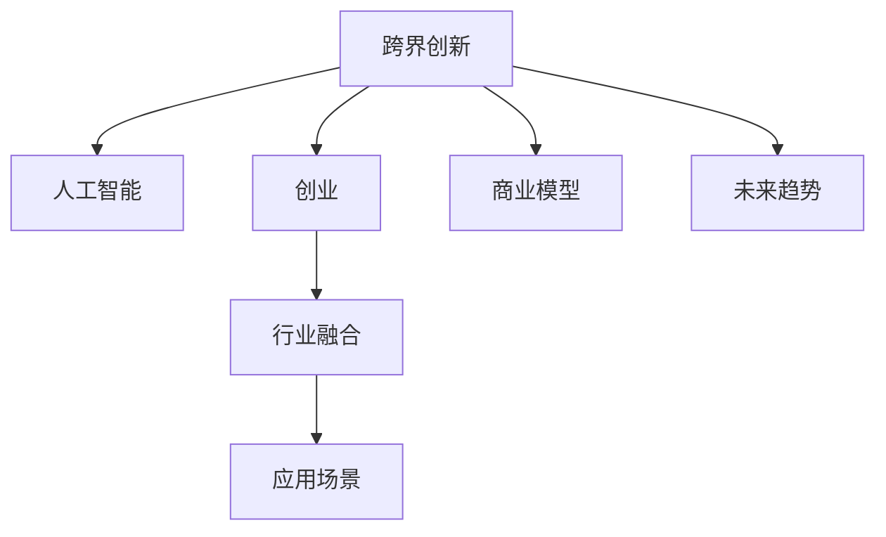

                 

# 跨界创业：打破行业界限的创新

> 关键词：跨界创新,人工智能,创业,行业融合,应用场景,商业模型,未来趋势

## 1. 背景介绍

### 1.1 问题由来
随着科技的发展，各个行业的界限正在变得越来越模糊。人工智能、大数据、区块链等新技术的兴起，使得原本完全不同的领域开始相互渗透、融合，带来了巨大的创新空间和商机。然而，如何利用这些新技术，跨越不同行业的界限，创造全新的商业模式，成为许多创业者和投资者面临的重大挑战。

### 1.2 问题核心关键点
跨界创新的核心在于找到不同行业间的共同点，利用这些共性推动技术应用和业务模式的革新。特别是在人工智能技术飞速发展的背景下，如何结合各行业的应用场景，打破传统行业的边界，是当前创业和创新领域的焦点。

### 1.3 问题研究意义
跨界创业不仅能带来新的商业模式和业务机会，还能推动各行业的技术进步和产业升级。通过跨界融合，可以创造出更具竞争力的产品和服务，满足消费者的多样化需求，同时降低创业的风险和成本。

## 2. 核心概念与联系

### 2.1 核心概念概述

为更好地理解跨界创业，本节将介绍几个核心概念：

- **跨界创新**：指在两个或多个原本不相关的行业或领域之间寻找交集和创新点，将不同领域的知识、技术和理念进行融合，创造出新的产品或服务。
- **人工智能**：指通过算法和模型使计算机模拟人类智能行为，实现自动化、智能化决策和处理。
- **创业**：指创业者利用创新思维，创建新企业、开发新产品或服务，并实现商业化的过程。
- **行业融合**：指不同行业间的界限逐渐模糊，技术、产品、服务相互渗透，形成新的市场和产业形态。
- **应用场景**：指特定技术或产品应用的具体环境和条件，如智能家居、智慧医疗、智能客服等。
- **商业模型**：指企业通过其产品、服务和运营策略，创造价值的商业模式。
- **未来趋势**：指行业发展的长期方向和可能出现的技术、市场、政策变化。

这些核心概念之间的逻辑关系可以通过以下Mermaid流程图来展示：



这个流程图展示了许多核心概念的相互关系：

1. 跨界创新是通过人工智能等技术实现行业融合的基础。
2. 创业是实现跨界创新的手段，创业者利用人工智能技术开发新产品和服务。
3. 行业融合为人工智能提供了广泛的应用场景。
4. 应用场景决定了商业模型的具体形式。
5. 未来趋势指导着跨界创业的方向和重点。

这些概念共同构成了跨界创业的框架，为创业者和投资者提供了理论基础和实践指引。

## 3. 核心算法原理 & 具体操作步骤
### 3.1 算法原理概述

跨界创业中的核心算法原理主要涉及以下三个方面：

- **技术融合算法**：指将不同行业的技术进行融合，形成新的技术解决方案。例如，利用自然语言处理技术优化客服系统，结合物联网技术实现智能家居控制。
- **市场需求分析算法**：指通过数据分析和预测，找到用户需求和市场缺口，从而发现新的创新点。例如，分析社交媒体上的用户反馈，发现对健康管理的强烈需求。
- **商业模式创新算法**：指通过重新设计商业模型，实现收入模式的创新。例如，通过订阅制提供长期服务，或者利用区块链技术实现去中心化商业模式。

这些算法共同作用，使得创业者能够从技术、市场和商业模式三个维度进行全面的创新，实现跨界创业的突破。

### 3.2 算法步骤详解

跨界创业的算法步骤主要包括以下几个关键步骤：

**Step 1: 识别创新点**
- 对不同行业的技术、市场和用户需求进行深入分析，找到共同点和创新点。

**Step 2: 设计技术解决方案**
- 根据识别出的创新点，设计跨界融合的技术解决方案，确定所需的技术架构和算法。

**Step 3: 验证市场潜力**
- 通过市场调研、用户测试等方式，验证新产品的市场潜力和用户接受度。

**Step 4: 设计商业模式**
- 根据市场需求和技术解决方案，设计新的商业模式，确保收入来源和盈利模式。

**Step 5: 开发和迭代产品**
- 开发原型产品，并通过用户反馈进行迭代优化，最终实现市场化产品。

**Step 6: 推广和运营**
- 推广产品，并通过市场反馈和数据分析，不断优化运营策略，提升用户满意度和市场份额。

### 3.3 算法优缺点

跨界创业中的算法具有以下优点：

- **创新性强**：通过融合不同行业的技术和理念，可以创造出新颖的产品和服务。
- **市场潜力大**：跨界融合可以开辟新的市场，满足用户的多样化需求。
- **风险分散**：不同行业的融合可以分散创业风险，降低单一行业风险。

同时，该方法也存在一些局限性：

- **技术复杂性高**：跨界融合涉及多个领域的知识和技术，技术实现难度大。
- **市场需求不确定**：不同行业的需求和市场环境可能存在较大差异，难以准确预测。
- **商业模式复杂**：跨界融合的商业模式可能较为复杂，难以实现快速盈利。

尽管存在这些局限性，但就目前而言，跨界创新依然是创业和创新领域的热点。未来相关研究的重点在于如何进一步降低技术实现的复杂度，提高市场预测的准确性，同时设计更简单、高效的商业模式。

### 3.4 算法应用领域

跨界创业的算法原理和方法，已经在多个领域得到应用，例如：

- **智能家居**：结合物联网和人工智能技术，实现智能控制和家居管理。
- **智能医疗**：将自然语言处理、计算机视觉等技术应用于医学影像分析、疾病预测等。
- **智慧金融**：利用人工智能技术进行风险评估、智能投顾等。
- **智能制造**：通过物联网和机器学习实现生产过程的自动化和优化。
- **智能交通**：结合计算机视觉和自然语言处理技术，提升交通管理和出行体验。

除了上述这些领域外，跨界融合的应用还在不断拓展，为各行各业带来了新的创新机会。

## 4. 数学模型和公式 & 详细讲解  
### 4.1 数学模型构建

本节将使用数学语言对跨界创业的算法进行更加严格的刻画。

假设创新点为 $P$，技术解决方案为 $T$，市场需求为 $M$，商业模式为 $B$。则跨界创业的过程可以抽象为如下数学模型：

$$
M = f(P, T, B)
$$

其中 $f$ 表示需求函数，用于描述市场需求与创新点、技术解决方案和商业模式之间的关系。在具体应用中，可以通过统计学和机器学习等方法，建立市场需求与各个因素之间的数学关系。

### 4.2 公式推导过程

以智能家居为例，假设市场需求 $M$ 由智能家居的普及率 $P$、技术成熟度 $T$ 和商业模式的可持续性 $B$ 决定。可以构建如下线性模型：

$$
M = aP + bT + cB
$$

其中 $a, b, c$ 为模型参数，需要通过数据进行拟合求解。假设我们收集到100个智能家居系统的数据，每个系统有普及率、技术成熟度和商业模式三个特征，则可以使用最小二乘法求解模型参数：

$$
\hat{a}, \hat{b}, \hat{c} = \arg\min_{a, b, c} \sum_{i=1}^{100} (M_i - (aP_i + bT_i + cB_i))^2
$$

通过求解上述优化问题，可以得出市场需求与各个因素之间的关系，从而指导创业决策。

### 4.3 案例分析与讲解

假设我们要开展一个智能家居项目，需要结合智能音箱和智能灯光控制两个技术，并寻找适合的市场。首先，我们可以通过市场调研，收集到100个智能家居系统的数据。其中，普及率从10%到90%不等，技术成熟度从20%到80%不等，商业模式可持续性从30%到70%不等。我们将这些数据作为样本，输入上述线性模型，使用最小二乘法求解模型参数，得出市场需求与各个因素之间的关系：

$$
M = 0.5P + 0.3T + 0.2B
$$

根据此模型，我们可以预测在不同普及率、技术成熟度和商业模式可持续性下，市场需求的变化。例如，当普及率为50%，技术成熟度为60%，商业模式可持续性为50%时，市场需求为：

$$
M = 0.5 \times 0.5 + 0.3 \times 0.6 + 0.2 \times 0.5 = 0.65
$$

这表示市场需求相对较高，智能家居系统的普及率、技术成熟度和商业模式可持续性对市场需求的影响较大。

## 5. 项目实践：代码实例和详细解释说明
### 5.1 开发环境搭建

在进行跨界创业项目开发前，我们需要准备好开发环境。以下是使用Python进行数据分析和模型训练的环境配置流程：

1. 安装Anaconda：从官网下载并安装Anaconda，用于创建独立的Python环境。

2. 创建并激活虚拟环境：
```bash
conda create -n cross_industry python=3.8 
conda activate cross_industry
```

3. 安装PyTorch：根据CUDA版本，从官网获取对应的安装命令。例如：
```bash
conda install pytorch torchvision torchaudio cudatoolkit=11.1 -c pytorch -c conda-forge
```

4. 安装pandas、numpy、scikit-learn等数据分析工具：
```bash
pip install pandas numpy scikit-learn matplotlib tqdm jupyter notebook ipython
```

完成上述步骤后，即可在`cross_industry`环境中开始跨界创业项目开发。

### 5.2 源代码详细实现

下面我以智能家居项目为例，给出使用Python进行需求预测的代码实现。

首先，定义数据处理函数：

```python
import pandas as pd
from sklearn.model_selection import train_test_split

def load_data():
    data = pd.read_csv('smart_home_data.csv')
    features = data[['普及率', '技术成熟度', '商业模式可持续性']]
    labels = data['市场需求']
    X_train, X_test, y_train, y_test = train_test_split(features, labels, test_size=0.2, random_state=42)
    return X_train, X_test, y_train, y_test
```

然后，定义模型训练函数：

```python
from sklearn.linear_model import LinearRegression

def train_model(X_train, y_train):
    model = LinearRegression()
    model.fit(X_train, y_train)
    return model
```

接着，定义模型评估函数：

```python
from sklearn.metrics import mean_squared_error

def evaluate_model(model, X_test, y_test):
    y_pred = model.predict(X_test)
    mse = mean_squared_error(y_test, y_pred)
    return mse
```

最后，启动训练流程并在测试集上评估：

```python
X_train, X_test, y_train, y_test = load_data()

model = train_model(X_train, y_train)
mse = evaluate_model(model, X_test, y_test)
print(f"市场需求预测的MSE为: {mse:.4f}")
```

以上就是使用Python进行智能家居项目需求预测的完整代码实现。可以看到，借助Python的强大数据分析工具，我们可以快速搭建需求预测模型，并对其效果进行评估。

### 5.3 代码解读与分析

让我们再详细解读一下关键代码的实现细节：

**load_data函数**：
- 加载智能家居系统的数据，从中提取特征和标签。
- 对数据进行标准化处理，并划分训练集和测试集。

**train_model函数**：
- 定义线性回归模型，并使用训练集数据进行模型拟合。

**evaluate_model函数**：
- 使用测试集数据进行模型预测，并计算预测值与真实标签之间的均方误差。

**训练流程**：
- 加载数据集，训练线性回归模型。
- 在测试集上评估模型效果，输出均方误差。

可以看到，通过简单的Python代码，我们就可以实现一个基本的需求预测模型。当然，在实际应用中，我们还需要对模型进行更深入的优化和调整，以满足实际需求。

## 6. 实际应用场景
### 6.1 智能家居系统

智能家居系统是跨界创业的典型应用之一。传统家居系统主要依赖手动控制，用户体验和智能化程度较低。通过跨界融合物联网、人工智能等技术，可以实现家居设备的智能控制和自动化管理。

在技术实现上，可以收集用户的行为数据、设备状态数据、环境数据等，构建智能家居系统。通过机器学习算法，对用户行为进行建模，自动调整设备运行状态，提升用户舒适度。例如，当用户在家时，系统自动识别，自动调节灯光、温度、湿度等，确保家居环境舒适宜人。

### 6.2 智能医疗系统

智能医疗系统通过跨界融合人工智能技术，提升医疗服务的智能化水平，实现疾病预测、个性化诊疗、智能诊断等。

在具体应用中，可以收集患者的电子健康档案、基因数据、历史诊断数据等，构建智能医疗系统。通过深度学习算法，对患者的病情进行预测和诊断，制定个性化治疗方案。例如，利用自然语言处理技术，自动提取病历中的关键信息，结合患者的基因数据，进行疾病风险评估和早期预警。

### 6.3 智慧金融系统

智慧金融系统通过跨界融合人工智能技术，提升金融服务的智能化水平，实现风险评估、智能投顾、智能客服等。

在具体应用中，可以收集用户的交易记录、信用评分、社交网络数据等，构建智慧金融系统。通过机器学习算法，对用户进行信用评估，推荐合适的金融产品和服务。例如，利用自然语言处理技术，自动提取用户的社交媒体信息，进行情感分析和风险评估，辅助银行进行贷款审批。

### 6.4 未来应用展望

随着跨界创业的不断发展，未来将在更多领域得到应用，为传统行业带来变革性影响。

在智慧城市治理中，智能交通、智能安防、智能环保等应用将提升城市管理的智能化水平，构建更安全、高效的未来城市。

在智能制造领域，通过跨界融合物联网、机器学习等技术，实现生产过程的自动化和优化。例如，利用计算机视觉技术，自动检测和控制生产线上产品的质量，提升生产效率和产品一致性。

在文娱传媒领域，通过跨界融合人工智能技术，提升内容创作的智能化水平，实现智能编辑、智能推荐等。例如，利用自然语言处理技术，自动生成文章、视频、音乐等创意内容，丰富用户的娱乐体验。

此外，在医疗、教育、农业、能源等众多领域，跨界融合的应用也将不断涌现，为各行各业带来新的创新机会。相信随着技术的不断发展，跨界创业必将在更广阔的应用领域发挥更大作用。

## 7. 工具和资源推荐
### 7.1 学习资源推荐

为了帮助创业者系统掌握跨界创业的理论基础和实践技巧，这里推荐一些优质的学习资源：

1. 《跨界创新：重新定义商业边界》系列博文：由著名创业导师撰写，深入浅出地介绍了跨界创新的原理、案例和策略。

2. 《人工智能：原理与实践》课程：斯坦福大学开设的AI明星课程，涵盖了机器学习、深度学习、自然语言处理等多个领域的核心内容。

3. 《跨界融合：新技术下的商业革命》书籍：系统介绍了如何通过跨界融合新技术，实现商业模式和产品创新。

4. 《智能城市技术与应用》书籍：详细介绍了智慧城市治理的各类技术应用和案例，帮助创业者了解智能城市的发展方向。

5. 《人工智能在医疗中的应用》课程：谷歌与上海交大联合开设的AI课程，介绍了AI在医疗领域的应用和创新点。

通过对这些资源的学习实践，相信你一定能够快速掌握跨界创新的精髓，并用于解决实际的创业问题。

### 7.2 开发工具推荐

高效的开发离不开优秀的工具支持。以下是几款用于跨界创业开发的常用工具：

1. Python：强大的编程语言，广泛用于数据处理、机器学习、自然语言处理等领域。

2. Jupyter Notebook：交互式编程环境，方便开发者快速迭代和分享代码。

3. Google Colab：免费的在线Jupyter Notebook环境，提供GPU/TPU算力，方便快速实验最新模型。

4. Scikit-learn：Python机器学习库，提供了丰富的算法和工具，便于进行数据处理和模型训练。

5. TensorFlow：由Google主导开发的开源深度学习框架，生产部署方便，适合大规模工程应用。

6. PyTorch：基于Python的开源深度学习框架，灵活动态的计算图，适合快速迭代研究。

合理利用这些工具，可以显著提升跨界创业项目的开发效率，加快创新迭代的步伐。

### 7.3 相关论文推荐

跨界创业的研究源于学界的持续研究。以下是几篇奠基性的相关论文，推荐阅读：

1. 《跨界创新：技术的融合与商业模式的变革》：探索不同技术领域的融合及其对商业模式的影响。

2. 《智能家居系统设计》：介绍智能家居系统的技术实现和用户界面设计。

3. 《智能医疗的AI应用》：探讨人工智能技术在医疗领域的应用和潜力。

4. 《智慧金融系统构建》：分析智慧金融系统的技术架构和应用场景。

5. 《跨界创业的策略与实践》：总结跨界创业的策略和成功案例，提供实证分析。

这些论文代表了大规模跨界创业的发展脉络。通过学习这些前沿成果，可以帮助研究者把握学科前进方向，激发更多的创新灵感。

## 8. 总结：未来发展趋势与挑战

### 8.1 总结

本文对跨界创业的理论基础和实践方法进行了全面系统的介绍。首先阐述了跨界创新的研究背景和意义，明确了跨界创业在推动技术应用和商业模式创新方面的独特价值。其次，从原理到实践，详细讲解了跨界创业的算法原理和操作步骤，给出了具体的代码实现和案例分析。同时，本文还广泛探讨了跨界创业在智能家居、智能医疗、智慧金融等多个领域的应用前景，展示了跨界创新的巨大潜力。此外，本文精选了跨界创业的学习资源和开发工具，力求为读者提供全方位的技术指引。

通过本文的系统梳理，可以看到，跨界创业通过融合不同行业的技术和理念，实现了颠覆性的创新，为创业者提供了广阔的想象空间。未来，伴随跨界创业技术的不断发展，相信其将在更广泛的领域发挥作用，推动各行各业的数字化转型和升级。

### 8.2 未来发展趋势

展望未来，跨界创业将呈现以下几个发展趋势：

1. **跨界融合范围扩大**：随着技术的不断发展，跨界融合的行业范围将进一步扩大，涵盖更多新兴领域和技术。例如，物联网、区块链、5G等技术将与更多行业融合，推动新的商业模式和应用场景的诞生。

2. **多技术融合深度加强**：跨界创业将不仅停留在技术的表层融合，而是深入挖掘各技术之间的协同效应，提升系统的整体性能。例如，将自然语言处理、计算机视觉、物联网等技术融合，实现更为复杂的智能应用。

3. **用户需求驱动创新**：跨界创业将更多关注用户需求，通过数据驱动的方式，深入挖掘用户痛点，提升产品体验。例如，利用用户反馈和行为数据，动态调整产品功能和界面，实现个性化服务。

4. **跨界创业生态系统形成**：跨界创业将逐渐形成完整的生态系统，各环节相互协作，共同推动创新发展。例如，创业公司、技术提供商、市场需求方等主体将通过合作，共同促进跨界融合技术的普及和应用。

5. **全球化协作加强**：随着全球化的深入，跨界创业将更多依赖国际合作，共享技术资源和市场机会。例如，通过国际合作，共同开发新的技术标准和应用场景，推动全球范围内的创新发展。

这些趋势凸显了跨界创业的广阔前景。这些方向的探索发展，必将进一步推动跨界创业技术的进步，为社会带来更多的创新价值。

### 8.3 面临的挑战

尽管跨界创业已经取得了一定的成果，但在迈向更加智能化、普适化应用的过程中，它仍面临诸多挑战：

1. **技术复杂性高**：跨界创业涉及多个行业的技术融合，技术实现难度大，需要高度的跨学科知识和技能。

2. **市场需求不确定**：不同行业的需求和市场环境可能存在较大差异，难以准确预测，导致创新方向的不确定性。

3. **商业模式复杂**：跨界融合的商业模式可能较为复杂，难以实现快速盈利，需要经过长期的市场测试和优化。

4. **数据安全和隐私保护**：跨界融合往往涉及大量敏感数据，数据安全和隐私保护成为一大挑战，需要建立完善的数据保护机制。

5. **法律法规约束**：不同行业有不同的法律法规，跨界创业需要遵守各行业的法律法规，确保合规运营。

6. **跨学科人才短缺**：跨界创业需要多学科、多领域的人才，但目前具备跨界融合能力的人才较为稀缺，制约了创业的进程。

这些挑战需要创业者在技术、市场、法律、人才等多个方面进行综合考量，积极应对并寻求突破，才能实现跨界创业的成功。

### 8.4 研究展望

面对跨界创业所面临的挑战，未来的研究需要在以下几个方面寻求新的突破：

1. **多模态数据融合技术**：探索如何将多种数据类型（如文本、图像、语音等）融合在一起，提升跨界融合的深度和广度。

2. **智能推荐系统**：开发智能推荐系统，通过用户行为数据，预测用户需求，提供个性化的产品和服务。

3. **协同创新平台**：构建跨界创业的协同创新平台，整合各行业的技术资源和市场需求，推动技术共享和应用。

4. **隐私保护技术**：研究如何保护跨界融合过程中涉及的敏感数据，确保数据安全和隐私保护。

5. **法规合规工具**：开发法规合规工具，帮助创业者快速了解和遵守各行业的法律法规，确保合规运营。

6. **跨学科人才培养**：培养具备跨学科知识和技术的人才，为跨界创业提供人才保障。

这些研究方向的探索，必将引领跨界创业技术迈向更高的台阶，为社会带来更多的创新价值。

## 9. 附录：常见问题与解答

**Q1：跨界创业是否适用于所有领域？**

A: 跨界创业适用于具有技术融合潜力的领域，如智能家居、智慧医疗、智能制造等。对于技术融合较难实现的领域，如传统农业、手工艺品等，跨界创业的难度较大。

**Q2：如何选择跨界创新的方向？**

A: 跨界创新的方向应基于市场调研和用户需求分析，找到技术、市场和用户需求的交集点。例如，利用大数据分析用户行为，发现需求缺口，进而寻找合适的技术解决方案。

**Q3：跨界创业需要哪些关键资源？**

A: 跨界创业需要具备以下关键资源：
1. 多学科技术团队：具备各行业的技术知识和技能。
2. 丰富的市场数据：包括用户行为数据、市场环境数据等。
3. 完善的商业模式：能够实现商业化的盈利模式。
4. 资金支持：支持技术研发和市场推广。

**Q4：如何应对跨界创业中的技术挑战？**

A: 应对跨界创业中的技术挑战，可以从以下几个方面入手：
1. 选择合适的技术架构和算法。
2. 利用开源社区的资源和工具，加速技术实现。
3. 不断迭代和优化，通过用户反馈改进技术方案。

**Q5：跨界创业如何确保数据安全和隐私保护？**

A: 确保数据安全和隐私保护，可以从以下几个方面入手：
1. 建立完善的数据保护机制，如数据加密、访问控制等。
2. 遵循各行业的法律法规，确保合规运营。
3. 进行数据脱敏处理，保护用户隐私。

这些问题的解答，为跨界创业提供了实际的指导和建议，帮助创业者更好地应对挑战，实现创新突破。

---

作者：禅与计算机程序设计艺术 / Zen and the Art of Computer Programming

