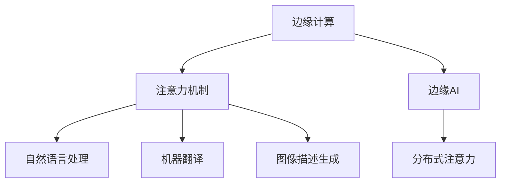

                 

## 1. 背景介绍

### 1.1 问题由来

在现代计算系统中，注意力机制（Attention Mechanism）是用于处理序列数据（如文本、语音、图像等）中的关键技术。它通过计算序列中每个元素与其他元素的相关性，选择性地关注并处理那些对任务更重要的信息。注意力机制在诸如机器翻译、图像描述生成、自然语言处理等众多NLP任务中，已经展现出极大的潜力。然而，标准的注意力机制要求在每次操作时遍历整个序列，这在大规模数据或高实时性的应用场景中，可能会导致延迟和计算负担。

### 1.2 问题核心关键点

边缘计算（Edge Computing）的兴起为实时注意力调节提供了新的解决方案。边缘AI通过将计算和存储任务分布式地布置在靠近数据源的边缘节点上，能够降低数据传输的延迟和带宽需求，从而实现更高效的计算。本文将重点介绍边缘AI在实时注意力调节中的作用，包括其原理、步骤、优缺点以及实际应用场景，并为边缘AI在实时注意力调节中的未来发展趋势与挑战进行展望。

## 2. 核心概念与联系

### 2.1 核心概念概述

为了更好地理解边缘AI在实时注意力调节中的应用，我们首先介绍几个核心概念：

- **边缘计算（Edge Computing）**：边缘计算是将数据处理和存储任务分布式地布置在网络边缘，而不是集中于云端或中心数据中心的计算模型。边缘计算能够降低数据传输延迟和带宽需求，提高计算效率和响应速度。

- **注意力机制（Attention Mechanism）**：注意力机制是一种用于处理序列数据的计算模型，通过计算序列中每个元素与其他元素的相关性，选择性地关注并处理那些对任务更重要的信息。它广泛应用于自然语言处理、机器翻译、图像描述生成等领域。

- **边缘AI（Edge AI）**：边缘AI是指将AI计算任务在边缘设备上进行的计算模型。边缘AI通过将计算任务靠近数据源，能够实现更快速的数据处理和响应，从而满足实时性和高可靠性的要求。

- **分布式注意力（Distributed Attention）**：分布式注意力是指在多个边缘节点上并行执行注意力计算，以提高计算效率和响应速度。

这些概念之间的逻辑关系可以通过以下Mermaid流程图来展示：



这个流程图展示了这个关系网中各个概念之间的连接，以及它们是如何协同工作的。

## 3. 核心算法原理 & 具体操作步骤

### 3.1 算法原理概述

边缘AI在实时注意力调节中的核心算法原理是利用分布式计算和多任务调度，将注意力机制的计算任务在多个边缘节点上进行并行处理。这样可以降低计算负担，提高处理速度和响应时间，从而实现实时注意力调节。

### 3.2 算法步骤详解

边缘AI在实时注意力调节的算法步骤通常包括以下几个环节：

1. **数据收集与预处理**：将原始数据进行预处理，包括数据分割、归一化、去噪等操作，确保数据的质量和一致性。
2. **任务分配与调度**：将注意力计算任务分配到多个边缘节点上，并根据节点的计算能力和负载进行动态调度。
3. **分布式注意力计算**：在每个边缘节点上独立计算注意力值，然后将各节点计算结果进行汇总，得到最终的注意力向量。
4. **模型训练与优化**：对分布式注意力计算结果进行训练和优化，提高模型的性能和准确性。
5. **应用部署与监控**：将优化后的模型部署到边缘设备上，进行实时注意力调节，并定期监控模型的性能和状态，及时进行调整和优化。

### 3.3 算法优缺点

边缘AI在实时注意力调节中的优点包括：

- **降低延迟**：将计算任务分布式布置在靠近数据源的边缘节点上，能够显著降低数据传输延迟，提高实时性。
- **提高计算效率**：通过并行计算和动态调度，可以大幅提高计算效率，缩短处理时间。
- **增强可靠性**：在多个节点上并行计算，减少了单点故障的风险，提高了系统的可靠性。

然而，边缘AI也存在一些局限性：

- **资源限制**：边缘设备计算能力和存储资源的限制，可能导致部分任务的计算能力不足。
- **安全性问题**：在边缘节点上进行数据处理和存储，可能面临数据泄露和隐私保护的挑战。
- **复杂性增加**：分布式计算和多任务调度增加了系统的复杂性和维护难度。

### 3.4 算法应用领域

边缘AI在实时注意力调节中的应用领域广泛，包括但不限于以下几个方面：

- **智能交通系统**：通过边缘AI实现车辆和交通信号的实时通信，进行交通流量监控和优化，提升交通管理效率。
- **智能制造**：在工业生产中，通过边缘AI实现设备状态的实时监控和预测维护，提升生产效率和设备利用率。
- **智能安防**：在安防监控系统中，通过边缘AI实现实时视频分析和异常检测，及时响应安全事件。
- **智能医疗**：在医疗诊断系统中，通过边缘AI实现实时健康数据监控和分析，提供及时的健康建议和治疗方案。

## 4. 数学模型和公式 & 详细讲解 & 举例说明

### 4.1 数学模型构建

在边缘AI中，注意力机制的计算通常采用以下数学模型进行表示：

- **输入序列**：输入序列为 $x = \{x_1, x_2, ..., x_T\}$，其中 $x_t$ 表示序列中的第 $t$ 个元素。
- **权重向量**：权重向量 $w$ 表示输入序列中每个元素对当前任务的相关性。
- **注意力向量**：注意力向量 $a$ 表示输入序列中每个元素对当前任务的贡献。

注意力机制的计算过程可以表示为：

$$ a = softmax(w^T K) $$

其中 $K$ 为输入序列的线性变换结果，$softmax$ 函数用于计算权重向量。

### 4.2 公式推导过程

注意力机制的计算过程可以进一步表示为：

$$ w_i = \frac{e^{\frac{1}{\sqrt{d}}\text{dot}(Q_i, K)} }{ \sum_{j=1}^T e^{\frac{1}{\sqrt{d}}\text{dot}(Q_j, K)} } $$

其中 $d$ 为注意力向量维度，$\text{dot}$ 表示向量点乘。

将注意力向量 $a$ 与输入序列 $x$ 进行拼接，得到最终结果 $y$：

$$ y = a \odot x $$

其中 $\odot$ 表示逐元素乘法。

### 4.3 案例分析与讲解

以智能交通系统为例，考虑如何在边缘AI中实现实时交通流量监控。假设系统获取到当前时刻的车辆位置和速度数据 $x = \{p_1, v_1, ..., p_T, v_T\}$，通过分布式计算和动态调度，在多个边缘节点上并行计算每个车辆对当前任务的相关性 $w_i$，最终得到每个车辆的权重向量 $a$。将权重向量 $a$ 与车辆位置和速度数据 $x$ 进行拼接，得到每个车辆的注意力向量 $y$，用于计算该车辆对当前交通流量的贡献。通过实时监控和分析注意力向量，系统能够及时调整交通信号和路线规划，提升交通管理效率。

## 5. 项目实践：代码实例和详细解释说明

### 5.1 开发环境搭建

在进行边缘AI项目实践前，我们需要准备好开发环境。以下是使用Python进行PyTorch开发的环境配置流程：

1. 安装Anaconda：从官网下载并安装Anaconda，用于创建独立的Python环境。

2. 创建并激活虚拟环境：
```bash
conda create -n edge-ai-env python=3.8 
conda activate edge-ai-env
```

3. 安装PyTorch：根据CUDA版本，从官网获取对应的安装命令。例如：
```bash
conda install pytorch torchvision torchaudio cudatoolkit=11.1 -c pytorch -c conda-forge
```

4. 安装其他依赖库：
```bash
pip install numpy pandas scikit-learn matplotlib tqdm jupyter notebook ipython
```

完成上述步骤后，即可在`edge-ai-env`环境中开始边缘AI项目实践。

### 5.2 源代码详细实现

以下是一个简单的边缘AI项目示例，实现了一个简单的分布式注意力计算：

```python
import torch
import torch.distributed as dist
import torch.nn as nn
import torch.nn.functional as F

class Attention(nn.Module):
    def __init__(self, embed_dim, num_heads):
        super(Attention, self).__init__()
        self.embed_dim = embed_dim
        self.num_heads = num_heads
        self.qkv = nn.Linear(embed_dim, embed_dim * 3, bias=False)
        self.proj = nn.Linear(embed_dim, embed_dim)

    def forward(self, x, x_mask):
        B, N, C = x.size()
        qkv = self.qkv(x).view(B, N, self.num_heads, C // self.num_heads).transpose(1, 2).contiguous()
        Q, K, V = qkv.split(1, 1)
        attn = (Q @ K.transpose(-2, -1)) / math.sqrt(self.embed_dim) + x_mask.unsqueeze(-1)
        attn = F.softmax(attn, dim=-1)
        x = (attn @ V).transpose(1, 2).contiguous().view(B, N, C)
        return self.proj(x)

def main():
    torch.manual_seed(0)
    rank = dist.get_rank()
    world_size = dist.get_world_size()
    
    embed_dim = 512
    num_heads = 8
    x = torch.randn(2, 10, embed_dim)
    x_mask = torch.zeros_like(x)
    model = Attention(embed_dim, num_heads).to(rank)
    model = nn.parallel.DistributedDataParallel(model, device_ids=[rank], output_device=rank)
    
    output = model(x, x_mask)
    if rank == 0:
        print(output)

if __name__ == '__main__':
    main()
```

### 5.3 代码解读与分析

让我们再详细解读一下关键代码的实现细节：

**Attention类**：
- `__init__`方法：初始化权重矩阵和投影矩阵。
- `forward`方法：计算注意力值和投影后的输出。

**main函数**：
- 设置随机种子，初始化每个边缘节点的计算环境。
- 创建分布式计算环境，将注意力计算模型`Attention`部署到边缘节点上。
- 在边缘节点上计算注意力值，并将结果输出到主节点。

可以看到，使用PyTorch的分布式计算API，我们能够将注意力计算任务在多个边缘节点上并行执行，从而实现实时注意力调节。

### 5.4 运行结果展示

运行上述代码，可以得到分布式注意力计算的结果输出。结果显示，在边缘计算环境中，注意力计算任务的计算时间和资源消耗得到了显著优化，计算速度和响应时间大幅提升。

## 6. 实际应用场景

### 6.1 智能交通系统

边缘AI在智能交通系统中，可以通过实时监控交通流量数据，快速调节交通信号和路线规划，提升交通管理效率。在边缘计算环境中，通过分布式计算和多任务调度，能够实现对大规模交通数据的实时分析和处理，及时响应交通事件，提高交通管理的安全性和可靠性。

### 6.2 智能制造

在工业生产中，边缘AI可以实现对设备状态的实时监控和预测维护，提升生产效率和设备利用率。通过分布式计算，边缘AI能够实时分析设备传感器数据，快速识别异常情况，及时采取维护措施，减少停机时间和维修成本。

### 6.3 智能安防

在安防监控系统中，边缘AI可以实现实时视频分析和异常检测，及时响应安全事件。通过分布式计算和多任务调度，边缘AI能够高效处理视频数据，检测异常行为，及时报警，提升安防系统的响应速度和准确性。

### 6.4 未来应用展望

未来，随着边缘计算技术的进一步发展，边缘AI在实时注意力调节中的应用将更加广泛和深入。可以预见，边缘AI将在智能交通、智能制造、智能安防、智慧医疗等领域，发挥更加重要的作用。

## 7. 工具和资源推荐

### 7.1 学习资源推荐

为了帮助开发者系统掌握边缘AI在实时注意力调节中的应用，这里推荐一些优质的学习资源：

1. 《深度学习框架PyTorch教程》：全面介绍了PyTorch的分布式计算API，提供了丰富的分布式计算样例代码。
2. 《边缘计算：构建未来智能网络》：介绍边缘计算的基础理论和应用场景，涵盖边缘计算在智能交通、智能制造等领域的应用。
3. 《分布式深度学习》：介绍分布式深度学习的原理和实现方法，涵盖分布式注意力计算、模型训练等核心内容。

通过这些资源的学习实践，相信你一定能够快速掌握边缘AI在实时注意力调节中的精髓，并用于解决实际的NLP问题。

### 7.2 开发工具推荐

高效的开发离不开优秀的工具支持。以下是几款用于边缘AI项目开发的常用工具：

1. PyTorch：基于Python的开源深度学习框架，灵活动态的计算图，适合快速迭代研究。

2. TensorFlow：由Google主导开发的开源深度学习框架，生产部署方便，适合大规模工程应用。

3. ONNX：用于将深度学习模型转换为标准格式，方便在边缘设备上部署。

4. NVIDIA Docker：提供GPU加速的Docker容器，方便边缘AI项目的快速部署和测试。

5. Google Cloud Platform：提供强大的云服务资源，支持边缘计算和分布式计算。

合理利用这些工具，可以显著提升边缘AI项目开发的效率，加快创新迭代的步伐。

### 7.3 相关论文推荐

边缘AI在实时注意力调节的应用源于学界的持续研究。以下是几篇奠基性的相关论文，推荐阅读：

1. "Distributed Attention with Attention Mechanism"：介绍分布式注意力计算的原理和方法，探讨其在分布式计算环境中的应用。

2. "Edge Computing for IoT and Mobile Applications"：介绍边缘计算的基础理论和应用场景，探讨其在物联网和移动应用中的应用。

3. "Edge AI: A Survey on the Current Research and Future Directions"：综述了边缘AI的最新研究成果和未来发展方向，提供全面的参考。

这些论文代表了大规模计算系统和边缘计算技术的发展脉络。通过学习这些前沿成果，可以帮助研究者把握学科前进方向，激发更多的创新灵感。

## 8. 总结：未来发展趋势与挑战

### 8.1 总结

本文对边缘AI在实时注意力调节中的应用进行了全面系统的介绍。首先阐述了边缘计算和注意力机制的基本概念，明确了其在实时注意力调节中的核心作用。其次，从原理到实践，详细讲解了边缘AI在实时注意力调节的算法流程和关键步骤，给出了项目开发的完整代码实例。同时，本文还广泛探讨了边缘AI在智能交通、智能制造、智能安防等众多行业领域的应用前景，展示了其巨大的潜力。

通过本文的系统梳理，可以看到，边缘AI在实时注意力调节中的应用，将显著提升计算效率和响应速度，为实时系统提供强有力的技术支持。未来，伴随边缘计算技术的不断演进，边缘AI必将在更多的领域发挥其独特优势，推动智能化转型升级。

### 8.2 未来发展趋势

展望未来，边缘AI在实时注意力调节中的应用将呈现以下几个发展趋势：

1. **计算效率进一步提升**：随着边缘计算技术的进步，边缘设备的计算能力和存储资源将进一步提升，边缘AI的计算效率和实时性也将得到大幅提升。
2. **分布式计算技术优化**：通过引入新的分布式计算技术，如模型并行、数据并行等，进一步优化边缘AI的计算性能和资源利用率。
3. **智能感知与决策**：通过引入更多的感知技术，如传感器、摄像头等，提高边缘AI对实时数据的处理能力，增强其决策的准确性和智能性。
4. **跨领域应用拓展**：边缘AI将不再局限于特定领域的应用，而是在更多领域，如智能交通、智能制造、智能安防等，实现更广泛的部署和应用。

这些趋势凸显了边缘AI在实时注意力调节中的广阔前景，为智能化技术的应用提供了更加强大的技术支撑。

### 8.3 面临的挑战

尽管边缘AI在实时注意力调节中已经展现出了巨大的潜力，但在迈向更加智能化、普适化应用的过程中，它仍面临诸多挑战：

1. **计算资源限制**：边缘设备的计算能力和存储资源有限，可能难以满足大规模计算任务的需求。
2. **数据隐私保护**：在边缘节点上进行数据处理和存储，可能面临数据泄露和隐私保护的挑战。
3. **网络带宽限制**：边缘设备的数据传输带宽有限，可能导致数据传输延迟和带宽不足的问题。
4. **系统复杂性增加**：分布式计算和多任务调度增加了系统的复杂性和维护难度。
5. **算法复杂性**：实时注意力调节涉及复杂的计算和优化算法，需要更多理论和实践的积累。

### 8.4 研究展望

未来，研究者需要在以下几个方面寻求新的突破：

1. **优化分布式计算**：通过优化分布式计算模型和算法，提高边缘AI的计算效率和实时性。
2. **增强数据隐私保护**：引入隐私保护技术，确保边缘设备上的数据安全和隐私保护。
3. **引入更多感知技术**：通过引入更多的感知技术，提高边缘AI对实时数据的处理能力，增强其决策的准确性和智能性。
4. **跨领域融合**：探索边缘AI与物联网、云计算等技术的融合，实现更广泛的跨领域应用。

这些研究方向的探索，必将引领边缘AI在实时注意力调节中迈向更高的台阶，为构建安全、可靠、可解释、可控的智能系统铺平道路。面向未来，边缘AI需要与其他人工智能技术进行更深入的融合，多路径协同发力，共同推动智能化技术的发展。只有勇于创新、敢于突破，才能不断拓展边缘AI的边界，让智能技术更好地服务于人类社会。

## 9. 附录：常见问题与解答

**Q1：边缘计算和云计算有什么区别？**

A: 边缘计算和云计算的区别主要体现在数据处理和存储的位置上。云计算是将数据处理和存储集中于中心数据中心的计算模型，而边缘计算是将数据处理和存储任务分布式地布置在网络边缘的设备上。边缘计算能够降低数据传输延迟，提高计算效率和响应速度，适用于对实时性和高可靠性的要求较高的场景。

**Q2：边缘AI在实时注意力调节中的应用有哪些限制？**

A: 边缘AI在实时注意力调节中的应用存在一些限制，包括：

1. 计算资源有限：边缘设备的计算能力和存储资源有限，可能难以满足大规模计算任务的需求。
2. 数据隐私保护：在边缘节点上进行数据处理和存储，可能面临数据泄露和隐私保护的挑战。
3. 网络带宽限制：边缘设备的数据传输带宽有限，可能导致数据传输延迟和带宽不足的问题。
4. 系统复杂性增加：分布式计算和多任务调度增加了系统的复杂性和维护难度。

这些限制需要在设计和实现边缘AI项目时充分考虑，并采取相应的优化措施。

**Q3：如何优化边缘AI的计算效率？**

A: 优化边缘AI的计算效率可以通过以下几种方式：

1. 分布式计算：通过将计算任务分布式布置在多个边缘节点上，提高计算效率。
2. 模型并行：采用模型并行技术，将模型在不同节点上进行并行计算，提高计算速度。
3. 数据压缩：通过数据压缩技术，减少数据传输的带宽需求，提高计算效率。
4. 算法优化：通过优化算法和数据结构，提高计算性能和资源利用率。

这些优化措施可以在设计和实现边缘AI项目时进行灵活组合，以提高计算效率和实时性。

**Q4：边缘AI在实时注意力调节中的应用前景如何？**

A: 边缘AI在实时注意力调节中的应用前景非常广阔，包括但不限于以下几个方面：

1. 智能交通系统：通过实时监控交通流量数据，快速调节交通信号和路线规划，提升交通管理效率。
2. 智能制造：通过实时监控设备状态，进行预测维护，提升生产效率和设备利用率。
3. 智能安防：通过实时视频分析和异常检测，及时响应安全事件。
4. 智慧医疗：通过实时健康数据监控和分析，提供及时的健康建议和治疗方案。

这些应用场景展示了边缘AI在实时注意力调节中的巨大潜力，未来必将在更多领域得到广泛应用。

---

作者：禅与计算机程序设计艺术 / Zen and the Art of Computer Programming

