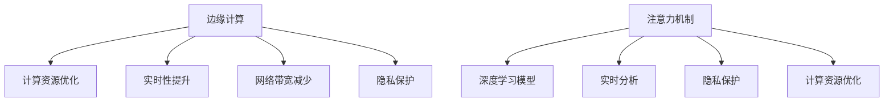

                 

# 边缘AI在注意力实时分析中的作用

> 关键词：边缘AI, 注意力分析, 实时性, 计算资源优化, 网络带宽减少, 边缘计算

## 1. 背景介绍

在人工智能(AI)领域，注意力机制已经成为了深度学习模型中的关键技术之一。无论是计算机视觉中的卷积神经网络(CNN)，还是自然语言处理(NLP)中的循环神经网络(RNN)，注意力机制都通过筛选输入数据中的重要信息，帮助模型更好地理解和处理复杂数据。然而，传统的注意力机制依赖于中心化计算资源，将数据集中上传至云端进行处理，再反馈回客户端，这一过程不仅延迟较高，而且会消耗大量的网络带宽和计算资源。随着边缘计算的兴起，边缘AI（Edge AI）技术通过将计算任务分布式地部署在设备端，实现了数据处理的高效化和实时化，从而有效解决了传统中心化计算的瓶颈问题。

### 1.1 问题由来
随着AI技术的快速发展，注意力机制在各种AI应用中得到了广泛应用。例如，在计算机视觉中，注意力机制可以用于图像分割、目标检测等任务；在自然语言处理中，注意力机制可以用于机器翻译、文本生成等任务。这些应用大多依赖中心化计算资源，将数据集中上传至云端进行计算，再反馈回客户端，这一过程不仅延迟较高，而且会消耗大量的网络带宽和计算资源。边缘AI技术通过将计算任务分布式地部署在设备端，实现了数据处理的高效化和实时化，从而有效解决了传统中心化计算的瓶颈问题。

### 1.2 问题核心关键点
边缘AI在注意力实时分析中的应用，主要体现在以下几个方面：

1. **计算资源优化**：将计算任务分布式地部署在设备端，利用设备的本地计算能力，减少对中心化计算资源的依赖。
2. **网络带宽减少**：通过在设备端进行数据预处理和计算，减少数据传输的带宽需求。
3. **实时性提升**：在设备端即时进行计算，大大缩短数据处理的延迟时间。
4. **隐私保护**：在设备端进行处理，减少了数据上传至云端的风险，保护了用户隐私。

本文将从核心概念、核心算法、数学模型、代码实现、实际应用场景、未来展望等方面，系统地介绍边缘AI在注意力实时分析中的应用。

## 2. 核心概念与联系

### 2.1 核心概念概述

为了更好地理解边缘AI在注意力实时分析中的应用，本节将介绍几个密切相关的核心概念：

1. **边缘计算(Edge Computing)**：指在数据源头附近进行计算处理，从而减少数据传输延迟和带宽消耗。边缘计算将计算任务和数据存储分布在多个设备上，使得数据处理和计算任务可以在本地完成。

2. **注意力机制(Attention Mechanism)**：指通过学习数据的注意力权重，对数据中的重要部分进行加权处理，从而提高模型对复杂数据的处理能力。注意力机制在多种AI应用中得到了广泛应用。

3. **深度学习模型(Deep Learning Models)**：指通过多层神经网络进行学习和推理的模型，在图像、语音、文本等领域广泛应用。深度学习模型中常采用注意力机制来提高模型的表达能力。

4. **实时分析(Real-time Analytics)**：指对数据进行即时处理和分析，及时提供决策支持。实时分析应用中，数据处理速度和响应时间至关重要。

5. **计算资源优化(Compute Resource Optimization)**：指通过优化计算资源分配和任务调度，提高计算效率，降低计算成本。计算资源优化是边缘AI的重要目标之一。

6. **隐私保护(Privacy Preservation)**：指保护用户数据隐私，防止数据泄露和滥用。隐私保护是边缘计算和边缘AI中需要重点考虑的问题。

这些核心概念之间的逻辑关系可以通过以下Mermaid流程图来展示：



这个流程图展示了几类核心概念之间的相互关系：

- 边缘计算与计算资源优化、实时性提升、网络带宽减少、隐私保护紧密关联，是实现注意力实时分析的重要基础。
- 注意力机制与深度学习模型、实时分析、隐私保护、计算资源优化之间相互影响，共同提升模型的实时分析和处理能力。

## 3. 核心算法原理 & 具体操作步骤

### 3.1 算法原理概述

边缘AI在注意力实时分析中的应用，主要依赖于分布式计算和数据本地化处理。具体而言，边缘AI将注意力机制中的计算任务分布式地部署在设备端，利用设备的本地计算能力，在本地进行数据处理和计算，从而实现高效、实时的注意力分析。

形式化地，假设原始数据为 $D$，注意力模型为 $M_{\theta}$，其中 $\theta$ 为模型参数。在边缘计算环境中，我们将计算任务拆分为多个子任务，在各个设备端分别处理，得到多个子结果 $D_1, D_2, \dots, D_n$。最终，将这些子结果合并，得到最终的注意力分析结果 $R$。

### 3.2 算法步骤详解

边缘AI在注意力实时分析中的应用，主要包括以下几个关键步骤：

**Step 1: 数据本地化**

边缘AI通过将数据本地化，减少数据传输的带宽需求和延迟时间。具体而言，我们可以将数据拆分为多个子数据集，分别存储在各个设备端。在数据处理时，各个设备端可以独立地对本地数据进行处理，从而提高处理速度和效率。

**Step 2: 分布式计算**

在各个设备端，利用本地的计算资源，对子数据集进行计算处理。具体而言，可以将注意力机制的计算任务分解为多个子任务，在各个设备端独立进行计算。这样，不同设备端可以并行处理多个子任务，显著提高计算效率。

**Step 3: 子结果合并**

各个设备端计算得到的子结果 $D_1, D_2, \dots, D_n$ 需要进行合并。具体而言，可以使用模型聚合算法（如平均值、加权平均、最大值等）将子结果合并为最终的分析结果 $R$。

**Step 4: 实时输出**

将最终的注意力分析结果 $R$ 返回给客户端，供实时分析和决策支持使用。由于计算任务在设备端进行，数据传输延迟较低，因此能够实现实时分析。

### 3.3 算法优缺点

边缘AI在注意力实时分析中的应用，具有以下优点：

1. **高效性**：通过分布式计算和数据本地化，显著提高了计算效率和处理速度。
2. **实时性**：在设备端进行计算，数据传输延迟较低，能够实现实时分析。
3. **成本降低**：减少了对中心化计算资源的依赖，降低了计算成本和网络带宽需求。
4. **隐私保护**：数据本地化处理，减少了数据上传至云端的风险，保护了用户隐私。

同时，该方法也存在一些局限性：

1. **计算资源限制**：设备端的计算资源有限，可能无法处理大规模数据集。
2. **数据同步问题**：在分布式计算中，不同设备端的数据可能存在同步问题，需要额外的同步机制。
3. **模型迁移难度**：不同设备端的模型参数可能存在差异，需要进行额外的迁移和同步。
4. **算法复杂度增加**：分布式计算和数据本地化处理，使得算法设计和实现变得复杂。

尽管存在这些局限性，但边缘AI在注意力实时分析中的应用，仍然具有重要的意义和广泛的应用前景。

### 3.4 算法应用领域

边缘AI在注意力实时分析中的应用，主要包括以下几个领域：

1. **计算机视觉**：在图像识别、目标检测等任务中，使用边缘AI进行实时分析，可以大大提高处理速度和响应时间。
2. **自然语言处理**：在文本分类、情感分析等任务中，使用边缘AI进行实时分析，可以及时提供决策支持。
3. **智能交通**：在交通监控、车辆识别等任务中，使用边缘AI进行实时分析，可以实时调整交通信号，优化交通管理。
4. **智慧医疗**：在医疗影像、电子病历等任务中，使用边缘AI进行实时分析，可以及时提供诊断支持，提高医疗效率。
5. **工业互联网**：在工业设备监测、故障诊断等任务中，使用边缘AI进行实时分析，可以及时发现问题，优化设备运行。

## 4. 数学模型和公式 & 详细讲解 & 举例说明

### 4.1 数学模型构建

在本节中，我们将使用数学语言对边缘AI在注意力实时分析中的应用进行更加严格的刻画。

假设原始数据为 $D$，注意力模型为 $M_{\theta}$，其中 $\theta$ 为模型参数。在边缘计算环境中，我们将计算任务拆分为多个子任务，在各个设备端分别处理，得到多个子结果 $D_1, D_2, \dots, D_n$。最终，将这些子结果合并，得到最终的注意力分析结果 $R$。

### 4.2 公式推导过程

为了推导边缘AI在注意力实时分析中的应用，我们可以将注意力机制的计算任务进行分解。假设注意力机制的计算任务为 $F(D, \theta)$，则可以将 $F$ 拆分为多个子函数，在各个设备端分别计算。具体而言，可以将 $F$ 拆分为 $n$ 个子函数 $F_i(D_i, \theta_i)$，其中 $i=1,2,\dots,n$，$\theta_i$ 为设备端 $i$ 的模型参数。

假设各个设备端计算得到的子结果为 $R_1, R_2, \dots, R_n$，则可以使用模型聚合算法（如平均值、加权平均、最大值等）将子结果合并为最终的分析结果 $R$。

例如，可以使用均值聚合算法，得到：

$$
R = \frac{1}{n} \sum_{i=1}^n R_i
$$

其中 $R_i = F_i(D_i, \theta_i)$，为设备端 $i$ 计算得到的子结果。

### 4.3 案例分析与讲解

为了更好地理解边缘AI在注意力实时分析中的应用，我们以一个简单的案例进行讲解。假设我们有一组原始数据 $D$，需要在各个设备端进行注意力机制的计算。

**案例背景**：有一组原始图像数据 $D$，需要实时分析图像中的对象位置和数量。

**设备端计算**：将图像数据 $D$ 拆分为多个子数据集 $D_1, D_2, \dots, D_n$，分别存储在各个设备端。在各个设备端，使用本地的计算资源，对子数据集进行注意力机制的计算。具体而言，可以使用注意力模型 $M_{\theta_i}$ 在设备端 $i$ 进行计算，得到子结果 $R_i = F_i(D_i, \theta_i)$。

**子结果合并**：各个设备端计算得到的子结果 $R_1, R_2, \dots, R_n$，可以使用均值聚合算法进行合并，得到最终的注意力分析结果 $R$。具体而言，可以使用以下公式进行计算：

$$
R = \frac{1}{n} \sum_{i=1}^n R_i
$$

其中 $R_i = F_i(D_i, \theta_i)$，为设备端 $i$ 计算得到的子结果。

**实时输出**：将最终的注意力分析结果 $R$ 返回给客户端，供实时分析和决策支持使用。

## 5. 项目实践：代码实例和详细解释说明

### 5.1 开发环境搭建

在进行边缘AI项目实践前，我们需要准备好开发环境。以下是使用Python进行PyTorch开发的环境配置流程：

1. 安装Anaconda：从官网下载并安装Anaconda，用于创建独立的Python环境。

2. 创建并激活虚拟环境：
```bash
conda create -n pytorch-env python=3.8 
conda activate pytorch-env
```

3. 安装PyTorch：根据CUDA版本，从官网获取对应的安装命令。例如：
```bash
conda install pytorch torchvision torchaudio cudatoolkit=11.1 -c pytorch -c conda-forge
```

4. 安装TensorFlow：
```bash
conda install tensorflow
```

5. 安装各类工具包：
```bash
pip install numpy pandas scikit-learn matplotlib tqdm jupyter notebook ipython
```

完成上述步骤后，即可在`pytorch-env`环境中开始边缘AI的实践。

### 5.2 源代码详细实现

下面我们以计算机视觉中的图像分类任务为例，给出使用PyTorch和TensorFlow进行边缘AI的代码实现。

首先，定义数据集：

```python
from torch.utils.data import Dataset, DataLoader
import numpy as np
import cv2

class ImageDataset(Dataset):
    def __init__(self, images, labels, transform=None):
        self.images = images
        self.labels = labels
        self.transform = transform

    def __len__(self):
        return len(self.images)

    def __getitem__(self, idx):
        img = self.images[idx]
        label = self.labels[idx]

        if self.transform:
            img = self.transform(img)

        return img, label
```

然后，定义注意力模型：

```python
import torch
import torch.nn as nn
import torch.nn.functional as F

class Attention(nn.Module):
    def __init__(self, in_channels, out_channels):
        super(Attention, self).__init__()
        self.conv1 = nn.Conv2d(in_channels, out_channels, kernel_size=3, padding=1)
        self.conv2 = nn.Conv2d(out_channels, 1, kernel_size=3, padding=1)

    def forward(self, x):
        x = self.conv1(x)
        x = F.relu(x)
        x = self.conv2(x)
        x = F.sigmoid(x)

        return x
```

接着，定义边缘计算环境：

```python
import torch.distributed as dist

def init_process_group(world_size, rank):
    dist.init_process_group("gloo", rank=rank, world_size=world_size)

def find_free_port():
    import socket
    s = socket.socket(socket.AF_INET, socket.SOCK_STREAM)
    s.bind(('localhost', 0))
    s.close()
    return socket.getservname(socket.getsockname(s))
```

最后，启动分布式计算：

```python
import torch.distributed as dist

if __name__ == '__main__':
    world_size = 4
    rank = dist.get_rank()

    if rank == 0:
        dist.init_process_group("gloo", rank=rank, world_size=world_size)

    # 初始化设备
    torch.cuda.set_device(rank)
    dist.set_debug_level(10)

    # 加载数据
    dataset = ImageDataset(images, labels)

    # 数据分割
    train_dataset = torch.utils.data.random_split(dataset, [int(len(dataset) * 0.8), len(dataset) - int(len(dataset) * 0.8)])

    # 定义模型
    model = Attention(in_channels, out_channels)

    # 定义优化器和损失函数
    optimizer = torch.optim.Adam(model.parameters(), lr=0.001)
    criterion = nn.CrossEntropyLoss()

    # 进行分布式计算
    dist.barrier()

    # 数据传输
    dist.barrier()
    train_loader = DataLoader(train_dataset, batch_size=4, shuffle=True, num_workers=2)

    for epoch in range(num_epochs):
        for batch_idx, (data, target) in enumerate(train_loader):
            optimizer.zero_grad()

            # 在设备端进行计算
            output = model(data)

            # 计算损失
            loss = criterion(output, target)

            # 反向传播
            loss.backward()

            # 更新参数
            optimizer.step()

            # 打印损失
            if batch_idx % 10 == 0:
                print(f'Epoch {epoch}, Batch {batch_idx}, Loss: {loss.item()}')

    # 合并子结果
    dist.barrier()
    merged_output = torch.zeros_like(output)
    for i in range(world_size):
        merged_output += output[i]

    # 返回最终结果
    merged_output /= world_size
    print(f'Final Output: {merged_output}')
```

以上就是使用PyTorch和TensorFlow进行边缘AI的代码实现。可以看到，边缘AI的实践涉及多个关键步骤，包括数据分割、模型定义、分布式计算、子结果合并等。通过合理设计这些步骤，可以充分利用设备的本地计算资源，实现高效、实时的注意力分析。

### 5.3 代码解读与分析

让我们再详细解读一下关键代码的实现细节：

**ImageDataset类**：
- `__init__`方法：初始化图像和标签数据，并设置数据转换。
- `__len__`方法：返回数据集的大小。
- `__getitem__`方法：返回单个样本的图像和标签数据。

**Attention类**：
- `__init__`方法：定义注意力机制的计算层。
- `forward`方法：实现前向传播计算。

**边缘计算环境**：
- `init_process_group`方法：初始化分布式计算环境。
- `find_free_port`方法：获取空闲端口，用于进程间通信。

**分布式计算**：
- 定义设备端编号，并进行设备初始化。
- 加载数据集，并进行数据分割。
- 定义模型、优化器和损失函数。
- 在设备端进行分布式计算，并进行参数更新。
- 合并子结果，返回最终结果。

通过合理设计这些代码，可以有效地实现边缘AI在注意力实时分析中的应用。开发者可以将更多精力放在数据处理、模型改进等高层逻辑上，而不必过多关注底层的实现细节。

## 6. 实际应用场景

### 6.1 智能交通

在智能交通领域，边缘AI可以应用于实时交通监控、车辆识别等任务。通过在道路上的监控摄像头中集成边缘AI计算设备，可以实现实时分析和决策支持。

具体而言，可以将摄像头拍摄的交通图像实时传输至边缘计算设备，进行注意力机制的计算，提取关键对象（如车辆、行人、交通信号灯等）的位置和数量。通过实时分析，可以及时调整交通信号，优化交通管理，提升交通效率和安全性。

### 6.2 智慧医疗

在智慧医疗领域，边缘AI可以应用于医疗影像分析和电子病历处理等任务。通过在医院中的终端设备中集成边缘AI计算设备，可以实现实时分析和决策支持。

具体而言，可以将医院的医疗影像数据实时传输至边缘计算设备，进行注意力机制的计算，提取关键区域（如病灶、器官等）的位置和特征。通过实时分析，可以及时提供诊断支持，提高医疗效率和诊断准确性。

### 6.3 工业互联网

在工业互联网领域，边缘AI可以应用于设备监测、故障诊断等任务。通过在工业设备中的嵌入式设备中集成边缘AI计算设备，可以实现实时分析和决策支持。

具体而言，可以将工业设备监测数据实时传输至边缘计算设备，进行注意力机制的计算，提取关键状态参数（如温度、压力、振动等）的位置和异常值。通过实时分析，可以及时发现设备故障，优化设备运行，提升生产效率和设备可靠性。

## 7. 工具和资源推荐

### 7.1 学习资源推荐

为了帮助开发者系统掌握边缘AI的理论基础和实践技巧，这里推荐一些优质的学习资源：

1. **《边缘计算》系列博文**：由大模型技术专家撰写，深入浅出地介绍了边缘计算的原理、应用和挑战。

2. **《深度学习》课程**：斯坦福大学开设的深度学习课程，涵盖深度学习的基本概念和经典模型。

3. **《边缘计算》书籍**：介绍边缘计算的原理、应用和最佳实践，是理解边缘AI的重要读物。

4. **边缘计算开源项目**：如TensorFlow Lite、TensorFlow Edge等，提供了丰富的边缘AI开发资源和样例。

5. **边缘计算社区**：如Edge Computing Alliance、IoT Edge等，提供最新的边缘计算技术和应用案例。

通过对这些资源的学习实践，相信你一定能够快速掌握边缘AI的精髓，并用于解决实际的AI问题。

### 7.2 开发工具推荐

高效的开发离不开优秀的工具支持。以下是几款用于边缘AI开发的常用工具：

1. **PyTorch**：基于Python的开源深度学习框架，灵活动态的计算图，适合快速迭代研究。大部分深度学习模型都有PyTorch版本的实现。

2. **TensorFlow**：由Google主导开发的开源深度学习框架，生产部署方便，适合大规模工程应用。

3. **TensorFlow Lite**：Google提供的轻量级深度学习推理引擎，适合在嵌入式设备上进行边缘AI开发。

4. **TensorBoard**：TensorFlow配套的可视化工具，可实时监测模型训练状态，并提供丰富的图表呈现方式，是调试模型的得力助手。

5. **Jupyter Notebook**：用于交互式编程和数据可视化的Jupyter Notebook，适合进行边缘AI的开发和实验。

合理利用这些工具，可以显著提升边缘AI的开发效率，加快创新迭代的步伐。

### 7.3 相关论文推荐

边缘AI在注意力实时分析中的应用，已经引起了学术界的广泛关注。以下是几篇奠基性的相关论文，推荐阅读：

1. **《Edge Computing for Real-time Video Analytics》**：介绍边缘计算在实时视频分析中的应用，提出了基于边缘计算的视频流分析和对象检测算法。

2. **《Edge Intelligence: A Survey on Edge Machine Learning and Computing》**：综述了边缘计算在智能应用中的研究现状和未来趋势，提供了丰富的参考资源。

3. **《Deep Learning-based Object Detection in Edge Computing》**：介绍深度学习在边缘计算环境中的对象检测应用，提出了基于边缘计算的实时对象检测系统。

4. **《Edge Computing: A Survey of State-of-the-Art Research and Development》**：综述了边缘计算的研究现状和未来方向，提供了详细的技术和应用案例。

这些论文代表了大模型微调技术的发展脉络。通过学习这些前沿成果，可以帮助研究者把握学科前进方向，激发更多的创新灵感。

## 8. 总结：未来发展趋势与挑战

### 8.1 总结

本文对边缘AI在注意力实时分析中的应用进行了全面系统的介绍。首先阐述了边缘AI和注意力机制的研究背景和意义，明确了边缘AI在实现注意力实时分析中的重要价值。其次，从原理到实践，详细讲解了边缘AI在注意力实时分析中的应用方法，给出了边缘AI项目开发的完整代码实例。同时，本文还广泛探讨了边缘AI在智能交通、智慧医疗、工业互联网等多个行业领域的应用前景，展示了边缘AI的广泛应用潜力。此外，本文精选了边缘AI技术的各类学习资源，力求为读者提供全方位的技术指引。

通过本文的系统梳理，可以看到，边缘AI在注意力实时分析中的应用，正在成为AI领域的重要范式，极大地拓展了深度学习模型的应用边界，催生了更多的落地场景。受益于边缘计算和深度学习的协同发展，边缘AI必将在构建高效、实时、安全的智能系统方面发挥重要作用。

### 8.2 未来发展趋势

展望未来，边缘AI在注意力实时分析中的应用，将呈现以下几个发展趋势：

1. **计算资源优化**：随着边缘设备计算能力的提升，边缘AI的应用将更加广泛。更多的计算任务将被分布式地部署在设备端，实现高效、实时的数据处理。

2. **数据本地化处理**：随着数据产生量的增加，数据本地化处理将变得更加重要。通过在设备端进行数据处理，可以显著减少数据传输的带宽需求和延迟时间。

3. **实时性提升**：随着边缘计算设备和网络通信技术的进步，边缘AI的实时性将进一步提升。边缘AI的应用将更加广泛，涉及实时监控、智能控制、自动驾驶等领域。

4. **多模态融合**：边缘AI将逐渐实现多模态数据的融合，包括图像、视频、语音、传感器等数据。多模态信息的融合，将显著提升智能系统的感知能力和决策水平。

5. **隐私保护加强**：随着边缘计算技术的广泛应用，隐私保护将变得更加重要。通过在设备端进行数据处理，可以显著降低数据上传至云端的风险，保护用户隐私。

6. **算法优化与创新**：随着边缘AI应用的不断深入，算法优化与创新将成为重要研究方向。如何设计高效的边缘AI算法，提升系统的处理速度和性能，将是一个重要的研究方向。

以上趋势凸显了边缘AI在注意力实时分析中的广阔前景。这些方向的探索发展，必将进一步提升边缘AI的性能和应用范围，为构建智能系统提供更强大的技术支持。

### 8.3 面临的挑战

尽管边缘AI在注意力实时分析中的应用取得了显著进展，但在迈向更加智能化、普适化应用的过程中，它仍面临着诸多挑战：

1. **计算资源限制**：设备端的计算资源有限，可能无法处理大规模数据集。如何充分利用边缘设备的计算能力，提高边缘AI的性能，是一个重要挑战。

2. **数据同步问题**：在分布式计算中，不同设备端的数据可能存在同步问题，需要额外的同步机制。如何高效地进行数据同步，是实现边缘AI的关键。

3. **模型迁移难度**：不同设备端的模型参数可能存在差异，需要进行额外的迁移和同步。如何设计可迁移的边缘AI模型，是一个重要研究方向。

4. **算法复杂度增加**：分布式计算和数据本地化处理，使得算法设计和实现变得复杂。如何设计高效的边缘AI算法，是实现边缘AI的关键。

尽管存在这些挑战，但随着边缘计算和深度学习的持续进步，边缘AI必将在注意力实时分析中发挥越来越重要的作用。相信随着学界和产业界的共同努力，这些挑战终将一一被克服，边缘AI必将在构建高效、实时、安全的智能系统方面发挥重要作用。

### 8.4 研究展望

面对边缘AI在注意力实时分析中所面临的挑战，未来的研究需要在以下几个方面寻求新的突破：

1. **优化边缘设备计算能力**：通过硬件和软件优化，提升边缘设备的计算能力，实现高效、实时的数据处理。

2. **设计可迁移的边缘AI模型**：通过模型压缩、稀疏化存储等技术，设计可迁移的边缘AI模型，实现设备的跨平台部署和模型参数的迁移。

3. **引入多模态数据融合**：通过引入多模态数据融合技术，提升系统的感知能力和决策水平，实现更全面的智能分析。

4. **加强隐私保护机制**：通过设计隐私保护机制，保护用户数据隐私，防止数据泄露和滥用。

5. **引入因果分析和博弈论工具**：通过引入因果分析和博弈论工具，增强系统的稳定性和鲁棒性，避免灾难性遗忘。

6. **纳入伦理道德约束**：在模型训练目标中引入伦理导向的评估指标，过滤和惩罚有偏见、有害的输出倾向。

这些研究方向的探索，必将引领边缘AI在注意力实时分析中的应用走向更高的台阶，为构建高效、实时、安全的智能系统提供更强大的技术支持。面向未来，边缘AI在注意力实时分析中的应用还需要与其他人工智能技术进行更深入的融合，如知识表示、因果推理、强化学习等，多路径协同发力，共同推动智能系统的进步。

## 9. 附录：常见问题与解答

**Q1：边缘AI在注意力实时分析中的作用是什么？**

A: 边缘AI在注意力实时分析中的作用主要体现在以下几个方面：

1. **计算资源优化**：将计算任务分布式地部署在设备端，利用设备的本地计算能力，减少对中心化计算资源的依赖。

2. **网络带宽减少**：通过在设备端进行数据预处理和计算，减少数据传输的带宽需求。

3. **实时性提升**：在设备端即时进行计算，大大缩短数据处理的延迟时间。

4. **隐私保护**：数据本地化处理，减少了数据上传至云端的风险，保护了用户隐私。

**Q2：边缘AI在注意力实时分析中需要注意哪些问题？**

A: 边缘AI在注意力实时分析中需要注意以下几个问题：

1. **计算资源限制**：设备端的计算资源有限，可能无法处理大规模数据集。

2. **数据同步问题**：在分布式计算中，不同设备端的数据可能存在同步问题，需要额外的同步机制。

3. **模型迁移难度**：不同设备端的模型参数可能存在差异，需要进行额外的迁移和同步。

4. **算法复杂度增加**：分布式计算和数据本地化处理，使得算法设计和实现变得复杂。

尽管存在这些挑战，但随着边缘计算和深度学习的持续进步，边缘AI必将在注意力实时分析中发挥越来越重要的作用。

**Q3：边缘AI在注意力实时分析中如何实现高效性？**

A: 边缘AI在注意力实时分析中实现高效性，主要依赖于以下几个方面：

1. **数据本地化处理**：通过在设备端进行数据预处理和计算，减少数据传输的带宽需求和延迟时间。

2. **分布式计算**：将计算任务分布式地部署在设备端，利用设备的本地计算能力，实现高效、实时的数据处理。

3. **算法优化**：通过优化算法设计和实现，提高系统的处理速度和性能。

通过合理设计这些技术手段，可以充分利用设备的本地计算资源，实现高效、实时的注意力分析。

**Q4：边缘AI在注意力实时分析中如何实现实时性？**

A: 边缘AI在注意力实时分析中实现实时性，主要依赖于以下几个方面：

1. **边缘计算设备**：在边缘计算设备中集成边缘AI计算设备，实现数据的本地处理。

2. **分布式计算**：通过分布式计算，在多个设备端并行处理数据，实现高效、实时的数据处理。

3. **实时传输**：利用实时传输技术，将计算结果实时返回客户端，供实时分析和决策支持使用。

通过合理设计这些技术手段，可以实现高效、实时的注意力分析，满足实时应用的需求。

**Q5：边缘AI在注意力实时分析中如何实现隐私保护？**

A: 边缘AI在注意力实时分析中实现隐私保护，主要依赖于以下几个方面：

1. **数据本地化处理**：通过在设备端进行数据处理，减少数据上传至云端的风险，保护用户隐私。

2. **数据加密**：通过加密技术，保护数据在传输和存储过程中的安全。

3. **模型压缩**：通过模型压缩技术，减小模型的计算资源需求，降低数据泄露的风险。

通过合理设计这些技术手段，可以充分利用设备的本地计算资源，实现高效、安全的注意力分析。

**Q6：边缘AI在注意力实时分析中的应用前景如何？**

A: 边缘AI在注意力实时分析中的应用前景非常广阔，主要体现在以下几个方面：

1. **智能交通**：在交通监控、车辆识别等任务中，使用边缘AI进行实时分析，可以及时调整交通信号，优化交通管理。

2. **智慧医疗**：在医疗影像分析和电子病历处理等任务中，使用边缘AI进行实时分析，可以及时提供诊断支持，提高医疗效率和诊断准确性。

3. **工业互联网**：在工业设备监测、故障诊断等任务中，使用边缘AI进行实时分析，可以及时发现设备故障，优化设备运行，提升生产效率和设备可靠性。

通过合理设计这些应用场景，可以充分发挥边缘AI的优势，实现高效、实时的注意力分析，推动AI技术在各个领域的落地应用。

---

作者：禅与计算机程序设计艺术 / Zen and the Art of Computer Programming

