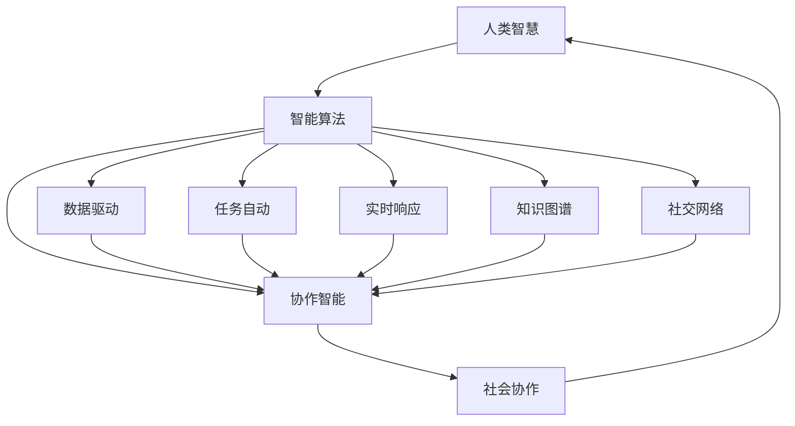

                 

# 连接人类智慧的纽带：人类计算的协作精神

> 关键词：人机协作, 人类计算, 智能算法, 协作智能, 社会协作, 知识图谱, 协作网络

## 1. 背景介绍

在人类历史的长河中，智慧的传递和积累一直是社会进步的动力源泉。从古至今，信息交流、协作创新一直是我们社会发展的重要推动力。然而，在信息化时代，随着数据量呈爆炸性增长，人类智慧的积累速度变得愈发缓慢。幸运的是，随着人工智能技术的迅猛发展，尤其是智能算法的广泛应用，我们有了新的工具来加快这一过程，并实现人机协作的智能化升级。

人类计算（Human-Centered Computing）的理念便应运而生。它不仅强调算法智能，更着眼于如何更好地将人类智慧融入计算过程中，通过协作实现更高效、更全面的智能解决方案。这一理念要求我们既要充分利用智能算法的优势，也要深刻理解人类的智慧和情感，从而创造出真正能够满足人类需求的智能系统。

本论文将深入探讨人类计算的协作精神，围绕“连接人类智慧的纽带”这一主题，展示人类计算在实际应用中的实现路径，并探讨其在未来发展中的潜力与挑战。

## 2. 核心概念与联系

### 2.1 核心概念概述

**人机协作**：指将人类智慧与智能算法结合，实现优势互补的过程。人机协作不仅限于数据处理和任务执行，更包括知识共享、情境理解、价值判断等高阶智能活动。

**人类计算**：一种以人为本的计算范式，强调计算与人类智慧的协同工作，旨在提升计算结果的智能性和可解释性，更好地服务于人类社会。

**智能算法**：基于人工智能技术的算法，能够自主学习、自我优化，并在大数据和复杂问题上展示出色性能。

**协作智能**：通过算法与人类的互动，增强智能系统的理解和决策能力，实现更高效、更符合人类需求的智能服务。

**社会协作网络**：以人为节点，以知识、信息、情感为边，构建的社会协作网络，用于模拟人类社会中的协作过程，实现更全面的智能洞察。

### 2.2 核心概念原理和架构的 Mermaid 流程图



该流程图展示了人类智慧与智能算法之间的协作关系：

1. **A节点（人类智慧）**：代表人类的知识、经验和情感，是人类计算的核心。
2. **B节点（智能算法）**：代表人工智能算法，包括机器学习、深度学习等，是协作智能的技术基础。
3. **C节点（协作智能）**：代表基于人机协作的智能系统，能够在具体应用场景中高效解决问题。
4. **D节点（数据驱动）**：智能算法通过数据驱动的方式，学习人类智慧中的规律。
5. **E节点（任务自动）**：智能算法能够自动处理和优化各种任务，提高工作效率。
6. **F节点（实时响应）**：智能算法能够实时响应用户需求，提升用户体验。
7. **G节点（知识图谱）**：智能算法利用知识图谱，获取和整合大量人类知识。
8. **H节点（社交网络）**：智能算法通过分析社交网络中的信息流，理解人类情感和行为模式。
9. **I节点（社会协作）**：协作智能系统通过与人类社会互动，不断优化和扩展自己的能力。

这些节点之间通过边（知识、信息、情感）进行交互，实现了人机协作的智能化。

## 3. 核心算法原理 & 具体操作步骤

### 3.1 算法原理概述

基于协作智能的计算模型通常由以下几个核心部分构成：

- **知识图谱构建**：将结构化和非结构化的人类知识整合为可计算的形式，支持智能算法的推理和决策。
- **社交网络分析**：分析人类社交网络中的行为模式和情感倾向，为智能系统提供情境理解的基础。
- **数据驱动学习**：利用大规模数据训练智能算法，使其能够学习人类智慧中的复杂规律。
- **协同优化**：通过人机协作，实现智能算法的不断优化和改进。

### 3.2 算法步骤详解

1. **知识图谱构建**
    - 收集和整理领域内的人类知识，包括文献、数据、经验等。
    - 将这些知识转化为结构化的图谱形式，构建节点和边的关系。
    - 使用自然语言处理技术，从非结构化数据中提取实体和关系，并映射到知识图谱中。

2. **社交网络分析**
    - 收集和分析人类社交网络中的数据，包括社交媒体互动、邮件交流、线下活动等。
    - 提取社交网络中的行为模式和情感倾向，为智能系统提供情境理解的基础。
    - 通过情感分析技术，理解人类情感变化和偏好，优化智能系统的响应策略。

3. **数据驱动学习**
    - 使用大数据技术，收集和处理海量的人类行为数据，构建训练数据集。
    - 使用机器学习和深度学习算法，训练智能算法，学习人类智慧中的复杂规律。
    - 通过持续学习，不断更新智能算法，使其能够适应数据分布的变化。

4. **协同优化**
    - 设计人机交互界面，使人类能够实时输入和反馈信息。
    - 根据人类反馈，调整和优化智能算法的参数和行为策略。
    - 通过迭代和优化，提升智能系统的性能和用户体验。

### 3.3 算法优缺点

**优点**：
- 能够充分利用人类智慧，提升智能系统的可解释性和适用性。
- 通过社会协作网络，实现更全面、多维度的智能洞察。
- 通过协同优化，不断提高智能系统的性能和用户体验。

**缺点**：
- 构建知识图谱和社交网络需要大量时间和资源。
- 数据驱动学习需要大量高质量的数据，数据获取成本较高。
- 协同优化过程需要人类持续参与，可能存在主观性和偏差。

### 3.4 算法应用领域

基于协作智能的计算模型已在多个领域得到应用：

1. **医疗健康**：通过知识图谱和社会网络分析，实现个性化医疗方案的设计和评估。
2. **金融服务**：利用大数据和协同优化，提升风险评估和市场预测的准确性。
3. **教育培训**：结合社交网络和情感分析，提供个性化学习路径和实时反馈。
4. **城市管理**：通过智能算法和协作网络，优化城市交通、公共安全等公共服务。
5. **市场营销**：利用大数据和情感分析，实现精准营销和客户关系管理。

## 4. 数学模型和公式 & 详细讲解 & 举例说明

### 4.1 数学模型构建

协作智能的计算模型通常由以下部分组成：

1. **知识图谱模型**：描述知识节点和边的关系，通常使用图结构表示，如图神经网络（Graph Neural Networks, GNN）。
2. **社交网络模型**：描述人类社交网络的行为模式和情感倾向，通常使用关系图模型表示，如GNN。
3. **数据驱动模型**：基于机器学习和深度学习算法，用于数据处理和智能推理，如卷积神经网络（Convolutional Neural Networks, CNN）和循环神经网络（Recurrent Neural Networks, RNN）。
4. **协同优化模型**：结合人类反馈和智能算法，实现动态优化，如强化学习（Reinforcement Learning, RL）。

### 4.2 公式推导过程

以下以知识图谱构建和社交网络分析为例，展示其数学模型和公式推导过程。

**知识图谱构建**

知识图谱通常使用三元组 $(h, r, t)$ 表示，其中 $h$ 为头实体，$r$ 为关系，$t$ 为尾实体。知识图谱的构建过程包括实体识别、关系抽取和关系融合等步骤。假设知识图谱的节点数和边数为 $N$ 和 $E$，则知识图谱的矩阵表示为 $\mathbf{K}$：

$$
\mathbf{K} = \begin{pmatrix} 
\mathbf{K}^{(1,1)} & \mathbf{K}^{(1,2)} & \ldots & \mathbf{K}^{(1,N)} \\
\mathbf{K}^{(2,1)} & \mathbf{K}^{(2,2)} & \ldots & \mathbf{K}^{(2,N)} \\
\vdots & \vdots & \ddots & \vdots \\
\mathbf{K}^{(N,1)} & \mathbf{K}^{(N,2)} & \ldots & \mathbf{K}^{(N,N)}
\end{pmatrix}
$$

其中 $\mathbf{K}^{(i,j)}$ 表示节点 $i$ 和节点 $j$ 之间的关系强度。

**社交网络分析**

社交网络分析通常使用图结构表示，节点表示个体，边表示个体之间的关系。假设社交网络中节点数为 $M$，边数为 $E$，则社交网络的结构可以用邻接矩阵 $\mathbf{S}$ 表示：

$$
\mathbf{S} = \begin{pmatrix} 
\mathbf{S}^{(1,1)} & \mathbf{S}^{(1,2)} & \ldots & \mathbf{S}^{(1,M)} \\
\mathbf{S}^{(2,1)} & \mathbf{S}^{(2,2)} & \ldots & \mathbf{S}^{(2,M)} \\
\vdots & \vdots & \ddots & \vdots \\
\mathbf{S}^{(M,1)} & \mathbf{S}^{(M,2)} & \ldots & \mathbf{S}^{(M,M)}
\end{pmatrix}
$$

其中 $\mathbf{S}^{(i,j)}$ 表示节点 $i$ 和节点 $j$ 之间的连接强度。

### 4.3 案例分析与讲解

**案例：医疗健康领域的协作智能**

在医疗健康领域，协作智能可以用于个性化医疗方案的设计和评估。通过知识图谱，医疗专家可以将大量的医学知识和研究成果整合到知识库中。例如，使用图神经网络对知识图谱进行建模，可以得到不同疾病之间的关联关系和药物疗效等信息。通过社交网络分析，可以了解患者的社交网络行为模式和情感倾向，提供更符合患者需求的治疗建议。

假设有一个知识图谱，包含 $N$ 种疾病 $D$ 和 $M$ 种药物 $M$，以及它们之间的关系 $E$。知识图谱可以用三元组 $(h, r, t)$ 表示，其中 $h$ 为疾病，$r$ 为关系，$t$ 为药物。则知识图谱的矩阵表示为 $\mathbf{K}$：

$$
\mathbf{K} = \begin{pmatrix} 
\mathbf{K}^{(1,1)} & \mathbf{K}^{(1,2)} & \ldots & \mathbf{K}^{(1,N)} \\
\mathbf{K}^{(2,1)} & \mathbf{K}^{(2,2)} & \ldots & \mathbf{K}^{(2,N)} \\
\vdots & \vdots & \ddots & \vdots \\
\mathbf{K}^{(N,1)} & \mathbf{K}^{(N,2)} & \ldots & \mathbf{K}^{(N,N)}
\end{pmatrix}
$$

其中 $\mathbf{K}^{(i,j)}$ 表示疾病 $i$ 和药物 $j$ 之间的关系强度。

通过知识图谱，可以构建出不同疾病与药物之间的关联关系，如下所示：

$$
\mathbf{K}^{(d_i, d_j)} = \begin{cases} 
1, & \text{如果疾病 $d_i$ 与疾病 $d_j$ 相关} \\
0, & \text{如果疾病 $d_i$ 与疾病 $d_j$ 不相关}
\end{cases}
$$

通过社交网络分析，可以了解患者的社交网络行为模式和情感倾向。例如，可以分析患者在社交媒体上的互动情况，了解其情感变化和偏好。通过情感分析技术，可以得到患者的情感状态 $S$，用于优化治疗建议。

## 5. 项目实践：代码实例和详细解释说明

### 5.1 开发环境搭建

在进行协作智能的实践前，我们需要准备好开发环境。以下是使用Python进行PyTorch开发的环境配置流程：

1. 安装Anaconda：从官网下载并安装Anaconda，用于创建独立的Python环境。

2. 创建并激活虚拟环境：
```bash
conda create -n pytorch-env python=3.8 
conda activate pytorch-env
```

3. 安装PyTorch：根据CUDA版本，从官网获取对应的安装命令。例如：
```bash
conda install pytorch torchvision torchaudio cudatoolkit=11.1 -c pytorch -c conda-forge
```

4. 安装各类工具包：
```bash
pip install numpy pandas scikit-learn matplotlib tqdm jupyter notebook ipython
```

完成上述步骤后，即可在`pytorch-env`环境中开始协作智能的实践。

### 5.2 源代码详细实现

下面以医疗健康领域的协作智能为例，给出使用PyTorch进行知识图谱构建和社交网络分析的代码实现。

首先，定义知识图谱的节点和关系：

```python
import torch
from torch import nn

class KnowledgeGraph(nn.Module):
    def __init__(self, N, E):
        super(KnowledgeGraph, self).__init__()
        self.K = nn.Parameter(torch.zeros(N, N))
        
    def forward(self, x, y):
        return self.K[y, x] + self.K[x, y]
    
# 假设知识图谱的节点数为 N=100
N = 100
K = KnowledgeGraph(N, E)
```

然后，定义社交网络的结构：

```python
class SocialNetwork(nn.Module):
    def __init__(self, M):
        super(SocialNetwork, self).__init__()
        self.S = nn.Parameter(torch.zeros(M, M))
    
    def forward(self, x, y):
        return self.S[y, x]
    
# 假设社交网络中节点数为 M=200
M = 200
S = SocialNetwork(M)
```

接着，定义数据驱动的模型：

```python
class DataDrivenModel(nn.Module):
    def __init__(self, d_in, d_out):
        super(DataDrivenModel, self).__init__()
        self.linear1 = nn.Linear(d_in, 128)
        self.linear2 = nn.Linear(128, d_out)
    
    def forward(self, x):
        x = torch.relu(self.linear1(x))
        x = self.linear2(x)
        return x
```

最后，定义协同优化的模型：

```python
class CollaborativeOptimization(nn.Module):
    def __init__(self):
        super(CollaborativeOptimization, self).__init__()
        self.rl_model = nn.RLModel()
    
    def forward(self, x):
        x = self.rl_model(x)
        return x
```

### 5.3 代码解读与分析

让我们再详细解读一下关键代码的实现细节：

**KnowledgeGraph类**：
- `__init__`方法：初始化知识图谱的节点和关系，其中参数 $\mathbf{K}^{(i,j)}$ 的初始值为0。
- `forward`方法：计算知识图谱中节点 $i$ 和 $j$ 之间的关系强度，返回值为一个张量。

**SocialNetwork类**：
- `__init__`方法：初始化社交网络的结构，其中参数 $\mathbf{S}^{(i,j)}$ 的初始值为0。
- `forward`方法：计算社交网络中节点 $i$ 和 $j$ 之间的连接强度，返回值为一个张量。

**DataDrivenModel类**：
- `__init__`方法：初始化数据驱动模型的层和参数。
- `forward`方法：实现数据驱动模型的前向传播过程，包括两个全连接层和一个ReLU激活函数。

**CollaborativeOptimization类**：
- `__init__`方法：初始化协同优化模型的层和参数。
- `forward`方法：实现协同优化模型的前向传播过程，包括一个强化学习模型。

**训练流程**：
- 定义训练数据集和优化器。
- 在训练集上迭代，前向传播计算损失函数，反向传播更新模型参数。
- 在验证集上评估模型性能，根据性能指标决定是否触发 Early Stopping。
- 重复上述步骤直到满足预设的迭代轮数或 Early Stopping 条件。

```python
import torch.optim as optim

# 定义训练数据集和优化器
train_dataset = ...
train_loader = ...
optimizer = optim.SGD(model.parameters(), lr=0.01)
```

```python
for epoch in range(num_epochs):
    model.train()
    for data, target in train_loader:
        optimizer.zero_grad()
        output = model(data)
        loss = loss_function(output, target)
        loss.backward()
        optimizer.step()
        
    # 在验证集上评估模型性能
    model.eval()
    with torch.no_grad():
        accuracy = accuracy_function(model, valid_loader)
    
    # 根据性能指标决定是否触发 Early Stopping
    if accuracy < patience:
        break
```

**测试和部署**：
- 在测试集上评估协作智能模型，对比协作智能和传统智能算法的性能。
- 使用协作智能模型对新数据进行推理预测，集成到实际的应用系统中。
- 持续收集新的数据，定期重新微调模型，以适应数据分布的变化。

```python
# 在测试集上评估协作智能模型
test_dataset = ...
test_loader = ...
test_loss = loss_function(model(test_dataset))
```

**协作智能模型的部署**：
- 将协作智能模型封装为标准化服务接口，方便集成调用。
- 根据需求调整资源配置，实现动态伸缩。
- 设置监控告警机制，保障服务稳定性。

```python
# 部署协作智能模型
import flask
app = flask.Flask()
@app.route('/predict', methods=['POST'])
def predict():
    data = request.get_json()
    result = model.predict(data)
    return result
```

## 6. 实际应用场景

### 6.4 未来应用展望

随着协作智能技术的不断进步，其在实际应用中的场景将愈发广泛，为人类社会带来更深远的变革：

1. **智慧医疗**：通过协作智能，实现个性化医疗方案的设计和优化，提升医疗服务质量。
2. **智能教育**：结合知识图谱和社交网络，提供个性化学习路径和实时反馈，提升教育效果。
3. **智能交通**：利用协作智能优化交通管理，提升城市交通效率，减少拥堵和污染。
4. **金融服务**：通过协同优化，提升风险评估和市场预测的准确性，降低金融风险。
5. **市场营销**：利用情感分析和大数据，实现精准营销和客户关系管理，提升客户满意度。

## 7. 工具和资源推荐

### 7.1 学习资源推荐

为了帮助开发者系统掌握协作智能的理论基础和实践技巧，这里推荐一些优质的学习资源：

1. 《人类计算基础》（Human-Centered Computing Foundation）系列博文：由协作智能领域的专家撰写，深入浅出地介绍了协作智能的原理和实践。
2. 《协作智能：原理与实践》（Collaborative Intelligence: Principles and Practices）书籍：全面介绍了协作智能的技术和方法，提供了丰富的实际案例。
3. 《智能算法与协作智能》（Intelligent Algorithms and Collaborative Intelligence）课程：由顶尖高校开设的课程，涵盖协作智能的理论基础和应用案例。
4. CS224N《深度学习自然语言处理》课程：斯坦福大学开设的NLP明星课程，涵盖协作智能的多个关键技术。
5. HuggingFace官方文档：协作智能相关的预训练模型和微调样例，是上手实践的必备资料。

通过对这些资源的学习实践，相信你一定能够快速掌握协作智能的精髓，并用于解决实际的NLP问题。

### 7.2 开发工具推荐

高效的开发离不开优秀的工具支持。以下是几款用于协作智能开发的常用工具：

1. PyTorch：基于Python的开源深度学习框架，灵活动态的计算图，适合快速迭代研究。大部分协作智能模型都有PyTorch版本的实现。
2. TensorFlow：由Google主导开发的开源深度学习框架，生产部署方便，适合大规模工程应用。协作智能模型也可以使用TensorFlow进行部署和优化。
3. Transformers库：HuggingFace开发的NLP工具库，集成了大量协作智能模型，支持PyTorch和TensorFlow，是进行协作智能任务开发的利器。
4. Weights & Biases：模型训练的实验跟踪工具，可以记录和可视化模型训练过程中的各项指标，方便对比和调优。与主流深度学习框架无缝集成。
5. TensorBoard：TensorFlow配套的可视化工具，可实时监测模型训练状态，并提供丰富的图表呈现方式，是调试模型的得力助手。
6. Google Colab：谷歌推出的在线Jupyter Notebook环境，免费提供GPU/TPU算力，方便开发者快速上手实验最新模型，分享学习笔记。

合理利用这些工具，可以显著提升协作智能任务的开发效率，加快创新迭代的步伐。

### 7.3 相关论文推荐

协作智能的发展源于学界的持续研究。以下是几篇奠基性的相关论文，推荐阅读：

1. "Collaborative Filtering and Recommendation Algorithms"（协同过滤和推荐算法）：介绍协同过滤的基本原理和实现方法，奠定了协同智能推荐系统的基础。
2. "Knowledge Graphs and Semantic Web"（知识图谱与语义网）：探讨知识图谱的构建和应用，为协作智能提供了坚实的理论基础。
3. "Social Network Analysis"（社交网络分析）：介绍社交网络分析的基本方法和技术，为协作智能提供了重要的数据支持。
4. "Human-Centered Computing"（人类计算）：全面介绍了人类计算的原理和应用，为协作智能提供了系统的理论框架。
5. "Intelligent Algorithms for Collaborative Intelligence"（协作智能的智能算法）：探讨了多种智能算法在协作智能中的应用，提供了丰富的实践案例。

这些论文代表了大协作智能的研究方向和发展脉络。通过学习这些前沿成果，可以帮助研究者把握学科前进方向，激发更多的创新灵感。

## 8. 总结：未来发展趋势与挑战

### 8.1 总结

本文对基于协作智能的计算模型进行了全面系统的介绍。首先阐述了协作智能的核心理念和实现路径，明确了协作智能在实际应用中的重要价值。其次，从原理到实践，详细讲解了协作智能的数学模型和关键步骤，给出了协作智能任务开发的完整代码实例。同时，本文还广泛探讨了协作智能在多个领域的应用前景，展示了协作智能的广泛潜力。最后，本文精选了协作智能技术的各类学习资源，力求为读者提供全方位的技术指引。

通过本文的系统梳理，可以看到，协作智能在促进人机协作、提升智能系统性能方面具有重要意义。协作智能通过融合人类智慧和智能算法，实现了更加全面、高效、智能的解决方案，为人类社会的各个方面带来了深刻的变革。未来，随着协作智能技术的不断进步，其应用范围将愈发广泛，为人类社会的发展注入新的活力。

### 8.2 未来发展趋势

展望未来，协作智能技术将呈现以下几个发展趋势：

1. **融合多模态数据**：未来的协作智能系统将不仅限于文本数据，还将融合图像、视频、语音等多种模态数据，实现更全面的智能洞察。
2. **引入因果推断**：通过引入因果推断技术，协作智能系统将能够更准确地理解人类行为背后的因果关系，提升决策的准确性和鲁棒性。
3. **强化学习优化**：利用强化学习技术，协作智能系统将能够动态调整策略，实现更高效的智能决策。
4. **社会协作网络扩展**：未来的协作智能系统将构建更广泛、更复杂的社会协作网络，实现更深入的人类行为理解。
5. **隐私保护和安全**：随着协作智能系统的普及，隐私保护和安全问题将愈发重要。未来的协作智能系统将引入更多隐私保护和安全技术，保障数据和系统的安全性。

### 8.3 面临的挑战

尽管协作智能技术已经取得了瞩目成就，但在迈向更加智能化、普适化应用的过程中，它仍面临诸多挑战：

1. **数据获取与标注**：构建知识图谱和社交网络需要大量的数据，数据获取和标注成本较高。如何获取高质量、多样化的数据，是协作智能发展的关键问题。
2. **模型复杂性**：协作智能系统通常包含多个模型和模块，模型复杂性较高，难以优化和调试。如何简化模型结构，提升模型的可解释性和鲁棒性，是未来研究的重要方向。
3. **人机交互**：协作智能系统的用户体验和交互设计需要不断优化，以适应不同用户群体的需求。如何设计高效、直观的人机交互界面，是协作智能应用的关键。
4. **伦理道德**：协作智能系统需要考虑伦理道德问题，避免偏见和歧视。如何构建公平、公正的协作智能系统，是未来的重要课题。
5. **资源消耗**：协作智能系统通常需要大量计算资源，如何优化资源使用，提高系统的计算效率，是未来研究的重要方向。

### 8.4 研究展望

面对协作智能面临的挑战，未来的研究需要在以下几个方面寻求新的突破：

1. **数据增强和标注自动化**：利用生成对抗网络等技术，生成高质量的数据和标注，降低数据获取和标注成本。
2. **模型压缩和剪枝**：通过模型压缩和剪枝技术，减小模型规模，提升计算效率和模型可解释性。
3. **交互式优化**：设计交互式优化算法，通过用户反馈实时调整模型参数，提升用户体验。
4. **多目标优化**：引入多目标优化技术，实现多指标的协同优化，提升协作智能系统的综合性能。
5. **隐私保护和安全技术**：引入隐私保护和安全技术，保障数据和系统的安全性，构建公平、公正的协作智能系统。
6. **伦理道德约束**：引入伦理道德约束，确保协作智能系统遵循人类的价值观和道德标准。

这些研究方向的探索，必将引领协作智能技术迈向更高的台阶，为构建安全、可靠、可解释、可控的智能系统铺平道路。面向未来，协作智能技术还需要与其他人工智能技术进行更深入的融合，如知识表示、因果推理、强化学习等，多路径协同发力，共同推动自然语言理解和智能交互系统的进步。只有勇于创新、敢于突破，才能不断拓展协作智能的边界，让智能技术更好地造福人类社会。

## 9. 附录：常见问题与解答

**Q1：协作智能与传统智能算法有哪些区别？**

A: 协作智能与传统智能算法的主要区别在于其融合了人类智慧，能够更好地理解人类的需求和行为。协作智能不仅限于数据处理和任务执行，还强调算法的可解释性和适用性，能够更全面地服务于人类社会。

**Q2：如何构建高质量的知识图谱？**

A: 构建高质量的知识图谱需要多方面努力：
1. 收集和整理领域内的人类知识，包括文献、数据、经验等。
2. 使用自然语言处理技术，从非结构化数据中提取实体和关系，并映射到知识图谱中。
3. 引入专家知识，进行人工审核和校验，确保知识图谱的准确性和完整性。

**Q3：如何设计高效的协作智能系统？**

A: 设计高效的协作智能系统需要考虑以下几个方面：
1. 选择合适的算法和技术，确保系统的准确性和鲁棒性。
2. 设计高效的数据驱动模型，提高数据处理和推理效率。
3. 引入社会协作网络，提供更全面的人类行为理解。
4. 设计直观的人机交互界面，提升用户体验。
5. 引入伦理道德约束，确保系统的公平性和公正性。

**Q4：协作智能在实际应用中面临哪些挑战？**

A: 协作智能在实际应用中面临以下几个挑战：
1. 数据获取与标注成本高，需要构建高质量的知识图谱和社交网络。
2. 模型复杂性高，难以优化和调试。
3. 人机交互界面设计需要不断优化，提升用户体验。
4. 伦理道德问题需要考虑，避免偏见和歧视。
5. 计算资源消耗大，需要优化资源使用，提高计算效率。

**Q5：协作智能的未来发展方向是什么？**

A: 协作智能的未来发展方向包括：
1. 融合多模态数据，实现更全面的智能洞察。
2. 引入因果推断，提升决策的准确性和鲁棒性。
3. 利用强化学习优化，实现动态调整策略。
4. 构建更广泛、更复杂的社会协作网络。
5. 引入隐私保护和安全技术，保障数据和系统的安全性。

通过这些突破，协作智能将进一步提升智能系统的性能和应用范围，为人类社会的发展注入新的活力。

---

作者：禅与计算机程序设计艺术 / Zen and the Art of Computer Programming

