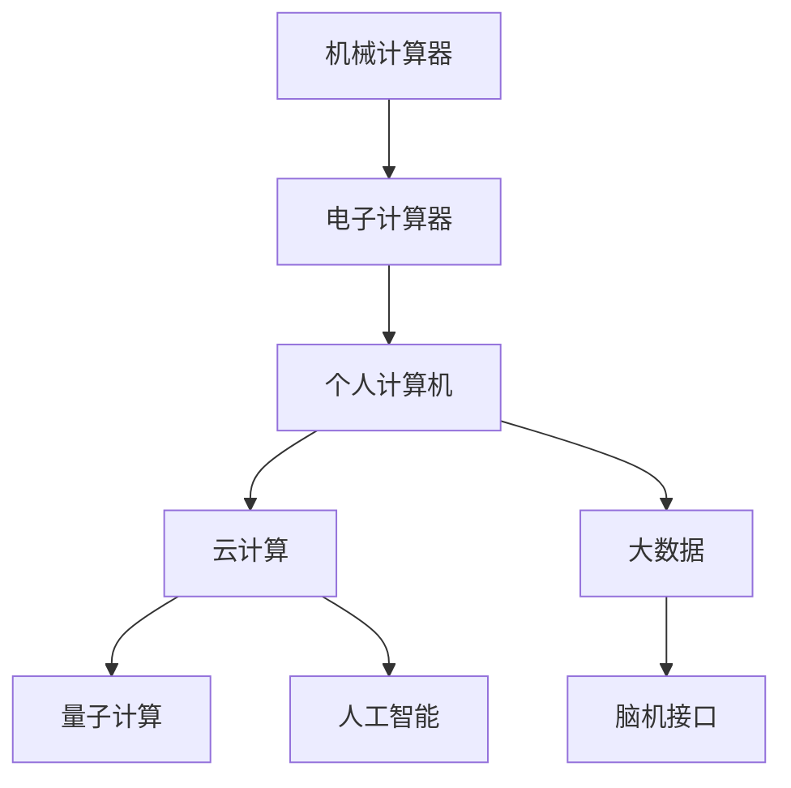

                 

# 连接过去、现在和未来：人类计算的历史、现状与展望

## 1. 背景介绍

### 1.1 问题由来

计算机的诞生和发展，是人类历史上一次具有划时代意义的变革。从最早的机械计算器到现代的超级计算机，计算能力的大幅提升，不仅改变了我们的生产方式，也深刻影响了我们的生活方式。然而，随着时间的推移，我们不禁要思考，人类计算的未来将走向何方？

这一问题并非空穴来风。随着量子计算、人工智能、脑机接口等前沿技术的兴起，人类计算的边界正被不断拓展，未来的计算形态将更加多样化和复杂化。同时，计算资源也从单一的数据中心和大型机房，逐步分散到个人设备、移动终端、物联网传感器等各个角落。面对这一变化，我们有必要重新审视计算的历史、现状与未来，以指导未来的技术发展和应用实践。

### 1.2 问题核心关键点

为了更好地理解计算的发展脉络，本节将回顾计算机历史上的几个重要节点，并分析当下计算技术的主要现状和面临的挑战。

- 机械计算器的诞生与普及。18世纪末，机械计算器问世，开启了现代计算的新篇章。
- 电子计算器的问世与革新。20世纪50年代，电子计算器诞生，计算机开始进入商业应用领域。
- 个人计算机的诞生与互联网普及。1970年代末，个人计算机开始普及，互联网的诞生带来了全球信息互联。
- 云计算、大数据的兴起。21世纪初，云计算和大数据技术兴起，计算能力进入新的爆发期。
- 量子计算、人工智能等前沿技术的探索。近年来，量子计算、人工智能等前沿技术不断突破，人类计算能力再次提升。

通过回顾这些关键节点，我们可以更好地理解计算技术的演进脉络，并从历史中汲取经验，指导未来的发展方向。

## 2. 核心概念与联系

### 2.1 核心概念概述

要理解计算的未来发展，首先必须了解几个核心概念：

- **机械计算器**：最早期的计算机，通过机械齿轮、滑轮等部件进行计算。
- **电子计算器**：基于电子电路设计的计算器，体积小巧，计算速度大幅提升。
- **个人计算机(PC)**：面向个人用户设计的计算机，具备完整的输入输出设备，支持复杂的软件应用。
- **云计算**：通过互联网提供计算资源和服务，支持大规模数据处理和分布式计算。
- **大数据**：数据规模巨大、复杂多变，需要先进的技术手段进行存储、处理和分析。
- **量子计算**：利用量子态的叠加和纠缠特性，进行高效的计算和信息处理。
- **人工智能**：通过模拟人类的智能行为，实现自动化决策、自然语言处理等高级功能。
- **脑机接口(BMI)**：将人类大脑与计算机直接连接，实现思维与计算的无缝对接。

这些概念之间的关系可以通过以下Mermaid流程图来展示：



这个流程图展示了计算技术的演进脉络：从机械到电子，再到个人、云、大数据、量子、人工智能和脑机接口，每一个节点都是对前一个节点技术的继承和发展。

## 3. 核心算法原理 & 具体操作步骤
### 3.1 算法原理概述

计算技术的发展，离不开一系列核心算法的支撑。这些算法不仅推动了计算能力的大幅提升，也引领了计算形态的多样化。以下是几个关键算法及其原理：

- **经典算法**：如排序算法、图算法、动态规划等，是计算科学的基础，广泛应用于数据处理、网络通信等领域。
- **并行算法**：如MPI、MapReduce等，通过多核、多机协同计算，提升计算效率。
- **分布式算法**：如Paxos、Raft等，解决大规模分布式系统中的同步和一致性问题。
- **量子算法**：如Shor算法、Grover算法等，利用量子态的叠加和纠缠特性，实现高效的计算和信息处理。
- **机器学习算法**：如神经网络、决策树、支持向量机等，通过数据驱动的方式，实现复杂的智能决策。

### 3.2 算法步骤详解

以经典算法的分布式并行实现为例，其基本步骤如下：

1. **任务划分**：将大规模问题划分为多个子问题，分配到不同的计算节点。
2. **数据分发**：将数据分发到各个计算节点，保证每个节点都有完整的计算数据。
3. **协同计算**：各个计算节点并行计算子问题的解，并定期同步计算结果。
4. **结果合并**：将各个计算节点的计算结果合并，得到最终的解。

分布式并行算法的核心在于如何高效地分发数据和计算结果，以及如何实现节点间的同步和通信。

### 3.3 算法优缺点

分布式并行算法具有以下优点：
1. 计算效率高：通过多核、多机并行计算，可以大幅提升计算速度。
2. 灵活性强：可以根据计算任务的特点，灵活配置计算资源。
3. 容错性好：单个节点的故障不会影响整个系统的计算结果。

但其也存在一些局限：
1. 通信开销大：节点间的通信会消耗额外的计算资源。
2. 一致性问题：分布式计算中的同步和一致性问题复杂。
3. 资源管理复杂：需要设计高效的数据管理和调度算法。

在实际应用中，需要根据具体任务和数据规模，选择合适的分布式算法，并结合数据管理和通信优化技术，才能充分发挥其优势，解决计算难题。

### 3.4 算法应用领域

分布式并行算法在计算技术中有着广泛的应用，主要包括以下几个领域：

- **大规模数据处理**：如Hadoop、Spark等，支持大规模数据的存储和处理。
- **云计算平台**：如AWS、Google Cloud、Azure等，提供高效的云服务计算资源。
- **分布式数据库**：如MySQL Cluster、MongoDB Sharding等，支持大规模数据的高效存储和查询。
- **分布式机器学习**：如TensorFlow、PyTorch等，支持大规模数据的高效训练和推理。

## 4. 数学模型和公式 & 详细讲解  
### 4.1 数学模型构建

为了更好地理解计算技术的数学基础，本节将详细介绍一些经典计算模型及其数学表达。

- **单处理器模型**：描述单核CPU或GPU等单个计算资源的计算能力，通常用单处理器时钟周期数表示。
- **多处理器模型**：描述多核CPU或GPU等多个计算资源的协同计算能力，通常用多处理器时钟周期数表示。
- **分布式计算模型**：描述多台计算机协同计算的能力，通常用分布式时钟周期数表示。
- **量子计算模型**：描述量子计算机的计算能力，通常用量子比特数和量子门数表示。
- **人工智能模型**：描述机器学习模型的计算能力，通常用训练数据量和计算复杂度表示。

### 4.2 公式推导过程

以单处理器模型为例，其计算能力可以用单处理器时钟周期数来表示：

$$
T = \frac{1}{f}
$$

其中 $f$ 为处理器的主频。通过将任务分解为多个子任务，并在每个子任务上并行计算，可以提升整体计算效率：

$$
T_{\text{并行}} = \frac{1}{kf}
$$

其中 $k$ 为处理器核心数。

### 4.3 案例分析与讲解

考虑一个简单的排序算法，如快速排序。对于一个长度为 $n$ 的数组，其在单处理器上的计算时间为 $O(n\log n)$，而在多处理器上的计算时间为 $O(\frac{n}{k}\log n)$，其中 $k$ 为处理器核心数。当 $k \gg 1$ 时，多处理器模型的效率显著提升。

## 5. 项目实践：代码实例和详细解释说明
### 5.1 开发环境搭建

在进行计算技术实践前，我们需要准备好开发环境。以下是使用Python进行分布式计算的开发环境配置流程：

1. 安装Anaconda：从官网下载并安装Anaconda，用于创建独立的Python环境。

2. 创建并激活虚拟环境：
```bash
conda create -n pydist Python=3.8 
conda activate pydist
```

3. 安装相关库：
```bash
pip install numpy scipy matplotlib scipy-distributed 
```

4. 配置集群：在Slurm、Kubernetes等集群管理平台上，配置计算节点和资源管理脚本。

5. 安装MPI库：安装OpenMPI或MPICH等MPI库，用于多机协同计算。

完成上述步骤后，即可在`pydist`环境中开始分布式计算的实践。

### 5.2 源代码详细实现

下面我们以Hadoop MapReduce为例，给出分布式计算的Python代码实现。

```python
from mrjob.job import MRJob
from mrjob.step import MRStep

class MapReduce(MRJob):
    def mapper(self, _, line):
        # 将数据按行分割成键值对
        for field in line.strip().split():
            yield field, 1

    def reducer(self, key, values):
        # 统计每个键的值之和
        yield key, sum(values)

    def steps(self):
        return [MRStep(mapper=self.mapper, reducer=self.reducer)]
```

### 5.3 代码解读与分析

让我们再详细解读一下关键代码的实现细节：

**MapReduce类**：
- `mapper`方法：定义Mapper任务的实现，将输入数据按行分割成键值对，并在键上累加值。
- `reducer`方法：定义Reducer任务的实现，对每个键的值求和，并输出最终结果。
- `steps`方法：定义整个计算流程，返回一个任务步骤列表。

**代码执行流程**：
- 创建`MapReduce`实例
- 定义Mapper和Reducer函数
- 调用`steps`方法，生成计算流程
- 启动计算，将输入数据分发给各个计算节点
- 并行计算各个键值对的值
- 每个节点输出中间结果
- 将所有中间结果汇总，并输出最终结果

可以看到，MapReduce的实现过程简洁高效，适合处理大规模数据处理任务。

### 5.4 运行结果展示

执行以下命令，可以在集群上运行分布式计算：

```bash
python mapreduce.py input_file output_file
```

其中`input_file`和`output_file`分别为输入和输出文件的路径。

## 6. 实际应用场景
### 6.1 大数据分析

分布式并行算法在大数据分析中有着广泛的应用。如Hadoop、Spark等，通过分布式计算，能够高效处理海量数据，支持大规模数据挖掘和知识发现。

在实践中，可以将大数据存储到Hadoop或Spark分布式文件系统中，通过MapReduce、Spark Streaming等分布式算法进行处理。例如，对一个大型电商网站的用户行为数据进行分析，可以提取用户的购买频率、偏好商品等信息，实现个性化推荐和精准营销。

### 6.2 云计算平台

云计算平台是分布式计算的重要应用场景之一。通过云服务，用户可以在需要时快速获取计算资源，支持弹性伸缩和高可用性。

在实践中，用户可以通过AWS、Google Cloud、Azure等云平台，使用分布式计算框架进行数据处理和模型训练。例如，在一个AI研究项目中，可以使用Spark进行大规模数据预处理，使用TensorFlow进行模型训练和推理，并通过Kubernetes进行任务调度和资源管理。

### 6.3 高性能计算

分布式并行算法在科学计算和高性能计算中也有着广泛的应用。如计算流体动力学、气象模拟、药物设计等，需要高效的计算能力和大规模数据处理能力。

在实践中，可以使用MPI或OpenMPI等分布式并行库，进行大规模并行计算。例如，在一个气象模拟项目中，可以使用并行计算算法处理大规模气象数据，模拟大气流动和天气变化，支持气候预测和灾害预警。

## 7. 工具和资源推荐
### 7.1 学习资源推荐

为了帮助开发者系统掌握分布式计算的理论基础和实践技巧，这里推荐一些优质的学习资源：

1. **分布式系统课程**：如MIT的分布式系统课程，深入讲解了分布式计算的核心算法和设计原理。
2. **MapReduce入门教程**：Google发布的MapReduce入门教程，详细介绍了MapReduce框架的使用和优化技巧。
3. **Spark官方文档**：Apache Spark的官方文档，提供了丰富的分布式计算实例和最佳实践。
4. **Kubernetes入门指南**：Kubernetes的官方入门指南，介绍了Kubernetes的架构和使用场景。
5. **深度学习框架**：如TensorFlow、PyTorch等，支持分布式计算和模型训练。

通过对这些资源的学习实践，相信你一定能够快速掌握分布式计算的理论基础和实践技巧，并用于解决实际的计算问题。

### 7.2 开发工具推荐

高效的开发离不开优秀的工具支持。以下是几款用于分布式计算开发的常用工具：

1. **Hadoop**：Apache Hadoop分布式文件系统，支持大规模数据存储和处理。
2. **Spark**：Apache Spark分布式计算框架，支持大规模数据处理和机器学习。
3. **Kubernetes**：Google开源的容器编排平台，支持分布式计算和资源管理。
4. **MPI**：OpenMPI和MPICH等MPI库，支持多机协同计算。
5. **TensorFlow**：Google开源的深度学习框架，支持分布式训练和推理。

合理利用这些工具，可以显著提升分布式计算的开发效率，加快创新迭代的步伐。

### 7.3 相关论文推荐

分布式计算技术的快速发展，离不开学界的持续研究。以下是几篇奠基性的相关论文，推荐阅读：

1. **MapReduce: Simplified Data Processing on Large Clusters**：Google发表的MapReduce论文，提出了分布式计算的基本框架。
2. **Apache Spark: Cluster Computing with Working Sets**：Spark的架构和实现细节，提供了丰富的分布式计算实例。
3. **Gossip-Based Distributed Consensus**：文献研究了分布式系统中的故障容忍和一致性问题，为分布式计算提供了理论支持。
4. **Scalable Distributed Machine Learning**：文献讨论了分布式机器学习的挑战和解决方案，为大规模模型训练提供了新的思路。

这些论文代表了大规模分布式计算的发展脉络。通过学习这些前沿成果，可以帮助研究者把握学科前进方向，激发更多的创新灵感。

## 8. 总结：未来发展趋势与挑战

### 8.1 总结

本文对分布式并行计算的历史、现状与未来进行了全面系统的介绍。首先回顾了计算技术从机械到电子、再到个人、云、大数据、量子、人工智能和脑机接口的演进脉络，明确了分布式并行计算在各个节点上的关键作用。其次，从原理到实践，详细讲解了分布式并行计算的核心算法和操作步骤，给出了分布式计算任务开发的完整代码实例。同时，本文还广泛探讨了分布式计算在科学计算、云计算、大数据分析等各个领域的应用前景，展示了分布式并行计算的巨大潜力。此外，本文精选了分布式计算技术的各类学习资源，力求为读者提供全方位的技术指引。

通过本文的系统梳理，可以看到，分布式并行计算已经成为计算技术的重要范式，极大地提升了计算效率和资源利用率，为各种复杂计算任务提供了坚实的技术保障。未来，伴随分布式计算的持续演进，计算技术必将走向更加智能化、普适化、融合化，推动科学计算、工业生产、智慧城市等领域的发展。

### 8.2 未来发展趋势

展望未来，分布式并行计算将呈现以下几个发展趋势：

1. **计算资源普适化**：未来计算资源将从大型机房、数据中心，向个人设备、移动终端、物联网传感器等各个角落普及。计算能力将无所不在，无处不在。
2. **计算形态多样化**：分布式并行计算将与人工智能、区块链、边缘计算等技术深度融合，形成多样化的计算形态，支持更广泛的应用场景。
3. **计算效率提升**：通过更高效的数据管理和通信优化技术，未来分布式并行计算将实现更高的计算效率和资源利用率。
4. **计算任务复杂化**：分布式并行计算将支持更复杂、更细粒度的任务，支持更大规模的数据处理和模型训练。
5. **计算安全性提升**：分布式并行计算将采用更强大的数据加密和隐私保护技术，确保计算过程的安全性。

以上趋势凸显了分布式并行计算的未来前景。这些方向的探索发展，必将进一步提升计算效率和资源利用率，拓展计算应用的边界，推动人工智能和智能技术的深入应用。

### 8.3 面临的挑战

尽管分布式并行计算技术已经取得了瞩目成就，但在迈向更加智能化、普适化应用的过程中，它仍面临着诸多挑战：

1. **计算资源管理复杂**：不同计算资源之间的协调和调度，需要高效的管理算法。
2. **数据通信开销大**：节点间的通信会消耗额外的计算资源。
3. **任务一致性问题**：分布式计算中的同步和一致性问题复杂。
4. **安全性和隐私保护**：分布式计算中的数据安全和隐私保护问题亟待解决。
5. **跨平台兼容性**：不同平台之间的兼容性问题，增加了系统部署和维护的复杂性。

尽管存在这些挑战，但通过不断优化算法和管理技术，未来分布式并行计算必将在多个领域发挥重要作用，推动计算技术的发展和应用。

### 8.4 研究展望

面对分布式并行计算所面临的种种挑战，未来的研究需要在以下几个方面寻求新的突破：

1. **分布式机器学习**：探索更高效、更鲁棒的分布式机器学习算法，支持大规模模型训练和推理。
2. **分布式深度学习框架**：开发更高效、更灵活的分布式深度学习框架，支持异构计算和混合计算。
3. **边缘计算与分布式计算结合**：探索将边缘计算与分布式计算结合，支持实时计算和智能决策。
4. **多模态数据融合**：探索将多种计算形态结合，实现多模态数据融合，支持复杂计算任务。
5. **计算安全性提升**：探索更强大的数据加密和隐私保护技术，确保计算过程的安全性。

这些研究方向将引领分布式并行计算技术迈向更高的台阶，为构建智能、安全、可靠的系统提供坚实的技术保障。面向未来，分布式并行计算需要与其他前沿技术协同发力，共同推动计算技术的发展和应用。

## 9. 附录：常见问题与解答

**Q1：分布式计算与传统集中式计算的区别是什么？**

A: 分布式计算与传统集中式计算的主要区别在于计算资源的管理和调度方式。传统集中式计算资源集中在一个节点上，计算过程由单个节点控制，适合简单任务的处理。而分布式计算将计算资源分布到多个节点上，计算过程由分布式管理系统协调，适合复杂任务的并行计算。

**Q2：如何提高分布式计算的效率？**

A: 提高分布式计算的效率，可以从以下几个方面入手：
1. 数据预处理：通过数据压缩、分布式缓存等技术，减少数据传输量。
2. 通信优化：通过消息传递机制、消息队列等技术，减少通信开销。
3. 并行度设计：通过合理划分任务，提高并行计算的度。
4. 负载均衡：通过任务调度算法，均衡分配计算任务，避免资源浪费。

**Q3：分布式计算系统如何处理节点故障？**

A: 分布式计算系统通常采用以下策略来处理节点故障：
1. 冗余设计：通过数据备份和任务冗余，保证系统容错性。
2. 故障容忍：通过状态机和一致性算法，处理节点故障。
3. 数据恢复：通过数据备份和检查点技术，快速恢复计算任务。

这些策略可以确保系统在节点故障时的稳定性和可靠性。

**Q4：分布式计算中的任务一致性问题如何解决？**

A: 分布式计算中的任务一致性问题，可以通过以下方法解决：
1. 两阶段提交协议：通过分布式事务，保证数据一致性。
2. Paxos算法：通过共识算法，保证节点间的协调一致。
3. Raft算法：通过分布式一致性算法，保证数据同步和一致性。

这些方法可以确保分布式计算系统的稳定性和一致性。

**Q5：分布式计算中如何保证数据安全？**

A: 分布式计算中保证数据安全，可以通过以下方法：
1. 数据加密：通过加密技术，保护数据传输和存储的安全性。
2. 访问控制：通过身份认证和权限控制，限制数据访问。
3. 审计和监控：通过日志记录和实时监控，检测异常行为和攻击。

这些方法可以确保数据在分布式计算过程中的安全性。

---

作者：禅与计算机程序设计艺术 / Zen and the Art of Computer Programming

