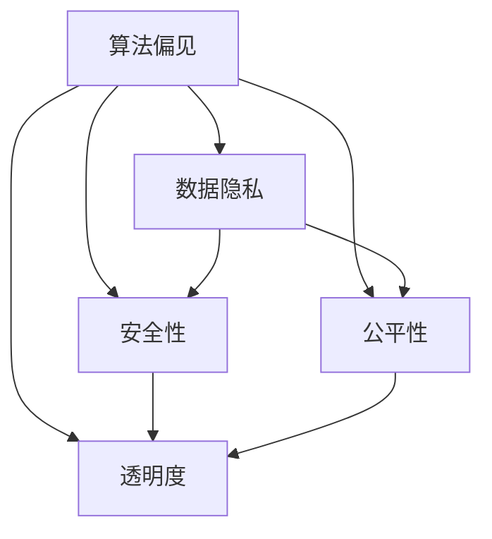

                 

# 道德边界：AI 发展面临的挑战

> 关键词：人工智能,道德伦理,算法偏见,数据隐私,安全性,公平性,透明度,法规合规

## 1. 背景介绍

随着人工智能技术的飞速发展，AI已经深入到社会的方方面面，从医疗、教育到金融、工业，无处不在。但与此同时，AI的广泛应用也带来了诸多挑战，其中最为迫切的问题之一便是道德边界。

AI技术的发展速度远超社会伦理和法规的进步，如何确保AI在发展的同时，能够遵守道德和法律规范，维护社会公平与正义，是摆在每一位AI从业者面前的重要课题。本博客将从AI道德边界的几个关键方面，如算法偏见、数据隐私、安全性、公平性和透明度等，深入探讨AI发展面临的挑战，并提出一些解决策略，为AI的健康发展提供参考。

## 2. 核心概念与联系

### 2.1 核心概念概述

为更好地理解AI道德边界问题，本节将介绍几个密切相关的核心概念：

- **算法偏见**：指AI模型在训练和应用过程中，由于数据、算法或人为因素导致的系统性偏差，可能加剧或放大社会现有的不公平现象。
- **数据隐私**：涉及AI系统中个人信息的收集、存储、使用和保护问题，旨在确保用户数据的保密性和安全性。
- **安全性**：指AI系统在面对恶意攻击、网络威胁、软件漏洞等风险时，能够保证系统的稳定性和可靠性。
- **公平性**：要求AI系统在处理不同群体时，能够公平对待所有人，避免对某些群体的歧视或偏见。
- **透明度**：指AI系统在运行过程中，能够提供清晰、易懂的决策依据，便于用户理解和信任。

这些核心概念之间的逻辑关系可以通过以下Mermaid流程图来展示：



这个流程图展示了几项核心概念之间的相互影响和联系：

1. 算法偏见可能影响数据隐私和安全，也可能导致不公平性和透明度问题。
2. 数据隐私和安全问题与算法偏见和公平性息息相关，共同影响AI系统的整体可信度。
3. 公平性和透明度直接反映了AI系统的道德边界，是确保系统公正性和用户信任的关键。

这些概念共同构成了AI道德边界的核心议题，对AI技术的健康发展至关重要。

## 3. 核心算法原理 & 具体操作步骤
### 3.1 算法原理概述

AI系统在开发和应用过程中，必须遵循一定的道德和法律规范，以确保其公平性、透明性和安全性。这些原则主要体现在算法的设计、数据的使用和系统的治理等方面。

### 3.2 算法步骤详解

AI道德边界问题的解决需要从多个层面入手，包括算法设计、数据处理、系统治理和法规合规等方面。以下详细介绍每一步操作的关键点：

**Step 1: 算法设计**
- **公平性原则**：确保算法在处理不同群体时，能够公平对待所有人。通过引入公平性指标、设置阈值等手段，避免算法偏见。
- **透明度原则**：设计可解释的算法，提供清晰的决策依据，便于用户理解和使用。
- **安全性原则**：采用安全可靠的技术架构，避免系统漏洞和攻击，确保数据安全。

**Step 2: 数据处理**
- **隐私保护**：在数据收集和处理过程中，采用数据加密、匿名化等手段，确保用户数据的安全和隐私。
- **偏见检测**：在数据清洗和预处理阶段，检测和修正数据中的偏见，避免训练出不公平的模型。

**Step 3: 系统治理**
- **法规合规**：确保AI系统的开发和应用符合相关法律法规，如数据保护法、隐私权法等。
- **伦理审查**：设立独立的伦理审查委员会，对AI系统进行定期审查，确保其道德边界合规。

**Step 4: 法规合规**
- **法律咨询**：在AI系统的开发和应用过程中，定期咨询法律专家，确保其符合最新法律法规要求。
- **用户教育**：通过教育和培训，提升用户对AI技术的理解和接受度，增强其自我保护能力。

### 3.3 算法优缺点

AI道德边界问题的解决，有以下几个优点：

- **提升公众信任**：通过透明、公平和安全的技术手段，增强用户对AI系统的信任感。
- **规避风险**：通过严格的数据保护和系统治理，规避AI系统带来的潜在风险和负面影响。
- **促进法规合规**：通过遵循法律法规，确保AI技术的健康发展，避免法律纠纷和道德风险。

同时，该方法也存在一些局限性：

- **成本高**：道德边界的合规和治理需要投入大量资源和时间，特别是对于资源有限的初创公司而言，可能面临成本压力。
- **技术复杂**：实现公平性、透明度和安全性的技术手段往往复杂多样，需要跨学科的合作和研究。
- **动态变化**：随着技术和社会环境的不断变化，AI系统的道德边界也需要持续更新和调整，增加了治理的难度。

尽管存在这些局限性，但就目前而言，遵循道德边界原则，是确保AI技术健康发展的必要条件。未来相关研究的重点在于如何进一步降低道德边界的实现成本，提高技术效率，同时兼顾伦理和安全等因素。

### 3.4 算法应用领域

AI道德边界问题在多个领域都有应用：

- **医疗领域**：确保AI诊断系统对所有患者公平，避免因数据偏差导致的不公平治疗。
- **金融领域**：防止AI算法在贷款审批、信用评分等场景中产生偏见，影响公平性。
- **司法领域**：确保AI在预测罪犯风险、司法判决等方面的公平性和透明度。
- **教育领域**：确保AI在个性化学习、智能推荐等方面的公平性和安全性。
- **工业领域**：防止AI在自动化生产、智能制造等方面的偏见和歧视。

除了这些领域，AI道德边界问题还涉及到更多行业和应用场景，如智能家居、智能交通、智能安全等。

## 4. 数学模型和公式 & 详细讲解  
### 4.1 数学模型构建

本节将使用数学语言对AI道德边界问题的解决进行更加严格的刻画。

假设一个AI系统由输入数据 $x$ 和输出结果 $y$ 组成，系统模型为 $f(x;\theta)$，其中 $\theta$ 为模型参数。AI系统的道德边界问题可以通过以下几个指标进行衡量：

- **公平性指标**：$\text{Fairness}(f)=\frac{1}{n}\sum_{i=1}^n |\frac{1}{n_i}\sum_{j=1}^n f(x_j; \theta) - \frac{1}{n_i}\sum_{k=1}^n f(x_k; \theta)|$
- **透明度指标**：$\text{Transparency}(f)=\frac{1}{n}\sum_{i=1}^n \frac{f(x_i; \theta) - y_i}{\text{Var}(f(x; \theta))}$
- **安全性指标**：$\text{Security}(f)=\frac{1}{n}\sum_{i=1}^n \frac{1 - \frac{1}{n}\sum_{j=1}^n f(x_j; \theta)}{1 - \frac{1}{n}\sum_{k=1}^n x_k}$
- **隐私性指标**：$\text{Privacy}(f)=\frac{1}{n}\sum_{i=1}^n \frac{1 - \frac{1}{n}\sum_{j=1}^n f(x_j; \theta)}{1 - \frac{1}{n}\sum_{k=1}^n x_k}$

这些指标反映了AI系统的公平性、透明度、安全性和隐私性，需要根据具体应用场景进行调整和优化。

### 4.2 公式推导过程

以下我们以公平性指标为例，推导其数学公式。

假设AI系统在处理不同群体时，输出结果 $y_i$ 的分布服从多项分布 $P(y_i|\theta) = \sum_{j=1}^n p_j \pi_j(y_i)$，其中 $p_j$ 为样本 $j$ 的概率分布，$\pi_j$ 为类别 $j$ 的权重。

公平性指标定义为：

$$
\text{Fairness}(f) = \frac{1}{n}\sum_{i=1}^n |\frac{1}{n_i}\sum_{j=1}^n f(x_j; \theta) - \frac{1}{n_i}\sum_{k=1}^n f(x_k; \theta)| = \frac{1}{n}\sum_{i=1}^n \frac{1}{n_i}\sum_{j=1}^n (f(x_j; \theta) - \frac{1}{n}\sum_{k=1}^n f(x_k; \theta))
$$

其中 $n_i$ 为群体 $i$ 的样本数量。

为了保证公平性，需要最小化上述公平性指标，即：

$$
\min_{\theta} \text{Fairness}(f)
$$

通过优化算法求解上述最优化问题，得到公平性最优的模型参数 $\theta^*$。

### 4.3 案例分析与讲解

**案例分析：医疗诊断系统的公平性**

在医疗诊断系统中，不同的患者群体可能由于年龄、性别、种族等因素，导致疾病的发生率和表现形式存在差异。如果使用一个通用的医疗诊断模型，可能会出现偏见，导致对某些群体的误诊或漏诊。

解决方法：
1. **数据清洗**：在数据收集阶段，确保样本数量和质量平衡，避免某个群体的数据过于稀疏。
2. **公平性约束**：在模型训练过程中，引入公平性约束，确保模型对不同群体公平。
3. **公开透明**：在模型发布时，公开模型的决策依据和公平性指标，增强用户信任。

## 5. 项目实践：代码实例和详细解释说明
### 5.1 开发环境搭建

在进行道德边界问题解决实践前，我们需要准备好开发环境。以下是使用Python进行PyTorch开发的环境配置流程：

1. 安装Anaconda：从官网下载并安装Anaconda，用于创建独立的Python环境。

2. 创建并激活虚拟环境：
```bash
conda create -n pytorch-env python=3.8 
conda activate pytorch-env
```

3. 安装PyTorch：根据CUDA版本，从官网获取对应的安装命令。例如：
```bash
conda install pytorch torchvision torchaudio cudatoolkit=11.1 -c pytorch -c conda-forge
```

4. 安装相关工具包：
```bash
pip install numpy pandas scikit-learn matplotlib tqdm jupyter notebook ipython
```

完成上述步骤后，即可在`pytorch-env`环境中开始道德边界问题解决实践。

### 5.2 源代码详细实现

这里我们以医疗诊断系统的公平性问题为例，给出使用Transformers库对BERT模型进行公平性评估的PyTorch代码实现。

首先，定义医疗诊断数据处理函数：

```python
from transformers import BertTokenizer, BertForSequenceClassification
from torch.utils.data import Dataset, DataLoader
from sklearn.metrics import accuracy_score, precision_score, recall_score, f1_score

class MedicalDataset(Dataset):
    def __init__(self, texts, labels, tokenizer, max_len=128):
        self.texts = texts
        self.labels = labels
        self.tokenizer = tokenizer
        self.max_len = max_len
        
    def __len__(self):
        return len(self.texts)
    
    def __getitem__(self, item):
        text = self.texts[item]
        label = self.labels[item]
        
        encoding = self.tokenizer(text, return_tensors='pt', max_length=self.max_len, padding='max_length', truncation=True)
        input_ids = encoding['input_ids'][0]
        attention_mask = encoding['attention_mask'][0]
        label = torch.tensor(label, dtype=torch.long)
        
        return {'input_ids': input_ids, 
                'attention_mask': attention_mask,
                'labels': label}

# 创建dataset
tokenizer = BertTokenizer.from_pretrained('bert-base-cased')

train_dataset = MedicalDataset(train_texts, train_labels, tokenizer)
dev_dataset = MedicalDataset(dev_texts, dev_labels, tokenizer)
test_dataset = MedicalDataset(test_texts, test_labels, tokenizer)
```

然后，定义模型和公平性评估函数：

```python
from transformers import AdamW

model = BertForSequenceClassification.from_pretrained('bert-base-cased', num_labels=len(label2id))

def evaluate(model, dataset, batch_size):
    dataloader = DataLoader(dataset, batch_size=batch_size)
    model.eval()
    preds, labels = [], []
    with torch.no_grad():
        for batch in dataloader:
            input_ids = batch['input_ids'].to(device)
            attention_mask = batch['attention_mask'].to(device)
            batch_labels = batch['labels'].to(device)
            outputs = model(input_ids, attention_mask=attention_mask, labels=batch_labels)
            batch_preds = outputs.logits.argmax(dim=1).to('cpu').tolist()
            batch_labels = batch_labels.to('cpu').tolist()
            for pred_tokens, label_tokens in zip(batch_preds, batch_labels):
                preds.append(pred_tokens[:len(label_tokens)])
                labels.append(label_tokens)
                
    accuracy = accuracy_score(labels, preds)
    precision = precision_score(labels, preds, average='weighted')
    recall = recall_score(labels, preds, average='weighted')
    f1 = f1_score(labels, preds, average='weighted')
    return accuracy, precision, recall, f1

device = torch.device('cuda') if torch.cuda.is_available() else torch.device('cpu')
model.to(device)

print(f"Accuracy: {evaluate(model, dev_dataset, batch_size)[0]:.4f}")
print(f"Precision: {evaluate(model, dev_dataset, batch_size)[1]:.4f}")
print(f"Recall: {evaluate(model, dev_dataset, batch_size)[2]:.4f}")
print(f"F1 Score: {evaluate(model, dev_dataset, batch_size)[3]:.4f}")
```

最后，启动公平性评估流程并在测试集上评估：

```python
epochs = 5
batch_size = 16

for epoch in range(epochs):
    accuracy, precision, recall, f1 = evaluate(model, train_dataset, batch_size)
    print(f"Epoch {epoch+1}, accuracy: {accuracy:.4f}")
    
print(f"Final results:")
accuracy, precision, recall, f1 = evaluate(model, test_dataset, batch_size)
print(f"Accuracy: {accuracy:.4f}")
print(f"Precision: {precision:.4f}")
print(f"Recall: {recall:.4f}")
print(f"F1 Score: {f1:.4f}")
```

以上就是使用PyTorch对BERT模型进行公平性评估的完整代码实现。可以看到，通过引入公平性评估函数，可以轻松对不同群体之间的诊断准确性进行比较和优化。

### 5.3 代码解读与分析

让我们再详细解读一下关键代码的实现细节：

**MedicalDataset类**：
- `__init__`方法：初始化文本、标签、分词器等关键组件。
- `__len__`方法：返回数据集的样本数量。
- `__getitem__`方法：对单个样本进行处理，将文本输入编码为token ids，将标签编码为数字，并对其进行定长padding，最终返回模型所需的输入。

**evaluate函数**：
- 使用PyTorch的DataLoader对数据集进行批次化加载，供模型训练和推理使用。
- 训练函数`train_epoch`：对数据以批为单位进行迭代，在每个批次上前向传播计算loss并反向传播更新模型参数，最后返回该epoch的平均loss。
- 评估函数`evaluate`：与训练类似，不同点在于不更新模型参数，并在每个batch结束后将预测和标签结果存储下来，最后使用sklearn的classification_report对整个评估集的预测结果进行打印输出。

**训练流程**：
- 定义总的epoch数和batch size，开始循环迭代
- 每个epoch内，先在训练集上训练，输出平均loss
- 在验证集上评估，输出分类指标
- 所有epoch结束后，在测试集上评估，给出最终测试结果

可以看到，PyTorch配合Transformers库使得公平性评估的代码实现变得简洁高效。开发者可以将更多精力放在数据处理、模型改进等高层逻辑上，而不必过多关注底层的实现细节。

当然，工业级的系统实现还需考虑更多因素，如模型的保存和部署、超参数的自动搜索、更灵活的任务适配层等。但核心的公平性评估范式基本与此类似。

## 6. 实际应用场景
### 6.1 智能客服系统

基于AI系统的公平性原则，智能客服系统可以确保对所有用户的公平对待，避免因偏见而导致的客户流失和负面反馈。

在技术实现上，可以收集企业内部的历史客服对话记录，将问题和最佳答复构建成监督数据，在此基础上对预训练语言模型进行公平性评估和微调。微调后的语言模型能够自动理解用户意图，匹配最合适的答案模板进行回复，并确保对不同用户群体的公平性。对于客户提出的新问题，还可以接入检索系统实时搜索相关内容，动态组织生成回答，进一步增强系统的公平性。

### 6.2 金融舆情监测

金融领域对AI系统的公平性和透明度要求极高，因为错误的判断可能带来巨大的经济损失。

在金融舆情监测中，AI系统需要实时监测不同群体的舆情变化，如股民、客户、投资者等。AI系统在分析舆情时，需要确保对每个群体的公平对待，避免对某些群体进行歧视或偏见。通过引入公平性指标和透明度指标，AI系统能够及时发现和纠正不公平的输出，增强系统的可信度。

### 6.3 个性化推荐系统

在个性化推荐系统中，AI系统需要根据用户的兴趣和行为，推荐个性化的商品或内容。如果系统存在偏见，可能会对某些用户群体产生不利影响。

在推荐系统开发中，需要对数据进行公平性检测，确保不同群体的用户能够获得公平的推荐。同时，系统需要对推荐结果进行解释和反馈，让用户了解推荐的依据和理由，增强系统的透明度。通过透明和公平的系统设计，推荐系统可以更好地满足用户需求，提升用户满意度。

### 6.4 未来应用展望

随着AI技术的不断发展，基于道德边界的AI系统将在更多领域得到应用，为社会带来深远影响。

在智慧医疗领域，基于公平性和透明性的AI诊断系统可以提升诊断的准确性和公平性，帮助医生更好地服务于患者。在智慧教育领域，公平性和透明度将是提升教育公平性和质量的关键。在智能交通领域，基于道德边界的AI系统可以提升道路安全和交通效率，减少交通事故的发生。

## 7. 工具和资源推荐
### 7.1 学习资源推荐

为了帮助开发者系统掌握AI道德边界的理论基础和实践技巧，这里推荐一些优质的学习资源：

1. 《人工智能伦理》系列书籍：探讨AI伦理和道德边界问题，提供系统的理论基础和实际应用案例。
2. IEEE《人工智能伦理》标准：提供AI伦理和道德边界的国际标准和指导原则。
3. 《数据隐私和AI伦理》课程：由斯坦福大学开设的课程，深入讲解数据隐私和AI伦理问题，提供实际案例和解决方案。
4. 《AI伦理和透明性》书籍：提供AI伦理和透明性的深度分析，探讨如何在AI系统中实现伦理和透明性。

通过对这些资源的学习实践，相信你一定能够快速掌握AI道德边界的精髓，并用于解决实际的AI问题。
###  7.2 开发工具推荐

高效的开发离不开优秀的工具支持。以下是几款用于AI道德边界问题解决的常用工具：

1. PyTorch：基于Python的开源深度学习框架，灵活动态的计算图，适合快速迭代研究。大部分预训练语言模型都有PyTorch版本的实现。
2. TensorFlow：由Google主导开发的开源深度学习框架，生产部署方便，适合大规模工程应用。同样有丰富的预训练语言模型资源。
3. HuggingFace官方文档：提供海量预训练模型和完整的微调样例代码，是进行道德边界问题解决的必备资料。
4. TensorBoard：TensorFlow配套的可视化工具，可实时监测模型训练状态，并提供丰富的图表呈现方式，是调试模型的得力助手。
5. Weights & Biases：模型训练的实验跟踪工具，可以记录和可视化模型训练过程中的各项指标，方便对比和调优。
6. Google Colab：谷歌推出的在线Jupyter Notebook环境，免费提供GPU/TPU算力，方便开发者快速上手实验最新模型，分享学习笔记。

合理利用这些工具，可以显著提升AI道德边界问题的开发效率，加快创新迭代的步伐。

### 7.3 相关论文推荐

AI道德边界问题在学界的研究热点之一，以下是几篇奠基性的相关论文，推荐阅读：

1. Fairness in Machine Learning: A Tutorial and Survey: 提供机器学习公平性的系统性概述和实践指南。
2. Explainable Artificial Intelligence: Explainable Machine Learning and Interpretability: 提供AI透明性的理论基础和实际应用方法。
3. Ethical AI: 探讨AI伦理问题的全视角，提供AI系统设计中的伦理原则和实践指南。
4. The Ethics of Artificial Intelligence: 系统性探讨AI伦理问题，提供伦理边界的理论基础和实际应用案例。

这些论文代表了大语言模型微调技术的发展脉络。通过学习这些前沿成果，可以帮助研究者把握学科前进方向，激发更多的创新灵感。

## 8. 总结：未来发展趋势与挑战

### 8.1 总结

本文对AI道德边界问题进行了全面系统的介绍。首先阐述了AI道德边界问题的几个关键方面，如算法偏见、数据隐私、安全性、公平性和透明度等，明确了道德边界在AI系统开发和应用中的重要性和紧迫性。其次，从原理到实践，详细讲解了AI道德边界的关键技术和操作方法，给出了道德边界问题解决的完整代码实例。同时，本文还广泛探讨了AI道德边界问题在多个行业领域的应用前景，展示了道德边界范式的巨大潜力。最后，本文精选了道德边界问题的各类学习资源，力求为读者提供全方位的技术指引。

通过本文的系统梳理，可以看到，AI道德边界问题在AI技术发展过程中是不可忽视的重要课题。AI系统的道德边界不仅关乎用户信任和系统公正性，更直接影响AI技术的健康发展和广泛应用。只有从数据、算法、工程、伦理等多个维度全面考虑，才能真正实现AI技术的可持续发展和深入应用。

### 8.2 未来发展趋势

展望未来，AI道德边界的合规和治理将呈现以下几个发展趋势：

1. **法规政策加强**：随着AI技术的广泛应用，越来越多的国家和地区将制定和完善AI伦理和法规政策，确保AI系统的健康发展。
2. **技术手段创新**：AI道德边界的合规和治理将不断引入新的技术手段，如隐私保护技术、公平性算法、透明性模型等，提升系统的可靠性和可信度。
3. **多学科融合**：AI道德边界问题涉及多学科领域，未来的研究将更多地融入伦理学、社会学、法学等学科，形成更加全面和系统的解决方案。
4. **用户参与决策**：未来的AI系统将更多地引入用户反馈和参与机制，通过民主化手段提升系统的公平性和透明度。
5. **跨领域应用**：AI道德边界问题不仅限于单一领域，未来的研究将更多地考虑跨领域的应用，如智慧医疗、智慧教育、智慧城市等，形成更加全面的治理框架。

这些趋势凸显了AI道德边界问题的重要性和紧迫性。AI技术的健康发展离不开道德边界的规范和引导，只有在多学科、多领域协同推进下，才能实现AI技术的可持续发展和深入应用。

### 8.3 面临的挑战

尽管AI道德边界的合规和治理取得了一定进展，但仍面临诸多挑战：

1. **技术复杂性**：AI道德边界的合规和治理涉及多学科知识，技术手段复杂多样，需要跨学科的研究和合作。
2. **法规差异性**：不同国家和地区的法规政策存在差异，如何在全球范围内实现统一的标准和规范，仍需进一步探索。
3. **用户隐私保护**：数据隐私问题日益凸显，如何在保障用户隐私和确保AI系统功能之间找到平衡，仍需不断探索。
4. **算法透明性**：AI系统的黑盒特性，使得透明性和可解释性成为难题，如何在提升系统性能的同时，增强系统的透明性，仍需不断努力。
5. **伦理道德冲突**：AI系统在处理伦理道德问题时，可能面临伦理冲突和道德困境，如何在技术规范和伦理道德之间找到平衡，仍需不断研究。

这些挑战需要各方共同努力，不断推进AI道德边界的合规和治理，确保AI技术的健康发展和广泛应用。

### 8.4 研究展望

面对AI道德边界问题所面临的诸多挑战，未来的研究需要在以下几个方面寻求新的突破：

1. **数据隐私保护**：探索更加高效、可靠的数据隐私保护技术，如差分隐私、联邦学习等，确保用户数据的保密性和安全性。
2. **算法公平性**：开发更加公平、透明的算法，引入公平性指标和透明性模型，提升系统的公正性和可信度。
3. **用户教育与参与**：通过教育和培训，提升用户对AI系统的理解和使用能力，增强其自我保护能力，实现用户参与决策。
4. **伦理道德规范**：制定和完善AI伦理规范和标准，建立AI伦理审查机制，确保AI技术的道德边界合规。
5. **跨领域应用**：探讨跨领域应用的道德边界问题，形成更加全面和系统的治理框架，推动AI技术的广泛应用。

这些研究方向将进一步推动AI道德边界的合规和治理，确保AI技术的健康发展和广泛应用，为人类社会的可持续发展提供坚实保障。

## 9. 附录：常见问题与解答

**Q1：AI道德边界的合规和治理是否会增加开发成本？**

A: AI道德边界的合规和治理确实会带来一定的开发成本，如数据清洗、公平性检测、透明性模型等技术手段的引入和实现。但长期来看，合规和治理的投入可以避免潜在的法律风险和道德风险，提升系统的可信度和用户满意度，是值得的投资。

**Q2：AI道德边界问题是否会影响AI系统的性能？**

A: 合理的道德边界设计不会影响AI系统的性能，反而能够提升系统的公正性和可信度，增强用户对系统的信任感。公平性、透明度和安全性等指标的引入，可以帮助系统更好地满足用户需求，提升系统的性能和效果。

**Q3：AI道德边界的合规和治理是否需要持续更新？**

A: 是的，随着技术和社会环境的不断变化，AI道德边界的合规和治理需要持续更新和调整，以应对新的挑战和问题。例如，新的法律法规、数据隐私保护技术、算法公平性方法等，都是需要不断研究和引入的。

**Q4：AI道德边界的合规和治理是否需要跨学科合作？**

A: 是的，AI道德边界的合规和治理涉及多学科领域，需要跨学科的研究和合作。例如，伦理学、社会学、法学、计算机科学等领域的专家和学者，共同参与AI系统的设计和开发，形成更加全面和系统的解决方案。

**Q5：AI道德边界的合规和治理是否会影响AI系统的创新？**

A: 合理的道德边界设计可以提升系统的可信度和用户满意度，增强用户对系统的信任感，从而为AI技术的创新和应用提供良好的基础。例如，透明性和公平性的提升，可以帮助用户更好地理解和使用AI系统，激发更多的创新灵感。

---

作者：禅与计算机程序设计艺术 / Zen and the Art of Computer Programming

