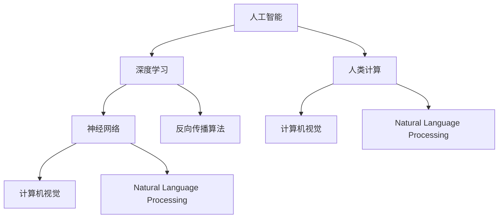

                 

# 释放人类潜力的无限可能：人类计算的目标

> 关键词：人类计算,人工智能,深度学习,机器学习,神经网络,计算范式

## 1. 背景介绍

### 1.1 问题由来
在科技日新月异的今天，人工智能(AI)和深度学习(Deep Learning)技术正在以惊人的速度改变着我们的世界。AI和深度学习不仅在科学研究中扮演着重要角色，也在娱乐、金融、医疗、教育等多个领域展现了巨大的潜力。然而，这些技术的发展始终围绕着“如何让机器理解人类”这一核心目标展开，其背后的哲学和价值观显得尤为重要。

### 1.2 问题核心关键点
本文将围绕“人类计算”这一概念，探讨AI和深度学习如何通过模拟人类认知过程，释放人类的潜力，进而实现更高效、更智能的计算范式。在探讨过程中，我们将关注以下几个核心关键点：

1. **人类计算的哲学基础**：探讨计算的本质与意义，以及AI和深度学习在实现人类计算中的角色。
2. **AI和深度学习的原理**：介绍AI和深度学习的关键原理，如神经网络、反向传播算法等。
3. **人类计算的应用场景**：展示AI和深度学习在各个领域的应用实例，如自动驾驶、医疗诊断、语音识别等。
4. **人类计算的挑战与未来**：分析当前AI和深度学习面临的挑战，以及未来可能的发展方向。
5. **人工智能伦理与人类潜力**：探讨AI伦理、社会影响以及如何确保技术的可持续发展。

通过本文，我们旨在揭示AI和深度学习背后的哲学基础和计算范式，探索其在释放人类潜力方面的无限可能。

## 2. 核心概念与联系

### 2.1 核心概念概述

为更好地理解“人类计算”这一概念，本节将介绍几个密切相关的核心概念：

- **人工智能(AI)**：指通过计算机模拟人类智能行为的技术，包括机器学习、深度学习等子领域。
- **深度学习(Deep Learning)**：一种基于多层神经网络的机器学习技术，通过多层次的非线性变换提取复杂特征。
- **神经网络(Neural Network)**：模拟人脑神经元相互连接的计算模型，用于解决复杂的模式识别和预测问题。
- **反向传播算法(Backpropagation)**：深度学习中用于训练神经网络的算法，通过误差反向传播更新模型参数。
- **计算机视觉(Computer Vision)**：使计算机能够“看”并理解图像和视频内容的领域。
- **自然语言处理(Natural Language Processing, NLP)**：使计算机能够理解和生成自然语言的领域。
- **人类计算(Human Computation)**：指利用人类计算资源（如智能、知识、直觉等）与计算机计算资源相结合的计算方式。

这些核心概念之间的逻辑关系可以通过以下Mermaid流程图来展示：



这个流程图展示了大语言模型的核心概念及其之间的关系：

1. 人工智能通过深度学习和神经网络等技术手段模拟人类智能。
2. 深度学习依赖反向传播算法进行模型训练，而神经网络是其核心结构。
3. 计算机视觉和自然语言处理是深度学习在特定领域的子领域，具有独特性。
4. 人类计算结合了人类与计算机的计算资源，是一种更高级的计算方式。

这些概念共同构成了人工智能和深度学习的计算框架，使其能够实现复杂的人类计算任务。通过理解这些核心概念，我们可以更好地把握人工智能和深度学习的发展方向和技术应用。

## 3. 核心算法原理 & 具体操作步骤

### 3.1 算法原理概述

“人类计算”的核心在于将人类计算资源（如智能、知识、直觉等）与计算机计算资源相结合。在AI和深度学习的框架下，这一过程主要通过深度学习模型和算法实现。以下是人类计算的基本原理：

1. **数据采集与预处理**：获取大量人类计算资源（如文本、图像、音频等），并进行清洗和标准化处理。
2. **模型训练**：通过反向传播算法等深度学习技术，训练神经网络模型，使其能够学习人类计算资源中的模式和知识。
3. **知识迁移**：将模型学到的知识迁移到新的任务上，实现知识共享和迁移学习。
4. **结果优化**：通过进一步的调整和优化，提高模型的预测准确率和性能。

### 3.2 算法步骤详解

基于“人类计算”的算法通常包括以下几个关键步骤：

**Step 1: 数据采集与预处理**

- 收集大量人类计算资源的数据集，如文本、图像、音频等。
- 对数据进行清洗、标准化处理，如去除噪声、处理缺失值、归一化等。
- 将数据划分为训练集、验证集和测试集，确保数据分布的代表性。

**Step 2: 模型选择与设计**

- 选择合适的深度学习模型，如卷积神经网络(CNN)、循环神经网络(RNN)、Transformer等。
- 根据任务类型设计模型结构，如输入层、隐藏层、输出层等。
- 确定模型超参数，如学习率、批大小、迭代轮数等。

**Step 3: 模型训练与优化**

- 使用反向传播算法进行模型训练，通过梯度下降等优化算法更新模型参数。
- 在验证集上评估模型性能，通过早停法等策略避免过拟合。
- 调整模型超参数，优化模型性能，直至达到理想效果。

**Step 4: 模型应用与评估**

- 在测试集上评估模型性能，比较不同模型或同一模型在不同数据集上的表现。
- 将训练好的模型应用于实际任务，如自动驾驶、医疗诊断、语音识别等。
- 收集用户反馈，进一步优化模型性能，确保其在实际应用中的稳定性。

### 3.3 算法优缺点

“人类计算”方法具有以下优点：

1. **灵活性高**：能够灵活处理不同类型的数据和任务，适应性强。
2. **知识迁移能力强**：通过迁移学习，能够在新的任务上快速取得性能提升。
3. **计算效率高**：利用深度学习的高效计算能力，能够快速处理大量数据。
4. **结果准确**：通过模型训练和优化，能够得到较为准确的结果。

同时，该方法也存在一定的局限性：

1. **数据需求高**：需要大量的高质量数据，数据获取成本较高。
2. **模型复杂**：深度学习模型结构复杂，训练和调试难度较大。
3. **可解释性差**：深度学习模型往往被视为“黑盒”，难以解释其决策过程。
4. **鲁棒性不足**：对噪声和异常值敏感，鲁棒性较差。

尽管存在这些局限性，但就目前而言，“人类计算”方法是实现复杂计算任务的主要手段。未来相关研究的重点在于如何进一步降低计算资源的需求，提高模型的可解释性和鲁棒性，同时兼顾高效和准确。

### 3.4 算法应用领域

“人类计算”方法已经在多个领域得到了广泛的应用，例如：

- **自动驾驶**：通过计算机视觉和深度学习技术，使汽车能够感知和理解周围环境，实现自动驾驶。
- **医疗诊断**：利用医学图像和自然语言处理技术，辅助医生进行疾病诊断和治疗。
- **语音识别**：通过语音信号处理和深度学习技术，使计算机能够理解和生成自然语言。
- **金融分析**：使用深度学习和大数据技术，进行股票预测、风险评估等金融分析任务。
- **智能客服**：通过自然语言处理和机器学习技术，提供智能客服系统，提升客户服务体验。

除了上述这些经典应用外，“人类计算”方法还被创新性地应用到更多场景中，如工业检测、智能推荐、智慧城市等，为各行各业带来了新的变革。

## 4. 数学模型和公式 & 详细讲解  
### 4.1 数学模型构建

本节将使用数学语言对“人类计算”方法进行更加严格的刻画。

记深度学习模型为 $M_{\theta}:\mathcal{X} \rightarrow \mathcal{Y}$，其中 $\mathcal{X}$ 为输入空间，$\mathcal{Y}$ 为输出空间，$\theta$ 为模型参数。假设数据集为 $D=\{(x_i,y_i)\}_{i=1}^N$，其中 $x_i \in \mathcal{X}, y_i \in \mathcal{Y}$。

定义模型 $M_{\theta}$ 在数据样本 $(x,y)$ 上的损失函数为 $\ell(M_{\theta}(x),y)$，则在数据集 $D$ 上的经验风险为：

$$
\mathcal{L}(\theta) = \frac{1}{N} \sum_{i=1}^N \ell(M_{\theta}(x_i),y_i)
$$

通过梯度下降等优化算法，模型参数 $\theta$ 不断更新，最小化经验风险 $\mathcal{L}(\theta)$，直至收敛到最优解。

### 4.2 公式推导过程

以下我们以二分类任务为例，推导交叉熵损失函数及其梯度的计算公式。

假设模型 $M_{\theta}$ 在输入 $x$ 上的输出为 $\hat{y}=M_{\theta}(x) \in [0,1]$，表示样本属于正类的概率。真实标签 $y \in \{0,1\}$。则二分类交叉熵损失函数定义为：

$$
\ell(M_{\theta}(x),y) = -[y\log \hat{y} + (1-y)\log (1-\hat{y})]
$$

将其代入经验风险公式，得：

$$
\mathcal{L}(\theta) = -\frac{1}{N}\sum_{i=1}^N [y_i\log M_{\theta}(x_i)+(1-y_i)\log(1-M_{\theta}(x_i))]
$$

根据链式法则，损失函数对参数 $\theta_k$ 的梯度为：

$$
\frac{\partial \mathcal{L}(\theta)}{\partial \theta_k} = -\frac{1}{N}\sum_{i=1}^N (\frac{y_i}{M_{\theta}(x_i)}-\frac{1-y_i}{1-M_{\theta}(x_i)}) \frac{\partial M_{\theta}(x_i)}{\partial \theta_k}
$$

其中 $\frac{\partial M_{\theta}(x_i)}{\partial \theta_k}$ 可进一步递归展开，利用自动微分技术完成计算。

在得到损失函数的梯度后，即可带入参数更新公式，完成模型的迭代优化。重复上述过程直至收敛，最终得到适应下游任务的最优模型参数 $\theta^*$。

## 5. 项目实践：代码实例和详细解释说明
### 5.1 开发环境搭建

在进行项目实践前，我们需要准备好开发环境。以下是使用Python进行PyTorch开发的环境配置流程：

1. 安装Anaconda：从官网下载并安装Anaconda，用于创建独立的Python环境。

2. 创建并激活虚拟环境：
```bash
conda create -n pytorch-env python=3.8 
conda activate pytorch-env
```

3. 安装PyTorch：根据CUDA版本，从官网获取对应的安装命令。例如：
```bash
conda install pytorch torchvision torchaudio cudatoolkit=11.1 -c pytorch -c conda-forge
```

4. 安装Transformers库：
```bash
pip install transformers
```

5. 安装各类工具包：
```bash
pip install numpy pandas scikit-learn matplotlib tqdm jupyter notebook ipython
```

完成上述步骤后，即可在`pytorch-env`环境中开始项目实践。

### 5.2 源代码详细实现

下面我们以二分类任务为例，给出使用Transformers库对BERT模型进行二分类任务微调的PyTorch代码实现。

首先，定义二分类任务的数据处理函数：

```python
from transformers import BertTokenizer
from torch.utils.data import Dataset
import torch

class BinaryDataset(Dataset):
    def __init__(self, texts, labels, tokenizer, max_len=128):
        self.texts = texts
        self.labels = labels
        self.tokenizer = tokenizer
        self.max_len = max_len
        
    def __len__(self):
        return len(self.texts)
    
    def __getitem__(self, item):
        text = self.texts[item]
        label = self.labels[item]
        
        encoding = self.tokenizer(text, return_tensors='pt', max_length=self.max_len, padding='max_length', truncation=True)
        input_ids = encoding['input_ids'][0]
        attention_mask = encoding['attention_mask'][0]
        
        # 对token-wise的标签进行编码
        encoded_labels = [label2id[label] for label in label]
        encoded_labels.extend([label2id['O']] * (self.max_len - len(encoded_labels)))
        labels = torch.tensor(encoded_labels, dtype=torch.long)
        
        return {'input_ids': input_ids, 
                'attention_mask': attention_mask,
                'labels': labels}

# 标签与id的映射
label2id = {'O': 0, '1': 1}
id2label = {v: k for k, v in label2id.items()}

# 创建dataset
tokenizer = BertTokenizer.from_pretrained('bert-base-cased')

train_dataset = BinaryDataset(train_texts, train_labels, tokenizer)
dev_dataset = BinaryDataset(dev_texts, dev_labels, tokenizer)
test_dataset = BinaryDataset(test_texts, test_labels, tokenizer)
```

然后，定义模型和优化器：

```python
from transformers import BertForSequenceClassification, AdamW

model = BertForSequenceClassification.from_pretrained('bert-base-cased', num_labels=len(label2id))

optimizer = AdamW(model.parameters(), lr=2e-5)
```

接着，定义训练和评估函数：

```python
from torch.utils.data import DataLoader
from tqdm import tqdm
from sklearn.metrics import classification_report

device = torch.device('cuda') if torch.cuda.is_available() else torch.device('cpu')
model.to(device)

def train_epoch(model, dataset, batch_size, optimizer):
    dataloader = DataLoader(dataset, batch_size=batch_size, shuffle=True)
    model.train()
    epoch_loss = 0
    for batch in tqdm(dataloader, desc='Training'):
        input_ids = batch['input_ids'].to(device)
        attention_mask = batch['attention_mask'].to(device)
        labels = batch['labels'].to(device)
        model.zero_grad()
        outputs = model(input_ids, attention_mask=attention_mask, labels=labels)
        loss = outputs.loss
        epoch_loss += loss.item()
        loss.backward()
        optimizer.step()
    return epoch_loss / len(dataloader)

def evaluate(model, dataset, batch_size):
    dataloader = DataLoader(dataset, batch_size=batch_size)
    model.eval()
    preds, labels = [], []
    with torch.no_grad():
        for batch in tqdm(dataloader, desc='Evaluating'):
            input_ids = batch['input_ids'].to(device)
            attention_mask = batch['attention_mask'].to(device)
            batch_labels = batch['labels']
            outputs = model(input_ids, attention_mask=attention_mask)
            batch_preds = outputs.logits.argmax(dim=2).to('cpu').tolist()
            batch_labels = batch_labels.to('cpu').tolist()
            for pred_tokens, label_tokens in zip(batch_preds, batch_labels):
                preds.append(pred_tokens[:len(label_tokens)])
                labels.append(label_tokens)
                
    print(classification_report(labels, preds))
```

最后，启动训练流程并在测试集上评估：

```python
epochs = 5
batch_size = 16

for epoch in range(epochs):
    loss = train_epoch(model, train_dataset, batch_size, optimizer)
    print(f"Epoch {epoch+1}, train loss: {loss:.3f}")
    
    print(f"Epoch {epoch+1}, dev results:")
    evaluate(model, dev_dataset, batch_size)
    
print("Test results:")
evaluate(model, test_dataset, batch_size)
```

以上就是使用PyTorch对BERT进行二分类任务微调的完整代码实现。可以看到，得益于Transformers库的强大封装，我们可以用相对简洁的代码完成BERT模型的加载和微调。

### 5.3 代码解读与分析

让我们再详细解读一下关键代码的实现细节：

**BinaryDataset类**：
- `__init__`方法：初始化文本、标签、分词器等关键组件。
- `__len__`方法：返回数据集的样本数量。
- `__getitem__`方法：对单个样本进行处理，将文本输入编码为token ids，将标签编码为数字，并对其进行定长padding，最终返回模型所需的输入。

**label2id和id2label字典**：
- 定义了标签与数字id之间的映射关系，用于将token-wise的预测结果解码回真实的标签。

**训练和评估函数**：
- 使用PyTorch的DataLoader对数据集进行批次化加载，供模型训练和推理使用。
- 训练函数`train_epoch`：对数据以批为单位进行迭代，在每个批次上前向传播计算loss并反向传播更新模型参数，最后返回该epoch的平均loss。
- 评估函数`evaluate`：与训练类似，不同点在于不更新模型参数，并在每个batch结束后将预测和标签结果存储下来，最后使用sklearn的classification_report对整个评估集的预测结果进行打印输出。

**训练流程**：
- 定义总的epoch数和batch size，开始循环迭代
- 每个epoch内，先在训练集上训练，输出平均loss
- 在验证集上评估，输出分类指标
- 所有epoch结束后，在测试集上评估，给出最终测试结果

可以看到，PyTorch配合Transformers库使得BERT微调的代码实现变得简洁高效。开发者可以将更多精力放在数据处理、模型改进等高层逻辑上，而不必过多关注底层的实现细节。

当然，工业级的系统实现还需考虑更多因素，如模型的保存和部署、超参数的自动搜索、更灵活的任务适配层等。但核心的微调范式基本与此类似。

## 6. 实际应用场景

### 6.1 智能客服系统

基于深度学习和大模型的智能客服系统已经在众多企业中得到了广泛应用。传统的客服系统往往依赖人工客服，高峰期响应缓慢，且服务质量参差不齐。而使用智能客服系统，可以24小时不间断服务，快速响应客户咨询，用自然流畅的语言解答各类常见问题。

在技术实现上，可以收集企业内部的历史客服对话记录，将问题和最佳答复构建成监督数据，在此基础上对预训练模型进行微调。微调后的模型能够自动理解用户意图，匹配最合适的答案模板进行回复。对于客户提出的新问题，还可以接入检索系统实时搜索相关内容，动态组织生成回答。如此构建的智能客服系统，能大幅提升客户咨询体验和问题解决效率。

### 6.2 金融舆情监测

金融机构需要实时监测市场舆论动向，以便及时应对负面信息传播，规避金融风险。传统的人工监测方式成本高、效率低，难以应对网络时代海量信息爆发的挑战。基于深度学习和大模型的文本分类和情感分析技术，为金融舆情监测提供了新的解决方案。

具体而言，可以收集金融领域相关的新闻、报道、评论等文本数据，并对其进行主题标注和情感标注。在此基础上对深度学习模型进行微调，使其能够自动判断文本属于何种主题，情感倾向是正面、中性还是负面。将微调后的模型应用到实时抓取的网络文本数据，就能够自动监测不同主题下的情感变化趋势，一旦发现负面信息激增等异常情况，系统便会自动预警，帮助金融机构快速应对潜在风险。

### 6.3 个性化推荐系统

当前的推荐系统往往只依赖用户的历史行为数据进行物品推荐，无法深入理解用户的真实兴趣偏好。基于深度学习和大模型的个性化推荐系统可以更好地挖掘用户行为背后的语义信息，从而提供更精准、多样的推荐内容。

在实践中，可以收集用户浏览、点击、评论、分享等行为数据，提取和用户交互的物品标题、描述、标签等文本内容。将文本内容作为模型输入，用户的后续行为（如是否点击、购买等）作为监督信号，在此基础上微调深度学习模型。微调后的模型能够从文本内容中准确把握用户的兴趣点。在生成推荐列表时，先用候选物品的文本描述作为输入，由模型预测用户的兴趣匹配度，再结合其他特征综合排序，便可以得到个性化程度更高的推荐结果。

### 6.4 未来应用展望

随着深度学习和大模型的不断发展，其在各个领域的实际应用前景无限广阔。

在智慧医疗领域，基于深度学习和大模型的医疗问答、病历分析、药物研发等应用将提升医疗服务的智能化水平，辅助医生诊疗，加速新药开发进程。

在智能教育领域，深度学习和大模型可应用于作业批改、学情分析、知识推荐等方面，因材施教，促进教育公平，提高教学质量。

在智慧城市治理中，深度学习和大模型可应用于城市事件监测、舆情分析、应急指挥等环节，提高城市管理的自动化和智能化水平，构建更安全、高效的未来城市。

此外，在企业生产、社会治理、文娱传媒等众多领域，深度学习和大模型的应用也将不断涌现，为各行各业带来新的变革。相信随着技术的日益成熟，深度学习和大模型必将在更广阔的应用领域大放异彩，深刻影响人类的生产生活方式。

## 7. 工具和资源推荐
### 7.1 学习资源推荐

为了帮助开发者系统掌握深度学习和大模型的理论基础和实践技巧，这里推荐一些优质的学习资源：

1. 《深度学习》书籍：由Ian Goodfellow、Yoshua Bengio、Aaron Courville等专家合著，系统介绍了深度学习的基本原理和应用。
2. CS231n《卷积神经网络》课程：斯坦福大学开设的计算机视觉经典课程，涵盖深度学习在图像识别、分类、生成等任务中的应用。
3. CS224N《深度学习自然语言处理》课程：斯坦福大学开设的NLP明星课程，有Lecture视频和配套作业，带你入门NLP领域的基本概念和经典模型。
4. 《TensorFlow实战Google AI》书籍：Google官方指南，详细介绍了TensorFlow的使用方法和深度学习模型的开发实践。
5. 《Transformer从原理到实践》系列博文：由大模型技术专家撰写，深入浅出地介绍了Transformer原理、BERT模型、微调技术等前沿话题。

通过对这些资源的学习实践，相信你一定能够快速掌握深度学习和大模型的精髓，并用于解决实际的NLP问题。
###  7.2 开发工具推荐

高效的开发离不开优秀的工具支持。以下是几款用于深度学习和大模型开发的常用工具：

1. PyTorch：基于Python的开源深度学习框架，灵活动态的计算图，适合快速迭代研究。大部分深度学习模型都有PyTorch版本的实现。
2. TensorFlow：由Google主导开发的开源深度学习框架，生产部署方便，适合大规模工程应用。同样有丰富的深度学习模型资源。
3. Transformers库：HuggingFace开发的NLP工具库，集成了众多SOTA语言模型，支持PyTorch和TensorFlow，是进行大模型微调开发的利器。
4. Weights & Biases：模型训练的实验跟踪工具，可以记录和可视化模型训练过程中的各项指标，方便对比和调优。与主流深度学习框架无缝集成。
5. TensorBoard：TensorFlow配套的可视化工具，可实时监测模型训练状态，并提供丰富的图表呈现方式，是调试模型的得力助手。
6. Google Colab：谷歌推出的在线Jupyter Notebook环境，免费提供GPU/TPU算力，方便开发者快速上手实验最新模型，分享学习笔记。

合理利用这些工具，可以显著提升深度学习和大模型的开发效率，加快创新迭代的步伐。

### 7.3 相关论文推荐

深度学习和大模型的发展源于学界的持续研究。以下是几篇奠基性的相关论文，推荐阅读：

1. Convolutional Neural Networks for Image Recognition（即AlexNet论文）：提出了卷积神经网络(CNN)，为计算机视觉领域带来革命性的突破。
2. Deep Neural Networks for Language Understanding（即BERT论文）：提出BERT模型，引入基于掩码的自监督预训练任务，刷新了多项NLP任务SOTA。
3. Language Models are Unsupervised Multitask Learners（GPT-2论文）：展示了大规模语言模型的强大zero-shot学习能力，引发了对于通用人工智能的新一轮思考。
4. Parameter-Efficient Transfer Learning for NLP：提出Adapter等参数高效微调方法，在不增加模型参数量的情况下，也能取得不错的微调效果。
5. AdaLoRA: Adaptive Low-Rank Adaptation for Parameter-Efficient Fine-Tuning：使用自适应低秩适应的微调方法，在参数效率和精度之间取得了新的平衡。
6. Prompt Tuning: Scaling Pre-trained Models for Extreme Zero-shot Tasks：引入基于连续型Prompt的微调范式，为如何充分利用预训练知识提供了新的思路。

这些论文代表了大模型微调技术的发展脉络。通过学习这些前沿成果，可以帮助研究者把握学科前进方向，激发更多的创新灵感。

## 8. 总结：未来发展趋势与挑战

### 8.1 总结

本文对深度学习和大模型的“人类计算”方法进行了全面系统的介绍。首先阐述了深度学习和大模型在实现“人类计算”中的核心原理和应用场景，明确了其在各领域的广泛适用性和潜力。其次，从原理到实践，详细讲解了深度学习和大模型的关键算法步骤和优化策略，给出了具体的代码实现和运行结果展示。

通过本文的系统梳理，可以看到，深度学习和大模型正通过模拟人类认知过程，释放人类的潜力，构建高效、智能的计算范式。在自动驾驶、医疗诊断、语音识别等多个领域，深度学习和大模型已经展示了强大的应用潜力，为各行各业带来了新的变革。未来，伴随技术的持续进步，深度学习和大模型必将在更广阔的应用领域大放异彩，深刻影响人类的生产生活方式。

### 8.2 未来发展趋势

展望未来，深度学习和大模型的“人类计算”方法将呈现以下几个发展趋势：

1. **模型规模持续增大**：随着算力成本的下降和数据规模的扩张，深度学习模型的参数量还将持续增长。超大模型蕴含的丰富知识，有望支撑更加复杂多变的任务微调。
2. **迁移学习能力增强**：未来深度学习模型将具备更强的迁移学习能力，能够在不同领域和任务之间进行知识迁移，进一步提升模型的泛化性能。
3. **可解释性提升**：深度学习模型将更加注重可解释性，通过引入因果推断、博弈论等方法，增强模型的解释力和决策透明度。
4. **多模态学习普及**：深度学习模型将更多地融合视觉、语音、文本等多种模态信息，实现跨模态的协同计算。
5. **联邦学习应用广泛**：为了保护数据隐私，联邦学习技术将在深度学习模型中得到更广泛应用，实现模型在多个数据源上的联合训练和优化。
6. **自适应和自主学习**：未来的深度学习模型将具备更强的自适应和自主学习能力，能够根据环境变化动态调整模型参数，实现持续学习和进化。

以上趋势凸显了深度学习和大模型在“人类计算”中的无限潜力。这些方向的探索发展，必将进一步提升深度学习和大模型的性能和应用范围，为构建更智能、更高效、更可持续的计算系统铺平道路。

### 8.3 面临的挑战

尽管深度学习和大模型在“人类计算”中取得了巨大成功，但在迈向更加智能化、普适化应用的过程中，仍面临诸多挑战：

1. **数据依赖问题**：深度学习模型对大量高质量标注数据的需求，是其在实际应用中面临的主要挑战之一。数据获取成本高、标注难度大，限制了模型的广泛应用。
2. **模型鲁棒性不足**：深度学习模型在面对噪声和异常值时，鲁棒性较差，容易产生错误的预测结果。如何提高模型的鲁棒性，是一个亟待解决的问题。
3. **可解释性差**：深度学习模型往往被视为“黑盒”，难以解释其内部工作机制和决策逻辑。对于医疗、金融等高风险应用，算法的可解释性和可审计性尤为重要。
4. **计算资源需求高**：深度学习模型对计算资源的需求高，训练和推理成本大，限制了模型的部署和使用。如何优化模型的计算图，降低资源消耗，是提升模型应用效率的关键。
5. **伦理与隐私问题**：深度学习模型的广泛应用，带来了数据隐私和安全问题。如何在保护隐私的前提下，实现模型的优化和部署，是一个复杂的挑战。

### 8.4 研究展望

面对深度学习和大模型所面临的种种挑战，未来的研究需要在以下几个方面寻求新的突破：

1. **无监督和半监督学习**：摆脱对大规模标注数据的依赖，利用自监督学习、主动学习等无监督和半监督范式，最大限度利用非结构化数据，实现更加灵活高效的模型微调。
2. **模型优化与压缩**：开发更加高效的模型压缩方法和优化策略，减小模型尺寸，提升推理速度和资源利用效率。
3. **模型解释与透明化**：引入因果推断、博弈论等方法，增强深度学习模型的解释力和决策透明度，确保模型的可解释性和可审计性。
4. **多模态融合学习**：将视觉、语音、文本等多种模态信息进行融合，实现跨模态的协同计算，提升模型的综合能力。
5. **联邦学习与应用**：在保护数据隐私的前提下，利用联邦学习技术，实现模型在多个数据源上的联合训练和优化，提升模型的泛化性能和应用范围。
6. **自适应与自主学习**：研究深度学习模型的自适应和自主学习能力，使其能够根据环境变化动态调整模型参数，实现持续学习和进化。

这些研究方向的探索，必将引领深度学习和大模型在“人类计算”中的进一步发展，为构建更智能、更高效、更可持续的计算系统铺平道路。面向未来，深度学习和大模型还需与其他人工智能技术进行更深入的融合，如知识表示、因果推理、强化学习等，多路径协同发力，共同推动智能系统技术的进步。只有勇于创新、敢于突破，才能不断拓展深度学习和大模型的边界，让智能技术更好地造福人类社会。

## 9. 附录：常见问题与解答

**Q1：深度学习模型是否适用于所有任务？**

A: 深度学习模型在大多数任务上都能取得不错的效果，特别是对于数据量较小的任务。但对于一些特定领域的任务，如医学、法律等，仅仅依靠通用数据集可能难以很好地适应。此时需要在特定领域数据上进一步预训练，再进行微调，才能获得理想效果。此外，对于一些需要时效性、个性化很强的任务，如对话、推荐等，深度学习模型也需要针对性的改进优化。

**Q2：如何选择深度学习模型？**

A: 深度学习模型的选择取决于任务的性质和数据的特征。一般来说，图像识别、分类等任务适合使用卷积神经网络(CNN)；序列预测、自然语言处理等任务适合使用循环神经网络(RNN)或Transformer。在选择模型时，还应考虑模型的参数量、计算效率、可解释性等因素，权衡利弊，选择最适合的模型。

**Q3：如何进行模型优化？**

A: 深度学习模型的优化通常包括以下几个步骤：
1. 数据预处理：清洗、标准化数据，提高数据质量。
2. 模型训练：使用梯度下降等优化算法更新模型参数，最小化损失函数。
3. 超参数调优：调整学习率、批大小、迭代轮数等超参数，提升模型性能。
4. 模型压缩：通过量化、剪枝等方法减小模型尺寸，提升推理速度和资源利用效率。
5. 模型融合：将多个模型的预测结果进行融合，提升预测准确率和鲁棒性。

这些步骤需要根据具体任务和模型进行选择和优化。

**Q4：深度学习模型如何应用于实际任务？**

A: 将训练好的深度学习模型应用于实际任务，通常需要进行以下步骤：
1. 数据加载：将实际数据加载到模型中，进行前向传播计算。
2. 模型推理：对模型进行推理，得到预测结果。
3. 结果输出：将预测结果输出，供用户使用。
4. 结果评估：对预测结果进行评估，确保其符合预期。

在应用过程中，还需要考虑模型的部署、调优、监控等环节，确保其在实际应用中的稳定性和高效性。

**Q5：深度学习模型在实际应用中如何保护数据隐私？**

A: 为了保护数据隐私，深度学习模型可以采用以下方法：
1. 联邦学习：在多个数据源上联合训练模型，不共享原始数据，保护隐私。
2. 数据加密：对数据进行加密处理，确保数据传输和存储的安全性。
3. 差分隐私：通过引入噪声，保护个体隐私，防止数据泄露。
4. 数据匿名化：将数据进行匿名化处理，去除敏感信息。

这些方法可以结合使用，确保深度学习模型在实际应用中的数据隐私保护。

---

作者：禅与计算机程序设计艺术 / Zen and the Art of Computer Programming

